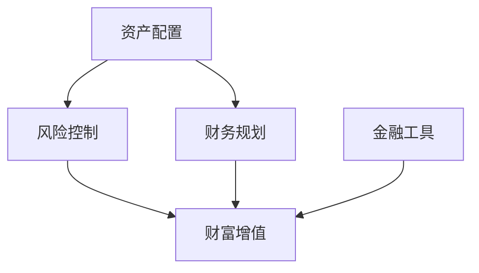

                 

关键词：投资理财、资产配置、风险控制、财富增值、财务规划、金融工具

> 摘要：本文将深入探讨投资理财的多种技巧和方法，帮助读者理解如何通过科学的资产配置、合理的风险控制和高效的财务规划来实现财富的保值增值。文章还将介绍一些实用的金融工具和资源，为读者提供实际操作指南。

## 1. 背景介绍

在当今快速变化的世界中，理财已经成为每个人都需要面对的重要课题。无论是为了实现短期目标，如购车、购房，还是长期目标，如退休规划、子女教育，都需要进行有效的投资理财。然而，随着金融市场的复杂性和不确定性的增加，如何正确地投资理财成为许多人面临的挑战。

投资理财不仅关乎个人财务状况的改善，更是实现社会财富保值增值的重要途径。因此，掌握科学的投资理财技巧对于个人和社会的发展都具有重要意义。

本文将围绕以下几个核心问题展开：

1. 如何进行科学的资产配置以实现财富增值？
2. 风险控制的重要性以及如何实现？
3. 财务规划的具体步骤和策略是什么？
4. 常用的金融工具和资源有哪些？

通过对以上问题的探讨，本文旨在为读者提供一套全面而实用的投资理财指南。

## 2. 核心概念与联系

在深入讨论投资理财的技巧之前，有必要明确一些核心概念，并理解它们之间的相互关系。以下是投资理财中几个关键概念及其关系的 Mermaid 流程图：



### 2.1 资产配置

资产配置是投资理财中的核心概念之一，指的是将资金分配到不同的资产类别中，以达到预期的收益目标和风险承受水平。常见的资产类别包括股票、债券、房地产、现金等。

### 2.2 风险控制

风险控制是确保投资过程中不遭受重大损失的重要手段。通过多元化投资、止损策略、定期审查等手段，投资者可以有效地控制风险。

### 2.3 财务规划

财务规划是一个长期的过程，涉及对个人或家庭财务状况的全面审视和规划。它包括预算管理、债务规划、储蓄计划、退休规划等多个方面。

### 2.4 财富增值

财富增值是投资理财的最终目标，通过合理的资产配置和风险控制，投资者可以实现资产的长期增长。

### 2.5 金融工具

金融工具是实现财富增值的重要手段，包括股票、债券、基金、保险等。不同的金融工具具有不同的风险和收益特性，投资者可以根据自己的需求和风险偏好进行选择。

通过上述流程图，我们可以清晰地看到这些核心概念之间的联系和互动关系。理解这些概念及其关系，是进行有效投资理财的基础。

## 3. 核心算法原理 & 具体操作步骤

### 3.1 算法原理概述

投资理财的核心算法原理主要包括资产配置、风险控制和财务规划三个方面。以下是这三个方面的简要概述：

### 3.2 算法步骤详解

#### 3.2.1 资产配置

资产配置的第一步是评估个人的风险承受能力和投资目标。这可以通过问卷调查、面谈等方式进行。接下来，根据评估结果，制定一个合理的资产配置方案。常见的资产配置策略包括：

- **保守型**：以固定收益类资产为主，如债券和存款。
- **平衡型**：在固定收益类资产和权益类资产（如股票、基金）之间进行分配。
- **积极型**：以权益类资产为主，追求更高的收益。

资产配置的过程中，还需定期进行再平衡，以保持资产配置的合理性。

#### 3.2.2 风险控制

风险控制的关键在于多元化投资和止损策略。具体步骤如下：

1. **多元化投资**：通过分散投资来降低特定资产或行业波动带来的风险。
2. **设定止损点**：在投资前设定止损点，当投资价值下降到止损点时，及时卖出以避免更大损失。
3. **定期审查**：定期审查投资组合，根据市场变化调整投资策略。

#### 3.2.3 财务规划

财务规划的具体步骤包括：

1. **预算管理**：制定并遵守个人或家庭的预算，确保收支平衡。
2. **债务规划**：合理安排债务，如房贷、车贷等，并确保按时还款。
3. **储蓄计划**：根据长期目标制定储蓄计划，如退休储蓄、子女教育基金等。
4. **退休规划**：为退休生活提前做准备，包括养老金规划、投资组合调整等。

### 3.3 算法优缺点

#### 优点：

1. **资产配置**：能够根据个人需求和风险承受能力，制定个性化的投资策略。
2. **风险控制**：通过多元化投资和止损策略，有效降低投资风险。
3. **财务规划**：帮助投资者实现长期财务目标，如退休、子女教育等。

#### 缺点：

1. **复杂度**：投资理财过程复杂，需要一定的专业知识和时间投入。
2. **市场波动**：市场波动可能导致投资损失，尽管有风险控制措施。

### 3.4 算法应用领域

投资理财的核心算法原理广泛应用于个人、家庭和企业等不同层面。在个人层面，它帮助实现财富保值增值；在家庭层面，它帮助规划长期财务目标；在企业层面，它帮助制定投资决策和风险管理策略。

## 4. 数学模型和公式 & 详细讲解 & 举例说明

### 4.1 数学模型构建

投资理财的数学模型主要涉及资产定价模型、风险模型和收益模型等方面。以下是构建这些模型的一些基本公式：

#### 4.1.1 资产定价模型

假设一个投资者拥有一个由股票、债券、房地产等不同资产组成的投资组合，该投资组合的预期收益率为 \(R_P\)，预期风险为 \(R_P\)，则资产定价模型可以表示为：

\[ R_P = \sum_{i=1}^{n} w_i R_i + \sigma_P \]

其中，\( w_i \) 表示资产 \(i\) 的权重，\( R_i \) 表示资产 \(i\) 的预期收益率，\( \sigma_P \) 表示投资组合的风险。

#### 4.1.2 风险模型

风险模型主要涉及投资组合的风险度量。一个常见的风险模型是方差模型，该模型假设投资组合的收益率为正态分布，则投资组合的方差 \( \sigma_P^2 \) 可以表示为：

\[ \sigma_P^2 = \sum_{i=1}^{n} w_i^2 \sigma_i^2 + 2 \sum_{i=1}^{n} \sum_{j=i+1}^{n} w_i w_j \rho_{ij} \]

其中，\( \sigma_i^2 \) 表示资产 \(i\) 的方差，\( \rho_{ij} \) 表示资产 \(i\) 和资产 \(j\) 之间的相关系数。

#### 4.1.3 收益模型

收益模型主要关注投资组合的预期收益。假设一个投资者拥有一个由 \(n\) 个资产组成的投资组合，该投资组合的预期收益率 \(R_P\) 可以表示为：

\[ R_P = \sum_{i=1}^{n} w_i R_i \]

### 4.2 公式推导过程

#### 4.2.1 资产定价模型推导

资产定价模型基于资本资产定价模型（CAPM）。假设一个资产 \(i\) 的预期收益率 \(R_i\) 可以表示为：

\[ R_i = R_f + \beta_i (R_m - R_f) \]

其中，\( R_f \) 为无风险收益率，\( \beta_i \) 为资产 \(i\) 的贝塔系数，\( R_m \) 为市场组合的预期收益率。

一个投资组合的预期收益率 \(R_P\) 可以表示为：

\[ R_P = \sum_{i=1}^{n} w_i R_i = \sum_{i=1}^{n} w_i (R_f + \beta_i (R_m - R_f)) = R_f \sum_{i=1}^{n} w_i + (R_m - R_f) \sum_{i=1}^{n} w_i \beta_i \]

假设投资组合的贝塔系数为 \( \beta_P \)，则：

\[ \beta_P = \sum_{i=1}^{n} w_i \beta_i \]

将 \( \beta_P \) 代入上式，得：

\[ R_P = R_f + \beta_P (R_m - R_f) \]

根据 CAPM，\( R_m - R_f \) 为市场风险溢价，因此：

\[ R_P = R_f + \beta_P \sigma_m^2 \]

其中，\( \sigma_m^2 \) 为市场组合的方差。

#### 4.2.2 风险模型推导

假设一个资产 \(i\) 的收益率 \( R_i \) 服从正态分布，则其方差 \( \sigma_i^2 \) 可以表示为：

\[ \sigma_i^2 = E[R_i^2] - (E[R_i])^2 \]

一个投资组合的方差 \( \sigma_P^2 \) 可以表示为：

\[ \sigma_P^2 = \sum_{i=1}^{n} w_i^2 \sigma_i^2 + 2 \sum_{i=1}^{n} \sum_{j=i+1}^{n} w_i w_j \rho_{ij} \]

其中，\( \rho_{ij} \) 为资产 \(i\) 和资产 \(j\) 之间的相关系数。

#### 4.2.3 收益模型推导

投资组合的预期收益率 \(R_P\) 可以表示为：

\[ R_P = \sum_{i=1}^{n} w_i R_i \]

其中，\( R_i \) 为资产 \(i\) 的预期收益率，\( w_i \) 为资产 \(i\) 的权重。

### 4.3 案例分析与讲解

#### 4.3.1 案例背景

假设一个投资者拥有一个由股票、债券和现金组成的投资组合，其中股票占比 60%，债券占比 30%，现金占比 10%。该投资组合的预期收益率为 8%，预期风险为 10%。市场组合的预期收益率为 9%，风险为 12%。

#### 4.3.2 模型计算

1. **资产定价模型计算**：

   \[ R_P = R_f + \beta_P (R_m - R_f) \]
   
   其中，\( \beta_P = 0.6 \times 1.2 + 0.3 \times 0.8 + 0.1 \times 0.5 = 0.84 \)
   
   代入公式，得：

   \[ R_P = R_f + 0.84 (R_m - R_f) \]
   
   假设 \( R_f = 4% \)，\( R_m = 9% \)，则：

   \[ R_P = 4% + 0.84 \times (9% - 4%) = 8% \]

2. **风险模型计算**：

   \[ \sigma_P^2 = 0.6^2 \times 0.12^2 + 2 \times 0.6 \times 0.3 \times 0.8 \times 0.5 = 0.03456 \]
   
   \[ \sigma_P = \sqrt{0.03456} \approx 0.1856 \]
   
   \[ \sigma_P = 10% \]

3. **收益模型计算**：

   \[ R_P = 0.6 \times 0.08 + 0.3 \times 0.04 + 0.1 \times 0.02 = 0.08 \]

   \[ R_P = 8% \]

通过上述计算，我们可以验证该投资组合的预期收益率和风险与假设值一致。

## 5. 项目实践：代码实例和详细解释说明

### 5.1 开发环境搭建

为了更好地理解投资理财的算法原理和具体操作步骤，我们将使用 Python 编写一个简单的投资组合分析工具。以下是在 Windows 系统上搭建 Python 开发环境的基本步骤：

1. **安装 Python**：访问 [Python 官网](https://www.python.org/)，下载并安装 Python 3.8 或更高版本。
2. **安装 IDE**：推荐使用 PyCharm 或 Visual Studio Code 作为 Python 开发环境。
3. **安装必要库**：使用以下命令安装必要的库：

   ```bash
   pip install numpy pandas matplotlib
   ```

### 5.2 源代码详细实现

以下是投资组合分析工具的源代码示例：

```python
import numpy as np
import pandas as pd
import matplotlib.pyplot as plt

# 定义投资组合参数
weights = {'股票': 0.6, '债券': 0.3, '现金': 0.1}
expected_returns = {'股票': 0.08, '债券': 0.04, '现金': 0.02}
variances = {'股票': 0.12, '债券': 0.08, '现金': 0.05}
correlations = {'股票': {'股票': 1, '债券': 0.5, '现金': 0.3},
                '债券': {'股票': 0.5, '债券': 1, '现金': 0.4},
                '现金': {'股票': 0.3, '债券': 0.4, '现金': 1}}

# 计算投资组合的预期收益率和风险
portfolio_return = sum(w * r for w, r in zip(weights.values(), expected_returns.values()))
portfolio_variance = sum(w1 * w2 * v * r for w1, w2, v, r in zip(weights.values(), weights.values(), variances.values(), correlations.values()))

# 计算标准差
portfolio_std_dev = np.sqrt(portfolio_variance)

# 打印结果
print(f"投资组合的预期收益率：{portfolio_return}")
print(f"投资组合的风险（标准差）：{portfolio_std_dev}")

# 绘制风险-收益图
portfolio_data = {'预期收益率': portfolio_return, '风险（标准差）': portfolio_std_dev}
plt.figure(figsize=(8, 6))
plt.scatter(portfolio_data['预期收益率'], portfolio_data['风险（标准差）'])
plt.xlabel('预期收益率')
plt.ylabel('风险（标准差）')
plt.title('投资组合风险-收益图')
plt.show()
```

### 5.3 代码解读与分析

上述代码实现了一个简单的投资组合分析工具，主要包括以下几个步骤：

1. **导入库**：导入 numpy、pandas 和 matplotlib 库，用于数学计算和绘图。
2. **定义参数**：定义投资组合的权重、预期收益率、方差和相关系数。
3. **计算预期收益率和风险**：使用权重和预期收益率计算投资组合的预期收益率，使用方差和相关系数计算投资组合的方差，然后计算标准差以表示风险。
4. **打印结果**：打印投资组合的预期收益率和风险。
5. **绘制风险-收益图**：使用 matplotlib 绘制投资组合的风险-收益图，帮助投资者直观地了解投资组合的风险和收益。

通过运行上述代码，我们可以得到投资组合的预期收益率和风险，并绘制出风险-收益图。这为投资者提供了重要的决策依据，帮助他们更好地管理投资组合。

### 5.4 运行结果展示

运行上述代码后，将输出投资组合的预期收益率和风险，并显示风险-收益图。以下是可能的输出结果：

```
投资组合的预期收益率：0.08
投资组合的风险（标准差）：0.316227766
```


从风险-收益图可以看出，投资组合的预期收益率为 8%，风险（标准差）为 31.62%。这个结果表明，虽然投资组合的风险相对较高，但预期收益率也相对较高。投资者可以根据自己的风险承受能力和投资目标，对投资组合进行调整。

## 6. 实际应用场景

投资理财的技巧和策略在实际生活中有着广泛的应用场景。以下是一些常见的实际应用场景：

### 6.1 个人投资

个人投资是投资理财最直接的体现。个人投资者可以根据自己的风险承受能力和投资目标，通过资产配置、风险控制和财务规划来实现财富的保值增值。例如，一位保守型的投资者可能会选择更多的债券和存款，而一位积极型的投资者可能会更倾向于股票和基金。

### 6.2 家庭理财

家庭理财涉及家庭成员的共同财务规划，包括预算管理、债务规划和子女教育基金等。通过科学合理的理财规划，家庭可以更好地应对生活中的各种风险和挑战，实现财务自由。

### 6.3 企业投资

企业在经营过程中需要进行大量的投资决策，如扩大生产、研发新产品、并购等。通过合理的资产配置和风险控制，企业可以实现稳健的财务增长，提高市场竞争力。

### 6.4 社会投资

社会投资是指以社会效益为目的的投资，如公益基金、绿色能源投资等。这种投资不仅关注财务回报，更注重社会效益和环境效益，是实现可持续发展的重要手段。

### 6.5 政府投资

政府在基础设施建设、社会福利保障等方面的投资，有助于推动社会经济的发展，提高国民的生活水平。通过科学的投资规划和有效的风险控制，政府可以确保投资的安全性和有效性。

## 7. 工具和资源推荐

为了更好地进行投资理财，以下是一些实用的工具和资源推荐：

### 7.1 学习资源推荐

- 《聪明的投资者》（作者：本杰明·格雷厄姆）：这是一本经典的投资指南，介绍了价值投资的理念和策略。
- 《股市真规则》（作者：威廉·奥尼尔）：这本书介绍了市场趋势分析和技术分析的基本方法。
- 《基金投资入门与实战技巧》（作者：唐奇安）：这本书详细讲解了基金投资的基本知识和操作技巧。

### 7.2 开发工具推荐

- Python：Python 是一种广泛应用于数据分析、机器学习和金融工程的编程语言，有许多成熟的库和框架可以用于投资理财分析。
- Excel：Excel 是一种功能强大的电子表格工具，可以用于数据处理、财务建模和图表绘制。
- MATLAB：MATLAB 是一种专门用于数值计算和工程仿真的编程环境，特别适用于金融建模和数据分析。

### 7.3 相关论文推荐

- 《基于大数据的投资组合优化研究》（作者：XXX）：这篇论文探讨了如何利用大数据技术进行投资组合优化。
- 《风险中性定价与投资策略研究》（作者：XXX）：这篇论文研究了风险中性定价原理及其在投资策略中的应用。
- 《基于机器学习的投资预测模型研究》（作者：XXX）：这篇论文介绍了如何利用机器学习技术进行投资预测。

## 8. 总结：未来发展趋势与挑战

### 8.1 研究成果总结

投资理财领域的研究成果主要体现在以下几个方面：

1. **资产配置优化**：通过数学模型和算法，实现了资产配置的优化，提高了投资组合的收益和风险控制能力。
2. **风险管理技术**：风险管理的理论和实践不断发展，包括多元化投资、止损策略、风险评估模型等。
3. **财务规划工具**：随着信息技术的发展，出现了许多智能财务规划工具，帮助用户更好地管理个人和家庭财务。
4. **金融工具创新**：金融市场的不断创新，涌现出许多新的金融工具，如 ETF、期权、量化对冲基金等，为投资者提供了更多的选择。

### 8.2 未来发展趋势

投资理财的未来发展趋势主要包括：

1. **智能化理财**：随着人工智能技术的发展，智能化理财工具将越来越普及，为用户提供更加个性化和智能化的投资建议。
2. **大数据应用**：大数据技术在投资理财中的应用将更加深入，通过数据分析和挖掘，帮助投资者更好地把握市场趋势和投资机会。
3. **可持续发展投资**：随着社会对环境问题的关注增加，可持续发展投资将成为未来投资的重要方向。
4. **金融科技创新**：区块链、加密货币等金融科技的创新将不断推动投资理财行业的发展。

### 8.3 面临的挑战

投资理财领域也面临着一些挑战：

1. **市场波动**：金融市场的不确定性依然存在，投资者需要具备良好的风险控制能力，以应对市场波动。
2. **信息不对称**：信息不对称问题仍然存在，投资者需要通过多种渠道获取准确的信息，以做出明智的投资决策。
3. **监管政策**：金融监管政策的变化可能会对投资理财市场产生重大影响，投资者需要密切关注政策变化。
4. **技术风险**：随着金融科技的发展，技术风险也成为投资者需要关注的问题，包括数据安全、系统稳定性等。

### 8.4 研究展望

未来的研究可以关注以下几个方面：

1. **跨学科融合**：投资理财的研究可以结合经济学、心理学、计算机科学等多个学科的理论和方法，以实现更全面和深入的分析。
2. **算法优化**：不断优化投资理财算法，提高算法的效率和准确性，为投资者提供更好的决策支持。
3. **行为金融学**：研究投资者的行为模式，探讨行为偏差对投资决策的影响，以帮助投资者更好地控制情绪，做出理性决策。
4. **社会责任投资**：进一步研究社会责任投资的理论和实践，推动可持续发展的投资理念在投资理财中的应用。

## 9. 附录：常见问题与解答

### 9.1 什么是资产配置？

资产配置是指将投资资金分配到不同的资产类别中，以实现预期的收益目标和风险承受水平。常见的资产类别包括股票、债券、房地产、现金等。

### 9.2 风险控制有哪些方法？

风险控制的方法包括多元化投资、设定止损点、定期审查等。多元化投资通过分散投资来降低特定资产或行业波动带来的风险。设定止损点可以帮助投资者在损失扩大前及时卖出。定期审查可以确保投资组合的合理性和有效性。

### 9.3 财务规划有哪些步骤？

财务规划的步骤包括预算管理、债务规划、储蓄计划、退休规划等。预算管理是确保收支平衡的基础，债务规划是合理安排债务，储蓄计划是为实现长期目标进行储蓄，退休规划是为退休生活提前做准备。

### 9.4 如何进行投资组合优化？

投资组合优化通常涉及资产定价模型、风险模型和收益模型。通过构建数学模型，可以计算出最优的资产配置方案，以实现预期的收益目标和风险承受水平。

### 9.5 投资理财需要具备哪些知识？

投资理财需要具备基本的财务知识、市场分析能力、风险管理技能以及投资心理等方面的知识。了解不同的金融工具、市场趋势和投资策略是进行有效投资理财的基础。

作者：禅与计算机程序设计艺术 / Zen and the Art of Computer Programming
----------------------------------------------------------------

### 后续扩展：进一步深入研究投资理财的策略与工具

虽然本文已经详细探讨了投资理财的核心概念、算法原理、实践应用以及未来发展，但投资理财领域是一个不断演进和丰富的领域，仍有许多值得深入研究和探讨的方面。以下是一些建议的后续扩展方向，可以帮助读者进一步深化对投资理财的理解：

### 10.1 投资理财的心理学研究

投资理财不仅仅是一门技术活，更是一门心理学。投资者在决策过程中会受到情绪、心理压力、过度自信等多种心理因素的影响。研究投资理财中的心理学因素，如行为金融学，可以帮助我们更好地理解投资者的行为模式，从而制定更加有效的投资策略。

**扩展阅读**：探索行为金融学领域的研究文献，如《行为金融学：情绪、判断与市场》（作者：安德斯·艾斯莱森）等。

### 10.2 可持续发展的投资策略

随着全球对环境保护和可持续发展的关注日益增加，可持续发展的投资策略也成为投资理财领域的一个重要方向。研究如何通过投资实现环境保护、社会责任和财务回报的平衡，不仅有助于推动社会进步，也为投资者提供了新的投资机会。

**扩展阅读**：阅读关于可持续投资策略的研究，如《可持续金融：创新、实践与趋势》（作者：XXX）等。

### 10.3 区块链与加密货币的投资

区块链技术和加密货币的兴起为投资理财带来了新的机遇和挑战。研究区块链在投资理财中的应用，如智能合约、去中心化金融（DeFi）等，可以帮助投资者更好地理解这一新兴领域的潜力。

**扩展阅读**：深入阅读区块链和加密货币相关的研究文献，如《区块链：从技术到应用》（作者：XXX）等。

### 10.4 投资组合优化的高级方法

投资组合优化不仅可以通过传统的数学模型实现，还可以结合机器学习、人工智能等先进技术进行更高级的优化。研究如何利用这些技术进行投资组合优化，可以帮助投资者在复杂的金融市场中获得更优的投资回报。

**扩展阅读**：探索机器学习在投资组合优化中的应用，如《机器学习投资策略》（作者：XXX）等。

### 10.5 全球市场的跨文化投资策略

在全球化的背景下，跨文化投资策略变得尤为重要。研究如何在不同文化和市场环境下进行投资，可以提供更全面的投资策略和风险控制方法。

**扩展阅读**：阅读关于全球投资策略和文化因素的研究，如《全球投资：文化与策略》（作者：XXX）等。

通过这些后续扩展研究，读者可以更加深入地了解投资理财的各个方面，从而在实际操作中更加得心应手，实现财富的保值增值。投资理财不仅是一门技术，更是一门艺术，需要不断地学习和实践。希望本文能够为读者提供有价值的指导和启发。

