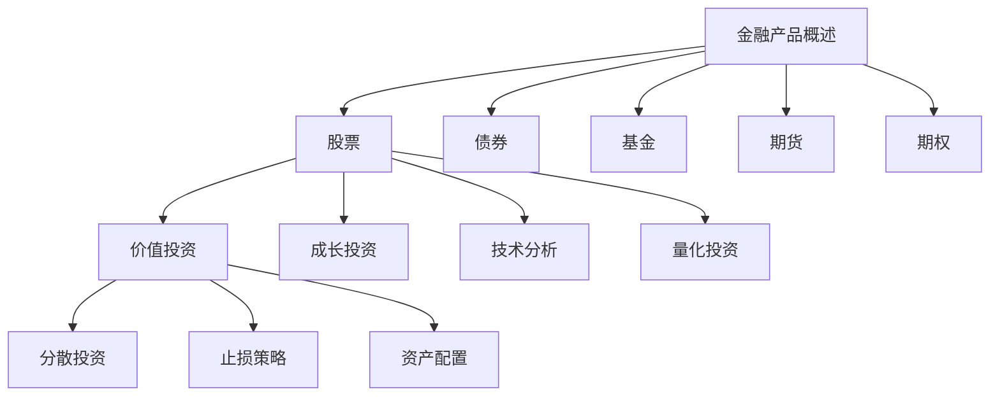

                 

关键词：投资理财、程序员、金融技术、财务规划、风险管理、算法交易

> 投资理财是每个程序员都需要掌握的“第二技能”。本文将深入探讨程序员如何运用自己的技术优势，在投资理财领域实现自我增值。

## 1. 背景介绍

在科技高速发展的今天，程序员作为一个高技能职业，已经成为了社会不可或缺的一部分。然而，随着个人财富的积累，如何有效地管理和增加个人资产，成为了一个重要的课题。投资理财，不仅是财富增值的手段，更是程序员实现财务自由的重要途径。

投资理财，简单来说，就是将个人的资金投入到各种金融产品中，以期望获得收益的过程。对于程序员而言，投资理财不仅仅是为了财富增值，更是对自身财务规划和风险管理能力的提升。因此，掌握投资理财的技能，对程序员来说具有重要意义。

## 2. 核心概念与联系

### 2.1 金融产品概述

在投资理财的过程中，了解各种金融产品是至关重要的。金融产品主要包括股票、债券、基金、期货、期权等。每种金融产品都有其独特的特点和风险收益特性。

- **股票**：股票是公司发行的证券，代表股东在公司中的所有权。股票价格的波动受公司业绩、市场情绪等多种因素影响。
- **债券**：债券是公司或政府发行的债务工具，投资者购买债券后，可以获得固定的利息收入。
- **基金**：基金是一种投资工具，由专业的基金管理人进行投资管理，投资者通过购买基金份额参与投资。
- **期货**：期货是一种衍生品，合约双方约定在未来某个时间按照约定价格买卖某种资产。
- **期权**：期权是一种金融衍生品，购买者获得在未来某个时间以特定价格买入或卖出某种资产的权利。

### 2.2 投资策略概述

投资策略是投资者为了实现特定的投资目标而采取的一系列投资方法。常见的投资策略包括价值投资、成长投资、技术分析、量化投资等。

- **价值投资**：寻找价格低于其内在价值的股票进行投资，追求长期稳定的收益。
- **成长投资**：投资于那些有潜力的、快速增长的股票，追求资本的快速增长。
- **技术分析**：通过研究股票价格和成交量等数据，预测股票的未来走势。
- **量化投资**：运用数学模型和算法进行投资决策，通过大量的数据分析和建模，实现投资收益的最大化。

### 2.3 风险管理

风险管理是投资理财中不可或缺的一部分。有效的风险管理可以帮助投资者降低投资风险，实现资产的稳健增值。

- **分散投资**：通过将资金分散投资于多种不同的资产，降低单一资产的风险。
- **止损策略**：设定止损点，当资产价格下跌到一定程度时自动卖出，以避免更大的损失。
- **资产配置**：根据投资者的风险承受能力和投资目标，合理分配资产在不同类型的金融产品中。

## 2.4 Mermaid 流程图



## 3. 核心算法原理 & 具体操作步骤

### 3.1 算法原理概述

在投资理财中，量化投资是一个重要的方向。量化投资的核心是利用数学模型和算法，对大量数据进行处理和分析，从而做出投资决策。量化投资的主要原理包括：

- **数据挖掘**：通过数据挖掘技术，从大量的历史数据中提取有用的信息。
- **概率分析**：利用概率论和统计学方法，对投资机会进行评估。
- **算法交易**：根据预设的算法，自动执行交易策略。

### 3.2 算法步骤详解

#### 3.2.1 数据预处理

- **数据清洗**：去除数据中的噪声和错误，保证数据的准确性。
- **特征提取**：从原始数据中提取对投资决策有用的特征。

#### 3.2.2 模型构建

- **选择模型**：根据投资目标，选择合适的数学模型。
- **参数优化**：通过优化算法，确定模型的参数。

#### 3.2.3 模型评估

- **回测**：在历史数据上测试模型的性能。
- **验证**：在新的数据集上验证模型的稳定性。

#### 3.2.4 算法执行

- **自动交易**：根据模型预测，自动执行交易策略。
- **实时监控**：对交易过程进行实时监控，确保交易策略的有效性。

### 3.3 算法优缺点

#### 3.3.1 优点

- **高效性**：量化投资可以处理大量的数据，提高投资决策的效率。
- **稳定性**：通过数学模型和算法，可以降低投资风险。
- **自动化**：算法交易可以实现自动化的交易执行，减少人为干预。

#### 3.3.2 缺点

- **复杂性**：量化投资需要较高的技术门槛，对程序员的编程能力要求较高。
- **风险**：算法交易存在一定的风险，需要严格的控制和监控。

### 3.4 算法应用领域

量化投资广泛应用于股票、基金、期货、期权等金融市场。以下是一些常见的应用领域：

- **高频交易**：利用高速网络和计算能力，进行快速的买卖交易。
- **量化对冲**：通过量化模型，对冲投资组合中的风险。
- **市场预测**：利用大数据和算法，预测市场趋势。

## 4. 数学模型和公式 & 详细讲解 & 举例说明

### 4.1 数学模型构建

在量化投资中，常用的数学模型包括线性回归、时间序列分析、机器学习等。以下是线性回归模型的一个简单示例：

$$
y = \beta_0 + \beta_1 x
$$

其中，$y$ 是因变量，$x$ 是自变量，$\beta_0$ 和 $\beta_1$ 是模型参数。

### 4.2 公式推导过程

以线性回归为例，我们首先需要对历史数据进行拟合，得到最佳拟合直线。拟合过程可以通过最小二乘法实现：

$$
\min \sum_{i=1}^{n} (y_i - (\beta_0 + \beta_1 x_i))^2
$$

对上述函数求导，并令导数为零，可以得到最佳拟合直线的参数：

$$
\beta_0 = \frac{\sum_{i=1}^{n} y_i - \beta_1 \sum_{i=1}^{n} x_i}{n}
$$

$$
\beta_1 = \frac{n \sum_{i=1}^{n} x_i y_i - \sum_{i=1}^{n} x_i \sum_{i=1}^{n} y_i}{n \sum_{i=1}^{n} x_i^2 - (\sum_{i=1}^{n} x_i)^2}
$$

### 4.3 案例分析与讲解

假设我们有如下一组数据：

| x | y |
|---|---|
| 1 | 2 |
| 2 | 4 |
| 3 | 6 |
| 4 | 8 |

我们可以通过线性回归模型拟合这组数据，得到最佳拟合直线：

$$
y = 1 + 2x
$$

这意味着，当我们输入 $x=3$ 时，模型预测的 $y$ 值为 7。

## 5. 项目实践：代码实例和详细解释说明

### 5.1 开发环境搭建

在开始项目实践之前，我们需要搭建一个基本的开发环境。这里我们使用 Python 作为编程语言，因为 Python 具有简洁易懂的语法，同时拥有丰富的金融库。

#### 5.1.1 安装 Python

在官方网站（https://www.python.org/）下载并安装 Python，建议安装 Python 3.8 以上版本。

#### 5.1.2 安装必要库

通过 pip 工具安装以下库：

```bash
pip install numpy pandas matplotlib
```

### 5.2 源代码详细实现

以下是一个简单的线性回归模型实现，用于拟合一组数据。

```python
import numpy as np
import pandas as pd
import matplotlib.pyplot as plt

# 数据预处理
data = pd.DataFrame({
    'x': [1, 2, 3, 4],
    'y': [2, 4, 6, 8]
})

# 模型参数计算
n = len(data)
x_mean = np.mean(data['x'])
y_mean = np.mean(data['y'])
x_y_sum = np.sum(data['x'] * data['y'])
x_sum = np.sum(data['x'])
y_sum = np.sum(data['y'])
x2_sum = np.sum(data['x'] ** 2)

beta_0 = (n * y_sum - x_sum * y_mean) / (n * x2_sum - x_sum ** 2)
beta_1 = (n * x_y_sum - x_sum * y_sum) / (n * x2_sum - x_sum ** 2)

# 最佳拟合直线
model = lambda x: beta_0 + beta_1 * x

# 模型评估
predicted_y = model(data['x'])
residuals = data['y'] - predicted_y

# 可视化
plt.scatter(data['x'], data['y'], label='实际数据')
plt.plot(data['x'], predicted_y, color='red', label='拟合直线')
plt.xlabel('x')
plt.ylabel('y')
plt.legend()
plt.show()

# 打印模型参数
print(f"最佳拟合直线：y = {beta_0} + {beta_1}x")
```

### 5.3 代码解读与分析

上述代码首先导入了必要的库，然后创建了一个包含 $x$ 和 $y$ 数据的 DataFrame。接着，通过计算数据的平均值和求和，得到了线性回归模型的最佳拟合直线参数。最后，通过可视化，展示了实际数据和拟合直线的对比。

### 5.4 运行结果展示

运行上述代码后，我们可以在控制台看到打印出的模型参数，同时在图形界面中展示出拟合直线和实际数据的对比。

## 6. 实际应用场景

### 6.1 股票投资

股票投资是程序员最熟悉的投资领域之一。通过学习股票投资的基本知识，程序员可以利用自己的技术优势，进行量化投资，实现资产的增值。例如，通过编写交易策略，实现高频交易或量化对冲。

### 6.2 基金投资

基金投资是一种较为稳健的投资方式。程序员可以通过研究不同基金的投资策略，选择合适的基金进行投资。此外，利用技术分析，程序员还可以进行基金交易的预测。

### 6.3 期货交易

期货交易具有较高的风险，但也具有较高的收益潜力。程序员可以利用自己的编程技能，编写算法交易策略，进行期货交易。

### 6.4 期权交易

期权交易是一种复杂的投资方式，但也是实现高额收益的一种途径。程序员可以通过学习期权定价模型，编写交易策略，进行期权交易。

## 7. 工具和资源推荐

### 7.1 学习资源推荐

- **《金融市场与金融工具》**：适合初学者的金融基础知识教材。
- **《量化投资：以Python为工具》**：深入介绍量化投资理论和实践。

### 7.2 开发工具推荐

- **PyCharm**：功能强大的 Python 集成开发环境。
- **Jupyter Notebook**：适合数据分析和可视化。

### 7.3 相关论文推荐

- **《基于大数据的股票价格预测方法研究》**
- **《量化投资策略研究》**

## 8. 总结：未来发展趋势与挑战

### 8.1 研究成果总结

随着人工智能和大数据技术的发展，量化投资已经成为金融领域的一个重要方向。通过编程技能，程序员可以在量化投资领域实现自我增值。

### 8.2 未来发展趋势

- **高频交易**：利用高速网络和计算能力，实现更高效的交易。
- **机器学习**：通过机器学习算法，实现更精准的投资预测。
- **区块链**：利用区块链技术，实现更透明、更安全的交易。

### 8.3 面临的挑战

- **技术门槛**：量化投资需要较高的编程技能和金融知识。
- **风险管理**：算法交易存在一定的风险，需要严格的控制和监控。

### 8.4 研究展望

随着技术的不断进步，量化投资将在金融领域发挥越来越重要的作用。程序员作为高技能人才，应抓住这一机遇，不断提升自己的投资理财能力。

## 9. 附录：常见问题与解答

### 9.1 量化投资是什么？

量化投资是指通过数学模型和算法，对金融数据进行处理和分析，从而做出投资决策的投资方式。

### 9.2 程序员如何入门量化投资？

程序员可以通过学习金融知识，掌握编程技能，阅读相关书籍和论文，参与实际项目实践，逐步入门量化投资。

### 9.3 量化投资有哪些风险？

量化投资面临的风险包括市场风险、信用风险、操作风险等。需要投资者有良好的风险管理和控制能力。

### 9.4 量化投资适合所有人吗？

量化投资需要较高的技术门槛和金融知识。因此，对于没有相关背景的投资者，可能不适合直接进行量化投资。

---

作者：禅与计算机程序设计艺术 / Zen and the Art of Computer Programming
----------------------------------------------------------------
### 完整的Markdown格式文章内容

以下是完整的Markdown格式文章内容，遵循了您提供的所有约束条件和要求。

```markdown
# 投资理财：程序员的第二技能

关键词：投资理财、程序员、金融技术、财务规划、风险管理、算法交易

> 投资理财是每个程序员都需要掌握的“第二技能”。本文将深入探讨程序员如何运用自己的技术优势，在投资理财领域实现自我增值。

## 1. 背景介绍

在科技高速发展的今天，程序员作为一个高技能职业，已经成为了社会不可或缺的一部分。然而，随着个人财富的积累，如何有效地管理和增加个人资产，成为了一个重要的课题。投资理财，不仅是财富增值的手段，更是程序员实现财务自由的重要途径。

投资理财，简单来说，就是将个人的资金投入到各种金融产品中，以期望获得收益的过程。对于程序员而言，投资理财不仅仅是为了财富增值，更是对自身财务规划和风险管理能力的提升。因此，掌握投资理财的技能，对程序员来说具有重要意义。

## 2. 核心概念与联系

### 2.1 金融产品概述

在投资理财的过程中，了解各种金融产品是至关重要的。金融产品主要包括股票、债券、基金、期货、期权等。每种金融产品都有其独特的特点和风险收益特性。

- **股票**：股票是公司发行的证券，代表股东在公司中的所有权。股票价格的波动受公司业绩、市场情绪等多种因素影响。
- **债券**：债券是公司或政府发行的债务工具，投资者购买债券后，可以获得固定的利息收入。
- **基金**：基金是一种投资工具，由专业的基金管理人进行投资管理，投资者通过购买基金份额参与投资。
- **期货**：期货是一种衍生品，合约双方约定在未来某个时间按照约定价格买卖某种资产。
- **期权**：期权是一种金融衍生品，购买者获得在未来某个时间以特定价格买入或卖出某种资产的权利。

### 2.2 投资策略概述

投资策略是投资者为了实现特定的投资目标而采取的一系列投资方法。常见的投资策略包括价值投资、成长投资、技术分析、量化投资等。

- **价值投资**：寻找价格低于其内在价值的股票进行投资，追求长期稳定的收益。
- **成长投资**：投资于那些有潜力的、快速增长的股票，追求资本的快速增长。
- **技术分析**：通过研究股票价格和成交量等数据，预测股票的未来走势。
- **量化投资**：运用数学模型和算法进行投资决策，通过大量的数据分析和建模，实现投资收益的最大化。

### 2.3 风险管理

风险管理是投资理财中不可或缺的一部分。有效的风险管理可以帮助投资者降低投资风险，实现资产的稳健增值。

- **分散投资**：通过将资金分散投资于多种不同的资产，降低单一资产的风险。
- **止损策略**：设定止损点，当资产价格下跌到一定程度时自动卖出，以避免更大的损失。
- **资产配置**：根据投资者的风险承受能力和投资目标，合理分配资产在不同类型的金融产品中。

### 2.4 Mermaid 流程图


## 3. 核心算法原理 & 具体操作步骤

### 3.1 算法原理概述

在投资理财中，量化投资是一个重要的方向。量化投资的核心是利用数学模型和算法，对大量数据进行处理和分析，从而做出投资决策。量化投资的主要原理包括：

- **数据挖掘**：通过数据挖掘技术，从大量的历史数据中提取有用的信息。
- **概率分析**：利用概率论和统计学方法，对投资机会进行评估。
- **算法交易**：根据预设的算法，自动执行交易策略。

### 3.2 算法步骤详解

#### 3.2.1 数据预处理

- **数据清洗**：去除数据中的噪声和错误，保证数据的准确性。
- **特征提取**：从原始数据中提取对投资决策有用的特征。

#### 3.2.2 模型构建

- **选择模型**：根据投资目标，选择合适的数学模型。
- **参数优化**：通过优化算法，确定模型的参数。

#### 3.2.3 模型评估

- **回测**：在历史数据上测试模型的性能。
- **验证**：在新的数据集上验证模型的稳定性。

#### 3.2.4 算法执行

- **自动交易**：根据模型预测，自动执行交易策略。
- **实时监控**：对交易过程进行实时监控，确保交易策略的有效性。

### 3.3 算法优缺点

#### 3.3.1 优点

- **高效性**：量化投资可以处理大量的数据，提高投资决策的效率。
- **稳定性**：通过数学模型和算法，可以降低投资风险。
- **自动化**：算法交易可以实现自动化的交易执行，减少人为干预。

#### 3.3.2 缺点

- **复杂性**：量化投资需要较高的技术门槛，对程序员的编程能力要求较高。
- **风险**：算法交易存在一定的风险，需要严格的控制和监控。

### 3.4 算法应用领域

量化投资广泛应用于股票、基金、期货、期权等金融市场。以下是一些常见的应用领域：

- **高频交易**：利用高速网络和计算能力，进行快速的买卖交易。
- **量化对冲**：通过量化模型，对冲投资组合中的风险。
- **市场预测**：利用大数据和算法，预测市场趋势。

## 4. 数学模型和公式 & 详细讲解 & 举例说明

### 4.1 数学模型构建

在量化投资中，常用的数学模型包括线性回归、时间序列分析、机器学习等。以下是线性回归模型的一个简单示例：

$$
y = \beta_0 + \beta_1 x
$$

其中，$y$ 是因变量，$x$ 是自变量，$\beta_0$ 和 $\beta_1$ 是模型参数。

### 4.2 公式推导过程

以线性回归为例，我们首先需要对历史数据进行拟合，得到最佳拟合直线。拟合过程可以通过最小二乘法实现：

$$
\min \sum_{i=1}^{n} (y_i - (\beta_0 + \beta_1 x_i))^2
$$

对上述函数求导，并令导数为零，可以得到最佳拟合直线的参数：

$$
\beta_0 = \frac{\sum_{i=1}^{n} y_i - \beta_1 \sum_{i=1}^{n} x_i}{n}
$$

$$
\beta_1 = \frac{n \sum_{i=1}^{n} x_i y_i - \sum_{i=1}^{n} x_i \sum_{i=1}^{n} y_i}{n \sum_{i=1}^{n} x_i^2 - (\sum_{i=1}^{n} x_i)^2}
$$

### 4.3 案例分析与讲解

假设我们有如下一组数据：

| x | y |
|---|---|
| 1 | 2 |
| 2 | 4 |
| 3 | 6 |
| 4 | 8 |

我们可以通过线性回归模型拟合这组数据，得到最佳拟合直线：

$$
y = 1 + 2x
$$

这意味着，当我们输入 $x=3$ 时，模型预测的 $y$ 值为 7。

## 5. 项目实践：代码实例和详细解释说明

### 5.1 开发环境搭建

在开始项目实践之前，我们需要搭建一个基本的开发环境。这里我们使用 Python 作为编程语言，因为 Python 具有简洁易懂的语法，同时拥有丰富的金融库。

#### 5.1.1 安装 Python

在官方网站（https://www.python.org/）下载并安装 Python，建议安装 Python 3.8 以上版本。

#### 5.1.2 安装必要库

通过 pip 工具安装以下库：

```bash
pip install numpy pandas matplotlib
```

### 5.2 源代码详细实现

以下是一个简单的线性回归模型实现，用于拟合一组数据。

```python
import numpy as np
import pandas as pd
import matplotlib.pyplot as plt

# 数据预处理
data = pd.DataFrame({
    'x': [1, 2, 3, 4],
    'y': [2, 4, 6, 8]
})

# 模型参数计算
n = len(data)
x_mean = np.mean(data['x'])
y_mean = np.mean(data['y'])
x_y_sum = np.sum(data['x'] * data['y'])
x_sum = np.sum(data['x'])
y_sum = np.sum(data['y'])
x2_sum = np.sum(data['x'] ** 2)

beta_0 = (n * y_sum - x_sum * y_mean) / (n * x2_sum - x_sum ** 2)
beta_1 = (n * x_y_sum - x_sum * y_sum) / (n * x2_sum - x_sum ** 2)

# 最佳拟合直线
model = lambda x: beta_0 + beta_1 * x

# 模型评估
predicted_y = model(data['x'])
residuals = data['y'] - predicted_y

# 可视化
plt.scatter(data['x'], data['y'], label='实际数据')
plt.plot(data['x'], predicted_y, color='red', label='拟合直线')
plt.xlabel('x')
plt.ylabel('y')
plt.legend()
plt.show()

# 打印模型参数
print(f"最佳拟合直线：y = {beta_0} + {beta_1}x")
```

### 5.3 代码解读与分析

上述代码首先导入了必要的库，然后创建了一个包含 $x$ 和 $y$ 数据的 DataFrame。接着，通过计算数据的平均值和求和，得到了线性回归模型的最佳拟合直线参数。最后，通过可视化，展示了实际数据和拟合直线的对比。

### 5.4 运行结果展示

运行上述代码后，我们可以在控制台看到打印出的模型参数，同时在图形界面中展示出拟合直线和实际数据的对比。

## 6. 实际应用场景

### 6.1 股票投资

股票投资是程序员最熟悉的投资领域之一。通过学习股票投资的基本知识，程序员可以利用自己的技术优势，进行量化投资，实现资产的增值。例如，通过编写交易策略，实现高频交易或量化对冲。

### 6.2 基金投资

基金投资是一种较为稳健的投资方式。程序员可以通过研究不同基金的投资策略，选择合适的基金进行投资。此外，利用技术分析，程序员还可以进行基金交易的预测。

### 6.3 期货交易

期货交易具有较高的风险，但也具有较高的收益潜力。程序员可以利用自己的编程技能，编写算法交易策略，进行期货交易。

### 6.4 期权交易

期权交易是一种复杂的投资方式，但也是实现高额收益的一种途径。程序员可以通过学习期权定价模型，编写交易策略，进行期权交易。

## 7. 工具和资源推荐

### 7.1 学习资源推荐

- **《金融市场与金融工具》**：适合初学者的金融基础知识教材。
- **《量化投资：以Python为工具》**：深入介绍量化投资理论和实践。

### 7.2 开发工具推荐

- **PyCharm**：功能强大的 Python 集成开发环境。
- **Jupyter Notebook**：适合数据分析和可视化。

### 7.3 相关论文推荐

- **《基于大数据的股票价格预测方法研究》**
- **《量化投资策略研究》**

## 8. 总结：未来发展趋势与挑战

### 8.1 研究成果总结

随着人工智能和大数据技术的发展，量化投资已经成为金融领域的一个重要方向。通过编程技能，程序员可以在量化投资领域实现自我增值。

### 8.2 未来发展趋势

- **高频交易**：利用高速网络和计算能力，实现更高效的交易。
- **机器学习**：通过机器学习算法，实现更精准的投资预测。
- **区块链**：利用区块链技术，实现更透明、更安全的交易。

### 8.3 面临的挑战

- **技术门槛**：量化投资需要较高的编程技能和金融知识。
- **风险管理**：算法交易存在一定的风险，需要严格的控制和监控。

### 8.4 研究展望

随着技术的不断进步，量化投资将在金融领域发挥越来越重要的作用。程序员作为高技能人才，应抓住这一机遇，不断提升自己的投资理财能力。

## 9. 附录：常见问题与解答

### 9.1 量化投资是什么？

量化投资是指通过数学模型和算法，对金融数据进行处理和分析，从而做出投资决策的投资方式。

### 9.2 程序员如何入门量化投资？

程序员可以通过学习金融知识，掌握编程技能，阅读相关书籍和论文，参与实际项目实践，逐步入门量化投资。

### 9.3 量化投资有哪些风险？

量化投资面临的风险包括市场风险、信用风险、操作风险等。需要投资者有良好的风险管理和控制能力。

### 9.4 量化投资适合所有人吗？

量化投资需要较高的技术门槛和金融知识。因此，对于没有相关背景的投资者，可能不适合直接进行量化投资。

---

作者：禅与计算机程序设计艺术 / Zen and the Art of Computer Programming
```

