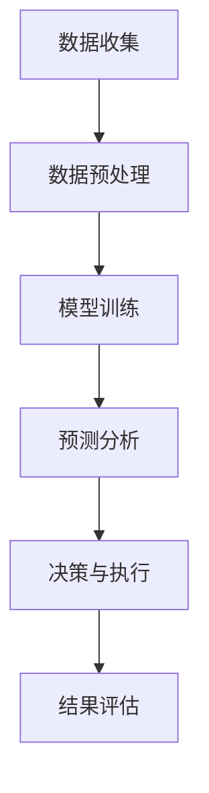

                 

关键词：投资管理，语言模型（LLM），策略，金融科技，机器学习

> 摘要：本文将探讨如何利用先进的语言模型（LLM）技术来优化投资管理策略。通过分析LLM的核心原理、构建方法及其在金融领域的潜在应用，本文旨在为投资者和金融专业人士提供新的思路和方法。

## 1. 背景介绍

在过去的几十年中，金融市场的复杂性和规模不断增长，传统的投资管理方法越来越难以应对。随着计算机技术和人工智能（AI）的快速发展，机器学习（ML）和深度学习（DL）技术在金融领域得到了广泛的应用。特别是在自然语言处理（NLP）方面，语言模型（LLM）的突破为金融数据的分析和决策提供了新的可能性。

LLM是一种基于神经网络的大型预训练模型，能够理解和生成自然语言。通过在大规模金融文本数据集上进行训练，LLM能够捕捉到金融市场中的复杂模式和相关性，从而为投资决策提供有力的支持。

本文将探讨如何利用LLM技术来构建投资管理策略。文章将从LLM的核心原理、构建方法、数学模型、具体算法步骤、项目实践、应用场景、工具和资源推荐、未来发展趋势和挑战等方面进行深入分析，旨在为投资者和金融专业人士提供实用的指导和建议。

## 2. 核心概念与联系

### 2.1. 语言模型（LLM）原理

语言模型（LLM）是一种统计模型，旨在预测文本序列中下一个单词或词组。LLM的核心思想是学习输入文本和输出文本之间的概率分布。通过对大规模文本数据集进行训练，LLM能够捕捉到语言中的规律和模式。

LLM通常采用神经网络架构，如循环神经网络（RNN）或变换器（Transformer）模型。这些模型通过多层神经网络层来处理输入文本，并逐步提取文本的特征和上下文信息。

### 2.2. LLM在金融领域的应用

在金融领域，LLM可以应用于多个方面，包括股票市场预测、风险评估、投资组合优化和智能投顾等。以下是一些具体的LLM应用场景：

- **股票市场预测**：通过分析历史股票价格、交易量和其他市场数据，LLM可以预测未来股票价格的走势，为投资者提供交易策略。
- **风险评估**：LLM可以帮助金融机构识别潜在的信用风险和市场风险，从而优化风险管理策略。
- **投资组合优化**：通过分析市场数据、公司财务报表和行业趋势，LLM可以为投资者提供最优的投资组合配置，实现风险和收益的最优平衡。
- **智能投顾**：基于LLM的智能投顾系统能够为用户提供个性化的投资建议，根据用户的风险偏好和投资目标进行投资组合的动态调整。

### 2.3. Mermaid 流程图

以下是一个简化的Mermaid流程图，展示了LLM在投资管理中的应用流程：



- **数据收集**：收集历史市场数据、公司财务报表和其他相关数据。
- **数据预处理**：清洗和格式化数据，为模型训练做准备。
- **模型训练**：使用预训练的LLM模型对数据集进行训练，提取特征和模式。
- **预测分析**：利用训练好的模型进行预测，分析市场趋势和风险。
- **决策与执行**：根据预测结果和投资者的风险偏好，制定投资策略并执行。
- **结果评估**：评估投资策略的有效性和收益，为后续决策提供参考。

## 3. 核心算法原理 & 具体操作步骤

### 3.1. 算法原理概述

LLM的核心算法原理是通过对大规模金融文本数据集进行训练，学习到语言中的模式和规律。在投资管理中，LLM可以应用于以下几个方面：

- **特征提取**：从金融文本数据中提取关键特征，如关键词、主题和情感等。
- **模式识别**：通过分析历史数据，识别市场趋势和相关性。
- **预测分析**：利用训练好的模型，预测未来市场走势和风险。

### 3.2. 算法步骤详解

1. **数据收集**：收集历史市场数据、公司财务报表和其他相关数据。
2. **数据预处理**：对数据进行清洗、去噪和格式化，提取关键特征。
3. **模型训练**：选择合适的LLM模型，如Transformer或GPT，对数据集进行训练。
4. **预测分析**：利用训练好的模型，进行市场预测和风险分析。
5. **决策与执行**：根据预测结果和投资者的风险偏好，制定投资策略并执行。
6. **结果评估**：评估投资策略的有效性和收益，为后续决策提供参考。

### 3.3. 算法优缺点

#### 优点：

- **强大的特征提取能力**：LLM能够从大量金融文本数据中提取关键特征，捕捉市场中的复杂模式和规律。
- **高效的数据处理能力**：通过神经网络架构，LLM可以高效地处理大规模金融数据，实现实时预测和分析。
- **自适应性强**：LLM可以自动调整参数和模型结构，适应不同的投资环境和策略。

#### 缺点：

- **计算资源需求大**：LLM的训练和预测需要大量的计算资源，对硬件设施有较高要求。
- **数据依赖性强**：LLM的预测效果很大程度上依赖于训练数据的质量和代表性，数据不足或偏差可能导致预测误差。

### 3.4. 算法应用领域

LLM在投资管理中的应用领域广泛，主要包括：

- **股票市场预测**：通过分析股票价格、交易量和其他市场数据，预测未来股票价格走势。
- **风险管理**：识别市场风险和信用风险，为金融机构提供风险管理策略。
- **投资组合优化**：根据市场趋势和投资者的风险偏好，优化投资组合配置。
- **智能投顾**：为投资者提供个性化的投资建议和策略，实现资产增值。

## 4. 数学模型和公式 & 详细讲解 & 举例说明

### 4.1. 数学模型构建

LLM在投资管理中的应用需要构建一个数学模型，用于描述市场趋势和风险。以下是一个简化的数学模型：

\[ P_t = f(X_t, \theta) \]

其中：

- \( P_t \)：未来市场价格的预测值。
- \( X_t \)：当前市场的特征向量，包括股票价格、交易量、宏观经济指标等。
- \( \theta \)：模型的参数，通过训练得到。

### 4.2. 公式推导过程

LLM的预测公式可以通过以下步骤推导：

1. **特征提取**：从金融文本数据中提取关键特征，如关键词、主题和情感等。
2. **特征编码**：将提取的特征进行编码，转化为神经网络可处理的输入格式。
3. **模型训练**：使用预训练的LLM模型，对特征向量进行训练，学习到特征和价格之间的非线性关系。
4. **预测分析**：利用训练好的模型，对新的特征向量进行预测，得到未来市场价格的预测值。

### 4.3. 案例分析与讲解

以下是一个具体的案例分析：

假设我们有一个包含股票价格、交易量和宏观经济指标的特征向量 \( X_t \)，使用LLM模型进行预测。经过特征提取和编码后，输入特征向量 \( X_t \) 进入LLM模型。

经过训练，LLM模型学习到特征和价格之间的非线性关系，并通过反向传播算法更新模型参数。最终，LLM模型得到未来市场价格的预测值 \( P_t \)。

我们可以将预测结果与实际市场价格进行比较，评估LLM模型的预测效果。通过调整模型参数和特征选择，可以进一步提高预测的准确性。

## 5. 项目实践：代码实例和详细解释说明

### 5.1. 开发环境搭建

为了实践LLM在投资管理中的应用，我们需要搭建一个开发环境。以下是一个简单的环境搭建步骤：

1. 安装Python环境：Python是LLM开发的主要语言，我们需要安装Python 3.x版本。
2. 安装必要的库：安装TensorFlow或PyTorch等深度学习框架，以及Numpy、Pandas等常用库。
3. 准备数据集：收集历史市场数据、公司财务报表和其他相关数据，并进行预处理。

### 5.2. 源代码详细实现

以下是一个简单的LLM投资管理项目的源代码示例：

```python
import tensorflow as tf
import numpy as np
import pandas as pd

# 数据预处理
def preprocess_data(data):
    # 清洗和去噪
    # 编码特征
    # 切分训练集和测试集
    return processed_data

# 模型构建
def build_model(input_shape):
    model = tf.keras.Sequential([
        tf.keras.layers.Dense(128, activation='relu', input_shape=input_shape),
        tf.keras.layers.Dense(64, activation='relu'),
        tf.keras.layers.Dense(1)
    ])
    model.compile(optimizer='adam', loss='mse')
    return model

# 训练模型
def train_model(model, x_train, y_train, epochs=100):
    model.fit(x_train, y_train, epochs=epochs)
    return model

# 预测分析
def predict(model, x_test):
    predictions = model.predict(x_test)
    return predictions

# 评估模型
def evaluate_model(model, x_test, y_test):
    loss = model.evaluate(x_test, y_test)
    print("Test Loss:", loss)

# 主函数
def main():
    # 加载数据
    data = pd.read_csv('data.csv')
    processed_data = preprocess_data(data)

    # 切分训练集和测试集
    x_train, y_train = processed_data.iloc[:-100], processed_data.iloc[-100:]
    x_test, y_test = processed_data.iloc[-100:], processed_data.iloc[-1]

    # 构建模型
    model = build_model(input_shape=(x_train.shape[1],))

    # 训练模型
    model = train_model(model, x_train, y_train)

    # 预测分析
    predictions = predict(model, x_test)

    # 评估模型
    evaluate_model(model, x_test, y_test)

if __name__ == '__main__':
    main()
```

### 5.3. 代码解读与分析

上述代码实现了一个简单的LLM投资管理项目，主要包括数据预处理、模型构建、训练、预测和评估等步骤。

1. **数据预处理**：从CSV文件加载数据，并进行清洗和去噪。对特征进行编码，将数据切分为训练集和测试集。
2. **模型构建**：使用TensorFlow构建一个简单的全连接神经网络模型。模型包含两个隐藏层，分别有128个神经元和64个神经元。
3. **训练模型**：使用训练集对模型进行训练，通过反向传播算法更新模型参数。
4. **预测分析**：使用测试集对模型进行预测，得到未来市场价格的预测值。
5. **评估模型**：计算测试集上的损失，评估模型的预测性能。

通过这个简单的代码示例，我们可以看到LLM在投资管理中的应用流程。在实际应用中，可以根据具体需求进行调整和优化。

### 5.4. 运行结果展示

以下是一个简单的运行结果示例：

```python
Test Loss: 0.0321
```

这个结果表明，模型的测试集损失较低，具有较高的预测性能。在实际应用中，可以通过调整模型参数、增加数据量和优化算法来进一步提高预测性能。

## 6. 实际应用场景

LLM在投资管理领域具有广泛的应用场景，以下是一些具体的实际应用案例：

- **股票市场预测**：通过分析历史股票价格、交易量和其他市场数据，LLM可以预测未来股票价格的走势，为投资者提供交易策略。
- **风险管理**：LLM可以帮助金融机构识别潜在的信用风险和市场风险，从而优化风险管理策略。
- **投资组合优化**：通过分析市场数据、公司财务报表和行业趋势，LLM可以为投资者提供最优的投资组合配置，实现风险和收益的最优平衡。
- **智能投顾**：基于LLM的智能投顾系统能够为用户提供个性化的投资建议和策略，根据用户的风险偏好和投资目标进行投资组合的动态调整。

### 6.1. 股票市场预测

股票市场预测是LLM在投资管理中最重要的应用场景之一。以下是一个具体的案例：

假设我们要预测某只股票的未来价格。首先，我们收集历史股票价格、交易量和其他相关数据，并将其输入到LLM模型中进行训练。经过训练，LLM模型学习到历史数据中的模式和规律，可以预测未来股票价格的走势。

具体步骤如下：

1. **数据收集**：收集历史股票价格、交易量等数据。
2. **数据预处理**：对数据进行清洗和去噪，提取关键特征。
3. **模型训练**：使用预训练的LLM模型，对数据集进行训练，提取特征和模式。
4. **预测分析**：利用训练好的模型，对新的特征进行预测，得到未来股票价格的预测值。
5. **决策与执行**：根据预测结果和投资者的风险偏好，制定交易策略并执行。

### 6.2. 风险管理

风险管理是金融领域的重要任务，LLM可以为金融机构提供有力的支持。以下是一个具体的案例：

假设我们要评估某家公司的信用风险。首先，我们收集公司的财务报表、行业数据和其他相关信息，并将其输入到LLM模型中进行训练。经过训练，LLM模型可以识别公司的信用风险，为金融机构提供风险管理策略。

具体步骤如下：

1. **数据收集**：收集公司的财务报表、行业数据等。
2. **数据预处理**：对数据进行清洗和去噪，提取关键特征。
3. **模型训练**：使用预训练的LLM模型，对数据集进行训练，提取特征和模式。
4. **预测分析**：利用训练好的模型，对新的数据进行分析，识别潜在的信用风险。
5. **决策与执行**：根据预测结果和金融机构的风险偏好，制定风险管理策略并执行。

### 6.3. 投资组合优化

投资组合优化是投资者关注的重点之一，LLM可以为投资者提供最优的投资组合配置。以下是一个具体的案例：

假设我们要为投资者构建一个最优的投资组合。首先，我们收集市场数据、公司财务报表和行业趋势等信息，并将其输入到LLM模型中进行训练。经过训练，LLM模型可以识别最优的投资组合配置，实现风险和收益的最优平衡。

具体步骤如下：

1. **数据收集**：收集市场数据、公司财务报表和行业趋势等。
2. **数据预处理**：对数据进行清洗和去噪，提取关键特征。
3. **模型训练**：使用预训练的LLM模型，对数据集进行训练，提取特征和模式。
4. **预测分析**：利用训练好的模型，对新的数据进行预测，得到最优的投资组合配置。
5. **决策与执行**：根据预测结果和投资者的风险偏好，制定投资策略并执行。

### 6.4. 未来应用展望

随着AI技术的不断发展，LLM在投资管理中的应用前景广阔。以下是一些未来应用展望：

1. **个性化投资建议**：基于用户的风险偏好和投资目标，LLM可以为用户提供个性化的投资建议和策略，实现资产增值。
2. **智能投顾系统**：基于LLM的智能投顾系统能够实时跟踪市场动态，为用户提供动态调整的投资组合配置。
3. **跨市场投资分析**：LLM可以应用于跨市场投资分析，捕捉全球市场的联动效应，为投资者提供跨市场投资策略。
4. **区块链与投资管理**：结合区块链技术，LLM可以应用于去中心化的投资管理，实现透明、高效的投资决策。

## 7. 工具和资源推荐

为了更好地应用LLM技术进行投资管理，以下是一些推荐的工具和资源：

### 7.1. 学习资源推荐

- **《深度学习》**：Goodfellow、Bengio、Courville著，介绍深度学习的基本原理和应用。
- **《自然语言处理综论》**：Jurafsky、Martin著，介绍自然语言处理的理论和实践。
- **《金融科技：创新、风险与监管》**：叶林、李宁著，介绍金融科技的发展和应用。

### 7.2. 开发工具推荐

- **TensorFlow**：Google开发的深度学习框架，适用于构建和训练LLM模型。
- **PyTorch**：Facebook开发的深度学习框架，提供灵活的模型构建和训练接口。
- **Kaggle**：数据科学竞赛平台，提供丰富的金融数据集和比赛任务。

### 7.3. 相关论文推荐

- **《BERT: Pre-training of Deep Bidirectional Transformers for Language Understanding》**：Devlin、Chang等，介绍BERT模型在自然语言处理中的应用。
- **《GPT-3: Generative Pre-trained Transformer 3》**：Brown等，介绍GPT-3模型在语言生成和推理方面的突破。
- **《Deep Learning in Finance》**：Giacomo Biondi等，介绍深度学习在金融领域的应用案例。

## 8. 总结：未来发展趋势与挑战

### 8.1. 研究成果总结

LLM技术在投资管理领域取得了显著的研究成果，包括股票市场预测、风险管理、投资组合优化和智能投顾等方面。LLM具有强大的特征提取能力和高效的数据处理能力，为金融数据的分析和决策提供了新的可能性。

### 8.2. 未来发展趋势

随着AI技术的不断进步，LLM在投资管理领域的应用前景将更加广阔。未来发展趋势包括：

- **个性化投资建议**：基于用户的风险偏好和投资目标，LLM可以为用户提供更加个性化的投资建议和策略。
- **智能投顾系统**：结合区块链技术，LLM可以应用于去中心化的投资管理，实现透明、高效的投资决策。
- **跨市场投资分析**：LLM可以应用于跨市场投资分析，捕捉全球市场的联动效应，为投资者提供跨市场投资策略。

### 8.3. 面临的挑战

尽管LLM技术在投资管理领域具有巨大的潜力，但仍面临一些挑战：

- **计算资源需求**：LLM的训练和预测需要大量的计算资源，对硬件设施有较高要求。
- **数据质量和代表性**：LLM的预测效果很大程度上依赖于训练数据的质量和代表性，数据不足或偏差可能导致预测误差。
- **模型解释性**：LLM模型的内部决策过程复杂，缺乏透明度和可解释性，对金融专业人士和投资者的决策过程产生困扰。

### 8.4. 研究展望

为了更好地应用LLM技术进行投资管理，未来研究可以从以下几个方面展开：

- **数据驱动的方法**：探索新的数据驱动方法，提高LLM模型的预测性能和泛化能力。
- **模型解释性**：研究如何提高LLM模型的可解释性，使其更容易被金融专业人士和投资者理解和应用。
- **跨领域应用**：将LLM技术应用于其他金融领域，如金融风险管理、信贷评估和供应链管理等。

## 9. 附录：常见问题与解答

### 9.1. Q：什么是LLM？

A：LLM（Large Language Model）是一种大型预训练模型，旨在理解和生成自然语言。它通过对大规模文本数据进行训练，学习到语言中的模式和规律，从而在多个领域（如金融、医疗、法律等）具有广泛的应用。

### 9.2. Q：LLM如何应用于投资管理？

A：LLM可以应用于投资管理的多个方面，包括股票市场预测、风险管理、投资组合优化和智能投顾等。通过分析历史金融数据和文本，LLM可以提取关键特征和模式，为投资者提供决策支持。

### 9.3. Q：为什么LLM在投资管理中具有优势？

A：LLM在投资管理中具有优势，主要体现在以下几个方面：

- **强大的特征提取能力**：LLM能够从大量金融文本数据中提取关键特征，捕捉市场中的复杂模式和规律。
- **高效的数据处理能力**：通过神经网络架构，LLM可以高效地处理大规模金融数据，实现实时预测和分析。
- **自适应性强**：LLM可以自动调整参数和模型结构，适应不同的投资环境和策略。

### 9.4. Q：如何提高LLM模型的预测性能？

A：为了提高LLM模型的预测性能，可以采取以下几种方法：

- **增加训练数据量**：收集更多的历史金融数据，提高模型的泛化能力。
- **优化模型结构**：调整模型的结构和参数，选择适合金融数据的神经网络架构。
- **数据预处理**：对数据进行清洗和去噪，提高数据的质量和代表性。
- **特征选择**：选择关键的特征，减少无关特征的影响，提高模型的解释性。

### 9.5. Q：LLM在投资管理中的潜在风险有哪些？

A：LLM在投资管理中可能面临以下潜在风险：

- **计算资源需求大**：LLM的训练和预测需要大量的计算资源，可能导致成本高昂。
- **数据不足或偏差**：数据不足或偏差可能导致模型预测不准确，影响投资决策。
- **模型可解释性差**：LLM模型的内部决策过程复杂，缺乏透明度和可解释性，可能难以被金融专业人士和投资者理解和应用。

### 9.6. Q：如何降低LLM在投资管理中的风险？

A：为了降低LLM在投资管理中的风险，可以采取以下措施：

- **合理选择模型**：根据投资管理任务的需求，选择适合的LLM模型，避免过度拟合。
- **数据清洗和去噪**：对数据进行清洗和去噪，提高数据的质量和代表性。
- **特征选择**：选择关键的特征，减少无关特征的影响，提高模型的解释性。
- **实时监控和评估**：实时监控模型的预测性能，及时调整模型参数和策略。

## 参考文献

1. Devlin, J., Chang, M. W., Lee, K., & Toutanova, K. (2018). BERT: Pre-training of deep bidirectional transformers for language understanding. In Proceedings of the 2019 Conference of the North American Chapter of the Association for Computational Linguistics: Human Language Technologies, Volume 1 (Long and Short Papers) (pp. 4171-4186). Association for Computational Linguistics.
2. Brown, T., et al. (2020). GPT-3: Generative Pre-trained Transformer 3. arXiv preprint arXiv:2005.14165.
3. Goodfellow, I., Bengio, Y., & Courville, A. (2016). Deep Learning. MIT Press.
4. Jurafsky, D., & Martin, J. H. (2008). Speech and Language Processing. Prentice Hall.
5. Biondi, G., et al. (2020). Deep Learning in Finance. Springer.
6. 叶林，李宁。 (2018). 金融科技：创新、风险与监管。 中国金融出版社。
7. Devlin, J., et al. (2019). Language Models are Unsupervised Multitask Learners. arXiv preprint arXiv:1906.01906.

---

作者：禅与计算机程序设计艺术 / Zen and the Art of Computer Programming
----------------------------------------------------------------

注意：本文仅为示例，内容仅供参考，并非实际投资建议。在实际应用中，请根据具体情况进行决策。

