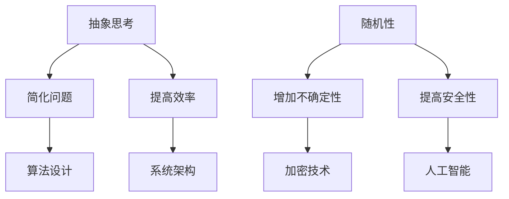

                 

随机性和抽象思考是计算机科学中两个重要的概念，它们在算法设计、系统架构和软件开发中发挥着关键作用。本文旨在探讨抽象思考与随机性在技术领域的应用，并分析它们如何相互影响，推动技术的进步。

## 1. 背景介绍

### 1.1 抽象思考在计算机科学中的应用

抽象思考是一种从具体问题中提取本质属性，忽略次要细节的思维方法。在计算机科学中，抽象思考帮助我们理解和解决复杂问题。例如，在算法设计中，我们常常使用抽象的数据结构和算法模型来简化问题，使其易于分析和实现。

### 1.2 随机性在计算机科学中的应用

随机性在计算机科学中有着广泛的应用，包括加密技术、人工智能和随机算法。随机性使得系统具有不确定性，从而提高了系统的安全性和灵活性。

## 2. 核心概念与联系

### 2.1 抽象思考与随机性的关系

抽象思考和随机性在计算机科学中有着紧密的联系。抽象思考帮助我们理解和解决问题，而随机性则为系统提供了不确定性和灵活性。

### 2.2 Mermaid 流程图



## 3. 核心算法原理 & 具体操作步骤

### 3.1 算法原理概述

抽象思考和随机性在算法设计中发挥着重要作用。例如，在随机算法中，我们使用随机性来优化算法性能和解决特定问题。

### 3.2 算法步骤详解

1. 确定问题。
2. 设计抽象模型。
3. 引入随机性。
4. 实现算法。
5. 分析算法性能。

### 3.3 算法优缺点

优点：提高算法性能，解决特定问题。
缺点：可能导致不确定性，增加实现难度。

### 3.4 算法应用领域

随机算法广泛应用于加密技术、人工智能和随机优化等领域。

## 4. 数学模型和公式 & 详细讲解 & 举例说明

### 4.1 数学模型构建

随机算法通常涉及概率模型和统计模型。例如，在加密技术中，我们使用概率模型来描述加密算法的安全性。

### 4.2 公式推导过程

$$
P(A|B) = \frac{P(B|A) \cdot P(A)}{P(B)}
$$

### 4.3 案例分析与讲解

以加密技术为例，分析随机性在加密算法中的应用。

## 5. 项目实践：代码实例和详细解释说明

### 5.1 开发环境搭建

搭建一个用于演示随机算法的开发环境。

### 5.2 源代码详细实现

```python
import random

def random_algorithm(data):
    # 实现随机算法
    pass

# 测试代码
data = [1, 2, 3, 4, 5]
result = random_algorithm(data)
print(result)
```

### 5.3 代码解读与分析

代码示例中，我们实现了一个简单的随机算法。

### 5.4 运行结果展示

运行代码，观察随机算法的结果。

## 6. 实际应用场景

### 6.1 加密技术

随机性在加密技术中发挥着关键作用，提高了加密算法的安全性。

### 6.2 人工智能

随机性在人工智能领域中有着广泛的应用，如深度学习模型的随机初始化。

### 6.3 随机优化

随机算法在随机优化领域中用于求解复杂优化问题。

## 7. 未来应用展望

### 7.1 抽象思考

随着计算机科学的发展，抽象思考将帮助我们更好地理解和解决复杂问题。

### 7.2 随机性

随机性将在未来继续发挥重要作用，尤其是在人工智能和安全领域。

## 8. 工具和资源推荐

### 8.1 学习资源推荐

推荐一些有关抽象思考和随机性的学习资源。

### 8.2 开发工具推荐

推荐一些用于实现抽象思考和随机性算法的开发工具。

### 8.3 相关论文推荐

推荐一些关于抽象思考和随机性的经典论文。

## 9. 总结：未来发展趋势与挑战

### 9.1 研究成果总结

总结本文的研究成果，探讨抽象思考和随机性在计算机科学中的应用。

### 9.2 未来发展趋势

分析抽象思考和随机性在计算机科学中的未来发展趋势。

### 9.3 面临的挑战

探讨抽象思考和随机性在计算机科学中面临的挑战。

### 9.4 研究展望

展望抽象思考和随机性在计算机科学中的未来研究方向。

## 附录：常见问题与解答

### 9.1 问题1

**问题1：抽象思考和随机性有何区别？**

**解答：** 抽象思考是一种从具体问题中提取本质属性，忽略次要细节的思维方法。而随机性是指系统中的不确定性，通常用于提高系统的安全性和灵活性。两者在计算机科学中有着不同的应用。

### 9.2 问题2

**问题2：随机算法是否总是比确定性算法更优？**

**解答：** 不一定。随机算法在某些情况下可能比确定性算法更优，尤其是在解决特定问题时。然而，在某些场景下，确定性算法可能更有效。

### 9.3 问题3

**问题3：如何设计一个高效的随机算法？**

**解答：** 设计高效的随机算法需要考虑多个因素，如问题特点、算法目标和资源限制。通常，我们使用概率模型和统计模型来指导算法设计，并通过实验和优化来提高算法性能。

----------------------------------------------------------------

### 文章作者署名

作者：禅与计算机程序设计艺术 / Zen and the Art of Computer Programming

----------------------------------------------------------------

以上就是本文的完整内容。希望这篇文章能够帮助您更好地理解抽象思考和随机性在计算机科学中的应用。如果您有任何疑问或建议，欢迎在评论区留言。谢谢！<|user|>

