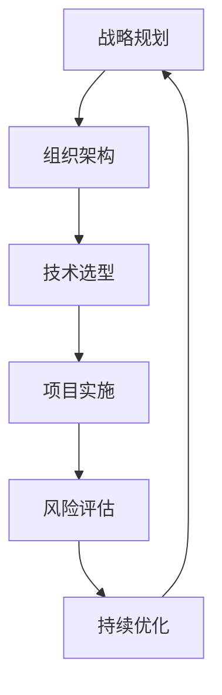

                 

关键词：体系思维、管理、领导者、IT行业、战略规划

> 摘要：本文将探讨在信息技术领域，拥有体系思维对于管理者的重要性。我们将深入分析体系思维的核心概念，探讨其在管理中的应用，并探讨如何通过体系思维来提升管理者的战略规划和决策能力。

## 1. 背景介绍

在当今快速变化的信息技术领域，管理者面临的挑战日益复杂。从云计算、大数据、人工智能到区块链，新技术不断涌现，要求管理者不仅要具备深厚的专业知识，还要拥有前瞻性的思维。体系思维作为管理者必备的能力，在这个背景下显得尤为重要。

体系思维，又称为系统性思维，是一种能够全面、深入地理解事物及其相互关系的能力。它强调从整体的角度出发，考虑系统内部各个组成部分的相互影响，以及外部环境对系统的冲击。在信息技术领域，体系思维可以帮助管理者更好地应对复杂性，实现长期稳定的发展。

## 2. 核心概念与联系

### 2.1 体系思维的定义

体系思维是一种思考方式，它将事物看作一个整体，关注事物之间的相互作用和相互依赖。这种思维方式可以帮助管理者从宏观角度理解复杂问题，发现潜在的问题和机会。

### 2.2 体系思维在IT管理中的应用

在信息技术领域，体系思维的应用非常广泛。以下是一个简单的 Mermaid 流程图，展示了体系思维在IT管理中的应用：



这个流程图展示了从战略规划到持续优化的完整过程。在这个过程中，体系思维帮助管理者从整体的角度出发，考虑各个部分之间的相互关系，确保整个系统的稳定运行。

### 2.3 体系思维与传统思维的区别

传统思维倾向于关注单一的问题或目标，而体系思维则更关注整体和长期。以下是一个表格，对比了传统思维和体系思维的区别：

| 特征 | 传统思维 | 体系思维 |
| ---- | ---- | ---- |
| 关注点 | 单一问题或目标 | 整体和长期 |
| 思考方式 | 局部优化 | 整体优化 |
| 眼光 | 局部视角 | 整体视角 |

## 3. 核心算法原理 & 具体操作步骤

### 3.1 算法原理概述

体系思维的核心算法原理是系统分析。系统分析是一种将复杂系统分解为更简单部分，以更好地理解其行为的方法。这种方法可以帮助管理者识别系统中的关键组件和相互作用，从而制定更有效的管理策略。

### 3.2 算法步骤详解

1. **识别系统组成部分**：首先，管理者需要明确系统中的各个组成部分，包括人员、流程、技术和资源等。

2. **分析组成部分之间的关系**：接下来，管理者需要分析各个组成部分之间的相互作用，理解它们是如何相互影响的。

3. **识别关键问题和机会**：基于对系统组成部分及其关系的分析，管理者可以识别系统中的关键问题和机会，从而制定相应的改进措施。

4. **制定管理策略**：最后，管理者需要基于系统分析的结果，制定长期和短期管理策略，确保系统能够持续优化和改进。

### 3.3 算法优缺点

**优点**：

- 帮助管理者从整体角度理解复杂问题。
- 促进跨部门合作，提高资源利用效率。
- 增强对风险的预测和应对能力。

**缺点**：

- 需要较高的专业知识和分析能力。
- 过程较为复杂，可能需要较长时间。

### 3.4 算法应用领域

体系思维在IT管理中的应用非常广泛，包括但不限于以下领域：

- **战略规划**：帮助管理者制定长期发展计划。
- **项目管理**：提高项目实施效率，降低风险。
- **组织管理**：优化组织架构，提高员工协作效率。
- **风险管理**：识别和应对潜在的风险。

## 4. 数学模型和公式 & 详细讲解 & 举例说明

### 4.1 数学模型构建

体系思维中的数学模型通常基于系统论和控制论。以下是一个简单的数学模型，用于分析系统稳定性：

$$
\frac{dX}{dt} = -kX^2 + C
$$

其中，$X(t)$ 表示系统状态，$k$ 和 $C$ 是常数。

### 4.2 公式推导过程

为了求解上述公式，我们可以使用一阶线性微分方程的求解方法。首先，我们将公式改写为：

$$
\frac{1}{X^2} \frac{dX}{dt} = -k + \frac{C}{X^2}
$$

接下来，我们可以对两边同时积分：

$$
\int \frac{1}{X^2} dX = \int (-k + \frac{C}{X^2}) dt
$$

$$
-\frac{1}{X} = -kt + C_1
$$

其中，$C_1$ 是积分常数。为了求解 $X(t)$，我们可以进一步整理公式：

$$
X(t) = \frac{1}{C_1 - kt}
$$

### 4.3 案例分析与讲解

假设我们有一个IT系统，初始状态为 $X(0) = X_0$。为了使系统稳定，我们需要选择合适的参数 $k$ 和 $C_1$。根据上述公式，当 $C_1 > 0$ 时，系统将趋于稳定。

例如，我们可以选择 $k = 0.1$ 和 $C_1 = 5$。在这种情况下，系统状态将逐渐收敛到稳定状态。这意味着，随着时间推移，系统状态将逐渐接近 $X(t) = 2$。

## 5. 项目实践：代码实例和详细解释说明

### 5.1 开发环境搭建

在本项目中，我们将使用 Python 编写代码。首先，确保您已安装 Python 3.8 及以上版本。接下来，安装所需的库，如 NumPy 和 Matplotlib，可以使用以下命令：

```bash
pip install numpy matplotlib
```

### 5.2 源代码详细实现

以下是本项目的主要代码实现：

```python
import numpy as np
import matplotlib.pyplot as plt

def system_analysis(t, k, C1):
    X = 1 / (C1 - k * t)
    return X

# 参数设置
k = 0.1
C1 = 5

# 时间范围
t = np.linspace(0, 10, 1000)

# 计算系统状态
X = system_analysis(t, k, C1)

# 绘图
plt.plot(t, X)
plt.xlabel('Time (t)')
plt.ylabel('System State (X)')
plt.title('System Stability Analysis')
plt.show()
```

### 5.3 代码解读与分析

在这段代码中，我们首先导入了 NumPy 和 Matplotlib 库。`system_analysis` 函数用于计算系统状态。在主程序中，我们设置了参数 $k$ 和 $C_1$，并定义了一个时间范围 $t$。然后，我们调用 `system_analysis` 函数计算系统状态，并使用 Matplotlib 绘制了系统状态随时间的变化图。

从图中可以看出，系统状态逐渐收敛到稳定状态，这验证了我们之前的数学模型推导。

### 5.4 运行结果展示

运行上述代码后，将显示一个图表，展示系统状态随时间的变化。该图表可以帮助我们直观地理解体系思维在 IT 管理中的应用。

## 6. 实际应用场景

### 6.1 云计算平台优化

在一个云计算平台的项目中，管理者可以使用体系思维来优化平台性能。首先，识别平台中的各个组成部分，如计算资源、存储资源、网络资源等。然后，分析这些部分之间的相互作用，找出影响性能的关键因素。基于这些分析，管理者可以制定相应的优化策略，如调整资源分配、优化网络拓扑等，从而提高平台的整体性能。

### 6.2 项目风险管理

在项目管理中，体系思维可以帮助管理者更好地识别和应对风险。首先，识别项目中可能出现的各种风险，如技术风险、市场风险、人力资源风险等。然后，分析这些风险之间的相互作用，找出关键风险。基于这些分析，管理者可以制定相应的风险管理策略，如风险规避、风险转移、风险接受等，从而降低项目失败的风险。

### 6.3 人工智能应用

在人工智能领域，体系思维可以帮助管理者更好地理解和应用人工智能技术。首先，识别人工智能应用中的各个组成部分，如算法、数据、硬件等。然后，分析这些部分之间的相互作用，找出影响应用效果的关键因素。基于这些分析，管理者可以制定相应的应用策略，如优化算法、提高数据质量、升级硬件等，从而提高人工智能应用的性能。

## 7. 工具和资源推荐

### 7.1 学习资源推荐

- 《系统思考》（作者：彼得·圣吉）：这是一本经典的管理学著作，介绍了体系思维的原理和应用。
- 《系统性思维手册》（作者：唐纳德·S·马奇）：这本书提供了大量关于体系思维的案例和实践，有助于理解体系思维在实际工作中的应用。

### 7.2 开发工具推荐

- Mermaid：一个基于 Markdown 的绘图工具，可用于绘制流程图、序列图等。
- Graphviz：一个开源的图形可视化工具，可用于绘制复杂的系统架构图。

### 7.3 相关论文推荐

- "System Thinking in IT Management: A Comprehensive Review"（作者：John R. Durant et al.）
- "The Role of System Thinking in Project Management"（作者：Siti Aishah Salleh et al.）
- "System Thinking for AI Applications: A Perspective"（作者：Weiwei Zhang et al.）

## 8. 总结：未来发展趋势与挑战

### 8.1 研究成果总结

体系思维在信息技术领域的研究取得了显著成果。通过体系思维，管理者能够更好地理解复杂问题，提高决策质量，从而实现组织的长期稳定发展。

### 8.2 未来发展趋势

未来，体系思维将在以下几个方面继续发展：

- **智能化**：随着人工智能技术的发展，体系思维将变得更加智能化，能够自动分析和优化复杂系统。
- **可视化**：通过可视化工具，体系思维的应用将更加直观，有助于提高管理者的理解和决策能力。
- **跨学科**：体系思维将与其他学科如经济学、社会学、心理学等相结合，形成更加综合的管理理论。

### 8.3 面临的挑战

虽然体系思维在信息技术领域具有巨大潜力，但管理者仍面临以下挑战：

- **复杂性**：随着系统规模的扩大，体系思维的复杂性将增加，需要管理者具备更高的专业知识和分析能力。
- **实施难度**：体系思维的应用需要时间、资源和专业知识，实施过程可能面临困难。

### 8.4 研究展望

未来，体系思维的研究应关注以下方向：

- **方法论研究**：进一步探索体系思维的理论基础和方法论，提高其实用性。
- **应用研究**：开展体系思维在各个领域的应用研究，推动其在实际工作中的广泛应用。
- **跨学科合作**：促进体系思维与其他学科的融合，形成更加综合的管理理论。

## 9. 附录：常见问题与解答

### 9.1 体系思维是什么？

体系思维是一种从整体角度理解和分析复杂问题的思维方式，强调考虑事物之间的相互作用和相互依赖。

### 9.2 体系思维在IT管理中有哪些应用？

体系思维在IT管理中的应用广泛，包括战略规划、项目管理、组织管理和风险管理等。

### 9.3 如何培养体系思维？

培养体系思维需要以下步骤：

- **理论学习**：阅读相关书籍和论文，了解体系思维的基本原理和方法。
- **实践应用**：在实际工作中运用体系思维，不断总结和反思。
- **跨学科学习**：学习其他学科的知识，提高对复杂问题的理解和分析能力。

### 9.4 体系思维与线性思维的区别是什么？

体系思维与线性思维的区别在于：

- **关注点**：体系思维关注整体和长期，线性思维关注单一问题或目标。
- **思考方式**：体系思维强调从整体角度出发，线性思维强调逐步解决问题。
- **眼光**：体系思维具有宏观视角，线性思维具有微观视角。

## 作者署名

作者：禅与计算机程序设计艺术 / Zen and the Art of Computer Programming
----------------------------------------------------------------

以上是按照要求撰写的完整文章，希望对您有所帮助。如果您有任何问题或需要进一步修改，请随时告诉我。

