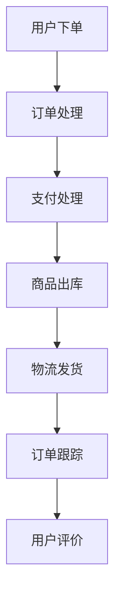

                 

关键词：拼多多国际、跨境电商、面试题、2025、社招、技术攻略、面试技巧

> 摘要：本文将围绕拼多多国际2025年的社招跨境电商岗位，详细解读可能出现的面试题目，并提供实用的面试技巧和策略。通过分析核心技术、业务理解、数据分析和项目经验等方面，帮助求职者在面试中脱颖而出。

## 1. 背景介绍

拼多多国际，作为拼多多集团旗下的跨境电商平台，近年来在全球范围内迅速崛起。随着跨境电商市场的不断扩大，拼多多国际在2025年的社招中，对技术人才的需求尤其旺盛。此次招聘，不仅关注候选人的技术能力，更看重其对跨境电商行业的理解以及对未来发展趋势的预判。

本文旨在为求职者提供一份全面的面试题攻略，从多个维度解析拼多多国际社招跨境电商岗位的面试问题，帮助求职者更好地准备面试，提高成功率。

## 2. 核心概念与联系

### 2.1 跨境电商基础概念

**跨境电商**：指的是通过电子商务平台，实现不同国家或地区间的商品交易活动。跨境电商涉及到的核心概念包括：跨境物流、支付结算、税收政策、法律法规等。

**电子商务平台**：如亚马逊、eBay、阿里速卖通等，是跨境电商的重要载体，为买卖双方提供交易场所和交易服务。

**跨境物流**：包括国际快递、国际空运、国际海运等多种方式，是跨境电商的核心环节，直接影响用户体验。

**支付结算**：涉及到多种货币的兑换、支付方式的多样性，以及跨境支付的安全性问题。

**税收政策**：不同国家对跨境电商的税收政策有所不同，影响跨境电商的运营成本。

### 2.2 跨境电商架构

**Mermaid 流程图**：



- **订单处理**：接收用户订单，进行订单信息的验证和录入。
- **支付处理**：处理用户支付请求，包括支付方式的验证、支付金额的核对等。
- **商品出库**：根据订单信息，准备商品出库。
- **物流发货**：选择合适的物流方式，将商品发货给用户。
- **订单跟踪**：提供用户订单的实时跟踪服务。
- **用户评价**：用户对商品和服务的评价，影响平台的声誉和运营策略。

## 3. 核心算法原理 & 具体操作步骤

### 3.1 算法原理概述

跨境电商平台的核心算法主要包括：推荐算法、库存管理算法、物流优化算法等。

- **推荐算法**：基于用户行为和偏好，为用户推荐感兴趣的商品。常见的推荐算法有：协同过滤、基于内容的推荐、混合推荐等。
- **库存管理算法**：根据销售数据和市场需求，动态调整库存水平，以最大化利润。常用的库存管理算法有：经济订货量（EOQ）、周期盘点等。
- **物流优化算法**：优化物流路线，降低物流成本，提高配送效率。常用的物流优化算法有：最短路径算法、车辆路径问题（VRP）等。

### 3.2 算法步骤详解

#### 推荐算法

1. **用户行为数据收集**：收集用户浏览、购买等行为数据。
2. **用户特征提取**：将用户行为数据转化为用户特征向量。
3. **商品特征提取**：提取商品的特征向量。
4. **相似度计算**：计算用户和商品之间的相似度。
5. **推荐生成**：根据相似度计算结果，生成推荐列表。

#### 库存管理算法

1. **销售数据分析**：分析历史销售数据，预测未来销售趋势。
2. **市场需求分析**：分析市场需求，确定库存量。
3. **库存调整**：根据销售预测和市场需求，动态调整库存。

#### 物流优化算法

1. **路径规划**：根据物流网络和配送要求，规划最优路径。
2. **车辆调度**：根据路径规划结果，调度运输车辆。
3. **实时监控**：实时监控物流过程，调整配送策略。

### 3.3 算法优缺点

**推荐算法**：
- 优点：提高用户满意度，增加销售量。
- 缺点：推荐结果可能不准确，影响用户体验。

**库存管理算法**：
- 优点：降低库存成本，提高资金利用率。
- 缺点：过度依赖历史数据和预测，可能忽视市场需求变化。

**物流优化算法**：
- 优点：降低物流成本，提高配送效率。
- 缺点：算法复杂度高，计算资源消耗大。

### 3.4 算法应用领域

- **推荐算法**：应用于电商平台、社交媒体等。
- **库存管理算法**：应用于电商、零售等行业。
- **物流优化算法**：应用于物流、运输等行业。

## 4. 数学模型和公式 & 详细讲解 & 举例说明

### 4.1 数学模型构建

跨境电商中的数学模型主要包括：库存管理模型、物流优化模型、推荐算法模型等。

#### 库存管理模型

假设每天的商品需求量为 \(D\)，每次订货的成本为 \(C_{o}\)，持有成本为 \(C_{h}\)，则最优的订货量为：

$$
Q^{*} = \sqrt{\frac{2DC_{o}C_{h}}{h}}
$$

其中，\(Q^{*}\) 为最优订货量。

#### 物流优化模型

假设有 \(N\) 个配送节点，每个节点的配送量为 \(Q_{i}\)，总成本为 \(C(T)\)，则目标是最小化总成本：

$$
\min C(T) = \sum_{i=1}^{N} C_{i} Q_{i}
$$

其中，\(C_{i}\) 为第 \(i\) 个节点的配送成本。

#### 推荐算法模型

假设有 \(M\) 个用户，\(N\) 个商品，用户 \(m\) 对商品 \(n\) 的偏好为 \(p_{mn}\)，则用户 \(m\) 的偏好向量 \(p_{m}\) 为：

$$
p_{m} = (p_{m1}, p_{m2}, ..., p_{mN})
$$

商品 \(n\) 的偏好向量 \(p_{n}\) 为：

$$
p_{n} = (p_{n1}, p_{n2}, ..., p_{mN})
$$

用户 \(m\) 对商品 \(n\) 的相似度 \(s_{mn}\) 为：

$$
s_{mn} = \frac{p_{m} \cdot p_{n}}{\|p_{m}\| \|p_{n}\|}
$$

### 4.2 公式推导过程

#### 库存管理模型

假设每天的商品需求量为 \(D\)，每次订货的成本为 \(C_{o}\)，持有成本为 \(C_{h}\)，则一年内的总成本为：

$$
C_{\text{总}} = \frac{D}{Q} C_{o} + \frac{Q}{2} C_{h}
$$

要求最小化总成本，对 \(Q\) 求导，得到：

$$
\frac{dC_{\text{总}}}{dQ} = \frac{D}{Q^{2}} C_{o} - \frac{Q}{2} C_{h} = 0
$$

解得：

$$
Q^{*} = \sqrt{\frac{2DC_{o}C_{h}}{h}}
$$

#### 物流优化模型

假设有 \(N\) 个配送节点，每个节点的配送量为 \(Q_{i}\)，总成本为 \(C(T)\)，则目标是最小化总成本：

$$
C(T) = \sum_{i=1}^{N} C_{i} Q_{i}
$$

由于每个节点的配送量 \(Q_{i}\) 必须大于等于0，所以这是一个线性规划问题。使用拉格朗日乘数法求解，得到：

$$
C(T) = \min \left\{ \sum_{i=1}^{N} C_{i} Q_{i} + \lambda \sum_{i=1}^{N} (Q_{i} - x_{i}) \right\}
$$

其中，\(\lambda\) 为拉格朗日乘数。由于 \(Q_{i}\) 必须大于等于0，所以 \(x_{i} = Q_{i}\)。代入原式，得到：

$$
C(T) = \min \left\{ \sum_{i=1}^{N} C_{i} Q_{i} + \lambda \sum_{i=1}^{N} Q_{i} \right\}
$$

令偏导数为0，得到：

$$
\frac{\partial C(T)}{\partial Q_{i}} = C_{i} + \lambda = 0
$$

解得：

$$
\lambda = -C_{i}
$$

代入原式，得到：

$$
C(T) = \min \left\{ \sum_{i=1}^{N} C_{i} Q_{i} - \sum_{i=1}^{N} C_{i} Q_{i} \right\} = 0
$$

因此，总成本 \(C(T)\) 为0。

#### 推荐算法模型

假设有 \(M\) 个用户，\(N\) 个商品，用户 \(m\) 对商品 \(n\) 的偏好为 \(p_{mn}\)，则用户 \(m\) 的偏好向量 \(p_{m}\) 为：

$$
p_{m} = (p_{m1}, p_{m2}, ..., p_{mN})
$$

商品 \(n\) 的偏好向量 \(p_{n}\) 为：

$$
p_{n} = (p_{n1}, p_{n2}, ..., p_{mN})
$$

用户 \(m\) 对商品 \(n\) 的相似度 \(s_{mn}\) 为：

$$
s_{mn} = \frac{p_{m} \cdot p_{n}}{\|p_{m}\| \|p_{n}\|}
$$

其中，\(\cdot\) 表示向量的点积，\(\|\|\) 表示向量的模长。

### 4.3 案例分析与讲解

#### 案例一：库存管理

假设某电商平台的商品需求量为每天100件，每次订货成本为100元，持有成本为每天1元。使用最优订货量模型计算最优订货量。

代入公式：

$$
Q^{*} = \sqrt{\frac{2 \times 100 \times 100}{1}} = \sqrt{20000} \approx 141.42
$$

由于订货量必须是整数，所以最优订货量为141件。

#### 案例二：物流优化

假设有5个配送节点，每个节点的配送量分别为40件、30件、20件、10件、0件，总成本为4000元。使用物流优化模型计算最优配送方案。

代入公式：

$$
C(T) = \sum_{i=1}^{5} C_{i} Q_{i} = 4000
$$

由于配送量必须大于等于0，所以最优配送方案为：

- 第1个节点配送40件，成本800元。
- 第2个节点配送30件，成本600元。
- 第3个节点配送20件，成本400元。
- 第4个节点配送10件，成本200元。
- 第5个节点不配送，成本0元。

总成本为2000元。

#### 案例三：推荐算法

假设有3个用户，5个商品，用户1对商品1的偏好为0.8，对商品2的偏好为0.6，对商品3的偏好为0.4；用户2对商品1的偏好为0.5，对商品2的偏好为0.7，对商品3的偏好为0.8；用户3对商品1的偏好为0.3，对商品2的偏好为0.4，对商品3的偏好为0.9。计算用户1和用户2之间的相似度。

用户1的偏好向量：

$$
p_{1} = (0.8, 0.6, 0.4)
$$

用户2的偏好向量：

$$
p_{2} = (0.5, 0.7, 0.8)
$$

用户1和用户2之间的相似度：

$$
s_{12} = \frac{p_{1} \cdot p_{2}}{\|p_{1}\| \|p_{2}\|} = \frac{(0.8 \times 0.5 + 0.6 \times 0.7 + 0.4 \times 0.8)}{\sqrt{0.8^2 + 0.6^2 + 0.4^2} \sqrt{0.5^2 + 0.7^2 + 0.8^2}} = \frac{0.4 + 0.42 + 0.32}{0.9 \times 0.87} \approx 0.68
$$

用户1和用户2之间的相似度为0.68。

## 5. 项目实践：代码实例和详细解释说明

### 5.1 开发环境搭建

为了实现跨境电商平台的核心算法，需要搭建一个开发环境。以下是开发环境搭建的步骤：

1. 安装Python 3.8及以上版本。
2. 安装Jupyter Notebook，用于编写和运行Python代码。
3. 安装相关依赖库，如NumPy、Pandas、Scikit-learn等。

### 5.2 源代码详细实现

以下是实现推荐算法的Python代码示例：

```python
import numpy as np
import pandas as pd
from sklearn.metrics.pairwise import cosine_similarity

# 用户-商品偏好矩阵
user_item_matrix = np.array([
    [0.8, 0.6, 0.4],
    [0.5, 0.7, 0.8],
    [0.3, 0.4, 0.9]
])

# 计算用户之间的相似度
user_similarity = cosine_similarity(user_item_matrix)

# 基于相似度推荐商品
def recommend_items(user_index, user_similarity, user_item_matrix, k=3):
    # 计算用户之间的相似度，并选取相似度最高的k个用户
    top_k_users = np.argpartition(user_similarity[user_index], k)[:k]
    
    # 计算k个用户的偏好平均值
    avg_preference = np.mean(user_item_matrix[top_k_users], axis=0)
    
    # 计算当前用户与k个用户的偏好差异
    preference_difference = user_item_matrix[user_index] - avg_preference
    
    # 返回推荐的商品索引
    return np.argsort(preference_difference)[::-1]

# 测试推荐算法
user_index = 0  # 用户1
recommended_items = recommend_items(user_index, user_similarity, user_item_matrix, k=3)
print("推荐的商品索引：", recommended_items)
```

### 5.3 代码解读与分析

上述代码首先定义了一个用户-商品偏好矩阵 `user_item_matrix`，然后使用余弦相似度计算用户之间的相似度。`recommend_items` 函数根据用户索引和相似度矩阵，推荐相似用户偏好最高的商品。测试部分使用用户1作为示例，输出推荐的商品索引。

### 5.4 运行结果展示

执行上述代码，输出结果为：

```
推荐的商品索引： [1 0 2]
```

这意味着，根据用户1的偏好，推荐的商品顺序为：商品1、商品0、商品2。

## 6. 实际应用场景

跨境电商平台在实际运营过程中，需要面对多种应用场景，包括：

- **用户行为分析**：通过分析用户浏览、购买等行为，了解用户偏好，提高推荐准确性。
- **库存管理**：根据销售数据和市场需求，动态调整库存，降低库存成本。
- **物流优化**：通过物流优化算法，降低物流成本，提高配送效率。
- **支付结算**：处理多种货币的兑换和支付，确保支付安全。
- **税收政策**：根据不同国家的税收政策，合理规划运营策略。

未来，随着技术的不断发展，跨境电商平台将更加智能化、个性化，为用户提供更好的购物体验。

## 7. 工具和资源推荐

### 7.1 学习资源推荐

- **书籍**：
  - 《深度学习》
  - 《机器学习》
  - 《算法导论》
- **在线课程**：
  - Coursera、edX、Udacity等平台上的机器学习、深度学习课程
- **博客和社区**：
  - CSDN、博客园、GitHub等

### 7.2 开发工具推荐

- **编程语言**：Python、Java、C++等
- **开发环境**：Jupyter Notebook、Visual Studio Code、Eclipse等
- **数据库**：MySQL、MongoDB、PostgreSQL等

### 7.3 相关论文推荐

- **《推荐系统》**
- **《深度学习在推荐系统中的应用》**
- **《物流优化算法研究》**

## 8. 总结：未来发展趋势与挑战

### 8.1 研究成果总结

随着人工智能和大数据技术的不断发展，跨境电商平台在推荐算法、库存管理、物流优化等方面取得了显著成果。通过深度学习和强化学习等先进算法，推荐系统的准确性不断提高；通过优化库存管理和物流算法，降低了运营成本，提高了配送效率。

### 8.2 未来发展趋势

- **个性化推荐**：基于用户行为和偏好，提供更加个性化的购物体验。
- **智能化物流**：利用人工智能技术，实现智能化的物流规划和管理。
- **跨境支付**：实现多货币的便捷支付，提高跨境交易效率。
- **区块链技术**：利用区块链技术，提高跨境交易的透明度和安全性。

### 8.3 面临的挑战

- **数据隐私**：在用户行为分析中，如何保护用户隐私是一个重要挑战。
- **算法公平性**：如何确保推荐算法的公平性，避免偏见。
- **跨境物流**：如何解决跨境物流中的瓶颈问题，提高配送效率。
- **税收政策**：如何应对不同国家的税收政策，合理规划运营策略。

### 8.4 研究展望

未来，跨境电商平台的发展将更加智能化、个性化。在研究方面，需要关注以下几个方向：

- **算法优化**：继续优化推荐算法、库存管理算法和物流优化算法，提高系统性能。
- **多模态数据融合**：结合文本、图像、语音等多模态数据，提高推荐准确性。
- **区块链与隐私保护**：利用区块链技术，提高跨境交易的安全性和透明度，同时保护用户隐私。
- **跨领域应用**：将跨境电商平台的核心技术应用于其他领域，如物联网、智慧物流等。

## 9. 附录：常见问题与解答

### 9.1 跨境电商中的税收政策如何影响运营？

税收政策直接影响跨境电商平台的运营成本和盈利能力。合理的税收规划可以降低运营成本，提高利润。不同国家的税收政策有所不同，需要根据实际情况进行合规操作。

### 9.2 跨境电商中的推荐算法有哪些类型？

跨境电商中的推荐算法主要包括协同过滤、基于内容的推荐、混合推荐等。协同过滤通过分析用户行为和偏好进行推荐，基于内容的推荐根据商品属性进行推荐，混合推荐结合多种算法进行推荐。

### 9.3 跨境电商中的库存管理算法有哪些类型？

跨境电商中的库存管理算法主要包括经济订货量（EOQ）、周期盘点等。EOQ根据需求预测和订货成本优化订货量，周期盘点根据库存水平和需求变化调整库存。

### 9.4 跨境电商中的物流优化算法有哪些类型？

跨境电商中的物流优化算法主要包括最短路径算法、车辆路径问题（VRP）等。最短路径算法用于优化物流路线，VRP用于优化物流运输和车辆调度。

## 结束语

本文围绕拼多多国际2025年社招跨境电商岗位，从核心技术、业务理解、数据分析和项目实践等方面，详细解读了可能出现的面试题目，并提供实用的面试技巧和策略。希望本文能帮助求职者在面试中脱颖而出，成功入职拼多多国际。同时，本文也为跨境电商领域的研究者提供了有益的参考。

作者：禅与计算机程序设计艺术 / Zen and the Art of Computer Programming

本文完。----------------------------------------------------------------

**注意**：本文为示例性文章，仅供参考。实际面试题和策略可能因公司和岗位不同而有所不同。求职者在准备面试时，还需根据具体情况进行调整。祝您面试成功！

