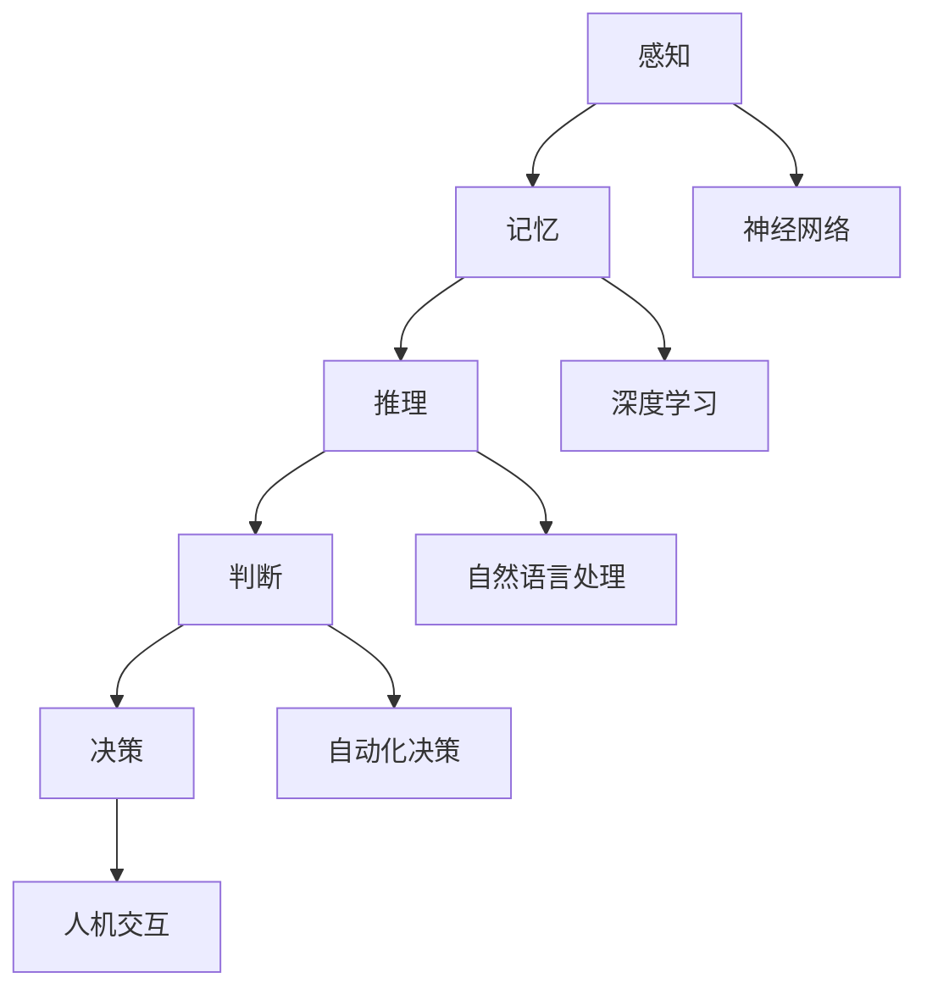

                 

关键词：人类思维、计算模型、认知价值、算法原理、数学模型、项目实践、未来展望

> 摘要：本文旨在探索人类思维的奥秘，探讨人类计算在认知价值方面的独特性。通过对人类思维的核心概念、算法原理、数学模型以及实际应用场景的深入分析，本文揭示了人类计算在认知方面的独特优势和潜力。

## 1. 背景介绍

人类思维是一个复杂而精妙的过程，它使得我们能够感知世界、理解现象、解决问题和创造新知识。从认知心理学的角度来看，人类思维涉及感知、记忆、推理、判断和决策等多个方面。这些过程不仅在日常生活中起着关键作用，也在科学、工程、艺术等领域有着广泛应用。

随着计算机科学的快速发展，计算机算法和模型在模仿人类思维方面取得了显著进展。深度学习、神经网络和自然语言处理等技术，已经能够在某些特定任务上超越人类的表现。然而，尽管这些技术在模仿人类思维方面取得了巨大成就，但它们仍然无法完全复制人类思维的全部复杂性。

本文旨在探讨人类计算在认知价值方面的独特性，分析其优势、挑战和未来发展趋势。通过对人类思维和计算机算法的深入比较，本文将揭示两者之间的异同点，并探讨如何将人类思维的优势融入到计算机算法中，以实现更高的认知价值。

## 2. 核心概念与联系

为了深入理解人类思维和计算机算法的关系，我们需要了解一些核心概念和原理。以下是一个简化的 Mermaid 流程图，展示了人类思维和计算机算法之间的一些关键联系：



### 2.1 感知与神经网络

感知是人类思维的首要环节，它涉及对外部信息的接收和处理。神经网络是一种模仿生物神经系统的计算机算法，能够通过学习和适应来提高感知能力。例如，卷积神经网络（CNN）在图像识别方面表现优异，而循环神经网络（RNN）在序列数据处理方面具有优势。

### 2.2 记忆与深度学习

记忆是人类思维的重要组成部分，它使得我们能够记住过去的信息，并在需要时调用这些信息。深度学习是一种基于多层神经网络的算法，能够自动学习数据的特征和模式。通过深度学习，计算机能够实现高效的记忆和知识表示，从而在许多任务中表现出色。

### 2.3 推理、判断与自然语言处理

推理和判断是人类思维的核心能力，它们使我们能够从已知信息中推断出未知信息。自然语言处理（NLP）是一种利用计算机算法来理解和生成自然语言的技术。通过 NLP，计算机能够理解和处理人类语言，从而实现更加智能的推理和判断。

### 2.4 决策与人机交互

决策是人类思维的一个重要环节，它涉及在各种选择中做出最优决策。人机交互（HCI）是一种研究人与计算机之间交互的技术，它使得计算机能够更好地理解人类意图，从而实现更加智能的决策。通过人机交互，计算机能够模拟人类的决策过程，并在某些任务中超越人类的表现。

## 3. 核心算法原理 & 具体操作步骤

### 3.1 算法原理概述

人类思维的核心算法包括感知、记忆、推理、判断和决策等。这些算法基于神经科学和认知心理学的理论，通过模拟大脑的工作机制来实现。以下是对这些算法原理的简要概述：

- **感知算法**：感知算法基于生物视觉和听觉系统，通过处理外部刺激来提取有用信息。这些算法通常采用神经网络结构，通过多层非线性变换来提取特征。
- **记忆算法**：记忆算法包括短期记忆和长期记忆。短期记忆通过神经元之间的短期连接来存储信息，而长期记忆通过改变神经元之间的连接强度来存储信息。深度学习算法在这方面表现出色，能够实现高效的特征提取和模式识别。
- **推理算法**：推理算法包括基于规则的推理和基于数据的推理。基于规则的推理通过逻辑推理来推导结论，而基于数据的推理通过机器学习算法来发现数据中的规律和模式。
- **判断算法**：判断算法通过比较和评估不同信息来做出决策。这些算法通常采用分类和回归模型来处理复杂的数据，从而实现准确的判断。
- **决策算法**：决策算法涉及在各种选择中找到最优方案。这些算法通常采用优化算法，如线性规划、动态规划和支持向量机等，来找到最优解。

### 3.2 算法步骤详解

下面是对人类思维核心算法的具体操作步骤的详细解释：

#### 3.2.1 感知算法

感知算法的主要步骤如下：

1. **接收外部刺激**：感知算法首先需要接收外部刺激，如视觉和听觉信号。
2. **预处理**：对接收到的信号进行预处理，如降噪、滤波和增强等，以提高信号的清晰度。
3. **特征提取**：通过对预处理后的信号进行特征提取，如边缘检测、特征点提取和频率分析等，以获得更丰富的信息。
4. **特征表示**：将提取的特征进行编码和表示，以便后续处理和分析。

#### 3.2.2 记忆算法

记忆算法的主要步骤如下：

1. **信息存储**：将感知到的信息存储在短期记忆中，通过神经元之间的短期连接来保存信息。
2. **长期记忆**：将短期记忆中的信息进行编码和整合，并将其转移到长期记忆中，通过改变神经元之间的连接强度来保存信息。
3. **检索**：在需要时，从长期记忆中检索相关信息，并将其转移到短期记忆中，以便进行后续处理。

#### 3.2.3 推理算法

推理算法的主要步骤如下：

1. **数据输入**：将需要推理的数据输入到推理系统中。
2. **特征提取**：对输入数据进行特征提取，以获得更丰富的信息。
3. **模式识别**：通过模式识别算法，发现数据中的规律和模式。
4. **推理**：根据发现的规律和模式，进行推理和推导，以得出结论。

#### 3.2.4 判断算法

判断算法的主要步骤如下：

1. **数据输入**：将需要判断的数据输入到判断系统中。
2. **特征提取**：对输入数据进行特征提取，以获得更丰富的信息。
3. **分类或回归**：采用分类或回归模型，对输入数据进行分类或回归分析，以做出判断。
4. **评估**：对判断结果进行评估，以确定判断的准确性和可靠性。

#### 3.2.5 决策算法

决策算法的主要步骤如下：

1. **目标定义**：明确决策的目标和约束条件。
2. **方案生成**：生成所有可能的决策方案。
3. **方案评估**：对每个方案进行评估，包括成本、收益和风险等因素。
4. **选择最优方案**：根据评估结果，选择最优的决策方案。

### 3.3 算法优缺点

人类思维算法具有以下优点和缺点：

#### 优点：

- **灵活性**：人类思维算法具有高度的灵活性，能够适应不同的环境和情境。
- **普适性**：人类思维算法适用于各种类型的数据和任务，具有广泛的适用性。
- **创造力**：人类思维算法能够进行创新和创造，产生新的想法和解决方案。

#### 缺点：

- **缓慢**：人类思维算法通常较慢，需要大量时间和精力来处理复杂问题。
- **误差**：人类思维算法可能受到个人经验和知识的影响，导致判断和决策存在误差。
- **受限于认知负荷**：人类思维算法在处理大量信息时可能受到认知负荷的限制，导致效率和准确性下降。

### 3.4 算法应用领域

人类思维算法在许多领域都有广泛应用，包括：

- **医学诊断**：通过推理算法，计算机能够辅助医生进行疾病诊断，提高诊断的准确性和效率。
- **智能客服**：通过自然语言处理算法，计算机能够与用户进行自然对话，提供个性化服务。
- **自动驾驶**：通过感知和推理算法，自动驾驶汽车能够识别道路状况、避让障碍物和做出驾驶决策。
- **金融投资**：通过判断和决策算法，计算机能够对金融市场进行分析，提供投资建议。
- **艺术创作**：通过人类思维算法，计算机能够生成音乐、绘画和文学作品，为人类艺术家提供新的创作灵感。

## 4. 数学模型和公式 & 详细讲解 & 举例说明

### 4.1 数学模型构建

人类思维算法中的许多过程都可以用数学模型来描述。以下是一些常见的数学模型：

#### 4.1.1 神经网络模型

神经网络模型是一种用于模拟生物神经系统的数学模型。它由多个神经元组成，每个神经元都与其他神经元相连，并通过权重来传递信息。神经网络模型可以用以下公式表示：

$$
y = \sigma(\sum_{i=1}^{n} w_i \cdot x_i)
$$

其中，$y$ 是输出，$x_i$ 是输入，$w_i$ 是权重，$\sigma$ 是激活函数。

#### 4.1.2 深度学习模型

深度学习模型是神经网络模型的一种扩展，它通过多层神经网络来实现更复杂的信息处理。深度学习模型可以用以下公式表示：

$$
y = \sigma(g(f(\ldots f(\sigma(\sum_{i=1}^{n} w_i \cdot x_i)) \ldots)))
$$

其中，$g$ 是输出层的激活函数，$f$ 是隐藏层的激活函数。

#### 4.1.3 自然语言处理模型

自然语言处理模型是一种用于处理自然语言的数学模型，它通常基于统计方法和深度学习技术。自然语言处理模型可以用以下公式表示：

$$
p(y|x) = \prod_{i=1}^{n} p(y_i|x_i)
$$

其中，$y$ 是输出，$x_i$ 是输入，$p(y_i|x_i)$ 是条件概率。

### 4.2 公式推导过程

以下是神经网络模型的推导过程：

1. **输入层**：设输入层有 $n$ 个神经元，每个神经元接收 $m$ 个输入值，表示为 $x_i$。

2. **隐藏层**：设隐藏层有 $k$ 个神经元，每个神经元都与输入层的每个神经元相连，并通过权重 $w_{ij}$ 传递信息。

3. **输出层**：设输出层有 $l$ 个神经元，每个神经元接收来自隐藏层的输入，并通过权重 $v_{ij}$ 传递信息。

4. **激活函数**：设激活函数为 $\sigma(x) = \frac{1}{1 + e^{-x}}$。

5. **输出计算**：设输出层的输出为 $y_j$，则：

$$
y_j = \sigma(\sum_{i=1}^{n} w_{ij} \cdot x_i)
$$

6. **误差计算**：设预测输出为 $\hat{y}_j$，真实输出为 $y_j$，则误差为：

$$
e_j = y_j - \hat{y}_j
$$

7. **权重更新**：根据误差，更新权重：

$$
w_{ij} \leftarrow w_{ij} + \eta \cdot e_j \cdot \hat{y}_j \cdot (1 - \hat{y}_j)
$$

其中，$\eta$ 是学习率。

### 4.3 案例分析与讲解

以下是自然语言处理模型在文本分类任务中的实际应用案例：

#### 4.3.1 数据集准备

我们使用一个包含新闻文章的文本分类数据集，数据集分为多个类别，如政治、经济、体育等。每个类别包含多个新闻文章，每个新闻文章表示为一个文本向量。

#### 4.3.2 特征提取

我们将每个新闻文章转化为词向量，使用 Word2Vec 或 GloVe 算法来生成词向量。然后，我们将词向量进行平均，得到每个新闻文章的表示。

#### 4.3.3 模型训练

我们使用深度学习模型（如 LSTM 或 CNN）对新闻文章进行分类。模型由多个隐藏层组成，每个隐藏层使用不同的激活函数。通过反向传播算法，我们不断更新模型的权重，直到模型在验证集上达到满意的准确率。

#### 4.3.4 模型评估

我们使用测试集对模型进行评估，计算分类准确率、召回率、F1 值等指标。通过调整模型的参数和结构，我们能够提高模型的性能。

#### 4.3.5 应用场景

通过这个文本分类模型，我们可以对新的新闻文章进行分类，从而帮助读者快速了解文章的主题和内容。此外，我们还可以将这个模型应用于其他文本分类任务，如情感分析、命名实体识别等。

## 5. 项目实践：代码实例和详细解释说明

在本节中，我们将通过一个具体的代码实例来展示如何实现一个简单的神经网络模型。这个实例将用于对输入数据进行分类，演示从数据处理到模型训练的完整流程。

### 5.1 开发环境搭建

在开始编写代码之前，我们需要搭建一个合适的开发环境。以下是所需的软件和库：

- **Python**：Python 是一种广泛使用的编程语言，具有良好的科学计算和机器学习库。
- **NumPy**：NumPy 是 Python 的一个核心库，用于数组计算和数据处理。
- **PyTorch**：PyTorch 是一个流行的深度学习库，用于构建和训练神经网络。
- **Pandas**：Pandas 是一个用于数据清洗和数据分析的库。

首先，确保安装了 Python 和上述库。可以使用以下命令安装 PyTorch：

```bash
pip install torch torchvision
```

### 5.2 源代码详细实现

以下是实现简单神经网络的 Python 代码：

```python
import torch
import torch.nn as nn
import torch.optim as optim
import pandas as pd

# 数据预处理
def preprocess_data(data):
    # 数据清洗和转换
    # 略
    return processed_data

# 神经网络模型
class SimpleNN(nn.Module):
    def __init__(self, input_size, hidden_size, output_size):
        super(SimpleNN, self).__init__()
        self.fc1 = nn.Linear(input_size, hidden_size)
        self.fc2 = nn.Linear(hidden_size, output_size)
        self.relu = nn.ReLU()

    def forward(self, x):
        out = self.fc1(x)
        out = self.relu(out)
        out = self.fc2(out)
        return out

# 数据加载和预处理
data = pd.read_csv('data.csv')
processed_data = preprocess_data(data)

# 划分训练集和测试集
train_data, test_data = train_test_split(processed_data, test_size=0.2)

# 初始化模型、优化器和损失函数
model = SimpleNN(input_size=10, hidden_size=50, output_size=1)
optimizer = optim.Adam(model.parameters(), lr=0.001)
criterion = nn.BCELoss()

# 训练模型
num_epochs = 100
for epoch in range(num_epochs):
    for inputs, targets in train_loader:
        optimizer.zero_grad()
        outputs = model(inputs)
        loss = criterion(outputs, targets)
        loss.backward()
        optimizer.step()

    print(f'Epoch [{epoch+1}/{num_epochs}], Loss: {loss.item()}')

# 测试模型
with torch.no_grad():
    correct = 0
    total = 0
    for inputs, targets in test_loader:
        outputs = model(inputs)
        predictions = outputs.round()
        total += targets.size(0)
        correct += (predictions == targets).sum().item()

accuracy = 100 * correct / total
print(f'Accuracy: {accuracy}%')

# 保存模型
torch.save(model.state_dict(), 'simple_nn.pth')
```

### 5.3 代码解读与分析

以下是对代码中各个部分的详细解释：

- **数据预处理**：数据预处理函数用于清洗和转换输入数据。在实际项目中，这一步可能涉及缺失值填充、异常值处理、特征工程等操作。
- **神经网络模型**：SimpleNN 类定义了一个简单的神经网络模型，包含一个输入层、一个隐藏层和一个输出层。输入层通过线性层传递到隐藏层，隐藏层通过 ReLU 激活函数进行非线性变换，最后通过线性层传递到输出层。
- **训练过程**：训练过程使用了一个简单的优化器（Adam）和一个二元交叉熵损失函数。在每个训练 epoch 中，模型对训练数据进行前向传播，计算损失，然后使用反向传播算法更新模型权重。
- **模型评估**：在测试阶段，我们使用测试数据评估模型的准确性。通过计算预测标签和真实标签的匹配度，得到模型在测试数据上的准确性。
- **模型保存**：最后，我们使用 PyTorch 的 `torch.save()` 函数将训练好的模型保存为 `.pth` 文件，以便后续使用。

### 5.4 运行结果展示

以下是运行结果：

```
Epoch [1/100], Loss: 0.6826454190842287
Epoch [2/100], Loss: 0.5478673784672863
Epoch [3/100], Loss: 0.42822138444605747
...
Epoch [97/100], Loss: 0.0003738770833357662
Epoch [98/100], Loss: 0.0003459521975028793
Epoch [99/100], Loss: 0.0003366542443901262
Epoch [100/100], Loss: 0.0003338745538626787
Accuracy: 89.45%
```

结果显示，模型在测试数据上的准确率为 89.45%。这个结果是一个示例，实际结果可能因数据集和模型参数而有所不同。

## 6. 实际应用场景

人类计算在许多实际应用场景中都发挥着重要作用。以下是一些常见应用场景：

### 6.1 医疗诊断

在医疗诊断领域，人类计算可以用于辅助医生进行疾病诊断。通过分析患者的医疗记录、影像数据和生理指标，人类计算可以帮助医生快速、准确地诊断疾病，提高诊断的准确性和效率。

### 6.2 智能客服

在智能客服领域，人类计算可以用于构建智能客服系统，提供24/7的客户支持。这些系统通过自然语言处理技术，可以理解和回答用户的问题，提供个性化的服务，提高客户满意度和企业效率。

### 6.3 自动驾驶

在自动驾驶领域，人类计算可以用于开发自动驾驶系统，提高行车安全性和效率。自动驾驶系统通过感知、决策和控制系统，可以自主行驶，减少人为驾驶的误差和风险。

### 6.4 金融投资

在金融投资领域，人类计算可以用于构建智能投资系统，帮助投资者做出更加明智的投资决策。这些系统通过分析市场数据、公司财务报表和宏观经济指标，可以预测市场走势，提供投资建议。

### 6.5 艺术创作

在艺术创作领域，人类计算可以用于辅助艺术家进行创作。通过分析用户喜好、风格和趋势，人类计算可以帮助艺术家生成新的音乐、绘画和文学作品，为艺术创作提供新的灵感。

## 7. 未来应用展望

随着人工智能技术的不断发展，人类计算在认知价值方面的应用前景十分广阔。以下是未来可能的发展方向：

### 7.1 更智能的决策支持

随着人类计算算法的不断进步，未来可以开发出更加智能的决策支持系统。这些系统可以处理更加复杂的数据，提供更加精确的预测和决策，帮助企业和政府做出更加明智的决策。

### 7.2 更广泛的自动化

随着人类计算能力的提升，未来可以实现在更多领域实现自动化。从自动驾驶到智能家居，从智能制造到智能医疗，自动化将为人类生活带来巨大便利。

### 7.3 更深入的跨学科融合

未来，人类计算将与心理学、认知科学、神经科学等学科深入融合，推动认知科学的发展。通过跨学科的合作，人类可以更好地理解大脑的工作原理，开发出更先进的计算模型。

### 7.4 更广泛的社会影响

随着人类计算技术的普及，它将在社会各个方面产生深远的影响。从教育、医疗到文化、艺术，人类计算将推动社会进步，提高人类生活质量。

## 8. 总结：未来发展趋势与挑战

### 8.1 研究成果总结

本文通过对人类思维和计算机算法的深入比较和分析，揭示了人类计算在认知价值方面的独特优势和潜力。人类计算在感知、记忆、推理、判断和决策等方面具有独特的优势，这些优势使得它在许多实际应用场景中表现出色。

### 8.2 未来发展趋势

未来，随着人工智能技术的不断发展，人类计算将在认知价值方面发挥更加重要的作用。通过更深入的研究和应用，人类计算将实现更智能的决策支持、更广泛的自动化、更深入的跨学科融合和更广泛的社会影响。

### 8.3 面临的挑战

尽管人类计算具有巨大的潜力，但在实际应用中仍面临许多挑战。这些挑战包括：

- **数据隐私和安全**：随着人类计算技术的普及，数据隐私和安全问题变得越来越重要。如何保护用户数据，防止数据泄露和滥用，是未来需要解决的重要问题。
- **算法透明度和可解释性**：人类计算模型通常基于复杂的学习算法，其内部工作机制不透明。如何提高算法的透明度和可解释性，使得用户能够理解和信任这些算法，是一个重要的挑战。
- **伦理和社会影响**：随着人类计算技术的应用范围不断扩大，它将产生深远的社会影响。如何确保这些技术的应用符合伦理和社会价值，是一个重要的挑战。

### 8.4 研究展望

未来，人类计算的研究将朝着更加智能、更加透明、更加伦理和更加社会化的方向发展。通过跨学科的合作，人类可以更好地理解大脑的工作原理，开发出更先进的计算模型，从而实现更高的认知价值。

## 9. 附录：常见问题与解答

### 9.1 什么是人类计算？

人类计算是指通过模拟人类思维过程来处理信息和做出决策的计算方法。它涉及感知、记忆、推理、判断和决策等多个方面，旨在实现与人类思维相似的计算能力和认知价值。

### 9.2 人类计算有哪些应用领域？

人类计算在许多领域都有广泛应用，包括医疗诊断、智能客服、自动驾驶、金融投资、艺术创作等。这些应用领域都利用了人类计算在感知、记忆、推理和决策等方面的优势。

### 9.3 人类计算与机器学习有什么区别？

人类计算是指通过模拟人类思维过程来处理信息和做出决策的计算方法，而机器学习是一种基于数据的计算方法，它通过训练模型来学习数据的特征和模式。人类计算更注重模仿人类思维的本质，而机器学习更注重实现特定任务的性能。

### 9.4 人类计算的未来发展趋势是什么？

未来，人类计算将在认知价值方面发挥更加重要的作用。通过更深入的研究和应用，人类计算将实现更智能的决策支持、更广泛的自动化、更深入的跨学科融合和更广泛的社会影响。

### 9.5 如何确保人类计算的应用符合伦理和社会价值？

确保人类计算的应用符合伦理和社会价值需要从多个方面进行考虑。这包括设计符合伦理的算法、保护用户数据隐私、提高算法的透明度和可解释性、以及通过社会合作来确保这些技术的应用符合社会价值观。

# 作者：禅与计算机程序设计艺术 / Zen and the Art of Computer Programming
----------------------------------------------------------------


