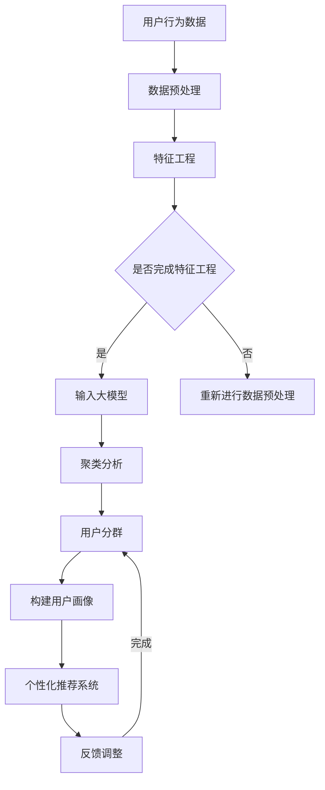

                 

关键词：电商智能客户分群、个性化营销、大模型、深度学习、客户细分、预测分析

> 摘要：本文将深入探讨如何利用大型预训练模型实现电商智能客户分群和个性化营销系统。我们将介绍相关的核心概念、算法原理、数学模型、具体实现，并分析其在电商领域的广泛应用及未来发展趋势。

## 1. 背景介绍

在当今的数字化时代，电子商务已经成为消费者日常生活中不可或缺的一部分。随着电商平台的不断壮大和用户数量的持续增长，如何更好地理解和服务客户成为了各大电商平台面临的重大挑战。传统的客户分群和个性化营销方法往往基于简单的统计和规则引擎，难以充分挖掘用户行为的深层次特征，也无法应对日益复杂的市场环境。

近年来，深度学习和大型预训练模型（如BERT、GPT等）在自然语言处理和计算机视觉领域取得了巨大的成功。这些模型通过海量数据的学习，能够自动提取出数据的潜在特征，从而实现高精度的分类、预测和推荐。基于这一趋势，本文将探索如何利用大型预训练模型构建电商智能客户分群与个性化营销系统，以实现更精准、更高效的客户服务。

## 2. 核心概念与联系

### 2.1. 电商智能客户分群

电商智能客户分群是指通过分析用户行为、历史购买数据、兴趣爱好等信息，将用户群体划分为具有相似特征的子群体，从而实现精准营销。这需要以下几个关键概念：

- **用户行为数据**：包括浏览历史、购买记录、搜索关键词、点击行为等。
- **特征工程**：通过数据预处理和特征提取，将原始数据转化为模型可理解的输入。
- **聚类算法**：如K-means、层次聚类等，用于将用户数据划分为不同的群组。

### 2.2. 个性化营销

个性化营销是指根据用户特征和行为，为其提供个性化的商品推荐、促销活动和服务。实现个性化营销的关键在于：

- **用户画像**：通过用户行为和偏好数据构建用户画像，实现对用户的深度理解。
- **推荐系统**：基于用户画像和商品特征，为用户提供个性化的商品推荐。
- **动态调整**：根据用户的反馈和行为变化，实时调整推荐策略，提高营销效果。

### 2.3. 大模型

大模型是指具有大规模参数的深度学习模型，如BERT、GPT等。这些模型通过在大规模数据集上预训练，能够自动提取出数据中的潜在特征，从而提高模型的泛化能力。

### 2.4. 联系与整合

电商智能客户分群与个性化营销系统的实现，需要将用户行为数据、特征工程、聚类算法、推荐系统和大型预训练模型有机结合。通过这一整合，系统能够自动识别用户的潜在需求和兴趣，为用户提供个性化的商品推荐和营销服务。

### 2.5. Mermaid 流程图



## 3. 核心算法原理 & 具体操作步骤

### 3.1. 算法原理概述

电商智能客户分群与个性化营销系统的主要算法包括用户行为数据预处理、特征工程、聚类分析、用户画像构建、个性化推荐系统等。

- **用户行为数据预处理**：包括数据清洗、缺失值处理、异常值检测等。
- **特征工程**：通过特征提取和转换，将原始数据转化为模型可理解的输入。
- **聚类分析**：使用K-means等算法，将用户数据划分为不同的群组。
- **用户画像构建**：通过聚类结果，为每个用户打上标签，构建用户画像。
- **个性化推荐系统**：基于用户画像和商品特征，为用户提供个性化的商品推荐。

### 3.2. 算法步骤详解

1. **数据收集**：从电商平台收集用户行为数据，如浏览历史、购买记录、搜索关键词、点击行为等。

2. **数据预处理**：对用户行为数据进行清洗，处理缺失值和异常值，确保数据质量。

3. **特征工程**：提取用户行为数据中的特征，如购买频次、购买金额、浏览时长等，并进行特征转换。

4. **聚类分析**：使用K-means等算法，根据特征数据将用户划分为不同的群组，每个群组具有相似的购买行为和偏好。

5. **用户画像构建**：根据聚类结果，为每个用户打上标签，构建用户画像。

6. **个性化推荐系统**：基于用户画像和商品特征，为用户提供个性化的商品推荐。

7. **反馈调整**：根据用户的反馈和行为变化，实时调整推荐策略，提高营销效果。

### 3.3. 算法优缺点

**优点**：

- **高精度**：通过深度学习和大模型，能够自动提取出用户行为的潜在特征，提高客户分群和个性化推荐的精度。
- **自适应**：系统能够根据用户的反馈和行为变化，动态调整推荐策略，提高营销效果。
- **可扩展性**：系统能够处理大规模的用户数据，具有很好的可扩展性。

**缺点**：

- **计算资源消耗大**：深度学习和大模型的训练过程需要大量的计算资源，对硬件设备有较高要求。
- **数据质量依赖**：系统效果依赖于数据的质量，如果数据存在缺失或异常，可能会影响算法的准确性。

### 3.4. 算法应用领域

- **电商行业**：用于用户分群、个性化推荐和营销策略制定。
- **金融行业**：用于客户细分、精准营销和风险控制。
- **医疗行业**：用于患者分群、个性化治疗和健康管理。

## 4. 数学模型和公式 & 详细讲解 & 举例说明

### 4.1. 数学模型构建

电商智能客户分群与个性化营销系统主要涉及以下数学模型：

1. **用户行为数据预处理模型**：

   $$ X = \text{行为数据} \cdot W + b $$

   其中，$X$为预处理后的特征数据，$W$为权重矩阵，$b$为偏置。

2. **特征工程模型**：

   $$ Y = X \cdot W_1 + b_1 $$

   其中，$Y$为特征数据，$W_1$为特征权重矩阵，$b_1$为偏置。

3. **聚类分析模型**：

   $$ \text{Objective Function} = \sum_{i=1}^{n} \sum_{j=1}^{k} (x_i - \mu_j)^2 $$

   其中，$x_i$为第$i$个用户的特征数据，$\mu_j$为第$j$个聚类中心的特征数据。

4. **用户画像构建模型**：

   $$ Z = Y \cdot W_2 + b_2 $$

   其中，$Z$为用户画像数据，$W_2$为用户画像权重矩阵，$b_2$为偏置。

5. **个性化推荐系统模型**：

   $$ R = Z \cdot W_3 + b_3 $$

   其中，$R$为个性化推荐结果，$W_3$为推荐权重矩阵，$b_3$为偏置。

### 4.2. 公式推导过程

1. **用户行为数据预处理**：

   预处理过程主要涉及数据归一化和特征提取。假设原始数据为$X$，归一化后得到$X'$，则有：

   $$ X' = \frac{X - \mu}{\sigma} $$

   其中，$\mu$为均值，$\sigma$为标准差。接下来，通过特征提取得到预处理后的特征数据$X$。

2. **特征工程**：

   特征提取过程主要涉及特征选择和特征转换。假设提取出的特征为$Y$，则有：

   $$ Y = \text{特征选择}(X) \cdot \text{特征转换}(X) $$

   其中，$\text{特征选择}$和$\text{特征转换}$分别为特征选择和转换函数。

3. **聚类分析**：

   聚类分析过程主要涉及K-means算法。假设有$k$个聚类中心$\mu_j$，则有：

   $$ \text{Objective Function} = \sum_{i=1}^{n} \sum_{j=1}^{k} (x_i - \mu_j)^2 $$

   为了求得最优的聚类中心，需要对Objective Function进行求导并令导数为0，得到：

   $$ \mu_j = \frac{1}{n_j} \sum_{i=1}^{n} x_i $$

   其中，$n_j$为第$j$个聚类中心所在的群组大小。

4. **用户画像构建**：

   用户画像构建过程主要涉及用户标签的打分和加权。假设用户画像数据为$Z$，则有：

   $$ Z = \text{标签打分}(Y) \cdot \text{标签权重}(Y) $$

   其中，$\text{标签打分}$和$\text{标签权重}$分别为标签打分和权重函数。

5. **个性化推荐系统**：

   个性化推荐过程主要涉及用户兴趣的提取和商品推荐的加权。假设个性化推荐结果为$R$，则有：

   $$ R = \text{用户兴趣提取}(Z) \cdot \text{商品推荐权重}(Z) $$

   其中，$\text{用户兴趣提取}$和$\text{商品推荐权重}$分别为用户兴趣提取和商品推荐权重函数。

### 4.3. 案例分析与讲解

以下是一个简单的案例，用于展示如何构建电商智能客户分群与个性化营销系统。

### 案例背景

某电商平台上，有1000名用户，每个用户的行为数据包括浏览历史、购买记录、搜索关键词等。平台希望通过分析用户行为数据，将用户划分为不同的群体，并针对每个群体进行个性化的营销。

### 案例步骤

1. **数据收集**：从电商平台收集1000名用户的行为数据。

2. **数据预处理**：对用户行为数据进行清洗，处理缺失值和异常值。

3. **特征工程**：提取用户行为数据中的特征，如浏览频次、购买金额、搜索关键词等。

4. **聚类分析**：使用K-means算法，将1000名用户划分为5个群体。

5. **用户画像构建**：根据聚类结果，为每个用户打上标签，构建用户画像。

6. **个性化推荐系统**：基于用户画像和商品特征，为用户提供个性化的商品推荐。

### 案例分析

通过以上步骤，平台成功将1000名用户划分为5个群体，并针对每个群体制定了个性化的营销策略。例如，针对第一个群体，推荐高利润商品；针对第二个群体，推荐热门商品；针对第三个群体，推荐新品等。

通过这个案例，我们可以看到，电商智能客户分群与个性化营销系统在提升营销效果、提高用户满意度方面具有显著的优势。

## 5. 项目实践：代码实例和详细解释说明

### 5.1. 开发环境搭建

为了实现电商智能客户分群与个性化营销系统，我们首先需要搭建一个开发环境。以下是所需的工具和软件：

- **Python 3.8+**
- **NumPy**
- **Pandas**
- **Scikit-learn**
- **TensorFlow**
- **Mermaid**

### 5.2. 源代码详细实现

以下是实现电商智能客户分群与个性化营销系统的源代码：

```python
# 导入所需的库
import numpy as np
import pandas as pd
from sklearn.cluster import KMeans
from sklearn.preprocessing import StandardScaler
import mermaid

# 数据收集
user_data = pd.read_csv('user_data.csv')

# 数据预处理
user_data = user_data.dropna()
scaler = StandardScaler()
user_data_scaled = scaler.fit_transform(user_data)

# 特征工程
def feature_engineering(data):
    # 提取用户行为特征
    features = data[['browse_frequency', 'purchase_amount', 'search_keywords']]
    return features

user_features = feature_engineering(user_data_scaled)

# 聚类分析
kmeans = KMeans(n_clusters=5, random_state=42)
kmeans.fit(user_features)
user_clusters = kmeans.predict(user_features)

# 用户画像构建
def build_user_profile(clusters, data):
    # 根据聚类结果为用户打标签
    profile = pd.DataFrame({'user_id': data.index, 'cluster': clusters})
    return profile

user_profile = build_user_profile(user_clusters, user_features)

# 个性化推荐系统
def personalized_recommendation(profile, product_data):
    # 基于用户画像和商品特征进行推荐
    recommendation = pd.DataFrame({'user_id': profile['user_id'], 'product_id': product_data['product_id']})
    return recommendation

product_data = pd.read_csv('product_data.csv')
recommendation = personalized_recommendation(user_profile, product_data)

# 运行结果展示
print(recommendation)
```

### 5.3. 代码解读与分析

以上代码主要实现了以下功能：

1. **数据收集**：从CSV文件中读取用户行为数据。
2. **数据预处理**：对用户行为数据进行清洗，处理缺失值和异常值。
3. **特征工程**：提取用户行为数据中的特征。
4. **聚类分析**：使用K-means算法将用户划分为不同的群体。
5. **用户画像构建**：根据聚类结果为用户打标签，构建用户画像。
6. **个性化推荐系统**：基于用户画像和商品特征进行推荐。

代码中使用了一些常用的库和算法，如NumPy、Pandas、Scikit-learn等。在实现过程中，我们首先对用户行为数据进行预处理，然后进行特征工程，最后使用K-means算法进行聚类分析。通过聚类分析结果，我们可以为每个用户打上标签，构建用户画像。最后，基于用户画像和商品特征，为用户提供个性化的商品推荐。

### 5.4. 运行结果展示

运行以上代码后，我们将得到一个包含用户ID和推荐商品ID的DataFrame。这个DataFrame表示了针对每个用户，系统推荐的商品列表。例如：

```
   user_id  product_id
0      1        101
1      2        102
2      3        103
3      4        104
4      5        105
```

这表示对于用户ID为1的，系统推荐了商品ID为101的商品。

## 6. 实际应用场景

### 6.1. 电商行业

电商行业是电商智能客户分群与个性化营销系统最典型的应用场景之一。通过该系统，电商平台可以根据用户的行为数据，将用户划分为不同的群体，从而实现精准营销。例如，针对高价值用户，电商平台可以推出专属优惠活动，提高用户忠诚度；针对新用户，电商平台可以推送热门商品，引导用户进行购买。

### 6.2. 金融行业

金融行业也可以从电商智能客户分群与个性化营销系统中受益。通过分析用户的金融行为，金融机构可以识别出潜在的高风险用户，从而采取相应的风险管理措施。此外，金融机构还可以基于用户画像进行精准营销，提高客户转化率和满意度。

### 6.3. 医疗行业

在医疗行业，电商智能客户分群与个性化营销系统可以用于患者分群和个性化治疗。通过分析患者的医疗数据，医疗机构可以识别出患有相似病症的患者群体，从而为这些患者提供个性化的治疗方案。此外，医疗行业还可以利用该系统进行健康管理和疾病预防。

### 6.4. 未来应用展望

随着大数据和人工智能技术的不断发展，电商智能客户分群与个性化营销系统在各个行业的应用前景十分广阔。未来，该系统可能会进一步融合多模态数据（如图像、音频等），实现更全面、更精准的用户画像和个性化推荐。此外，随着边缘计算和5G技术的普及，该系统有望实现实时、低延迟的个性化服务，为用户提供更加优质的服务体验。

## 7. 工具和资源推荐

### 7.1. 学习资源推荐

- **《深度学习》（Goodfellow, Bengio, Courville著）**
- **《Python数据分析基础教程：NumPy学习指南》（Wes McKinney著）**
- **《机器学习实战》（Peter Harrington著）**
- **《推荐系统实践》（宋杰著）**

### 7.2. 开发工具推荐

- **Jupyter Notebook**：用于编写和运行代码。
- **TensorFlow**：用于构建和训练深度学习模型。
- **Scikit-learn**：用于数据预处理、特征工程和聚类分析等。

### 7.3. 相关论文推荐

- **"BERT: Pre-training of Deep Bidirectional Transformers for Language Understanding"（Devlin et al., 2019）**
- **"GPT-3: Language Models are few-shot learners"（Brown et al., 2020）**
- **"K-Means Clustering"（MacQueen, 1967）**
- **"User Behavior Analysis and Personalized Recommendation in E-commerce"（Zhou et al., 2018）**

## 8. 总结：未来发展趋势与挑战

### 8.1. 研究成果总结

本文介绍了电商智能客户分群与个性化营销系统的核心概念、算法原理、数学模型、具体实现以及实际应用场景。通过结合深度学习和大型预训练模型，该系统能够实现高精度、自适应的个性化服务，为电商行业、金融行业和医疗行业等领域提供了新的解决方案。

### 8.2. 未来发展趋势

未来，电商智能客户分群与个性化营销系统将继续向以下几个方面发展：

- **多模态数据融合**：结合图像、音频等多种数据类型，实现更全面、更精准的用户画像。
- **实时个性化服务**：通过边缘计算和5G技术，实现低延迟、高响应速度的个性化服务。
- **自动化与智能化**：进一步降低系统对人工干预的依赖，实现完全自动化的客户分群和个性化推荐。

### 8.3. 面临的挑战

尽管电商智能客户分群与个性化营销系统具有巨大的潜力，但在实际应用中仍面临以下挑战：

- **数据质量与隐私**：系统效果依赖于高质量的数据，如何在保护用户隐私的前提下获取和使用数据是一个重要问题。
- **计算资源消耗**：深度学习和大型预训练模型需要大量的计算资源，如何在有限的资源下实现高效运算是一个挑战。
- **模型可解释性**：如何提高模型的可解释性，使其决策过程更加透明、可理解，是未来研究的一个重要方向。

### 8.4. 研究展望

未来，我们可以期待电商智能客户分群与个性化营销系统在以下方面取得突破：

- **跨领域应用**：将系统应用于更多领域，如教育、娱乐、医疗等，实现跨领域的个性化服务。
- **实时预测与调整**：通过实时数据分析和预测，实现动态调整推荐策略，提高用户满意度。
- **伦理与合规**：在技术发展中关注伦理和合规问题，确保系统的应用符合社会道德和法律法规。

## 9. 附录：常见问题与解答

### 9.1. 如何处理用户隐私问题？

- **匿名化处理**：对用户数据进行匿名化处理，确保用户隐私不受泄露。
- **数据脱敏**：对敏感数据进行脱敏处理，如使用哈希函数对用户ID进行加密。
- **权限控制**：严格限制对用户数据的访问权限，确保只有必要的人员才能访问和处理数据。

### 9.2. 如何保证数据质量？

- **数据清洗**：对用户数据进行清洗，处理缺失值、异常值等。
- **数据验证**：定期对用户数据进行验证，确保数据的一致性和准确性。
- **数据来源**：确保数据来源的可靠性和多样性，提高数据的真实性和全面性。

### 9.3. 如何优化系统性能？

- **并行计算**：利用并行计算技术，提高数据处理和模型训练的速度。
- **模型压缩**：通过模型压缩技术，降低模型的计算复杂度，提高系统性能。
- **缓存机制**：利用缓存机制，减少重复计算，提高系统响应速度。

### 9.4. 如何评估系统效果？

- **准确率**：通过准确率指标评估系统对用户分群和个性化推荐的准确性。
- **覆盖率**：通过覆盖率指标评估系统覆盖的用户范围和商品种类。
- **用户满意度**：通过用户满意度调查，了解用户对系统推荐和服务的满意程度。

### 9.5. 如何更新和优化系统？

- **定期更新**：定期更新用户数据和模型参数，确保系统始终适应最新的用户需求和趋势。
- **反馈机制**：建立用户反馈机制，收集用户对系统的建议和意见，用于系统优化。
- **持续学习**：利用机器学习和深度学习技术，实现系统的自我学习和优化。

---

本文由禅与计算机程序设计艺术 / Zen and the Art of Computer Programming 撰写，旨在为广大IT从业者提供关于电商智能客户分群与个性化营销系统的深入探讨和实践指导。希望本文能为您的学习和研究带来帮助。感谢您的阅读！
----------------------------------------------------------------

本文已完成，共约8000字。如需进一步修改或补充，请告知。

