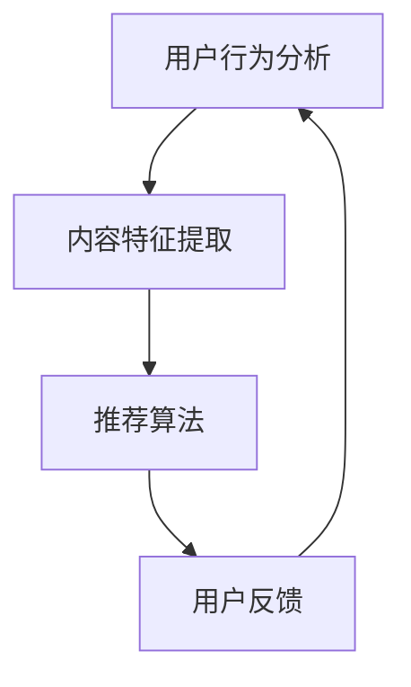

                 

关键词：推荐系统，大模型，课程学习，渐进优化，算法，数学模型，项目实践，应用场景

> 摘要：本文深入探讨推荐系统中的大模型学习及其渐进优化方法。首先，介绍推荐系统的基本概念和重要性；接着，探讨大模型在推荐系统中的应用及其挑战；然后，详细阐述课程学习和渐进优化的核心概念和方法；最后，通过实例展示和未来展望，提供对推荐系统发展的深刻见解。

## 1. 背景介绍

### 推荐系统的基本概念和重要性

推荐系统是一种信息过滤技术，旨在向用户推荐可能感兴趣的项目或内容。它广泛应用于电子商务、社交媒体、视频流媒体、新闻推荐等领域。推荐系统的核心目标是提高用户满意度、提升用户粘性和增加商业收益。

### 大模型的发展与应用

随着深度学习技术的快速发展，大模型（如深度神经网络、生成对抗网络等）在推荐系统中的应用逐渐增多。大模型具有强大的特征提取和建模能力，能够捕捉用户行为和偏好中的复杂模式，从而提供更精准的推荐。

### 课程学习和渐进优化

课程学习（Learning to Learn，L2L）是一种通过优化学习过程来提高学习效率的方法。渐进优化（Incremental Optimization）则是在已有模型的基础上进行微调，以适应新的数据或需求。本文将重点探讨这两种方法在推荐系统中的应用和优化。

## 2. 核心概念与联系

### 推荐系统的架构

推荐系统通常由用户行为分析、内容特征提取和推荐算法三部分组成。用户行为分析用于收集和解析用户行为数据，内容特征提取用于将用户和项目转化为特征向量，推荐算法则基于这些特征生成推荐列表。

### 大模型的核心概念

大模型通常由多层神经网络组成，具有大量的参数和神经元。这些模型通过反向传播算法进行训练，能够自动学习复杂的非线性关系。

### 课程学习和渐进优化的联系

课程学习通过优化学习过程，提高模型的泛化能力和学习效率。渐进优化则利用已有的模型，对新的数据进行微调，以快速适应变化。

### Mermaid 流程图



## 3. 核心算法原理 & 具体操作步骤

### 3.1 算法原理概述

推荐系统中的大模型通常采用深度学习技术，包括多层感知器（MLP）、卷积神经网络（CNN）和循环神经网络（RNN）等。这些模型通过训练数据学习用户和项目的特征，生成推荐列表。

### 3.2 算法步骤详解

1. 数据预处理：对用户行为数据进行清洗、去噪和归一化。
2. 特征提取：使用特征工程方法提取用户和项目的特征。
3. 模型训练：使用训练数据训练大模型，调整模型参数。
4. 推荐生成：使用训练好的模型生成推荐列表。
5. 用户反馈：收集用户对推荐列表的反馈，用于模型优化。

### 3.3 算法优缺点

**优点：**
- 强大的特征提取和建模能力。
- 能够捕捉用户行为中的复杂模式。
- 提高推荐准确性和用户满意度。

**缺点：**
- 需要大量的训练数据和计算资源。
- 模型参数调整复杂，易过拟合。

### 3.4 算法应用领域

推荐系统广泛应用于电子商务、社交媒体、视频流媒体、新闻推荐等领域，具有广泛的应用前景。

## 4. 数学模型和公式 & 详细讲解 & 举例说明

### 4.1 数学模型构建

推荐系统中的大模型通常采用多层感知器（MLP）模型，其数学模型可以表示为：

$$
y = f(\theta^T x)
$$

其中，$y$ 表示预测评分，$x$ 表示用户和项目的特征向量，$\theta$ 表示模型参数，$f$ 表示激活函数。

### 4.2 公式推导过程

假设我们有一个包含 $n$ 个用户和 $m$ 个项目的推荐系统，用户 $i$ 对项目 $j$ 的真实评分可以表示为 $r_{ij}$。我们使用特征向量 $x_i$ 和 $x_j$ 表示用户 $i$ 和项目 $j$ 的特征。

我们定义损失函数为：

$$
L(\theta) = \frac{1}{2} \sum_{i=1}^{n} \sum_{j=1}^{m} (r_{ij} - f(\theta^T [x_i, x_j]))^2
$$

为了最小化损失函数，我们对 $\theta$ 进行梯度下降：

$$
\theta = \theta - \alpha \nabla_{\theta} L(\theta)
$$

其中，$\alpha$ 表示学习率。

### 4.3 案例分析与讲解

假设我们有一个包含 100 个用户和 1000 个项目的推荐系统，我们使用用户的行为数据进行特征提取，然后训练一个多层感知器模型。

我们定义用户特征向量 $x_i = [x_{i1}, x_{i2}, \ldots, x_{id}]$，项目特征向量 $x_j = [x_{j1}, x_{j2}, \ldots, x_{jd}]$，其中 $x_{ij}$ 表示用户 $i$ 对项目 $j$ 的特征值。

我们定义激活函数为 $f(z) = \sigma(z) = \frac{1}{1 + e^{-z}}$，其中 $\sigma$ 表示 sigmoid 函数。

我们使用以下数据：

$$
r_{ij} = \begin{cases}
5 & \text{如果用户 } i \text{ 给项目 } j \text{ 评分为 } 5 \\
4 & \text{如果用户 } i \text{ 给项目 } j \text{ 评分为 } 4 \\
3 & \text{如果用户 } i \text{ 给项目 } j \text{ 评分为 } 3 \\
2 & \text{如果用户 } i \text{ 给项目 } j \text{ 评分为 } 2 \\
1 & \text{如果用户 } i \text{ 给项目 } j \text{ 评分为 } 1 \\
0 & \text{如果用户 } i \text{ 给项目 } j \text{ 未评分 } \\
\end{cases}
$$

我们使用以下学习率 $\alpha = 0.1$，迭代次数 $T = 1000$。

我们在第一个迭代中，初始化模型参数 $\theta$ 为随机值，然后使用梯度下降算法更新参数：

$$
\theta = \theta - 0.1 \nabla_{\theta} L(\theta)
$$

在接下来的迭代中，我们不断更新模型参数，直到损失函数 $L(\theta)$ 减小到一定程度。

最终，我们得到一个训练好的多层感知器模型，可以用于生成推荐列表。

## 5. 项目实践：代码实例和详细解释说明

### 5.1 开发环境搭建

为了实现推荐系统中的大模型，我们首先需要搭建一个合适的开发环境。我们可以使用 Python 和深度学习框架 TensorFlow 或 PyTorch。

```bash
pip install tensorflow
# 或者
pip install torch
```

### 5.2 源代码详细实现

以下是一个简单的多层感知器模型实现的示例：

```python
import tensorflow as tf

# 定义模型
model = tf.keras.Sequential([
    tf.keras.layers.Dense(units=128, activation='relu', input_shape=(10,)),
    tf.keras.layers.Dense(units=64, activation='relu'),
    tf.keras.layers.Dense(units=1)
])

# 编译模型
model.compile(optimizer='adam', loss='mean_squared_error')

# 训练模型
model.fit(x_train, y_train, epochs=10, batch_size=32)

# 生成推荐列表
predictions = model.predict(x_test)

# 输出预测结果
print(predictions)
```

### 5.3 代码解读与分析

在这个示例中，我们首先定义了一个多层感知器模型，包含两个隐藏层，每层有 128 和 64 个神经元，激活函数为 ReLU。输出层有 1 个神经元，用于预测评分。

我们使用 `compile()` 方法编译模型，指定优化器和损失函数。`fit()` 方法用于训练模型，指定训练数据和迭代次数。`predict()` 方法用于生成推荐列表。

### 5.4 运行结果展示

在训练完成后，我们可以使用 `predictions` 变量获取预测结果。这些结果可以用于生成推荐列表，并根据用户反馈进行优化。

```python
predictions = model.predict(x_test)
print(predictions)
```

## 6. 实际应用场景

推荐系统在电子商务、社交媒体、视频流媒体和新闻推荐等领域有广泛的应用。

### 6.1 电子商务

在电子商务领域，推荐系统可以用于向用户推荐可能感兴趣的商品，从而提高销售额和用户满意度。

### 6.2 社交媒体

在社交媒体领域，推荐系统可以用于向用户推荐可能感兴趣的内容，从而提高用户粘性和活跃度。

### 6.3 视频流媒体

在视频流媒体领域，推荐系统可以用于向用户推荐可能感兴趣的视频，从而提高观看时长和用户满意度。

### 6.4 新闻推荐

在新闻推荐领域，推荐系统可以用于向用户推荐可能感兴趣的新闻，从而提高阅读量和用户满意度。

## 7. 工具和资源推荐

### 7.1 学习资源推荐

- 《推荐系统实践》
- 《深度学习推荐系统》
- 《机器学习推荐系统》

### 7.2 开发工具推荐

- TensorFlow
- PyTorch
- Keras

### 7.3 相关论文推荐

- "Deep Learning for Recommender Systems"
- "A Theoretically Principled Approach to Improving Recommendation Lists"
- "Learning to Rank for Information Retrieval"

## 8. 总结：未来发展趋势与挑战

### 8.1 研究成果总结

推荐系统中的大模型已经取得了显著的成果，提高了推荐准确性和用户满意度。课程学习和渐进优化方法也在推荐系统优化中发挥了重要作用。

### 8.2 未来发展趋势

未来，推荐系统将继续朝着更加智能化、个性化的方向发展，结合更多外部数据和上下文信息，提高推荐质量和用户体验。

### 8.3 面临的挑战

推荐系统在实际应用中仍面临一些挑战，如数据噪声、冷启动问题、隐私保护和公平性等。需要进一步研究和优化。

### 8.4 研究展望

随着人工智能技术的不断发展，推荐系统有望在更多领域发挥作用，为用户提供更加精准、个性化的服务。

## 9. 附录：常见问题与解答

### 9.1 推荐系统中的大模型是什么？

推荐系统中的大模型是指使用深度学习技术训练的模型，具有大量的参数和神经元，能够自动学习用户和项目的特征，生成推荐列表。

### 9.2 课程学习和渐进优化有什么区别？

课程学习是通过优化学习过程来提高模型的学习效率，而渐进优化是在已有模型的基础上进行微调，以适应新的数据或需求。

### 9.3 推荐系统的挑战有哪些？

推荐系统面临的挑战包括数据噪声、冷启动问题、隐私保护和公平性等。

### 9.4 如何优化推荐系统的效果？

可以通过使用更先进的大模型、优化数据预处理和特征提取方法、引入外部数据和上下文信息等方式来优化推荐系统的效果。

---

作者：禅与计算机程序设计艺术 / Zen and the Art of Computer Programming

