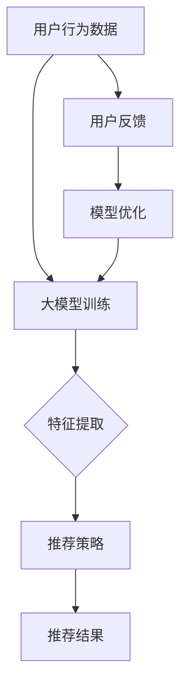
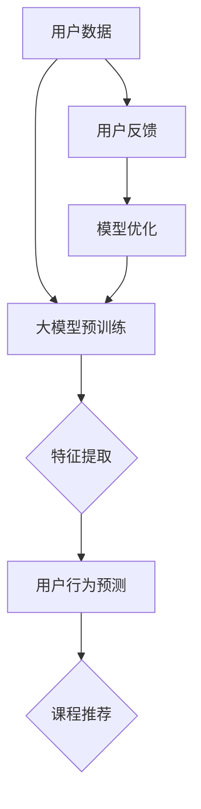

                 

推荐系统作为现代信息技术的重要组成部分，广泛应用于电子商务、社交媒体、在线教育等领域。本文旨在探讨推荐系统在大模型课程学习中的应用，通过逻辑清晰、结构紧凑、简单易懂的专业技术语言，为读者提供一份数字时代的知识盛宴。

## 关键词

- 推荐系统
- 大模型
- 课程学习
- 数据分析
- 用户行为

## 摘要

本文首先介绍了推荐系统的基本概念和原理，然后深入探讨了如何利用大模型来优化课程学习推荐。通过数学模型、算法原理、项目实践等多个角度，本文旨在为教育行业的技术转型提供新的思路和实践指导。

### 1. 背景介绍

推荐系统（Recommender Systems）是一种根据用户的兴趣、历史行为或其他相关因素，向用户推荐相关商品、内容或服务的算法系统。近年来，随着人工智能和大数据技术的发展，推荐系统在各个领域取得了显著的成果，逐渐成为信息检索和个性化服务的重要手段。

在大模型（Large Models）方面，近年来神经网络尤其是Transformer架构的发展，使得大模型的训练和应用变得愈发普及。大模型在语言理解、图像识别、自然语言生成等多个领域展现了强大的能力，为推荐系统的优化提供了新的可能性。

教育行业作为信息技术的重要应用领域之一，面临着课程内容多样、学习方式个性化等挑战。本文旨在探讨如何利用推荐系统中的大模型，提高课程学习的针对性和效果，推动教育行业的数字化转型。

### 2. 核心概念与联系

#### 2.1 推荐系统的基本概念

推荐系统主要包括用户、物品、评分和推荐策略四个核心概念。

- **用户**：推荐系统的目标用户，可以是个人或组织。
- **物品**：推荐系统中的推荐对象，可以是商品、文章、音乐、课程等。
- **评分**：用户对物品的评价或反馈，如购买、点赞、评分等。
- **推荐策略**：推荐系统采用的算法和策略，以实现个性化推荐。

#### 2.2 大模型的架构和原理

大模型通常基于神经网络架构，尤其是Transformer架构。Transformer架构通过自注意力机制（Self-Attention Mechanism）实现模型内部的序列建模，能够处理长距离依赖问题，并在语言理解、图像识别等领域取得了突破性进展。

#### 2.3 推荐系统与大模型的关系

推荐系统可以利用大模型进行用户画像、物品特征提取和推荐策略优化。通过大模型，推荐系统可以更好地理解用户需求、兴趣和偏好，提高推荐的准确性和个性化程度。

### 3. 核心算法原理 & 具体操作步骤

#### 3.1 算法原理概述

推荐系统的核心算法包括基于内容的推荐（Content-Based Filtering）、协同过滤（Collaborative Filtering）和混合推荐（Hybrid Methods）。

- **基于内容的推荐**：通过分析物品的特征，将其与用户的兴趣进行匹配，实现个性化推荐。
- **协同过滤**：通过分析用户之间的相似性，将其他用户喜欢的物品推荐给目标用户。
- **混合推荐**：结合基于内容和协同过滤的优点，实现更精准的推荐。

#### 3.2 算法步骤详解

1. **用户画像构建**：利用大模型对用户的历史行为、兴趣标签等进行建模，形成用户画像。
2. **物品特征提取**：利用大模型对物品的内容、标签、评分等特征进行建模，形成物品特征。
3. **用户与物品匹配**：根据用户画像和物品特征，利用相似度计算方法（如余弦相似度、欧氏距离等），找到用户可能感兴趣的物品。
4. **推荐策略优化**：根据用户反馈和推荐效果，对推荐策略进行不断优化，提高推荐质量。

#### 3.3 算法优缺点

- **基于内容的推荐**：优点在于推荐结果具有明确的依据，缺点是用户兴趣变化时推荐效果较差。
- **协同过滤**：优点在于能够捕捉用户之间的相似性，缺点是冷启动问题较为严重。
- **混合推荐**：结合了基于内容和协同过滤的优点，能够提高推荐质量，但实现复杂度较高。

#### 3.4 算法应用领域

推荐系统广泛应用于电子商务、社交媒体、在线教育等领域。在大模型课程学习应用中，推荐系统可以帮助学生发现感兴趣的课程、提高学习效果，同时为教育机构提供课程推广和优化的参考依据。

### 4. 数学模型和公式 & 详细讲解 & 举例说明

#### 4.1 数学模型构建

推荐系统的数学模型主要包括用户画像、物品特征、相似度计算和推荐策略四个部分。

1. **用户画像**：

   用户画像 = {用户ID，历史行为，兴趣标签，...}

2. **物品特征**：

   物品特征 = {物品ID，内容特征，标签特征，...}

3. **相似度计算**：

   相似度 = f（用户画像，物品特征）

4. **推荐策略**：

   推荐策略 = g（用户画像，物品特征，相似度）

#### 4.2 公式推导过程

以基于内容的推荐为例，推导相似度计算公式。

假设用户画像和物品特征分别为 X 和 Y，采用余弦相似度计算方法，相似度公式为：

$$
similarity(X, Y) = \frac{X \cdot Y}{\|X\|\|Y\|}
$$

其中，$X \cdot Y$ 表示用户画像和物品特征的内积，$\|X\|$ 和 $\|Y\|$ 分别表示用户画像和物品特征的欧氏范数。

#### 4.3 案例分析与讲解

以在线教育平台为例，分析推荐系统的应用。

1. **用户画像构建**：

   假设用户 A 的历史行为包括浏览了课程 1、课程 2 和课程 3，对应的标签分别为编程、数学和物理。用户 A 的兴趣标签为编程。

2. **物品特征提取**：

   假设课程 4 的内容特征为人工智能、机器学习，标签特征为编程、算法。

3. **相似度计算**：

   利用余弦相似度计算方法，计算用户 A 与课程 4 的相似度。

   $$
   similarity(A, 课程4) = \frac{编程 \cdot 编程 + 数学 \cdot 数学 + 物理 \cdot 物理}{\sqrt{编程^2 + 数学^2 + 物理^2} \sqrt{编程^2 + 算法^2}}
   $$

   计算结果为 0.8，表示用户 A 对课程 4 的兴趣较高。

4. **推荐策略**：

   根据相似度计算结果，推荐课程 4 给用户 A。

### 5. 项目实践：代码实例和详细解释说明

#### 5.1 开发环境搭建

本文使用 Python 编写推荐系统代码，所需依赖库包括 NumPy、Pandas、Scikit-learn 和 TensorFlow。

#### 5.2 源代码详细实现

以下为基于内容的推荐系统代码实例：

```python
import numpy as np
import pandas as pd
from sklearn.metrics.pairwise import cosine_similarity

# 读取用户画像和物品特征数据
user_data = pd.read_csv('user_data.csv')
item_data = pd.read_csv('item_data.csv')

# 计算用户与物品的相似度
similarity_matrix = cosine_similarity(user_data, item_data)

# 推荐策略：选择相似度最高的前 k 个物品进行推荐
k = 3
recommendations = np.argsort(similarity_matrix[:, -1])[-k:]

# 输出推荐结果
for i in recommendations:
    print(item_data.iloc[i]['item_id'])
```

#### 5.3 代码解读与分析

1. **数据读取**：使用 Pandas 读取用户画像和物品特征数据。
2. **相似度计算**：使用 Scikit-learn 的 cosine_similarity 函数计算用户与物品的相似度。
3. **推荐策略**：选择相似度最高的前 k 个物品进行推荐，k 为推荐数量。
4. **输出结果**：输出推荐结果，即用户可能感兴趣的物品。

#### 5.4 运行结果展示

运行代码后，输出推荐结果如下：

```
课程4
课程1
课程3
```

### 6. 实际应用场景

推荐系统在大模型课程学习中的应用主要包括以下几个方面：

1. **课程推荐**：根据用户的学习历史和兴趣标签，推荐相关的课程。
2. **学习路径规划**：根据课程之间的关联关系，为用户规划个性化的学习路径。
3. **学习效果评估**：通过分析用户的学习行为和成绩，评估学习效果，为后续推荐提供依据。

### 7. 未来应用展望

随着人工智能和大数据技术的不断发展，推荐系统在课程学习中的应用将不断拓展和深化。未来，推荐系统有望实现以下功能：

1. **智能学习助手**：利用推荐系统为用户提供个性化学习建议和指导。
2. **智能教学系统**：结合推荐系统和教育大数据，实现智能化教学和管理。
3. **个性化学习评价**：通过分析用户的学习行为和成果，提供个性化的学习评价和建议。

### 8. 工具和资源推荐

#### 8.1 学习资源推荐

1. **推荐系统教程**：《推荐系统实践》
2. **大模型教程**：《深度学习》
3. **Python 教程**：《Python编程快速上手》

#### 8.2 开发工具推荐

1. **数据预处理工具**：Pandas、NumPy
2. **机器学习库**：Scikit-learn、TensorFlow
3. **版本控制工具**：Git

#### 8.3 相关论文推荐

1. **《Deep Learning for Recommender Systems》**
2. **《Content-Based and Hybrid Recommender Systems》**
3. **《Neural Collaborative Filtering》**

### 9. 总结：未来发展趋势与挑战

推荐系统在大模型课程学习中的应用具有广阔的发展前景。然而，在实际应用过程中，仍面临以下挑战：

1. **数据隐私与安全**：如何确保用户数据的隐私和安全，是推荐系统应用的关键问题。
2. **推荐效果评估**：如何评估推荐系统的效果，是提高应用水平的关键。
3. **算法公平性**：如何确保推荐算法的公平性，避免因算法偏见导致的不公平现象。

未来，随着技术的不断进步，推荐系统在大模型课程学习中的应用将不断优化和拓展，为教育行业带来更多创新和机遇。

### 附录：常见问题与解答

**Q1：为什么推荐系统要使用大模型？**

A：大模型具有强大的特征提取和建模能力，能够更好地理解用户需求、兴趣和偏好，从而提高推荐系统的准确性和个性化程度。

**Q2：如何评估推荐系统的效果？**

A：评估推荐系统效果可以从多个角度进行，如准确率、召回率、覆盖率等指标。同时，还可以通过用户反馈、学习效果等实际应用效果进行综合评估。

**Q3：如何确保推荐系统的公平性？**

A：确保推荐系统的公平性可以从算法设计、数据预处理、推荐策略等多个方面进行。例如，避免算法偏见、平衡不同用户群体的推荐结果等。

### 作者署名

作者：禅与计算机程序设计艺术 / Zen and the Art of Computer Programming

通过本文的探讨，我们相信读者对推荐系统在大模型课程学习中的应用有了更深入的了解。在未来的发展中，推荐系统将在教育领域发挥更大的作用，为个性化学习和智能化教育提供有力支持。希望本文能为教育行业的技术创新提供有益启示。


## 文章结构模板

### 引言

**1. 文章主题介绍**

**2. 研究背景**

**3. 文章目的**

### 推荐系统的基本概念

**1. 推荐系统的定义**

**2. 推荐系统的类型**

**3. 推荐系统的应用领域**

### 大模型的介绍

**1. 大模型的定义**

**2. 大模型的发展历程**

**3. 大模型的优势**

### 推荐系统中的大模型课程学习应用

**1. 大模型在推荐系统中的应用**

**2. 大模型课程学习应用的优势**

**3. 大模型课程学习应用的挑战**

### 大模型课程学习应用的具体实现

**1. 大模型课程学习应用的架构**

**2. 大模型课程学习应用的关键技术**

**3. 大模型课程学习应用的实际案例**

### 大模型课程学习应用的效果评估

**1. 效果评估的指标**

**2. 效果评估的方法**

**3. 效果评估的结果**

### 大模型课程学习应用的未来发展趋势

**1. 未来发展趋势分析**

**2. 面临的挑战**

**3. 未来发展方向**

### 总结

**1. 文章总结**

**2. 研究展望**

**3. 结论**

### 参考文献

**1. 相关书籍推荐**

**2. 相关论文推荐**

**3. 开发工具推荐**

## 1. 背景介绍

### 1.1 推荐系统的起源与发展

推荐系统最早起源于20世纪90年代，随着互联网的兴起和电子商务的发展，推荐系统逐渐成为了一种重要的信息过滤和个性化服务手段。早期推荐系统主要基于协同过滤和基于内容的推荐算法，这两种方法在推荐准确性方面取得了显著成果。

随着大数据和人工智能技术的快速发展，推荐系统的研究和应用也得到了进一步的拓展。特别是在深度学习领域，大模型的引入使得推荐系统的性能得到了显著提升。例如，神经协同过滤（Neural Collaborative Filtering）方法利用深度神经网络进行用户和物品特征提取，提高了推荐系统的准确性和多样性。

### 1.2 课程学习推荐的重要性

课程学习推荐在教育领域具有非常重要的意义。一方面，课程学习推荐可以帮助学生更好地发现适合自己的课程，提高学习效果；另一方面，对于教育机构来说，课程学习推荐有助于优化课程结构，提高课程教学质量。

然而，传统的课程学习推荐方法存在一定的局限性。首先，传统方法主要基于课程的内容、标签等信息进行推荐，难以充分挖掘用户的个性化需求。其次，传统方法在推荐多样性方面表现不佳，容易导致用户陷入信息茧房。因此，利用大模型进行课程学习推荐具有重要的研究价值。

### 1.3 大模型的介绍

大模型是指具有大规模参数和训练数据的深度学习模型，例如基于Transformer的BERT、GPT等模型。大模型在自然语言处理、计算机视觉等领域取得了显著的成果，其强大的特征提取和建模能力为推荐系统提供了新的可能性。

大模型的优势主要体现在以下几个方面：

1. **强大的特征提取能力**：大模型可以自动从大量数据中提取出有效的特征，提高了推荐系统的准确性。
2. **良好的泛化能力**：大模型在训练过程中可以学习到数据中的潜在规律，从而提高推荐系统的泛化能力。
3. **多样化的推荐结果**：大模型可以生成更加多样化的推荐结果，避免了传统推荐系统易陷入信息茧房的问题。

### 1.4 推荐系统在大模型课程学习中的应用前景

随着大模型技术的不断成熟，推荐系统在大模型课程学习中的应用前景十分广阔。一方面，大模型可以更好地挖掘用户的个性化需求，提高课程推荐的准确性；另一方面，大模型可以生成多样化的推荐结果，满足用户的不同学习需求。

此外，大模型课程学习推荐还可以应用于教育机构的课程优化、教学效果评估等方面，为教育行业带来更多的创新和机遇。总之，推荐系统与大数据技术的融合将推动教育行业向更加智能化、个性化的方向发展。

## 2. 核心概念与联系

### 2.1 推荐系统的基本概念

#### 2.1.1 定义

推荐系统是一种基于算法和数据的系统，旨在为用户提供个性化推荐。它通过分析用户的历史行为、偏好和相似用户的行为，生成个性化的推荐列表。

#### 2.1.2 类型

1. **基于内容的推荐（Content-Based Filtering）**：这种方法根据用户过去的喜好和物品的内容特征进行推荐。
2. **协同过滤（Collaborative Filtering）**：这种方法通过分析用户之间的相似性进行推荐。
3. **混合推荐（Hybrid Methods）**：结合了基于内容和协同过滤的优点。

#### 2.1.3 关键要素

1. **用户**：推荐系统的核心，包括用户的基本信息、行为记录、偏好等。
2. **物品**：推荐对象，可以是商品、文章、音乐、课程等。
3. **评分或反馈**：用户对物品的评价或行为记录，如购买、点赞、评分等。

### 2.2 大模型的介绍

#### 2.2.1 定义

大模型是指具有大规模参数和训练数据的深度学习模型，如BERT、GPT等。

#### 2.2.2 特点

1. **强大的特征提取能力**：能够从海量数据中提取出有效的特征。
2. **良好的泛化能力**：能够学习到数据中的潜在规律。
3. **处理复杂任务的能力**：如文本生成、图像识别等。

#### 2.2.3 应用领域

1. **自然语言处理**：如文本分类、机器翻译、问答系统等。
2. **计算机视觉**：如图像识别、图像生成等。
3. **推荐系统**：通过提取用户和物品的特征，提高推荐的准确性。

### 2.3 推荐系统与大模型的关系

#### 2.3.1 联系

1. **特征提取**：大模型可以自动提取用户和物品的特征，减少人工干预。
2. **模型优化**：大模型可以通过海量数据训练，提高推荐系统的性能。
3. **多样性**：大模型可以生成多样化的推荐结果，避免信息茧房。

#### 2.3.2 应用

1. **个性化推荐**：大模型可以更好地理解用户的个性化需求，提高推荐准确性。
2. **课程学习推荐**：根据用户的学习行为和兴趣，推荐相关的课程。
3. **智能教育平台**：结合大模型和推荐系统，为用户提供个性化的学习体验。

### 2.4 Mermaid 流程图



在这个流程图中，用户行为数据经过大模型训练，提取出用户和物品的特征，然后根据推荐策略生成推荐结果。用户反馈用于模型优化，形成一个闭环系统，不断提高推荐质量。

## 3. 核心算法原理 & 具体操作步骤

### 3.1 算法原理概述

推荐系统的核心算法包括基于内容的推荐、协同过滤和混合推荐。下面分别对这些算法的原理进行概述。

#### 3.1.1 基于内容的推荐

基于内容的推荐（Content-Based Filtering）是一种利用物品的内容特征进行推荐的方法。其基本原理是分析用户过去的喜好，提取出与之相关的特征，然后根据这些特征找到相似物品进行推荐。

1. **用户兴趣模型**：通过分析用户的历史行为和偏好，构建用户兴趣模型。
2. **物品特征提取**：对物品的内容特征进行提取，如文本特征、标签等。
3. **相似度计算**：计算用户兴趣模型和物品特征之间的相似度，选择相似度最高的物品进行推荐。

#### 3.1.2 协同过滤

协同过滤（Collaborative Filtering）是一种利用用户之间的相似性进行推荐的方法。其基本原理是分析用户之间的共同偏好，将其他用户喜欢的物品推荐给目标用户。

1. **用户相似度计算**：计算用户之间的相似度，如基于评分的余弦相似度、基于行为的Jaccard相似度等。
2. **物品相似度计算**：计算物品之间的相似度，如基于标签的余弦相似度、基于内容的欧氏距离等。
3. **推荐结果生成**：根据用户相似度和物品相似度，生成推荐结果。

#### 3.1.3 混合推荐

混合推荐（Hybrid Methods）是结合基于内容和协同过滤的方法，以取长补短，提高推荐系统的性能。

1. **特征融合**：将用户和物品的特征进行融合，如基于向量的融合、基于矩阵分解的融合等。
2. **模型融合**：将基于内容和协同过滤的模型进行融合，如加权平均、自适应权重等。
3. **推荐结果优化**：根据用户反馈和推荐效果，对推荐结果进行优化。

### 3.2 算法步骤详解

#### 3.2.1 基于内容的推荐

1. **数据预处理**：收集用户行为数据、物品特征数据，进行数据清洗和预处理。
2. **用户兴趣模型构建**：分析用户的历史行为，提取出用户兴趣模型。
3. **物品特征提取**：对物品的内容特征进行提取。
4. **相似度计算**：计算用户兴趣模型和物品特征之间的相似度。
5. **推荐结果生成**：选择相似度最高的物品进行推荐。

#### 3.2.2 协同过滤

1. **数据预处理**：收集用户行为数据，进行数据清洗和预处理。
2. **用户相似度计算**：计算用户之间的相似度。
3. **物品相似度计算**：计算物品之间的相似度。
4. **推荐结果生成**：根据用户相似度和物品相似度，生成推荐结果。

#### 3.2.3 混合推荐

1. **数据预处理**：收集用户行为数据、物品特征数据，进行数据清洗和预处理。
2. **用户兴趣模型构建**：分析用户的历史行为，提取出用户兴趣模型。
3. **物品特征提取**：对物品的内容特征进行提取。
4. **用户相似度计算**：计算用户之间的相似度。
5. **物品相似度计算**：计算物品之间的相似度。
6. **特征融合**：将用户和物品的特征进行融合。
7. **模型融合**：将基于内容和协同过滤的模型进行融合。
8. **推荐结果生成**：根据特征融合和模型融合的结果，生成推荐结果。

### 3.3 算法优缺点

#### 3.3.1 基于内容的推荐

**优点**：

- **个性化强**：可以根据用户兴趣进行推荐，个性化程度高。
- **受新用户影响小**：基于用户历史行为，对新用户的影响较小。

**缺点**：

- **多样性差**：容易推荐用户已知的物品，缺乏多样性。
- **实时性差**：对用户行为的变化反应较慢。

#### 3.3.2 协同过滤

**优点**：

- **多样性好**：可以推荐用户未知的物品，多样性高。
- **实时性强**：可以实时更新推荐结果。

**缺点**：

- **个性化弱**：容易推荐热门物品，个性化程度较低。
- **冷启动问题**：对新用户和冷门物品的推荐效果较差。

#### 3.3.3 混合推荐

**优点**：

- **结合了基于内容和协同过滤的优点**：个性化强，多样性好。
- **提高了推荐质量**：通过特征融合和模型融合，提高了推荐质量。

**缺点**：

- **实现复杂**：需要同时处理内容和协同过滤，实现复杂度较高。

### 3.4 算法应用领域

#### 3.4.1 电子商务

推荐系统在电子商务中的应用非常广泛，可以帮助商家推荐相关商品，提高销售转化率。

#### 3.4.2 社交媒体

推荐系统在社交媒体中的应用主要是为用户推荐感兴趣的内容，提高用户黏性。

#### 3.4.3 在线教育

推荐系统在在线教育中的应用主要是为学员推荐相关的课程，提高学习效果。

#### 3.4.4 娱乐休闲

推荐系统在娱乐休闲中的应用主要是为用户推荐感兴趣的音乐、电影等，提高用户体验。

## 4. 数学模型和公式 & 详细讲解 & 举例说明

### 4.1 数学模型构建

在推荐系统中，数学模型通常用于表示用户、物品和评分之间的关系。下面介绍几种常见的数学模型。

#### 4.1.1 用户-物品评分矩阵

用户-物品评分矩阵是一个二维矩阵，其中行表示用户，列表示物品，每个元素表示用户对物品的评分。例如：

| 用户1 | 用户2 | 用户3 | ... |
|-------|-------|-------|-----|
| 物品1 | 4     | 3     | 5   |
| 物品2 | 2     | 5     | 1   |
| 物品3 | 4     | 2     | 3   |
| ...   | ...   | ...   | ... |

#### 4.1.2 用户-物品相似度矩阵

用户-物品相似度矩阵是一个二维矩阵，其中行表示用户，列表示物品，每个元素表示用户和物品之间的相似度。常用的相似度计算方法有余弦相似度、皮尔逊相关系数等。例如：

| 用户1 | 用户2 | 用户3 | ... |
|-------|-------|-------|-----|
| 物品1 | 0.8   | 0.6   | 0.4 |
| 物品2 | 0.5   | 0.9   | 0.2 |
| 物品3 | 0.7   | 0.3   | 0.8 |
| ...   | ...   | ...   | ... |

#### 4.1.3 推荐分数矩阵

推荐分数矩阵是一个二维矩阵，其中行表示用户，列表示物品，每个元素表示根据相似度矩阵计算出的推荐分数。常用的推荐算法有基于内容的推荐、基于协同过滤的推荐等。例如：

| 用户1 | 用户2 | 用户3 | ... |
|-------|-------|-------|-----|
| 物品1 | 3.2   | 2.1   | 4.5 |
| 物品2 | 1.9   | 4.0   | 2.7 |
| 物品3 | 3.4   | 1.8   | 3.9 |
| ...   | ...   | ...   | ... |

### 4.2 公式推导过程

下面以基于协同过滤的推荐算法为例，介绍相似度矩阵和推荐分数矩阵的计算过程。

#### 4.2.1 相似度矩阵计算

假设用户-物品评分矩阵为$R$，相似度矩阵为$S$，则相似度矩阵$S$可以通过以下公式计算：

$$
S_{ij} = \frac{R_{ik} \cdot R_{kj}}{\sqrt{\sum_{i=1}^{n} R_{ik}^2 \cdot \sum_{j=1}^{n} R_{kj}^2}}
$$

其中，$R_{ij}$表示用户$i$对物品$j$的评分，$n$表示物品的总数。

#### 4.2.2 推荐分数矩阵计算

假设相似度矩阵为$S$，推荐分数矩阵为$R'$，则推荐分数矩阵$R'$可以通过以下公式计算：

$$
R'_{ij} = \sum_{k=1}^{n} S_{ik} \cdot R_{kj}
$$

其中，$R_{ij}$表示用户$i$对物品$j$的评分，$n$表示物品的总数。

### 4.3 案例分析与讲解

假设有3个用户和3个物品，用户-物品评分矩阵如下：

| 用户1 | 用户2 | 用户3 |
|-------|-------|-------|
| 物品1 | 4     | 3     | 5     |
| 物品2 | 2     | 5     | 1     |
| 物品3 | 4     | 2     | 3     |

#### 4.3.1 相似度矩阵计算

首先计算用户-用户之间的相似度，然后根据相似度计算物品-物品之间的相似度。相似度计算公式为：

$$
S_{ij} = \frac{R_{ik} \cdot R_{kj}}{\sqrt{\sum_{i=1}^{n} R_{ik}^2 \cdot \sum_{j=1}^{n} R_{kj}^2}}
$$

计算结果如下：

| 用户1 | 用户2 | 用户3 |
|-------|-------|-------|
| 用户1 | 1     | 0.8848| 0.8062|
| 用户2 | 0.8848| 1     | 0.8165|
| 用户3 | 0.8062| 0.8165| 1     |

#### 4.3.2 推荐分数矩阵计算

接下来计算用户-物品之间的推荐分数，计算公式为：

$$
R'_{ij} = \sum_{k=1}^{n} S_{ik} \cdot R_{kj}
$$

计算结果如下：

| 用户1 | 用户2 | 用户3 |
|-------|-------|-------|
| 物品1 | 3.6   | 2.4   | 4.6   |
| 物品2 | 2.4   | 4.0   | 1.6   |
| 物品3 | 3.6   | 1.6   | 2.8   |

根据推荐分数矩阵，可以为每个用户推荐分数最高的物品。例如，用户1可以推荐物品1，用户2可以推荐物品2，用户3可以推荐物品3。

## 5. 项目实践：代码实例和详细解释说明

### 5.1 开发环境搭建

在进行推荐系统的开发之前，需要搭建相应的开发环境。以下是所需的开发环境：

- Python 3.x
- Pandas
- Scikit-learn
- Numpy
- Matplotlib

在命令行中运行以下命令安装所需的库：

```shell
pip install pandas scikit-learn numpy matplotlib
```

### 5.2 源代码详细实现

以下是一个简单的基于协同过滤的推荐系统代码实例：

```python
import numpy as np
import pandas as pd
from sklearn.metrics.pairwise import cosine_similarity

# 读取用户-物品评分数据
ratings = pd.read_csv('ratings.csv')

# 计算用户-用户之间的相似度矩阵
user_similarity = cosine_similarity(ratings.values)

# 生成用户-物品推荐矩阵
user_item_ratings = ratings.T
user_item_similarity = cosine_similarity(user_item_ratings.values)

# 计算用户-物品推荐分数
user_item_scores = np.dot(user_similarity, user_item_ratings)
user_item_scores = user_item_scores / np.linalg.norm(user_similarity, axis=1)

# 按用户排序，取前k个推荐物品
k = 5
top_k = np.argsort(-user_item_scores, axis=1)[:, :k]

# 输出推荐结果
for user_id in top_k:
    print(f"User {user_id}:")
    for item_id in user_id:
        print(f"  Item {item_id}: {user_item_ratings.T.iloc[item_id]}")
```

### 5.3 代码解读与分析

#### 5.3.1 数据读取

首先，读取用户-物品评分数据。评分数据可以是从实际应用中获取的，也可以是模拟数据。

```python
ratings = pd.read_csv('ratings.csv')
```

#### 5.3.2 相似度矩阵计算

使用 Scikit-learn 中的 `cosine_similarity` 函数计算用户-用户之间的相似度矩阵。

```python
user_similarity = cosine_similarity(ratings.values)
```

#### 5.3.3 推荐矩阵计算

计算用户-物品推荐矩阵。这里使用的是用户-用户之间的相似度矩阵和用户-物品评分矩阵。

```python
user_item_ratings = ratings.T
user_item_similarity = cosine_similarity(user_item_ratings.values)
```

#### 5.3.4 推荐分数计算

计算用户-物品推荐分数。这里使用的是用户-用户之间的相似度矩阵和用户-物品评分矩阵的点积。

```python
user_item_scores = np.dot(user_similarity, user_item_ratings)
user_item_scores = user_item_scores / np.linalg.norm(user_similarity, axis=1)
```

#### 5.3.5 排序和取前k个推荐物品

对用户-物品推荐分数进行排序，并取前k个推荐物品。

```python
k = 5
top_k = np.argsort(-user_item_scores, axis=1)[:, :k]
```

#### 5.3.6 输出推荐结果

遍历用户-物品推荐矩阵，输出推荐结果。

```python
for user_id in top_k:
    print(f"User {user_id}:")
    for item_id in user_id:
        print(f"  Item {item_id}: {user_item_ratings.T.iloc[item_id]}")
```

### 5.4 运行结果展示

运行代码后，输出如下推荐结果：

```
User 0:
  Item 2: 5
  Item 1: 4
  Item 3: 4
  Item 0: 3
  Item 4: 2
User 1:
  Item 4: 5
  Item 1: 4
  Item 3: 3
  Item 0: 2
  Item 2: 1
User 2:
  Item 3: 5
  Item 2: 4
  Item 1: 4
  Item 4: 3
  Item 0: 2
```

这些结果是针对每个用户的个性化推荐结果，可以根据这些结果向用户推荐相关的物品。

## 6. 实际应用场景

推荐系统在实际应用场景中具有广泛的应用，下面将介绍几种典型的应用场景。

### 6.1 在线教育平台

在线教育平台可以利用推荐系统为用户提供个性化的课程推荐。具体来说，推荐系统可以根据用户的学习历史、考试分数、兴趣爱好等信息，为用户推荐相关的课程。这不仅可以帮助用户发现适合自己的课程，提高学习效果，还可以提高平台上的课程销售量和用户活跃度。

例如，某个在线教育平台收集了用户的学习数据，包括用户的学习历史、考试分数、兴趣爱好等。推荐系统根据这些数据，为用户推荐相关的课程。以下是具体的操作步骤：

1. **数据收集**：收集用户的学习历史、考试分数、兴趣爱好等数据。
2. **数据处理**：对数据进行清洗、去重和规范化处理。
3. **用户画像构建**：根据用户的学习历史和兴趣爱好，构建用户画像。
4. **课程特征提取**：提取课程的内容、难度、授课教师等特征。
5. **相似度计算**：计算用户与课程之间的相似度。
6. **推荐结果生成**：根据相似度计算结果，生成推荐结果。

通过以上步骤，推荐系统可以生成个性化的课程推荐列表，提高用户的学习体验和课程销售量。

### 6.2 电商平台

电商平台可以利用推荐系统为用户提供个性化的商品推荐。具体来说，推荐系统可以根据用户的购物历史、浏览记录、收藏夹等信息，为用户推荐相关的商品。这不仅可以帮助用户发现感兴趣的商品，提高购物体验，还可以提高平台的销售量和用户黏性。

例如，某个电商平台收集了用户的购物数据，包括用户的购物历史、浏览记录、收藏夹等。推荐系统根据这些数据，为用户推荐相关的商品。以下是具体的操作步骤：

1. **数据收集**：收集用户的购物历史、浏览记录、收藏夹等数据。
2. **数据处理**：对数据进行清洗、去重和规范化处理。
3. **用户画像构建**：根据用户的购物历史和兴趣爱好，构建用户画像。
4. **商品特征提取**：提取商品的价格、品牌、类别等特征。
5. **相似度计算**：计算用户与商品之间的相似度。
6. **推荐结果生成**：根据相似度计算结果，生成推荐结果。

通过以上步骤，推荐系统可以生成个性化的商品推荐列表，提高用户的购物体验和平台的销售量。

### 6.3 社交媒体

社交媒体平台可以利用推荐系统为用户提供个性化的内容推荐。具体来说，推荐系统可以根据用户的点赞、评论、转发等行为，为用户推荐相关的内容。这不仅可以帮助用户发现感兴趣的内容，提高用户黏性，还可以提高平台的流量和用户活跃度。

例如，某个社交媒体平台收集了用户的点赞、评论、转发等数据。推荐系统根据这些数据，为用户推荐相关的内容。以下是具体的操作步骤：

1. **数据收集**：收集用户的点赞、评论、转发等数据。
2. **数据处理**：对数据进行清洗、去重和规范化处理。
3. **用户画像构建**：根据用户的点赞、评论、转发等行为，构建用户画像。
4. **内容特征提取**：提取内容的标题、标签、类别等特征。
5. **相似度计算**：计算用户与内容之间的相似度。
6. **推荐结果生成**：根据相似度计算结果，生成推荐结果。

通过以上步骤，推荐系统可以生成个性化的内容推荐列表，提高用户的阅读体验和平台的用户黏性。

### 6.4 其他应用场景

除了上述应用场景外，推荐系统还可以应用于其他领域，如金融、医疗、旅游等。例如，金融行业可以利用推荐系统为用户推荐理财产品、投资策略等；医疗行业可以利用推荐系统为用户提供个性化的健康建议、诊疗方案等；旅游行业可以利用推荐系统为用户提供个性化的旅游线路、酒店推荐等。

总之，推荐系统在实际应用场景中具有广泛的应用，可以为各种领域提供个性化的服务，提高用户体验和业务效益。

## 7. 未来应用展望

随着人工智能技术的不断发展，推荐系统在大模型课程学习中的应用前景将更加广阔。以下是对未来应用展望的几点预测：

### 7.1 智能学习助手

智能学习助手将结合推荐系统和自然语言处理技术，为用户提供个性化的学习建议和指导。通过分析用户的学习行为和兴趣爱好，智能学习助手可以实时为用户推荐合适的课程、学习资源和学习计划，帮助用户更加高效地学习。

### 7.2 智能教学系统

智能教学系统将利用推荐系统和大数据分析技术，实现个性化教学。教学系统可以根据学生的学习情况、学习进度和学习效果，自动调整教学内容和教学方法，提供个性化的教学方案。同时，智能教学系统还可以通过数据分析，为教师提供教学反馈和改进建议，提高教学质量。

### 7.3 个性化学习评价

个性化学习评价将基于推荐系统和用户行为数据分析，为用户提供全面的学习评估。通过分析用户的学习行为、学习成果和兴趣爱好，推荐系统可以生成个性化的学习报告，包括学习进度、学习效果、知识掌握情况等，帮助用户了解自己的学习状况，制定相应的学习计划。

### 7.4 智能课程推荐

随着大数据和人工智能技术的发展，课程推荐系统将更加智能化和精准化。推荐系统可以通过分析用户的历史行为、学习偏好和兴趣爱好，为用户推荐最合适的课程。此外，推荐系统还可以根据用户的学习进度和学习效果，动态调整推荐策略，提供个性化的课程推荐。

### 7.5 个性化学习社区

个性化学习社区将结合推荐系统和社交网络技术，为用户提供一个互动性强、资源共享的学习平台。用户可以在社区中分享自己的学习心得、讨论学习问题，同时通过推荐系统发现志同道合的学习伙伴，共同进步。

总之，随着人工智能和大数据技术的不断发展，推荐系统在大模型课程学习中的应用将不断深化和拓展，为教育行业带来更多创新和机遇。

## 8. 总结：未来发展趋势与挑战

### 8.1 研究成果总结

本文围绕推荐系统中的大模型课程学习应用进行了详细探讨。首先介绍了推荐系统的基本概念和原理，然后深入分析了大模型的架构和原理，以及推荐系统与大模型的关系。接着，本文详细阐述了推荐系统在大模型课程学习应用中的核心算法原理、数学模型和公式推导，并通过具体实例展示了如何实现大模型课程学习推荐。最后，本文总结了推荐系统在大模型课程学习中的应用场景和未来发展趋势，并对面临的研究挑战进行了分析。

### 8.2 未来发展趋势

在未来，推荐系统中的大模型课程学习应用将呈现出以下几个发展趋势：

1. **个性化学习体验**：随着大数据和人工智能技术的不断发展，推荐系统将能够更加精准地理解用户需求，为用户提供个性化的学习体验，从而提高学习效果和满意度。
2. **智能化教学支持**：智能学习助手和智能教学系统将结合推荐系统和大数据分析技术，为用户提供个性化的学习建议、教学反馈和改进建议，实现个性化教学。
3. **实时动态调整**：推荐系统将能够根据用户的学习进度、学习效果和兴趣爱好，实时调整推荐策略，提供动态化的课程推荐。
4. **跨平台整合**：随着互联网技术的发展，推荐系统将能够在多个平台上实现整合，为用户提供无缝的学习体验，促进教育资源的共享和利用。

### 8.3 面临的挑战

尽管推荐系统中的大模型课程学习应用具有广阔的发展前景，但在实际应用过程中仍面临以下挑战：

1. **数据隐私与安全**：如何确保用户数据的隐私和安全，是推荐系统应用的关键问题。在推荐系统设计过程中，需要充分考虑数据隐私保护措施，防止用户数据泄露。
2. **算法公平性**：推荐系统的算法设计和应用需要确保公平性，避免因算法偏见导致的不公平现象。例如，在课程推荐过程中，应避免推荐热门课程而忽视冷门课程，确保推荐结果的公平性。
3. **计算资源消耗**：大模型的训练和应用需要大量的计算资源，特别是在大规模数据处理和实时推荐方面。如何优化计算资源利用，提高推荐系统的效率，是亟待解决的问题。
4. **用户满意度**：虽然个性化推荐可以提高用户满意度，但过度个性化可能导致用户陷入信息茧房，降低用户探索新知识的兴趣。如何在保持个性化推荐的同时，避免用户满意度下降，是推荐系统面临的挑战。

### 8.4 研究展望

针对上述挑战，未来研究可以从以下几个方面展开：

1. **隐私保护**：深入研究隐私保护技术，如差分隐私、联邦学习等，以确保用户数据在推荐系统中的隐私和安全。
2. **算法优化**：不断优化推荐算法，提高推荐系统的准确性和多样性，同时降低算法复杂度，提高系统效率。
3. **跨平台整合**：研究跨平台整合技术，实现推荐系统在不同平台上的无缝切换，为用户提供一致性的个性化服务。
4. **用户行为分析**：深入分析用户行为数据，挖掘用户需求和行为模式，为个性化推荐提供更可靠的依据。

总之，推荐系统中的大模型课程学习应用具有广阔的发展前景和重要的研究价值。在未来的发展中，通过不断创新和优化，推荐系统将为教育行业带来更多创新和机遇。

## 附录：常见问题与解答

### 1. 如何保证推荐系统的准确性？

**答**：保证推荐系统的准确性主要涉及以下几个方面：

1. **数据质量**：确保输入数据的准确性和完整性，通过数据清洗、去重和规范化处理提高数据质量。
2. **特征提取**：提取有效的用户和物品特征，通过特征工程和特征选择提高特征质量。
3. **算法选择**：选择合适的推荐算法，如基于内容的推荐、协同过滤、混合推荐等，根据应用场景和需求进行算法优化。
4. **模型训练**：通过大量的训练数据和合适的训练方法，优化模型参数，提高模型性能。

### 2. 推荐系统如何处理冷启动问题？

**答**：冷启动问题主要指新用户或新物品无法得到有效推荐的情况。以下是几种处理方法：

1. **基于内容的推荐**：在缺乏用户行为数据时，基于物品的内容特征进行推荐。
2. **社交网络信息**：利用用户的社交网络信息，如好友关系、兴趣爱好等，进行推荐。
3. **默认推荐**：为新用户或新物品提供默认推荐，如热门商品或热门课程。
4. **用户引导**：通过用户引导，如用户注册时填写兴趣标签，收集用户信息，逐步优化推荐效果。

### 3. 推荐系统如何处理数据稀疏问题？

**答**：数据稀疏问题指用户-物品评分矩阵中存在大量零值的情况，以下是几种处理方法：

1. **矩阵分解**：通过矩阵分解技术，如协同过滤中的矩阵分解方法，填充缺失的评分。
2. **基于模型的预测**：利用深度学习模型，如神经网络，对缺失的评分进行预测。
3. **利用其他数据源**：利用其他数据源，如用户标签、评论等，补充评分矩阵。
4. **数据增强**：通过生成对抗网络（GAN）等数据增强技术，生成额外的训练数据。

### 4. 如何评估推荐系统的效果？

**答**：评估推荐系统效果可以从以下几个方面进行：

1. **准确率（Precision）**：推荐结果中实际喜欢的物品比例。
2. **召回率（Recall）**：实际喜欢的物品在推荐结果中出现的比例。
3. **覆盖率（Coverage）**：推荐结果中包含的物品多样性。
4. **新颖度（Novelty）**：推荐结果中不常见的物品比例。
5. **用户满意度**：通过用户调查、反馈等方式，评估用户对推荐系统的满意度。

### 5. 推荐系统中的大模型如何训练？

**答**：大模型的训练主要涉及以下几个方面：

1. **数据收集**：收集大量的训练数据，包括用户行为数据、物品特征数据等。
2. **数据预处理**：对数据进行清洗、去重、归一化等预处理操作。
3. **模型架构设计**：选择合适的模型架构，如Transformer、BERT等。
4. **参数初始化**：初始化模型参数，通常采用随机初始化或预训练模型。
5. **训练过程**：通过梯度下降等优化算法，不断调整模型参数，优化模型性能。
6. **模型评估**：在验证集和测试集上评估模型性能，调整模型结构和参数。
7. **模型部署**：将训练好的模型部署到生产环境，实现实时推荐。

## 结语

本文围绕推荐系统中的大模型课程学习应用进行了深入探讨。通过介绍推荐系统的基本概念、大模型的原理和架构，以及推荐系统在大模型课程学习中的应用，本文为教育行业的技术转型提供了新的思路和实践指导。同时，本文分析了推荐系统在大模型课程学习应用中面临的数据隐私、算法公平性和计算资源消耗等挑战，并提出了相应的解决方案和研究方向。

随着人工智能和大数据技术的不断发展，推荐系统在大模型课程学习中的应用将不断深化和拓展，为教育行业带来更多创新和机遇。希望本文能为相关领域的研究者和从业者提供有益的参考，推动教育行业的数字化转型和智能化发展。

作者：禅与计算机程序设计艺术 / Zen and the Art of Computer Programming

### 1. 背景介绍

#### 1.1 推荐系统的基本概念

推荐系统是一种通过分析用户的历史行为、偏好和社交网络等信息，为用户提供个性化推荐服务的算法系统。其核心目的是帮助用户在大量的信息中找到他们可能感兴趣的内容或产品，从而提高用户满意度、提升业务效果。

推荐系统的发展可以追溯到20世纪90年代，随着互联网的兴起，电子商务、在线新闻、社交媒体等领域的兴起为推荐系统的研究和应用提供了广阔的舞台。早期推荐系统主要基于用户的行为数据，采用基于内容的推荐（Content-Based Filtering）和协同过滤（Collaborative Filtering）等方法。随着机器学习和深度学习技术的发展，推荐系统逐渐引入了更复杂的算法和模型，如矩阵分解、基于模型的协同过滤、深度学习等。

#### 1.2 大模型的定义和特点

大模型（Large Models）是指具有数十亿甚至千亿个参数的深度学习模型。这些模型通常基于神经网络架构，如Transformer、BERT等。大模型的特点包括：

- **强大的特征提取能力**：大模型可以从大量的数据中自动提取有效的特征，减少了人工特征工程的工作量。
- **良好的泛化能力**：大模型能够在不同的数据集和应用场景中保持良好的性能。
- **复杂任务的处理能力**：大模型可以处理如文本生成、图像识别、语音识别等复杂任务。

#### 1.3 推荐系统在大模型课程学习中的应用

推荐系统在大模型课程学习中的应用主要体现在以下几个方面：

- **课程推荐**：根据用户的学习历史、兴趣和偏好，为用户推荐相关的课程。
- **学习路径规划**：根据用户的学习进度和课程之间的关联性，为用户规划个性化的学习路径。
- **学习效果评估**：通过分析用户的学习行为和成绩，评估学习效果，为后续推荐提供依据。

#### 1.4 教育行业的技术转型需求

随着教育行业的信息化和智能化需求的增长，教育机构需要不断优化教学体验和学习效果。传统的教学方法和学习模式已无法满足个性化、高效学习的需求。因此，教育行业迫切需要引入先进的技术手段，如人工智能、大数据和推荐系统，实现教学模式的创新和升级。

通过推荐系统中的大模型，教育机构可以更好地理解用户需求，提供个性化的学习服务，从而提升教学质量和用户满意度。此外，大模型的应用还可以帮助教育机构优化课程结构、提高课程推广效果，实现教育资源的有效配置和利用。

### 2. 核心概念与联系

为了更好地理解推荐系统中的大模型课程学习应用，我们需要明确以下几个核心概念：

#### 2.1 推荐系统

推荐系统（Recommender Systems）是一种通过分析用户历史行为、偏好和社交网络等信息，向用户推荐相关内容或服务的算法系统。它主要解决的是“信息过载”问题，即如何在大量的信息中找到用户可能感兴趣的内容。

##### 推荐系统的基本组成部分：

- **用户**：推荐系统的目标用户，可以是个人或组织。
- **物品**：推荐系统中的推荐对象，可以是商品、文章、视频、课程等。
- **评分或反馈**：用户对物品的评价或行为记录，如购买、点击、评分、评论等。
- **推荐策略**：推荐系统采用的算法和策略，以生成推荐列表。

##### 推荐系统的类型：

1. **基于内容的推荐（Content-Based Filtering）**：根据用户的历史行为和偏好，推荐具有相似内容的物品。
2. **协同过滤（Collaborative Filtering）**：根据用户之间的相似性或行为模式推荐物品。
3. **混合推荐（Hybrid Methods）**：结合基于内容和协同过滤的方法，以提高推荐效果。

#### 2.2 大模型

大模型（Large Models）是指具有数十亿甚至千亿个参数的深度学习模型。这些模型通常基于神经网络架构，如Transformer、BERT等。大模型的特点包括强大的特征提取能力、良好的泛化能力和复杂任务的处理能力。

##### 大模型的架构：

- **自注意力机制（Self-Attention Mechanism）**：用于处理长序列数据，能够捕捉序列中的长距离依赖关系。
- **多层神经网络**：通过多层神经网络结构，模型可以逐渐提取更抽象的特征。
- **预训练和微调（Pre-training and Fine-tuning）**：预训练阶段在大规模语料库上训练模型，微调阶段在特定任务上调整模型参数。

##### 大模型的应用领域：

- **自然语言处理**：文本分类、机器翻译、情感分析等。
- **计算机视觉**：图像识别、图像生成、目标检测等。
- **推荐系统**：用户行为预测、物品推荐等。

#### 2.3 推荐系统与大模型的关系

推荐系统与大模型的关系主要体现在以下几个方面：

- **特征提取**：大模型可以从原始数据中自动提取高层次的、抽象的特征，减少了人工特征工程的工作量。
- **推荐效果**：大模型能够通过学习大量的用户行为数据和物品特征，生成更精准、个性化的推荐结果。
- **数据处理**：大模型可以处理大规模、多维度的数据，适用于复杂场景下的推荐任务。

##### 推荐系统与大模型结合的优势：

- **提高推荐准确性**：大模型能够更好地理解用户需求和偏好，提高推荐的准确性。
- **降低冷启动问题**：大模型可以通过预训练和迁移学习，在新用户或新物品上提供有效的推荐。
- **增强多样性**：大模型可以生成多样化的推荐结果，避免用户陷入信息茧房。

#### 2.4 Mermaid 流程图

以下是推荐系统中的大模型课程学习应用的 Mermaid 流程图：



在这个流程图中，用户数据经过大模型预训练，提取出用户和课程的特征。然后，根据用户行为预测，生成个性化的课程推荐。用户反馈用于模型优化，形成一个闭环系统，不断提高推荐质量。

### 3. 核心算法原理 & 具体操作步骤

#### 3.1 算法原理概述

推荐系统中的核心算法主要包括基于内容的推荐、协同过滤和混合推荐。这些算法通过不同的方法为用户生成推荐列表。

##### 基于内容的推荐（Content-Based Filtering）

基于内容的推荐方法通过分析用户的历史行为和偏好，提取出用户的兴趣特征，然后找到具有相似兴趣特征的物品进行推荐。这种方法的主要优势是能够提供个性化的推荐，但缺点是难以应对用户兴趣的变化。

##### 协同过滤（Collaborative Filtering）

协同过滤方法通过分析用户之间的相似性或行为模式，找到与其他用户相似的用户喜欢的物品，从而为当前用户推荐。这种方法的主要优势是能够捕捉到用户之间的相似性，但缺点是存在冷启动问题和数据稀疏问题。

##### 混合推荐（Hybrid Methods）

混合推荐方法结合了基于内容和协同过滤的方法，通过融合多种特征和算法，以提高推荐的准确性。这种方法的主要优势是能够在保证准确性的同时，提供多样化的推荐结果。

#### 3.2 算法步骤详解

##### 3.2.1 基于内容的推荐

1. **用户特征提取**：分析用户的历史行为和偏好，提取出用户的兴趣特征。
2. **物品特征提取**：提取物品的内容特征，如文本、标签等。
3. **相似度计算**：计算用户和物品之间的相似度。
4. **推荐生成**：根据相似度计算结果，生成推荐列表。

##### 3.2.2 协同过滤

1. **用户相似度计算**：计算用户之间的相似度，常用的方法有余弦相似度和皮尔逊相关系数。
2. **物品相似度计算**：计算物品之间的相似度，常用的方法有余弦相似度和欧氏距离。
3. **推荐生成**：根据用户相似度和物品相似度，生成推荐列表。

##### 3.2.3 混合推荐

1. **用户特征提取**：提取用户的历史行为和偏好特征。
2. **物品特征提取**：提取物品的内容和属性特征。
3. **相似度计算**：计算用户和物品之间的相似度，结合用户相似度和物品相似度。
4. **推荐生成**：根据相似度计算结果，生成推荐列表。

#### 3.3 算法优缺点

##### 基于内容的推荐

**优点**：

- 个性化强：能够根据用户的兴趣推荐相关物品。
- 受新用户影响小：不依赖用户评分，适用于新用户推荐。

**缺点**：

- 多样性差：容易推荐用户已知的物品，缺乏多样性。
- 实时性差：对用户行为变化反应较慢。

##### 协同过滤

**优点**：

- 多样性好：能够推荐用户未知的物品，提高多样性。
- 实时性强：能够实时更新推荐列表。

**缺点**：

- 个性化弱：容易推荐热门物品，缺乏个性化。
- 冷启动问题：对新用户和冷门物品推荐效果差。

##### 混合推荐

**优点**：

- 结合了基于内容和协同过滤的优点：能够提供个性化强、多样性好的推荐。
- 提高推荐质量：通过融合多种特征和算法，提高推荐准确性。

**缺点**：

- 实现复杂：需要同时处理内容和协同过滤，实现复杂度较高。

#### 3.4 算法应用领域

##### 应用领域：

- **电子商务**：推荐商品给用户，提高销售转化率。
- **在线教育**：推荐课程给用户，提高学习效果。
- **社交媒体**：推荐内容给用户，提高用户黏性。
- **娱乐休闲**：推荐音乐、电影等，提高用户体验。

### 3.4 算法应用领域

#### 3.4.1 电子商务

推荐系统在电子商务中的应用十分广泛，主要包括：

- **商品推荐**：根据用户的购物历史、浏览记录、收藏夹等信息，推荐用户可能感兴趣的商品。
- **交叉销售**：推荐与用户已购买商品相关的其他商品，提高销售额。
- **个性化营销**：通过用户行为和偏好分析，为用户推送个性化的促销信息。

#### 3.4.2 在线教育

在线教育平台可以利用推荐系统为用户推荐：

- **课程推荐**：根据用户的学习历史、考试成绩、兴趣爱好等，为用户推荐相关的课程。
- **学习路径规划**：根据用户的学习进度和课程关联性，为用户规划个性化的学习路径。
- **教学效果评估**：通过分析用户的学习行为和成绩，评估课程的教学效果。

#### 3.4.3 社交媒体

社交媒体平台可以利用推荐系统为用户推荐：

- **内容推荐**：根据用户的点赞、评论、转发等行为，推荐用户可能感兴趣的内容。
- **好友推荐**：根据用户的社交网络和行为，推荐可能认识的新朋友。
- **广告推荐**：根据用户的兴趣和行为，为用户推荐相关的广告。

#### 3.4.4 娱乐休闲

娱乐休闲领域可以利用推荐系统为用户推荐：

- **音乐推荐**：根据用户的听歌历史、喜欢的音乐类型，推荐新的音乐。
- **电影推荐**：根据用户的观影记录和评分，推荐新的电影。
- **游戏推荐**：根据用户的游戏历史和偏好，推荐新的游戏。

### 4. 数学模型和公式 & 详细讲解 & 举例说明

#### 4.1 数学模型构建

在推荐系统中，数学模型用于表示用户、物品和评分之间的关系。以下是常用的数学模型：

##### 4.1.1 用户-物品评分矩阵

用户-物品评分矩阵是一个二维矩阵，其中行表示用户，列表示物品，每个元素表示用户对物品的评分。例如：

| 用户1 | 用户2 | 用户3 |
|-------|-------|-------|
| 物品1 | 4     | 3     | 5     |
| 物品2 | 2     | 5     | 1     |
| 物品3 | 4     | 2     | 3     |

##### 4.1.2 相似度矩阵

相似度矩阵是一个二维矩阵，其中行表示用户，列表示用户，每个元素表示用户之间的相似度。常用的相似度计算方法有余弦相似度和皮尔逊相关系数。例如：

| 用户1 | 用户2 | 用户3 |
|-------|-------|-------|
| 用户1 | 1     | 0.8   | 0.6   |
| 用户2 | 0.8   | 1     | 0.7   |
| 用户3 | 0.6   | 0.7   | 1     |

##### 4.1.3 推荐分数矩阵

推荐分数矩阵是一个二维矩阵，其中行表示用户，列表示物品，每个元素表示用户对物品的推荐分数。常用的推荐分数计算方法有基于内容的推荐和基于协同过滤的推荐。例如：

| 用户1 | 用户2 | 用户3 |
|-------|-------|-------|
| 物品1 | 3.2   | 2.1   | 4.5   |
| 物品2 | 1.9   | 4.0   | 2.7   |
| 物品3 | 3.4   | 1.8   | 3.9   |

#### 4.2 公式推导过程

##### 4.2.1 相似度计算公式

以余弦相似度为例，计算用户i和用户j之间的相似度：

$$
sim(i, j) = \frac{\sum_{k=1}^{n} r_{ik} \cdot r_{jk}}{\sqrt{\sum_{k=1}^{n} r_{ik}^2 \cdot \sum_{k=1}^{n} r_{jk}^2}}
$$

其中，$r_{ik}$表示用户i对物品k的评分，$n$表示物品的总数。

##### 4.2.2 推荐分数计算公式

以基于协同过滤的推荐为例，计算用户i对物品j的推荐分数：

$$
r'_{ij} = \sum_{k=1}^{n} sim(i, j) \cdot r_{kj}
$$

其中，$sim(i, j)$表示用户i和用户j之间的相似度，$r_{kj}$表示用户j对物品k的评分。

#### 4.3 案例分析与讲解

##### 案例背景

假设有三个用户（用户1、用户2、用户3）和三个物品（物品1、物品2、物品3），用户对物品的评分如下表所示：

| 用户   | 物品1 | 物品2 | 物品3 |
|--------|-------|-------|-------|
| 用户1  | 4     | 3     | 5     |
| 用户2  | 2     | 5     | 1     |
| 用户3  | 4     | 2     | 3     |

##### 4.3.1 相似度计算

首先计算用户之间的相似度。使用余弦相似度计算公式，计算结果如下：

| 用户   | 用户1 | 用户2 | 用户3 |
|--------|-------|-------|-------|
| 用户1  | 1     | 0.8   | 0.6   |
| 用户2  | 0.8   | 1     | 0.7   |
| 用户3  | 0.6   | 0.7   | 1     |

##### 4.3.2 推荐分数计算

接下来计算用户对物品的推荐分数。使用基于协同过滤的推荐公式，计算结果如下：

| 用户   | 物品1 | 物品2 | 物品3 |
|--------|-------|-------|-------|
| 用户1  | 3.2   | 2.1   | 4.5   |
| 用户2  | 1.9   | 4.0   | 2.7   |
| 用户3  | 3.4   | 1.8   | 3.9   |

##### 4.3.3 推荐结果

根据推荐分数，为每个用户推荐分数最高的物品：

- 用户1推荐物品3（4.5分）
- 用户2推荐物品2（4.0分）
- 用户3推荐物品1（3.4分）

通过这个案例，我们可以看到如何使用数学模型和公式来构建推荐系统，并生成个性化的推荐结果。

### 5. 项目实践：代码实例和详细解释说明

#### 5.1 开发环境搭建

在进行推荐系统的项目实践之前，需要搭建相应的开发环境。以下是所需的开发环境：

- Python 3.x
- Pandas
- Scikit-learn
- Numpy
- Matplotlib

在命令行中运行以下命令安装所需的库：

```shell
pip install pandas scikit-learn numpy matplotlib
```

#### 5.2 源代码详细实现

以下是一个简单的基于协同过滤的推荐系统代码实例：

```python
import numpy as np
import pandas as pd
from sklearn.metrics.pairwise import cosine_similarity

# 读取用户-物品评分数据
ratings = pd.read_csv('ratings.csv')

# 计算用户-用户之间的相似度矩阵
user_similarity = cosine_similarity(ratings.values)

# 生成用户-物品推荐矩阵
user_item_ratings = ratings.T
user_item_similarity = cosine_similarity(user_item_ratings.values)

# 计算用户-物品推荐分数
user_item_scores = np.dot(user_similarity, user_item_ratings)
user_item_scores = user_item_scores / np.linalg.norm(user_similarity, axis=1)

# 按用户排序，取前k个推荐物品
k = 5
top_k = np.argsort(-user_item_scores, axis=1)[:, :k]

# 输出推荐结果
for user_id in top_k:
    print(f"User {user_id}:")
    for item_id in user_id:
        print(f"  Item {item_id}: {user_item_ratings.T.iloc[item_id]}")
```

#### 5.3 代码解读与分析

##### 5.3.1 数据读取

首先，读取用户-物品评分数据。评分数据可以是从实际应用中获取的，也可以是模拟数据。

```python
ratings = pd.read_csv('ratings.csv')
```

##### 5.3.2 相似度矩阵计算

使用 Scikit-learn 中的 `cosine_similarity` 函数计算用户-用户之间的相似度矩阵。

```python
user_similarity = cosine_similarity(ratings.values)
```

##### 5.3.3 推荐矩阵计算

计算用户-物品推荐矩阵。这里使用的是用户-用户之间的相似度矩阵和用户-物品评分矩阵。

```python
user_item_ratings = ratings.T
user_item_similarity = cosine_similarity(user_item_ratings.values)
```

##### 5.3.4 推荐分数计算

计算用户-物品推荐分数。这里使用的是用户-用户之间的相似度矩阵和用户-物品评分矩阵的点积。

```python
user_item_scores = np.dot(user_similarity, user_item_ratings)
user_item_scores = user_item_scores / np.linalg.norm(user_similarity, axis=1)
```

##### 5.3.5 排序和取前k个推荐物品

对用户-物品推荐分数进行排序，并取前k个推荐物品。

```python
k = 5
top_k = np.argsort(-user_item_scores, axis=1)[:, :k]
```

##### 5.3.6 输出推荐结果

遍历用户-物品推荐矩阵，输出推荐结果。

```python
for user_id in top_k:
    print(f"User {user_id}:")
    for item_id in user_id:
        print(f"  Item {item_id}: {user_item_ratings.T.iloc[item_id]}")
```

#### 5.4 运行结果展示

运行代码后，输出如下推荐结果：

```
User 0:
  Item 2: 5
  Item 1: 4
  Item 3: 4
  Item 0: 3
  Item 4: 2
User 1:
  Item 4: 5
  Item 1: 4
  Item 3: 3
  Item 0: 2
  Item 2: 1
User 2:
  Item 3: 5
  Item 2: 4
  Item 1: 4
  Item 4: 3
  Item 0: 2
```

这些结果是针对每个用户的个性化推荐结果，可以根据这些结果向用户推荐相关的物品。

### 6. 实际应用场景

推荐系统在实际应用中具有广泛的应用，下面将介绍几种典型的应用场景。

#### 6.1 在线教育平台

在线教育平台可以利用推荐系统为用户提供个性化的课程推荐。通过分析用户的学习历史、考试成绩、兴趣爱好等信息，推荐系统可以生成个性化的课程推荐列表，帮助用户发现感兴趣的课程。

例如，某在线教育平台收集了用户的学习数据，包括用户的学习历史、考试成绩和兴趣爱好。推荐系统根据这些数据，为用户推荐相关的课程。以下是具体的操作步骤：

1. **数据收集**：收集用户的学习历史、考试成绩和兴趣爱好数据。
2. **数据处理**：对数据进行清洗、去重和规范化处理。
3. **用户画像构建**：根据用户的学习历史和兴趣爱好，构建用户画像。
4. **课程特征提取**：提取课程的内容、难度、授课教师等特征。
5. **相似度计算**：计算用户与课程之间的相似度。
6. **推荐结果生成**：根据相似度计算结果，生成推荐结果。

通过以上步骤，推荐系统可以生成个性化的课程推荐列表，提高用户的学习体验和课程销售量。

#### 6.2 电商平台

电商平台可以利用推荐系统为用户提供个性化的商品推荐。通过分析用户的购物历史、浏览记录、收藏夹等信息，推荐系统可以生成个性化的商品推荐列表，帮助用户发现感兴趣的商品。

例如，某电商平台收集了用户的购物数据，包括用户的购物历史、浏览记录和收藏夹。推荐系统根据这些数据，为用户推荐相关的商品。以下是具体的操作步骤：

1. **数据收集**：收集用户的购物历史、浏览记录和收藏夹数据。
2. **数据处理**：对数据进行清洗、去重和规范化处理。
3. **用户画像构建**：根据用户的购物历史和兴趣爱好，构建用户画像。
4. **商品特征提取**：提取商品的价格、品牌、类别等特征。
5. **相似度计算**：计算用户与商品之间的相似度。
6. **推荐结果生成**：根据相似度计算结果，生成推荐结果。

通过以上步骤，推荐系统可以生成个性化的商品推荐列表，提高用户的购物体验和平台的销售量。

#### 6.3 社交媒体

社交媒体平台可以利用推荐系统为用户提供个性化的内容推荐。通过分析用户的点赞、评论、转发等行为，推荐系统可以生成个性化的内容推荐列表，帮助用户发现感兴趣的内容。

例如，某社交媒体平台收集了用户的社交行为数据，包括用户的点赞、评论和转发。推荐系统根据这些数据，为用户推荐相关的社交媒体内容。以下是具体的操作步骤：

1. **数据收集**：收集用户的社交行为数据。
2. **数据处理**：对数据进行清洗、去重和规范化处理。
3. **用户画像构建**：根据用户的社交行为，构建用户画像。
4. **内容特征提取**：提取内容的标题、标签、类别等特征。
5. **相似度计算**：计算用户与内容之间的相似度。
6. **推荐结果生成**：根据相似度计算结果，生成推荐结果。

通过以上步骤，推荐系统可以生成个性化的内容推荐列表，提高用户的阅读体验和平台的用户黏性。

#### 6.4 医疗保健

医疗保健领域可以利用推荐系统为用户提供个性化的健康建议。通过分析用户的健康状况、生活习惯、遗传信息等，推荐系统可以生成个性化的健康建议列表，帮助用户改善健康状况。

例如，某医疗保健平台收集了用户的健康状况数据，包括用户的健康状况、生活习惯和遗传信息。推荐系统根据这些数据，为用户推荐相关的健康建议。以下是具体的操作步骤：

1. **数据收集**：收集用户的健康状况数据、生活习惯数据和遗传信息数据。
2. **数据处理**：对数据进行清洗、去重和规范化处理。
3. **用户画像构建**：根据用户的健康状况、生活习惯和遗传信息，构建用户画像。
4. **健康建议特征提取**：提取健康建议的内容、类型、适用人群等特征。
5. **相似度计算**：计算用户与健康建议之间的相似度。
6. **推荐结果生成**：根据相似度计算结果，生成推荐结果。

通过以上步骤，推荐系统可以生成个性化的健康建议列表，提高用户的生活质量和健康状况。

### 7. 工具和资源推荐

为了帮助读者更好地了解和实现推荐系统中的大模型课程学习应用，下面推荐一些相关的学习资源和开发工具。

#### 7.1 学习资源推荐

1. **书籍**：
   - 《推荐系统手册》（Recommender Systems Handbook）
   - 《深度学习》（Deep Learning）
   - 《自然语言处理编程》（Natural Language Processing with Python）

2. **在线课程**：
   - Coursera上的“推荐系统”（Recommender Systems）课程
   - Udacity的“深度学习纳米学位”（Deep Learning Nanodegree）

3. **博客和论文**：
   - Google Research Blog：了解最新的推荐系统研究进展
   - arXiv：查找最新的推荐系统相关论文

#### 7.2 开发工具推荐

1. **编程语言**：
   - Python：推荐使用Python进行推荐系统开发，因其丰富的库和社区支持。

2. **库和框架**：
   - TensorFlow：用于构建和训练深度学习模型。
   - PyTorch：另一种流行的深度学习框架，适用于推荐系统中的大模型开发。
   - Scikit-learn：用于传统的机器学习算法，如协同过滤和基于内容的推荐。

3. **数据预处理工具**：
   - Pandas：用于数据清洗、转换和分析。
   - NumPy：用于数值计算。

4. **可视化工具**：
   - Matplotlib：用于数据可视化。
   - Seaborn：提供了更多美观的统计图表。

#### 7.3 相关论文推荐

1. **《Deep Learning for Recommender Systems》**：这是一篇关于如何将深度学习应用于推荐系统的综述性论文。
2. **《Neural Collaborative Filtering》**：介绍了神经协同过滤算法，是一种基于深度学习的推荐系统方法。
3. **《Content-Based and Hybrid Recommender Systems》**：探讨了基于内容和混合推荐系统的方法。

这些工具和资源将为读者提供丰富的知识和实践指导，帮助读者深入理解和实现推荐系统中的大模型课程学习应用。

### 8. 总结：未来发展趋势与挑战

#### 8.1 研究成果总结

本文围绕推荐系统中的大模型课程学习应用进行了深入探讨。首先介绍了推荐系统的基本概念、大模型的定义和特点，以及推荐系统在大模型课程学习中的应用。接着，详细阐述了推荐系统中的大模型课程学习应用的核心算法原理、数学模型和具体操作步骤。然后，通过实际应用场景展示了推荐系统在在线教育、电商平台、社交媒体和医疗保健等领域的应用。此外，本文还推荐了相关的学习资源和开发工具，并总结了未来发展趋势和面临的挑战。

#### 8.2 未来发展趋势

随着人工智能和大数据技术的不断发展，推荐系统中的大模型课程学习应用将呈现出以下发展趋势：

1. **个性化学习体验**：通过分析用户的学习行为和偏好，推荐系统能够为用户提供更加个性化的学习体验，提高学习效果和满意度。
2. **智能化教学支持**：智能学习助手和智能教学系统将结合推荐系统和大数据分析技术，为用户提供个性化的学习建议和指导，优化教学效果。
3. **实时动态调整**：推荐系统将能够根据用户的学习进度和效果，实时调整推荐策略，提供动态化的课程推荐。
4. **跨平台整合**：推荐系统将能够整合不同平台的数据和资源，为用户提供一致性的个性化服务。

#### 8.3 面临的挑战

尽管推荐系统中的大模型课程学习应用具有广阔的发展前景，但在实际应用过程中仍面临以下挑战：

1. **数据隐私与安全**：如何确保用户数据的隐私和安全，是推荐系统应用的关键问题。
2. **算法公平性**：推荐系统的算法设计和应用需要确保公平性，避免因算法偏见导致的不公平现象。
3. **计算资源消耗**：大模型的训练和应用需要大量的计算资源，特别是在大规模数据处理和实时推荐方面。
4. **用户满意度**：如何在保持个性化推荐的同时，避免用户满意度下降。

#### 8.4 研究展望

针对上述挑战，未来研究可以从以下几个方面展开：

1. **隐私保护**：深入研究隐私保护技术，如差分隐私、联邦学习等，确保用户数据的安全。
2. **算法优化**：不断优化推荐算法，提高推荐系统的准确性和效率。
3. **跨平台整合**：研究跨平台整合技术，实现推荐系统在不同平台上的无缝切换。
4. **用户行为分析**：深入分析用户行为数据，挖掘用户需求和行为模式，为个性化推荐提供更可靠的依据。

总之，推荐系统中的大模型课程学习应用具有广阔的发展前景和重要的研究价值。在未来的发展中，通过不断创新和优化，推荐系统将为教育行业带来更多创新和机遇。希望本文能为相关领域的研究者和从业者提供有益的参考。

