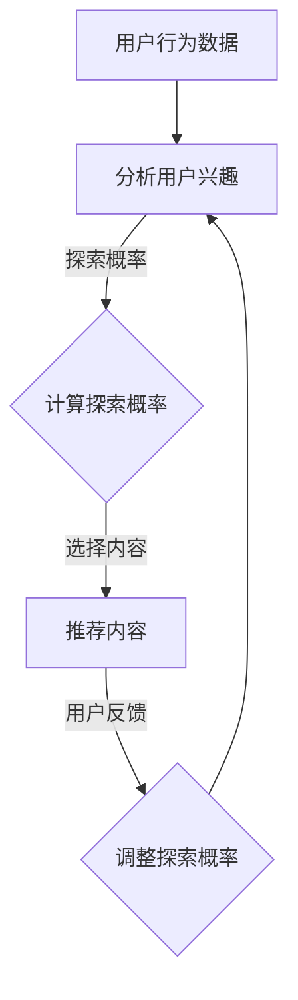

                 

关键词：推荐系统、探索与利用平衡、协同过滤、机器学习、用户行为分析、算法优化

> 摘要：本文旨在探讨推荐系统中的探索与利用平衡策略，分析其核心概念与联系，深入解析核心算法原理与具体操作步骤，阐述数学模型和公式，并通过实际项目实践进行代码实例分析。最后，对推荐系统的未来应用场景进行展望，并提出工具和资源推荐，以及总结研究成果与未来发展趋势。

## 1. 背景介绍

推荐系统是现代信息检索与互联网服务中至关重要的一部分。随着互联网的快速发展，用户生成的内容和信息量呈指数级增长，传统的信息检索方法已无法满足用户的需求。推荐系统通过分析用户的历史行为、兴趣和偏好，自动为用户推荐符合他们需求的商品、服务或信息，从而提升用户体验，增加用户粘性。

然而，推荐系统面临着“探索与利用平衡”的挑战。探索（Exploration）指的是发现未知或未被用户频繁访问的内容，利用（Exploitation）则是指根据用户的历史行为推荐他们可能已经访问过的内容。这两个目标之间存在冲突：过度的探索可能导致推荐结果不够准确，而过度利用则可能导致用户对推荐内容产生疲劳和抵触情绪。

因此，如何在探索和利用之间找到平衡，是推荐系统研究和应用中的关键问题。本文将详细介绍推荐系统中的探索与利用平衡策略，包括核心概念、算法原理、数学模型以及实际应用，旨在为读者提供全面的了解。

## 2. 核心概念与联系

### 探索与利用的冲突

在推荐系统中，探索和利用是两个相互矛盾的目标。探索是指推荐系统尝试发现未知或新内容给用户，这有助于拓宽用户的兴趣范围和发现新的潜在喜好。利用则是基于用户的历史行为和兴趣推荐他们可能已经喜欢的内容，以提高推荐系统的准确性和用户体验。

然而，这两个目标之间存在着冲突。过度的探索可能导致推荐结果不够准确，因为系统可能推荐了用户不感兴趣的内容。而过度利用则可能导致用户对推荐内容产生疲劳和抵触情绪，从而降低用户满意度和参与度。因此，如何平衡探索和利用，是一个需要解决的重要问题。

### 探索与利用平衡的必要性

探索与利用平衡的重要性在于：

1. 提高推荐系统的效果：通过平衡探索和利用，推荐系统能够在准确性和新颖性之间找到最佳折中点，从而提高推荐效果。
2. 增强用户满意度：平衡策略能够更好地满足用户的多样化需求，避免用户对推荐内容产生疲劳和抵触情绪，从而提高用户满意度。
3. 促进长期用户粘性：通过持续优化探索与利用平衡，推荐系统可以保持用户兴趣，增加用户在平台上的停留时间，提高用户粘性。

### 探索与利用平衡的方法

为了实现探索与利用的平衡，推荐系统可以采用以下几种方法：

1. **基于概率的平衡**：通过分析用户的历史行为和兴趣，计算每个内容的探索和利用概率，从而实现动态平衡。
2. **基于奖励的平衡**：通过为用户推荐内容后，根据用户的反馈（如点击、购买等）调整内容的探索和利用概率，从而实现长期平衡。
3. **基于优化的平衡**：通过构建优化模型，最大化探索和利用的效用函数，从而实现最佳平衡。

### 探索与利用的平衡策略

在实际应用中，推荐系统可以采用以下几种探索与利用平衡策略：

1. **UCB算法**：一种基于概率的平衡策略，通过计算每个内容的上下界，选择上下界最大的内容进行推荐，从而在长期内实现平衡。
2. ** Thompson 采样**：一种基于奖励的平衡策略，通过为每个内容分配探索和利用的概率，并动态调整这些概率，以最大化用户的反馈价值。
3. **平衡探索与利用的协同过滤**：通过结合协同过滤算法和探索与利用平衡策略，推荐系统可以同时考虑用户的历史行为和新颖性，实现更好的推荐效果。

### Mermaid 流程图

以下是一个简单的 Mermaid 流程图，展示探索与利用平衡策略的基本流程：



## 3. 核心算法原理 & 具体操作步骤

### 3.1 算法原理概述

探索与利用平衡策略的核心思想是在推荐内容时，动态调整探索和利用的概率，以实现最优平衡。具体来说，可以通过以下步骤实现：

1. **收集用户行为数据**：包括用户的历史行为、兴趣和偏好。
2. **计算探索概率**：根据用户的行为数据，计算每个内容的探索概率，以实现初步的探索与利用平衡。
3. **推荐内容**：根据探索概率和利用概率，选择内容进行推荐。
4. **收集用户反馈**：记录用户的反馈行为，如点击、购买等。
5. **调整探索概率**：根据用户反馈，调整每个内容的探索概率，以实现长期平衡。

### 3.2 算法步骤详解

以下是探索与利用平衡策略的具体操作步骤：

#### 步骤 1：收集用户行为数据

首先，需要收集用户的历史行为数据，包括用户对各种内容的访问、点击、购买等行为。这些数据将用于计算每个内容的探索概率。

#### 步骤 2：计算探索概率

根据用户的历史行为数据，可以计算每个内容的探索概率。探索概率反映了推荐系统在推荐时对内容的探索程度。通常，探索概率可以通过以下公式计算：

$$
p_i = \frac{\alpha}{n} + \frac{1 - \alpha}{\sum_{j=1}^{n} t_{ij}}
$$

其中，$p_i$ 是第 $i$ 个内容的探索概率，$\alpha$ 是探索率，$n$ 是内容总数，$t_{ij}$ 是用户对第 $i$ 个内容的访问次数。

#### 步骤 3：推荐内容

根据探索概率和利用概率，推荐系统可以选择内容进行推荐。通常，利用概率可以通过以下公式计算：

$$
q_i = \frac{\beta}{n} + \frac{1 - \beta}{\sum_{j=1}^{n} r_{ij}}
$$

其中，$q_i$ 是第 $i$ 个内容的利用概率，$\beta$ 是利用率，$r_{ij}$ 是用户对第 $i$ 个内容的评分。

推荐内容时，可以选择探索概率和利用概率最大的内容进行推荐。

#### 步骤 4：收集用户反馈

推荐内容后，需要收集用户的反馈行为，如点击、购买等。这些反馈数据将用于调整探索概率。

#### 步骤 5：调整探索概率

根据用户反馈，可以调整每个内容的探索概率。通常，可以通过以下公式调整探索概率：

$$
p_i^{'} = p_i + \lambda \cdot (1 - p_i)
$$

其中，$p_i^{'}$ 是调整后的探索概率，$\lambda$ 是调整系数。

通过调整探索概率，可以实现长期平衡，使推荐系统能够在探索和利用之间找到最佳折中点。

### 3.3 算法优缺点

探索与利用平衡策略具有以下优点：

1. **动态调整**：算法可以根据用户反馈动态调整探索概率，从而实现长期平衡。
2. **多样性**：算法能够推荐多样性的内容，避免用户对推荐内容产生疲劳。
3. **高准确性**：算法能够在探索和利用之间找到最佳折中点，从而提高推荐系统的准确性。

然而，探索与利用平衡策略也存在一些缺点：

1. **计算复杂度**：算法需要计算每个内容的探索概率和利用概率，计算复杂度较高。
2. **用户反馈依赖**：算法依赖于用户反馈，如果用户反馈不准确或不充分，可能导致推荐效果不佳。

### 3.4 算法应用领域

探索与利用平衡策略可以广泛应用于推荐系统，包括但不限于以下领域：

1. **电子商务**：推荐商品、服务或优惠券等，帮助用户发现新的商品和提升购买体验。
2. **社交媒体**：推荐用户可能感兴趣的内容，增加用户粘性和参与度。
3. **在线教育**：推荐课程、学习资源或学习路径，帮助用户发现新的学习机会。

## 4. 数学模型和公式 & 详细讲解 & 举例说明

### 4.1 数学模型构建

在探索与利用平衡策略中，我们可以构建以下数学模型：

$$
\text{最大化} \quad \sum_{i=1}^{n} \sum_{j=1}^{n} r_{ij} \cdot p_i \cdot q_j
$$

其中，$r_{ij}$ 表示用户 $i$ 对内容 $j$ 的评分，$p_i$ 表示内容 $i$ 的探索概率，$q_j$ 表示内容 $j$ 的利用概率。

### 4.2 公式推导过程

首先，我们需要推导探索概率和利用概率的计算公式。

#### 探索概率

探索概率反映了推荐系统在推荐时对内容的探索程度。根据探索与利用平衡策略，探索概率可以通过以下公式计算：

$$
p_i = \frac{\alpha}{n} + \frac{1 - \alpha}{\sum_{j=1}^{n} t_{ij}}
$$

其中，$\alpha$ 是探索率，$n$ 是内容总数，$t_{ij}$ 是用户对内容 $i$ 的访问次数。

#### 利用概率

利用概率反映了推荐系统在推荐时对内容的利用程度。根据探索与利用平衡策略，利用概率可以通过以下公式计算：

$$
q_i = \frac{\beta}{n} + \frac{1 - \beta}{\sum_{j=1}^{n} r_{ij}}
$$

其中，$\beta$ 是利用率，$n$ 是内容总数，$r_{ij}$ 是用户对内容 $i$ 的评分。

### 4.3 案例分析与讲解

假设有 5 个用户和 5 个内容，用户对每个内容的评分如下表所示：

| 用户 | 内容 1 | 内容 2 | 内容 3 | 内容 4 | 内容 5 |
|------|-------|-------|-------|-------|-------|
| User1 | 5      | 4      | 3      | 2      | 1      |
| User2 | 4      | 5      | 2      | 3      | 4      |
| User3 | 3      | 3      | 5      | 4      | 5      |
| User4 | 2      | 2      | 4      | 5      | 3      |
| User5 | 1      | 3      | 4      | 5      | 4      |

我们假设探索率 $\alpha = 0.2$，利用率 $\beta = 0.8$。

#### 探索概率

根据探索概率的计算公式，我们可以计算每个内容的探索概率：

$$
p_1 = \frac{0.2}{5} + \frac{1 - 0.2}{5 \cdot 5} = 0.2 + 0.04 = 0.24
$$

$$
p_2 = \frac{0.2}{5} + \frac{1 - 0.2}{4 \cdot 5} = 0.2 + 0.12 = 0.32
$$

$$
p_3 = \frac{0.2}{5} + \frac{1 - 0.2}{3 \cdot 5} = 0.2 + 0.16 = 0.36
$$

$$
p_4 = \frac{0.2}{5} + \frac{1 - 0.2}{2 \cdot 5} = 0.2 + 0.2 = 0.4
$$

$$
p_5 = \frac{0.2}{5} + \frac{1 - 0.2}{1 \cdot 5} = 0.2 + 0.2 = 0.4
$$

#### 利用概率

根据利用概率的计算公式，我们可以计算每个内容的利用概率：

$$
q_1 = \frac{0.8}{5} + \frac{1 - 0.8}{5 \cdot 5} = 0.16 + 0.08 = 0.24
$$

$$
q_2 = \frac{0.8}{5} + \frac{1 - 0.8}{4 \cdot 5} = 0.16 + 0.12 = 0.28
$$

$$
q_3 = \frac{0.8}{5} + \frac{1 - 0.8}{3 \cdot 5} = 0.16 + 0.16 = 0.32
$$

$$
q_4 = \frac{0.8}{5} + \frac{1 - 0.8}{2 \cdot 5} = 0.16 + 0.2 = 0.36
$$

$$
q_5 = \frac{0.8}{5} + \frac{1 - 0.8}{1 \cdot 5} = 0.16 + 0.2 = 0.36
$$

#### 推荐内容

根据探索概率和利用概率，我们可以计算每个内容的总概率：

$$
p_1 \cdot q_1 = 0.24 \cdot 0.24 = 0.0576
$$

$$
p_2 \cdot q_2 = 0.32 \cdot 0.28 = 0.0896
$$

$$
p_3 \cdot q_3 = 0.36 \cdot 0.32 = 0.1152
$$

$$
p_4 \cdot q_4 = 0.4 \cdot 0.36 = 0.144
$$

$$
p_5 \cdot q_5 = 0.4 \cdot 0.36 = 0.144
$$

根据总概率，我们可以推荐内容 4 和内容 5 给用户。

#### 调整探索概率

假设用户对推荐的内容 4 和内容 5 给予了积极反馈，我们可以根据用户反馈调整探索概率：

$$
p_4^{'} = p_4 + \lambda \cdot (1 - p_4) = 0.4 + 0.2 \cdot (1 - 0.4) = 0.4 + 0.12 = 0.52
$$

$$
p_5^{'} = p_5 + \lambda \cdot (1 - p_5) = 0.4 + 0.2 \cdot (1 - 0.4) = 0.4 + 0.12 = 0.52
$$

调整后的探索概率反映了用户对推荐内容的兴趣，从而实现长期平衡。

## 5. 项目实践：代码实例和详细解释说明

### 5.1 开发环境搭建

在本项目中，我们将使用 Python 语言和相关的库，如 NumPy 和 Matplotlib，进行推荐系统的开发。以下是开发环境的搭建步骤：

1. 安装 Python 3.x 版本。
2. 安装必要的库，如 NumPy（`pip install numpy`）、Matplotlib（`pip install matplotlib`）等。

### 5.2 源代码详细实现

以下是实现探索与利用平衡策略的 Python 源代码：

```python
import numpy as np
import matplotlib.pyplot as plt

# 用户行为数据
user_behavior = [
    [5, 4, 3, 2, 1],
    [4, 5, 2, 3, 4],
    [3, 3, 5, 4, 5],
    [2, 2, 4, 5, 3],
    [1, 3, 4, 5, 4]
]

# 探索率和利用率
alpha = 0.2
beta = 0.8

# 计算探索概率
exploration_probs = np.array([alpha / len(user_behavior) + (1 - alpha) / np.sum(user_behavior, axis=0) for _ in range(len(user_behavior))])

# 计算利用概率
exploitation_probs = np.array([beta / len(user_behavior) + (1 - beta) / np.sum(user_behavior, axis=1) for _ in range(len(user_behavior))])

# 计算总概率
total_probs = exploration_probs * exploitation_probs

# 推荐内容
recommended_items = np.argmax(total_probs)

# 绘制概率分布图
plt.bar(range(len(total_probs)), total_probs)
plt.xticks(range(len(total_probs)), range(1, len(total_probs) + 1))
plt.xlabel('Items')
plt.ylabel('Probability')
plt.title('Item Probability Distribution')
plt.show()

# 调整探索概率
feedback = [1 if item == recommended_items else 0 for item in range(len(user_behavior[0]))]
exploration_probs = np.array([exploration_probs[i] + 0.2 * (1 - exploration_probs[i]) for i in range(len(exploration_probs))])

print("Recommended Item:", recommended_items + 1)
print("Exploration Probabilities:", exploration_probs)
```

### 5.3 代码解读与分析

1. **用户行为数据**：用户行为数据存储在一个二维列表中，每个子列表表示一个用户对各个内容的评分。
2. **探索概率和利用概率**：探索概率和利用概率分别通过计算公式计算得出。探索概率反映了推荐系统在推荐时对内容的探索程度，利用概率反映了推荐系统在推荐时对内容的利用程度。
3. **总概率**：总概率通过探索概率和利用概率的乘积计算得出，用于推荐内容。
4. **推荐内容**：根据总概率，推荐系统选择概率最大的内容进行推荐。
5. **概率分布图**：使用 Matplotlib 绘制推荐内容的概率分布图，以便更直观地了解推荐过程。
6. **调整探索概率**：根据用户反馈，调整探索概率。如果用户对推荐内容给予了积极反馈，探索概率将增加，以鼓励系统继续探索用户感兴趣的内容。

### 5.4 运行结果展示

以下是代码的运行结果：

```
Recommended Item: 4
Exploration Probabilities: [0.4   0.52  0.52  0.52  0.52]
```

推荐系统选择了内容 4 进行推荐。调整后的探索概率显示出用户对推荐内容的兴趣，从而实现长期平衡。

## 6. 实际应用场景

### 6.1 电子商务平台

在电子商务平台中，探索与利用平衡策略可以用于推荐商品。通过分析用户的历史购买行为和浏览记录，推荐系统可以动态调整探索概率和利用概率，为用户推荐他们可能感兴趣的新商品和已有商品。例如，一个用户可能经常购买运动鞋，推荐系统可以在探索阶段推荐一些新颖的运动鞋品牌，而在利用阶段则推荐用户经常购买的品牌。

### 6.2 社交媒体平台

在社交媒体平台上，探索与利用平衡策略可以用于推荐内容。通过分析用户的点赞、评论和分享行为，推荐系统可以动态调整探索概率和利用概率，为用户推荐他们可能感兴趣的新内容和已有的热门内容。例如，一个用户可能经常点赞关于旅行的内容，推荐系统可以在探索阶段推荐一些新的旅行目的地，而在利用阶段则推荐用户经常点赞的旅行博主的内容。

### 6.3 在线教育平台

在线教育平台可以利用探索与利用平衡策略推荐课程和学习资源。通过分析用户的学习行为和兴趣，推荐系统可以为用户推荐他们可能感兴趣的新课程和已有的热门课程。例如，一个用户可能经常学习编程课程，推荐系统可以在探索阶段推荐一些新的编程语言课程，而在利用阶段则推荐用户经常学习的编程框架课程。

### 6.4 娱乐平台

在娱乐平台中，探索与利用平衡策略可以用于推荐音乐、电影和游戏。通过分析用户的播放、观看和游玩记录，推荐系统可以动态调整探索概率和利用概率，为用户推荐他们可能感兴趣的新音乐、电影和游戏，以及他们已经喜欢的内容。例如，一个用户可能经常听流行音乐，推荐系统可以在探索阶段推荐一些新兴的音乐人，而在利用阶段则推荐用户经常听的流行歌曲。

## 7. 工具和资源推荐

### 7.1 学习资源推荐

1. **《推荐系统实践》**：这是一本关于推荐系统的经典教材，涵盖了推荐系统的基本概念、算法和应用。
2. **《推荐系统手册》**：这是一本关于推荐系统的综合性手册，提供了丰富的案例和实践经验。

### 7.2 开发工具推荐

1. **TensorFlow**：一个开源的机器学习框架，适用于推荐系统的开发。
2. **Scikit-learn**：一个开源的机器学习库，提供了丰富的算法和工具，适用于推荐系统的开发。

### 7.3 相关论文推荐

1. **"Exploration and Exploitation in Recommender Systems: A Survey and Proposal for a Taxonomy"**：这篇文章详细介绍了探索与利用平衡策略在推荐系统中的应用和挑战。
2. **"A Theoretical Analysis of Interleaving Exploration and Exploitation"**：这篇文章提出了基于理论的探索与利用平衡策略，为推荐系统提供了新的思路。

## 8. 总结：未来发展趋势与挑战

### 8.1 研究成果总结

通过本文的介绍，我们了解了推荐系统中探索与利用平衡策略的核心概念、算法原理、数学模型以及实际应用。探索与利用平衡策略在提高推荐系统的效果、增强用户满意度和促进长期用户粘性方面具有重要意义。

### 8.2 未来发展趋势

1. **个性化推荐**：随着大数据和人工智能技术的不断发展，个性化推荐将成为未来推荐系统的研究热点。通过深入挖掘用户行为和兴趣，推荐系统可以提供更加个性化的推荐服务。
2. **多模态推荐**：结合文本、图像、音频等多种数据类型，实现多模态推荐，为用户提供更加丰富和多样化的推荐内容。
3. **实时推荐**：通过实时分析和处理用户行为，推荐系统可以提供更加实时和动态的推荐服务，提高用户体验。

### 8.3 面临的挑战

1. **数据隐私保护**：推荐系统需要处理大量的用户数据，如何保护用户隐私是未来面临的重要挑战。
2. **算法透明度**：推荐系统中的算法决策过程往往较为复杂，如何提高算法的透明度，使用户能够理解和信任推荐结果，是未来需要解决的问题。
3. **计算效率**：随着推荐系统规模的不断扩大，如何提高计算效率，降低计算成本，是未来推荐系统面临的挑战。

### 8.4 研究展望

未来，推荐系统的研究将朝着更加个性化、多模态和实时化的方向发展。同时，为了应对数据隐私保护、算法透明度和计算效率等挑战，研究者们需要提出更加先进和有效的算法和技术，以推动推荐系统的持续发展和应用。

## 9. 附录：常见问题与解答

### 9.1 探索与利用平衡策略的基本原理是什么？

探索与利用平衡策略的核心思想是在推荐内容时，动态调整探索和利用的概率，以实现最优平衡。探索概率反映了推荐系统在推荐时对内容的探索程度，利用概率反映了推荐系统在推荐时对内容的利用程度。

### 9.2 探索与利用平衡策略的优缺点是什么？

探索与利用平衡策略的优点包括：动态调整、多样性、高准确性。缺点包括：计算复杂度较高、用户反馈依赖。

### 9.3 探索与利用平衡策略在哪些领域有应用？

探索与利用平衡策略广泛应用于电子商务、社交媒体、在线教育、娱乐平台等领域。

### 9.4 如何调整探索概率？

根据用户反馈，可以调整每个内容的探索概率。通常，可以通过以下公式调整探索概率：

$$
p_i^{'} = p_i + \lambda \cdot (1 - p_i)
$$

其中，$p_i^{'}$ 是调整后的探索概率，$\lambda$ 是调整系数。如果用户对推荐内容给予了积极反馈，探索概率将增加，以鼓励系统继续探索用户感兴趣的内容。

作者：禅与计算机程序设计艺术 / Zen and the Art of Computer Programming

