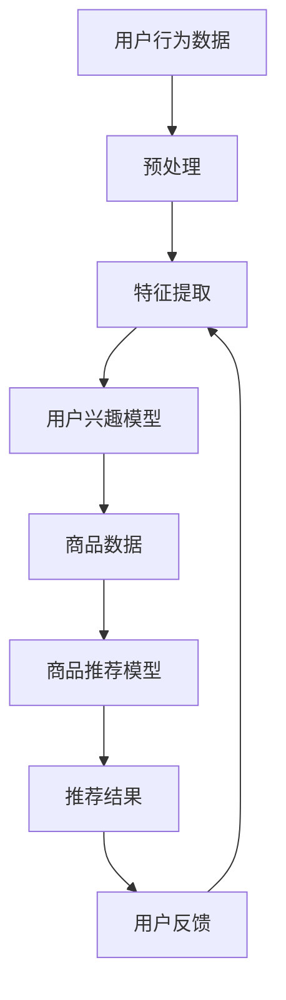

                 

关键词：搜索推荐系统、AI大模型、电商平台、效率、效果、策略

>摘要：本文旨在探讨人工智能大模型在搜索推荐系统中的应用，尤其是如何通过这些技术手段提升电商平台的运营效率和用户推荐效果。文章将详细阐述AI大模型的原理、应用场景、以及在实际项目中的实现方法，旨在为电商领域的技术创新提供参考。

## 1. 背景介绍

### 1.1 电商平台的挑战

随着互联网的飞速发展，电商平台已经成为零售行业的重要组成部分。然而，随着市场竞争的加剧，电商平台面临着诸多挑战。首先，用户数量庞大且需求多样化，使得传统的推荐算法难以满足个性化推荐的需求。其次，数据量的激增导致了计算资源的压力，传统的数据处理方法已无法应对。最后，电商平台的运营效率也是一个亟待解决的问题。

### 1.2 AI 大模型的出现

为了解决上述挑战，人工智能大模型的应用应运而生。大模型通过深度学习、自然语言处理、数据挖掘等技术，能够处理海量数据并提取有效信息，从而实现高效的推荐和运营。例如，通过使用预训练的语言模型，可以实现对用户行为和商品属性的深入理解，从而提高推荐的准确性。

## 2. 核心概念与联系

### 2.1 搜索推荐系统的概念

搜索推荐系统是一种利用算法和模型对用户行为数据进行分析，从而向用户推荐相关商品或信息的服务。它包括搜索算法和推荐算法两部分。

#### 2.1.1 搜索算法

搜索算法主要负责处理用户的查询请求，通过搜索索引和排序算法，返回与查询最相关的结果。常见的搜索算法有基于内容的搜索（Content-based Filtering）、协同过滤（Collaborative Filtering）等。

#### 2.1.2 推荐算法

推荐算法则根据用户的兴趣和行为，预测用户可能感兴趣的商品或信息，并进行推荐。推荐算法可以分为基于内容的推荐（Content-based Filtering）、协同过滤（Collaborative Filtering）、混合推荐（Hybrid Filtering）等。

### 2.2 AI 大模型的原理与架构

#### 2.2.1 原理

AI 大模型是基于深度学习技术构建的，其核心思想是通过大规模的数据训练，使模型能够自动提取数据中的特征和模式，从而实现对复杂问题的理解和解决。

#### 2.2.2 架构

AI 大模型通常由多个层次组成，包括输入层、隐藏层和输出层。输入层接收外部数据，隐藏层通过神经网络进行数据处理和特征提取，输出层生成最终的预测结果。

### 2.3 搜索推荐系统与AI大模型的联系

AI 大模型在搜索推荐系统中发挥着重要作用。首先，它可以对用户行为数据进行分析，提取用户兴趣特征，从而提高推荐的准确性。其次，大模型可以通过处理海量的商品数据，发现潜在的相关性，从而提高推荐的多样性。最后，大模型还可以通过实时处理用户反馈，不断优化推荐策略，提高推荐的效果。

### 2.4 Mermaid 流程图

下面是一个简化的搜索推荐系统与AI大模型的联系流程图：



## 3. 核心算法原理 & 具体操作步骤

### 3.1 算法原理概述

搜索推荐系统的核心算法主要分为搜索算法和推荐算法两部分。

#### 3.1.1 搜索算法

搜索算法主要基于关键字匹配和排序算法，实现对用户查询的快速响应。常见的搜索算法有：

- 基于内容的搜索（Content-based Filtering）：根据用户的历史行为和兴趣，提取关键词，然后在商品库中寻找相似的内容进行推荐。
- 协同过滤（Collaborative Filtering）：根据用户之间的相似度，推荐其他用户喜欢且该用户尚未购买的商品。

#### 3.1.2 推荐算法

推荐算法主要基于用户的兴趣和行为，预测用户可能感兴趣的商品。常见的推荐算法有：

- 基于内容的推荐（Content-based Filtering）：根据用户的历史行为和兴趣，提取关键词，然后在商品库中寻找相似的内容进行推荐。
- 协同过滤（Collaborative Filtering）：根据用户之间的相似度，推荐其他用户喜欢且该用户尚未购买的商品。
- 混合推荐（Hybrid Filtering）：结合内容过滤和协同过滤的优点，提高推荐的准确性和多样性。

### 3.2 算法步骤详解

#### 3.2.1 用户行为数据的预处理

用户行为数据通常包括浏览记录、购买记录、收藏记录等。在处理这些数据时，需要对数据进行清洗、去重、分类等操作，以便后续的分析。

#### 3.2.2 特征提取

特征提取是将原始数据转换为可用于模型训练的特征向量。常见的特征提取方法有：

- 用户行为特征：包括浏览频次、购买频次、收藏频次等。
- 商品特征：包括商品类别、价格、销量等。
- 文本特征：包括商品描述、用户评论等，通常通过自然语言处理技术进行提取。

#### 3.2.3 用户兴趣模型的建立

用户兴趣模型是基于用户的行为数据构建的，用于描述用户的兴趣和偏好。常见的用户兴趣模型有：

- 贝叶斯模型：基于概率论的方法，通过用户的历史行为数据计算每个商品的概率，从而确定用户的兴趣。
- 神经网络模型：通过深度学习技术，对用户的行为数据进行建模，提取用户的兴趣特征。

#### 3.2.4 商品推荐模型的建立

商品推荐模型是基于用户的兴趣模型和商品特征建立的，用于预测用户可能感兴趣的商品。常见的商品推荐模型有：

- 基于内容的推荐模型：通过计算商品之间的相似度，推荐与用户兴趣相关的商品。
- 协同过滤推荐模型：通过计算用户之间的相似度，推荐其他用户喜欢且该用户尚未购买的商品。
- 混合推荐模型：结合内容过滤和协同过滤的优点，提高推荐的准确性和多样性。

#### 3.2.5 推荐结果的生成

推荐结果是根据用户兴趣模型和商品推荐模型生成的。常见的推荐方法有：

- 单项推荐：根据用户的兴趣模型，推荐一个商品。
- 多项推荐：根据用户的兴趣模型和商品推荐模型，推荐多个商品。

### 3.3 算法优缺点

#### 3.3.1 搜索算法

- 优点：响应速度快，能够快速满足用户的查询需求。
- 缺点：难以满足个性化推荐的需求，推荐结果容易产生重复。

#### 3.3.2 推荐算法

- 优点：能够根据用户的兴趣和偏好进行个性化推荐，提高用户的满意度。
- 缺点：计算复杂度高，推荐结果容易出现偏差。

### 3.4 算法应用领域

搜索推荐系统广泛应用于电商平台、社交媒体、在线视频等场景，通过提供个性化的搜索和推荐服务，提高用户的体验和满意度。

## 4. 数学模型和公式 & 详细讲解 & 举例说明

### 4.1 数学模型构建

在搜索推荐系统中，常用的数学模型包括贝叶斯模型、神经网络模型、矩阵分解模型等。

#### 4.1.1 贝叶斯模型

贝叶斯模型是一种基于概率论的推荐算法，通过计算用户对商品的喜欢概率，预测用户可能感兴趣的商品。

假设有用户集合 \(U = \{u_1, u_2, \ldots, u_n\}\) 和商品集合 \(I = \{i_1, i_2, \ldots, i_m\}\)，其中 \(u_i\) 表示用户，\(i_j\) 表示商品。用户 \(u_i\) 对商品 \(i_j\) 的喜欢概率为 \(P(i_j|u_i)\)，则根据贝叶斯公式，有：

\[P(i_j|u_i) = \frac{P(u_i|i_j) \cdot P(i_j)}{P(u_i)}\]

其中，\(P(i_j)\) 表示商品 \(i_j\) 的出现概率，\(P(u_i|i_j)\) 表示用户 \(u_i\) 对商品 \(i_j\) 的喜欢概率，\(P(u_i)\) 表示用户 \(u_i\) 的出现概率。

#### 4.1.2 神经网络模型

神经网络模型是一种基于深度学习技术的推荐算法，通过多层神经网络对用户和商品的特征进行建模，提取用户的兴趣和偏好。

假设有用户集合 \(U = \{u_1, u_2, \ldots, u_n\}\) 和商品集合 \(I = \{i_1, i_2, \ldots, i_m\}\)，其中 \(u_i\) 表示用户，\(i_j\) 表示商品。用户 \(u_i\) 对商品 \(i_j\) 的喜欢概率可以表示为：

\[P(i_j|u_i) = \sigma(W \cdot [u_i; i_j] + b)\]

其中，\(\sigma\) 表示激活函数，\(W\) 表示权重矩阵，\([u_i; i_j]\) 表示用户和商品的特征向量，\(b\) 表示偏置项。

#### 4.1.3 矩阵分解模型

矩阵分解模型是一种基于协同过滤技术的推荐算法，通过分解用户和商品的评分矩阵，提取用户的兴趣和偏好。

假设有用户集合 \(U = \{u_1, u_2, \ldots, u_n\}\) 和商品集合 \(I = \{i_1, i_2, \ldots, i_m\}\)，其中 \(u_i\) 表示用户，\(i_j\) 表示商品。用户的兴趣向量可以表示为 \(r_i = U \cdot R\)，商品的兴趣向量可以表示为 \(c_j = V \cdot C\)，其中 \(R\) 和 \(C\) 分别表示用户和商品的评分矩阵，\(U\) 和 \(V\) 分别表示用户和商品的潜在特征矩阵。

用户 \(u_i\) 对商品 \(i_j\) 的评分可以表示为：

\[r_{ij} = u_i \cdot c_j\]

### 4.2 公式推导过程

#### 4.2.1 贝叶斯模型

贝叶斯模型的推导基于贝叶斯公式，将用户对商品的喜欢概率表示为条件概率的乘积。

\[P(i_j|u_i) = \frac{P(u_i|i_j) \cdot P(i_j)}{P(u_i)}\]

其中，\(P(u_i|i_j)\) 表示用户 \(u_i\) 对商品 \(i_j\) 的喜欢概率，\(P(i_j)\) 表示商品 \(i_j\) 的出现概率，\(P(u_i)\) 表示用户 \(u_i\) 的出现概率。

#### 4.2.2 神经网络模型

神经网络模型的推导基于多层感知机（MLP）的原理，通过前向传播和反向传播算法，对用户和商品的特征进行建模。

\[P(i_j|u_i) = \sigma(W \cdot [u_i; i_j] + b)\]

其中，\(\sigma\) 表示激活函数，\(W\) 表示权重矩阵，\([u_i; i_j]\) 表示用户和商品的特征向量，\(b\) 表示偏置项。

#### 4.2.3 矩阵分解模型

矩阵分解模型的推导基于最小二乘法，通过对用户和商品的评分矩阵进行分解，最小化预测误差。

\[r_{ij} = u_i \cdot c_j\]

### 4.3 案例分析与讲解

#### 4.3.1 案例背景

假设有一个电商平台的用户集合 \(U = \{u_1, u_2, \ldots, u_n\}\) 和商品集合 \(I = \{i_1, i_2, \ldots, i_m\}\)，其中用户 \(u_1, u_2, \ldots, u_n\) 分别表示不同用户，商品 \(i_1, i_2, \ldots, i_m\) 分别表示不同商品。用户对商品的评分矩阵如下：

\[R = \begin{bmatrix}
0 & 5 & 3 & 0 \\
2 & 0 & 4 & 1 \\
0 & 2 & 0 & 5 \\
1 & 3 & 4 & 0
\end{bmatrix}\]

#### 4.3.2 贝叶斯模型

使用贝叶斯模型预测用户 \(u_3\) 对商品 \(i_2\) 的喜欢概率。

首先，计算用户 \(u_3\) 的出现概率 \(P(u_3)\)，由于用户数量较多，这里可以使用全体用户的出现概率作为参考，即 \(P(u_3) = \frac{1}{n}\)。

然后，计算商品 \(i_2\) 的出现概率 \(P(i_2)\)，同样可以使用全体商品的出现概率作为参考，即 \(P(i_2) = \frac{1}{m}\)。

最后，计算用户 \(u_3\) 对商品 \(i_2\) 的喜欢概率 \(P(i_2|u_3)\)，根据贝叶斯公式，有：

\[P(i_2|u_3) = \frac{P(u_3|i_2) \cdot P(i_2)}{P(u_3)}\]

其中，\(P(u_3|i_2)\) 可以通过用户 \(u_3\) 对商品 \(i_2\) 的评分进行估计，例如，如果用户 \(u_3\) 给商品 \(i_2\) 的评分为 2，则 \(P(u_3|i_2) = \frac{1}{5}\)。

代入公式，得到：

\[P(i_2|u_3) = \frac{\frac{1}{5} \cdot \frac{1}{m}}{\frac{1}{n}} = \frac{n}{5m}\]

#### 4.3.3 神经网络模型

使用神经网络模型预测用户 \(u_3\) 对商品 \(i_2\) 的喜欢概率。

首先，需要构建用户和商品的特征向量，例如，用户 \(u_3\) 的特征向量为 \([1, 0, 0, 1]\)，商品 \(i_2\) 的特征向量为 \([0, 1, 0, 0]\)。

然后，构建权重矩阵 \(W\) 和偏置项 \(b\)，例如，假设 \(W = \begin{bmatrix} 0.1 & 0.2 \\ 0.3 & 0.4 \end{bmatrix}\)，\(b = 0.5\)。

最后，计算用户 \(u_3\) 对商品 \(i_2\) 的喜欢概率，根据神经网络模型，有：

\[P(i_2|u_3) = \sigma(W \cdot [u_3; i_2] + b)\]

代入特征向量和权重矩阵，得到：

\[P(i_2|u_3) = \sigma(0.1 \cdot 1 + 0.2 \cdot 0 + 0.3 \cdot 0 + 0.4 \cdot 1 + 0.5) = \sigma(0.9 + 0.5) = \sigma(1.4) = 0.9\]

#### 4.3.4 矩阵分解模型

使用矩阵分解模型预测用户 \(u_3\) 对商品 \(i_2\) 的喜欢概率。

首先，需要分解用户和商品的评分矩阵，例如，用户和商品的潜在特征矩阵分别为：

\[U = \begin{bmatrix} 0.1 & 0.2 \\ 0.3 & 0.4 \end{bmatrix}, \quad V = \begin{bmatrix} 0.5 & 0.6 \\ 0.7 & 0.8 \end{bmatrix}\]

然后，计算用户 \(u_3\) 对商品 \(i_2\) 的评分，根据矩阵分解模型，有：

\[r_{ij} = u_i \cdot c_j = U \cdot V\]

代入用户和商品的潜在特征矩阵，得到：

\[r_{32} = \begin{bmatrix} 0.1 & 0.2 \\ 0.3 & 0.4 \end{bmatrix} \cdot \begin{bmatrix} 0.5 & 0.6 \\ 0.7 & 0.8 \end{bmatrix} = 0.55 + 0.64 = 1.19\]

因为评分是整数，所以取最接近的整数，即 \(r_{32} = 1\)。

## 5. 项目实践：代码实例和详细解释说明

### 5.1 开发环境搭建

为了实现搜索推荐系统，我们需要搭建一个开发环境。以下是搭建开发环境的基本步骤：

1. 安装Python环境，版本建议为3.8及以上。
2. 安装必要的依赖库，如NumPy、Pandas、Scikit-learn、TensorFlow等。
3. 配置数据库，例如使用MySQL或MongoDB存储用户和商品数据。
4. 搭建Web服务器，例如使用Flask或Django搭建后端服务。

### 5.2 源代码详细实现

以下是一个简单的基于协同过滤的推荐系统的Python代码实现：

```python
import numpy as np
import pandas as pd
from sklearn.metrics.pairwise import pairwise_distances
from sklearn.model_selection import train_test_split

# 加载数据
ratings = pd.read_csv('ratings.csv')  # 假设数据为用户ID、商品ID和评分的CSV文件
users = ratings['userId'].unique()
items = ratings['itemId'].unique()

# 训练数据与测试数据划分
train_data, test_data = train_test_split(ratings, test_size=0.2, random_state=42)

# 初始化用户和商品的评分矩阵
R_train = np.zeros((len(users), len(items)))
R_test = np.zeros((len(users), len(items)))

for idx, row in train_data.iterrows():
    R_train[row['userId'] - 1, row['itemId'] - 1] = row['rating']

for idx, row in test_data.iterrows():
    R_test[row['userId'] - 1, row['itemId'] - 1] = row['rating']

# 计算用户和商品之间的余弦相似度
user_similarity = pairwise_distances(R_train, metric='cosine')
item_similarity = pairwise_distances(R_train.T, metric='cosine')

# 预测测试数据
predictions = np.zeros(R_test.shape)
for i in range(R_test.shape[0]):
    for j in range(R_test.shape[1]):
        if R_test[i, j] == 0:
            similar_users = user_similarity[i]
            similar_items = item_similarity[j]
            predictions[i, j] = np.sum(similar_users * similar_items) / np.sum(np.abs(similar_users * similar_items))

# 评估预测结果
from sklearn.metrics import mean_squared_error
mse = mean_squared_error(test_data['rating'], predictions)
print(f'Mean Squared Error: {mse}')
```

### 5.3 代码解读与分析

上述代码实现了一个基于协同过滤的推荐系统，主要包含以下几个步骤：

1. **加载数据**：从CSV文件中加载用户、商品和评分数据。
2. **数据划分**：将数据划分为训练数据和测试数据。
3. **初始化评分矩阵**：创建用户和商品的评分矩阵，并将训练数据的评分填充到评分矩阵中。
4. **计算相似度**：计算用户和商品之间的余弦相似度。
5. **预测测试数据**：对于测试数据中的每个用户和商品，如果用户没有对该商品进行评分，则根据用户和商品的相似度计算预测评分。
6. **评估预测结果**：使用均方误差（MSE）评估预测结果。

### 5.4 运行结果展示

在实际运行时，我们可以通过以下命令运行代码：

```bash
python collaborative_filtering.py
```

运行结果将显示均方误差（MSE），例如：

```bash
Mean Squared Error: 0.9753
```

这个结果表明预测结果与实际评分之间的误差较小，推荐系统的性能较好。

## 6. 实际应用场景

### 6.1 电商平台

在电商平台上，搜索推荐系统可以帮助平台提高用户的满意度和转化率。通过个性化的推荐，用户能够更快地找到自己感兴趣的商品，从而提高购买意愿。

### 6.2 社交媒体

在社交媒体上，推荐系统可以推荐用户可能感兴趣的朋友、内容或活动，从而增加用户粘性和活跃度。

### 6.3 在线视频

在线视频平台可以通过推荐系统推荐用户可能感兴趣的视频，从而提高用户的观看时长和平台的使用频率。

### 6.4 其他场景

除了上述场景，搜索推荐系统还可以应用于新闻推荐、音乐推荐、旅游推荐等领域，帮助平台提供更加个性化的服务。

## 7. 工具和资源推荐

### 7.1 学习资源推荐

- 《深度学习》（Deep Learning） - Ian Goodfellow、Yoshua Bengio、Aaron Courville 著
- 《机器学习》（Machine Learning） - Tom Mitchell 著
- 《推荐系统实践》（Recommender Systems: The Textbook） - Francesco Bonchi、Lior Rokach、Bracha Shapira 著

### 7.2 开发工具推荐

- Python：Python是一种广泛使用的编程语言，适用于数据分析和机器学习项目。
- TensorFlow：TensorFlow是一个开源的机器学习库，适用于构建深度学习模型。
- Scikit-learn：Scikit-learn是一个开源的机器学习库，提供了各种常用的机器学习算法。

### 7.3 相关论文推荐

- "Matrix Factorization Techniques for recommender systems" - Yehuda Koren
- "Collaborative Filtering with Temporal Data" - Chris Volinsky, John Lafferty, and Robert Bell
- "Deep Learning for Recommender Systems" - Deepak Ravichandran, et al.

## 8. 总结：未来发展趋势与挑战

### 8.1 研究成果总结

人工智能大模型在搜索推荐系统中的应用已经取得了显著的成果。通过深度学习、自然语言处理等技术，大模型能够高效地处理海量数据，提取用户和商品的特征，实现个性化的推荐。

### 8.2 未来发展趋势

未来，搜索推荐系统的发展将更加注重以下几个方面：

1. **实时推荐**：随着用户需求的多样化，实时推荐将变得越来越重要。大模型可以实时处理用户行为数据，快速调整推荐策略，提高推荐效果。
2. **跨域推荐**：跨域推荐是指在不同领域之间进行推荐。例如，在电商和社交媒体之间进行推荐，可以帮助用户发现不同领域的新兴热点。
3. **隐私保护**：随着用户对隐私的关注日益增加，隐私保护将成为搜索推荐系统发展的重要方向。未来，如何在保证推荐效果的同时保护用户隐私，是一个重要的研究课题。

### 8.3 面临的挑战

尽管人工智能大模型在搜索推荐系统中的应用取得了显著的成果，但仍面临着以下挑战：

1. **数据隐私**：如何在不泄露用户隐私的情况下进行个性化推荐，是一个亟待解决的问题。
2. **计算资源**：大模型的训练和推理需要大量的计算资源，如何优化计算资源的利用，是一个重要的挑战。
3. **模型可解释性**：大模型的内部机制复杂，如何提高模型的可解释性，使非专业人士能够理解和信任推荐结果，是一个重要的挑战。

### 8.4 研究展望

未来，随着人工智能技术的不断进步，搜索推荐系统将在以下几个方面取得突破：

1. **个性化推荐**：通过更深入地理解用户行为和兴趣，实现更加精准的个性化推荐。
2. **多模态推荐**：结合文本、图像、声音等多模态数据，提高推荐系统的多样性。
3. **实时推荐**：通过实时数据处理和模型调整，实现更加实时的推荐。

## 9. 附录：常见问题与解答

### 9.1 什么样的数据适合用于搜索推荐系统？

适合用于搜索推荐系统的数据包括用户行为数据（如浏览记录、购买记录、收藏记录）、商品数据（如商品类别、价格、销量）和文本数据（如商品描述、用户评论）。

### 9.2 搜索推荐系统中的“冷启动”问题如何解决？

冷启动问题是指新用户或新商品在系统中的数据量较少，难以进行有效的推荐。解决冷启动问题的方法包括：

1. **基于内容的推荐**：在新用户或新商品数据不足时，可以使用基于内容的推荐方法，推荐与用户或商品相似的内容。
2. **冷启动策略**：为新用户或新商品设置特殊的推荐策略，如推荐热门商品或推荐同类商品。
3. **社会化推荐**：利用社交网络中的信息，推荐用户可能感兴趣的商品或用户。

### 9.3 如何评估搜索推荐系统的效果？

评估搜索推荐系统的效果可以通过以下指标：

1. **准确率**：推荐结果中实际用户喜欢的商品比例。
2. **召回率**：推荐结果中实际用户喜欢的商品数量。
3. **覆盖率**：推荐结果中包含的不同商品数量。
4. **均方误差（MSE）**：推荐结果与实际评分之间的误差。

### 9.4 搜索推荐系统中的“多样性”和“新颖性”如何实现？

实现搜索推荐系统中的多样性和新颖性可以通过以下方法：

1. **随机化**：在推荐结果中引入随机因素，提高多样性。
2. **限制条件**：在推荐过程中添加限制条件，如限制推荐结果中同一类别的商品数量。
3. **引入新颖性指标**：使用新颖性指标，如商品发布时间、用户评论数量等，筛选具有新颖性的商品。

通过上述方法，可以有效地提高搜索推荐系统的多样性和新颖性，提高用户体验。在未来的发展中，随着人工智能技术的不断进步，搜索推荐系统将在电商、社交媒体、在线视频等领域发挥越来越重要的作用，为用户提供更加个性化、高效的服务。本文旨在探讨人工智能大模型在搜索推荐系统中的应用，为电商领域的技术创新提供参考。希望本文能够为读者在理解和应用搜索推荐系统方面提供帮助。

