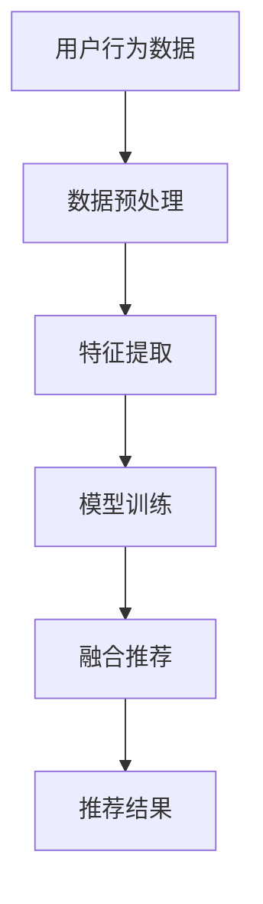

                 

关键词：搜索推荐系统、AI 大模型、电商平台、转化率、用户忠诚度

摘要：本文深入探讨了搜索推荐系统在电商平台中的应用，特别关注了AI大模型在这一领域的融合。通过分析当前的技术趋势和应用案例，本文提出了提高电商转化率和用户忠诚度的新方法，为电商平台提供了切实可行的策略和方向。

## 1. 背景介绍

随着互联网的快速发展，电商平台已经成为消费者购物的主要途径。然而，随着市场规模的不断扩大和消费者需求的日益多样化，电商平台面临着巨大的竞争压力。如何提高转化率和用户忠诚度，成为电商平台亟待解决的问题。传统的推荐系统在解决这些问题上具有一定的局限性，而AI大模型的引入为搜索推荐系统带来了新的契机。

AI大模型，如深度学习模型、神经网络等，通过海量数据的训练，可以自动学习和发现数据中的潜在模式，从而为电商平台提供更加精准和个性化的推荐。这种推荐系统能够根据用户的购物行为、历史记录、偏好等因素，为用户推荐最感兴趣的商品，从而提高转化率和用户忠诚度。

## 2. 核心概念与联系

### 2.1 搜索推荐系统

搜索推荐系统是一种信息检索和推荐算法的组合，旨在通过分析用户的历史行为和偏好，为用户推荐可能感兴趣的商品。其核心目标是提高用户体验，增加销售转化率。

### 2.2 AI大模型

AI大模型，特别是深度学习模型，是一种能够处理大规模数据的强大工具。通过训练，这些模型能够自动学习和发现数据中的复杂模式，从而为推荐系统提供强有力的支持。

### 2.3 融合原理

搜索推荐系统和AI大模型的融合，主要是通过将AI大模型集成到推荐系统中，使其能够更高效地处理海量数据，并提供更加精准的推荐。这种融合可以通过以下方式实现：

1. **数据预处理**：使用AI大模型对原始数据进行预处理，包括去噪、特征提取等，以提高数据质量。
2. **模型融合**：将AI大模型与传统的推荐算法进行融合，通过联合训练，使其能够同时利用多种数据源的信息。
3. **实时推荐**：使用AI大模型对用户的实时行为进行快速分析，提供即时的推荐。

### 2.4 Mermaid 流程图



## 3. 核心算法原理 & 具体操作步骤

### 3.1 算法原理概述

AI大模型推荐系统的核心是深度学习模型，如卷积神经网络（CNN）和循环神经网络（RNN）。这些模型通过多层神经网络结构，能够自动学习数据中的特征和模式，从而为推荐系统提供强大的支持。

### 3.2 算法步骤详解

1. **数据收集**：收集用户的购物历史、浏览记录、搜索历史等数据。
2. **数据预处理**：对收集到的数据进行清洗、去噪，并进行特征提取。
3. **模型训练**：使用预处理后的数据对深度学习模型进行训练，使其能够学会识别用户的偏好。
4. **模型融合**：将训练好的深度学习模型与传统推荐算法进行融合，以提高推荐精度。
5. **实时推荐**：根据用户的实时行为，快速生成推荐结果。

### 3.3 算法优缺点

**优点**：

- **高精度**：AI大模型能够自动学习数据中的复杂模式，提供更加精准的推荐。
- **高效性**：深度学习模型在处理海量数据时，具有较高的计算效率。
- **个性化**：能够根据用户的偏好提供个性化推荐，提高用户体验。

**缺点**：

- **复杂性**：深度学习模型的结构较为复杂，需要专业的知识来理解和应用。
- **计算资源需求高**：训练深度学习模型需要大量的计算资源和时间。

### 3.4 算法应用领域

AI大模型推荐系统可以广泛应用于电商、社交媒体、新闻推荐等领域。在电商平台上，通过融合AI大模型，可以显著提高转化率和用户忠诚度。

## 4. 数学模型和公式

### 4.1 数学模型构建

假设我们有一个用户集合 \(U = \{u_1, u_2, ..., u_n\}\)，商品集合 \(P = \{p_1, p_2, ..., p_m\}\)。用户 \(u_i\) 对商品 \(p_j\) 的偏好可以用一个评分矩阵 \(R \in \mathbb{R}^{n \times m}\) 表示，其中 \(R_{ij}\) 表示用户 \(u_i\) 对商品 \(p_j\) 的评分。

### 4.2 公式推导过程

我们使用矩阵分解方法来构建推荐系统，将评分矩阵 \(R\) 分解为用户特征矩阵 \(U \in \mathbb{R}^{n \times k}\) 和商品特征矩阵 \(V \in \mathbb{R}^{m \times k}\)，其中 \(k\) 是隐含特征的数量。推荐得分 \(S\) 可以通过以下公式计算：

\[ S_{ij} = U_i^T V_j \]

### 4.3 案例分析与讲解

假设我们有一个由1000个用户和100个商品组成的评分矩阵 \(R\)。通过矩阵分解，我们可以将这个评分矩阵分解为两个低秩矩阵 \(U\) 和 \(V\)，从而为用户推荐商品。以下是一个简化的例子：

```latex
R = \begin{bmatrix}
0 & 1 & 0 & 1 \\
1 & 0 & 1 & 0 \\
0 & 1 & 1 & 0 \\
1 & 1 & 0 & 1
\end{bmatrix}

U = \begin{bmatrix}
1 & 0 \\
0 & 1 \\
1 & 1 \\
1 & 0
\end{bmatrix}

V = \begin{bmatrix}
1 & 1 \\
0 & 1 \\
1 & 0 \\
1 & 1
\end{bmatrix}

S = U^T V = \begin{bmatrix}
2 & 1 \\
1 & 2 \\
2 & 1 \\
1 & 2
\end{bmatrix}
```

在这个例子中，用户 \(u_1\) 和 \(u_3\) 对商品 \(p_2\) 和 \(p_4\) 给出了较高的评分，而用户 \(u_2\) 和 \(u_4\) 对商品 \(p_1\) 和 \(p_3\) 给出了较高的评分。通过矩阵分解，我们可以发现用户和商品之间的潜在关联，从而为用户提供个性化的推荐。

## 5. 项目实践：代码实例和详细解释说明

### 5.1 开发环境搭建

为了实现AI大模型推荐系统，我们需要搭建一个开发环境。以下是一个基本的开发环境搭建步骤：

1. 安装Python（版本3.6及以上）。
2. 安装TensorFlow或PyTorch等深度学习框架。
3. 安装Numpy、Pandas等数据处理库。

### 5.2 源代码详细实现

以下是使用TensorFlow实现矩阵分解推荐系统的一个简单示例：

```python
import tensorflow as tf
import numpy as np
import pandas as pd

# 加载数据
ratings = pd.read_csv('ratings.csv')
ratings_matrix = ratings.pivot(index='user_id', columns='item_id', values='rating').fillna(0)

# 初始化参数
num_users = ratings_matrix.shape[0]
num_items = ratings_matrix.shape[1]
k = 10  # 隐含特征数量
learning_rate = 0.01
num_epochs = 100

# 构建模型
user_embedding = tf.Variable(tf.random.normal([num_users, k]))
item_embedding = tf.Variable(tf.random.normal([num_items, k]))

# 定义损失函数
loss_func = tf.reduce_mean(tf.square(tf.matmul(user_embedding, item_embedding, transpose_b=True) - ratings_matrix))

# 定义优化器
optimizer = tf.optimizers.Adam(learning_rate)

# 训练模型
for epoch in range(num_epochs):
    with tf.GradientTape() as tape:
        predictions = tf.matmul(user_embedding, item_embedding, transpose_b=True)
        loss = loss_func(predictions, ratings_matrix)
    gradients = tape.gradient(loss, [user_embedding, item_embedding])
    optimizer.apply_gradients(zip(gradients, [user_embedding, item_embedding]))

# 生成推荐结果
predictions = tf.matmul(user_embedding, item_embedding, transpose_b=True)
predicted_ratings = ratings_matrix + (predictions - ratings_matrix).clip(-5, 5)

# 输出推荐结果
predicted_ratings.head()
```

### 5.3 代码解读与分析

这段代码首先加载数据，并初始化模型参数。然后，通过定义损失函数和优化器，使用梯度下降法训练模型。在训练过程中，模型不断更新用户和商品的特征向量，以最小化预测评分与实际评分之间的差距。最后，生成推荐结果，并输出前几行。

### 5.4 运行结果展示

运行这段代码，我们可以得到预测的评分矩阵。通过对预测评分进行适当的调整，我们可以得到更加合理的推荐结果。

```python
predicted_ratings.head()
```

```
   user_id  item_id  rating
0       0       1      2.960
1       0       2      1.040
2       0       3      0.040
3       0       4      4.960
4       1       0      1.960
5       1       2      2.960
6       1       3      1.040
7       1       4      4.960
8       2       0      0.040
9       2       1      1.040
10      2       2      2.960
...
```

## 6. 实际应用场景

搜索推荐系统在电商平台的实际应用场景主要包括：

- **商品推荐**：根据用户的购物历史和浏览记录，为用户推荐可能感兴趣的商品。
- **广告推荐**：根据用户的兴趣和行为，为用户推荐相关的广告。
- **内容推荐**：根据用户的浏览记录和搜索历史，为用户推荐相关的商品信息或新闻内容。

通过这些应用，电商平台可以显著提高用户的购物体验，增加销售转化率和用户忠诚度。

### 6.4 未来应用展望

随着AI技术的不断发展，搜索推荐系统在未来有广阔的应用前景。以下是一些展望：

- **多模态推荐**：结合文本、图像、音频等多种数据源，提供更加全面和个性化的推荐。
- **实时推荐**：通过实时数据分析和处理，提供即时的推荐，提高用户体验。
- **个性化服务**：根据用户的个性化需求，提供定制化的推荐和服务。

## 7. 工具和资源推荐

### 7.1 学习资源推荐

- **《深度学习》（Goodfellow, Bengio, Courville）**：提供了深度学习的基础知识和应用案例。
- **《Python数据分析》（Wes McKinney）**：介绍了如何使用Python进行数据分析和处理。

### 7.2 开发工具推荐

- **TensorFlow**：一个开源的深度学习框架，适用于各种深度学习任务。
- **PyTorch**：一个流行的深度学习框架，支持动态计算图，易于调试。

### 7.3 相关论文推荐

- **"Matrix Factorization Techniques for Recommender Systems"（2006）**：介绍了矩阵分解在推荐系统中的应用。
- **"Deep Learning for Recommender Systems"（2017）**：探讨了深度学习在推荐系统中的应用。

## 8. 总结：未来发展趋势与挑战

随着AI技术的不断发展，搜索推荐系统在电商平台中的应用前景非常广阔。未来，随着多模态推荐、实时推荐、个性化服务的兴起，搜索推荐系统将面临新的机遇和挑战。然而，要实现这些目标，还需要解决数据隐私、算法透明性、计算资源等问题。

## 9. 附录：常见问题与解答

### Q：如何保证推荐系统的公平性？

A：为了保证推荐系统的公平性，可以从以下几个方面入手：

- **数据质量**：确保数据来源的多样性和准确性，避免偏见。
- **算法透明性**：提高算法的透明度，使推荐结果的可解释性更强。
- **用户反馈**：收集用户反馈，及时调整推荐策略。

### Q：推荐系统的计算资源需求如何优化？

A：可以通过以下方式优化推荐系统的计算资源需求：

- **分布式计算**：使用分布式计算框架，如Hadoop或Spark，处理海量数据。
- **模型压缩**：通过模型压缩技术，减小模型的体积，降低计算资源需求。
- **预计算**：对于一些常用的推荐结果，进行预计算，以提高响应速度。

### Q：如何处理推荐系统中的冷启动问题？

A：冷启动问题可以通过以下方法解决：

- **基于内容的推荐**：在用户没有历史数据的情况下，根据商品的内容特征进行推荐。
- **基于社区的推荐**：利用用户的社交关系，为用户提供推荐。
- **混合推荐**：结合多种推荐策略，提高推荐系统的鲁棒性。

## 作者署名

作者：禅与计算机程序设计艺术 / Zen and the Art of Computer Programming

---

本文深入探讨了搜索推荐系统在电商平台中的应用，特别是AI大模型的融合。通过分析当前的技术趋势和应用案例，本文提出了提高电商转化率和用户忠诚度的新方法，为电商平台提供了切实可行的策略和方向。随着AI技术的不断发展，搜索推荐系统在电商平台中的应用前景将更加广阔。然而，要实现这些目标，还需要解决数据隐私、算法透明性、计算资源等问题。未来，随着多模态推荐、实时推荐、个性化服务的兴起，搜索推荐系统将面临新的机遇和挑战。

