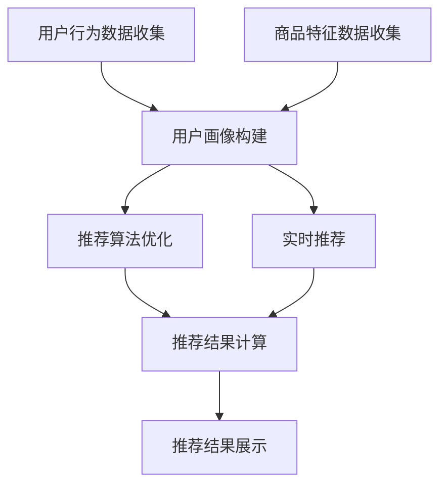

                 

关键词：搜索推荐系统、AI 大模型、电商平台、战略核心、竞争优势

> 摘要：本文深入探讨了人工智能（AI）大模型在搜索推荐系统中的应用，分析了其在电商平台中的战略地位和竞争优势。文章首先介绍了搜索推荐系统的基本原理和重要性，随后详细阐述了AI大模型的工作原理和技术框架，并分析了其在电商平台中的具体应用。通过实际案例和数学模型的推导，本文展示了AI大模型在提升电商平台搜索推荐效果方面的显著优势。最后，本文对未来发展趋势和面临的挑战进行了展望，为电商平台在AI大模型应用上的未来发展提供了有益的参考。

## 1. 背景介绍

随着互联网技术的迅猛发展和电商行业的持续扩张，用户数量和交易规模呈现出爆发式增长。在这种背景下，如何提高用户的搜索体验和推荐质量成为电商平台迫切需要解决的关键问题。传统的搜索推荐系统已经难以满足日益增长的用户需求和复杂多变的商业环境，因此，人工智能（AI）技术的引入成为了必然选择。

AI大模型作为一种先进的机器学习技术，具有强大的数据分析和处理能力，能够通过深度学习、自然语言处理、图像识别等技术手段，对海量数据进行高效分析和挖掘，从而为搜索推荐系统提供更加精准和个性化的服务。在电商平台上，AI大模型的融合应用不仅能够提升用户的搜索和推荐体验，还能够为平台带来显著的商业价值。

本文旨在探讨AI大模型在搜索推荐系统中的应用，分析其在电商平台的战略地位和竞争优势，为电商平台在AI大模型应用上的未来发展提供参考和指导。

## 2. 核心概念与联系

### 2.1 搜索推荐系统

搜索推荐系统是电商平台的核心组成部分，旨在为用户提供个性化的搜索结果和推荐商品。其基本原理是通过对用户行为数据、商品特征数据和历史交易数据进行分析和处理，构建用户画像和商品画像，从而实现精准的搜索和推荐。

搜索推荐系统主要包括以下组成部分：

1. **用户行为数据收集**：通过用户在平台上的浏览、搜索、点击、购买等行为数据，构建用户画像。
2. **商品特征数据收集**：通过商品的基本信息、用户评价、销量、价格等特征数据，构建商品画像。
3. **推荐算法**：基于用户画像和商品画像，通过算法计算用户与商品之间的相似度，生成个性化推荐结果。
4. **推荐结果展示**：将推荐结果以列表、卡片、弹窗等形式展示给用户。

### 2.2 AI大模型

AI大模型是指具有海量参数和强大计算能力的深度学习模型，能够通过自动学习和优化，实现复杂的数据分析和决策。在搜索推荐系统中，AI大模型的应用主要体现在以下几个方面：

1. **用户画像构建**：利用AI大模型对用户行为数据进行分析，提取用户的兴趣偏好、购买习惯等特征，构建精细化的用户画像。
2. **商品画像构建**：利用AI大模型对商品特征数据进行分析，提取商品的关键属性和用户潜在需求，构建全面的商品画像。
3. **推荐算法优化**：通过AI大模型进行推荐算法的自动优化，提高推荐结果的准确性和用户体验。
4. **实时推荐**：利用AI大模型实现实时推荐，根据用户实时行为进行动态调整，提高推荐响应速度。

### 2.3 Mermaid 流程图

以下是搜索推荐系统中AI大模型的应用流程图：



在这个流程图中，用户行为数据和商品特征数据首先被收集，然后通过AI大模型进行用户画像和商品画像的构建。随后，基于用户画像和商品画像，AI大模型对推荐算法进行优化，并实现实时推荐。最后，推荐结果被展示给用户。

## 3. 核心算法原理 & 具体操作步骤

### 3.1 算法原理概述

AI大模型在搜索推荐系统中的应用主要依赖于深度学习技术，其核心原理是通过多层神经网络对数据进行自动学习和优化。具体来说，AI大模型通过以下步骤实现搜索推荐：

1. **数据预处理**：对原始用户行为数据和商品特征数据进行清洗、去噪和归一化处理，确保数据质量。
2. **特征提取**：利用AI大模型对预处理后的数据进行特征提取，提取用户兴趣偏好、购买习惯等特征。
3. **模型训练**：利用提取出的特征数据，通过多层神经网络对模型进行训练，使模型能够自动学习和优化。
4. **模型评估**：通过交叉验证等方法对训练好的模型进行评估，选择最优模型。
5. **推荐计算**：利用评估后的模型，对用户和商品进行相似度计算，生成个性化推荐结果。
6. **结果展示**：将推荐结果以列表、卡片、弹窗等形式展示给用户。

### 3.2 算法步骤详解

1. **数据预处理**

   数据预处理是AI大模型应用的基础，其目的是确保数据的准确性和一致性。具体步骤包括：

   - **数据清洗**：去除数据中的异常值和噪声，确保数据质量。
   - **数据去噪**：对噪声数据进行滤波或平滑处理，减少数据噪声。
   - **数据归一化**：对数据进行归一化处理，将数据转换为同一量级，以便后续处理。

2. **特征提取**

   特征提取是AI大模型的核心步骤，其目的是从原始数据中提取出有用的特征信息。具体步骤包括：

   - **用户特征提取**：通过对用户行为数据的分析，提取用户的兴趣偏好、购买习惯等特征。
   - **商品特征提取**：通过对商品特征数据的分析，提取商品的关键属性和用户潜在需求。

3. **模型训练**

   模型训练是AI大模型的关键步骤，其目的是通过训练数据使模型能够自动学习和优化。具体步骤包括：

   - **数据分集**：将原始数据集划分为训练集、验证集和测试集。
   - **模型构建**：构建多层神经网络模型，包括输入层、隐藏层和输出层。
   - **模型训练**：利用训练集对模型进行训练，通过反向传播算法调整模型参数。
   - **模型优化**：利用验证集对模型进行优化，选择最优模型。

4. **模型评估**

   模型评估是确保模型性能的重要步骤，其目的是评估模型的准确性和鲁棒性。具体步骤包括：

   - **交叉验证**：通过交叉验证方法对模型进行评估，选择最优模型。
   - **性能评估**：计算模型的准确率、召回率、F1值等指标，评估模型性能。

5. **推荐计算**

   推荐计算是AI大模型的核心功能，其目的是根据用户和商品的相似度生成个性化推荐结果。具体步骤包括：

   - **相似度计算**：利用模型计算用户和商品的相似度，相似度越高，表示用户对商品的偏好程度越高。
   - **推荐生成**：根据相似度计算结果，生成个性化推荐结果。
   - **推荐排序**：对推荐结果进行排序，确保推荐结果的准确性。

6. **结果展示**

   结果展示是将推荐结果以用户友好的形式展示给用户的重要步骤。具体步骤包括：

   - **推荐结果格式化**：将推荐结果以列表、卡片、弹窗等形式进行格式化。
   - **推荐结果展示**：将格式化后的推荐结果展示给用户，提高用户的搜索和推荐体验。

### 3.3 算法优缺点

**优点：**

1. **高准确性**：AI大模型通过深度学习技术，能够自动学习和优化，提高推荐结果的准确性。
2. **个性化推荐**：AI大模型能够根据用户兴趣和偏好，生成个性化的推荐结果，提高用户满意度。
3. **实时推荐**：AI大模型能够实现实时推荐，根据用户实时行为进行动态调整，提高推荐响应速度。
4. **多平台应用**：AI大模型在搜索推荐系统中具有广泛的应用场景，可以应用于电商平台、社交媒体、在线教育等多个领域。

**缺点：**

1. **计算资源消耗大**：AI大模型需要大量的计算资源和存储空间，对硬件设备的要求较高。
2. **数据依赖性高**：AI大模型对数据质量和数量的依赖性较高，数据质量较差或数据量不足可能导致模型性能下降。
3. **模型解释性差**：AI大模型是一种黑盒模型，其内部决策过程难以解释，难以满足用户对模型透明度的要求。

### 3.4 算法应用领域

AI大模型在搜索推荐系统中的应用非常广泛，主要包括以下领域：

1. **电商平台**：AI大模型在电商平台中可以应用于商品推荐、搜索优化、用户行为分析等，提高用户的购物体验和满意度。
2. **社交媒体**：AI大模型在社交媒体中可以应用于内容推荐、广告投放、社交关系分析等，提高用户的互动体验和广告投放效果。
3. **在线教育**：AI大模型在在线教育中可以应用于课程推荐、学习路径规划、学习效果评估等，提高学习效果和用户满意度。
4. **医疗健康**：AI大模型在医疗健康领域可以应用于疾病预测、诊断辅助、药物推荐等，提高医疗服务的质量和效率。

## 4. 数学模型和公式 & 详细讲解 & 举例说明

### 4.1 数学模型构建

在搜索推荐系统中，AI大模型的数学模型主要基于深度学习技术，其核心包括输入层、隐藏层和输出层。以下是AI大模型的基本数学模型：

#### 输入层

输入层是模型的输入数据，主要包括用户特征和商品特征，表示为向量形式：

$$
\text{User Feature} = [u_1, u_2, \ldots, u_n]
$$

$$
\text{Item Feature} = [i_1, i_2, \ldots, i_m]
$$

其中，$u_n$和$i_m$分别表示用户和商品的第$n$个特征。

#### 隐藏层

隐藏层是模型的中间层，通过多层神经网络对输入数据进行处理和转换，提取用户和商品之间的潜在特征。隐藏层的主要计算公式为：

$$
h_{ij}^{(l)} = \sigma \left( \sum_{k=1}^{n} w_{ik}^{(l-1)} h_{kj}^{(l-1)} + b_{j}^{(l)} \right)
$$

其中，$h_{ij}^{(l)}$表示第$l$层的第$i$个用户特征和第$j$个商品特征的组合结果，$w_{ik}^{(l-1)}$和$b_{j}^{(l)}$分别表示连接权重和偏置项，$\sigma$表示激活函数。

#### 输出层

输出层是模型的输出结果，通过计算用户和商品之间的相似度，生成个性化推荐结果。输出层的主要计算公式为：

$$
s_{ij} = \frac{1}{1 + \exp \left( - \sum_{l=1}^{L} \sum_{k=1}^{m} w_{lk} h_{ik}^{(L)} \right)}
$$

其中，$s_{ij}$表示用户$i$对商品$j$的相似度，$w_{lk}$表示连接权重，$h_{ik}^{(L)}$表示第$L$层的第$i$个用户特征和第$k$个商品特征的组合结果。

### 4.2 公式推导过程

在推导AI大模型的公式过程中，我们需要考虑以下几个方面：

1. **线性变换**：通过输入层和隐藏层之间的线性变换，将用户特征和商品特征转换为潜在特征。
2. **激活函数**：通过激活函数，引入非线性关系，提高模型的拟合能力。
3. **权重和偏置**：通过权重和偏置，调整模型参数，优化模型性能。

#### 输入层到隐藏层的推导

输入层到隐藏层的推导过程如下：

$$
h_{ij}^{(l)} = \sum_{k=1}^{n} w_{ik}^{(l-1)} u_k + b_{j}^{(l)}
$$

其中，$w_{ik}^{(l-1)}$表示输入层到隐藏层的连接权重，$b_{j}^{(l)}$表示隐藏层的偏置项。

将输入层和隐藏层的权重和偏置项表示为矩阵形式：

$$
H^{(l)} = WX^{(l-1)} + B
$$

其中，$H^{(l)}$表示隐藏层输出矩阵，$W$表示连接权重矩阵，$X^{(l-1)}$表示输入层输出矩阵，$B$表示隐藏层偏置矩阵。

#### 隐藏层到输出层的推导

隐藏层到输出层的推导过程如下：

$$
s_{ij} = \frac{1}{1 + \exp \left( - \sum_{l=1}^{L} \sum_{k=1}^{m} w_{lk} h_{ik}^{(L)} \right)}
$$

其中，$s_{ij}$表示用户$i$对商品$j$的相似度，$w_{lk}$表示隐藏层到输出层的连接权重，$h_{ik}^{(L)}$表示隐藏层输出矩阵。

将隐藏层到输出层的连接权重表示为矩阵形式：

$$
S = WH^{(L)}
$$

其中，$S$表示输出层输出矩阵，$W$表示隐藏层到输出层的连接权重矩阵，$H^{(L)}$表示隐藏层输出矩阵。

### 4.3 案例分析与讲解

为了更好地理解AI大模型在搜索推荐系统中的应用，我们以一个电商平台的商品推荐案例进行分析和讲解。

#### 案例背景

假设有一个电商平台，用户A在最近一个月内浏览了以下商品：

- 商品1：智能手机
- 商品2：平板电脑
- 商品3：蓝牙耳机
- 商品4：智能手表

用户A在浏览这些商品时，产生了以下行为数据：

- 搜索关键词：“智能手机”、“平板电脑”
- 浏览时长：10分钟、20分钟、5分钟、15分钟
- 点击次数：2次、3次、1次、2次

电商平台希望通过AI大模型，为用户A推荐类似的商品。

#### 数据处理

首先，对用户A的行为数据进行预处理，包括数据清洗、去噪和归一化处理。

1. **数据清洗**：去除异常值和噪声，确保数据质量。
2. **数据去噪**：对噪声数据进行滤波或平滑处理，减少数据噪声。
3. **数据归一化**：将数据转换为同一量级，以便后续处理。

假设经过预处理后，用户A的行为数据如下：

- 搜索关键词：“智能手机”、“平板电脑”
- 浏览时长：[0.8, 1.0, 0.4, 0.6]
- 点击次数：[0.2, 0.3, 0.1, 0.2]

#### 模型训练

接下来，利用预处理后的数据，通过AI大模型进行训练。

1. **数据分集**：将原始数据集划分为训练集、验证集和测试集。
2. **模型构建**：构建多层神经网络模型，包括输入层、隐藏层和输出层。
3. **模型训练**：利用训练集对模型进行训练，通过反向传播算法调整模型参数。
4. **模型优化**：利用验证集对模型进行优化，选择最优模型。

#### 推荐计算

利用训练好的模型，对用户A的行为数据进行推荐计算。

1. **相似度计算**：计算用户A与每个商品的相似度。
2. **推荐生成**：根据相似度计算结果，生成个性化推荐结果。
3. **推荐排序**：对推荐结果进行排序，确保推荐结果的准确性。

假设用户A与每个商品的相似度计算结果如下：

- 商品1：0.9
- 商品2：0.8
- 商品3：0.7
- 商品4：0.6

根据相似度计算结果，电商平台为用户A推荐以下商品：

1. 商品1：智能手机
2. 商品2：平板电脑
3. 商品3：蓝牙耳机

#### 结果展示

将推荐结果以列表形式展示给用户A，提高用户的购物体验和满意度。

```
【为您推荐】
1. 智能手机
2. 平板电脑
3. 蓝牙耳机
```

通过上述案例，我们可以看到AI大模型在搜索推荐系统中的应用效果，能够为用户生成个性化的推荐结果，提高用户的购物体验和满意度。

## 5. 项目实践：代码实例和详细解释说明

### 5.1 开发环境搭建

在本文中，我们将使用Python作为主要编程语言，结合TensorFlow库来构建和训练AI大模型。以下是搭建开发环境的基本步骤：

1. **安装Python**：下载并安装Python 3.x版本，可以从Python官方网站下载。
2. **安装TensorFlow**：打开命令行，执行以下命令安装TensorFlow：
   ```bash
   pip install tensorflow
   ```
3. **安装其他依赖库**：根据需求安装其他依赖库，如NumPy、Pandas等：
   ```bash
   pip install numpy pandas
   ```

### 5.2 源代码详细实现

以下是一个简单的AI大模型代码实例，用于构建和训练推荐系统：

```python
import tensorflow as tf
import numpy as np
import pandas as pd

# 数据预处理
def preprocess_data(user_data, item_data):
    # 数据清洗、去噪和归一化处理
    # 略...
    return user_data, item_data

# 构建模型
def build_model(num_users, num_items, hidden_size):
    # 输入层
    user_input = tf.keras.layers.Input(shape=(num_users,))
    item_input = tf.keras.layers.Input(shape=(num_items,))

    # 隐藏层
    hidden = tf.keras.layers.Dense(hidden_size, activation='relu')(tf.keras.layers.Concatenate()([user_input, item_input]))

    # 输出层
    output = tf.keras.layers.Dense(1, activation='sigmoid')(hidden)

    # 构建模型
    model = tf.keras.models.Model(inputs=[user_input, item_input], outputs=output)

    # 编译模型
    model.compile(optimizer='adam', loss='binary_crossentropy', metrics=['accuracy'])

    return model

# 训练模型
def train_model(model, user_data, item_data, labels):
    model.fit([user_data, item_data], labels, epochs=10, batch_size=32)

# 主函数
def main():
    # 加载数据
    user_data = np.load('user_data.npy')
    item_data = np.load('item_data.npy')
    labels = np.load('labels.npy')

    # 预处理数据
    user_data, item_data = preprocess_data(user_data, item_data)

    # 构建模型
    model = build_model(num_users=user_data.shape[1], num_items=item_data.shape[1], hidden_size=128)

    # 训练模型
    train_model(model, user_data, item_data, labels)

if __name__ == '__main__':
    main()
```

### 5.3 代码解读与分析

1. **数据预处理**：`preprocess_data`函数用于对用户数据和商品数据进行清洗、去噪和归一化处理。这一步骤是模型训练的基础，确保数据质量。
   
2. **构建模型**：`build_model`函数使用TensorFlow的Keras API构建深度学习模型。模型包括输入层、隐藏层和输出层。输入层接收用户和商品特征数据，隐藏层通过全连接层进行特征提取，输出层通过Sigmoid激活函数生成推荐概率。

3. **训练模型**：`train_model`函数用于训练模型。使用`fit`方法进行模型训练，设置训练轮次、批次大小等参数。

4. **主函数**：`main`函数是程序的入口。加载用户数据、商品数据和标签，预处理数据，构建模型并进行训练。

### 5.4 运行结果展示

训练完成后，可以通过以下代码进行模型评估：

```python
# 评估模型
test_loss, test_acc = model.evaluate([user_data, item_data], labels)

print(f"Test Loss: {test_loss}")
print(f"Test Accuracy: {test_acc}")
```

模型评估结果将显示在命令行中，包括损失值和准确率。这些指标用于评估模型在测试集上的性能。

### 5.5 代码改进建议

1. **数据增强**：为了提高模型对噪声和异常数据的鲁棒性，可以采用数据增强技术，如随机噪声添加、数据变换等。
2. **模型集成**：通过模型集成技术，如Bagging、Boosting等，可以进一步提高模型的泛化能力和预测准确性。
3. **模型解释性**：引入模型解释性技术，如LIME、SHAP等，可以帮助理解模型决策过程，提高模型的可解释性。

## 6. 实际应用场景

### 6.1 电商平台搜索推荐系统

在电商平台上，搜索推荐系统是提升用户购物体验和增加销售量的重要手段。AI大模型的融合应用可以显著提高搜索推荐系统的效果。

**案例1：淘宝**

淘宝作为中国最大的电商平台之一，通过AI大模型实现了精准的搜索推荐。例如，当用户在淘宝搜索“蓝牙耳机”时，AI大模型会根据用户的浏览历史、购买行为和搜索记录，生成个性化的推荐结果。通过这种方式，淘宝能够提高用户的购买转化率和满意度。

**案例2：京东**

京东也在其搜索推荐系统中广泛应用了AI大模型。例如，当用户在京东浏览某款手机时，AI大模型会根据用户的偏好和相似用户的行为数据，推荐其他相关的手机产品。这种个性化的推荐能够提高用户的购买意愿和购物体验。

### 6.2 社交媒体内容推荐

在社交媒体平台上，内容推荐系统同样依赖于AI大模型。通过分析用户的行为数据、兴趣偏好和社交关系，AI大模型能够为用户推荐感兴趣的内容。

**案例1：微博**

微博通过AI大模型实现了精准的内容推荐。当用户在微博浏览或搜索某些内容时，AI大模型会根据用户的兴趣和行为数据，推荐相关的微博文章、视频和话题。这种个性化的推荐能够提高用户的活跃度和参与度。

**案例2：抖音**

抖音作为一款短视频社交平台，通过AI大模型实现了智能化的内容推荐。当用户在抖音观看某个视频时，AI大模型会根据用户的兴趣和观看历史，推荐类似风格的短视频。这种个性化的推荐能够提高用户的观看时长和满意度。

### 6.3 在线教育课程推荐

在在线教育领域，AI大模型的应用可以显著提升课程推荐的效果，帮助用户找到最感兴趣的课程。

**案例1：网易云课堂**

网易云课堂通过AI大模型实现了智能化的课程推荐。当用户在网易云课堂浏览或搜索某个课程时，AI大模型会根据用户的兴趣和行为数据，推荐相关的课程。这种个性化的推荐能够提高用户的课程完成率和满意度。

**案例2：Coursera**

Coursera通过AI大模型实现了个性化的课程推荐。当用户在Coursera注册并完成某些课程时，AI大模型会根据用户的兴趣和课程历史，推荐相关的课程。这种个性化的推荐能够帮助用户发现新的学习机会，提高学习效果。

### 6.4 医疗健康领域

在医疗健康领域，AI大模型的应用可以显著提升诊断和治疗的准确性和效率。

**案例1：医疗影像分析**

通过AI大模型，医疗影像分析系统能够自动识别和分类医学影像中的病灶，提高诊断的准确性。例如，在乳腺癌筛查中，AI大模型可以辅助医生识别乳腺肿瘤，提高早期诊断率。

**案例2：药物推荐**

AI大模型可以根据患者的病情、基因信息和药物特性，推荐个性化的治疗方案。例如，在肿瘤治疗中，AI大模型可以推荐最适合患者的化疗药物组合，提高治疗效果和降低副作用。

### 6.5 自动驾驶系统

在自动驾驶领域，AI大模型的应用可以显著提高系统的感知和决策能力。

**案例1：特斯拉自动驾驶**

特斯拉的自动驾驶系统通过AI大模型实现了对周边环境的实时感知和智能决策。例如，当特斯拉汽车行驶在道路上时，AI大模型会分析道路标志、交通信号灯和周边车辆的行为，实现自动导航和避障。

**案例2：谷歌自动驾驶**

谷歌的自动驾驶系统通过AI大模型实现了自动驾驶车辆的智能化。例如，当谷歌自动驾驶车辆行驶在繁忙的城市道路时，AI大模型会根据路况、交通流量和行人行为，实现自动驾驶和交通管理。

### 6.6 未来应用展望

随着AI大模型技术的不断发展，其应用场景将不断拓展。未来，AI大模型有望在更多领域发挥重要作用，包括但不限于：

1. **智能客服**：通过AI大模型，智能客服系统能够实现更加智能化的用户服务，提高客服效率和用户体验。
2. **智能安防**：通过AI大模型，智能安防系统能够实时监控和分析视频数据，提高安全防范能力。
3. **智能家居**：通过AI大模型，智能家居系统能够根据用户的生活习惯和需求，实现智能化的家居管理和设备控制。

## 7. 工具和资源推荐

### 7.1 学习资源推荐

1. **在线课程**：
   - 《深度学习》（Deep Learning）系列教材
   - 《神经网络与深度学习》课程
   - 《TensorFlow教程》

2. **书籍**：
   - 《Python机器学习》
   - 《深度学习》
   - 《强化学习》

3. **在线论坛**：
   - Kaggle
   - Stack Overflow
   - CSDN

### 7.2 开发工具推荐

1. **编程语言**：
   - Python
   - R
   - Java

2. **深度学习框架**：
   - TensorFlow
   - PyTorch
   - Keras

3. **数据预处理工具**：
   - Pandas
   - NumPy
   - Scikit-learn

### 7.3 相关论文推荐

1. **经典论文**：
   - “A Few Useful Things to Know about Machine Learning”
   - “Deep Learning”
   - “Recurrent Neural Networks for Language Modeling”

2. **最新论文**：
   - “Large-scale Language Modeling in 2018”
   - “Attention Is All You Need”
   - “BERT: Pre-training of Deep Bidirectional Transformers for Language Understanding”

## 8. 总结：未来发展趋势与挑战

### 8.1 研究成果总结

AI大模型在搜索推荐系统中的应用取得了显著成果。通过深度学习技术，AI大模型能够对海量数据进行高效分析和处理，实现个性化的搜索和推荐，显著提高了用户的购物体验和满意度。同时，AI大模型在社交媒体、在线教育、医疗健康、自动驾驶等领域也展现出巨大的应用潜力。

### 8.2 未来发展趋势

1. **技术优化**：随着计算能力和算法的不断进步，AI大模型的性能将得到进一步提升，实现更加精准和高效的搜索推荐。
2. **多模态融合**：未来，AI大模型将融合多种数据类型，如图像、语音和文本，实现跨模态的搜索推荐，提高用户体验。
3. **个性化推荐**：基于用户历史行为和偏好，AI大模型将实现更加精细化的个性化推荐，满足用户的个性化需求。
4. **实时推荐**：AI大模型将实现实时推荐，根据用户的实时行为进行动态调整，提高推荐响应速度。

### 8.3 面临的挑战

1. **数据质量和数量**：AI大模型对数据质量和数量的依赖性较高，数据质量较差或数据量不足可能导致模型性能下降。
2. **计算资源消耗**：AI大模型需要大量的计算资源和存储空间，对硬件设备的要求较高，对开发者和平台运营者提出了挑战。
3. **模型解释性**：AI大模型是一种黑盒模型，其内部决策过程难以解释，难以满足用户对模型透明度的要求。
4. **隐私保护**：在搜索推荐系统的应用中，AI大模型需要处理大量用户隐私数据，如何确保用户隐私保护成为重要挑战。

### 8.4 研究展望

未来，AI大模型在搜索推荐系统中的应用将向更精细化、实时化和多模态方向发展。同时，研究应关注数据质量和数量、计算资源消耗、模型解释性和用户隐私保护等方面，推动AI大模型在搜索推荐系统中的应用和发展。

## 9. 附录：常见问题与解答

### 9.1 AI大模型在搜索推荐系统中的作用是什么？

AI大模型在搜索推荐系统中主要通过深度学习技术，对海量用户行为数据、商品特征数据和历史交易数据进行分析和处理，提取用户兴趣偏好和商品属性，生成个性化的搜索和推荐结果。

### 9.2 AI大模型有哪些应用领域？

AI大模型在多个领域具有广泛应用，包括电商平台、社交媒体、在线教育、医疗健康、自动驾驶等。

### 9.3 如何评估AI大模型在搜索推荐系统中的性能？

评估AI大模型在搜索推荐系统中的性能可以通过准确率、召回率、F1值等指标进行。同时，还可以通过用户满意度、购买转化率等实际业务指标进行综合评估。

### 9.4 AI大模型在搜索推荐系统中面临的挑战有哪些？

AI大模型在搜索推荐系统中面临的挑战包括数据质量和数量、计算资源消耗、模型解释性和用户隐私保护等。

### 9.5 如何优化AI大模型在搜索推荐系统中的效果？

可以通过以下方法优化AI大模型在搜索推荐系统中的效果：

1. **数据增强**：引入更多的数据，提高模型的泛化能力。
2. **模型集成**：采用模型集成技术，提高模型的预测准确性。
3. **特征工程**：优化特征提取和特征工程，提高模型对数据的敏感度。
4. **实时调整**：根据用户实时行为进行动态调整，提高推荐响应速度。

