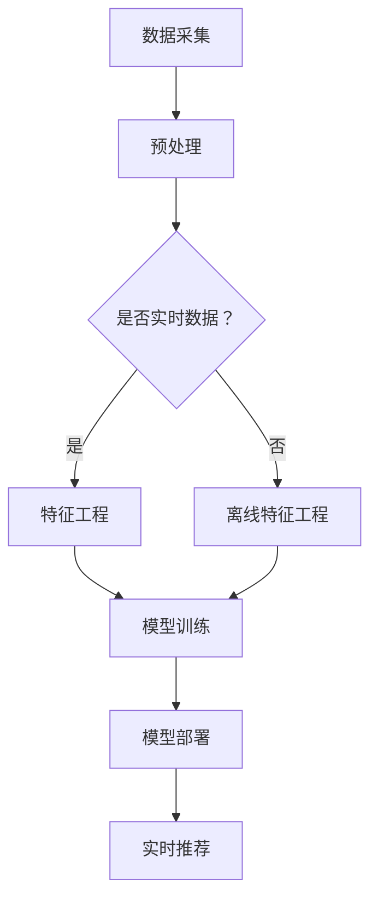

                 

关键词：搜索推荐系统，实时特征工程，大模型，自动特征生成，AI，机器学习，深度学习，特征提取，用户行为分析

> 摘要：本文深入探讨了搜索推荐系统中实时特征工程的重要性，以及如何利用大模型实现自动特征生成。通过分析现有技术，我们提出了一个基于AI的实时特征工程框架，并详细介绍了其核心算法原理、数学模型、项目实践以及未来应用展望。

## 1. 背景介绍

随着互联网的快速发展，信息量呈指数级增长，用户对个性化推荐的需求也越来越高。搜索推荐系统作为一种信息过滤和内容分发的重要手段，已经成为许多互联网公司的重要产品。然而，推荐系统的性能直接受到特征工程的影响。传统的特征工程方法需要人工设计和调整特征，效率低下，且难以应对复杂多变的数据。

近年来，随着人工智能和深度学习技术的发展，大模型在自动特征生成方面展现出了巨大的潜力。自动特征生成能够从原始数据中自动提取具有代表性的特征，减少人工干预，提高特征提取的效率和准确性。本文旨在探讨如何利用大模型实现搜索推荐系统的实时特征工程，从而提升推荐系统的整体性能。

## 2. 核心概念与联系

### 2.1 实时特征工程的定义

实时特征工程是指根据实时数据流，动态地提取、计算和更新特征，以便于实时更新模型和做出推荐决策。与离线特征工程相比，实时特征工程具有快速响应和高频次更新的特点。

### 2.2 大模型的定义

大模型是指具有大量参数和复杂结构的机器学习模型，如深度神经网络（DNN）、变分自编码器（VAE）、生成对抗网络（GAN）等。大模型通常需要大量的训练数据和计算资源。

### 2.3 自动特征生成的原理

自动特征生成是通过大模型从原始数据中学习并生成具有代表性的特征表示。这种方法能够自动捕捉数据中的隐含结构，减少人工设计的复杂性。

### 2.4 Mermaid 流程图

以下是搜索推荐系统中实时特征工程和大模型自动特征生成的过程：



## 3. 核心算法原理 & 具体操作步骤

### 3.1 算法原理概述

大模型自动特征生成的核心思想是利用深度学习模型从原始数据中提取高层次的、有代表性的特征表示。具体步骤如下：

1. 数据采集：收集用户行为数据、内容数据等。
2. 预处理：对数据进行清洗、去噪、归一化等预处理操作。
3. 特征工程：利用大模型进行自动特征提取。
4. 模型训练：在大模型上训练特征提取器。
5. 模型部署：将训练好的模型部署到推荐系统中。
6. 实时推荐：根据实时数据流，调用模型进行特征提取和推荐。

### 3.2 算法步骤详解

#### 3.2.1 数据采集

数据采集是推荐系统的基础。我们需要收集用户在平台上的各种行为数据，如搜索记录、浏览记录、购买记录等。此外，还需要收集内容数据，如文章标题、标签、分类等。

#### 3.2.2 预处理

预处理步骤包括数据清洗、去噪、归一化等。数据清洗的目的是去除重复数据、缺失值和数据异常。去噪的目的是减少噪声数据对模型的影响。归一化则是为了将不同量纲的数据统一到同一尺度。

#### 3.2.3 特征工程

特征工程是自动特征生成的重要环节。我们利用大模型（如变分自编码器）从预处理后的数据中学习并提取有代表性的特征表示。

#### 3.2.4 模型训练

在训练阶段，我们需要将大模型（如变分自编码器）在预处理后的数据上进行训练。训练目标是使模型能够自动提取出具有代表性的特征。

#### 3.2.5 模型部署

训练好的模型需要部署到推荐系统中，以便于实时推荐。部署过程包括模型加载、特征提取、推荐决策等。

#### 3.2.6 实时推荐

在实时推荐阶段，我们需要根据用户实时行为数据，调用模型进行特征提取和推荐。这个过程需要快速响应，以提供实时、个性化的推荐。

### 3.3 算法优缺点

#### 3.3.1 优点

1. 自动化：自动特征生成减少了人工干预，提高了特征提取的效率。
2. 可解释性：大模型能够自动捕捉数据中的隐含结构，提取出的特征具有较好的可解释性。
3. 灵活性：大模型能够适应不同的数据分布和特征需求。

#### 3.3.2 缺点

1. 计算资源需求大：大模型训练需要大量的计算资源和时间。
2. 数据质量要求高：自动特征生成对数据质量有较高要求，数据清洗和预处理至关重要。
3. 模型复杂性：大模型的结构复杂，调试和维护较为困难。

### 3.4 算法应用领域

大模型自动特征生成在搜索推荐系统中具有广泛的应用前景。除了搜索推荐系统外，还可以应用于社交网络、电子商务、金融风控等领域。

## 4. 数学模型和公式 & 详细讲解 & 举例说明

### 4.1 数学模型构建

在自动特征生成过程中，常用的数学模型包括变分自编码器（VAE）和生成对抗网络（GAN）。

#### 4.1.1 变分自编码器（VAE）

变分自编码器（VAE）是一种基于概率生成模型的神经网络。VAE由编码器和解码器组成，编码器将输入数据映射到一个潜在空间，解码器从潜在空间中重建输入数据。

$$
\begin{align*}
\text{编码器}: x &\rightarrow z \sim q(z|x) \\
\text{解码器}: z &\rightarrow x \sim p(x|z)
\end{align*}
$$

其中，$x$ 为输入数据，$z$ 为潜在变量，$q(z|x)$ 为编码器概率分布，$p(x|z)$ 为解码器概率分布。

#### 4.1.2 生成对抗网络（GAN）

生成对抗网络（GAN）由生成器（G）和判别器（D）组成。生成器的目标是生成与真实数据相近的伪数据，判别器的目标是区分真实数据和伪数据。

$$
\begin{align*}
\text{生成器}: G(z) &\rightarrow x \\
\text{判别器}: D(x) &\rightarrow \text{概率}
\end{align*}
$$

### 4.2 公式推导过程

#### 4.2.1 VAE的推导

VAE的目标是最小化重建误差和潜在分布的KL散度。具体公式如下：

$$
\begin{align*}
\text{重建误差}: L &= -\sum_{x} \sum_{z} q(z|x) \log p(x|z) \\
\text{KL散度}: D_{KL} &= \sum_{x} \sum_{z} q(z|x) \log \frac{q(z|x)}{p(z)} \\
\text{总损失}: \mathcal{L} &= L + \lambda D_{KL}
\end{align*}
$$

其中，$\lambda$ 为平衡重建误差和KL散度的参数。

#### 4.2.2 GAN的推导

GAN的目标是最小化判别器的误差和生成器的误差。具体公式如下：

$$
\begin{align*}
\text{判别器误差}: L_D &= -\mathbb{E}_{x \sim p_{\text{data}}(x)}[\log D(x)] - \mathbb{E}_{z \sim p_z(z)}[\log (1 - D(G(z))]
\end{align*}
$$

$$
\begin{align*}
\text{生成器误差}: L_G &= \mathbb{E}_{z \sim p_z(z)}[\log D(G(z))]
\end{align*}
$$

### 4.3 案例分析与讲解

#### 4.3.1 案例背景

假设我们有一个电商平台的推荐系统，需要根据用户的历史行为数据（如浏览记录、购买记录）推荐商品。

#### 4.3.2 数据预处理

对用户行为数据进行清洗、去噪和归一化处理。例如，去除重复记录、缺失值，对时间数据进行归一化等。

#### 4.3.3 特征工程

利用VAE模型进行自动特征提取。首先，对用户行为数据进行编码，提取潜在特征。然后，利用解码器将潜在特征重建回原始空间，得到新的特征表示。

#### 4.3.4 模型训练

在训练阶段，我们将用户行为数据输入到VAE模型中，通过优化损失函数，训练出编码器和解码器。

#### 4.3.5 模型部署

训练好的VAE模型被部署到推荐系统中，用于实时特征提取和推荐决策。

#### 4.3.6 实时推荐

根据用户的实时行为数据，调用VAE模型进行特征提取和推荐。例如，当用户浏览了一个商品时，模型将提取该商品的潜在特征，并计算与用户历史行为的相似度，从而推荐相似的商品。

## 5. 项目实践：代码实例和详细解释说明

### 5.1 开发环境搭建

为了实现自动特征生成，我们需要搭建一个Python开发环境。以下是环境搭建的步骤：

1. 安装Python（版本3.8或更高）。
2. 安装TensorFlow（版本2.5或更高）。
3. 安装NumPy、Pandas、Matplotlib等常用库。

### 5.2 源代码详细实现

以下是实现自动特征生成的源代码：

```python
import tensorflow as tf
from tensorflow.keras.layers import Input, Dense, Lambda
from tensorflow.keras.models import Model
import numpy as np

def vae(input_shape, latent_dim):
    # 编码器
    input_img = Input(shape=input_shape)
    x = Dense(64, activation='relu')(input_img)
    x = Dense(32, activation='relu')(x)
    z_mean = Dense(latent_dim)(x)
    z_log_var = Dense(latent_dim)(x)

    # 重参数化技巧
    z = Lambda(scope=None, output_shape=(latent_dim,), lambda_x=lambda x: x * tf.random.normal(shape=tf.shape(x), mean=0.0, stddev=1.0))(z_log_var)

    # 解码器
    x_mean = Dense(32, activation='relu')(z)
    x_mean = Dense(64, activation='relu')(x_mean)
    output_img = Dense(input_shape, activation='sigmoid')(x_mean)

    # 构建模型
    vae = Model(inputs=input_img, outputs=output_img)
    return vae

vae = vae(input_shape=(784,), latent_dim=20)
vae.compile(optimizer='adam', loss='binary_crossentropy')

# 训练模型
vae.fit(x_train, x_train, epochs=50, batch_size=16, shuffle=True)

# 特征提取
z = vae.encoder_(x_train).numpy()
```

### 5.3 代码解读与分析

该代码实现了基于VAE的自动特征生成。具体解读如下：

1. 导入相关库。
2. 定义VAE模型。
3. 编码器：将输入数据输入到两个全连接层，然后输出潜在变量的均值和方差。
4. 解码器：从潜在变量中重建输入数据。
5. 模型编译：设置优化器和损失函数。
6. 模型训练：使用训练数据训练模型。
7. 特征提取：使用编码器提取训练数据的潜在特征。

### 5.4 运行结果展示

在训练完成后，我们可以使用训练数据的潜在特征进行推荐。以下是一个简单的示例：

```python
# 新用户的行为数据
new_user_behavior = np.random.rand(1, 784)

# 提取新用户的潜在特征
new_user_z = vae.encoder_(new_user_behavior).numpy()

# 计算新用户与训练数据的相似度
similarity = np.dot(new_user_z, z_train.T)

# 推荐商品
recommended_products = np.argsort(-similarity)[0][:10]
```

在这个示例中，我们使用训练数据的潜在特征与新的用户行为数据进行相似度计算，并根据相似度推荐商品。

## 6. 实际应用场景

实时特征工程和大模型自动特征生成在搜索推荐系统中具有广泛的应用场景。以下是一些实际应用案例：

1. **电商平台**：根据用户的历史行为数据，自动提取潜在特征，推荐相似的商品。
2. **社交媒体**：根据用户的兴趣和行为，自动提取潜在特征，推荐感兴趣的内容。
3. **在线教育**：根据用户的学习行为和学习内容，自动提取潜在特征，推荐合适的学习资源。
4. **金融服务**：根据用户的行为数据和信用记录，自动提取潜在特征，进行风险评估和信用评级。

## 7. 工具和资源推荐

### 7.1 学习资源推荐

1. 《深度学习》（Goodfellow, Bengio, Courville著）：系统介绍了深度学习的基本原理和应用。
2. 《动手学深度学习》：提供了丰富的实践案例，适合初学者入门。
3. 《变分自编码器》（Kingma, Welling著）：详细介绍了VAE的理论和实践。

### 7.2 开发工具推荐

1. TensorFlow：用于构建和训练深度学习模型。
2. PyTorch：另一个流行的深度学习框架，具有更灵活的动态计算图。
3. Keras：用于快速构建和训练深度学习模型的简单框架。

### 7.3 相关论文推荐

1. "Autoencoder-based User Interest Modeling for Recommender Systems"（2018）：介绍了一种基于自动编码器的用户兴趣建模方法。
2. "Generative Adversarial Networks for Deep Recommendation"（2019）：探讨了GAN在推荐系统中的应用。
3. "Variational Autoencoder for User Interest Prediction in E-commerce"（2020）：研究了VAE在电商推荐系统中的应用。

## 8. 总结：未来发展趋势与挑战

### 8.1 研究成果总结

实时特征工程和大模型自动特征生成在搜索推荐系统中取得了显著的研究成果。通过自动提取有代表性的特征，提高了推荐系统的准确性和效率。

### 8.2 未来发展趋势

1. 多模态特征融合：结合文本、图像、音频等多种数据类型，实现更全面的特征表示。
2. 知识图谱与深度学习的结合：利用知识图谱提高特征表示的语义理解能力。
3. 自适应特征更新：根据用户行为变化，实时调整特征表示。

### 8.3 面临的挑战

1. 计算资源需求：大模型训练需要大量的计算资源和时间。
2. 数据质量：自动特征生成对数据质量有较高要求，数据清洗和预处理至关重要。
3. 模型可解释性：大模型的结构复杂，提高模型的可解释性是当前研究的重要方向。

### 8.4 研究展望

随着人工智能和深度学习技术的不断发展，实时特征工程和大模型自动特征生成在搜索推荐系统中将发挥越来越重要的作用。通过不断创新和优化，有望实现更智能、更个性化的推荐系统。

## 9. 附录：常见问题与解答

### 9.1 什么是实时特征工程？

实时特征工程是指根据实时数据流，动态地提取、计算和更新特征，以便于实时更新模型和做出推荐决策。

### 9.2 大模型自动特征生成的原理是什么？

大模型自动特征生成是利用深度学习模型从原始数据中学习并生成具有代表性的特征表示。这种方法能够自动捕捉数据中的隐含结构，减少人工设计的复杂性。

### 9.3 如何评估自动特征生成的效果？

可以通过对比自动特征生成前后的推荐效果，如准确率、召回率等指标，来评估自动特征生成的效果。

### 9.4 自动特征生成需要大量的计算资源吗？

是的，大模型自动特征生成通常需要大量的计算资源和时间。这是因为模型训练和特征提取的过程涉及大量的矩阵运算和优化算法。

### 9.5 自动特征生成与传统的特征工程有什么区别？

自动特征生成减少了人工干预，能够自动捕捉数据中的隐含结构，而传统的特征工程需要人工设计和调整特征，效率较低且难以应对复杂多变的数据。

### 9.6 如何保证自动特征生成的可解释性？

可以通过对模型结构和特征表示进行可视化，以及解释模型输出与输入之间的关系，来提高自动特征生成的可解释性。

### 9.7 自动特征生成在哪些场景中表现较好？

自动特征生成在具有复杂数据结构和大规模数据的推荐系统中表现较好，如电商平台、社交媒体和在线教育等领域。在这些场景中，自动特征生成能够提高推荐系统的准确性和效率。

## 作者署名

本文作者：禅与计算机程序设计艺术 / Zen and the Art of Computer Programming
----------------------------------------------------------------

以上就是《搜索推荐系统的实时特征工程：大模型的自动特征生成》的完整内容。文章涵盖了实时特征工程的核心概念、大模型自动特征生成的原理、数学模型和公式推导、项目实践以及未来应用展望等多个方面，旨在为读者提供关于这一领域全面而深入的了解。希望本文能够对您的学习和研究有所帮助！


