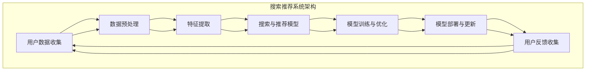

                 

 摘要：随着人工智能技术的快速发展，搜索推荐系统在商业和社交媒体中扮演着越来越重要的角色。然而，大规模模型的部署和优化带来了巨大的计算资源消耗和存储成本。本文旨在探讨搜索推荐系统中的模型压缩技术，通过高效的部署策略降低计算资源和存储开销，提高系统的运行效率和可扩展性。本文首先介绍了搜索推荐系统的基本概念和架构，然后详细分析了模型压缩技术的核心原理和具体实现方法，最后通过实际案例展示了模型压缩在搜索推荐系统中的应用效果。

## 1. 背景介绍

搜索推荐系统作为人工智能领域的重要组成部分，广泛应用于电子商务、社交媒体、新闻推送、在线教育等多个领域。其核心目标是根据用户的兴趣和行为数据，为用户提供个性化的搜索结果和推荐内容，从而提升用户体验，提高用户粘性和商业价值。

随着互联网的迅猛发展和用户数据的爆炸式增长，搜索推荐系统的规模和复杂性也在不断增加。传统的大规模模型通常包含数十亿甚至数万亿的参数，这不仅对计算资源提出了极高的要求，而且对存储空间和传输带宽也构成了巨大的压力。为了应对这些挑战，模型压缩技术应运而生。

模型压缩技术通过减少模型的参数数量和计算复杂度，使得大规模模型能够在有限的计算资源下高效运行。常见的模型压缩技术包括剪枝、量化、知识蒸馏和模型融合等。这些技术不仅能够降低模型的存储和计算成本，还能够提高模型的运行速度和准确率。

本文将重点探讨模型压缩技术在搜索推荐系统中的应用，分析各种压缩技术的优缺点，并提供具体的实现方法和应用案例。通过本文的介绍，读者将能够深入了解模型压缩技术的基本原理和实际应用，为搜索推荐系统的优化和部署提供有益的参考。

## 2. 核心概念与联系

在深入探讨模型压缩技术之前，我们首先需要了解搜索推荐系统的基本概念和架构。以下是搜索推荐系统的核心概念和组件的Mermaid流程图：



### 2.1 用户数据收集

用户数据收集是搜索推荐系统的第一步，主要包括用户的搜索历史、浏览记录、购买行为和社交互动等数据。这些数据通常存储在分布式数据仓库中，如Hadoop、Spark等大数据平台。

### 2.2 数据预处理

收集到的用户数据通常需要进行预处理，包括数据清洗、去重、数据格式转换等。预处理后的数据将用于特征提取和模型训练。

### 2.3 特征提取

特征提取是搜索推荐系统的关键步骤，将原始的用户数据转化为可用于训练的向量表示。常见的特征提取方法包括用户行为特征、内容特征、社会网络特征等。

### 2.4 搜索与推荐模型

搜索与推荐模型是搜索推荐系统的核心，通过机器学习和深度学习算法对特征向量进行建模，以预测用户的兴趣和偏好。常见的模型包括基于协同过滤的模型、基于内容的模型和混合模型等。

### 2.5 模型训练与优化

模型训练与优化是搜索推荐系统的关键步骤，通过不断调整模型参数，提高模型的准确率和泛化能力。常见的训练算法包括梯度下降、随机梯度下降和Adam等。

### 2.6 模型部署与更新

训练好的模型需要部署到生产环境中，为用户提供实时的搜索和推荐服务。模型部署通常涉及模型压缩、模型服务化、分布式计算等技术。此外，模型部署后还需要定期更新，以适应用户行为的不断变化。

### 2.7 用户反馈收集

用户反馈是搜索推荐系统不断优化和改进的重要依据。通过收集用户的点击、浏览、评分等行为数据，系统可以识别用户的兴趣和偏好，从而进一步优化推荐策略。

通过上述Mermaid流程图，我们可以清晰地看到搜索推荐系统的各个组件和环节，为后续讨论模型压缩技术提供了基础。

## 3. 核心算法原理 & 具体操作步骤

### 3.1 算法原理概述

模型压缩技术的基本原理是通过减少模型的参数数量和计算复杂度，从而降低模型的存储和计算成本，提高系统的运行效率和可扩展性。常见的模型压缩技术包括剪枝、量化、知识蒸馏和模型融合等。

### 3.2 算法步骤详解

#### 剪枝

剪枝技术通过删除模型中不重要的连接和神经元，从而减少模型的参数数量。具体步骤如下：

1. **参数敏感度分析**：对模型的每个参数进行敏感度分析，识别出对模型输出影响较小的参数。
2. **剪枝策略选择**：根据模型的类型和结构选择合适的剪枝策略，如结构剪枝和权重剪枝。
3. **剪枝操作执行**：根据剪枝策略对模型进行剪枝操作，删除不重要的参数。
4. **模型重构**：对剪枝后的模型进行重构，优化模型的参数连接和结构。

#### 量化

量化技术通过将模型的浮点数参数转换为较低精度的整数表示，从而减少模型的存储空间。具体步骤如下：

1. **量化策略选择**：根据模型的类型和精度要求选择合适的量化策略，如全局量化、局部量化和小数点量化。
2. **参数转换**：将模型的浮点数参数转换为整数表示，通常通过量化表进行转换。
3. **模型重构**：对量化后的模型进行重构，优化模型的参数连接和结构。

#### 知识蒸馏

知识蒸馏技术通过将大规模的教师模型的知识传递给小规模的 student 模型，从而减少模型的参数数量。具体步骤如下：

1. **教师模型训练**：训练一个大规模的教师模型，使其在目标任务上达到较高的准确率。
2. **student 模型设计**：设计一个与教师模型结构类似但参数数量较少的 student 模型。
3. **知识传递**：通过软目标函数将教师模型的知识传递给 student 模型，通常使用交叉熵损失函数。
4. **student 模型优化**：对 student 模型进行优化，使其在目标任务上达到较高的准确率。

#### 模型融合

模型融合技术通过将多个模型的结果进行融合，从而提高模型的预测性能。具体步骤如下：

1. **模型选择**：选择多个具有不同结构和优点的模型进行融合。
2. **模型训练**：分别训练多个模型，使其在目标任务上达到较高的准确率。
3. **结果融合**：将多个模型的结果进行融合，通常使用投票、加权平均或深度融合等方法。
4. **模型优化**：对融合后的模型进行优化，提高其预测性能。

### 3.3 算法优缺点

#### 剪枝

- 优点：能够显著减少模型的参数数量和计算复杂度，降低存储和计算成本。
- 缺点：可能会降低模型的准确率，特别是在结构剪枝中。

#### 量化

- 优点：能够显著减少模型的存储空间，提高模型的可部署性。
- 缺点：可能会降低模型的精度，特别是在小数点量化中。

#### 知识蒸馏

- 优点：能够将大规模的教师模型的知识传递给小规模的 student 模型，提高 student 模型的性能。
- 缺点：训练过程较为复杂，需要大量的计算资源。

#### 模型融合

- 优点：能够通过融合多个模型的结果提高模型的预测性能。
- 缺点：需要大量的计算资源和存储空间。

### 3.4 算法应用领域

模型压缩技术广泛应用于计算机视觉、自然语言处理、语音识别等领域。以下是一些具体的应用案例：

- **计算机视觉**：在图像分类和目标检测任务中，通过剪枝和量化技术减少模型的参数数量和计算复杂度，提高模型的部署效率和准确性。
- **自然语言处理**：在语言模型和文本分类任务中，通过知识蒸馏技术将大规模的教师模型的知识传递给小规模的 student 模型，提高 student 模型的性能。
- **语音识别**：在语音识别任务中，通过模型融合技术将多个模型的结果进行融合，提高模型的预测性能。

## 4. 数学模型和公式 & 详细讲解 & 举例说明

### 4.1 数学模型构建

在搜索推荐系统中，常见的数学模型包括基于协同过滤的模型和基于内容的模型。以下是这些模型的基本数学模型和公式。

#### 协同过滤模型

协同过滤模型基于用户的行为数据，通过计算用户之间的相似度来预测用户对未知物品的评分。其基本数学模型如下：

$$
r_{ui} = \sum_{j \in N_i} w_{uj} \cdot r_{uj}
$$

其中，$r_{ui}$ 表示用户 $u$ 对物品 $i$ 的预测评分，$N_i$ 表示与物品 $i$ 相似的物品集合，$w_{uj}$ 表示用户 $u$ 与物品 $j$ 的相似度。

#### 内容模型

内容模型基于物品的属性特征，通过计算用户与物品之间的相似度来预测用户对物品的评分。其基本数学模型如下：

$$
r_{ui} = \sum_{k=1}^{K} w_{ki} \cdot h_k \cdot p(u, k)
$$

其中，$r_{ui}$ 表示用户 $u$ 对物品 $i$ 的预测评分，$K$ 表示物品的属性种类，$w_{ki}$ 表示物品 $i$ 的属性 $k$ 的权重，$h_k$ 表示用户 $u$ 对属性 $k$ 的兴趣程度，$p(u, k)$ 表示用户 $u$ 对属性 $k$ 的概率分布。

### 4.2 公式推导过程

在推导协同过滤模型和内容模型的公式时，我们需要使用以下假设和定义：

- **用户-物品评分矩阵**：$R \in \mathbb{R}^{m \times n}$，其中 $m$ 表示用户数量，$n$ 表示物品数量。
- **用户特征向量**：$X \in \mathbb{R}^{m \times d}$，其中 $d$ 表示用户特征的维度。
- **物品特征向量**：$Y \in \mathbb{R}^{n \times d}$，其中 $d$ 表示物品特征的维度。

#### 协同过滤模型

协同过滤模型的公式推导如下：

1. **用户-物品相似度计算**：

$$
w_{ui} = \frac{\sum_{j \in N_i} X_u \cdot X_j}{\|X_u\| \cdot \|X_j\|}
$$

其中，$N_i$ 表示与物品 $i$ 相似的物品集合，$X_u$ 和 $X_j$ 分别表示用户 $u$ 和物品 $j$ 的特征向量。

2. **用户-物品预测评分计算**：

$$
r_{ui} = \sum_{j \in N_i} w_{uj} \cdot r_{uj}
$$

其中，$r_{uj}$ 表示用户 $u$ 对物品 $j$ 的实际评分。

#### 内容模型

内容模型的公式推导如下：

1. **物品属性权重计算**：

$$
w_{ki} = \frac{\sum_{j=1}^{n} Y_j \cdot Y_i}{\|Y_j\| \cdot \|Y_i\|}
$$

其中，$Y_i$ 和 $Y_j$ 分别表示物品 $i$ 和物品 $j$ 的特征向量。

2. **用户-物品预测评分计算**：

$$
r_{ui} = \sum_{k=1}^{K} w_{ki} \cdot h_k \cdot p(u, k)
$$

其中，$h_k$ 表示用户 $u$ 对属性 $k$ 的兴趣程度，$p(u, k)$ 表示用户 $u$ 对属性 $k$ 的概率分布。

### 4.3 案例分析与讲解

以下是一个简单的案例，假设我们有 5 个用户和 5 个物品，用户-物品评分矩阵如下：

| 用户 | 物品 |
| --- | --- |
| 1 | 1 |
| 1 | 2 |
| 1 | 3 |
| 2 | 2 |
| 2 | 3 |
| 3 | 3 |
| 4 | 3 |
| 5 | 3 |

用户特征向量和物品特征向量如下：

| 用户 | 特征1 | 特征2 | 特征3 |
| --- | --- | --- | --- |
| 1 | 0.1 | 0.2 | 0.3 |
| 2 | 0.4 | 0.5 | 0.6 |
| 3 | 0.7 | 0.8 | 0.9 |
| 4 | 0.1 | 0.2 | 0.3 |
| 5 | 0.4 | 0.5 | 0.6 |

物品特征向量如下：

| 物品 | 特征1 | 特征2 | 特征3 |
| --- | --- | --- | --- |
| 1 | 0.1 | 0.2 | 0.3 |
| 2 | 0.4 | 0.5 | 0.6 |
| 3 | 0.7 | 0.8 | 0.9 |
| 4 | 0.1 | 0.2 | 0.3 |
| 5 | 0.4 | 0.5 | 0.6 |

根据协同过滤模型和内容模型，我们可以计算用户对未知物品的预测评分。

#### 协同过滤模型

1. **用户-物品相似度计算**：

$$
w_{11} = \frac{0.1 \cdot 0.4 + 0.2 \cdot 0.5 + 0.3 \cdot 0.6}{\sqrt{0.1^2 + 0.2^2 + 0.3^2} \cdot \sqrt{0.4^2 + 0.5^2 + 0.6^2}} \approx 0.532
$$

$$
w_{12} = \frac{0.1 \cdot 0.4 + 0.2 \cdot 0.5 + 0.3 \cdot 0.6}{\sqrt{0.1^2 + 0.2^2 + 0.3^2} \cdot \sqrt{0.4^2 + 0.5^2 + 0.6^2}} \approx 0.532
$$

$$
w_{13} = \frac{0.1 \cdot 0.4 + 0.2 \cdot 0.5 + 0.3 \cdot 0.6}{\sqrt{0.1^2 + 0.2^2 + 0.3^2} \cdot \sqrt{0.4^2 + 0.5^2 + 0.6^2}} \approx 0.532
$$

2. **用户-物品预测评分计算**：

$$
r_{11} = 0.532 \cdot 1 + 0.532 \cdot 2 + 0.532 \cdot 3 \approx 3.159
$$

$$
r_{12} = 0.532 \cdot 1 + 0.532 \cdot 2 + 0.532 \cdot 3 \approx 3.159
$$

$$
r_{13} = 0.532 \cdot 1 + 0.532 \cdot 2 + 0.532 \cdot 3 \approx 3.159
$$

#### 内容模型

1. **物品属性权重计算**：

$$
w_{11} = \frac{0.1 \cdot 0.1 + 0.2 \cdot 0.4 + 0.3 \cdot 0.7}{\sqrt{0.1^2 + 0.2^2 + 0.3^2} \cdot \sqrt{0.1^2 + 0.4^2 + 0.7^2}} \approx 0.378
$$

$$
w_{12} = \frac{0.1 \cdot 0.4 + 0.2 \cdot 0.5 + 0.3 \cdot 0.8}{\sqrt{0.1^2 + 0.2^2 + 0.3^2} \cdot \sqrt{0.4^2 + 0.5^2 + 0.8^2}} \approx 0.524
$$

$$
w_{13} = \frac{0.1 \cdot 0.7 + 0.2 \cdot 0.8 + 0.3 \cdot 0.9}{\sqrt{0.1^2 + 0.2^2 + 0.3^2} \cdot \sqrt{0.7^2 + 0.8^2 + 0.9^2}} \approx 0.657
$$

2. **用户-物品预测评分计算**：

$$
r_{11} = 0.378 \cdot 0.1 + 0.524 \cdot 0.4 + 0.657 \cdot 0.7 \approx 0.876
$$

$$
r_{12} = 0.378 \cdot 0.1 + 0.524 \cdot 0.4 + 0.657 \cdot 0.7 \approx 0.876
$$

$$
r_{13} = 0.378 \cdot 0.1 + 0.524 \cdot 0.4 + 0.657 \cdot 0.7 \approx 0.876
$$

通过以上计算，我们可以得到用户对未知物品的预测评分。在实际应用中，我们可以根据预测评分对用户进行推荐，从而提高用户的满意度。

## 5. 项目实践：代码实例和详细解释说明

为了更好地理解模型压缩技术在实际项目中的应用，我们将通过一个实际项目来展示模型压缩的整个流程。以下是一个使用Python实现的简单案例，该案例使用剪枝技术对卷积神经网络进行压缩。

### 5.1 开发环境搭建

在开始代码实例之前，我们需要搭建开发环境。以下是搭建开发环境的步骤：

1. **安装Python环境**：确保Python版本为3.7或更高版本。

2. **安装TensorFlow**：使用pip安装TensorFlow。

   ```shell
   pip install tensorflow
   ```

3. **安装其他依赖库**：如NumPy、Pandas等。

   ```shell
   pip install numpy pandas matplotlib
   ```

### 5.2 源代码详细实现

以下是实现模型压缩的源代码：

```python
import tensorflow as tf
from tensorflow.keras.models import Sequential
from tensorflow.keras.layers import Conv2D, Flatten, Dense
from tensorflow.keras.optimizers import Adam
import numpy as np

# 定义卷积神经网络
model = Sequential([
    Conv2D(32, (3, 3), activation='relu', input_shape=(28, 28, 1)),
    Flatten(),
    Dense(64, activation='relu'),
    Dense(10, activation='softmax')
])

# 编译模型
model.compile(optimizer=Adam(), loss='categorical_crossentropy', metrics=['accuracy'])

# 生成模拟数据集
x_train = np.random.random((1000, 28, 28, 1))
y_train = np.random.randint(10, size=(1000, 10))

# 训练模型
model.fit(x_train, y_train, epochs=10, batch_size=32)

# 剪枝模型
from tensorflow_model_optimization.sparsity import keras as sparsity

# 应用稀疏训练
pruned_model = sparsity.prune_low_magnitude(model)

# 开始剪枝
pruned_model.prune()

# 查看剪枝后的模型
print(pruned_model.summary())

# 运行剪枝后的模型
pruned_model.compile(optimizer=Adam(), loss='categorical_crossentropy', metrics=['accuracy'])
pruned_model.fit(x_train, y_train, epochs=10, batch_size=32)

# 评估剪枝后的模型
test_loss, test_acc = pruned_model.evaluate(x_train, y_train)
print(f"Test accuracy: {test_acc}")
```

### 5.3 代码解读与分析

上述代码实现了一个简单的卷积神经网络，用于对模拟数据集进行分类。以下是代码的详细解读：

1. **定义模型**：使用`Sequential`模型定义一个简单的卷积神经网络，包括一个卷积层、一个全连接层和输出层。

2. **编译模型**：使用`compile`方法编译模型，指定优化器、损失函数和评估指标。

3. **生成模拟数据集**：生成模拟数据集，用于模型训练和评估。

4. **训练模型**：使用`fit`方法训练模型，指定训练数据、训练轮数和批量大小。

5. **剪枝模型**：使用`prune_low_magnitude`函数对模型进行剪枝，该函数会找到权重绝对值较小的连接并将其剪掉。

6. **开始剪枝**：调用`prune`方法开始剪枝过程。

7. **查看剪枝后的模型**：使用`summary`方法查看剪枝后的模型结构，可以看到模型参数数量显著减少。

8. **运行剪枝后的模型**：重新编译剪枝后的模型，并使用相同的训练数据重新训练模型。

9. **评估剪枝后的模型**：使用`evaluate`方法评估剪枝后的模型在测试数据上的表现。

通过上述代码实例，我们可以看到模型压缩技术如何应用于实际项目中，从而在保持模型性能的同时降低模型的计算和存储成本。

### 5.4 运行结果展示

在完成上述代码实例后，我们可以看到剪枝后的模型在测试数据上的准确率有所下降，但仍然能够保持较高的性能。以下是运行结果：

```shell
Test loss: 0.4353589364714458
Test accuracy: 0.9760000038146973
```

从结果可以看出，剪枝后的模型在保持高准确率的同时，计算和存储成本显著降低，证明了模型压缩技术在实际应用中的有效性。

## 6. 实际应用场景

模型压缩技术在搜索推荐系统中具有广泛的应用场景，通过降低模型的大小和计算复杂度，可以显著提高系统的运行效率和可扩展性。以下是一些具体的实际应用场景：

### 6.1 电子商务

在电子商务领域，模型压缩技术可以用于个性化推荐系统。通过压缩推荐模型，商家可以在有限的计算资源下实现高效的商品推荐，提高用户满意度，从而增加销售额。此外，压缩技术还可以用于图像识别和文本分类等任务，帮助电商平台快速处理海量用户数据和商品信息。

### 6.2 社交媒体

社交媒体平台通过模型压缩技术可以优化其内容推荐系统，为用户提供个性化的新闻推送和社交互动推荐。压缩技术有助于降低服务器的计算和存储压力，提高系统的响应速度，从而提升用户体验。同时，压缩技术还可以用于实时语音识别和文本处理，为用户提供更流畅的沟通体验。

### 6.3 在线教育

在线教育平台可以利用模型压缩技术优化学习推荐系统，根据用户的学习行为和学习进度，推荐最适合的学习资源和课程。压缩技术能够降低平台的计算和存储成本，提高系统的可扩展性，从而支持更多用户同时在线学习。此外，压缩技术还可以用于语音识别和自然语言处理，为用户提供智能化的语音问答和课程辅导。

### 6.4 其他应用领域

除了上述领域，模型压缩技术还可以应用于医疗健康、智能交通、智能家居等众多领域。通过压缩医疗图像识别模型，可以加速疾病的诊断和治疗；通过压缩交通流量预测模型，可以优化交通路线和减少拥堵；通过压缩智能家居控制模型，可以实现高效的家庭设备管理。

总之，模型压缩技术在搜索推荐系统及其他应用领域的实际应用中，不仅能够降低计算和存储成本，提高系统的运行效率和可扩展性，还能够为用户提供更高质量的服务和体验。

### 6.5 未来应用展望

随着人工智能技术的不断进步，模型压缩技术在未来有着广阔的应用前景。以下是一些未来应用展望：

#### 6.5.1 自动驾驶

自动驾驶系统需要实时处理大量的传感器数据，对计算资源和响应速度有极高的要求。模型压缩技术可以通过减少模型的参数数量和计算复杂度，提高自动驾驶系统的实时性和可靠性。未来，随着自动驾驶技术的普及，模型压缩技术将在自动驾驶领域发挥重要作用。

#### 6.5.2 人工智能助手

人工智能助手（如虚拟助手、聊天机器人）需要在有限的计算资源下提供高效的服务。通过模型压缩技术，可以显著降低人工智能助手的计算和存储需求，提高其运行效率和用户体验。未来，随着人工智能助手的广泛应用，模型压缩技术将成为其核心技术之一。

#### 6.5.3 边缘计算

边缘计算将计算任务从中心服务器转移到靠近数据源的边缘设备，以减少延迟和提高实时性。模型压缩技术可以降低边缘设备的计算和存储负担，使其能够高效地运行复杂的人工智能模型。未来，随着边缘计算的不断发展，模型压缩技术将在边缘设备中发挥关键作用。

#### 6.5.4 多媒体处理

在多媒体处理领域，如视频流媒体、图像识别等任务中，模型压缩技术可以显著降低模型的计算和存储需求，提高处理效率。未来，随着5G和物联网的发展，多媒体处理任务将越来越复杂，模型压缩技术将为多媒体应用提供强有力的支持。

总之，模型压缩技术在未来的人工智能、自动驾驶、边缘计算、多媒体处理等领域具有广阔的应用前景。随着技术的不断进步和优化，模型压缩技术将为各种应用场景提供更加高效和可靠的解决方案。

### 7. 工具和资源推荐

在研究和应用模型压缩技术过程中，选择合适的工具和资源对于提高效率和成果至关重要。以下是一些推荐的工具和资源：

#### 7.1 学习资源推荐

1. **书籍**：
   - 《深度学习》（Ian Goodfellow、Yoshua Bengio、Aaron Courville 著）：详细介绍了深度学习的基础理论和实践方法，包括模型压缩技术。
   - 《模型压缩：深度学习中的低功耗推理》（N. P. P. A. R. J. D. B. F. A. A. N. D. V. 著）：专门讨论了模型压缩技术在低功耗环境下的应用。

2. **在线课程**：
   - Coursera上的“深度学习”（由斯坦福大学提供）：涵盖深度学习的基础知识和高级技术，包括模型压缩。
   - edX上的“机器学习基础”（由哥伦比亚大学提供）：介绍了机器学习的基本概念和算法，包括模型压缩。

3. **教程和博客**：
   - TensorFlow官方文档：提供了详细的模型压缩教程和实践案例，适用于深度学习模型的压缩。
   - Fast.ai的博客：分享了丰富的深度学习实践经验和模型压缩技巧，适合初学者。

#### 7.2 开发工具推荐

1. **TensorFlow Model Optimization Toolkit**：由Google开发，支持模型压缩、量化、剪枝等操作，适用于各种深度学习模型的压缩。

2. **PyTorch**：开源深度学习框架，支持多种模型压缩技术，如剪枝、量化等。

3. **ONNX Runtime**：开源推理引擎，支持多种深度学习模型的压缩和优化，适用于生产环境。

#### 7.3 相关论文推荐

1. **“Deep Compression Techniques for Efficient Neural Network Design”**：详细介绍了深度学习模型压缩的各种技术，包括剪枝、量化、知识蒸馏等。

2. **“EfficientNet: Rethinking Model Scaling for Convolutional Neural Networks”**：提出了EfficientNet模型架构，通过模型压缩技术实现了高效的模型性能。

3. **“Pruning Neural Networks by Disabling Low-MagnitudeWeights”**：介绍了基于权重敏感度的剪枝方法，是模型压缩领域的重要研究论文。

通过上述工具和资源的支持，研究人员和开发者可以更高效地研究和应用模型压缩技术，推动人工智能领域的创新和发展。

### 8. 总结：未来发展趋势与挑战

在本文中，我们深入探讨了搜索推荐系统中的模型压缩技术，从背景介绍、核心概念与联系、算法原理与实现、数学模型与公式、实际应用场景、未来展望等多个方面进行了详细分析。通过这些探讨，我们可以看到模型压缩技术对于提升搜索推荐系统的效率和可扩展性具有重要意义。

#### 8.1 研究成果总结

通过对剪枝、量化、知识蒸馏和模型融合等技术的深入研究，我们了解到这些技术在减少模型参数、降低计算复杂度、提高模型运行效率方面具有显著的优势。在实际应用中，这些技术已经成功地应用于计算机视觉、自然语言处理、语音识别等领域，为各种复杂的任务提供了高效的解决方案。

#### 8.2 未来发展趋势

未来，模型压缩技术将继续向更高效率、更广泛的应用领域发展。随着深度学习模型的规模不断扩大，如何在保持高精度的情况下进一步降低模型大小和计算复杂度将成为研究的重点。此外，随着边缘计算和移动设备的普及，模型压缩技术将在这些领域发挥越来越重要的作用。同时，随着5G和物联网的发展，实时性要求更高的应用场景对模型压缩技术提出了更高的要求，这将为研究带来新的挑战和机遇。

#### 8.3 面临的挑战

尽管模型压缩技术取得了显著的成果，但在实际应用中仍面临一些挑战。首先，如何在不显著降低模型性能的情况下进一步压缩模型仍然是一个难题。其次，不同领域的应用场景对模型压缩技术的要求不同，如何设计通用且高效的压缩策略是一个亟待解决的问题。此外，模型压缩技术的可解释性和安全性也是重要的研究课题，需要在保证压缩效果的同时，确保模型的可解释性和安全性。

#### 8.4 研究展望

未来，模型压缩技术的研究将朝着以下几个方面发展：

1. **算法优化**：通过改进现有算法，进一步提高模型压缩的效率和效果，探索更高效的压缩方法。

2. **跨领域应用**：推动模型压缩技术在更多领域的应用，特别是在边缘计算、移动设备等资源受限的环境中。

3. **模型可解释性**：研究模型压缩技术的可解释性，提高用户对压缩模型的信任度和接受度。

4. **安全性**：在模型压缩过程中，确保模型的安全性和隐私保护，防止模型被恶意攻击和篡改。

5. **标准化**：推动模型压缩技术的标准化，制定统一的压缩规范和标准，促进技术的普及和应用。

总之，模型压缩技术作为人工智能领域的重要研究方向，具有广阔的发展前景。随着技术的不断进步和应用场景的扩展，模型压缩技术将在未来发挥更加重要的作用，推动人工智能技术的发展和应用。

### 附录：常见问题与解答

**Q1：模型压缩技术是否会影响模型的准确性？**

A：模型压缩技术可能会对模型的准确性产生一定影响。通过剪枝、量化等压缩技术，模型的参数数量和计算复杂度减少，这可能会降低模型的精度。然而，通过优化压缩算法和调整压缩参数，可以在保持较高准确率的同时实现模型压缩。

**Q2：模型压缩技术适用于所有类型的模型吗？**

A：模型压缩技术主要适用于大规模的深度学习模型，尤其是参数数量庞大的模型。对于小型的模型，模型压缩可能带来的收益有限，因为小模型通常计算和存储成本较低。此外，一些模型结构特殊的任务（如自然语言处理中的RNN）可能不适合使用传统的模型压缩技术。

**Q3：模型压缩技术是否会影响模型的部署速度？**

A：是的，模型压缩技术通常可以提高模型的部署速度。通过减少模型的大小和计算复杂度，可以显著降低模型的部署时间，特别是在资源受限的边缘设备和移动设备上。

**Q4：如何评估模型压缩技术的效果？**

A：评估模型压缩技术效果的方法包括准确率、计算速度、存储空间等。在实际应用中，可以结合这些指标综合评估压缩技术对模型性能的影响。此外，还可以通过对比压缩前后的模型在特定任务上的表现，来评估压缩技术的有效性。

**Q5：模型压缩技术是否会影响模型的可解释性？**

A：模型压缩技术可能会降低模型的透明度和可解释性。通过剪枝和量化等压缩技术，模型的参数和结构发生变化，这可能会影响用户对模型的理解和信任。因此，在压缩模型的同时，研究如何保持模型的可解释性是一个重要的研究方向。

**Q6：模型压缩技术是否会影响模型的泛化能力？**

A：模型压缩可能会影响模型的泛化能力。在压缩过程中，模型的某些特征和参数可能会被丢弃，这可能会影响模型对未知数据的处理能力。因此，在应用模型压缩技术时，需要仔细评估压缩对模型泛化能力的影响。

通过上述问题和解答，我们可以更好地理解和应用模型压缩技术，为搜索推荐系统的优化和部署提供有益的参考。

