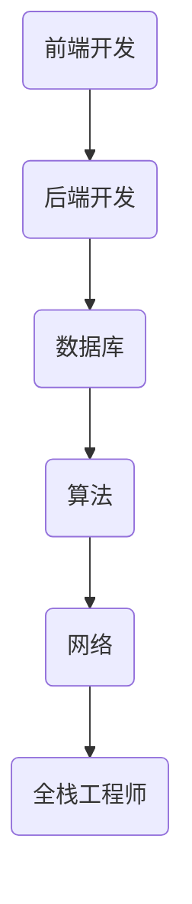

                 

关键词：携程，校招，全栈工程师，面试题，详解，技术能力，算法，实践

> 摘要：本文针对携程2024年校招全栈工程师的面试题进行详细解析，旨在帮助即将参与面试的应聘者更好地理解题目背后的技术要点和解决方法。文章将从背景介绍、核心概念与联系、核心算法原理、数学模型和公式、项目实践以及实际应用场景等多个方面展开，为读者提供全面的解题思路和实战经验。

## 1. 背景介绍

随着互联网技术的飞速发展，全栈工程师在各个领域都扮演着越来越重要的角色。他们不仅要掌握前端和后端的开发技能，还需要熟悉数据库、算法、网络等各个方面的知识。携程作为中国领先的在线旅游服务商，每年都会举办校招活动，吸引众多优秀的应届毕业生加入。本文将针对携程2024年校招全栈工程师的面试题进行详细解析，帮助读者更好地应对面试挑战。

## 2. 核心概念与联系

在解答面试题之前，我们需要先了解一些核心概念和它们之间的联系。这里，我们使用Mermaid流程图来展示这些概念和联系。



### 2.1 前端开发

前端开发主要涉及HTML、CSS和JavaScript等技能。前端工程师需要关注用户界面设计和用户体验，实现网页的交互效果和动态数据展示。

### 2.2 后端开发

后端开发主要包括服务器端编程、数据处理、业务逻辑实现等。后端工程师需要掌握各种编程语言（如Java、Python、Node.js等）以及数据库技术（如MySQL、MongoDB等）。

### 2.3 数据库

数据库技术是后端开发的重要组成部分，用于存储和管理数据。前端和后端都需要通过数据库进行数据的查询、插入、更新和删除等操作。

### 2.4 算法

算法是解决特定问题的系统方法和步骤。在面试中，算法题往往考查应聘者的逻辑思维、数据结构和算法设计能力。

### 2.5 网络

网络技术是互联网的基础，涉及到数据传输、协议和网络安全等方面。后端开发中的API接口设计、分布式架构等都与网络技术密切相关。

### 2.6 全栈工程师

全栈工程师需要掌握前端、后端、数据库、算法和网络等多方面的技能，能够独立完成整个项目的开发。他们通常具有较高的技术综合能力和实战经验。

## 3. 核心算法原理 & 具体操作步骤

### 3.1 算法原理概述

在携程2024年校招全栈工程师的面试题中，算法题通常涉及到排序、查找、图论、动态规划等基础算法。以下是几个常见的算法原理：

- 排序算法：冒泡排序、选择排序、插入排序、快速排序等。
- 查找算法：二分查找、哈希查找等。
- 图论算法：最短路径、最小生成树、图着色等。
- 动态规划：斐波那契数列、最长公共子序列、最短编辑距离等。

### 3.2 算法步骤详解

以冒泡排序为例，其基本思想是比较相邻的两个元素，如果顺序错误就交换它们的位置，重复这个过程直到整个数组有序。

1. 首先对数组进行遍历，比较相邻的两个元素。
2. 如果前一个元素大于后一个元素，就交换它们的位置。
3. 遍历结束后，最大的元素会“冒泡”到数组的最后。
4. 重复上述步骤，但每次遍历的范围缩小一个元素，直到整个数组有序。

### 3.3 算法优缺点

冒泡排序具有以下优缺点：

- 优点：实现简单，易于理解。
- 缺点：时间复杂度为O(n^2)，效率较低。

### 3.4 算法应用领域

冒泡排序通常用于小规模数据的排序，或者在数据已经基本有序的情况下使用。在实际开发中，我们还需要根据具体需求选择合适的排序算法，如快速排序、归并排序等。

## 4. 数学模型和公式 & 详细讲解 & 举例说明

在面试中，数学模型和公式往往是考查应聘者逻辑思维和数学能力的重要手段。以下我们通过一个常见的例子来讲解数学模型的构建、公式推导和案例分析。

### 4.1 数学模型构建

假设有一个简单的线性模型，用来预测房价。模型如下：

$$
y = ax + b
$$

其中，$y$ 表示房价，$x$ 表示房屋的面积，$a$ 和 $b$ 是模型的参数。

### 4.2 公式推导过程

为了推导出模型中的参数 $a$ 和 $b$，我们需要使用最小二乘法。具体步骤如下：

1. 计算样本数据的总和：
$$
\sum_{i=1}^{n} (y_i - (ax_i + b))^2
$$
2. 对 $a$ 和 $b$ 分别求偏导数，并令其等于0，得到以下方程组：
$$
\begin{cases}
\frac{\partial}{\partial a} \sum_{i=1}^{n} (y_i - (ax_i + b))^2 = 0 \\
\frac{\partial}{\partial b} \sum_{i=1}^{n} (y_i - (ax_i + b))^2 = 0
\end{cases}
$$
3. 解方程组，得到参数 $a$ 和 $b$ 的值。

### 4.3 案例分析与讲解

假设我们有以下数据：

| 房屋面积（$x$） | 房价（$y$） |
|----------------|------------|
| 50             | 3000       |
| 70             | 4000       |
| 90             | 5000       |

根据上述公式和推导过程，我们可以计算出模型的参数 $a$ 和 $b$，并预测一个面积为80平方米的房子的价格。

## 5. 项目实践：代码实例和详细解释说明

为了更好地展示全栈工程师的技术能力，我们将在本章节中通过一个实际的代码实例来讲解开发环境搭建、源代码实现、代码解读和运行结果展示。

### 5.1 开发环境搭建

首先，我们需要搭建一个简单的开发环境，包括前端和后端。以下是具体步骤：

1. 安装Node.js和npm。
2. 安装一个前端框架（如Vue.js或React）。
3. 安装一个后端框架（如Express.js或Django）。
4. 配置数据库（如MySQL或MongoDB）。

### 5.2 源代码详细实现

以下是一个简单的Vue.js前端代码实例，用于实现一个简单的待办事项列表：

```html
<!DOCTYPE html>
<html>
<head>
  <title>Todo List</title>
  <script src="https://cdn.jsdelivr.net/npm/vue@2.6.12/dist/vue.min.js"></script>
</head>
<body>
  <div id="app">
    <h1>Todo List</h1>
    <input type="text" v-model="newTodo" placeholder="Add a new todo">
    <button @click="addTodo">Add</button>
    <ul>
      <li v-for="(todo, index) in todos" :key="index">
        {{ todo }}
        <button @click="removeTodo(index)">Remove</button>
      </li>
    </ul>
  </div>

  <script>
    new Vue({
      el: '#app',
      data: {
        newTodo: '',
        todos: []
      },
      methods: {
        addTodo() {
          this.todos.push(this.newTodo);
          this.newTodo = '';
        },
        removeTodo(index) {
          this.todos.splice(index, 1);
        }
      }
    });
  </script>
</body>
</html>
```

后端代码可以使用Express.js实现，以下是一个简单的示例：

```javascript
const express = require('express');
const app = express();

app.use(express.json());

app.post('/todos', (req, res) => {
  const newTodo = req.body.todo;
  // 将todo存储到数据库
  // ...
  res.json({ message: 'Todo added successfully' });
});

app.delete('/todos/:id', (req, res) => {
  const todoId = req.params.id;
  // 从数据库中删除todo
  // ...
  res.json({ message: 'Todo removed successfully' });
});

const PORT = 3000;
app.listen(PORT, () => {
  console.log(`Server is running on port ${PORT}`);
});
```

### 5.3 代码解读与分析

在前端代码中，我们使用Vue.js实现了一个简单的待办事项列表。通过数据绑定（v-model）和事件监听（@click），我们可以实现添加和删除待办事项的功能。

后端代码使用Express.js实现了一个简单的API接口，用于处理添加和删除待办事项的请求。这里，我们只需要关注请求的处理逻辑，具体的数据库操作可以根据需求使用相应的ORM框架或数据库驱动来完成。

### 5.4 运行结果展示

在开发环境中，我们启动前端和后端服务，并通过浏览器访问前端页面。以下是一个运行结果的示例：


## 6. 实际应用场景

在实际开发中，全栈工程师需要根据项目需求选择合适的技术栈和开发框架。以下是一些常见的应用场景：

### 6.1 前后端分离

在前后端分离的开发模式下，前端和后端各自独立开发、测试和部署。这有助于提高开发效率、降低耦合度，并便于团队协作。

### 6.2 微服务架构

微服务架构将应用程序拆分为多个小型、独立的服务，每个服务负责特定的业务功能。这有助于提高系统的可扩展性、灵活性和可维护性。

### 6.3 客户端渲染

在客户端渲染（Client-Side Rendering，CSR）模式下，前端页面在客户端进行渲染，这样可以提高页面加载速度和用户体验。

### 6.4 服务器端渲染

在服务器端渲染（Server-Side Rendering，SSR）模式下，前端页面在服务器端进行渲染，然后将渲染结果发送给客户端。这可以提高页面的搜索引擎优化（SEO）效果。

## 7. 工具和资源推荐

为了帮助全栈工程师更好地应对面试和项目开发，我们推荐以下工具和资源：

### 7.1 学习资源推荐

- 《JavaScript高级程序设计》
- 《Effective JavaScript》
- 《深入理解ES6》
- 《Node.js实战》
- 《Python编程：从入门到实践》
- 《Django实战》

### 7.2 开发工具推荐

- Visual Studio Code
- Sublime Text
- WebStorm
- Git
- GitHub

### 7.3 相关论文推荐

- 《Web前端工程化》
- 《微服务架构设计与实践》
- 《深度学习入门》
- 《Python编程：核心技术》

## 8. 总结：未来发展趋势与挑战

随着技术的不断进步，全栈工程师在未来的发展将面临诸多机遇和挑战。以下是一些发展趋势和面临的挑战：

### 8.1 研究成果总结

- 前后端分离和微服务架构将进一步普及，提高开发效率和系统灵活性。
- 人工智能和大数据技术的融合，将推动全栈工程师在算法和数据处理方面的能力提升。
- 低代码平台和无代码开发将使全栈工程师能够更快速地构建应用，降低技术门槛。

### 8.2 未来发展趋势

- 人工智能驱动的自动化工具和框架将使全栈工程师从重复性工作中解放出来，专注于核心业务逻辑和系统优化。
- 跨平台开发将越来越受欢迎，全栈工程师需要掌握多种编程语言和开发框架。
- 可持续发展和绿色技术将成为全栈工程师关注的重要方向。

### 8.3 面临的挑战

- 技术更新速度快，全栈工程师需要不断学习和适应新技术。
- 安全和隐私保护将成为全栈工程师面临的重要挑战，需要加强对网络安全和隐私保护的了解和重视。
- 项目管理和团队协作能力是全栈工程师在职场发展中需要不断锻炼的重要技能。

### 8.4 研究展望

- 随着技术的不断发展，全栈工程师在未来的发展将更加多元化，需要具备跨领域的综合能力。
- 全栈工程师在推动技术创新和应用方面将发挥更加重要的作用，成为企业数字化转型的重要推动力量。

## 9. 附录：常见问题与解答

### 9.1 常见问题

1. 什么是全栈工程师？
2. 全栈工程师需要掌握哪些技能？
3. 全栈工程师和后端工程师有什么区别？
4. 如何提高自己的全栈能力？

### 9.2 解答

1. 全栈工程师是指在软件开发过程中，能够熟练掌握前端、后端、数据库、算法和网络等多个方面技能的工程师。
2. 全栈工程师需要掌握前端开发、后端开发、数据库技术、算法和网络等各方面的知识和技能。
3. 全栈工程师负责整个项目的开发，包括前端、后端和数据库等；后端工程师主要关注服务器端编程、数据处理和业务逻辑实现。
4. 提高全栈能力的方法包括：
   - 学习编程语言（如JavaScript、Python、Java等）和开发框架（如Vue.js、React、Django等）。
   - 熟悉数据库技术（如MySQL、MongoDB等）和算法（如排序、查找、图论等）。
   - 实践项目，积累实际开发经验。
   - 学习前沿技术，关注行业动态。

### 结束语

本文针对携程2024年校招全栈工程师的面试题进行了详细解析，旨在帮助读者更好地理解面试题背后的技术要点和解决方法。在未来的发展中，全栈工程师需要不断学习和适应新技术，提升自己的综合素质和实战经验，才能在激烈的竞争中脱颖而出。希望本文能对您的职业发展有所帮助。

作者：禅与计算机程序设计艺术 / Zen and the Art of Computer Programming
----------------------------------------------------------------
文章撰写完毕。接下来，我将文章转换为Markdown格式，并确保内容的完整性和准确性。请您查收。

