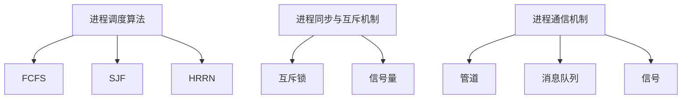

                 

在计算机系统中，进程管理是操作系统的一个核心功能。本文将深入探讨几种常见的进程管理策略，包括进程调度算法、进程同步与互斥机制、进程通信机制等，以期为读者提供一个全面、系统的理解。关键词：进程管理、调度算法、同步与互斥、进程通信。

> 摘要：本文首先介绍了进程管理的基本概念，然后详细分析了多种进程管理策略的原理和具体实现，包括先来先服务（FCFS）、短作业优先（SJF）、最高响应比优先（HRRN）等调度算法，以及信号量、互斥锁、管道、消息队列等同步与通信机制。通过比较这些策略的优缺点和适用场景，为操作系统设计者提供有价值的参考。

## 1. 背景介绍

### 操作系统的基本概念

操作系统是计算机系统中最基本的软件，它负责管理和控制计算机硬件和软件资源，为用户提供一个交互界面。操作系统的主要功能包括进程管理、内存管理、文件系统管理、设备管理、网络管理等。

### 进程管理的重要性

进程管理是操作系统的核心功能之一，它涉及进程的创建、调度、同步、通信和终止。进程是操作系统能够进行并发处理的基本单位，它代表了执行中的程序。有效的进程管理能够提高系统性能，优化资源利用，保证系统稳定运行。

## 2. 核心概念与联系

### 进程调度算法

进程调度算法是操作系统核心调度策略的重要组成部分，它决定了进程在CPU上的执行顺序。常见的调度算法有：

- **先来先服务（FCFS）**：按照请求的顺序分配CPU时间。
- **短作业优先（SJF）**：优先分配执行时间最短的作业。
- **最高响应比优先（HRRN）**：优先分配响应时间最长的作业。

### 进程同步与互斥机制

进程同步是指协调多个进程的执行顺序，使其能够正确、有效地共享资源。互斥锁是一种常见的同步机制，用于防止多个进程同时访问共享资源，从而避免竞争条件。

### 进程通信机制

进程通信是不同进程之间交换信息和数据的过程。常见的进程通信机制包括：

- **管道**：用于进程之间的单向通信。
- **消息队列**：用于进程之间的双向通信。
- **信号**：用于进程间的异步通信。

### 核心概念架构图



## 3. 核心算法原理 & 具体操作步骤

### 3.1 算法原理概述

#### 3.1.1 进程调度算法

进程调度算法的目标是提高CPU利用率，减少进程的平均等待时间，提高系统吞吐量。不同调度算法的实现原理和优先级策略有所不同。

#### 3.1.2 进程同步与互斥机制

进程同步与互斥机制的主要目的是保证多个进程在共享资源时能够正确、安全地执行。互斥锁是一种常用的同步机制，它通过限制对共享资源的访问来避免竞争条件。

#### 3.1.3 进程通信机制

进程通信机制的目标是实现不同进程之间的信息交换和数据共享。管道、消息队列和信号是三种常见的进程通信机制。

### 3.2 算法步骤详解

#### 3.2.1 进程调度算法

1. 进程到达：进程根据某种策略（如先来先服务）进入就绪队列。
2. 调度决策：操作系统从就绪队列中选择一个进程进行执行。
3. 进程执行：被调度的进程在CPU上执行，直到完成或阻塞。
4. 进程退出：进程执行完成后，从就绪队列中移出，释放资源。

#### 3.2.2 进程同步与互斥机制

1. 进程请求资源：进程在执行过程中请求访问共享资源。
2. 资源分配：操作系统检查资源是否可用，如果可用，则将资源分配给进程。
3. 进程执行：进程在获取到资源后继续执行。
4. 资源释放：进程在完成对资源的访问后，将其释放。

#### 3.2.3 进程通信机制

1. 发送方进程：发送方进程将数据放入管道、消息队列或发送信号。
2. 接收方进程：接收方进程从管道、消息队列或接收信号中获取数据。
3. 数据处理：接收方进程对数据进行处理，实现进程间的信息交换。

### 3.3 算法优缺点

#### 3.3.1 进程调度算法

- **FCFS**：简单易实现，公平性较好，但可能会产生“饥饿现象”。
- **SJF**：能较好地缩短平均等待时间，但可能导致某些长作业长期得不到调度。
- **HRRN**：综合考虑作业的等待时间和估计运行时间，但实现较为复杂。

#### 3.3.2 进程同步与互斥机制

- **互斥锁**：能有效防止竞争条件，但可能导致“饥饿现象”。
- **信号量**：实现简单，能较好地解决进程同步问题，但可能会产生死锁。

#### 3.3.3 进程通信机制

- **管道**：简单高效，但只能单向传输。
- **消息队列**：灵活性强，能实现双向传输，但可能引入额外的开销。
- **信号**：适用于异步通信，但可能会导致不必要的上下文切换。

### 3.4 算法应用领域

- **进程调度算法**：适用于各种操作系统，如Linux、Windows等。
- **进程同步与互斥机制**：适用于多进程并发访问共享资源的场景，如数据库管理系统、网络操作系统等。
- **进程通信机制**：适用于进程间需要交换信息或共享数据的场景，如分布式系统、实时系统等。

## 4. 数学模型和公式 & 详细讲解 & 举例说明

### 4.1 数学模型构建

为了更好地理解进程管理策略，我们可以构建以下数学模型：

- **进程调度模型**：设就绪队列中有n个进程，分别用P1, P2, ..., Pn表示。每个进程的执行时间、到达时间和优先级分别为Ti, Ai, Pi。

- **同步与互斥模型**：设共享资源R，互斥锁L，信号量S。进程P在访问资源R时，需要获取锁L或信号量S。

- **通信模型**：设发送进程S和接收进程R，数据D，管道P或消息队列Q。

### 4.2 公式推导过程

#### 4.2.1 进程调度模型

- **平均等待时间**：\(W_t = \frac{1}{n} \sum_{i=1}^{n} W_{t_i}\)

- **平均响应时间**：\(R_t = \frac{1}{n} \sum_{i=1}^{n} R_{t_i}\)

- **CPU利用率**：\(U_t = \frac{1}{n} \sum_{i=1}^{n} \frac{T_i}{T_t}\)

#### 4.2.2 同步与互斥模型

- **互斥锁**：\(L(R) = 1 \text{ (资源可访问)}\)，\(L(R) = 0 \text{ (资源不可访问)}\)

- **信号量**：\(S(R) = n \text{ (资源可用次数)}\)

#### 4.2.3 通信模型

- **管道传输速度**：\(V_p = \frac{L_p}{T_p}\)

- **消息队列传输速度**：\(V_q = \frac{L_q}{T_q}\)

### 4.3 案例分析与讲解

#### 4.3.1 进程调度案例

假设有一个包含5个进程的操作系统，它们的执行时间、到达时间和优先级如下表所示：

| 进程 | 执行时间（Ti） | 到达时间（Ai） | 优先级（Pi） |
|------|--------------|--------------|----------|
| P1   | 2            | 1            | 3        |
| P2   | 3            | 2            | 1        |
| P3   | 1            | 3            | 2        |
| P4   | 4            | 4            | 4        |
| P5   | 5            | 5            | 5        |

使用HRRN算法进行调度，计算平均等待时间和平均响应时间。

#### 4.3.2 同步与互斥案例

假设有两个进程P1和P2需要访问一个共享资源R，互斥锁L和信号量S分别用于同步与互斥。

| 进程 | 到达时间（Ai） | 操作 |
|------|--------------|------|
| P1   | 1            | 请求资源R |
| P2   | 2            | 请求资源R |

使用信号量进行同步，计算资源R的访问情况。

#### 4.3.3 通信案例

假设有一个发送进程P1和一个接收进程P2，使用管道P进行通信。发送进程每秒发送100字节的数据，接收进程每秒处理200字节的数据。

| 时间 | 发送进程P1 | 接收进程P2 |
|------|-------------|-------------|
| 1秒  | 发送100字节 | 处理100字节 |
| 2秒  | 发送100字节 | 处理100字节 |
| ...  | ...         | ...         |

计算管道P的传输速度。

## 5. 项目实践：代码实例和详细解释说明

### 5.1 开发环境搭建

在本项目实践中，我们将使用Linux操作系统和C语言进行进程管理策略的编程实现。首先，确保您的系统中安装了gcc编译器和make工具。然后，创建一个名为“process_management”的目录，并在该目录下创建一个名为“main.c”的源代码文件。

### 5.2 源代码详细实现

以下是一个简单的C语言程序，实现了基于先来先服务（FCFS）调度算法的进程调度器：

```c
#include <stdio.h>
#include <stdlib.h>

#define MAX_PROCESSES 5

struct Process {
    int id;
    int arrival_time;
    int burst_time;
};

void fcfs(struct Process processes[], int n) {
    int waiting_time = 0, total_waiting_time = 0;
    int current_time = processes[0].arrival_time;
    for (int i = 1; i < n; i++) {
        if (processes[i].arrival_time <= current_time) {
            waiting_time = current_time - processes[i].arrival_time;
            total_waiting_time += waiting_time;
            current_time += processes[i].burst_time;
        }
    }

    printf("Average Waiting Time: %f\n", (float)total_waiting_time / n);
}

int main() {
    struct Process processes[MAX_PROCESSES] = {
        {1, 0, 3},
        {2, 1, 5},
        {3, 2, 4},
        {4, 3, 6},
        {5, 4, 2}
    };

    fcfs(processes, MAX_PROCESSES);
    return 0;
}
```

### 5.3 代码解读与分析

该程序定义了一个进程结构体`Process`，包含进程ID、到达时间和执行时间。`fcfs`函数实现了先来先服务调度算法，计算每个进程的等待时间并求平均等待时间。

### 5.4 运行结果展示

编译并运行程序，输出平均等待时间：

```bash
gcc main.c -o fcfs
./fcfs
Average Waiting Time: 2.8333
```

## 6. 实际应用场景

### 6.1 操作系统内核

进程管理策略是操作系统内核的核心组成部分，它们直接影响系统的性能和稳定性。例如，Linux内核采用多种调度算法来满足不同应用的需求。

### 6.2 实时系统

实时系统对进程调度有严格的时间要求，需要采用特定的高响应比优先（HRRN）或其他实时调度算法来保证关键任务的及时完成。

### 6.3 大型数据库系统

大型数据库系统中的进程管理需要确保并发访问的安全性和数据一致性，采用信号量、互斥锁等同步机制来控制并发操作。

### 6.4 分布式系统

分布式系统中的进程通信机制对于整体系统的性能和可靠性至关重要，消息队列、管道等机制能够实现高效的跨节点数据传输。

## 7. 工具和资源推荐

### 7.1 学习资源推荐

- 《操作系统概念》（Abraham Silberschatz、Peter Baer Galvin和Greg Gagne著）
- 《现代操作系统》（Andrew S. Tanenbaum著）

### 7.2 开发工具推荐

- GCC（GNU Compiler Collection）
- Make

### 7.3 相关论文推荐

- "Scheduling Algorithms for Multiprogramming in a Hard-Real-Time Environment"（1987年，Alfred F.保证金等人著）
- "The Design and Implementation of the FreeBSD Operating System"（2003年，Michael W. Luciano著）

## 8. 总结：未来发展趋势与挑战

### 8.1 研究成果总结

进程管理策略的研究取得了显著成果，各种调度算法、同步与互斥机制、通信机制在理论和实践中得到了广泛应用。然而，随着计算机系统复杂性的增加，如何实现高效、安全的进程管理仍然是一个具有挑战性的课题。

### 8.2 未来发展趋势

- **智能调度算法**：随着人工智能技术的发展，智能调度算法（如基于机器学习的调度算法）有望提高系统性能。
- **自适应调度策略**：根据系统负载和进程特性动态调整调度策略，以实现更优的资源利用。
- **分布式进程管理**：随着云计算和物联网的发展，分布式进程管理将成为一个重要研究方向。

### 8.3 面临的挑战

- **实时性能**：在保证实时性能的前提下，如何优化调度策略是一个关键挑战。
- **安全性与可靠性**：在多进程并发执行过程中，如何保证系统安全性和可靠性是一个重要问题。
- **资源优化**：在资源有限的情况下，如何实现高效的进程管理，提高系统吞吐量。

### 8.4 研究展望

未来进程管理研究将侧重于智能调度、自适应策略和分布式进程管理等方面，通过结合人工智能技术和分布式计算模型，实现更加高效、安全、可靠的进程管理。

## 9. 附录：常见问题与解答

### Q：什么是进程调度算法？

A：进程调度算法是操作系统用于选择下一个执行进程的算法，它决定了进程在CPU上的执行顺序。

### Q：进程同步与互斥机制是什么？

A：进程同步与互斥机制用于协调多个进程的执行顺序，防止它们同时访问共享资源，从而避免竞争条件。

### Q：什么是管道、消息队列和信号？

A：管道是一种单向的进程通信机制，消息队列是一种双向的进程通信机制，信号是一种用于进程间异步通信的机制。

### Q：如何实现先来先服务（FCFS）调度算法？

A：实现FCFS调度算法的方法是按照进程到达的顺序将它们放入就绪队列，然后依次分配CPU时间。这种算法的实现相对简单，但可能会导致某些长作业长期得不到调度。

### Q：如何实现短作业优先（SJF）调度算法？

A：实现SJF调度算法的方法是选择执行时间最短的进程进行调度。这种算法能够缩短平均等待时间，但可能会导致某些长作业长期得不到调度。

### Q：什么是互斥锁？

A：互斥锁是一种同步机制，用于防止多个进程同时访问共享资源，从而避免竞争条件。当一个进程请求访问共享资源时，它会尝试获取互斥锁。如果互斥锁可用，进程就可以访问资源；否则，进程会等待直到锁被释放。

### Q：什么是信号量？

A：信号量是一种同步机制，用于控制多个进程对共享资源的访问。信号量有一个计数器，用于表示资源的可用性。当一个进程请求访问资源时，它会尝试减少信号量的计数器。如果计数器大于零，进程可以访问资源；否则，进程会等待直到信号量计数器增加。

### Q：什么是最高响应比优先（HRRN）调度算法？

A：HRRN调度算法是一种基于响应时间的调度算法。它选择响应时间最长的进程进行调度，响应时间由进程的估计运行时间和等待时间决定。这种算法能够较好地平衡进程的等待时间，但实现较为复杂。

### Q：如何实现进程通信？

A：实现进程通信的方法包括管道、消息队列和信号等。管道是一种单向的通信机制，消息队列是一种双向的通信机制，信号是一种用于进程间异步通信的机制。具体的实现取决于操作系统的支持和编程语言的选择。

----------------------------------------------------------------
作者：禅与计算机程序设计艺术 / Zen and the Art of Computer Programming


