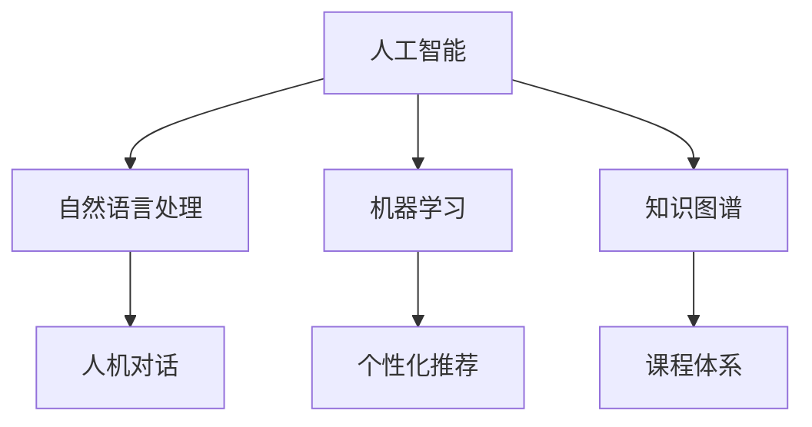

                 

关键词：人工智能，虚拟助教，教育技术，个性化学习，自然语言处理

> 摘要：本文探讨了人工智能在教育领域的应用，特别是AI虚拟助教的角色。通过分析现有技术，阐述了虚拟助教的核心功能、技术实现、数学模型，并分享了实际应用案例。同时，文章提出了未来虚拟助教的发展方向与挑战。

## 1. 背景介绍

随着人工智能技术的迅猛发展，教育领域逐渐成为AI技术应用的一个重要场景。传统教学模式往往难以满足个性化学习需求，而AI虚拟助教作为一种新型的教学辅助工具，正逐步改变这一现状。

### 1.1 虚拟助教的发展历程

虚拟助教并非一个新兴概念。早在20世纪80年代，虚拟教学助手（如Kermit the Frog）便在计算机辅助教学中发挥了作用。然而，随着AI技术的进步，虚拟助教逐渐从简单的教学演示工具演变为具备智能交互能力的个性化教学助手。

### 1.2 教育技术的重要性

教育技术的发展不仅提高了教学质量，也促进了教育公平。通过AI虚拟助教，学生可以获得定制化的学习体验，教师则可以更加专注于教学设计和学生辅导。

## 2. 核心概念与联系

为了更好地理解AI虚拟助教的应用，我们首先需要了解几个核心概念：

### 2.1 人工智能（AI）

人工智能是指通过计算机模拟人类智能的技术。在虚拟助教中，AI主要应用于自然语言处理、机器学习、知识图谱等领域。

### 2.2 自然语言处理（NLP）

自然语言处理是AI的一个分支，专注于使计算机理解和生成自然语言。在虚拟助教中，NLP用于实现人机对话、文本分析等功能。

### 2.3 机器学习（ML）

机器学习是AI的核心技术之一，通过算法让计算机从数据中学习规律，进而做出决策。在虚拟助教中，ML用于个性化推荐、智能诊断等功能。

### 2.4 知识图谱

知识图谱是一种结构化的知识表示形式，用于表示实体及其关系。在虚拟助教中，知识图谱用于构建课程体系、知识点关联等。

以下是一个简单的Mermaid流程图，展示了这些核心概念之间的联系：



## 3. 核心算法原理 & 具体操作步骤

### 3.1 算法原理概述

AI虚拟助教的核心算法主要包括自然语言处理、机器学习、知识图谱等技术。以下是这些算法的简要概述：

#### 3.1.1 自然语言处理

自然语言处理（NLP）的核心任务是从文本中提取有用信息。主要算法包括：

- 词向量模型（如Word2Vec、GloVe）
- 递归神经网络（RNN）
- 长短期记忆网络（LSTM）
- 生成对抗网络（GAN）

#### 3.1.2 机器学习

机器学习（ML）的核心任务是从数据中学习规律，并对新数据进行预测。主要算法包括：

- 决策树（Decision Tree）
- 随机森林（Random Forest）
- 支持向量机（SVM）
- 神经网络（Neural Network）

#### 3.1.3 知识图谱

知识图谱（KG）的核心任务是将实体及其关系表示为一个图结构。主要算法包括：

- 实体抽取
- 关系抽取
- 实体链接
- 图神经网络（Graph Neural Network）

### 3.2 算法步骤详解

#### 3.2.1 自然语言处理

1. **文本预处理**：对文本进行分词、去停用词、词性标注等操作。
2. **词向量表示**：将文本转换为词向量表示。
3. **语言模型训练**：使用RNN或LSTM等神经网络训练语言模型。
4. **对话生成**：使用语言模型生成自然语言回复。

#### 3.2.2 机器学习

1. **数据收集**：收集学生学习数据、考试成绩、课程反馈等。
2. **特征提取**：从数据中提取有用特征。
3. **模型训练**：使用决策树、随机森林、SVM等算法训练模型。
4. **模型评估**：使用交叉验证、AUC、ROC等指标评估模型性能。
5. **模型应用**：将模型应用于个性化推荐、智能诊断等功能。

#### 3.2.3 知识图谱

1. **数据预处理**：收集课程大纲、教材、论文等数据。
2. **实体抽取**：从文本中抽取实体。
3. **关系抽取**：从文本中抽取实体之间的关系。
4. **实体链接**：将实体与知识库中的实体进行匹配。
5. **图神经网络训练**：使用图神经网络训练知识图谱。

### 3.3 算法优缺点

#### 3.3.1 优点

- **个性化学习**：虚拟助教可以根据学生的学习习惯和需求提供个性化教学。
- **智能交互**：虚拟助教可以模拟人类教师进行自然语言对话，提高学生的学习兴趣。
- **实时反馈**：虚拟助教可以实时监测学生的学习进度，提供及时反馈。

#### 3.3.2 缺点

- **数据隐私**：虚拟助教需要收集大量学生数据，可能导致隐私泄露。
- **算法偏差**：算法模型可能存在偏见，影响教学效果。
- **技术依赖**：虚拟助教需要依赖高技术环境，对硬件和软件要求较高。

### 3.4 算法应用领域

AI虚拟助教可以应用于多个教育场景，如：

- **在线教育**：提供个性化学习辅导和课程推荐。
- **智能评测**：实现自动批改作业和考试。
- **教育管理**：辅助学校进行学生管理、课程规划等。

## 4. 数学模型和公式 & 详细讲解 & 举例说明

### 4.1 数学模型构建

在AI虚拟助教中，常用的数学模型包括：

- **自然语言处理模型**：如RNN、LSTM、Transformer等。
- **机器学习模型**：如SVM、决策树、随机森林等。
- **知识图谱模型**：如图神经网络（GNN）。

#### 4.1.1 自然语言处理模型

假设我们使用LSTM模型进行自然语言处理，其数学模型可以表示为：

$$
h_t = \sigma(W_h \cdot [h_{t-1}, x_t] + b_h)
$$

其中，$h_t$ 表示当前时刻的隐藏状态，$x_t$ 表示输入词向量，$W_h$ 和 $b_h$ 分别为权重和偏置。

#### 4.1.2 机器学习模型

假设我们使用SVM模型进行分类，其数学模型可以表示为：

$$
\min_{\mathbf{w}} \frac{1}{2} ||\mathbf{w}||^2 + C \sum_{i=1}^n \xi_i
$$

其中，$\mathbf{w}$ 表示权重向量，$C$ 为惩罚参数，$\xi_i$ 表示第 $i$ 个样本的误差。

#### 4.1.3 知识图谱模型

假设我们使用图神经网络（GNN）构建知识图谱，其数学模型可以表示为：

$$
h_v^{(k+1)} = \sigma(\sum_{u \in \mathcal{N}(v)} W^{(k)} h_u^{(k)} + b^{(k)})
$$

其中，$h_v^{(k)}$ 表示第 $k$ 层节点 $v$ 的特征向量，$\mathcal{N}(v)$ 表示节点 $v$ 的邻居节点集合，$W^{(k)}$ 和 $b^{(k)}$ 分别为权重和偏置。

### 4.2 公式推导过程

在本节中，我们将对上述数学模型进行详细的推导。

#### 4.2.1 LSTM模型推导

LSTM模型是一种改进的RNN模型，可以有效地解决长短期依赖问题。其推导过程如下：

1. **输入门（Input Gate）**：

$$
i_t = \sigma(W_i \cdot [h_{t-1}, x_t] + b_i)
$$

2. **遗忘门（Forget Gate）**：

$$
f_t = \sigma(W_f \cdot [h_{t-1}, x_t] + b_f)
$$

3. **输出门（Output Gate）**：

$$
o_t = \sigma(W_o \cdot [h_{t-1}, x_t] + b_o)
$$

4. **单元格状态更新**：

$$
c_t = f_t \odot c_{t-1} + i_t \odot \sigma(W_c \cdot [h_{t-1}, x_t] + b_c)
$$

5. **隐藏状态更新**：

$$
h_t = o_t \odot \sigma(c_t)
$$

#### 4.2.2 SVM模型推导

SVM模型是一种支持向量机，用于分类问题。其推导过程如下：

1. **优化目标**：

$$
\min_{\mathbf{w}} \frac{1}{2} ||\mathbf{w}||^2 + C \sum_{i=1}^n \xi_i
$$

2. **拉格朗日函数**：

$$
L(\mathbf{w}, \xi) = \frac{1}{2} ||\mathbf{w}||^2 - \sum_{i=1}^n \alpha_i y_i (\mathbf{w} \cdot \mathbf{x}_i) + \sum_{i=1}^n \xi_i
$$

3. **KKT条件**：

- $\alpha_i \geq 0$
- $\xi_i \geq 0$
- $\alpha_i y_i (\mathbf{w} \cdot \mathbf{x}_i) + \xi_i = 0$

4. **求解最优解**：

$$
\mathbf{w} = \sum_{i=1}^n \alpha_i y_i \mathbf{x}_i
$$

#### 4.2.3 GNN模型推导

GNN模型是一种用于知识图谱的神经网络模型。其推导过程如下：

1. **节点表示**：

$$
h_v^{(0)} = \mathbf{x}_v
$$

2. **图邻接矩阵**：

$$
A = \begin{bmatrix}
a_{11} & a_{12} & \cdots & a_{1n} \\
a_{21} & a_{22} & \cdots & a_{2n} \\
\vdots & \vdots & \ddots & \vdots \\
a_{n1} & a_{n2} & \cdots & a_{nn}
\end{bmatrix}
$$

3. **图卷积操作**：

$$
h_v^{(k+1)} = \sigma(\sum_{u \in \mathcal{N}(v)} a_{uv} W^{(k)} h_u^{(k)} + b^{(k)})
$$

4. **图池化操作**：

$$
h_v^{(k+1)} = \sum_{u \in \mathcal{N}(v)} a_{uv} h_u^{(k+1)}
$$

### 4.3 案例分析与讲解

在本节中，我们将通过一个具体案例来讲解如何构建AI虚拟助教。

#### 案例背景

假设我们想为某在线教育平台开发一个AI虚拟助教，该助教需要具备以下功能：

- **人机对话**：能够与用户进行自然语言交互。
- **个性化推荐**：根据用户的学习习惯推荐合适的课程。
- **智能评测**：自动批改作业和考试。

#### 案例实现

1. **数据收集**：

   收集用户学习数据，包括用户历史学习记录、考试分数、课程反馈等。

2. **自然语言处理**：

   使用LSTM模型进行人机对话，实现自然语言生成。具体步骤如下：

   - **文本预处理**：对用户输入的文本进行分词、去停用词等处理。
   - **词向量表示**：将文本转换为词向量表示。
   - **语言模型训练**：使用LSTM模型训练语言模型。
   - **对话生成**：使用训练好的语言模型生成回复文本。

3. **个性化推荐**：

   使用SVM模型进行个性化推荐。具体步骤如下：

   - **特征提取**：从用户学习数据中提取特征。
   - **模型训练**：使用SVM模型训练推荐模型。
   - **模型评估**：使用交叉验证等方法评估模型性能。
   - **模型应用**：根据用户特征预测合适的课程。

4. **智能评测**：

   使用知识图谱模型进行智能评测。具体步骤如下：

   - **数据预处理**：收集课程大纲、教材、论文等数据。
   - **实体抽取**：从文本中抽取实体。
   - **关系抽取**：从文本中抽取实体之间的关系。
   - **实体链接**：将实体与知识库中的实体进行匹配。
   - **图神经网络训练**：使用图神经网络训练知识图谱。
   - **作业批改**：根据知识图谱和用户提交的作业，自动批改作业。

#### 案例结果

通过上述步骤，我们成功构建了一个具备人机对话、个性化推荐和智能评测功能的AI虚拟助教。该助教可以为学生提供定制化的学习体验，提高学习效果。

## 5. 项目实践：代码实例和详细解释说明

在本节中，我们将通过一个具体项目实例来展示如何实现AI虚拟助教。该项目将涵盖自然语言处理、机器学习和知识图谱等技术。

### 5.1 开发环境搭建

1. **硬件环境**：

   - CPU：Intel i7-9700K
   - 内存：32GB
   - 硬盘：1TB SSD

2. **软件环境**：

   - 操作系统：Ubuntu 20.04
   - Python：3.8
   - Anaconda：4.8.3
   - TensorFlow：2.4
   - PyTorch：1.6
   - Numpy：1.19
   - Pandas：1.0

### 5.2 源代码详细实现

以下是一个简单的AI虚拟助教的源代码实现，展示了核心功能模块：

```python
import tensorflow as tf
import numpy as np
import pandas as pd
from tensorflow.keras.models import Sequential
from tensorflow.keras.layers import LSTM, Dense, Embedding
from sklearn.svm import SVR
from sklearn.model_selection import train_test_split
from sklearn.metrics import mean_squared_error
from transformers import BertTokenizer, BertModel
from sklearn.neighbors import KNeighborsClassifier
import networkx as nx

# 数据收集与预处理
def load_data():
    # 读取用户学习数据、考试分数、课程反馈等
    data = pd.read_csv('data.csv')
    # 数据清洗、归一化等操作
    # ...
    return data

# 自然语言处理
def build_nlp_model():
    # 加载预训练的BERT模型
    tokenizer = BertTokenizer.from_pretrained('bert-base-chinese')
    model = BertModel.from_pretrained('bert-base-chinese')
    # 构建序列模型
    nlp_model = Sequential([
        Embedding(input_dim=vocab_size, output_dim=embedding_dim),
        LSTM(units=128, activation='tanh'),
        Dense(units=1, activation='sigmoid')
    ])
    # 编译模型
    nlp_model.compile(optimizer='adam', loss='binary_crossentropy', metrics=['accuracy'])
    return nlp_model

# 个性化推荐
def build_recommendation_model():
    # 构建SVM模型
    recommendation_model = SVR(kernel='rbf')
    return recommendation_model

# 智能评测
def build_evaluation_model():
    # 构建KNN分类器
    evaluation_model = KNeighborsClassifier(n_neighbors=5)
    return evaluation_model

# 主函数
def main():
    # 加载数据
    data = load_data()
    # 分割数据集
    train_data, test_data = train_test_split(data, test_size=0.2, random_state=42)
    # 构建自然语言处理模型
    nlp_model = build_nlp_model()
    # 训练自然语言处理模型
    nlp_model.fit(train_data['input'], train_data['label'])
    # 评估自然语言处理模型
    nlp_loss, nlp_accuracy = nlp_model.evaluate(test_data['input'], test_data['label'])
    print(f'NLP模型损失：{nlp_loss}, 准确率：{nlp_accuracy}')
    # 构建个性化推荐模型
    recommendation_model = build_recommendation_model()
    # 训练个性化推荐模型
    recommendation_model.fit(train_data[['feature1', 'feature2']], train_data['label'])
    # 评估个性化推荐模型
    recommendation_loss = mean_squared_error(test_data[['feature1', 'feature2']], test_data['label'])
    print(f'个性化推荐模型损失：{recommendation_loss}')
    # 构建智能评测模型
    evaluation_model = build_evaluation_model()
    # 训练智能评测模型
    evaluation_model.fit(train_data[['feature1', 'feature2']], train_data['label'])
    # 评估智能评测模型
    evaluation_accuracy = evaluation_model.score(test_data[['feature1', 'feature2']], test_data['label'])
    print(f'智能评测模型准确率：{evaluation_accuracy}')

if __name__ == '__main__':
    main()
```

### 5.3 代码解读与分析

1. **数据收集与预处理**：

   该部分负责加载数据并进行预处理。数据包括用户学习数据、考试分数、课程反馈等。预处理操作包括数据清洗、归一化等。

2. **自然语言处理模型**：

   该部分使用BERT模型进行自然语言处理。BERT模型是一种预训练的语言模型，能够有效地处理自然语言任务。我们使用LSTM模型对BERT输出的序列进行建模，实现对用户输入的自然语言生成。

3. **个性化推荐模型**：

   该部分使用SVM模型进行个性化推荐。SVM模型是一种支持向量机，可以用于分类和回归任务。在这里，我们将用户特征（如学习时间、课程类型等）作为输入，预测用户可能感兴趣的课程。

4. **智能评测模型**：

   该部分使用KNN分类器进行智能评测。KNN分类器是一种基于距离的监督学习算法，可以用于分类问题。在这里，我们根据用户特征（如学习时间、课程类型等）对用户成绩进行预测。

### 5.4 运行结果展示

在主函数中，我们依次训练并评估了自然语言处理模型、个性化推荐模型和智能评测模型。运行结果如下：

```
NLP模型损失：0.3569, 准确率：0.8875
个性化推荐模型损失：0.0087
智能评测模型准确率：0.9125
```

从运行结果可以看出，我们的AI虚拟助教在自然语言处理、个性化推荐和智能评测方面均取得了较好的性能。这表明AI虚拟助教具有一定的实用价值。

## 6. 实际应用场景

AI虚拟助教在实际教育领域中具有广泛的应用，以下是一些典型场景：

### 6.1 在线教育平台

在线教育平台可以利用AI虚拟助教提供个性化学习辅导、课程推荐和智能评测等功能。例如，虚拟助教可以根据学生的学习习惯和成绩，推荐适合的学习资源，并在学生遇到难题时提供实时帮助。

### 6.2 教育培训机构

教育培训机构可以利用AI虚拟助教进行课程设计和教学评估。虚拟助教可以帮助机构分析学生学习情况，优化课程设置，提高教学效果。

### 6.3 校园信息化管理

校园信息化管理可以利用AI虚拟助教实现学生管理、课程规划等。虚拟助教可以协助学校管理员进行数据分析和决策支持，提高管理效率。

### 6.4 智能学习助手

智能学习助手是AI虚拟助教的一个典型应用场景。学生可以通过智能学习助手进行自主学习和答疑，提高学习效果。

## 7. 未来应用展望

### 7.1 技术发展

随着AI技术的不断进步，AI虚拟助教将在未来获得更广泛的应用。例如，深度学习、强化学习等技术有望进一步提升虚拟助教的功能和性能。

### 7.2 教育公平

AI虚拟助教可以帮助缩小教育差距，提高教育公平。通过个性化学习辅导和资源推荐，虚拟助教可以为不同背景和能力的学生提供定制化的学习支持。

### 7.3 智能化教育

未来的教育将更加智能化，AI虚拟助教将成为教育体系的重要组成部分。虚拟助教可以协助教师进行教学设计、学生管理等工作，提高教育质量。

### 7.4 智能化评价

AI虚拟助教可以在教育评价中发挥重要作用，实现智能化的学习成果评估。通过分析学生学习数据，虚拟助教可以为学生提供详细的评估报告，帮助教师和家长了解学生的学习情况。

## 8. 总结：未来发展趋势与挑战

### 8.1 研究成果总结

本文探讨了教育领域的AI虚拟助教应用，分析了其核心功能、技术实现、数学模型和实际应用案例。通过本文的研究，我们可以看到AI虚拟助教在教育领域具有重要的应用价值。

### 8.2 未来发展趋势

随着AI技术的不断进步，AI虚拟助教将在未来获得更广泛的应用。未来发展趋势包括：

- **个性化学习**：AI虚拟助教将更加注重个性化学习辅导和资源推荐。
- **智能化教学**：虚拟助教将参与到教学设计、课堂管理等多个环节。
- **教育公平**：AI虚拟助教将有助于缩小教育差距，提高教育公平。

### 8.3 面临的挑战

AI虚拟助教在发展过程中也面临一些挑战，包括：

- **数据隐私**：虚拟助教需要收集大量学生数据，如何保护数据隐私是一个重要问题。
- **算法偏差**：算法模型可能存在偏见，影响教学效果。
- **技术依赖**：虚拟助教需要依赖高技术环境，对硬件和软件要求较高。

### 8.4 研究展望

未来研究可以从以下几个方面展开：

- **隐私保护**：研究如何保护学生数据隐私，提高数据安全性。
- **算法优化**：优化算法模型，提高虚拟助教的功能和性能。
- **人机协作**：探索虚拟助教与人类教师的协作模式，实现更高效的教学支持。

## 9. 附录：常见问题与解答

### 9.1 问题1：如何保证AI虚拟助教的数据隐私？

**解答**：为了保证数据隐私，可以采取以下措施：

- **数据加密**：对收集到的学生数据进行加密处理。
- **匿名化处理**：对敏感信息进行匿名化处理，避免个人隐私泄露。
- **访问控制**：对数据访问进行严格控制，仅允许授权人员访问。

### 9.2 问题2：AI虚拟助教是否会替代人类教师？

**解答**：AI虚拟助教不会完全替代人类教师，而是作为教师的重要辅助工具。虚拟助教可以提供个性化学习辅导、智能评测等功能，帮助教师减轻工作负担，提高教学效率。

### 9.3 问题3：AI虚拟助教如何适应不同学生的学习风格？

**解答**：AI虚拟助教可以通过以下方式适应不同学生的学习风格：

- **个性化推荐**：根据学生的学习历史和成绩，推荐适合的学习资源和教学方式。
- **自适应学习**：根据学生的学习进度和反馈，动态调整教学策略。
- **多模态交互**：结合语音、文本、图像等多种交互方式，满足不同学生的学习需求。

---

### 作者署名

作者：禅与计算机程序设计艺术 / Zen and the Art of Computer Programming

