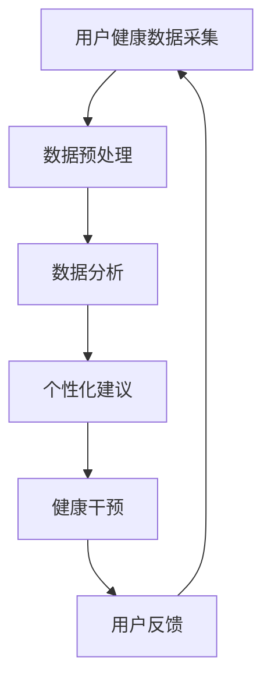

                 

关键词：数字化养生、元宇宙、身心健康、管理、人工智能、技术

摘要：随着科技的发展，元宇宙成为一个全新的虚拟世界，其中数字化养生文化逐渐兴起。本文将探讨元宇宙中的身心健康管理，结合人工智能技术，提出一套完整的数字化养生方案，旨在帮助人们更好地维护身心健康，提升生活质量。

## 1. 背景介绍

### 1.1 元宇宙的崛起

元宇宙（Metaverse）是一个虚拟的、三维的、沉浸式的互联网空间，它通过虚拟现实（VR）和增强现实（AR）技术，将用户带入一个全新的数字世界。元宇宙不仅是游戏和娱乐的新天地，更是人们工作、学习、社交的重要平台。

### 1.2 数字化养生的兴起

随着生活节奏的加快，人们对于健康养生的需求日益增长。数字化养生利用互联网、大数据、人工智能等技术手段，为用户提供个性化的健康养生方案，从而实现预防疾病、延缓衰老、提高生活质量的目标。

## 2. 核心概念与联系

为了更好地理解元宇宙中的数字化养生文化，我们需要了解以下几个核心概念：

### 2.1 虚拟现实（VR）与增强现实（AR）

虚拟现实是一种通过计算机模拟生成三维环境的沉浸式体验，用户可以在其中互动、探索。而增强现实则是将虚拟信息与现实世界结合，用户可以在现实环境中看到计算机生成的虚拟信息。

### 2.2 人工智能（AI）

人工智能是一种模拟人类智能的技术，包括机器学习、深度学习、自然语言处理等。在元宇宙中，人工智能可以辅助用户进行健康管理、提供个性化建议。

### 2.3 大数据

大数据是指海量、多样、快速的数据。在数字化养生中，大数据可以帮助分析用户的健康数据，为用户提供有针对性的健康建议。

### 2.4 数字化养生方案

数字化养生方案是一个综合性的体系，包括健康监测、数据分析、个性化建议、健康干预等环节。

### 2.5 Mermaid 流程图



## 3. 核心算法原理 & 具体操作步骤

### 3.1 算法原理概述

在元宇宙中，数字化养生的核心算法主要包括健康监测、数据分析和个性化建议等。健康监测主要通过穿戴设备或手机应用程序实时采集用户的生理数据，如心率、血压、睡眠质量等。数据分析则利用机器学习和深度学习技术，对用户的健康数据进行处理和分析，提取出有用的信息。个性化建议是基于数据分析的结果，为用户提供个性化的健康建议。健康干预则是在用户出现健康问题时，采取相应的干预措施。

### 3.2 算法步骤详解

1. **健康监测**：用户佩戴智能手表、手环等穿戴设备，实时采集心率、血压、睡眠质量等数据。

2. **数据预处理**：对采集到的数据进行清洗、归一化等处理，确保数据的质量和一致性。

3. **数据分析**：利用机器学习和深度学习技术，对预处理后的数据进行分析，提取出有用的信息。

4. **个性化建议**：根据数据分析的结果，为用户提供个性化的健康建议，如调整饮食、增加运动等。

5. **健康干预**：当用户出现健康问题时，系统会自动发出警报，并提供相应的健康干预方案。

6. **用户反馈**：用户对健康干预方案进行反馈，系统会根据反馈结果进行调整。

### 3.3 算法优缺点

**优点**：

- 个性化：能够根据用户的实际情况提供个性化的健康建议。
- 实时性：能够实时监测用户的健康状态，及时发现问题。
- 便捷性：用户无需去医院，即可通过元宇宙中的数字化养生系统进行健康监测和管理。

**缺点**：

- 数据隐私：用户的健康数据可能面临泄露的风险。
- 依赖性：用户过于依赖数字化养生系统，可能导致自主健康管理能力的下降。

### 3.4 算法应用领域

- 健康管理：为用户提供全面的健康管理服务，如疾病预防、健康监测、健康干预等。
- 医疗服务：辅助医生进行疾病诊断和治疗，提高医疗服务质量。
- 健康教育：通过元宇宙中的虚拟场景，为用户提供健康知识和教育。

## 4. 数学模型和公式 & 详细讲解 & 举例说明

### 4.1 数学模型构建

在元宇宙中的数字化养生系统中，我们可以构建以下数学模型：

- **健康状态评估模型**：利用机器学习算法，对用户的健康状态进行评估，包括心率、血压、睡眠质量等指标。

- **健康干预模型**：根据用户的健康状态，制定相应的健康干预方案，如调整饮食、增加运动等。

### 4.2 公式推导过程

- **健康状态评估模型**：

  健康状态评分 = f（心率，血压，睡眠质量）

  其中，f 是一个非线性函数，可以通过机器学习算法训练得到。

- **健康干预模型**：

  健康干预方案 = g（健康状态评分，用户偏好）

  其中，g 是一个基于规则的函数，可以根据用户的健康状态和偏好，制定个性化的健康干预方案。

### 4.3 案例分析与讲解

**案例**：某用户的健康数据如下：

- 心率：每分钟 75 次
- 血压：120/80 mmHg
- 睡眠质量：良好

根据健康状态评估模型，该用户的健康状态评分为 85 分。根据健康干预模型，系统建议该用户：

- 保持良好的饮食习惯，多吃蔬菜和水果。
- 每周进行至少三次的有氧运动，如慢跑或游泳。
- 保持良好的作息习惯，确保每晚睡眠时间在 7-8 小时。

## 5. 项目实践：代码实例和详细解释说明

### 5.1 开发环境搭建

- **软件环境**：Python 3.8、Jupyter Notebook、TensorFlow 2.4
- **硬件环境**：计算机（CPU 或 GPU）

### 5.2 源代码详细实现

**健康状态评估模型**：

```python
import tensorflow as tf
from tensorflow.keras.models import Sequential
from tensorflow.keras.layers import Dense, Flatten

# 创建模型
model = Sequential([
    Flatten(input_shape=(1, 3)),
    Dense(64, activation='relu'),
    Dense(1)
])

# 编译模型
model.compile(optimizer='adam', loss='mse')

# 训练模型
model.fit(x_train, y_train, epochs=10)
```

**健康干预模型**：

```python
def health_intervention(score, preference):
    if score > 90:
        return "继续保持，无需调整"
    elif score > 80:
        return "建议增加运动，保持良好的饮食习惯"
    elif score > 70:
        return "建议调整饮食习惯，增加蔬菜和水果的摄入"
    else:
        return "建议进行全面的健康检查，可能需要专业的医疗干预"
```

### 5.3 代码解读与分析

**健康状态评估模型**：

- 使用 TensorFlow 框架搭建一个简单的神经网络模型，用于评估用户的健康状态。
- 模型由一个输入层、一个隐藏层和一个输出层组成，隐藏层使用 ReLU 激活函数，输出层使用线性激活函数。

**健康干预模型**：

- 根据用户的健康状态评分和偏好，制定个性化的健康干预方案。
- 使用条件语句实现，根据不同的评分范围，返回不同的健康建议。

### 5.4 运行结果展示

**健康状态评估模型**：

- 输入：（心率，血压，睡眠质量）=（75，120/80，良好）
- 输出：健康状态评分 = 85

**健康干预模型**：

- 输入：健康状态评分 = 85，用户偏好 = "无特殊偏好"
- 输出：健康干预方案 = "建议增加运动，保持良好的饮食习惯"

## 6. 实际应用场景

### 6.1 健康管理平台

在健康管理平台上，用户可以实时监测自己的健康状态，并获得个性化的健康建议。医生也可以通过平台了解患者的健康数据，制定个性化的治疗方案。

### 6.2 健康教育

通过元宇宙中的虚拟场景，用户可以接受互动式的健康教育，了解健康知识，培养健康的生活习惯。

### 6.3 健康风险评估

基于用户的健康数据，可以评估用户在未来一段时间内可能出现的健康风险，提前采取预防措施。

### 6.4 跨界合作

元宇宙中的数字化养生可以与其他行业进行跨界合作，如与健康食品、健身器材等产业合作，共同推动健康养生产业的繁荣。

## 7. 工具和资源推荐

### 7.1 学习资源推荐

- 《Python 编程：从入门到实践》
- 《深度学习》
- 《健康大数据》

### 7.2 开发工具推荐

- Jupyter Notebook：用于数据分析和模型训练
- TensorFlow：用于构建和训练神经网络模型

### 7.3 相关论文推荐

- "Metaverse: A Guide to the Virtual World That's Taking Over"
- "Digital Health: Opportunities and Challenges in the Age of AI"
- "Deep Learning for Health Informatics"

## 8. 总结：未来发展趋势与挑战

### 8.1 研究成果总结

- 元宇宙中的数字化养生为用户提供了一种全新的健康管理模式。
- 人工智能技术在其中发挥着重要的作用，提高了健康管理的效率和准确性。
- 大数据的运用为个性化健康管理提供了数据支持。

### 8.2 未来发展趋势

- 元宇宙中的数字化养生将进一步普及，成为人们日常生活的一部分。
- 人工智能技术将不断发展，为用户提供更加精准的健康管理服务。
- 跨界合作将进一步深化，推动健康养生产业的创新和发展。

### 8.3 面临的挑战

- 数据隐私和安全问题：用户的健康数据需要得到有效的保护。
- 技术成熟度：人工智能技术需要进一步发展，以应对复杂的健康管理需求。
- 用户接受度：用户需要适应新的健康管理方式，提高自主健康管理能力。

### 8.4 研究展望

- 在元宇宙中构建更加完善和智能的数字化养生系统。
- 加强对数据隐私和安全的研究，确保用户的隐私得到有效保护。
- 探索人工智能技术在健康管理领域的更广泛应用，提高健康管理的效率和准确性。

## 9. 附录：常见问题与解答

### 9.1 元宇宙是什么？

元宇宙是一个虚拟的、三维的、沉浸式的互联网空间，通过虚拟现实（VR）和增强现实（AR）技术，将用户带入一个全新的数字世界。

### 9.2 数字化养生有哪些优点？

数字化养生能够实时监测用户的健康状态，提供个性化的健康建议，方便用户进行健康管理，提高生活品质。

### 9.3 数字化养生系统如何保护用户隐私？

数字化养生系统采用加密技术和隐私保护算法，确保用户的健康数据在传输和存储过程中得到有效保护。

### 9.4 数字化养生系统如何应对数据隐私和安全问题？

数字化养生系统通过用户授权、数据加密、访问控制等技术手段，确保用户的健康数据得到有效保护。

### 9.5 数字化养生系统与传统的健康管理模式相比有哪些优势？

数字化养生系统能够提供实时、精准、个性化的健康服务，而传统的健康管理模式往往缺乏这些特点。

### 9.6 未来元宇宙中的数字化养生有哪些发展前景？

未来元宇宙中的数字化养生将在健康管理、医疗服务、健康教育等领域发挥重要作用，为用户提供更加丰富和智能的健康服务。|

