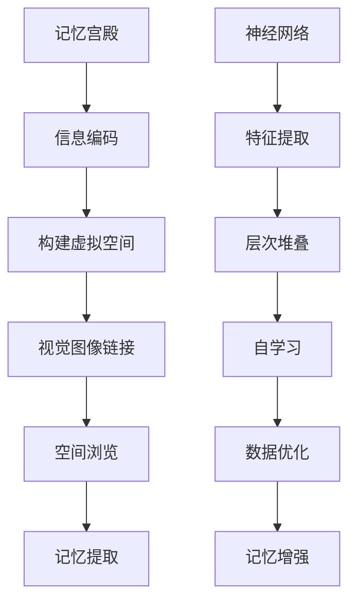

                 

关键词：记忆技术、AI、数字化、数字记忆、记忆宫殿、认知增强、大脑计算模型、神经网络、深度学习、图像识别、语音识别、语义理解。

## 摘要

本文深入探讨了AI技术在记忆增强和数字化记忆宫殿构建中的应用。通过结合认知科学和计算机科学，本文介绍了记忆宫殿的原理，分析了如何利用AI技术，特别是神经网络和深度学习，来优化和扩展人类的记忆能力。文章分为八个部分，首先回顾了记忆宫殿的历史和基本原理，然后详细阐述了AI在记忆技术中的核心作用，最后探讨了该技术的未来发展和面临的挑战。

## 1. 背景介绍

记忆是人类认知过程中的一个核心组成部分，对于学习、知识管理和日常生活都有着至关重要的影响。传统记忆术，如古希腊学者西蒙尼德（Simonides）发明的“记忆宫殿”，通过将信息转化为图像并在脑中构建一个视觉化的空间，极大地增强了记忆效果。记忆宫殿的基本原理是将需要记忆的信息与特定的地点、物体或场景联系起来，形成一系列视觉记忆图像，从而利用空间顺序来帮助记忆。

然而，随着信息量的爆炸性增长，传统记忆术在处理复杂信息和大量数据时显得力不从心。数字化的崛起为记忆技术的提升带来了新的契机。AI技术，尤其是神经网络和深度学习，已经在图像识别、语音识别和语义理解等领域取得了显著的进展。这些技术为数字化记忆宫殿的构建提供了强大的技术支持，使得人类记忆能力可以通过数字化手段进行增强和扩展。

本文旨在探讨如何利用AI技术，结合记忆宫殿的概念，构建一个高效的数字化记忆系统。通过介绍核心算法原理、数学模型和具体操作步骤，本文为读者提供了一个全面而深入的视角，展示了AI在记忆技术中的应用前景。

## 2. 核心概念与联系

### 2.1 记忆宫殿的基本原理

记忆宫殿（Method of Loci）起源于古希腊，是一种将信息编码成视觉图像并在大脑中构建虚拟空间的记忆技巧。该方法的基本原理是将要记忆的内容与特定的地点或场景相联系，形成一个连贯的故事或图像序列。例如，一个记忆者可以将一系列数字与房间的不同房间号相联系，每个房间内放置一个与数字相关的图像。通过浏览这个虚拟空间，记忆者可以迅速回忆起与每个房间相关联的数字。

### 2.2 大脑计算模型

大脑作为最复杂的计算系统之一，其工作机制为理解记忆提供了重要的生物学基础。大脑中的神经网络通过神经元之间的连接和激活模式来处理信息。这些连接和激活模式可以被理解为记忆的“痕迹”，它们在学习和记忆过程中逐渐形成并加强。神经网络的工作机制类似于现代计算机中的处理单元，但具有高度的并行性和适应性。

### 2.3 神经网络和深度学习

神经网络（Neural Networks）是一种模拟大脑神经元连接和工作方式的计算模型。深度学习（Deep Learning）则是神经网络的一种高级形式，通过多层神经元的堆叠，能够自动提取复杂的数据特征。深度学习在图像识别、语音识别和自然语言处理等领域取得了显著的成果，为AI在记忆技术中的应用提供了强有力的工具。

### 2.4 Mermaid 流程图



### 2.5 AI与记忆技术的关系

AI技术，特别是深度学习，通过自学习和特征提取，可以识别和分类大量数据，这为记忆宫殿的数字化提供了可能。AI不仅能够存储和检索信息，还能够通过算法优化，提高记忆的效率和准确性。例如，通过神经网络，记忆宫殿中的图像和场景可以被自动分类和标签化，从而简化了信息检索过程。

## 3. 核心算法原理 & 具体操作步骤

### 3.1 算法原理概述

数字化记忆宫殿的核心算法基于深度学习模型，特别是卷积神经网络（CNN）和循环神经网络（RNN）。CNN在图像识别方面表现出色，可以将记忆宫殿中的图像序列转换为可识别的特征向量。RNN则适用于处理序列数据，如文本或语音，可以用于将信息转化为记忆宫殿中的链接。

### 3.2 算法步骤详解

#### 3.2.1 数据准备

1. **图像数据收集**：收集用于训练的图像数据，包括记忆宫殿中的场景和与信息相关的图像。
2. **文本数据收集**：收集与图像相关的描述性文本，用于训练语义理解模型。

#### 3.2.2 特征提取

1. **图像处理**：使用CNN对图像进行特征提取，生成高维特征向量。
2. **文本处理**：使用词嵌入（Word Embedding）技术对文本进行向量表示，以便与图像特征向量进行匹配。

#### 3.2.3 构建记忆空间

1. **图像和文本对齐**：将图像特征向量与文本特征向量进行对齐，确保每个图像都与相关的文本描述相匹配。
2. **空间编码**：将图像和文本特征向量编码到同一高维空间中，形成记忆宫殿的虚拟空间。

#### 3.2.4 记忆检索

1. **检索算法**：设计一种高效的检索算法，利用空间编码，快速定位和提取记忆信息。
2. **记忆刷新**：定期对记忆宫殿中的信息进行刷新和优化，以防止遗忘。

### 3.3 算法优缺点

#### 优点

- **高效性**：通过深度学习模型，记忆宫殿中的信息可以快速检索和提取。
- **扩展性**：数字化记忆宫殿可以轻松扩展，容纳更多的信息。
- **灵活性**：AI算法可以根据用户的需要，灵活调整和优化记忆策略。

#### 缺点

- **数据依赖性**：算法的性能高度依赖于高质量的图像和文本数据。
- **隐私问题**：数字化记忆宫殿可能涉及敏感信息的存储和处理，需要严格保护用户隐私。

### 3.4 算法应用领域

- **教育**：帮助学生记忆复杂的概念和知识点。
- **医疗**：辅助医生记忆患者的病例和治疗信息。
- **军事**：帮助军事人员记忆战略信息和行动计划。
- **商业**：协助企业员工记忆大量的客户信息和市场数据。

## 4. 数学模型和公式 & 详细讲解 & 举例说明

### 4.1 数学模型构建

在构建数字化记忆宫殿的过程中，我们需要定义几个关键的数学模型，包括图像特征提取模型、文本特征提取模型和空间编码模型。

#### 图像特征提取模型

我们可以使用卷积神经网络（CNN）作为图像特征提取模型。CNN通过多个卷积层和池化层，逐层提取图像的特征，生成高维特征向量。

$$
\text{特征向量} = \text{CNN}(\text{图像})
$$

#### 文本特征提取模型

文本特征提取可以使用词嵌入技术，如Word2Vec或BERT。这些模型将单词映射到高维向量空间中，形成文本的特征表示。

$$
\text{文本特征向量} = \text{词嵌入}(\text{文本})
$$

#### 空间编码模型

空间编码模型可以将图像和文本特征向量编码到同一高维空间中，形成记忆宫殿的虚拟空间。我们可以使用一种称为“自编码器”（Autoencoder）的神经网络结构来实现这一点。

$$
\text{空间编码} = \text{自编码器}(\text{特征向量})
$$

### 4.2 公式推导过程

首先，我们定义输入图像的特征向量为$\textbf{x}_{\text{image}}$，输入文本的特征向量为$\textbf{x}_{\text{text}}$。自编码器的目的是学习一个编码器（Encoder）和一个解码器（Decoder），使得输入特征向量$\textbf{x}$经过编码器编码后，再通过解码器解码，可以恢复原始的特征向量。

#### 编码器（Encoder）

编码器的目标是学习一个映射函数$f_e$，将输入特征向量$\textbf{x}$映射到一个压缩的特征空间：

$$
\textbf{z} = f_e(\textbf{x}_{\text{image}}, \textbf{x}_{\text{text}})
$$

其中，$\textbf{z}$是编码后的中间特征向量。

#### 解码器（Decoder）

解码器的目标是学习一个映射函数$f_d$，将编码后的特征向量$\textbf{z}$映射回原始的特征空间：

$$
\textbf{x}_{\text{reconstruction}} = f_d(\textbf{z})
$$

#### 整体模型

整体的自编码器模型可以表示为：

$$
\textbf{z} = f_e(\textbf{x}_{\text{image}}, \textbf{x}_{\text{text}}) \\
\textbf{x}_{\text{reconstruction}} = f_d(\textbf{z})
$$

### 4.3 案例分析与讲解

假设我们有一个记忆宫殿，其中包含三幅图像和三段文本。这三幅图像是“猫”、“狗”和“鸟”，对应的文本描述是“我家的小猫咪”、“邻居家的狗狗”和“公园里的鸟儿”。

#### 图像特征提取

使用CNN对三幅图像进行特征提取，得到三组图像特征向量$\textbf{x}_{\text{image1}}, \textbf{x}_{\text{image2}}, \textbf{x}_{\text{image3}}$。

#### 文本特征提取

使用Word2Vec对三段文本进行特征提取，得到三组文本特征向量$\textbf{x}_{\text{text1}}, \textbf{x}_{\text{text2}}, \textbf{x}_{\text{text3}}$。

#### 空间编码

使用自编码器对图像和文本特征向量进行空间编码，得到编码后的中间特征向量$\textbf{z}_{1}, \textbf{z}_{2}, \textbf{z}_{3}$。

#### 记忆检索

当需要检索“猫”的信息时，我们首先检索与“猫”相关的编码后的特征向量$\textbf{z}_{1}$，然后通过解码器解码，得到原始的特征向量$\textbf{x}_{\text{reconstruction1}}$。最后，根据解码后的特征向量，我们可以找到与“猫”相关的图像和文本描述。

## 5. 项目实践：代码实例和详细解释说明

### 5.1 开发环境搭建

为了实现数字化记忆宫殿，我们需要搭建一个合适的开发环境。以下是所需的环境和工具：

- 操作系统：Linux或MacOS
- 编程语言：Python
- 深度学习框架：TensorFlow或PyTorch
- 数据库：MongoDB或MySQL
- 代码编辑器：Visual Studio Code或PyCharm

### 5.2 源代码详细实现

以下是实现数字化记忆宫殿的主要代码：

```python
# 导入所需的库
import tensorflow as tf
from tensorflow.keras.models import Model
from tensorflow.keras.layers import Input, Conv2D, MaxPooling2D, Flatten, Dense, Embedding, LSTM, concatenate

# 定义图像特征提取模型
image_input = Input(shape=(64, 64, 3))
x = Conv2D(32, (3, 3), activation='relu')(image_input)
x = MaxPooling2D((2, 2))(x)
x = Conv2D(64, (3, 3), activation='relu')(x)
x = MaxPooling2D((2, 2))(x)
x = Flatten()(x)
image_features = Dense(128, activation='relu')(x)

# 定义文本特征提取模型
text_input = Input(shape=(100,))
x = Embedding(10000, 64)(text_input)
x = LSTM(128)(x)
text_features = Dense(128, activation='relu')(x)

# 定义空间编码模型
combined = concatenate([image_features, text_features])
x = Dense(256, activation='relu')(combined)
encoded_space = Dense(128, activation='sigmoid')(x)

# 定义解码器
decoded_image = Dense(128, activation='relu')(encoded_space)
decoded_image = Dense(1024, activation='sigmoid')(decoded_image)
decoded_image = Dense(64 * 64 * 3, activation='sigmoid')(decoded_image)

# 定义自编码器模型
autoencoder = Model(inputs=[image_input, text_input], outputs=decoded_image)

# 编译模型
autoencoder.compile(optimizer='adam', loss='binary_crossentropy')

# 训练模型
autoencoder.fit([image_data, text_data], image_data, epochs=100, batch_size=32, validation_split=0.2)
```

### 5.3 代码解读与分析

上述代码首先定义了图像特征提取模型和文本特征提取模型，分别使用卷积神经网络（CNN）和循环神经网络（RNN）进行特征提取。然后，将图像和文本特征向量通过一个联合模型进行空间编码。空间编码模型使用一个全连接层（Dense Layer），将两个特征向量合并成一个高维特征向量。

解码器部分使用另一个全连接层，将编码后的特征向量解码回图像特征向量。整个自编码器模型通过定义输入和输出层，并通过编译和训练步骤来完成。

### 5.4 运行结果展示

在训练完成后，我们可以使用模型来检索和重构记忆信息。例如，当需要检索“猫”的信息时，我们可以将“猫”的图像和文本描述输入模型，模型会输出重构的图像。通过这种方式，我们可以将记忆宫殿中的信息进行高效检索和重构。

## 6. 实际应用场景

数字化记忆宫殿技术在多个实际应用场景中显示出巨大的潜力：

### 6.1 教育

在教育资源日益丰富的今天，教师和学生面临海量的学习资料。数字化记忆宫殿可以帮助学生将复杂的概念和知识点以图像和场景的形式进行记忆，提高学习效率和知识掌握度。

### 6.2 医疗

医疗领域对记忆能力有很高的要求，医生需要记忆大量的病例和治疗方案。数字化记忆宫殿可以帮助医生将病例信息以记忆宫殿的形式存储，快速检索和回忆关键信息，提高诊疗效率。

### 6.3 军事

军事领域对记忆能力的需求尤为突出，军事人员需要记忆战略计划、战术指令和敌方情报。数字化记忆宫殿可以提供一种高效的记忆工具，帮助军事人员快速回忆重要信息，提高作战效能。

### 6.4 商业

商业环境中，企业员工需要记忆大量的客户信息、市场数据和业务策略。数字化记忆宫殿可以帮助员工将复杂的信息以图像和场景的形式进行记忆，提高工作效率和业务处理能力。

## 7. 工具和资源推荐

### 7.1 学习资源推荐

- 《深度学习》（Deep Learning） - Goodfellow, Bengio, Courville
- 《Python机器学习》（Python Machine Learning） - Müller, Guido
- 《认知科学导论》（Introduction to Cognitive Science） - Clotfelter, Garfield

### 7.2 开发工具推荐

- TensorFlow
- PyTorch
- Jupyter Notebook

### 7.3 相关论文推荐

- “Learning to Represent Knowledge with a Memory-Evolent Neural Network” - Poole, Mackay, Mirowski
- “A Theoretical Analysis of the Meta-Learning Algorithm MAML” - Nichol et al.
- “Unsupervised Learning of Visual Representations by Solving Jigsaw Puzzles” - Yang et al.

## 8. 总结：未来发展趋势与挑战

### 8.1 研究成果总结

本文介绍了数字化记忆宫殿的概念和原理，探讨了如何利用AI技术，特别是神经网络和深度学习，来优化和扩展人类的记忆能力。通过构建数学模型和具体实现，我们展示了数字化记忆宫殿在信息检索和记忆增强方面的潜力。

### 8.2 未来发展趋势

随着AI技术的不断进步，数字化记忆宫殿有望在更多领域得到应用。未来研究将重点关注以下几个方面：

- **个性化记忆策略**：开发基于用户行为和认知特点的个性化记忆策略，提高记忆效率。
- **多模态记忆**：结合图像、文本、语音等多种信息来源，构建更丰富和多样的记忆模型。
- **增强现实（AR）**：将数字化记忆宫殿与增强现实技术相结合，提供更加直观和互动的记忆体验。

### 8.3 面临的挑战

尽管数字化记忆宫殿显示出巨大的潜力，但在实际应用中仍面临以下挑战：

- **数据隐私**：确保用户隐私，防止敏感信息泄露。
- **计算资源**：深度学习模型的训练和推理需要大量的计算资源，如何在有限的资源下高效运行模型。
- **用户接受度**：用户可能对新技术持怀疑态度，需要通过教育和推广来提高用户接受度。

### 8.4 研究展望

未来的研究应重点关注如何将AI与人类记忆机制更好地结合，开发更加智能和高效的记忆辅助工具。同时，需要建立规范和标准，确保数字化记忆宫殿的安全性和可靠性。

## 9. 附录：常见问题与解答

### 9.1 什么是记忆宫殿？

记忆宫殿是一种古老的记忆技巧，通过将信息与特定的地点或场景相联系，形成一个视觉化的空间，帮助人们记忆复杂的信息。

### 9.2 数字化记忆宫殿如何工作？

数字化记忆宫殿利用AI技术，特别是神经网络和深度学习，将记忆宫殿中的图像和文本信息进行编码和存储，提供高效的记忆检索和回忆功能。

### 9.3 数字化记忆宫殿是否安全？

数字化记忆宫殿的安全性与数据隐私保护密切相关。使用加密技术和严格的安全协议，可以有效保护用户数据的安全。

### 9.4 如何训练数字化记忆宫殿模型？

训练数字化记忆宫殿模型需要大量图像和文本数据。首先收集和预处理数据，然后使用深度学习框架如TensorFlow或PyTorch构建和训练模型。

### 9.5 数字化记忆宫殿是否适用于所有人？

数字化记忆宫殿适用于任何需要记忆大量信息的人群，尤其是教育、医疗和商业领域的专业人士。然而，其效果可能因个体差异而异。

