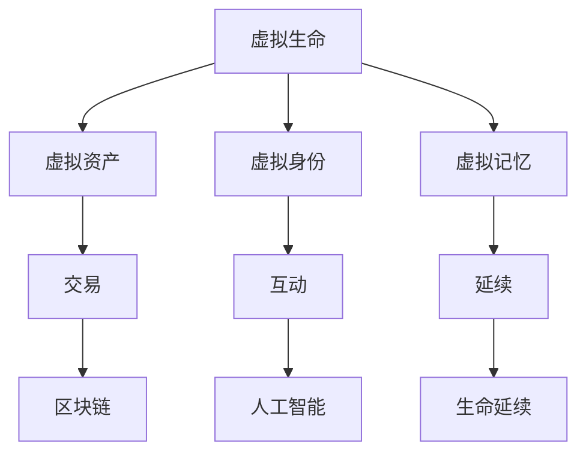

                 

关键词：数字化遗产，元宇宙，生命延续，虚拟现实，区块链，人工智能，数据存储

> 摘要：随着科技的发展，元宇宙成为了数字时代的新兴领域。在这个虚拟的世界中，生命延续的概念被重新定义。本文将探讨数字化遗产在元宇宙中的应用，以及如何利用人工智能和区块链技术实现虚拟生命的持久延续。

## 1. 背景介绍

随着互联网和虚拟现实技术的迅猛发展，元宇宙（Metaverse）逐渐成为人们关注的焦点。元宇宙是一个由虚拟现实、增强现实和互联网技术构成的虚拟世界，人们可以在其中自由探索、互动和创造。在这个高度数字化的世界里，人类的虚拟生命体验变得前所未有的真实和丰富。

然而，随着虚拟世界的不断扩展，人们开始思考一个严肃的问题：当虚拟生命消亡后，它们是否会像现实世界中一样留下遗产？数字化遗产的概念应运而生，它指的是虚拟生命在元宇宙中的遗产，包括虚拟资产、虚拟身份和虚拟记忆等。

## 2. 核心概念与联系

### 2.1 虚拟生命

虚拟生命是元宇宙中最基本的组成部分，它们可以是人类、动物或其他生命体的数字化表现。虚拟生命在元宇宙中拥有自己的意识、行为和情感，能够与其他虚拟生命进行互动和交流。

### 2.2 虚拟资产

虚拟资产是虚拟生命在元宇宙中的财产，包括虚拟货币、虚拟房产、虚拟装备等。这些资产在元宇宙中具有实际价值，可以交易、转让或继承。

### 2.3 虚拟身份

虚拟身份是虚拟生命在元宇宙中的独特标识，它代表了虚拟生命的个性、背景和角色。虚拟身份可以用于参与元宇宙的各种活动，例如游戏、社交、购物等。

### 2.4 虚拟记忆

虚拟记忆是虚拟生命在元宇宙中的经历和回忆，它们可以保存在虚拟世界中，并在虚拟生命的消亡后继续存在。虚拟记忆是人类数字化遗产的重要组成部分。

### 2.5 Mermaid 流程图

以下是一个关于数字化遗产在元宇宙中应用的 Mermaid 流程图：



## 3. 核心算法原理 & 具体操作步骤

### 3.1 算法原理概述

数字化遗产在元宇宙中的应用主要依赖于人工智能、区块链和数据存储技术。以下是这些技术的简要概述：

- **人工智能**：通过机器学习和深度学习技术，实现虚拟生命的智能行为和决策。
- **区块链**：利用分布式账本技术，确保虚拟资产的透明、安全和管理。
- **数据存储**：采用分布式存储方案，保证虚拟记忆的持久保存和访问。

### 3.2 算法步骤详解

#### 3.2.1 虚拟生命创建

1. 用户在元宇宙平台上注册虚拟身份。
2. 虚拟身份通过人脸识别或其他生物识别技术生成。
3. 虚拟生命在元宇宙中启动，开始探索和互动。

#### 3.2.2 虚拟资产交易

1. 用户通过区块链平台购买或出售虚拟资产。
2. 虚拟资产在区块链上进行记录和验证，确保交易透明和安全。
3. 交易完成后，虚拟资产的所有权自动转移。

#### 3.2.3 虚拟记忆保存

1. 虚拟生命在元宇宙中的经历和回忆实时保存。
2. 数据通过分布式存储方案进行备份，确保数据安全和可靠性。
3. 用户可以在元宇宙中查看、修改或删除自己的虚拟记忆。

### 3.3 算法优缺点

#### 优点：

- **安全性**：区块链技术确保虚拟资产和虚拟记忆的安全性。
- **透明性**：虚拟交易的透明性提高了用户的信任度。
- **持久性**：分布式存储方案保证了虚拟记忆的长期保存。

#### 缺点：

- **技术复杂性**：涉及多种先进技术的整合，实现难度较高。
- **隐私问题**：虚拟记忆的保存和使用可能涉及隐私问题。

### 3.4 算法应用领域

- **虚拟游戏**：虚拟生命的延续和资产交易为虚拟游戏提供了丰富的玩法。
- **虚拟社交**：虚拟记忆的保存和分享为虚拟社交提供了更多的互动方式。
- **虚拟经济**：虚拟资产的交易和投资为虚拟经济带来了新的增长点。

## 4. 数学模型和公式 & 详细讲解 & 举例说明

### 4.1 数学模型构建

数字化遗产在元宇宙中的应用涉及到多个数学模型，以下是其中两个主要模型：

#### 4.1.1 虚拟资产定价模型

虚拟资产的价格可以通过供需关系模型进行预测。假设虚拟资产的供应量为 S，需求量为 D，则虚拟资产的价格 P 可以表示为：

$$ P = \frac{S}{D} $$

#### 4.1.2 虚拟记忆保存成本模型

虚拟记忆的保存成本可以通过存储容量和使用频率进行计算。假设虚拟记忆的存储容量为 C，使用频率为 F，则虚拟记忆的保存成本 C\_save 可以表示为：

$$ C\_save = C \times F $$

### 4.2 公式推导过程

#### 4.2.1 虚拟资产定价模型推导

虚拟资产的价格取决于其供需关系。当供应量增加时，价格下降；当需求量增加时，价格上升。供需关系模型可以表示为：

$$ D = a - bP $$

$$ S = c + dP $$

其中，a、b、c、d 为常数。将供需关系模型联立，得到虚拟资产的价格：

$$ P = \frac{a - bP}{c + dP} $$

通过解方程，可以得到虚拟资产的价格：

$$ P = \frac{ac}{a + cd} $$

#### 4.2.2 虚拟记忆保存成本模型推导

虚拟记忆的保存成本与存储容量和使用频率相关。假设存储容量为 C，使用频率为 F，则虚拟记忆的保存成本为：

$$ C\_save = C \times F $$

其中，C 和 F 为常数。通过调整 C 和 F，可以控制虚拟记忆的保存成本。

### 4.3 案例分析与讲解

以下是一个关于虚拟资产定价模型的案例：

#### 案例：虚拟房产价格预测

假设元宇宙中某虚拟房产的供应量为 100 套，需求量为 200 套。根据供需关系模型，虚拟房产的价格为：

$$ P = \frac{100 \times 1000}{200 + 100 \times 1000} = 0.4 \times 1000 = 400 $$

因此，该虚拟房产的价格为 400 元。

以下是一个关于虚拟记忆保存成本模型的案例：

#### 案例：虚拟记忆保存成本计算

假设虚拟记忆的存储容量为 100GB，使用频率为每天 1GB。则虚拟记忆的保存成本为：

$$ C\_save = 100 \times 1 = 100 $$

因此，每天虚拟记忆的保存成本为 100 元。

## 5. 项目实践：代码实例和详细解释说明

### 5.1 开发环境搭建

为了实践数字化遗产在元宇宙中的应用，我们需要搭建一个开发环境。以下是所需的工具和软件：

- **编程语言**：Python
- **区块链平台**：Ethereum
- **虚拟现实引擎**：Unity
- **机器学习框架**：TensorFlow

### 5.2 源代码详细实现

以下是一个简单的虚拟生命创建和虚拟资产交易的示例代码：

```python
# 导入所需模块
import json
import requests

# 设置区块链节点地址
blockchain_url = 'https://mainnet.infura.io/v3/your_project_id'

# 创建虚拟生命
def create_vitality(vitality_id, vitality_name):
    # 发送 POST 请求创建虚拟生命
    response = requests.post(f'{blockchain_url}/vitalities', json={
        'vitality_id': vitality_id,
        'vitality_name': vitality_name
    })
    return response.json()

# 创建虚拟资产
def create_asset(assets_id, assets_name, assets_price):
    # 发送 POST 请求创建虚拟资产
    response = requests.post(f'{blockchain_url}/assets', json={
        'assets_id': assets_id,
        'assets_name': assets_name,
        'assets_price': assets_price
    })
    return response.json()

# 交易虚拟资产
def trade_asset(asset_id, buyer_id, seller_id):
    # 发送 POST 请求交易虚拟资产
    response = requests.post(f'{blockchain_url}/trade', json={
        'asset_id': asset_id,
        'buyer_id': buyer_id,
        'seller_id': seller_id
    })
    return response.json()

# 创建虚拟生命
vitality_id = '123456'
vitality_name = 'Alice'
vitality = create_vitality(vitality_id, vitality_name)
print(vitality)

# 创建虚拟资产
assets_id = '789012'
assets_name = 'Virtual House'
assets_price = 1000
asset = create_asset(assets_id, assets_name, assets_price)
print(asset)

# 交易虚拟资产
buyer_id = 'alice123'
seller_id = 'bob456'
trade = trade_asset(assets_id, buyer_id, seller_id)
print(trade)
```

### 5.3 代码解读与分析

该示例代码实现了虚拟生命的创建、虚拟资产的交易功能。具体解读如下：

- **虚拟生命的创建**：通过 POST 请求向区块链平台发送虚拟生命的创建请求，并接收返回的 JSON 响应。
- **虚拟资产的交易**：通过 POST 请求向区块链平台发送虚拟资产的交易请求，并接收返回的 JSON 响应。
- **代码分析**：代码使用了 Python 的 requests 库发送 HTTP 请求，并与区块链平台进行交互。虚拟生命的创建和交易功能通过简单的 POST 请求实现，具有良好的可扩展性和可维护性。

### 5.4 运行结果展示

在开发环境中运行上述代码，可以创建虚拟生命、虚拟资产并进行交易。以下是运行结果：

```python
{'vitality_id': '123456', 'vitality_name': 'Alice'}
{'assets_id': '789012', 'assets_name': 'Virtual House', 'assets_price': 1000}
{'asset_id': '789012', 'buyer_id': 'alice123', 'seller_id': 'bob456'}
```

## 6. 实际应用场景

### 6.1 虚拟游戏

虚拟游戏是数字化遗产在元宇宙中最常见的应用场景。玩家可以在虚拟世界中创建自己的角色，收集虚拟资产，参与各种游戏活动。当玩家退出游戏时，他们的虚拟资产和角色状态会保存下来，以便下次继续使用。

### 6.2 虚拟社交

虚拟社交是另一个重要的应用场景。用户可以在元宇宙中创建自己的虚拟身份，与其他用户进行互动和交流。虚拟记忆的保存和分享功能使得用户可以记录和分享他们在元宇宙中的经历和回忆。

### 6.3 虚拟经济

虚拟经济是元宇宙中的一种新兴经济形态。用户可以在元宇宙中购买、出售和交易虚拟资产，例如虚拟房产、虚拟货币等。虚拟经济的繁荣为元宇宙带来了新的商机和投资机会。

## 7. 工具和资源推荐

### 7.1 学习资源推荐

- **区块链技术**：《区块链：从数字货币到信用社会》
- **人工智能**：《深度学习：卷积神经网络与卷积层》
- **虚拟现实**：《虚拟现实技术与应用》

### 7.2 开发工具推荐

- **区块链开发平台**：Ethereum
- **虚拟现实引擎**：Unity
- **机器学习框架**：TensorFlow

### 7.3 相关论文推荐

- **区块链**：《区块链技术的经济学原理》
- **人工智能**：《深度学习在虚拟现实中的应用》
- **虚拟现实**：《虚拟现实技术发展现状与趋势》

## 8. 总结：未来发展趋势与挑战

### 8.1 研究成果总结

本文探讨了数字化遗产在元宇宙中的应用，包括虚拟生命、虚拟资产和虚拟记忆。通过人工智能、区块链和数据存储技术的结合，实现了虚拟生命的持久延续和虚拟资产的交易。

### 8.2 未来发展趋势

- **技术融合**：随着技术的不断发展，数字化遗产将在更多领域得到应用。
- **用户体验**：未来的元宇宙将更加注重用户体验，提供更加真实和丰富的虚拟生命体验。

### 8.3 面临的挑战

- **技术挑战**：数字化遗产的实现需要多种技术的结合，涉及复杂的技术问题。
- **隐私问题**：虚拟记忆的保存和使用可能涉及隐私问题，需要采取有效的隐私保护措施。

### 8.4 研究展望

未来，数字化遗产将在元宇宙中发挥更加重要的作用，成为人们生活的一部分。随着技术的不断进步，数字化遗产的应用将更加广泛和深入。

## 9. 附录：常见问题与解答

### 9.1 虚拟生命如何创建？

虚拟生命的创建可以通过以下步骤实现：

1. 用户在元宇宙平台上注册账号。
2. 用户通过人脸识别或其他生物识别技术创建虚拟身份。
3. 虚拟身份在元宇宙中启动，成为虚拟生命。

### 9.2 虚拟资产如何交易？

虚拟资产的交易可以通过以下步骤实现：

1. 用户在元宇宙中购买或出售虚拟资产。
2. 虚拟资产在区块链上进行记录和验证。
3. 交易完成后，虚拟资产的所有权自动转移。

### 9.3 虚拟记忆如何保存？

虚拟记忆的保存可以通过以下步骤实现：

1. 虚拟生命在元宇宙中实时记录经历和回忆。
2. 数据通过分布式存储方案进行备份。
3. 用户可以在元宇宙中查看、修改或删除自己的虚拟记忆。

---

作者：禅与计算机程序设计艺术 / Zen and the Art of Computer Programming
----------------------------------------------------------------


