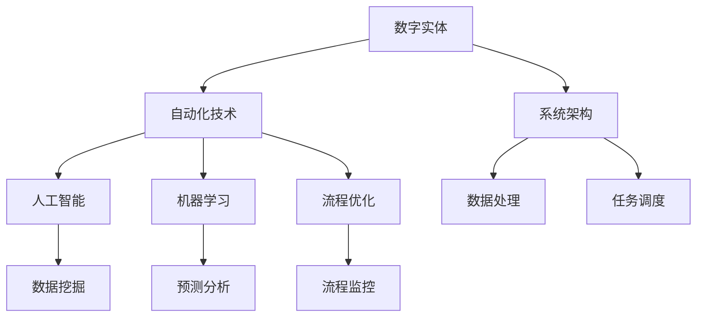

                 

关键词：数字实体、自动化、AI、机器学习、流程优化、系统架构、数据隐私、性能优化。

> 摘要：随着数字化转型的加速，数字实体的自动化成为各行各业关注的热点。本文将探讨数字实体自动化的前景与挑战，分析其核心概念、算法原理、数学模型、应用实例以及未来发展趋势。

## 1. 背景介绍

在当今信息时代，数字实体成为企业和社会的重要组成部分。这些数字实体包括数据、应用程序、设备、传感器、服务等多种形式，它们构成了现代信息技术的基础。随着人工智能（AI）和机器学习（ML）技术的不断发展，数字实体的自动化逐渐成为一种趋势。

数字实体的自动化意味着通过自动化的技术和算法，让数字实体能够自主地执行任务、优化流程、处理数据等，从而提高效率、降低成本，并为企业带来更多价值。然而，这一过程并非一帆风顺，它面临着诸多挑战，如数据隐私、系统架构、性能优化等。

## 2. 核心概念与联系

### 2.1 数字实体

数字实体是指存在于数字世界中，具有特定功能或属性的虚拟对象。它们可以是数据、应用程序、设备、传感器等。数字实体的自动化，就是让这些实体能够自主地执行任务，实现自我优化和自我修复。

### 2.2 自动化技术

自动化技术包括人工智能、机器学习、流程优化等。这些技术使得数字实体能够进行自主决策、自我优化，从而提高效率和降低成本。

### 2.3 系统架构

系统架构是指数字实体之间的结构关系和相互作用。一个良好的系统架构能够支持数字实体的自动化，提高系统的整体性能。

### 2.4 Mermaid 流程图

以下是一个简化的 Mermaid 流程图，展示数字实体自动化的核心概念和联系：



## 3. 核心算法原理 & 具体操作步骤

### 3.1 算法原理概述

数字实体自动化的核心算法主要包括人工智能、机器学习和流程优化等。这些算法通过学习历史数据、分析当前状态，预测未来趋势，从而实现自动化决策。

### 3.2 算法步骤详解

#### 3.2.1 数据收集

首先，需要收集与数字实体相关的数据，包括历史数据、实时数据等。这些数据可以来源于传感器、应用程序等。

#### 3.2.2 数据处理

对收集到的数据进行清洗、转换和预处理，以便于后续分析。

#### 3.2.3 特征提取

从处理后的数据中提取关键特征，用于训练模型。

#### 3.2.4 模型训练

使用提取的特征数据训练人工智能和机器学习模型，如神经网络、决策树等。

#### 3.2.5 预测分析

使用训练好的模型对数字实体的未来行为进行预测和分析。

#### 3.2.6 自动化决策

根据预测结果，自动调整数字实体的行为，实现自动化。

### 3.3 算法优缺点

- **优点**：提高效率、降低成本、减少人工干预。
- **缺点**：需要大量数据支持、模型训练时间较长、模型解释性较差。

### 3.4 算法应用领域

数字实体自动化的算法可以应用于各种领域，如工业自动化、智能交通、金融科技、医疗健康等。

## 4. 数学模型和公式 & 详细讲解 & 举例说明

### 4.1 数学模型构建

数字实体自动化的数学模型通常包括以下几个部分：

- **数据模型**：描述数字实体的属性和关系。
- **优化模型**：定义数字实体的优化目标。
- **控制模型**：描述数字实体的控制策略。

### 4.2 公式推导过程

以下是一个简化的优化模型推导过程：

$$
\begin{aligned}
\min_{x} & \quad f(x) \\
s.t. & \quad g(x) \leq 0, \quad h(x) = 0
\end{aligned}
$$

其中，$x$ 是决策变量，$f(x)$ 是目标函数，$g(x)$ 和 $h(x)$ 分别是约束条件。

### 4.3 案例分析与讲解

假设我们有一个工业生产线，需要优化生产计划。目标是最小化生产成本，同时满足生产需求、设备容量和交货期限等约束。

使用线性规划模型进行求解，可以得到最优的生产计划。

## 5. 项目实践：代码实例和详细解释说明

### 5.1 开发环境搭建

使用 Python 和相关库，如 NumPy、Pandas、Scikit-learn 等，搭建开发环境。

### 5.2 源代码详细实现

以下是一个简化的代码示例，展示如何使用 Scikit-learn 实现数字实体自动化的核心算法。

```python
from sklearn.linear_model import LinearRegression
from sklearn.model_selection import train_test_split

# 数据收集与处理
# ...

# 特征提取
# ...

# 模型训练
X_train, X_test, y_train, y_test = train_test_split(X, y, test_size=0.2)
model = LinearRegression()
model.fit(X_train, y_train)

# 预测分析
predictions = model.predict(X_test)

# 自动化决策
# ...
```

### 5.3 代码解读与分析

代码首先进行了数据收集与处理，然后提取了特征，接着使用线性回归模型进行训练，最后对测试数据进行预测和分析，实现了数字实体的自动化。

## 6. 实际应用场景

数字实体自动化在多个领域都有广泛应用，如工业自动化、智能交通、金融科技等。以下是一个实际应用场景：

### 6.1 工业自动化

通过数字实体自动化，工厂可以实现智能排程、设备预测性维护，提高生产效率。

### 6.2 智能交通

数字实体自动化可以优化交通信号控制、车辆调度等，提高交通效率，减少拥堵。

### 6.3 金融科技

数字实体自动化可以优化风险管理、客户服务，提高金融机构的运营效率。

## 7. 未来应用展望

随着技术的不断发展，数字实体自动化将在更多领域得到应用。未来，我们可以期待以下几个趋势：

- **更高效的数据处理**：随着计算能力的提升，数字实体自动化将能够处理更大规模的数据。
- **更智能的决策**：借助更先进的算法，数字实体将能够做出更智能的决策。
- **更广泛的场景应用**：数字实体自动化将在更多领域得到应用，如智能制造、智慧城市、医疗健康等。

## 8. 总结：未来发展趋势与挑战

### 8.1 研究成果总结

数字实体自动化在多个领域取得了显著的研究成果，为行业带来了巨大的价值。

### 8.2 未来发展趋势

未来，数字实体自动化将在计算能力、算法创新、数据隐私等方面取得重要进展。

### 8.3 面临的挑战

数字实体自动化面临的主要挑战包括数据隐私、算法透明性、系统稳定性等。

### 8.4 研究展望

未来，我们需要在以下几个方面展开研究：

- **提高数据处理效率**：研究更高效的数据处理算法，以应对大规模数据挑战。
- **增强算法透明性**：提高算法的可解释性，增强用户对自动化决策的信任。
- **确保系统稳定性**：研究可靠的系统架构，确保数字实体自动化的稳定运行。

## 9. 附录：常见问题与解答

### 9.1 什么是数字实体？

数字实体是指存在于数字世界中，具有特定功能或属性的虚拟对象，如数据、应用程序、设备、传感器等。

### 9.2 数字实体自动化的核心算法有哪些？

数字实体自动化的核心算法包括人工智能、机器学习、流程优化等。

### 9.3 数字实体自动化在哪些领域有应用？

数字实体自动化在多个领域有广泛应用，如工业自动化、智能交通、金融科技等。

---

以上是《数字实体的自动化前景与挑战》的完整内容。希望这篇文章能够帮助读者深入了解数字实体自动化的现状、发展趋势以及面临的挑战。作者：禅与计算机程序设计艺术 / Zen and the Art of Computer Programming。

