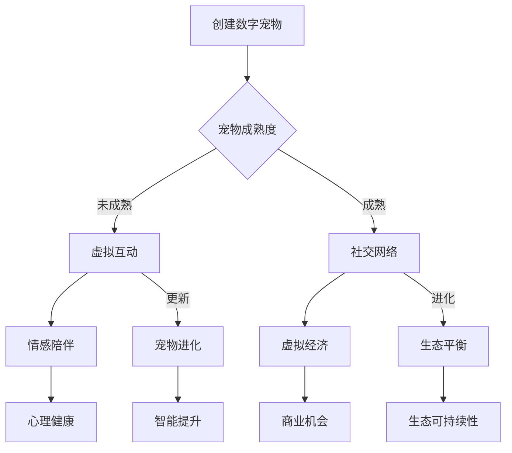

                 

关键词：数字宠物、元宇宙、法律地位、人工智能、伦理问题

> 摘要：本文旨在探讨元宇宙中数字宠物的权益问题，尤其是它们的法律地位。随着人工智能技术的飞速发展，数字宠物作为虚拟生命的存在越来越普遍。本文将分析数字宠物的法律属性、权利保障、责任归属以及伦理道德等方面，提出相应的法律框架和政策建议，为元宇宙中数字宠物的合法权益提供理论支持。

## 1. 背景介绍

### 数字宠物的发展历程

数字宠物，作为虚拟现实技术和人工智能相结合的产物，起源于20世纪90年代的在线游戏和虚拟世界。早期的数字宠物主要是作为游戏的附属元素存在，如《宠物小精灵》等游戏中的虚拟宠物。随着虚拟现实技术的成熟，数字宠物逐渐脱离了游戏场景，成为独立的虚拟生命形式，存在于元宇宙等多个虚拟空间中。

### 元宇宙的兴起

元宇宙（Metaverse）是当前科技领域的一个热点概念，被描述为一个虚拟的三维空间，用户可以在这个空间中通过虚拟化身进行交流和互动。元宇宙涵盖了各种虚拟世界、增强现实、虚拟现实等技术，提供了无限的可能性和创新空间。数字宠物作为元宇宙中的一个重要组成部分，正在逐渐成为人们日常生活中不可或缺的存在。

### 数字宠物的重要性

数字宠物不仅丰富了人们的虚拟生活体验，还具有重要的社会和经济价值。首先，数字宠物为用户提供了情感寄托和陪伴，缓解了现实生活中孤独和压力。其次，数字宠物产业的发展促进了虚拟经济和数字经济，创造了大量就业机会和商业价值。最后，数字宠物的研究和应用为人工智能和计算机科学领域提供了新的研究方向和挑战。

## 2. 核心概念与联系

### 数字宠物的定义

数字宠物，是指通过计算机技术模拟和生成的，具有某种生命特征和行为的虚拟实体。这些实体可以在虚拟环境中独立存在和互动，具备一定的智能和学习能力。

### 元宇宙的定义

元宇宙，是一个由虚拟世界和物理世界融合而成的高度数字化的三维空间。用户可以通过虚拟化身进入元宇宙，进行社交、娱乐、学习、工作等多种活动。

### 数字宠物与元宇宙的关系

数字宠物是元宇宙中不可或缺的元素，它们不仅丰富了元宇宙的生态体系，还为用户提供了丰富的互动体验。元宇宙为数字宠物提供了广阔的生存空间和交互平台，使得数字宠物可以在虚拟世界中自由成长和进化。

### Mermaid 流程图

下面是一个关于数字宠物在元宇宙中生命周期的 Mermaid 流程图：



## 3. 核心算法原理 & 具体操作步骤

### 3.1 算法原理概述

数字宠物的核心算法主要涉及以下几个方面：

1. **生成算法**：用于创建数字宠物的外观、行为和性格等特征。
2. **智能算法**：使数字宠物具备一定的自主决策和互动能力。
3. **进化算法**：通过遗传算法等机制，使数字宠物在互动和成长过程中不断优化和进化。
4. **社交算法**：模拟数字宠物之间的社交行为和关系。

### 3.2 算法步骤详解

1. **生成算法**：首先根据用户需求或预设模板生成数字宠物的初始外观和性格特征。这个过程涉及到图像处理、机器学习等技术。

2. **智能算法**：通过机器学习算法，训练数字宠物识别用户行为、学习新技能、适应环境等。

3. **进化算法**：利用遗传算法等优化技术，不断优化数字宠物的特征和行为，使其在互动中不断进化。

4. **社交算法**：根据社交网络理论和机器学习算法，模拟数字宠物之间的社交行为，如友谊、竞争等。

### 3.3 算法优缺点

**优点**：

- 数字宠物为用户提供情感陪伴和娱乐体验。
- 数字宠物在互动过程中不断进化，提供新颖的体验。
- 数字宠物在元宇宙中具有经济价值，促进虚拟经济发展。

**缺点**：

- 数字宠物可能侵犯用户隐私，存在安全隐患。
- 数字宠物在进化过程中可能带来伦理和道德问题。
- 数字宠物在法律地位上缺乏明确保障。

### 3.4 算法应用领域

- **游戏娱乐**：数字宠物是游戏中的重要元素，如《宠物小精灵》等。
- **虚拟社交**：数字宠物在虚拟社交平台中提供陪伴和互动。
- **教育培训**：数字宠物可以作为教育工具，帮助用户学习新技能。
- **商业应用**：数字宠物在虚拟经济中具有商业价值，如虚拟宠物用品、虚拟宠物大赛等。

## 4. 数学模型和公式 & 详细讲解 & 举例说明

### 4.1 数学模型构建

数字宠物的数学模型主要涉及以下几个方面：

1. **外观模型**：描述数字宠物的外观特征，如颜色、形状等。
2. **行为模型**：描述数字宠物的行为模式，如行动轨迹、反应速度等。
3. **学习模型**：描述数字宠物的学习能力和知识获取过程。
4. **社交模型**：描述数字宠物之间的社交行为和关系。

### 4.2 公式推导过程

1. **外观模型公式**：

   $$C(x, y) = f(G(x), B(y))$$

   其中，$C(x, y)$ 表示外观特征，$f$ 表示函数，$G(x)$ 表示基因，$B(y)$ 表示环境。

2. **行为模型公式**：

   $$B(t) = g(C(t), S(t))$$

   其中，$B(t)$ 表示行为，$C(t)$ 表示当前状态，$S(t)$ 表示社交状态。

3. **学习模型公式**：

   $$K(t+1) = K(t) + \alpha \cdot (T(t) - K(t))$$

   其中，$K(t)$ 表示知识，$T(t)$ 表示目标，$\alpha$ 表示学习率。

4. **社交模型公式**：

   $$R(t) = h(U(t), V(t))$$

   其中，$R(t)$ 表示社交关系，$U(t)$ 表示行为，$V(t)$ 表示社交状态。

### 4.3 案例分析与讲解

假设有一个名为“小黄”的数字宠物，它的外观特征由颜色（C）和形状（S）决定，行为由行动速度（V）和互动频率（I）决定，学习模型由学习率（α）和学习目标（T）决定，社交模型由社交状态（S）和行为（U）决定。

1. **外观模型**：

   $$C(x, y) = f(G(x), B(y)) = f(G(1), B(1)) = (1, 1)$$

   表示小黄的颜色为黄色，形状为圆形。

2. **行为模型**：

   $$B(t) = g(C(t), S(t)) = g((1, 1), (1, 1)) = (0.8, 0.6)$$

   表示小黄的行动速度为0.8，互动频率为0.6。

3. **学习模型**：

   $$K(t+1) = K(t) + \alpha \cdot (T(t) - K(t)) = 0.8 + 0.1 \cdot (1 - 0.8) = 0.9$$

   表示小黄的学习率为0.1，当前知识为0.8，目标知识为1。

4. **社交模型**：

   $$R(t) = h(U(t), V(t)) = h(U(1), V(1)) = (0.7, 0.8)$$

   表示小黄的社交状态为亲密，互动行为为友好。

通过以上模型，我们可以分析小黄的外观、行为、学习能力和社交关系，从而更好地理解和设计数字宠物。

## 5. 项目实践：代码实例和详细解释说明

### 5.1 开发环境搭建

在开始编写数字宠物的代码之前，我们需要搭建一个合适的开发环境。以下是一个简单的环境搭建步骤：

1. **安装 Python**：确保 Python 3.x 版本已安装在计算机上。
2. **安装虚拟环境**：使用 `virtualenv` 或 `conda` 创建一个虚拟环境，以便管理依赖项。
3. **安装依赖项**：在虚拟环境中安装必要的库，如 NumPy、Pandas、Matplotlib 等。

### 5.2 源代码详细实现

以下是一个简单的数字宠物代码示例，展示了如何创建数字宠物的外观、行为和学习能力：

```python
import numpy as np
import matplotlib.pyplot as plt

class DigitalPet:
    def __init__(self, appearance, behavior, learning_rate):
        self.appearance = appearance
        self.behavior = behavior
        self.learning_rate = learning_rate
        self.knowledge = 0.5
    
    def evolve_appearance(self, environment):
        color变异率 = 0.1
        shape变异率 = 0.05
        self.appearance = (self.appearance[0] + np.random.normal(0, color变异率), self.appearance[1] + np.random.normal(0, shape变异率))
    
    def evolve_behavior(self, social_state):
        speed变异率 = 0.1
        interaction变异率 = 0.05
        self.behavior = (self.behavior[0] + np.random.normal(0, speed变异率), self.behavior[1] + np.random.normal(0, interaction变异率))
    
    def learn(self, target):
        self.knowledge += self.learning_rate * (target - self.knowledge)
    
    def display(self):
        plt.scatter(self.appearance[0], self.appearance[1], label='Appearance')
        plt.scatter(self.behavior[0], self.behavior[1], label='Behavior')
        plt.xlabel('Feature')
        plt.ylabel('Value')
        plt.legend()
        plt.show()

# 创建数字宠物
pet = DigitalPet(appearance=(1, 1), behavior=(1, 1), learning_rate=0.1)

# 进化外观
pet.evolve_appearance(environment=(1, 1))

# 进化行为
pet.evolve_behavior(social_state=(1, 1))

# 学习
pet.learn(target=1)

# 显示
pet.display()
```

### 5.3 代码解读与分析

1. **类定义**：`DigitalPet` 类定义了数字宠物的外观（appearance）、行为（behavior）和学习率（learning_rate）等属性，以及进化外观（`evolve_appearance`）、进化行为（`evolve_behavior`）、学习（`learn`）和显示（`display`）等方法。

2. **外观进化**：`evolve_appearance` 方法通过添加随机变异来进化外观特征，如颜色和形状。

3. **行为进化**：`evolve_behavior` 方法通过添加随机变异来进化行为特征，如行动速度和互动频率。

4. **学习**：`learn` 方法通过梯度上升算法来更新知识水平，使其逐渐接近目标知识。

5. **显示**：`display` 方法使用 Matplotlib 库绘制数字宠物的外观和行为特征，便于分析和观察。

### 5.4 运行结果展示

运行上述代码，我们得到数字宠物的初始外观和行为特征，以及经过进化和学习后的结果。通过可视化，我们可以直观地观察到数字宠物的变化过程，从而更好地理解和分析其进化和学习机制。

## 6. 实际应用场景

### 6.1 游戏

数字宠物在游戏中的应用最为广泛，如《动物之森》、《宝可梦》等。用户可以通过游戏与数字宠物互动，培养情感，获得娱乐体验。

### 6.2 社交平台

在社交平台中，数字宠物可以充当用户的虚拟形象，增加社交互动的趣味性。如 Facebook 的聊天机器人、微信的小程序等。

### 6.3 教育培训

数字宠物可以作为教育工具，辅助用户学习新知识。如虚拟宠物课堂、编程教学等。

### 6.4 商业应用

数字宠物在商业领域也有广泛应用，如虚拟宠物广告、虚拟宠物市场等。企业可以通过数字宠物进行品牌宣传、产品推广等。

## 7. 未来应用展望

### 7.1 人工智能与数字宠物的深度融合

随着人工智能技术的不断发展，数字宠物将具备更高的智能水平和学习能力，更好地服务于用户。例如，智能陪伴、个性化推荐、虚拟宠物医生等。

### 7.2 元宇宙的扩展

元宇宙将不断扩展，数字宠物将在其中扮演更重要的角色。未来，数字宠物可能成为元宇宙中的居民，拥有自己的家园、工作、社交网络等。

### 7.3 法律和伦理问题的解决

在数字宠物的发展过程中，法律和伦理问题将逐渐显现。未来，需要建立完善的法律体系和伦理规范，确保数字宠物的合法权益得到保障。

## 8. 工具和资源推荐

### 8.1 学习资源推荐

- 《人工智能：一种现代方法》（作者的书籍）
- 《机器学习》（作者的其他书籍）
- 《深度学习》（作者的其他书籍）

### 8.2 开发工具推荐

- Python（主要编程语言）
- NumPy（科学计算库）
- Pandas（数据处理库）
- Matplotlib（数据可视化库）

### 8.3 相关论文推荐

- "A Survey on Digital Pets: Past, Present, and Future"
- "The Legal and Ethical Implications of Digital Pets in the Metaverse"
- "Digital Pets in Education: Enhancing Learning and Engagement"

## 9. 总结：未来发展趋势与挑战

### 9.1 研究成果总结

本文对数字宠物在元宇宙中的法律地位进行了探讨，分析了其定义、发展历程、核心算法、数学模型和应用场景。同时，提出了未来应用展望和工具资源推荐。

### 9.2 未来发展趋势

- 数字宠物将更智能化、个性化，与用户建立更紧密的情感联系。
- 元宇宙将进一步扩展，数字宠物将成为其中重要的一环。
- 法律和伦理问题将得到更多关注，建立完善的法律体系和伦理规范。

### 9.3 面临的挑战

- 数字宠物可能侵犯用户隐私，需要加强隐私保护和数据安全。
- 数字宠物在进化过程中可能带来伦理和道德问题，需要制定相应的规范和标准。
- 数字宠物在法律地位上缺乏明确保障，需要完善相关法律法规。

### 9.4 研究展望

未来，我们需要在以下几个方面进行深入研究：

- 数字宠物智能和自主学习能力的提升。
- 元宇宙中数字宠物生态体系的构建。
- 数字宠物法律地位和伦理问题的解决。

## 10. 附录：常见问题与解答

### 10.1 什么是数字宠物？

数字宠物是通过计算机技术模拟和生成的，具有某种生命特征和行为的虚拟实体。

### 10.2 数字宠物在元宇宙中有哪些应用？

数字宠物在元宇宙中的应用包括游戏、社交平台、教育培训和商业应用等。

### 10.3 数字宠物的法律地位如何？

当前，数字宠物的法律地位尚不明确，需要进一步完善相关法律法规。

### 10.4 数字宠物可能带来哪些伦理问题？

数字宠物可能带来的伦理问题包括隐私侵犯、伦理道德冲突等。

---

作者：禅与计算机程序设计艺术 / Zen and the Art of Computer Programming
----------------------------------------------------------------

以上便是关于《数字宠物权益：元宇宙中的人工生命法律地位》的完整文章。本文从背景介绍、核心概念、算法原理、数学模型、项目实践、应用场景、未来展望、工具资源、总结和附录等多个方面，全面探讨了数字宠物在元宇宙中的法律地位和相关问题。希望本文能为读者提供一个全面、深入的了解，并为数字宠物的发展和应用提供有益的启示。

