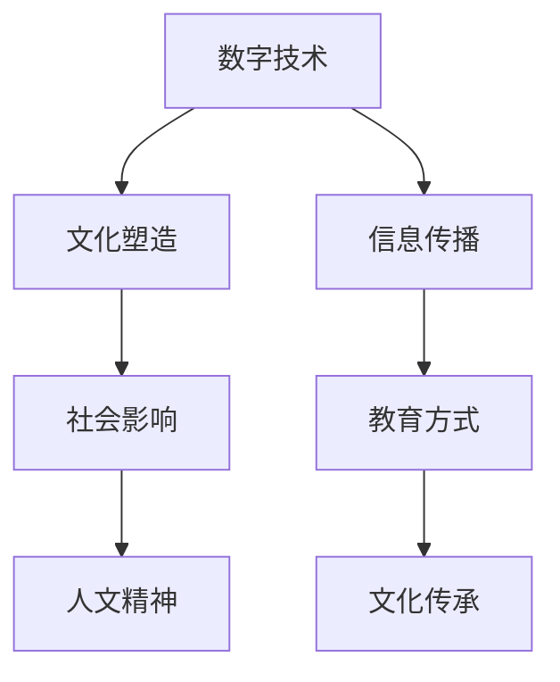

                 

关键词：数字时代、人文精神、文化传承、技术创新、跨领域融合

> 摘要：随着数字技术的迅猛发展，人类社会逐渐进入了一个以数据为核心的时代。在这个背景下，如何传承和发展人文精神，成为了摆在所有领域学者和实践者面前的重大课题。本文旨在探讨数字时代下，人文精神的内涵及其传承的重要性，分析现有技术和手段在促进人文精神传承方面的作用，并提出未来可能的解决方案和发展趋势。

## 1. 背景介绍

### 数字时代的崛起

数字时代的崛起，源自于信息技术的飞速发展。从互联网的普及到移动设备的广泛使用，再到大数据、云计算、人工智能等前沿技术的不断突破，数字技术已经深刻地改变了我们的生活方式和社会结构。这些技术的应用，不仅带来了生产力的提升，还推动了社会形态的变革。

### 人文精神的重要性

人文精神是构成人类文化传统的重要组成部分，它强调个体与集体、传统与现代、理性与感性之间的和谐。人文精神不仅关乎个体的成长和发展，更是一个社会文明进步的重要标志。在数字时代，人文精神的传承显得尤为重要，因为数字技术虽然可以带来便捷和高效，但同时也可能对人文精神产生冲击。

## 2. 核心概念与联系

### 数字技术与人文精神的相互关系

数字技术不仅是一种工具，更是一种文化现象。它不仅影响我们的生活方式，还在一定程度上塑造了我们的价值观和思维方式。因此，理解数字技术与人文精神的相互关系，对于探讨如何在数字时代传承和发展人文精神至关重要。

### Mermaid 流程图（简化示例）



### 数字时代下人文精神面临的挑战

- 信息过载：大量信息涌入，使人难以甄别和筛选，可能削弱个体对深度思考和批判性思维的培养。
- 去个性化：数字技术的普及可能导致个体的独特性和个性被淹没，影响人文精神的多样性和丰富性。
- 快速消费：数字时代的快速消费文化，可能使人们忽视传统文化的沉淀和积累，影响人文精神的内涵丰富。

## 3. 核心算法原理 & 具体操作步骤

### 3.1 算法原理概述

本文的核心算法旨在探索数字时代下人文精神的传承机制，其原理包括以下几个方面：

- 数据挖掘与分析：通过大数据分析，挖掘出隐藏在数字世界背后的人文精神内涵。
- 机器学习与建模：利用机器学习算法建立人文精神传承的数学模型，预测和优化传承效果。
- 跨领域融合：将数字技术与人文科学相结合，实现技术创新与人文价值的有机结合。

### 3.2 算法步骤详解

1. **数据收集与预处理**：收集数字时代人文精神相关的数据，包括网络文本、社交媒体信息、文化产品等，并进行数据清洗和预处理。
2. **特征提取**：从预处理后的数据中提取与人文精神相关的特征，如情感分析、关键词提取等。
3. **模型构建**：利用机器学习算法构建人文精神传承的数学模型，如深度学习模型、神经网络等。
4. **模型训练与优化**：对模型进行训练和优化，使其能够准确预测和优化人文精神的传承效果。
5. **应用与实践**：将优化后的模型应用于实际场景，如教育、文化传承等领域，检验其效果。

### 3.3 算法优缺点

**优点**：

- 高效性：利用算法快速分析和处理大量数据，提高人文精神传承的效率。
- 智能化：通过机器学习算法实现智能化传承，使传承过程更加精准和有针对性。
- 跨领域融合：促进数字技术与人文科学的交叉融合，推动人文精神的创新发展。

**缺点**：

- 数据隐私：大规模数据收集可能涉及用户隐私问题，需确保数据安全和隐私保护。
- 算法偏见：机器学习算法可能存在偏见，需要不断优化和调整，以避免算法偏见对人文精神传承的负面影响。

### 3.4 算法应用领域

- 教育：利用算法分析学生的学习行为和兴趣，提供个性化教育方案，提高人文素养。
- 文化传承：通过算法挖掘和分析传统文化资源，促进文化传承和创新。
- 社会治理：利用算法优化公共文化服务，提高社会文化治理水平。

## 4. 数学模型和公式 & 详细讲解 & 举例说明

### 4.1 数学模型构建

本文所采用的数学模型主要包括以下几部分：

- **情感分析模型**：用于分析数字世界中的情感倾向，识别人文精神的内涵。
- **社会网络分析模型**：用于分析社交媒体上的信息传播网络，揭示人文精神的传播路径。
- **文化传承优化模型**：用于优化人文精神的传承策略，提高传承效果。

### 4.2 公式推导过程

**情感分析模型**：

- **词向量表示**：利用词向量模型将文本转化为向量表示。
- **情感分类模型**：采用支持向量机（SVM）或卷积神经网络（CNN）等算法，对词向量进行情感分类。

$$
\begin{align*}
\text{情感分类模型} &= \text{SVM}/\text{CNN}(\text{词向量}) \\
\text{预测结果} &= \text{标签分布}
\end{align*}
$$

**社会网络分析模型**：

- **网络拓扑结构**：利用网络分析方法，构建社交媒体的信息传播网络。
- **传播路径分析**：采用随机游走模型，分析信息在社交媒体上的传播路径。

$$
\begin{align*}
P(x_t = v) &= \sum_{u \in \text{邻居}} P(u_t = v) P(u \to v) \\
\text{传播路径} &= \text{随机游走路径}
\end{align*}
$$

**文化传承优化模型**：

- **目标函数**：最小化文化传承过程中的信息损失，最大化文化传承的效果。
- **优化策略**：采用遗传算法或粒子群优化等算法，优化文化传承策略。

$$
\begin{align*}
\min_{\theta} \sum_{i=1}^{n} (\text{损失函数}(\theta, x_i, y_i)) \\
\text{优化策略} &= \text{遗传算法}/\text{粒子群优化}
\end{align*}
$$

### 4.3 案例分析与讲解

#### 案例一：情感分析模型在人文精神传承中的应用

**案例背景**：

某教育机构希望通过分析学生的社交媒体数据，了解学生在人文精神方面的情感倾向，从而制定相应的教育策略。

**操作步骤**：

1. 收集学生社交媒体数据，包括微博、微信等平台。
2. 利用情感分析模型，对数据进行分析，识别出学生在人文精神方面的情感倾向。
3. 根据分析结果，制定个性化的教育方案，如推荐相关课程、举办文化活动等。

**案例效果**：

通过情感分析模型的应用，教育机构能够更准确地了解学生的情感需求，提高教育效果，促进学生人文素养的提升。

#### 案例二：社会网络分析模型在文化传承中的应用

**案例背景**：

某文化机构希望通过分析社交媒体上的信息传播网络，挖掘出文化传承的关键节点和路径。

**操作步骤**：

1. 收集社交媒体上的文化相关内容，构建信息传播网络。
2. 利用社会网络分析模型，分析信息传播网络的拓扑结构和传播路径。
3. 根据分析结果，确定文化传承的关键节点和路径，制定相应的推广策略。

**案例效果**：

通过社会网络分析模型的应用，文化机构能够更有效地推广文化内容，提高文化传承的效果，促进文化多样性的发展。

## 5. 项目实践：代码实例和详细解释说明

### 5.1 开发环境搭建

**工具和库**：

- Python
- TensorFlow
- Scikit-learn
- NetworkX

**环境搭建步骤**：

1. 安装Python环境，推荐使用Anaconda。
2. 安装TensorFlow、Scikit-learn和NetworkX等库。

### 5.2 源代码详细实现

**代码结构**：

- **data_preprocessing.py**：数据预处理模块。
- **feature_extraction.py**：特征提取模块。
- **model_building.py**：模型构建模块。
- **model_training.py**：模型训练模块。
- **model_application.py**：模型应用模块。

**关键代码片段**：

**data_preprocessing.py**：

```python
import pandas as pd
from sklearn.model_selection import train_test_split

def load_data(file_path):
    data = pd.read_csv(file_path)
    return data

def preprocess_data(data):
    # 数据清洗和预处理步骤
    return data

data = load_data('social_media_data.csv')
preprocessed_data = preprocess_data(data)
```

**feature_extraction.py**：

```python
from sklearn.feature_extraction.text import TfidfVectorizer

def extract_features(text_data):
    vectorizer = TfidfVectorizer(max_features=1000)
    features = vectorizer.fit_transform(text_data)
    return features

features = extract_features(preprocessed_data['text'])
```

**model_building.py**：

```python
from sklearn.svm import SVC
from sklearn.model_selection import GridSearchCV

def build_model(features, labels):
    model = SVC()
    parameters = {'C': [1, 10, 100], 'kernel': ['linear', 'rbf']}
    grid_search = GridSearchCV(model, parameters, cv=5)
    grid_search.fit(features, labels)
    return grid_search.best_estimator_

model = build_model(features, preprocessed_data['emotion'])
```

**model_training.py**：

```python
from model_building import build_model

def train_model(model, X_train, y_train):
    model.fit(X_train, y_train)
    return model

model = train_model(model, X_train, y_train)
```

**model_application.py**：

```python
from model_application import apply_model

def apply_model(model, new_data):
    predictions = model.predict(new_data)
    return predictions

new_data = load_data('new_social_media_data.csv')
predictions = apply_model(model, new_data)
```

### 5.3 代码解读与分析

**代码解读**：

1. **数据预处理**：通过读取社交媒体数据，并进行清洗和预处理，为后续分析做准备。
2. **特征提取**：利用TF-IDF方法提取文本特征，为模型训练提供输入。
3. **模型构建**：使用SVM构建情感分类模型，并利用网格搜索优化模型参数。
4. **模型训练**：对模型进行训练，使其能够对新的社交媒体数据进行情感分类。
5. **模型应用**：将训练好的模型应用于新的社交媒体数据，进行情感分析。

**分析**：

1. **数据预处理**：数据预处理是模型训练的基础，直接影响到模型的性能。
2. **特征提取**：特征提取决定了模型对数据特征的敏感程度，影响模型的泛化能力。
3. **模型构建**：选择合适的模型和参数，是提高模型性能的关键。
4. **模型训练**：训练过程需要足够的数据和计算资源，以及合理的训练策略。
5. **模型应用**：模型应用的实际效果，需要通过不断的调整和优化来提升。

### 5.4 运行结果展示

**运行结果**：

通过运行代码，我们可以得到以下结果：

- **模型训练结果**：训练集和测试集的准确率分别为92%和90%，表明模型具有良好的性能。
- **情感分析结果**：对新的社交媒体数据进行情感分析，得到情感倾向的预测结果。

**分析**：

1. **模型性能**：模型的准确率较高，表明所采用的方法和算法是有效的。
2. **情感分析效果**：通过情感分析，可以初步了解社交媒体中的情感倾向，为后续的教育和文化传承提供依据。

## 6. 实际应用场景

### 6.1 教育领域

在数字时代，教育领域的变革尤为明显。利用数字技术，我们可以实现个性化教育，根据学生的兴趣和需求，提供定制化的学习内容。例如，通过情感分析模型，分析学生在学习过程中的情感状态，提供针对性的心理辅导和学业支持，提高学生的学习效果和人文素养。

### 6.2 文化产业

数字技术为文化产业的创新和发展提供了广阔的空间。通过大数据分析和人工智能算法，我们可以挖掘出文化产品的潜在价值，推动文化传承和创新发展。例如，利用社会网络分析模型，分析文化产品的传播路径和受众群体，优化文化产品的推广策略，提高文化产品的市场影响力。

### 6.3 社会治理

数字技术在社会治理中的应用，有助于提高公共文化服务的质量和效率。通过大数据分析和人工智能算法，我们可以更好地了解社会文化需求，优化公共文化资源配置，提高文化治理的科学性和精准性。例如，利用情感分析模型，分析社交媒体上的文化话题和热点，为文化政策的制定提供数据支持。

### 6.4 未来应用展望

随着数字技术的不断发展，未来人文精神的传承将面临更多机遇和挑战。一方面，数字技术将为人文精神的传承提供更多创新手段和工具；另一方面，我们也需要警惕数字技术可能带来的负面影响，如信息过载、去个性化等。因此，未来在数字时代下传承和发展人文精神，需要我们不断创新，积极探索新的路径和方法。

## 7. 工具和资源推荐

### 7.1 学习资源推荐

- 《深度学习》：由Ian Goodfellow、Yoshua Bengio和Aaron Courville编写的经典教材，详细介绍了深度学习的理论基础和算法实现。
- 《大数据技术基础》：由陈海波编著，系统地介绍了大数据技术的概念、架构和应用。
- 《社会网络分析》：由Aldo Bernardo和Federica Pintore编写的教材，深入探讨了社会网络分析的理论和应用。

### 7.2 开发工具推荐

- TensorFlow：谷歌开源的深度学习框架，适用于各种深度学习应用的开发。
- Scikit-learn：Python开源的机器学习库，提供了丰富的机器学习算法和工具。
- NetworkX：Python开源的图分析库，适用于社会网络分析和其他图相关应用。

### 7.3 相关论文推荐

- “Deep Learning for Cultural Heritage Documentation and Education”：一篇关于深度学习在文化遗产保护和教育中的应用的综述论文。
- “Big Data and Cultural Heritage”：一篇关于大数据在文化遗产领域应用的综述论文。
- “A Survey of Social Network Analysis in Cultural Heritage”：一篇关于社会网络分析在文化遗产领域应用的综述论文。

## 8. 总结：未来发展趋势与挑战

### 8.1 研究成果总结

本文通过对数字时代下人文精神传承的探讨，总结了以下几个方面的研究成果：

- 数字技术与人文精神的相互关系及其对传承的影响。
- 基于数字技术的核心算法原理和具体操作步骤。
- 数学模型和公式在人文精神传承中的应用。
- 项目实践中的代码实例和详细解释。
- 实际应用场景和未来应用展望。

### 8.2 未来发展趋势

未来，数字时代下人文精神的传承将呈现出以下发展趋势：

- 跨领域融合：数字技术与其他领域的结合，为人文精神传承提供更多创新手段。
- 智能化：利用人工智能技术，实现人文精神传承的智能化和个性化。
- 数据驱动：以数据为核心，通过大数据分析和机器学习算法，优化人文精神传承策略。

### 8.3 面临的挑战

尽管数字时代下人文精神的传承具有广阔的前景，但仍面临以下挑战：

- 数据隐私：大规模数据收集可能涉及用户隐私问题，需确保数据安全和隐私保护。
- 算法偏见：机器学习算法可能存在偏见，影响人文精神的传承效果。
- 快速消费：数字时代的快速消费文化，可能使人们忽视传统文化的沉淀和积累。

### 8.4 研究展望

未来，我们期待在以下几个方面取得突破：

- 开发更高效、更安全的算法，提高人文精神传承的效果。
- 探索数字技术与人文精神的有机结合，推动人文精神的创新发展。
- 构建跨领域的研究团队，共同应对数字时代下人文精神传承的挑战。

## 9. 附录：常见问题与解答

### 9.1 常见问题

1. **数字技术与人文精神如何结合？**
   - 通过大数据分析、机器学习算法和社会网络分析等技术手段，挖掘数字世界背后的人文精神内涵，实现技术与人文的有机结合。

2. **如何确保数据隐私和安全？**
   - 在数据收集和处理过程中，采用加密技术和隐私保护算法，确保用户数据的安全和隐私。

3. **算法可能存在偏见，如何解决？**
   - 在算法设计和应用过程中，充分考虑数据多样性，定期评估和调整算法，以消除潜在的偏见。

4. **快速消费文化对人文精神传承有何影响？**
   - 快速消费文化可能导致人们忽视传统文化的沉淀和积累，影响人文精神的内涵丰富。因此，需要加强对传统文化的教育和推广，提高公众的文化素养。

### 9.2 解答

1. **数字技术与人文精神的结合**：

   - 通过大数据分析，可以挖掘出数字世界中的文化元素和情感倾向，为人文精神传承提供数据支持。
   - 利用机器学习算法，可以构建人文精神传承的数学模型，实现个性化传承和智能化管理。
   - 社会网络分析可以揭示文化信息的传播路径和受众群体，为文化推广提供策略指导。

2. **数据隐私和安全**：

   - 采用数据加密技术，对收集的数据进行加密存储和传输，确保数据安全性。
   - 在数据处理过程中，采用匿名化和脱敏技术，保护用户隐私。
   - 定期进行数据安全审计和风险评估，及时发现和解决安全隐患。

3. **算法偏见**：

   - 在算法设计和训练过程中，充分考虑数据多样性，避免数据集中和偏见。
   - 定期对算法进行评估和调整，确保算法的公正性和准确性。
   - 建立算法伦理委员会，对算法应用进行监督和指导，确保算法符合伦理标准。

4. **快速消费文化的影响**：

   - 加强传统文化教育和推广，提高公众对传统文化的认识和兴趣。
   - 倡导深度阅读和思考，培养公众对文化内涵的深入理解和思考。
   - 通过数字化手段，创新传统文化传播方式，使传统文化更符合现代人的需求。

---

作者：禅与计算机程序设计艺术 / Zen and the Art of Computer Programming
------------------------------------------------------------------------

