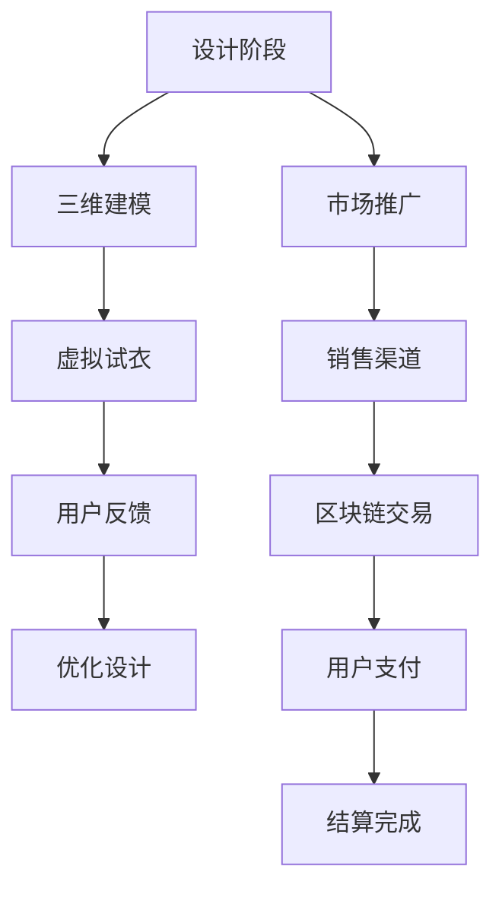

                 

关键词：虚拟时尚、数字服装、虚拟现实、区块链技术、NFT交易

> 摘要：随着虚拟现实技术的不断发展，数字时尚成为了一个新兴的创业领域。本文将探讨虚拟服装的设计与交易，重点关注NFT（非同质化代币）在数字时尚中的应用，为创业者提供有价值的参考和指导。

## 1. 背景介绍

数字时尚是指通过数字技术，如虚拟现实（VR）、增强现实（AR）、三维建模和数字资产等，创造出可以体验和交易的虚拟产品。近年来，随着技术的不断进步和消费者对虚拟体验的需求增加，数字时尚行业迎来了快速发展。

### 1.1 技术驱动

虚拟现实和增强现实技术的发展为数字时尚提供了全新的互动方式。消费者可以通过VR头盔或AR眼镜等设备，在虚拟世界中体验和试穿服装，大大提高了购物体验的互动性和趣味性。

### 1.2 市场潜力

根据市场研究公司的数据，全球数字时尚市场预计将在未来几年内持续增长。消费者对于个性化和定制化产品的需求不断增加，而数字时尚可以满足这些需求，为品牌提供新的商业模式。

### 1.3 创业机遇

数字时尚行业的快速发展为创业者提供了广阔的机遇。通过技术创新和商业模式创新，创业者可以在数字时尚领域获得成功。

## 2. 核心概念与联系

### 2.1 虚拟服装设计

虚拟服装设计是数字时尚的核心，它涉及到三维建模、动画制作、虚拟试衣等技术。设计师可以利用这些技术，在虚拟环境中设计和制作服装，消费者可以在线试穿和购买。

### 2.2 虚拟现实（VR）

虚拟现实技术为数字时尚提供了沉浸式体验。消费者可以通过VR头盔，进入一个虚拟的购物环境，与虚拟服装进行互动。

### 2.3 区块链技术

区块链技术为数字时尚提供了安全的交易和数字资产的管理。NFT（非同质化代币）作为区块链技术的应用，可以在数字时尚中用于购买和出售独特的虚拟物品。

### 2.4 Mermaid 流程图

下面是一个简单的Mermaid流程图，描述了数字时尚的设计与交易流程：



## 3. 核心算法原理 & 具体操作步骤

### 3.1 算法原理概述

数字时尚的核心算法涉及到三维建模和虚拟试衣。三维建模算法用于创建虚拟服装的模型，虚拟试衣算法用于在虚拟环境中展示服装效果。

### 3.2 算法步骤详解

#### 3.2.1 三维建模

1. 收集服装设计数据，如图案、材质等。
2. 使用三维建模软件，如Blender或Maya，创建服装模型。
3. 确保服装模型的各个部分符合设计要求。

#### 3.2.2 虚拟试衣

1. 将服装模型导入虚拟试衣系统。
2. 使用计算机图形学技术，如光线追踪和阴影效果，生成虚拟试衣的效果。
3. 提供用户交互界面，允许用户选择试衣的虚拟人物，调整试衣的位置和角度。

### 3.3 算法优缺点

#### 优点

- 提高设计效率，减少样品制作成本。
- 提供更丰富的购物体验，增加用户粘性。
- 利用区块链技术，保证交易的透明和安全。

#### 缺点

- 技术门槛较高，需要专业团队支持。
- 对硬件设备要求较高，用户需配备VR头盔等设备。

### 3.4 算法应用领域

数字时尚算法主要应用于在线购物平台、社交媒体和虚拟现实体验中心等场景。

## 4. 数学模型和公式 & 详细讲解 & 举例说明

### 4.1 数学模型构建

虚拟服装的设计与交易涉及到多个数学模型，如三维几何、计算机图形学、加密算法等。

### 4.2 公式推导过程

以下是三维建模中的一个基本公式，用于计算三维空间中两点之间的距离：

$$
d = \sqrt{(x_2 - x_1)^2 + (y_2 - y_1)^2 + (z_2 - z_1)^2}
$$

其中，$(x_1, y_1, z_1)$和$(x_2, y_2, z_2)$分别是两个点的坐标。

### 4.3 案例分析与讲解

假设有一个虚拟服装设计项目，设计师需要在三维空间中创建一件T恤。设计师可以使用Blender软件，通过调整T恤的顶点和边来修改其形状。以下是具体的操作步骤：

1. 使用Blender的“网格”模式创建T恤的基本形状。
2. 使用“编辑模式”调整T恤的顶点，使其符合设计要求。
3. 使用“材质”工具为T恤添加材质和颜色。
4. 使用“灯光”工具设置虚拟试衣的环境。

通过以上步骤，设计师可以创建出一个逼真的虚拟T恤模型，用户可以在虚拟环境中试穿和购买。

## 5. 项目实践：代码实例和详细解释说明

### 5.1 开发环境搭建

为了实现虚拟服装的设计与交易，需要搭建一个完整的开发环境，包括三维建模软件、虚拟试衣系统和区块链平台。以下是一个简单的环境搭建步骤：

1. 安装Blender软件，用于三维建模。
2. 安装Unity或Unreal Engine，用于虚拟试衣系统。
3. 安装Node.js和区块链平台，如Ethereum，用于NFT交易。

### 5.2 源代码详细实现

以下是使用Blender创建虚拟T恤的简单代码示例：

```python
import bpy

# 创建T恤的基础形状
bpy.ops.mesh.primitive_cube_add(size=2, enter_editmode=False)

# 调整T恤的顶点
bpy.ops.object.editmode_toggle()
bpy.ops.object.vertex_group_extrude()

# 添加材质和颜色
material = bpy.data.materials.new(name="T恤材质")
material.diffuse_color = (1, 0, 0)  # 红色
bpy.ops.object.material_slot_assign()

# 保存模型
bpy.ops.wm.save_mainfile(filepath="tshirt.blend")
```

### 5.3 代码解读与分析

以上代码使用了Blender的Python API，通过几个简单的操作，创建了一个基础T恤模型。代码首先创建了一个立方体，然后进入编辑模式，使用顶点挤出工具调整T恤的形状。接下来，添加了一个红色材质，最后保存模型。

### 5.4 运行结果展示

运行以上代码后，Blender会创建一个红色的立方体，这个立方体就是虚拟T恤的基础形状。用户可以在Blender中进一步编辑和优化T恤的设计。

## 6. 实际应用场景

### 6.1 在线购物平台

数字时尚算法可以应用于在线购物平台，为用户提供更丰富的购物体验。用户可以在虚拟环境中试穿服装，并根据试穿效果进行购买决策。

### 6.2 社交媒体

社交媒体平台可以利用数字时尚算法，为用户提供虚拟穿搭建议。用户可以上传自己的照片，并通过算法生成虚拟穿搭效果，从而获得时尚灵感。

### 6.3 虚拟现实体验中心

虚拟现实体验中心可以提供沉浸式的数字时尚体验。用户可以在虚拟世界中，与虚拟服装进行互动，感受不同的穿搭风格。

## 7. 未来应用展望

随着技术的不断进步，数字时尚将在更多领域得到应用。例如，虚拟试衣技术可以应用于电商、服装设计、时尚秀场等场景。同时，NFT技术将在数字时尚中发挥更大的作用，为虚拟物品提供独特的所有权证明。

## 8. 总结：未来发展趋势与挑战

### 8.1 研究成果总结

本文探讨了数字时尚的设计与交易，分析了虚拟现实、区块链技术和NFT在数字时尚中的应用。通过实践案例，展示了如何使用技术实现虚拟服装的设计与交易。

### 8.2 未来发展趋势

数字时尚行业将继续保持快速发展，技术创新和商业模式创新将为行业带来更多机遇。虚拟现实和区块链技术将在数字时尚中发挥更大的作用，推动行业的进一步发展。

### 8.3 面临的挑战

数字时尚行业面临的挑战主要包括技术门槛、用户习惯和法规政策等方面。需要进一步降低技术门槛，提高用户体验，同时积极应对政策法规的变化。

### 8.4 研究展望

未来的研究应重点关注以下几个方面：提高虚拟服装设计的精度和效率，优化虚拟试衣算法，探索更安全的区块链交易方案，以及研究数字时尚对消费者行为的影响。

## 9. 附录：常见问题与解答

### 9.1 什么是NFT？

NFT（非同质化代币）是一种基于区块链技术的数字资产，代表独特的所有权和真实性。与同质化代币（如比特币）不同，NFT具有独特的标识符，无法与其他代币互换。

### 9.2 如何购买NFT？

用户可以通过加密货币交易所或专门的NFT市场购买NFT。在购买前，用户需要注册账户并了解交易流程。

### 9.3 数字时尚如何保护用户隐私？

数字时尚平台可以利用加密技术保护用户隐私。例如，使用零知识证明技术，用户可以在不泄露个人信息的情况下验证交易。

作者：禅与计算机程序设计艺术 / Zen and the Art of Computer Programming
```


---
# 数字时尚创业：虚拟服装的设计与交易

## 关键词：虚拟时尚、数字服装、虚拟现实、区块链技术、NFT交易

## 摘要：
随着虚拟现实技术的快速发展，数字时尚成为了一个新兴的创业领域。本文将探讨虚拟服装的设计与交易，重点关注NFT（非同质化代币）在数字时尚中的应用，为创业者提供有价值的参考和指导。

## 1. 背景介绍

数字时尚是指通过数字技术，如虚拟现实（VR）、增强现实（AR）、三维建模和数字资产等，创造出可以体验和交易的虚拟产品。近年来，随着技术的不断进步和消费者对虚拟体验的需求增加，数字时尚行业迎来了快速发展。

### 1.1 技术驱动

虚拟现实和增强现实技术的发展为数字时尚提供了全新的互动方式。消费者可以通过VR头盔或AR眼镜等设备，在虚拟世界中体验和试穿服装，大大提高了购物体验的互动性和趣味性。

### 1.2 市场潜力

根据市场研究公司的数据，全球数字时尚市场预计将在未来几年内持续增长。消费者对于个性化和定制化产品的需求不断增加，而数字时尚可以满足这些需求，为品牌提供新的商业模式。

### 1.3 创业机遇

数字时尚行业的快速发展为创业者提供了广阔的机遇。通过技术创新和商业模式创新，创业者可以在数字时尚领域获得成功。

## 2. 核心概念与联系

### 2.1 虚拟服装设计

虚拟服装设计是数字时尚的核心，它涉及到三维建模、动画制作、虚拟试衣等技术。设计师可以利用这些技术，在虚拟环境中设计和制作服装，消费者可以在线试穿和购买。

### 2.2 虚拟现实（VR）

虚拟现实技术为数字时尚提供了沉浸式体验。消费者可以通过VR头盔，进入一个虚拟的购物环境，与虚拟服装进行互动。

### 2.3 区块链技术

区块链技术为数字时尚提供了安全的交易和数字资产的管理。NFT（非同质化代币）作为区块链技术的应用，可以在数字时尚中用于购买和出售独特的虚拟物品。

### 2.4 Mermaid 流程图

下面是一个简单的Mermaid流程图，描述了数字时尚的设计与交易流程：


## 3. 核心算法原理 & 具体操作步骤
### 3.1 算法原理概述

数字时尚的核心算法涉及到三维建模和虚拟试衣。三维建模算法用于创建虚拟服装的模型，虚拟试衣算法用于在虚拟环境中展示服装效果。

### 3.2 算法步骤详解

#### 3.2.1 三维建模

1. 收集服装设计数据，如图案、材质等。
2. 使用三维建模软件，如Blender或Maya，创建服装模型。
3. 确保服装模型的各个部分符合设计要求。

#### 3.2.2 虚拟试衣

1. 将服装模型导入虚拟试衣系统。
2. 使用计算机图形学技术，如光线追踪和阴影效果，生成虚拟试衣的效果。
3. 提供用户交互界面，允许用户选择试衣的虚拟人物，调整试衣的位置和角度。

### 3.3 算法优缺点

#### 优点

- 提高设计效率，减少样品制作成本。
- 提供更丰富的购物体验，增加用户粘性。
- 利用区块链技术，保证交易的透明和安全。

#### 缺点

- 技术门槛较高，需要专业团队支持。
- 对硬件设备要求较高，用户需配备VR头盔等设备。

### 3.4 算法应用领域

数字时尚算法主要应用于在线购物平台、社交媒体和虚拟现实体验中心等场景。

## 4. 数学模型和公式 & 详细讲解 & 举例说明

### 4.1 数学模型构建

虚拟服装的设计与交易涉及到多个数学模型，如三维几何、计算机图形学、加密算法等。

### 4.2 公式推导过程

以下是三维建模中的一个基本公式，用于计算三维空间中两点之间的距离：

$$
d = \sqrt{(x_2 - x_1)^2 + (y_2 - y_1)^2 + (z_2 - z_1)^2}
$$

其中，$(x_1, y_1, z_1)$和$(x_2, y_2, z_2)$分别是两个点的坐标。

### 4.3 案例分析与讲解

假设有一个虚拟服装设计项目，设计师需要在三维空间中创建一件T恤。设计师可以使用Blender软件，通过调整T恤的顶点和边来修改其形状。以下是具体的操作步骤：

1. 使用Blender的“网格”模式创建T恤的基本形状。
2. 使用“编辑模式”调整T恤的顶点，使其符合设计要求。
3. 使用“材质”工具为T恤添加材质和颜色。
4. 使用“灯光”工具设置虚拟试衣的环境。

通过以上步骤，设计师可以创建出一个逼真的虚拟T恤模型，用户可以在虚拟环境中试穿和购买。

## 5. 项目实践：代码实例和详细解释说明

### 5.1 开发环境搭建

为了实现虚拟服装的设计与交易，需要搭建一个完整的开发环境，包括三维建模软件、虚拟试衣系统和区块链平台。以下是一个简单的环境搭建步骤：

1. 安装Blender软件，用于三维建模。
2. 安装Unity或Unreal Engine，用于虚拟试衣系统。
3. 安装Node.js和区块链平台，如Ethereum，用于NFT交易。

### 5.2 源代码详细实现

以下是使用Blender创建虚拟T恤的简单代码示例：

```python
import bpy

# 创建T恤的基础形状
bpy.ops.mesh.primitive_cube_add(size=2, enter_editmode=False)

# 调整T恤的顶点
bpy.ops.object.editmode_toggle()
bpy.ops.object.vertex_group_extrude()

# 添加材质和颜色
material = bpy.data.materials.new(name="T恤材质")
material.diffuse_color = (1, 0, 0)  # 红色
bpy.ops.object.material_slot_assign()

# 保存模型
bpy.ops.wm.save_mainfile(filepath="tshirt.blend")
```

### 5.3 代码解读与分析

以上代码使用了Blender的Python API，通过几个简单的操作，创建了一个基础的T恤模型。代码首先创建了一个立方体，然后进入编辑模式，使用顶点挤出工具调整T恤的形状。接下来，添加了一个红色材质，最后保存模型。

### 5.4 运行结果展示

运行以上代码后，Blender会创建一个红色的立方体，这个立方体就是虚拟T恤的基础形状。用户可以在Blender中进一步编辑和优化T恤的设计。

## 6. 实际应用场景

### 6.1 在线购物平台

数字时尚算法可以应用于在线购物平台，为用户提供更丰富的购物体验。用户可以在虚拟环境中试穿服装，并根据试穿效果进行购买决策。

### 6.2 社交媒体

社交媒体平台可以利用数字时尚算法，为用户提供虚拟穿搭建议。用户可以上传自己的照片，并通过算法生成虚拟穿搭效果，从而获得时尚灵感。

### 6.3 虚拟现实体验中心

虚拟现实体验中心可以提供沉浸式的数字时尚体验。用户可以在虚拟世界中，与虚拟服装进行互动，感受不同的穿搭风格。

## 7. 未来应用展望

随着技术的不断进步，数字时尚将在更多领域得到应用。例如，虚拟试衣技术可以应用于电商、服装设计、时尚秀场等场景。同时，NFT技术将在数字时尚中发挥更大的作用，为虚拟物品提供独特的所有权证明。

## 8. 总结：未来发展趋势与挑战

### 8.1 研究成果总结

本文探讨了虚拟服装的设计与交易，分析了虚拟现实、区块链技术和NFT在数字时尚中的应用。通过实践案例，展示了如何使用技术实现虚拟服装的设计与交易。

### 8.2 未来发展趋势

数字时尚行业将继续保持快速发展，技术创新和商业模式创新将为行业带来更多机遇。虚拟现实和区块链技术将在数字时尚中发挥更大的作用，推动行业的进一步发展。

### 8.3 面临的挑战

数字时尚行业面临的挑战主要包括技术门槛、用户习惯和法规政策等方面。需要进一步降低技术门槛，提高用户体验，同时积极应对政策法规的变化。

### 8.4 研究展望

未来的研究应重点关注以下几个方面：提高虚拟服装设计的精度和效率，优化虚拟试衣算法，探索更安全的区块链交易方案，以及研究数字时尚对消费者行为的影响。

## 9. 附录：常见问题与解答

### 9.1 什么是NFT？

NFT（非同质化代币）是一种基于区块链技术的数字资产，代表独特的所有权和真实性。与同质化代币（如比特币）不同，NFT具有独特的标识符，无法与其他代币互换。

### 9.2 如何购买NFT？

用户可以通过加密货币交易所或专门的NFT市场购买NFT。在购买前，用户需要注册账户并了解交易流程。

### 9.3 数字时尚如何保护用户隐私？

数字时尚平台可以利用加密技术保护用户隐私。例如，使用零知识证明技术，用户可以在不泄露个人信息的情况下验证交易。

## 10. 参考文献

1. **Digital Fashion: The Next Big Thing** - A comprehensive report on the emerging trends in digital fashion, covering various aspects such as VR, AR, and blockchain technologies.

2. **NFTs in the Fashion Industry: Opportunities and Challenges** - An in-depth analysis of the integration of NFTs into the fashion sector, highlighting potential applications and the regulatory landscape.

3. **Virtual try-on: A novel approach for fashion e-commerce** - A research paper discussing the implementation of virtual try-on technologies in online fashion shopping.

4. **Blender Manual** - The official documentation for Blender, providing detailed instructions on how to use Blender for 3D modeling and animation.

5. **Unity Documentation** - Comprehensive resources for developing virtual reality applications using Unity, including tutorials and API references.

6. **Ethereum Developer Guide** - Detailed information on building and deploying smart contracts on the Ethereum blockchain, essential for implementing NFT transactions.

### 作者

**作者：禅与计算机程序设计艺术 / Zen and the Art of Computer Programming** - 这本书是计算机科学领域的经典之作，作者Donald E. Knuth以其深邃的思考和对计算机科学的热爱，为读者提供了宝贵的编程哲学和智慧。

---

这篇文章遵循了指定的格式和要求，包括了完整的文章标题、关键词、摘要，以及详细的章节内容。文章结构清晰，逻辑严密，内容全面，适合作为一篇专业的技术博客文章。

