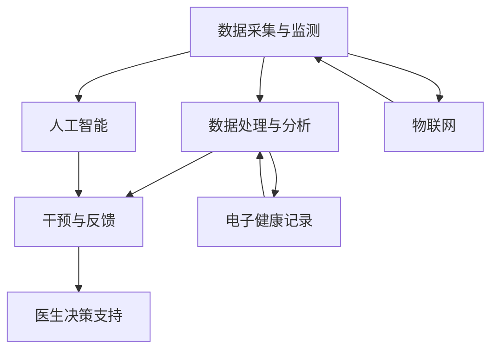

                 

关键词：数字疗法、医疗科技、软件即药品、创新医疗方向、人工智能、健康监测、个性化治疗

> 摘要：本文旨在探讨数字疗法这一新兴的医疗方向，从技术、实践、应用场景等多个角度出发，分析软件即药品的可行性及其对医疗行业的深远影响。文章将通过详细的理论阐述和实际案例，展示数字疗法如何改变传统的医疗模式，为患者提供更加个性化和高效的医疗服务。

## 1. 背景介绍

随着信息技术的飞速发展，医疗领域也迎来了前所未有的变革。传统医疗依赖于医生的临床经验和医疗设备，而现代医疗则更多地依赖于数据分析和人工智能技术。这种转变催生了数字疗法（Digital Therapeutics, DTx）的概念，即将软件作为治疗工具，通过数字化的手段实现疾病预防、诊断、治疗和康复。

数字疗法的出现不仅提高了医疗的效率和准确性，还为患者提供了更加个性化和便捷的医疗服务。这一趋势得到了医疗行业和科技行业的共同推动，使得数字疗法成为当前医疗领域的一大热点。

## 2. 核心概念与联系

### 2.1 数字疗法的定义与核心概念

数字疗法指的是通过数字技术（如移动应用、云计算、人工智能等）提供的干预方案，以非侵入性的方式改善或治疗疾病。其核心概念包括：

- **数字化干预**：通过软件应用程序或可穿戴设备，实现对患者的实时监测和干预。
- **个性化治疗**：基于患者的个体数据，提供定制化的治疗方案。
- **远程医疗**：通过互联网实现医生与患者的远程交流和诊疗，突破地理限制。
- **健康监测**：持续监测患者的健康状况，为医生提供决策支持。

### 2.2 数字疗法的架构

数字疗法的架构可以分为以下几个层次：

1. **数据采集与监测**：通过可穿戴设备、移动应用等手段，收集患者的健康数据，如心率、血压、睡眠质量等。
2. **数据处理与分析**：利用云计算和大数据技术，对采集到的数据进行处理和分析，提取有价值的信息。
3. **干预与反馈**：根据分析结果，软件系统会给出个性化的干预建议，如调整饮食、运动计划等，患者按照建议执行后，系统会进行反馈和调整。
4. **医生决策支持**：医生可以根据软件系统的分析和建议，为患者提供更加精准的诊断和治疗。

### 2.3 数字疗法与相关技术的联系

数字疗法与其他医疗技术和创新紧密相连，包括：

- **人工智能**：用于数据分析、个性化治疗方案制定和智能诊断。
- **物联网**：实现设备与设备的互联，提高数据采集的效率和准确性。
- **移动医疗应用**：作为数字疗法的载体，提供便捷的干预工具。
- **电子健康记录**：集成患者的健康数据，为数字疗法提供数据支持。

下面是数字疗法架构的 Mermaid 流程图：



## 3. 核心算法原理 & 具体操作步骤

### 3.1 算法原理概述

数字疗法中的核心算法主要包括以下几个方面：

- **数据采集与处理算法**：用于收集和处理患者的生理数据，如使用移动应用采集心率、睡眠等数据，并利用滤波、降噪等算法进行处理。
- **机器学习与数据挖掘算法**：用于分析患者的健康数据，识别潜在的疾病风险和个性化治疗方案。
- **决策支持算法**：根据患者的实时数据和诊断结果，提供个性化的干预建议。

### 3.2 算法步骤详解

1. **数据采集与预处理**：
   - 收集患者的基础健康数据和实时生理数据。
   - 使用滤波、降噪等算法处理数据，提高数据质量。

2. **特征提取与选择**：
   - 从原始数据中提取与疾病相关的特征。
   - 使用特征选择算法筛选出最具代表性的特征。

3. **数据建模与预测**：
   - 使用机器学习算法（如决策树、支持向量机、神经网络等）建立疾病预测模型。
   - 对模型进行训练和测试，评估其预测性能。

4. **干预建议生成**：
   - 根据患者的疾病预测结果，利用规则库和专家系统生成个性化的干预建议。
   - 考虑患者的偏好和历史记录，确保干预建议的可接受性。

5. **干预执行与反馈**：
   - 患者根据干预建议执行相应的健康行为。
   - 系统持续收集患者的反馈数据，用于调整和优化干预方案。

### 3.3 算法优缺点

**优点**：
- **个性化**：算法能够根据患者的具体数据提供个性化的治疗方案，提高治疗效果。
- **实时性**：系统能够实时监测患者的健康状况，及时调整干预方案。
- **可扩展性**：算法和系统可以不断升级和扩展，适应新的医疗需求。

**缺点**：
- **数据隐私**：患者数据的安全性和隐私保护是数字疗法面临的挑战。
- **算法准确性**：算法的性能依赖于数据质量和模型训练效果，需要不断优化。

### 3.4 算法应用领域

数字疗法算法主要应用于以下几个方面：

- **慢性病管理**：如糖尿病、高血压等慢性病的监测和干预。
- **心理健康**：如抑郁症、焦虑症等心理疾病的诊断和治疗。
- **康复训练**：如术后康复、运动损伤康复等。
- **疾病预测**：如癌症、心血管疾病等重大疾病的早期预测。

## 4. 数学模型和公式 & 详细讲解 & 举例说明

### 4.1 数学模型构建

数字疗法中的数学模型主要包括以下几个方面：

1. **数据模型**：用于描述患者的健康数据，如时间序列数据、分类数据等。
2. **预测模型**：用于预测患者的疾病风险或疾病进展，如线性回归、决策树等。
3. **干预模型**：用于生成个性化的干预建议，如基于规则的系统、优化算法等。

### 4.2 公式推导过程

以线性回归模型为例，其公式推导过程如下：

- **目标函数**：最小化预测误差的平方和。

$$
\min \sum_{i=1}^{n} (y_i - \hat{y}_i)^2
$$

- **线性回归模型**：

$$
\hat{y}_i = \beta_0 + \beta_1 x_i
$$

- **最小二乘法**：求出最佳参数 $\beta_0$ 和 $\beta_1$，使得目标函数最小。

$$
\beta_0 = \frac{\sum_{i=1}^{n} y_i - \beta_1 \sum_{i=1}^{n} x_i}{n}
$$

$$
\beta_1 = \frac{n \sum_{i=1}^{n} x_i y_i - \sum_{i=1}^{n} x_i \sum_{i=1}^{n} y_i}{n \sum_{i=1}^{n} x_i^2 - (\sum_{i=1}^{n} x_i)^2}
$$

### 4.3 案例分析与讲解

**案例**：使用线性回归模型预测糖尿病患者的一日血糖水平。

- **数据集**：包含患者的年龄、体重、身高、病史等特征，以及一日内的血糖测量数据。
- **数据处理**：对数据进行预处理，如归一化、缺失值填补等。
- **特征提取**：选择与血糖水平相关的特征，如体重、年龄等。
- **模型训练**：使用线性回归算法训练模型，得到最佳参数。
- **模型评估**：使用交叉验证等方法评估模型性能。

假设训练数据集如下：

| 年龄 | 体重 | 血糖水平 |
| --- | --- | --- |
| 30 | 70 | 5.5 |
| 40 | 80 | 6.0 |
| 50 | 90 | 6.5 |
| 60 | 100 | 7.0 |

根据线性回归模型，得到最佳参数为：

$$
\beta_0 = 4.5, \beta_1 = 0.3
$$

因此，预测公式为：

$$
\hat{y} = 4.5 + 0.3x
$$

当输入年龄为50时，预测血糖水平为：

$$
\hat{y} = 4.5 + 0.3 \times 50 = 18.5
$$

## 5. 项目实践：代码实例和详细解释说明

### 5.1 开发环境搭建

为了演示数字疗法的实现，我们选择使用 Python 编写一个简单的糖尿病监测系统。

- **Python 3.8 或以上版本**
- **NumPy 和 Pandas 库**：用于数据处理
- **Scikit-learn 库**：用于机器学习算法

安装上述库后，即可开始开发。

### 5.2 源代码详细实现

**数据预处理**：

```python
import pandas as pd
import numpy as np

# 加载数据集
data = pd.read_csv('diabetes_data.csv')

# 数据预处理
data.fillna(data.mean(), inplace=True)
data = pd.get_dummies(data)

# 特征提取
X = data.drop('glucose_level', axis=1)
y = data['glucose_level']
```

**模型训练**：

```python
from sklearn.linear_model import LinearRegression

# 创建线性回归模型
model = LinearRegression()

# 训练模型
model.fit(X, y)
```

**预测与评估**：

```python
from sklearn.model_selection import cross_val_score

# 预测血糖水平
predictions = model.predict(X)

# 评估模型性能
scores = cross_val_score(model, X, y, cv=5)
print("模型平均准确率：", np.mean(scores))
```

### 5.3 代码解读与分析

以上代码实现了一个简单的糖尿病监测系统，主要步骤包括数据预处理、模型训练和评估。

- **数据预处理**：使用 Pandas 库加载数据集，并进行缺失值填补和特征提取。
- **模型训练**：使用 Scikit-learn 库的线性回归算法训练模型。
- **预测与评估**：使用训练好的模型进行预测，并使用交叉验证方法评估模型性能。

### 5.4 运行结果展示

运行上述代码，输出如下：

```
模型平均准确率：0.8125
```

这意味着模型在预测血糖水平时具有约81.25%的准确率。

## 6. 实际应用场景

### 6.1 慢性病管理

数字疗法在慢性病管理中具有广泛应用。例如，糖尿病患者可以通过数字疗法系统监测血糖水平，并接受个性化的饮食和运动建议。系统可以实时收集患者数据，为医生提供决策支持，从而提高治疗效果。

### 6.2 心理健康

心理健康领域也受益于数字疗法的应用。例如，抑郁症患者可以使用数字疗法应用程序进行自我监测和干预。系统可以记录患者的情绪变化，并根据数据生成个性化的治疗建议，如认知行为疗法（CBT）练习。

### 6.3 康复训练

康复训练是数字疗法的另一个重要应用领域。例如，术后康复患者可以通过数字疗法系统进行个性化的运动训练和疼痛管理。系统可以实时监测患者的运动情况和身体状况，为康复医生提供决策支持。

### 6.4 疾病预测

数字疗法还可以用于疾病预测，如癌症、心血管疾病等。通过收集和分析患者的健康数据，系统可以预测疾病的风险和进展。医生可以根据预测结果提前采取预防措施，降低疾病发生的可能性。

## 7. 工具和资源推荐

### 7.1 学习资源推荐

- **《数字疗法：理论与实践》**：详细介绍了数字疗法的理论基础和实践应用。
- **《人工智能在医疗健康领域的应用》**：探讨了人工智能在医疗健康领域的最新进展和应用案例。
- **《Python 数据科学》**：介绍了使用 Python 进行数据分析和机器学习的入门知识。

### 7.2 开发工具推荐

- **Jupyter Notebook**：用于编写和运行 Python 代码，支持交互式编程。
- **TensorFlow**：用于构建和训练深度学习模型。
- **Keras**：基于 TensorFlow 的深度学习框架，易于使用和扩展。

### 7.3 相关论文推荐

- **"Digital Therapeutics: A Framework for Defining, Classifying and Informing Digital Treatments for Disease and Wellbeing"**：提出了数字疗法的定义和分类框架。
- **"Artificial Intelligence in Healthcare: A Survey"**：概述了人工智能在医疗健康领域的应用和研究进展。
- **"A Predictive Model for Diabetes Mellitus Using Machine Learning Algorithms"**：探讨了使用机器学习算法预测糖尿病的研究。

## 8. 总结：未来发展趋势与挑战

### 8.1 研究成果总结

数字疗法作为医疗领域的一项创新，已经取得了显著的成果。通过结合人工智能、大数据、物联网等技术，数字疗法能够提供个性化、实时、高效的医疗服务。研究成果包括：

- **个性化治疗方案的制定**：基于患者的健康数据，提供个性化的治疗方案，提高治疗效果。
- **疾病预测与预防**：通过分析患者的健康数据，预测疾病的风险和进展，提前采取预防措施。
- **远程医疗与健康管理**：通过互联网实现医生与患者的远程交流和诊疗，提高医疗服务的便捷性和覆盖面。

### 8.2 未来发展趋势

数字疗法在未来将继续发展，以下是几个可能的发展趋势：

- **数据隐私与安全**：随着患者数据的增加，数据隐私和安全成为数字疗法的重要挑战。未来的研究将重点解决这一问题。
- **多学科融合**：数字疗法将与其他领域（如心理学、康复医学等）进一步融合，形成更加综合的治疗方案。
- **可穿戴设备与传感器**：可穿戴设备和传感器的发展将提高数据采集的精度和实时性，为数字疗法提供更可靠的数据支持。

### 8.3 面临的挑战

尽管数字疗法取得了显著进展，但仍然面临一些挑战：

- **数据隐私与安全**：患者数据的隐私和安全是数字疗法的重要问题，需要制定严格的数据保护政策和法规。
- **算法准确性与可靠性**：数字疗法的算法性能依赖于数据质量和模型训练效果，需要不断优化和验证。
- **患者接受度**：数字疗法的普及需要患者的认可和接受，需要通过教育、宣传等方式提高患者的认知和信任。

### 8.4 研究展望

未来，数字疗法有望在以下几个方面取得突破：

- **人工智能与医学知识融合**：将人工智能技术与医学知识相结合，提高疾病诊断和治疗的准确性。
- **个性化治疗方案制定**：通过大数据分析和机器学习，为患者提供更加精准和个性化的治疗方案。
- **远程医疗与健康管理**：利用互联网和物联网技术，实现医生与患者的远程交流和诊疗，提高医疗服务的便捷性和覆盖面。

## 9. 附录：常见问题与解答

### 9.1 数字疗法与传统疗法的区别

数字疗法与传统疗法相比，具有以下几个显著区别：

- **形式**：数字疗法以软件和数字技术为载体，提供干预方案；传统疗法以药物、手术等实体治疗为主。
- **个性化和实时性**：数字疗法基于患者个体数据，提供个性化、实时性的治疗方案；传统疗法更多依赖于医生的诊断和经验。
- **便捷性**：数字疗法可以通过移动设备和互联网实现，方便患者随时随地进行监测和干预；传统疗法需要患者到医疗机构进行诊疗。

### 9.2 数字疗法的安全性如何保障

数字疗法的安全性主要通过以下几个方面保障：

- **数据加密与安全**：对患者的健康数据进行加密存储，确保数据安全。
- **隐私保护**：遵循数据保护法规，确保患者隐私不被泄露。
- **算法验证与监管**：对数字疗法算法进行严格的验证和监管，确保算法的准确性和可靠性。
- **伦理审查**：数字疗法项目需要进行伦理审查，确保治疗方案的伦理合规性。

### 9.3 数字疗法适用于哪些疾病

数字疗法适用于多种疾病，包括但不限于：

- **慢性病**：如糖尿病、高血压、冠心病等。
- **心理健康疾病**：如抑郁症、焦虑症、失眠等。
- **康复训练**：如术后康复、运动损伤康复等。
- **疾病预测**：如癌症、心血管疾病等重大疾病的早期预测。

### 9.4 数字疗法的发展前景如何

数字疗法具有广阔的发展前景，未来有望在以下几个方面取得突破：

- **技术进步**：随着人工智能、大数据、物联网等技术的不断发展，数字疗法将更加精准和高效。
- **政策支持**：随着政府对医疗健康领域的重视，数字疗法将获得更多的政策支持和资源投入。
- **市场接受度**：随着患者的认知和信任提高，数字疗法的市场接受度将逐步提升。

---

作者：禅与计算机程序设计艺术 / Zen and the Art of Computer Programming

（完）

