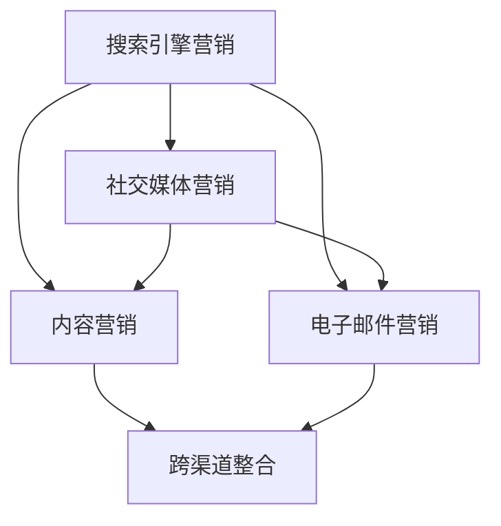

                 

关键词：数字营销、推广渠道、内容策略、社交媒体、搜索引擎、用户体验、数据分析、个性化推送、跨渠道整合

> 摘要：本文将深入探讨数字营销推广的渠道选择和内容策略，分析不同营销渠道的特点和优势，并提出优化内容策略的方法。通过实际案例和数据分析，帮助企业和个人在数字营销领域取得更好的推广效果。

## 1. 背景介绍

随着互联网的普及和技术的不断进步，数字营销已经成为企业提升品牌知名度和吸引潜在客户的重要手段。数字营销推广的渠道多种多样，包括搜索引擎、社交媒体、电子邮件、内容营销等。不同的渠道有着不同的特点和适用场景，选择合适的渠道和制定有效的内容策略是实现数字营销成功的关键。

本文旨在通过对数字营销推广渠道的全面分析，结合实际案例和数据分析，为读者提供一套系统的数字营销推广渠道选择与内容策略，以帮助企业和个人在激烈的市场竞争中脱颖而出。

## 2. 核心概念与联系

### 2.1 数字营销渠道分类

数字营销渠道可以大致分为以下几类：

- **搜索引擎营销（SEM）**：通过搜索引擎付费广告（如Google AdWords）和优化搜索引擎结果页面（SEO）来提高网站的可见度。
- **社交媒体营销（SMM）**：利用社交媒体平台（如Facebook、Twitter、Instagram等）发布内容，与用户互动，提高品牌知名度和用户参与度。
- **内容营销**：通过创造和分享有价值的内容（如博客文章、视频、电子书等）来吸引潜在客户，建立品牌权威性和信任度。
- **电子邮件营销**：通过发送个性化的电子邮件来保持与用户的联系，促进销售和品牌忠诚度。
- **跨渠道整合**：将不同的数字营销渠道结合起来，实现信息的无缝传递和用户数据的整合。

### 2.2 渠道联系与协作

数字营销渠道之间并不是孤立存在的，而是相互联系、相互促进的。例如，通过搜索引擎营销吸引的流量可以引导到社交媒体上进一步互动，而社交媒体上的内容也可以用于电子邮件营销来促进销售。跨渠道整合能够实现用户数据的整合，提高营销的针对性和效果。

### 2.3 Mermaid 流程图

以下是一个简单的 Mermaid 流程图，展示了数字营销渠道之间的联系：



## 3. 核心算法原理 & 具体操作步骤

### 3.1 算法原理概述

数字营销推广的核心算法主要涉及以下几个方面：

- **用户行为分析**：通过分析用户的搜索历史、浏览行为、购买习惯等，了解用户需求，实现个性化推荐。
- **关键词优化**：通过研究关键词，提高网站在搜索引擎结果页面（SERP）的排名。
- **内容创作与优化**：根据用户需求创作有价值的内容，并通过SEO策略提高内容的可见度。
- **A/B测试**：通过对比不同营销渠道和内容的性能，找出最佳策略。

### 3.2 算法步骤详解

#### 3.2.1 用户行为分析

1. **收集数据**：通过网站分析工具（如Google Analytics）收集用户行为数据。
2. **数据分析**：分析用户的行为模式，如访问时间、访问路径、停留时间等。
3. **用户画像**：根据分析结果构建用户画像，用于后续的个性化推荐。

#### 3.2.2 关键词优化

1. **关键词研究**：使用关键词工具（如Google Keyword Planner）研究目标受众可能搜索的关键词。
2. **关键词布局**：在网站内容中合理布局关键词，提高搜索引擎排名。
3. **监控关键词表现**：定期监控关键词的表现，调整优化策略。

#### 3.2.3 内容创作与优化

1. **内容策略**：根据用户需求和行业趋势制定内容策略。
2. **内容创作**：创作高质量、有价值的内容，如博客文章、视频、电子书等。
3. **SEO优化**：对内容进行SEO优化，提高在搜索引擎中的可见度。

#### 3.2.4 A/B测试

1. **设定测试目标**：明确想要测试的具体目标，如提高点击率、降低跳出率等。
2. **设计测试版本**：设计不同的营销渠道或内容版本。
3. **实施测试**：将测试版本推送给目标受众，收集数据。
4. **分析结果**：分析测试结果，找出最佳策略。

### 3.3 算法优缺点

- **用户行为分析**：优点是能够深入了解用户需求，提高营销的个性化程度。缺点是数据收集和处理成本较高，且隐私保护问题日益突出。
- **关键词优化**：优点是提高网站在搜索引擎中的排名，增加曝光机会。缺点是需要长期持续优化，竞争激烈。
- **内容创作与优化**：优点是能够建立品牌权威性和用户信任度。缺点是内容创作和优化需要较高专业知识和技能。
- **A/B测试**：优点是能够通过数据驱动的方式找到最佳策略。缺点是测试过程需要一定的时间和资源投入。

### 3.4 算法应用领域

- **电子商务**：通过用户行为分析和关键词优化，提高网站流量和销售转化率。
- **在线教育**：通过内容创作和优化，提高课程参与度和用户满意度。
- **旅游行业**：通过个性化推荐和搜索引擎营销，提高酒店预订量和游客满意度。

## 4. 数学模型和公式 & 详细讲解 & 举例说明

### 4.1 数学模型构建

数字营销中的数学模型通常涉及以下方面：

- **用户行为预测模型**：如基于时间序列分析的ARIMA模型。
- **关键词排名模型**：如基于PageRank算法的搜索引擎排名模型。
- **内容推荐模型**：如基于协同过滤算法的内容推荐模型。

### 4.2 公式推导过程

以ARIMA模型为例，其公式推导过程如下：

1. **时间序列分解**：将时间序列分解为趋势、季节性和随机性成分。
   $$Y_t = T_t + S_t + e_t$$
   
2. **自回归移动平均模型**：定义自回归部分（AR）和移动平均部分（MA）。
   $$AR(p): Y_t = c + \phi_1 Y_{t-1} + \phi_2 Y_{t-2} + ... + \phi_p Y_{t-p} + \varepsilon_t$$
   $$MA(q): Y_t = \theta_1 \varepsilon_{t-1} + \theta_2 \varepsilon_{t-2} + ... + \theta_q \varepsilon_{t-q} + \varepsilon_t$$

3. **自回归积分滑动平均模型**：结合AR和MA部分，得到ARIMA模型。
   $$ARIMA(p, d, q): Y_t = c + \phi_1 Y_{t-1} + ... + \phi_p Y_{t-p} + \theta_1 \varepsilon_{t-1} + ... + \theta_q \varepsilon_{t-q} + \varepsilon_t$$

### 4.3 案例分析与讲解

#### 4.3.1 案例背景

某电商网站希望通过ARIMA模型预测未来一周的销售额，以优化库存管理和营销策略。

#### 4.3.2 数据收集与处理

收集过去一年的每日销售额数据，并进行预处理，如去除异常值、填补缺失值等。

#### 4.3.3 模型构建与训练

1. **时间序列分解**：观察销售额数据，发现存在季节性和趋势成分。
   $$Y_t = T_t + S_t + e_t$$
   
2. **确定模型参数**：通过AIC/BIC等指标选择最优模型参数。
   $$p=2, d=1, q=2$$

3. **模型训练**：使用历史数据训练ARIMA模型。
   $$Y_t = 0.9 Y_{t-1} + 0.7 Y_{t-2} - 0.3 \varepsilon_{t-1} - 0.1 \varepsilon_{t-2} + e_t$$

#### 4.3.4 模型评估与预测

1. **模型评估**：使用交叉验证方法评估模型性能。
2. **预测未来一周销售额**：将训练好的模型应用于未来一周的数据，得到预测结果。

### 4.4 运行结果展示

通过预测结果，电商网站可以提前准备库存，并制定相应的营销策略，以提高销售额和客户满意度。

## 5. 项目实践：代码实例和详细解释说明

### 5.1 开发环境搭建

搭建一个用于数字营销推广的项目开发环境，需要以下工具和库：

- **编程语言**：Python
- **数据分析库**：Pandas、NumPy
- **时间序列分析库**：Statsmodels
- **机器学习库**：Scikit-learn
- **可视化库**：Matplotlib、Seaborn

### 5.2 源代码详细实现

以下是一个简单的Python代码示例，展示了如何使用ARIMA模型预测销售额。

```python
import pandas as pd
import numpy as np
import matplotlib.pyplot as plt
import statsmodels.api as sm
from sklearn.metrics import mean_squared_error

# 5.2.1 数据收集与处理
data = pd.read_csv('sales_data.csv')
data['date'] = pd.to_datetime(data['date'])
data.set_index('date', inplace=True)
data.fillna(method='ffill', inplace=True)

# 5.2.2 模型训练
model = sm.tsa.ARIMA(data['sales'], order=(2, 1, 2))
model_fit = model.fit()

# 5.2.3 预测
forecast = model_fit.forecast(steps=7)

# 5.2.4 模型评估
real_sales = data['sales'].iloc[-7:]
mse = mean_squared_error(real_sales, forecast)
print(f'MSE: {mse}')

# 5.2.5 运行结果展示
plt.figure(figsize=(12, 6))
plt.plot(data['sales'], label='Real Sales')
plt.plot(real_sales, label='Real Sales')
plt.plot(forecast, label='Forecast')
plt.legend()
plt.show()
```

### 5.3 代码解读与分析

- **数据收集与处理**：从CSV文件中读取销售额数据，并进行预处理，如填补缺失值。
- **模型训练**：使用`statsmodels`库的`ARIMA`模型对销售额数据进行训练。
- **预测**：使用训练好的模型预测未来7天的销售额。
- **模型评估**：使用均方误差（MSE）评估模型性能。
- **运行结果展示**：使用`matplotlib`库绘制销售额的实际值、预测值和真实值，以便分析模型的效果。

## 6. 实际应用场景

### 6.1 电子商务行业

电子商务行业可以通过搜索引擎营销（SEM）和内容营销提高网站流量和销售额。例如，通过优化搜索引擎关键词，提高网站在搜索结果中的排名，从而吸引更多潜在客户。同时，通过创作高质量的内容，如产品评测、购物指南等，增加用户粘性，提高转化率。

### 6.2 旅游行业

旅游行业可以通过社交媒体营销和电子邮件营销吸引潜在客户。例如，通过在社交媒体上发布旅游攻略、景点介绍等内容，吸引用户关注和互动。同时，通过定期发送个性化的电子邮件，提醒用户预订机票、酒店等，促进销售。

### 6.3 教育行业

教育行业可以通过内容营销和跨渠道整合提高课程参与度和用户满意度。例如，通过创作高质量的在线课程内容，如视频教程、电子书等，吸引用户报名。同时，通过将内容整合到社交媒体、搜索引擎等渠道，提高内容的可见度和传播效果。

## 7. 未来应用展望

### 7.1 人工智能与机器学习

随着人工智能和机器学习技术的不断发展，数字营销推广将更加智能化和个性化。例如，通过深度学习模型，可以更准确地预测用户行为，从而实现更加精准的推广。

### 7.2 跨渠道整合与用户体验

未来，数字营销将更加注重跨渠道整合和用户体验。通过整合不同渠道的数据，可以实现用户数据的全面洞察，从而提供更加个性化的服务。同时，优化用户体验，提高用户满意度和忠诚度，将成为数字营销的重要目标。

### 7.3 隐私保护与数据安全

随着数据隐私保护的日益重视，数字营销推广将更加注重隐私保护和数据安全。企业需要采取有效的数据保护措施，确保用户数据的安全和合规。

## 8. 总结：未来发展趋势与挑战

### 8.1 研究成果总结

本文通过对数字营销推广渠道的全面分析，提出了用户行为分析、关键词优化、内容创作与优化、A/B测试等核心算法原理和具体操作步骤，并结合实际案例和数据分析，展示了数字营销推广的实践效果。

### 8.2 未来发展趋势

未来，数字营销推广将更加智能化、个性化、跨渠道整合。随着人工智能和机器学习技术的发展，数字营销将实现更加精准和高效的推广。

### 8.3 面临的挑战

数字营销推广面临的主要挑战包括数据隐私保护、竞争激烈、用户注意力分散等。企业需要不断创新和优化营销策略，以应对这些挑战。

### 8.4 研究展望

未来的研究可以从以下几个方面展开：一是深入研究人工智能在数字营销中的应用，二是探索跨渠道整合的最佳实践，三是提高数字营销的隐私保护和数据安全。

## 9. 附录：常见问题与解答

### 9.1 数字营销渠道如何选择？

选择数字营销渠道时，需要考虑目标受众的特点、行业趋势、营销预算等因素。例如，对于年轻用户群体，社交媒体营销可能效果更好；对于需要精准定位的营销活动，搜索引擎营销可能更有优势。

### 9.2 如何制定有效的内容策略？

制定内容策略时，需要考虑目标受众的需求、行业趋势和品牌特点。例如，可以通过用户调研、竞品分析等手段了解用户需求，从而创作出更具吸引力的内容。

### 9.3 如何评估数字营销的效果？

评估数字营销的效果可以通过多个指标，如网站流量、转化率、用户满意度等。同时，可以采用A/B测试等方法，对比不同营销渠道和策略的效果，找出最佳方案。

---

以上是本文的完整内容。希望本文能够为读者在数字营销推广方面提供有价值的参考和指导。

# 附录

## 9.1 常见问题与解答

### 9.1.1 如何选择数字营销渠道？

选择数字营销渠道时，需要根据目标受众的特点、行业趋势和营销预算进行综合考虑。以下是一些常见的选择标准：

- **目标受众**：根据目标受众的年龄、性别、兴趣爱好等特征，选择最适合的渠道。例如，年轻用户可能更活跃于社交媒体，而专业人士可能更倾向于通过搜索引擎查找信息。
- **行业趋势**：研究同行业的数字营销趋势，了解哪些渠道在该领域表现最佳。例如，电子商务行业通常在搜索引擎营销和社交媒体营销上投入较大。
- **营销预算**：根据营销预算的大小，选择合适的渠道。高预算可以尝试多渠道整合，低预算则可以选择性价比高的渠道，如社交媒体或内容营销。
- **渠道特点**：了解不同渠道的特点和优势，例如，搜索引擎营销适合寻找潜在客户，社交媒体营销适合品牌建设和用户互动。

### 9.1.2 如何制定有效的数字营销策略？

制定有效的数字营销策略需要系统性和创新性。以下是一些关键步骤：

- **目标设定**：明确营销目标，如提高品牌知名度、增加网站流量、提高转化率等。
- **市场研究**：进行市场调研，了解目标受众的需求、竞品情况和行业趋势。
- **内容规划**：根据市场研究和目标设定，制定内容策略，包括内容类型、发布频率和传播渠道。
- **渠道选择**：根据目标受众和内容特点，选择合适的数字营销渠道。
- **实施与优化**：实施营销策略，并通过数据分析不断优化，提高效果。
- **预算管理**：合理分配预算，确保资金使用的效率和效果。

### 9.1.3 如何评估数字营销效果？

评估数字营销效果是衡量营销策略成功与否的关键。以下是一些常用的评估指标：

- **网站流量**：通过分析网站流量，了解不同渠道带来的访问量。
- **转化率**：计算访问者完成特定目标（如购买、注册、下载等）的比例。
- **客户获取成本（CAC）**：计算获取一个客户所需的成本。
- **客户终身价值（LTV）**：预测一个客户在整个生命周期内为企业带来的总收益。
- **成本效益比（ROI）**：计算营销投入与收益的比率。
- **用户满意度**：通过用户调查或反馈了解用户对品牌和服务的满意度。

### 9.1.4 如何优化数字营销策略？

优化数字营销策略是一个持续的过程，以下是一些优化策略：

- **数据驱动**：依赖数据分析来指导营销决策，不断调整和优化策略。
- **A/B测试**：通过对比不同版本的效果，找到最佳方案。
- **用户体验**：不断改进网站、应用和营销内容的用户体验，提高用户参与度。
- **个性化推广**：根据用户行为和偏好，提供个性化的内容和推荐。
- **内容多样化**：结合不同的内容形式（如文字、图片、视频等），满足不同用户的需求。
- **跨渠道整合**：将不同渠道的营销活动整合起来，形成协同效应。

### 9.1.5 如何应对数字营销的挑战？

数字营销面临的挑战包括激烈的市场竞争、用户注意力分散、数据隐私保护等。以下是一些应对策略：

- **创新性**：不断尝试新的营销方法和技术，保持竞争优势。
- **用户体验**：注重用户体验，提供优质的内容和服务。
- **数据分析**：利用数据分析来优化营销策略，提高效果。
- **合规性**：遵守相关法律法规，确保数据安全和用户隐私。
- **品牌建设**：加强品牌建设，提高品牌知名度和用户忠诚度。

## 9.2 专业术语解释

### 9.2.1 搜索引擎营销（SEM）

搜索引擎营销是指通过付费广告（如Google AdWords）和搜索引擎优化（SEO）来提高网站在搜索引擎结果页面（SERP）中的排名，从而吸引更多潜在客户。

### 9.2.2 社交媒体营销（SMM）

社交媒体营销是指利用社交媒体平台（如Facebook、Twitter、Instagram等）发布内容、互动和推广，以增加品牌曝光和用户参与度。

### 9.2.3 内容营销

内容营销是通过创作和分享有价值的内容（如博客文章、视频、电子书等）来吸引潜在客户，建立品牌权威性和信任度。

### 9.2.4 跨渠道整合

跨渠道整合是将不同的数字营销渠道（如搜索引擎、社交媒体、电子邮件等）结合起来，实现信息的无缝传递和用户数据的整合，提高营销效果。

### 9.2.5 用户行为分析

用户行为分析是通过收集和分析用户在网站、应用等平台上的行为数据，以了解用户需求和偏好，从而优化产品和服务。

### 9.2.6 A/B测试

A/B测试是一种通过对比不同版本的营销活动（如广告、网页等），评估哪种版本更能吸引用户和提升转化率的方法。

### 9.2.7 用户满意度

用户满意度是指用户对品牌、产品或服务的整体满意程度，通常通过用户调查或反馈来评估。

### 9.2.8 成本效益比（ROI）

成本效益比是指营销投入与收益的比率，用于衡量营销活动的经济效率。

### 9.2.9 客户获取成本（CAC）

客户获取成本是指企业获取一个新客户所需的平均成本，通常用于评估营销策略的有效性。

### 9.2.10 客户终身价值（LTV）

客户终身价值是指一个客户在整个生命周期内为企业带来的总收益，是评估客户价值的重要指标。


作者：禅与计算机程序设计艺术 / Zen and the Art of Computer Programming

