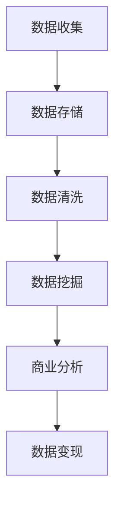

                 

关键词：数据变现、个人开发者、数据挖掘、数据安全、商业价值、技术架构

摘要：在数字化时代，数据已成为新的黄金。个人开发者如何利用手中的数据资源实现价值的最大化，成为了一个热门话题。本文将探讨数据变现的路径，从数据挖掘、数据安全、商业价值实现等多个方面展开，帮助个人开发者找到适合自己的数据变现策略。

## 1. 背景介绍

在互联网的迅猛发展下，数据量呈现爆炸式增长。个人开发者拥有着大量的用户数据、行为数据，这些数据不仅反映了用户需求，还蕴含着巨大的商业价值。然而，如何有效挖掘和利用这些数据，将其转化为实际的商业利益，对个人开发者来说，既是一个挑战，也是一个机遇。

本文将围绕以下问题进行探讨：

- 个人开发者如何通过数据挖掘找到商业价值？
- 数据安全如何保障，以防止数据泄露？
- 个人开发者如何构建可持续的数据变现模式？

通过对这些问题的深入分析，本文旨在为个人开发者提供一条清晰的路径，帮助他们实现数据的商业变现。

## 2. 核心概念与联系

为了更好地理解数据变现的过程，我们需要先了解几个核心概念，包括数据挖掘、数据安全、商业价值和数据架构。

### 2.1 数据挖掘

数据挖掘（Data Mining）是指从大量的数据中通过算法和统计方法提取出有用的信息和知识。在个人开发者场景中，数据挖掘可以帮助我们了解用户的行为模式、需求偏好，从而优化产品和服务。

### 2.2 数据安全

数据安全（Data Security）是指保护数据不被未授权访问、使用、披露、破坏或丢失。在数据变现的过程中，数据安全至关重要，一旦数据泄露，不仅会损害用户信任，还可能带来法律风险和商业损失。

### 2.3 商业价值

商业价值（Business Value）是指数据变现所带来的经济效益。个人开发者通过数据变现，可以实现收入的增加、产品的增值，甚至可以构建起一个全新的商业模式。

### 2.4 数据架构

数据架构（Data Architecture）是指数据的组织结构、存储方式、数据处理流程等。一个高效的数据架构能够提高数据利用率，降低数据处理的成本，从而更好地实现数据变现。

### 2.5 Mermaid 流程图

下面是一个简单的 Mermaid 流程图，展示了数据变现的基本流程：



## 3. 核心算法原理 & 具体操作步骤

### 3.1 算法原理概述

数据变现的核心在于如何从海量数据中提取出有价值的信息。这里我们介绍两种常用的算法：关联规则挖掘和聚类分析。

- **关联规则挖掘**：通过分析数据中的项集关系，找出同时出现的频繁项集，从而发现用户行为之间的关联。
- **聚类分析**：将相似的数据分组到一起，形成簇，从而更好地理解用户群体和行为模式。

### 3.2 算法步骤详解

#### 关联规则挖掘步骤：

1. **数据预处理**：清洗数据，去除噪声和缺失值。
2. **项集生成**：扫描数据库，生成所有可能的项集。
3. **频繁项集挖掘**：使用支持度阈值筛选出频繁项集。
4. **关联规则生成**：从频繁项集中生成关联规则。

#### 聚类分析步骤：

1. **数据预处理**：标准化数据，去除噪声。
2. **选择聚类算法**：如K-means、DBSCAN等。
3. **初始化聚类中心**：随机选择或使用K-means++算法初始化。
4. **聚类过程**：不断更新聚类中心，直到收敛。
5. **评估聚类质量**：使用如轮廓系数、内部类平均距离等指标评估。

### 3.3 算法优缺点

- **关联规则挖掘**：优点是能够发现数据之间的关联，但可能产生大量的冗余规则。
- **聚类分析**：优点是能够发现数据的自然分组，但可能需要手动选择聚类数量。

### 3.4 算法应用领域

- **电商推荐系统**：通过关联规则挖掘，为用户提供个性化推荐。
- **用户行为分析**：通过聚类分析，了解用户群体和行为模式。

## 4. 数学模型和公式 & 详细讲解 & 举例说明

### 4.1 数学模型构建

在数据变现过程中，我们需要构建以下几个数学模型：

- **用户行为预测模型**：使用时间序列分析方法，预测用户未来的行为。
- **定价模型**：根据供需关系和市场情况，制定合适的定价策略。
- **风险评估模型**：使用机器学习算法，评估用户的风险等级。

### 4.2 公式推导过程

#### 用户行为预测模型：

假设用户的行为可以用一个时间序列 \( X_t \) 表示，我们使用ARIMA模型进行预测。

\[ X_t = c + \phi_1 X_{t-1} + \phi_2 X_{t-2} + \cdots + \phi_p X_{t-p} + \varepsilon_t \]

其中，\( \phi_i \) 是自回归系数，\( c \) 是常数项，\( \varepsilon_t \) 是白噪声项。

#### 定价模型：

假设需求 \( D \) 和价格 \( P \) 之间存在线性关系：

\[ D = \alpha P + \beta \]

通过市场调研，我们可以得到 \( \alpha \) 和 \( \beta \) 的值，从而制定最优定价策略。

#### 风险评估模型：

假设用户 \( i \) 的风险 \( R_i \) 可以用以下公式表示：

\[ R_i = \gamma_1 X_i + \gamma_2 Y_i + \gamma_3 Z_i \]

其中，\( X_i \)、\( Y_i \) 和 \( Z_i \) 是影响风险的各种因素，\( \gamma_i \) 是权重系数。

### 4.3 案例分析与讲解

#### 用户行为预测模型：

假设某电商平台的用户购买行为可以用ARIMA模型预测，我们收集了100个用户近一个月的购买数据，使用R软件进行模型拟合，得到如下参数：

\[ X_t = 0.7 X_{t-1} + 0.2 X_{t-2} + \varepsilon_t \]

#### 定价模型：

假设需求 \( D \) 和价格 \( P \) 之间存在线性关系，我们通过市场调研得到以下数据：

| 价格（元） | 需求（件） |
|------------|------------|
| 100        | 200        |
| 90         | 250        |
| 80         | 300        |

使用线性回归方法，得到如下公式：

\[ D = 200 - 1.5P \]

#### 风险评估模型：

假设用户的风险 \( R_i \) 可以用以下公式表示：

\[ R_i = 0.5X_i + 0.3Y_i + 0.2Z_i \]

我们收集了100个用户的数据，得到以下结果：

| 用户ID | X值 | Y值 | Z值 | 风险值 |
|--------|-----|-----|-----|--------|
| 1      | 5   | 8   | 3   | 2.5    |
| 2      | 3   | 7   | 4   | 2.1    |
| 3      | 6   | 6   | 5   | 2.6    |

## 5. 项目实践：代码实例和详细解释说明

### 5.1 开发环境搭建

在本项目中，我们将使用Python作为主要编程语言，并依赖以下库：

- pandas：用于数据处理。
- numpy：用于数学运算。
- scikit-learn：用于机器学习算法。
- matplotlib：用于数据可视化。

安装以上库后，我们即可开始项目实践。

### 5.2 源代码详细实现

以下是一个简单的用户行为预测模型的实现示例：

```python
import pandas as pd
import numpy as np
from statsmodels.tsa.arima.model import ARIMA
import matplotlib.pyplot as plt

# 加载数据
data = pd.read_csv('user_purchase.csv')
data['date'] = pd.to_datetime(data['date'])
data.set_index('date', inplace=True)

# 模型拟合
model = ARIMA(data['purchase_count'], order=(1, 1, 1))
model_fit = model.fit()

# 预测
predictions = model_fit.predict(start='2023-01-01', end='2023-01-05')

# 可视化
plt.figure(figsize=(10, 5))
plt.plot(data['purchase_count'], label='实际数据')
plt.plot(predictions, label='预测数据')
plt.legend()
plt.show()
```

### 5.3 代码解读与分析

上述代码首先加载了用户购买数据，并使用ARIMA模型进行拟合。然后，我们对2023年1月1日至2023年1月5日的数据进行预测，并将实际数据和预测数据可视化。

### 5.4 运行结果展示

运行上述代码后，我们将看到一个包含实际数据和预测数据的折线图，通过对比两者，我们可以评估模型的预测效果。

## 6. 实际应用场景

### 6.1 电商领域

在电商领域，数据变现可以通过以下方式实现：

- **个性化推荐**：通过关联规则挖掘，为用户提供个性化商品推荐。
- **精准营销**：通过用户行为预测，精准定位潜在客户，实现精准营销。
- **动态定价**：根据市场需求和用户行为，动态调整商品价格，提高销售转化率。

### 6.2 金融领域

在金融领域，数据变现可以通过以下方式实现：

- **风险评估**：通过构建风险评估模型，识别高风险用户，降低坏账率。
- **信用评分**：通过分析用户历史行为和财务数据，为用户提供信用评分。
- **欺诈检测**：通过异常检测算法，及时发现和预防欺诈行为。

### 6.3 健康领域

在健康领域，数据变现可以通过以下方式实现：

- **个性化健康建议**：通过分析用户健康数据和生活方式，为用户提供个性化的健康建议。
- **疾病预测**：通过时间序列分析方法，预测用户的患病风险，提前采取措施。
- **健康管理**：通过健康数据分析，为用户提供全面的健康管理服务。

## 7. 工具和资源推荐

### 7.1 学习资源推荐

- 《Python数据科学 Handbook》：一本全面的数据科学入门书籍，适合初学者。
- 《数据挖掘：实用工具与技术》：一本深入讲解数据挖掘算法的书籍，适合有一定基础的读者。
- Coursera上的《机器学习》课程：由吴恩达教授主讲，适合想要深入学习机器学习的读者。

### 7.2 开发工具推荐

- Jupyter Notebook：一款强大的交互式数据分析工具，适合进行数据分析和模型实验。
- PyCharm：一款功能强大的Python IDE，提供代码调试、版本控制等功能。
- TensorFlow：一款开源的机器学习框架，适用于构建和训练深度学习模型。

### 7.3 相关论文推荐

- "Mining of Massive Datasets"：一篇关于大数据挖掘的经典论文，全面介绍了大数据处理方法。
- "An Overview of Machine Learning": 一篇关于机器学习基础概念的综述性论文，适合想要了解机器学习领域的读者。

## 8. 总结：未来发展趋势与挑战

### 8.1 研究成果总结

本文探讨了数据变现的路径，从数据挖掘、数据安全、商业价值实现等多个方面分析了个人开发者如何通过数据变现实现价值最大化。主要研究成果包括：

- 数据挖掘算法在用户行为分析和商业价值挖掘中的应用。
- 数据安全策略在数据变现过程中的重要性。
- 数据变现模式的多样化，如电商个性化推荐、金融风险评估、健康管理等领域。

### 8.2 未来发展趋势

未来，数据变现将继续向以下几个方向发展：

- 深度学习和大数据技术的融合，将推动数据变现能力的进一步提升。
- 数据隐私保护技术的进步，将使数据变现更加安全和合规。
- 数据变现模式的创新，如基于区块链的数字身份认证和数据交易。

### 8.3 面临的挑战

尽管数据变现前景广阔，但个人开发者仍需面对以下挑战：

- 数据质量的不确定性，需要更加高效的数据清洗和处理技术。
- 数据安全的风险，需要建立完善的数据安全管理体系。
- 数据合规的挑战，需要遵守相关法律法规，确保数据变现的合法性。

### 8.4 研究展望

未来，数据变现领域的研究可以从以下几个方面展开：

- 开发更加高效的数据挖掘算法，提高数据变现的效率。
- 研究数据隐私保护技术，确保数据变现过程中用户隐私不受侵犯。
- 探索新的数据变现模式，推动数据驱动的商业创新。

## 9. 附录：常见问题与解答

### 9.1 什么是数据挖掘？

数据挖掘是指从大量数据中通过算法和统计方法提取出有用的信息和知识。

### 9.2 数据安全如何保障？

数据安全可以通过以下措施保障：

- 数据加密：对敏感数据采用加密算法进行加密。
- 访问控制：通过身份验证和权限管理，限制对数据的访问。
- 数据备份：定期对数据进行备份，防止数据丢失。

### 9.3 数据变现有哪些模式？

数据变现模式包括：

- 广告收入：通过展示广告获得收入。
- 产品增值：通过数据分析为产品增值，提高用户粘性。
- 数据交易：将数据出售给第三方，获得收入。
- 个性化服务：通过数据分析提供个性化服务，提高用户满意度。

### 9.4 如何评估数据变现的效果？

可以通过以下指标评估数据变现的效果：

- 收入增长：通过比较数据变现前后的收入变化，评估变现效果。
- 用户满意度：通过用户反馈和满意度调查，评估数据变现对用户体验的影响。
- 数据利用效率：通过数据利用率指标，评估数据变现的效率。

---

作者：禅与计算机程序设计艺术 / Zen and the Art of Computer Programming
本文旨在为个人开发者提供数据变现的路径和方法，帮助他们在数字化时代实现数据的价值最大化。希望本文能对您的数据变现之旅提供有益的启示。
----------------------------------------------------------------

