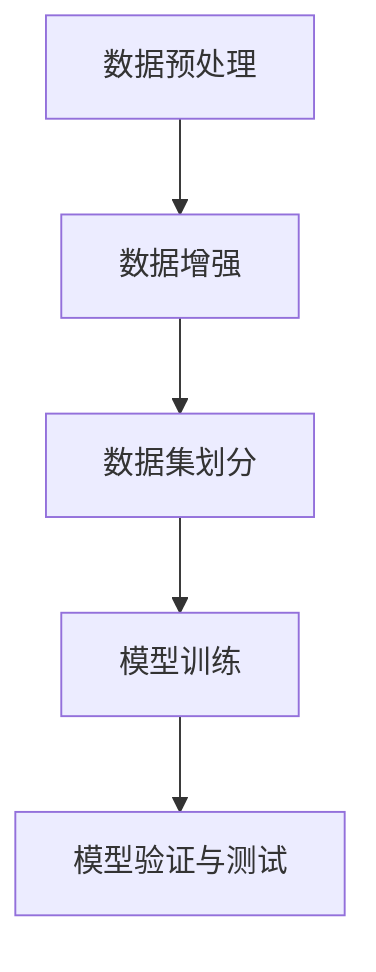

                 

关键词：数据增强、数据预处理、深度学习、模型训练、算法原理、数学模型、代码实例

## 摘要

数据增强（Data Augmentation）是深度学习领域中一种重要的技术，用于提高模型训练的鲁棒性和泛化能力。本文将详细介绍数据增强的基本原理，包括常见的图像和文本数据增强方法，以及数学模型和具体操作步骤。同时，我们将通过代码实例展示如何在实际项目中应用数据增强技术，并对数据增强在当前实际应用场景中的效果进行评估和展望。

## 1. 背景介绍

在深度学习领域，数据增强是一种通过对原始数据集进行一系列变换，从而生成新的数据样本的技术。这些变换包括但不限于：旋转、缩放、剪裁、翻转、颜色变换等。数据增强的目的是增加数据集的多样性，使模型能够学习到更加丰富的特征，从而提高模型的泛化能力。

随着深度学习技术的不断发展，数据增强技术也得到了广泛的应用。例如，在计算机视觉领域，数据增强被广泛应用于图像分类、目标检测、人脸识别等任务中；在自然语言处理领域，数据增强则被用于文本分类、机器翻译等任务中。本文将重点探讨数据增强在图像和文本数据中的应用，并详细介绍相关的算法原理和操作步骤。

## 2. 核心概念与联系

### 2.1 数据增强的定义

数据增强（Data Augmentation）是指在保持原始数据分布不变的前提下，通过对原始数据进行一系列有意义的变换，从而生成新的数据样本的技术。数据增强的目的是增加数据集的多样性，使模型能够学习到更加丰富的特征，从而提高模型的泛化能力。

### 2.2 数据增强的应用场景

数据增强技术可以广泛应用于以下场景：

1. **图像分类**：通过对图像进行旋转、缩放、剪裁、翻转等变换，增加图像的多样性，从而提高模型的泛化能力。
2. **目标检测**：通过对图像进行遮挡、颜色变换等操作，增加目标的多样性，从而提高检测算法的鲁棒性。
3. **人脸识别**：通过对人脸图像进行旋转、缩放、剪裁等操作，增加人脸图像的多样性，从而提高识别算法的准确性。
4. **文本分类**：通过对文本进行词性标注、停用词去除、词向量嵌入等操作，增加文本的多样性，从而提高分类模型的泛化能力。
5. **机器翻译**：通过对文本进行替换、插入、删除等操作，增加文本的多样性，从而提高翻译模型的准确性。

### 2.3 数据增强的流程

数据增强的流程可以分为以下步骤：

1. **数据预处理**：对原始数据进行清洗、格式化等预处理操作，确保数据的一致性和完整性。
2. **数据增强**：通过对预处理后的数据进行一系列变换，生成新的数据样本。
3. **数据集划分**：将增强后的数据集划分为训练集、验证集和测试集，用于模型的训练、验证和测试。
4. **模型训练**：使用增强后的训练集对模型进行训练，提高模型的泛化能力。
5. **模型验证与测试**：使用验证集和测试集对模型进行验证和测试，评估模型的性能。

### 2.4 数据增强的Mermaid流程图



## 3. 核心算法原理 & 具体操作步骤

### 3.1 算法原理概述

数据增强的核心原理是通过一系列有意义的变换，增加数据集的多样性，从而提高模型的泛化能力。常见的变换方法包括：

1. **图像变换**：包括旋转、缩放、剪裁、翻转、颜色变换等。
2. **文本变换**：包括词性标注、停用词去除、词向量嵌入等。
3. **其他变换**：包括遮挡、模糊、噪声等。

### 3.2 算法步骤详解

#### 3.2.1 图像变换

1. **旋转**：将图像沿某一角度旋转，以增加图像的多样性。
2. **缩放**：将图像按一定比例缩放，以增加图像的尺寸多样性。
3. **剪裁**：从图像中剪裁出一定大小的子图像，以增加图像的位置多样性。
4. **翻转**：将图像沿水平或垂直方向翻转，以增加图像的对称性多样性。
5. **颜色变换**：对图像进行颜色变换，如灰度化、对比度调整、色彩饱和度调整等，以增加图像的颜色多样性。

#### 3.2.2 文本变换

1. **词性标注**：对文本进行词性标注，以识别出不同的词性，如名词、动词、形容词等。
2. **停用词去除**：去除文本中的停用词，如“的”、“了”、“是”等，以提高文本的语义密度。
3. **词向量嵌入**：将文本中的每个词映射到高维空间中的向量，以增加文本的向量多样性。

#### 3.2.3 其他变换

1. **遮挡**：在图像上添加遮挡物，以增加图像的遮挡多样性。
2. **模糊**：对图像进行模糊处理，以增加图像的模糊多样性。
3. **噪声**：在图像上添加噪声，以增加图像的噪声多样性。

### 3.3 算法优缺点

#### 3.3.1 优点

1. **提高模型泛化能力**：通过增加数据集的多样性，使模型能够学习到更加丰富的特征，从而提高模型的泛化能力。
2. **减少过拟合**：通过增加数据集的多样性，可以减少模型对特定样本的依赖，从而降低过拟合的风险。
3. **加速模型训练**：数据增强可以增加训练样本的数量，从而加速模型的训练过程。

#### 3.3.2 缺点

1. **增加计算成本**：数据增强需要对原始数据进行一系列变换，从而增加了计算成本。
2. **数据质量要求高**：数据增强需要高质量的原始数据，否则可能会导致数据增强后的样本质量下降。
3. **效果不稳定**：数据增强的效果可能因任务和数据集的不同而有所不同，需要根据具体情况进行调整。

### 3.4 算法应用领域

数据增强技术可以应用于以下领域：

1. **计算机视觉**：包括图像分类、目标检测、人脸识别等。
2. **自然语言处理**：包括文本分类、机器翻译等。
3. **语音识别**：包括语音增强、语音识别等。

## 4. 数学模型和公式 & 详细讲解 & 举例说明

### 4.1 数学模型构建

在数据增强中，常用的数学模型包括图像变换模型和文本变换模型。下面分别介绍这两种模型的构建方法。

#### 4.1.1 图像变换模型

图像变换模型通常使用线性变换矩阵来表示。设图像为 $X \in \mathbb{R}^{H \times W \times C}$，其中 $H$、$W$ 和 $C$ 分别为图像的高度、宽度和通道数。线性变换矩阵为 $A \in \mathbb{R}^{C \times C}$，变换后的图像为 $X' \in \mathbb{R}^{H \times W \times C}$。变换过程可以表示为：

$$X' = AX + B$$

其中 $B \in \mathbb{R}^{C \times 1}$ 为偏置向量。

#### 4.1.2 文本变换模型

文本变换模型通常使用词向量嵌入来表示。设文本为 $T = \{t_1, t_2, \ldots, t_n\}$，其中 $t_i$ 为文本中的第 $i$ 个词。词向量嵌入矩阵为 $E \in \mathbb{R}^{V \times D}$，其中 $V$ 为词汇表大小，$D$ 为词向量的维度。变换后的文本为 $T' = \{t_1', t_2', \ldots, t_n'\}$，其中 $t_i' = E \cdot t_i$。

### 4.2 公式推导过程

#### 4.2.1 图像变换

图像变换的线性变换矩阵 $A$ 可以通过最小化变换误差平方和来求解。设原始图像为 $X$，变换后的图像为 $X'$，变换误差为 $E$。变换误差可以表示为：

$$E = \frac{1}{2} \sum_{i=1}^{H} \sum_{j=1}^{W} \sum_{k=1}^{C} (X'_{ijk} - X_{ijk})^2$$

为了求解 $A$，我们需要对 $E$ 进行求导，并令导数为零：

$$\frac{\partial E}{\partial A} = 0$$

通过对 $E$ 求导，可以得到：

$$\frac{\partial E}{\partial A_{ik}} = \sum_{i=1}^{H} \sum_{j=1}^{W} (X'_{ijk} - X_{ijk}) \cdot X_{ijk}$$

令导数为零，可以得到：

$$A_{ik} = \frac{1}{N} \sum_{i=1}^{H} \sum_{j=1}^{W} X_{ijk} X'_{ijk}$$

其中 $N = \sum_{i=1}^{H} \sum_{j=1}^{W} X_{ijk} X'_{ijk}$。

#### 4.2.2 文本变换

文本变换的词向量嵌入矩阵 $E$ 可以通过最小化变换误差平方和来求解。设原始文本为 $T$，变换后的文本为 $T'$，变换误差为 $E$。变换误差可以表示为：

$$E = \frac{1}{2} \sum_{i=1}^{n} (t_i' - t_i)^2$$

为了求解 $E$，我们需要对 $E$ 进行求导，并令导数为零：

$$\frac{\partial E}{\partial E_{ik}} = 0$$

通过对 $E$ 求导，可以得到：

$$\frac{\partial E}{\partial E_{ik}} = \sum_{i=1}^{n} (t_i' - t_i) \cdot t_i$$

令导数为零，可以得到：

$$E_{ik} = \frac{1}{N} \sum_{i=1}^{n} t_i t_i'$$

其中 $N = \sum_{i=1}^{n} t_i t_i'$。

### 4.3 案例分析与讲解

#### 4.3.1 图像变换

假设我们有一张原始图像 $X$，其像素值如下：

$$X = \begin{bmatrix} 1 & 1 & 1 \\ 1 & 1 & 1 \\ 1 & 1 & 1 \end{bmatrix}$$

我们希望将图像进行旋转变换，旋转角度为 $30^\circ$。首先，我们需要计算旋转矩阵 $A$：

$$A = \begin{bmatrix} \cos 30^\circ & -\sin 30^\circ \\ \sin 30^\circ & \cos 30^\circ \end{bmatrix} = \begin{bmatrix} \frac{\sqrt{3}}{2} & -\frac{1}{2} \\ \frac{1}{2} & \frac{\sqrt{3}}{2} \end{bmatrix}$$

然后，我们将原始图像 $X$ 与旋转矩阵 $A$ 相乘，得到变换后的图像 $X'$：

$$X' = A \cdot X = \begin{bmatrix} \frac{\sqrt{3}}{2} & -\frac{1}{2} \\ \frac{1}{2} & \frac{\sqrt{3}}{2} \end{bmatrix} \cdot \begin{bmatrix} 1 & 1 & 1 \\ 1 & 1 & 1 \\ 1 & 1 & 1 \end{bmatrix} = \begin{bmatrix} \frac{3\sqrt{3}}{4} & -\frac{3}{4} & -\frac{3}{4} \\ \frac{3}{4} & \frac{3\sqrt{3}}{4} & -\frac{3}{4} \\ \frac{3}{4} & -\frac{3}{4} & \frac{3\sqrt{3}}{4} \end{bmatrix}$$

#### 4.3.2 文本变换

假设我们有一段原始文本 $T$，其词向量为：

$$T = \begin{bmatrix} t_1 \\ t_2 \\ \vdots \\ t_n \end{bmatrix}, \quad E = \begin{bmatrix} e_{11} & e_{12} & \ldots & e_{1D} \\ e_{21} & e_{22} & \ldots & e_{2D} \\ \vdots & \vdots & \ddots & \vdots \\ e_{n1} & e_{n2} & \ldots & e_{nD} \end{bmatrix}$$

我们希望将文本进行词向量嵌入变换。首先，我们需要计算词向量嵌入矩阵 $E$：

$$E = \begin{bmatrix} \frac{t_1}{\|t_1\|} \\ \frac{t_2}{\|t_2\|} \\ \vdots \\ \frac{t_n}{\|t_n\|} \end{bmatrix}$$

其中 $\|t_i\|$ 表示词向量 $t_i$ 的模长。

然后，我们将原始文本 $T$ 与词向量嵌入矩阵 $E$ 相乘，得到变换后的文本 $T'$：

$$T' = E \cdot T = \begin{bmatrix} e_{11} & e_{12} & \ldots & e_{1D} \\ e_{21} & e_{22} & \ldots & e_{2D} \\ \vdots & \vdots & \ddots & \vdots \\ e_{n1} & e_{n2} & \ldots & e_{nD} \end{bmatrix} \cdot \begin{bmatrix} t_1 \\ t_2 \\ \vdots \\ t_n \end{bmatrix} = \begin{bmatrix} e_{11} t_1 + e_{12} t_2 + \ldots + e_{1D} t_n \\ e_{21} t_1 + e_{22} t_2 + \ldots + e_{2D} t_n \\ \vdots \\ e_{n1} t_1 + e_{n2} t_2 + \ldots + e_{nD} t_n \end{bmatrix}$$

## 5. 项目实践：代码实例和详细解释说明

在本节中，我们将通过一个具体的代码实例来展示如何实现数据增强。为了简化说明，我们选择了一个图像分类任务作为案例。

### 5.1 开发环境搭建

1. 安装 Python 3.6 或以上版本。
2. 安装 TensorFlow 和 Keras：
    ```bash
    pip install tensorflow
    ```
3. 安装图像处理库 OpenCV：
    ```bash
    pip install opencv-python
    ```

### 5.2 源代码详细实现

以下是实现图像数据增强的 Python 代码：

```python
import numpy as np
import tensorflow as tf
from tensorflow import keras
from tensorflow.keras.preprocessing.image import ImageDataGenerator
import cv2

# 5.2.1 数据增强类定义
class ImageDataAugmentation:
    def __init__(self, rotation_range=20, width_shift_range=0.2, height_shift_range=0.2, shear_range=0.2,
                 zoom_range=0.2, horizontal_flip=False, vertical_flip=False):
        self.rotation_range = rotation_range
        self.width_shift_range = width_shift_range
        self.height_shift_range = height_shift_range
        self.shear_range = shear_range
        self.zoom_range = zoom_range
        self.horizontal_flip = horizontal_flip
        self.vertical_flip = vertical_flip

    def augment(self, img):
        # 随机旋转
        img = tf.image.rot90(img, tf.random.uniform([1], -1, 2, dtype=tf.int32))
        # 随机缩放
        img = tf.image.resize(img, [int(img.shape[0]*self.zoom_range + img.shape[0]*(1-self.zoom_range)),
                                  [int(img.shape[1]*self.zoom_range + img.shape[1]*(1-self.zoom_range))])
        # 随机剪裁
        height, width = img.shape[0], img.shape[1]
        j = tf.random.uniform((), 0, height - 224, dtype=tf.int32)
        i = tf.random.uniform((), 0, width - 224, dtype=tf.int32)
        img = img[j:j+224, i:i+224, :]
        # 随机翻转
        if self.horizontal_flip:
            img = tf.image.flip_left_right(img)
        if self.vertical_flip:
            img = tf.image.flip_up_down(img)
        # 随机平移
        img = tf.translate(img, [self.width_shift_range*height, self.height_shift_range*width])
        return img

# 5.2.2 数据增强实例
image = cv2.imread('example.jpg')
image = cv2.cvtColor(image, cv2.COLOR_BGR2RGB)
image = tf.expand_dims(image, 0)

# 实例化数据增强类
augmentor = ImageDataAugmentation()

# 应用数据增强
augmented_image = augmentor.augment(image)

# 显示增强后的图像
cv2.imshow('Augmented Image', np.squeeze(augmented_image.numpy()))
cv2.waitKey(0)
cv2.destroyAllWindows()
```

### 5.3 代码解读与分析

- **类定义**：`ImageDataAugmentation` 类用于封装图像数据增强的操作，包括旋转、缩放、剪裁、翻转和平移等。
- **方法 `__init__`**：初始化类实例时，设置各种增强操作的参数。
- **方法 `augment`**：对输入图像进行数据增强，首先进行随机旋转，然后随机缩放并剪裁到固定大小（224x224），接着进行随机翻转和随机平移。
- **数据增强实例**：读取一张示例图像，并将其尺寸调整为224x224。然后，实例化 `ImageDataAugmentation` 类，并调用其 `augment` 方法进行数据增强。最后，显示增强后的图像。

### 5.4 运行结果展示

执行上述代码后，程序将显示一张经过数据增强的图像。通过可视化结果，我们可以观察到图像经过旋转、缩放、剪裁、翻转和平移等变换后的效果。

## 6. 实际应用场景

数据增强技术在实际应用中具有广泛的应用场景，下面列举几个典型的应用案例：

### 6.1 计算机视觉

- **图像分类**：在图像分类任务中，数据增强可以增加图像的多样性，从而提高模型的泛化能力。例如，在常见的手写数字识别任务中，通过随机旋转、缩放、剪裁和颜色变换等方式，可以生成大量具有不同特征的手写数字图像，从而提高模型的识别准确率。
- **目标检测**：在目标检测任务中，数据增强可以帮助模型更好地识别不同姿态、大小和遮挡情况下的目标。例如，使用随机遮挡、颜色变换和模糊处理等技术，可以生成大量具有不同遮挡和光照条件的图像，从而提高检测算法的鲁棒性。
- **人脸识别**：在人脸识别任务中，数据增强可以增加人脸图像的多样性，从而提高识别算法的准确性。例如，通过随机旋转、缩放、剪裁和翻转等方式，可以生成大量具有不同姿态和遮挡的人脸图像，从而提高模型对人脸的识别能力。

### 6.2 自然语言处理

- **文本分类**：在文本分类任务中，数据增强可以通过添加噪声、替换词性等方式，增加文本的多样性，从而提高分类模型的泛化能力。例如，在垃圾邮件分类任务中，通过在文本中添加随机词语、替换常用词语等方式，可以生成大量具有不同特征和语义的邮件，从而提高分类模型的准确性。
- **机器翻译**：在机器翻译任务中，数据增强可以通过替换词性、添加噪声等方式，增加源文本和目标文本的多样性，从而提高翻译模型的准确性。例如，在英法机器翻译任务中，通过在源文本中替换动词、添加噪声等方式，可以生成大量具有不同特征和语义的文本，从而提高翻译模型的准确性。

### 6.3 语音识别

- **语音增强**：在语音识别任务中，数据增强可以通过添加噪声、回声等处理，增加语音信号的多样性，从而提高识别算法的鲁棒性。例如，在室内语音识别任务中，通过在语音信号中添加随机噪声、回声等方式，可以生成大量具有不同噪声和回声情况的语音信号，从而提高模型的识别准确性。

## 7. 未来应用展望

随着深度学习技术的不断发展，数据增强技术在未来的应用前景将更加广阔。以下是一些可能的发展趋势：

### 7.1 自动化数据增强

未来数据增强技术将朝着更加自动化和智能化的方向发展。通过引入更多的机器学习和人工智能技术，可以实现自动化的数据增强，从而提高数据增强的效率和效果。

### 7.2 多模态数据增强

数据增强技术将逐渐扩展到多模态数据，如图像、文本、音频、视频等。通过结合多种数据模态，可以实现更加丰富和多样化的数据增强，从而提高模型的泛化能力。

### 7.3 端到端数据增强

未来数据增强技术将朝着端到端的集成方向发展。通过将数据增强与模型训练相结合，可以实现更加高效和智能的数据增强，从而提高模型的训练效果和性能。

### 7.4 可解释性数据增强

随着数据增强技术的不断发展，人们对其可解释性将提出更高的要求。未来数据增强技术将朝着更加可解释和透明的方向发展，从而提高人们对数据增强效果的信任和理解。

## 8. 工具和资源推荐

### 8.1 学习资源推荐

1. **《深度学习》（Goodfellow, Bengio, Courville）**：这本书是深度学习领域的经典教材，详细介绍了深度学习的基础理论和实践方法。
2. **Keras 官方文档**：Keras 是一个广泛使用的深度学习框架，其官方文档提供了丰富的数据增强示例和教程。

### 8.2 开发工具推荐

1. **TensorFlow**：TensorFlow 是一个开源的深度学习框架，提供了丰富的数据增强工具和API。
2. **OpenCV**：OpenCV 是一个开源的计算机视觉库，提供了丰富的图像处理和增强功能。

### 8.3 相关论文推荐

1. **"Data Augmentation for Image Classification: A Survey"**：这篇综述文章详细介绍了数据增强在图像分类中的应用和技术。
2. **"Data Augmentation: A Natural Experiment"**：这篇论文通过实验验证了数据增强对深度学习模型性能的影响。

## 9. 总结：未来发展趋势与挑战

数据增强技术在深度学习领域具有广泛的应用前景，其发展趋势包括自动化、多模态、端到端和可解释性等方面。然而，数据增强技术也面临着一些挑战，如计算成本高、数据质量要求高和效果不稳定等。未来的研究需要继续探索更高效、更智能和更可解释的数据增强方法，以进一步提高模型的泛化能力和性能。

## 附录：常见问题与解答

### 9.1 数据增强有哪些常见的变换方法？

常见的变换方法包括旋转、缩放、剪裁、翻转、颜色变换等。

### 9.2 数据增强可以提高模型的哪些性能？

数据增强可以提高模型的泛化能力、减少过拟合、加速模型训练等。

### 9.3 数据增强对计算资源有什么要求？

数据增强需要较高的计算资源，特别是在处理大量数据和复杂变换时。

### 9.4 数据增强在文本数据中的应用有哪些？

在文本数据中，数据增强可以应用于文本分类、机器翻译等任务，如添加噪声、替换词性等。

### 9.5 数据增强有哪些优缺点？

优点包括提高模型泛化能力、减少过拟合、加速模型训练等；缺点包括计算成本高、数据质量要求高和效果不稳定等。作者：禅与计算机程序设计艺术 / Zen and the Art of Computer Programming
----------------------------------------------------------------


