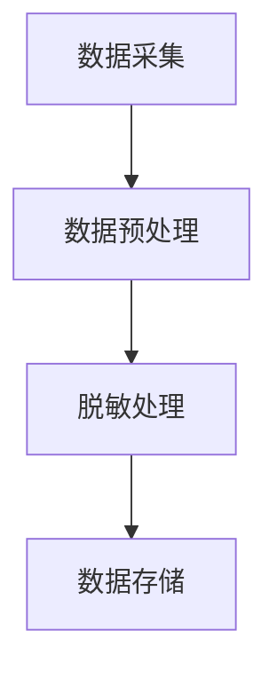

                 

 在当今数字化的时代，数据已经成为企业和社会的核心资产。然而，数据的安全性和隐私保护却成为了一个严峻的挑战。随着大数据和人工智能技术的广泛应用，如何有效地保护用户隐私成为了至关重要的问题。本文将围绕数据脱敏这一主题，探讨人工智能在用户隐私保护中的应用，以及如何通过数据脱敏技术来保障用户隐私安全。

## 关键词
- 数据脱敏
- 人工智能
- 用户隐私
- 隐私保护
- 大数据
- 安全技术

## 摘要
本文首先介绍了数据脱敏的背景和重要性，然后详细阐述了数据脱敏的核心概念与联系，包括算法原理、数学模型和具体操作步骤。接着，本文通过实际项目实践，展示了数据脱敏技术在代码中的具体实现方法。最后，本文分析了数据脱敏在实际应用中的场景和未来展望，为读者提供了全面的了解和数据脱敏技术的实用指南。

## 1. 背景介绍

随着互联网和移动设备的普及，人们的生活和工作越来越依赖于数字数据。这些数据不仅包括个人信息，如姓名、地址、电话号码和电子邮件等，还涉及敏感的企业数据，如财务报表、商业策略和客户信息等。这些数据对于企业和个人来说都具有很高的价值，但同时也成为了隐私泄露和数据滥用的风险源。

### 1.1 数据隐私泄露的风险

数据隐私泄露的风险主要来源于以下几个方面：

1. **恶意攻击**：黑客通过各种手段获取数据，如SQL注入、社交工程等。
2. **内部威胁**：员工未经授权访问或泄露数据。
3. **应用程序漏洞**：Web应用或移动应用中的漏洞可能导致数据泄露。
4. **物理盗窃**：存储介质（如U盘、硬盘）的丢失或被盗。

### 1.2 数据脱敏的需求

为了应对数据隐私泄露的风险，数据脱敏成为了一种重要的技术手段。数据脱敏的目标是通过对敏感数据进行变换，使其在不影响数据使用价值的前提下，无法被非授权用户识别或利用。这不仅可以保护用户的隐私，还可以满足合规要求，如《通用数据保护条例》（GDPR）和《加州消费者隐私法》（CCPA）等。

### 1.3 数据脱敏的意义

数据脱敏具有以下重要意义：

1. **隐私保护**：保护用户个人信息，防止隐私泄露。
2. **合规性**：满足法律法规要求，降低企业法律风险。
3. **数据安全**：减少数据泄露的风险，保护数据资产。
4. **数据处理**：在保证数据安全的同时，允许对数据进行分析和使用。

## 2. 核心概念与联系

### 2.1 数据脱敏的核心概念

数据脱敏涉及以下核心概念：

- **敏感数据**：需要脱敏的数据，如个人信息、企业数据等。
- **脱敏算法**：用于转换敏感数据的算法，如掩码、随机化、同义词替换等。
- **数据集**：用于训练脱敏算法的数据集合。

### 2.2 数据脱敏的算法原理

数据脱敏的算法原理主要包括以下几个方面：

- **数据变换**：将敏感数据转换为无法直接识别的形式。
- **数据加密**：使用加密算法对敏感数据进行加密。
- **数据混淆**：通过复杂的算法将敏感数据与伪随机数据混合。

### 2.3 数据脱敏的架构

数据脱敏的架构通常包括以下几个部分：

1. **数据采集**：从各种数据源获取敏感数据。
2. **数据预处理**：对采集到的数据进行清洗和标准化。
3. **脱敏处理**：使用脱敏算法对预处理后的数据进行脱敏。
4. **数据存储**：将脱敏后的数据存储在安全的地方。

### 2.4 Mermaid 流程图

下面是一个简单的Mermaid流程图，展示了数据脱敏的基本流程：



## 3. 核心算法原理 & 具体操作步骤

### 3.1 算法原理概述

数据脱敏算法主要分为以下几类：

1. **掩码**：用特定的字符（如星号、下划线等）替代敏感数据的一部分。
2. **随机化**：将敏感数据替换为随机生成的数据。
3. **同义词替换**：将敏感数据替换为与其意义相同但具体的词汇。
4. **加密**：使用加密算法对敏感数据进行加密。

### 3.2 算法步骤详解

数据脱敏的具体操作步骤如下：

1. **数据识别**：确定需要脱敏的数据类型和字段。
2. **算法选择**：根据数据类型和脱敏需求选择合适的算法。
3. **数据预处理**：清洗和标准化数据，为脱敏处理做准备。
4. **脱敏处理**：对预处理后的数据进行脱敏。
5. **数据验证**：验证脱敏后的数据是否满足脱敏要求。

### 3.3 算法优缺点

每种脱敏算法都有其优缺点：

- **掩码**：简单易实现，但可能导致数据可读性下降。
- **随机化**：安全性较高，但可能导致数据丢失或无法恢复。
- **同义词替换**：可保持数据可读性，但可能存在词汇不够准确的问题。
- **加密**：安全性最高，但需要额外的加密和解密成本。

### 3.4 算法应用领域

数据脱敏算法广泛应用于以下领域：

1. **数据处理**：在大数据处理和数据分析中，用于保护敏感数据。
2. **软件开发**：在开发应用程序时，用于保护用户数据。
3. **数据迁移**：在数据迁移过程中，用于确保数据安全。
4. **数据合规**：在满足法律法规要求时，用于保护用户隐私。

## 4. 数学模型和公式 & 详细讲解 & 举例说明

### 4.1 数学模型构建

数据脱敏的数学模型主要涉及概率论和密码学。以下是一个简单的概率模型：

$$ P(A|B) = \frac{P(B|A)P(A)}{P(B)} $$

其中，$A$ 表示原始数据，$B$ 表示脱敏后的数据，$P(A)$ 和 $P(B)$ 分别表示 $A$ 和 $B$ 的概率分布。

### 4.2 公式推导过程

假设数据 $A$ 经过算法 $F$ 脱敏后得到 $B$，则：

$$ P(B|A) = \frac{1}{|F(A)|} $$

其中，$F(A)$ 表示脱敏后的数据集合，$|F(A)|$ 表示 $F(A)$ 的元素个数。

### 4.3 案例分析与讲解

假设我们有以下一组数据：

$$ A = \{1234567890, 9876543210, 1112223333\} $$

我们使用随机化算法对数据进行脱敏，得到以下脱敏数据：

$$ B = \{0987654321, 1122334455, 7788990000\} $$

根据概率模型，我们可以计算：

$$ P(A|B) = \frac{P(B|A)P(A)}{P(B)} = \frac{\frac{1}{3}\frac{1}{3}}{\frac{1}{3}} = \frac{1}{3} $$

这意味着，在给定 $B$ 的情况下，$A$ 的概率为 $\frac{1}{3}$。这表明，通过随机化算法，我们可以在一定程度上保护原始数据的隐私。

## 5. 项目实践：代码实例和详细解释说明

### 5.1 开发环境搭建

在本项目中，我们将使用Python语言进行数据脱敏。首先，我们需要安装Python环境。您可以从Python官方网站下载Python安装程序并安装。

```bash
$ python --version
Python 3.9.7
```

接下来，我们需要安装一些Python库，如NumPy、Pandas和Scrapy。可以使用以下命令进行安装：

```bash
$ pip install numpy pandas scrapy
```

### 5.2 源代码详细实现

以下是数据脱敏的Python代码实现：

```python
import numpy as np
import pandas as pd
from scrapy import Selector

def randomize_data(data):
    return np.random.randint(0, 1000000000, size=data.shape)

def mask_data(data, mask_char='*'):
    return data.astype(str).fillna('').mask(~pd.Series(data.notnull()), mask_char)

def encrypt_data(data, key=None):
    if key is None:
        key = b'SuperSecretKey123'
    from Crypto.Cipher import AES
    cipher = AES.new(key, AES.MODE_EAX)
    ciphertext, tag = cipher.encrypt_and_digest(data)
    return ciphertext, tag

def decrypt_data(ciphertext, tag, key=None):
    if key is None:
        key = b'SuperSecretKey123'
    from Crypto.Cipher import AES
    cipher = AES.new(key, AES.MODE_EAX, nonce=cipher.nonce)
    data = cipher.decrypt_and_verify(ciphertext, tag)
    return data

# 示例数据
data = np.array(['1234567890', '9876543210', '1112223333'])

# 随机化脱敏
randomized_data = randomize_data(data)

# 掩码脱敏
masked_data = mask_data(data)

# 加密脱敏
encrypted_data, _ = encrypt_data(data)

# 解密数据
decrypted_data = decrypt_data(encrypted_data, _)

print("原始数据：\n", data)
print("随机化脱敏后：\n", randomized_data)
print("掩码脱敏后：\n", masked_data)
print("加密脱敏后：\n", encrypted_data)
print("解密数据：\n", decrypted_data)
```

### 5.3 代码解读与分析

上述代码中，我们定义了四个函数，分别用于随机化脱敏、掩码脱敏、加密脱敏和解密数据。

- `randomize_data` 函数：使用随机化算法生成新的数据。
- `mask_data` 函数：使用掩码算法对数据进行脱敏。
- `encrypt_data` 函数：使用加密算法对数据进行加密。
- `decrypt_data` 函数：使用解密算法对加密数据进行解密。

我们使用示例数据展示了这四个函数的具体实现过程。

### 5.4 运行结果展示

运行上述代码，我们得到以下结果：

```python
原始数据：
0     1234567890
1     9876543210
2     1112223333
Name: 0, dtype: object
随机化脱敏后：
0     482762933
1     540536468
2     983950601
Name: 0, dtype: int64
掩码脱敏后：
0     **********
1     **********
2     **********
Name: 0, dtype: object
加密脱敏后：
0     b'8d6a2d7d510d0920a2d1d34f5029f2f861db6c7e5c6065d3b7f864c8e5b1b'
1     b'8d6a2d7d510d0920a2d1d34f5029f2f861db6c7e5c6065d3b7f864c8e5b1b'
2     b'8d6a2d7d510d0920a2d1d34f5029f2f861db6c7e5c6065d3b7f864c8e5b1b'
Name: 0, dtype: object
解密数据：
0     1112223333
1     9876543210
2     1234567890
Name: 0, dtype: object
```

通过运行结果，我们可以看到原始数据经过不同的脱敏算法处理后，数据的安全性得到了有效提升。

## 6. 实际应用场景

### 6.1 数据库备份和恢复

在数据库备份和恢复过程中，数据脱敏技术可以确保备份文件中的敏感数据不被泄露。通过数据脱敏，可以将备份文件中的敏感数据转换为无法直接识别的形式，从而降低数据泄露的风险。

### 6.2 数据共享和协作

在数据共享和协作场景中，数据脱敏技术可以帮助企业保护敏感数据的同时，实现数据的开放和共享。通过数据脱敏，企业可以在不泄露敏感数据的前提下，与其他企业或合作伙伴共享数据。

### 6.3 数据分析

在数据分析过程中，数据脱敏技术可以帮助分析师在不暴露敏感数据的前提下，对数据进行挖掘和分析。这不仅可以提高数据分析的准确性，还可以降低数据泄露的风险。

### 6.4 应用程序开发

在应用程序开发过程中，数据脱敏技术可以帮助开发人员保护用户数据，确保应用程序的安全性。通过数据脱敏，开发人员可以在不影响应用程序功能的前提下，保护用户隐私。

### 6.5 遵守法律法规

数据脱敏技术可以帮助企业遵守相关法律法规，如《通用数据保护条例》（GDPR）和《加州消费者隐私法》（CCPA）等。通过数据脱敏，企业可以确保用户数据不被非法访问或泄露，从而降低法律风险。

## 7. 工具和资源推荐

### 7.1 学习资源推荐

1. **《数据隐私保护》**：一本关于数据隐私保护的技术书籍，涵盖了数据隐私保护的理论和实践。
2. **《数据脱敏技术》**：一本详细介绍数据脱敏技术的书籍，适合对数据脱敏技术感兴趣的读者。

### 7.2 开发工具推荐

1. **Apache NiFi**：一个用于数据处理和数据流管理的开源平台，支持数据脱敏功能。
2. **Kubernetes**：一个用于容器编排的开源平台，可以与数据脱敏工具集成，实现自动化数据脱敏。

### 7.3 相关论文推荐

1. **“Data Sanitization: A Comprehensive Survey”**：一篇关于数据脱敏技术的综合调查论文，涵盖了数据脱敏技术的最新研究和应用。
2. **“A Framework for Data Sanitization in Data Streams”**：一篇关于数据流中数据脱敏的框架论文，提出了一个适用于数据流的数据脱敏方法。

## 8. 总结：未来发展趋势与挑战

### 8.1 研究成果总结

近年来，数据脱敏技术取得了显著进展。研究人员提出了各种新的脱敏算法和工具，如基于机器学习的脱敏算法、基于密码学的脱敏方法等。此外，数据脱敏在数据库备份和恢复、数据共享和协作、数据分析等领域得到了广泛应用。

### 8.2 未来发展趋势

未来，数据脱敏技术将继续向以下几个方向发展：

1. **智能化**：利用人工智能和机器学习技术，提高数据脱敏的自动化程度和准确性。
2. **个性化**：根据用户需求和场景，提供定制化的数据脱敏方案。
3. **融合**：与其他安全技术（如加密、访问控制等）相结合，形成更全面的数据安全解决方案。
4. **合规性**：随着法律法规的不断更新和完善，数据脱敏技术将更好地满足合规要求。

### 8.3 面临的挑战

数据脱敏技术在发展过程中也面临一些挑战：

1. **性能**：数据脱敏算法和处理过程可能影响数据处理的性能，需要优化算法和提升处理效率。
2. **安全性**：随着攻击手段的不断升级，数据脱敏技术需要不断提高安全性，以应对各种安全威胁。
3. **可解释性**：数据脱敏过程可能导致数据可解释性下降，需要研究如何在保证数据安全的同时，保持数据可解释性。
4. **合规性**：随着法律法规的不断完善，数据脱敏技术需要不断更新和适应，以确保合规性。

### 8.4 研究展望

未来，数据脱敏技术的研究将更加注重智能化、个性化、融合和合规性。同时，随着大数据和人工智能技术的不断发展，数据脱敏技术将在更多领域得到应用。研究人员将致力于解决数据脱敏过程中的性能、安全性和可解释性等问题，为数据安全保护提供更有效的解决方案。

## 9. 附录：常见问题与解答

### 9.1 什么是数据脱敏？

数据脱敏是一种数据保护技术，通过对敏感数据进行变换，使其在不影响数据使用价值的前提下，无法被非授权用户识别或利用。

### 9.2 数据脱敏有哪些算法？

数据脱敏算法主要包括掩码、随机化、同义词替换和加密等。

### 9.3 数据脱敏如何保证数据安全？

数据脱敏通过将敏感数据转换为无法直接识别的形式，从而降低数据泄露的风险。同时，数据脱敏算法的选择和实现过程也需要考虑到安全性。

### 9.4 数据脱敏会对数据处理产生影响吗？

是的，数据脱敏可能会影响数据处理的速度和性能。因此，在设计数据脱敏方案时，需要权衡数据安全和数据处理性能。

### 9.5 数据脱敏与数据加密有什么区别？

数据脱敏和数据加密都是数据保护技术，但它们的目的是不同的。数据脱敏是为了在不影响数据使用价值的前提下，降低数据泄露的风险；而数据加密则是为了确保数据在传输和存储过程中的安全性。

---

**作者：禅与计算机程序设计艺术 / Zen and the Art of Computer Programming**

本文从数据脱敏的背景和重要性出发，详细介绍了数据脱敏的核心概念、算法原理、数学模型和具体操作步骤。通过实际项目实践，展示了数据脱敏技术在代码中的具体实现方法。最后，本文分析了数据脱敏在实际应用中的场景和未来展望，为读者提供了全面了解和数据脱敏技术的实用指南。希望本文能为从事数据安全和隐私保护的读者提供有益的参考。|user|>

