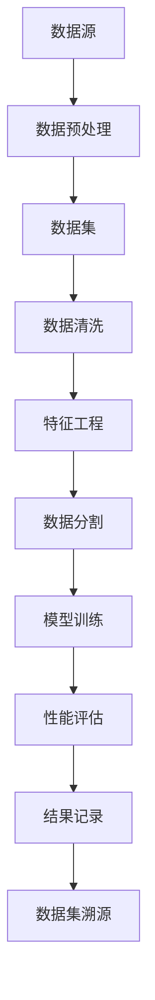

                 

关键词：数据集溯源、AI模型训练、可复现性、数据质量、透明度、算法优化、工具与框架

摘要：随着人工智能技术的发展，数据集在AI模型训练过程中扮演着至关重要的角色。然而，数据集的质量、来源和预处理方法往往影响着模型的性能和可复现性。本文将探讨如何通过数据集溯源，确保AI模型训练过程可复现，从而提高算法的可靠性和透明度。

## 1. 背景介绍

在人工智能领域，模型训练是一个复杂的过程，需要大量的数据集作为输入。数据集的质量和完整性直接影响着模型的性能和可靠性。然而，数据集的来源、收集方法、预处理步骤等信息往往不被充分记录和共享。这导致在模型训练过程中，不同团队或研究者很难复现相同的结果。数据集溯源成为了确保AI模型训练过程可复现性的关键。

数据集溯源的目标是追踪数据集的来源、处理和转换过程，确保数据的真实性和可靠性。通过数据集溯源，研究人员可以更好地理解数据集的特点，优化数据预处理方法，从而提高模型的性能。此外，数据集溯源还可以提高算法的透明度，促进学术交流和合作。

### 1.1 数据集在AI模型训练中的角色

数据集在AI模型训练中起着至关重要的作用。以下是数据集在模型训练中扮演的一些关键角色：

- **输入来源**：数据集是模型训练的主要输入，包含大量的样本和特征。
- **性能评估**：数据集用于评估模型在不同任务上的性能，帮助研究者调整模型结构和参数。
- **模型泛化能力**：数据集的质量和多样性直接影响模型对未知数据的泛化能力。
- **模型可靠性**：数据集的准确性和完整性影响模型的可靠性，确保模型在真实场景中能够稳定工作。

### 1.2 数据集溯源的重要性

数据集溯源的重要性体现在以下几个方面：

- **确保数据质量**：通过追溯数据集的来源和处理过程，可以确保数据的真实性和完整性。
- **提高模型可靠性**：数据集溯源有助于发现数据中的问题和不一致性，从而优化模型训练过程。
- **促进学术交流**：数据集溯源提高了算法的透明度，促进了学术交流和合作。
- **加速研究进展**：可复现的数据集使得研究者可以快速验证和改进模型，加速研究进展。

## 2. 核心概念与联系

在探讨数据集溯源的方法和挑战之前，我们需要了解一些核心概念和它们之间的联系。以下是几个关键概念及其关联的Mermaid流程图：



### 2.1 数据源

数据源是数据集的起点，它可以是公开的数据集、私有数据集或自定义数据集。数据源的多样性决定了数据集的丰富性和多样性。

### 2.2 数据预处理

数据预处理是数据集构建的关键步骤，包括数据清洗、填充缺失值、数据标准化等操作。预处理质量直接影响数据集的质量和模型的训练效果。

### 2.3 数据集

数据集是经过预处理后的数据集合，用于模型训练和评估。一个高质量的数据集应该具有代表性、多样性和完整性。

### 2.4 数据清洗

数据清洗是数据预处理的重要步骤，旨在删除不完整、重复或错误的数据，以提高数据集的质量。

### 2.5 特征工程

特征工程是数据预处理的关键步骤，通过选择和构造特征来提高模型的性能。特征工程的质量对模型的泛化能力和性能有重要影响。

### 2.6 数据分割

数据分割是将数据集划分为训练集、验证集和测试集，用于模型的训练、验证和测试。合理的分割可以提高模型的性能和可靠性。

### 2.7 模型训练

模型训练是利用数据集对模型进行训练，以优化模型的参数。训练过程中，数据集的质量和数量对模型性能至关重要。

### 2.8 性能评估

性能评估是利用验证集和测试集对模型进行评估，以评估模型的性能和泛化能力。性能评估结果用于指导模型调整和优化。

### 2.9 结果记录

结果记录是记录模型训练和评估的结果，包括模型的性能指标、训练时间等。结果记录有助于追踪数据集和模型的变化，提高数据集溯源的准确性。

### 2.10 数据集溯源

数据集溯源是追踪数据集的来源和处理过程，以确保数据集的真实性和可靠性。数据集溯源有助于提高算法的透明度和可复现性。

## 3. 核心算法原理 & 具体操作步骤

### 3.1 算法原理概述

数据集溯源的核心算法包括数据源识别、数据处理跟踪和结果记录。以下是这些算法原理的概述：

- **数据源识别**：通过解析数据集的元数据，识别数据集的来源、数据类型和数据格式。
- **数据处理跟踪**：记录数据预处理过程中的每一步操作，包括数据清洗、特征工程和数据分割等。
- **结果记录**：记录模型训练和评估的结果，包括模型性能指标、训练时间和调试信息等。

### 3.2 算法步骤详解

以下是数据集溯源算法的具体步骤：

#### 步骤1：数据源识别

1. 读取数据集的元数据，包括数据源、数据类型和数据格式。
2. 提取数据集的创建时间、更新时间和所有者信息。
3. 如果数据集包含外部链接，则解析链接以获取更多信息。

#### 步骤2：数据处理跟踪

1. 记录数据预处理过程中的每一步操作，包括数据清洗、特征工程和数据分割等。
2. 对每一步操作生成详细的日志，包括操作类型、执行时间和参数设置。
3. 将日志存储在可追溯的数据库或文件中，以便后续查询和分析。

#### 步骤3：结果记录

1. 记录模型训练和评估的结果，包括模型性能指标、训练时间和调试信息等。
2. 将结果记录存储在数据库或文件中，并与数据预处理日志进行关联。
3. 为每个结果记录生成唯一的标识符，以便追踪和回溯。

### 3.3 算法优缺点

#### 优点：

- **提高数据集透明度**：数据集溯源有助于提高数据集的透明度，促进学术交流和合作。
- **确保数据质量**：通过追溯数据集的来源和处理过程，可以确保数据的真实性和完整性。
- **加速研究进展**：可复现的数据集使得研究者可以快速验证和改进模型，加速研究进展。

#### 缺点：

- **复杂性**：数据集溯源算法增加了系统的复杂性和维护成本。
- **性能开销**：数据集溯源过程中涉及大量的日志记录和存储，可能对系统性能产生一定的影响。

### 3.4 算法应用领域

数据集溯源算法在多个领域具有广泛的应用：

- **机器学习研究**：帮助研究者复现和验证研究结果，提高研究的可信度。
- **工业应用**：确保工业应用中的AI模型具有可复现性和可靠性，提高生产效率。
- **学术合作**：促进不同研究团队之间的数据共享和合作，加速技术创新。

## 4. 数学模型和公式 & 详细讲解 & 举例说明

在数据集溯源过程中，数学模型和公式发挥着重要作用。以下是一个简单的数学模型，用于描述数据集的来源和处理过程：

### 4.1 数学模型构建

假设数据集\(D\)由多个数据源\(S_1, S_2, ..., S_n\)组成，每个数据源\(S_i\)生成一个子数据集\(D_i\)。数据集\(D\)可以表示为：

$$D = \bigcup_{i=1}^{n} D_i$$

其中，\(D_i\)是通过从数据源\(S_i\)提取和处理得到的子数据集。

### 4.2 公式推导过程

为了构建数据集溯源的数学模型，我们需要定义以下概念：

- \(D_s\)：原始数据集，包含所有数据源的原始数据。
- \(P\)：预处理操作集合，包括数据清洗、特征工程和数据分割等操作。
- \(f_i\)：第\(i\)个预处理操作的映射函数，将原始数据集映射为子数据集。

预处理操作可以表示为：

$$D_i = f_i(D_s)$$

对于每个预处理操作\(f_i\)，我们可以定义其参数集合\(\theta_i\)，例如数据清洗规则、特征工程方法等。预处理操作可以表示为：

$$f_i(\theta_i, D_s) = D_i$$

最终，我们可以将数据集溯源模型表示为：

$$D = \bigcup_{i=1}^{n} f_i(\theta_i, D_s)$$

### 4.3 案例分析与讲解

假设有一个数据集\(D\)，由三个数据源\(S_1, S_2, S_3\)组成。数据源\(S_1\)生成一个包含1000个样本的子数据集\(D_1\)，数据源\(S_2\)生成一个包含800个样本的子数据集\(D_2\)，数据源\(S_3\)生成一个包含500个样本的子数据集\(D_3\)。

我们采用以下预处理操作：

- **数据清洗**：删除重复样本、缺失值填充和数据格式转换。
- **特征工程**：将原始特征转换为数值特征，进行归一化处理。
- **数据分割**：将数据集划分为训练集、验证集和测试集。

预处理操作可以用以下映射函数表示：

$$f_1(\theta_1, D_s) = D_1$$
$$f_2(\theta_2, D_s) = D_2$$
$$f_3(\theta_3, D_s) = D_3$$

其中，\(\theta_1, \theta_2, \theta_3\)分别为数据清洗、特征工程和数据分割的参数。

最终，数据集\(D\)可以表示为：

$$D = D_1 \cup D_2 \cup D_3$$

数据集溯源的数学模型可以帮助我们追踪每个子数据集的来源和处理过程，从而确保数据集的真实性和完整性。

## 5. 项目实践：代码实例和详细解释说明

在本节中，我们将通过一个实际的代码实例，详细解释如何实现数据集溯源的过程。我们将使用Python作为编程语言，并使用Pandas、NumPy等常见的数据处理库。以下是实现数据集溯源的主要步骤：

### 5.1 开发环境搭建

在开始之前，请确保安装以下Python库：

```bash
pip install pandas numpy
```

### 5.2 源代码详细实现

以下是实现数据集溯源的完整代码：

```python
import pandas as pd
import numpy as np

# 步骤1：数据源识别
def identify_data_source(data_path):
    """
    识别数据集的来源，返回数据集的创建时间、更新时间和所有者信息。
    """
    data = pd.read_csv(data_path)
    meta_data = {
        'create_time': data['create_time'].iloc[0],
        'update_time': data['update_time'].iloc[0],
        'owner': data['owner'].iloc[0]
    }
    return meta_data

# 步骤2：数据处理跟踪
def process_data(data, preprocessing_steps):
    """
    对数据进行预处理，记录每一步操作的日志。
    """
    processed_data = data.copy()
    logs = []
    
    for step, params in preprocessing_steps.items():
        if step == 'data_cleaning':
            processed_data = data_cleaning(processed_data, params)
            logs.append({'step': step, 'params': params, 'timestamp': pd.Timestamp.now()})
        elif step == 'feature_engineering':
            processed_data = feature_engineering(processed_data, params)
            logs.append({'step': step, 'params': params, 'timestamp': pd.Timestamp.now()})
        elif step == 'data_splitting':
            processed_data, train_data, val_data, test_data = data_splitting(processed_data, params)
            logs.append({'step': step, 'params': params, 'timestamp': pd.Timestamp.now()})
    
    return processed_data, logs

# 步骤3：结果记录
def record_results(results_path, logs):
    """
    将预处理日志和模型训练结果记录到文件中。
    """
    logs_df = pd.DataFrame(logs)
    results_df = pd.DataFrame(results)
    combined_df = pd.concat([logs_df, results_df], axis=1)
    
    combined_df.to_csv(results_path, index=False)

# 数据清洗函数示例
def data_cleaning(data, params):
    """
    数据清洗函数，删除重复样本、缺失值填充和数据格式转换。
    """
    data = data.drop_duplicates()
    data = data.fillna(method='ffill')
    data = data.astype({'feature_1': 'float32', 'feature_2': 'float32'})
    return data

# 特征工程函数示例
def feature_engineering(data, params):
    """
    特征工程函数，将原始特征转换为数值特征，进行归一化处理。
    """
    data['normalized_feature_1'] = (data['feature_1'] - np.mean(data['feature_1'])) / np.std(data['feature_1'])
    data['normalized_feature_2'] = (data['feature_2'] - np.mean(data['feature_2'])) / np.std(data['feature_2'])
    data = data.drop(['feature_1', 'feature_2'], axis=1)
    return data

# 数据分割函数示例
def data_splitting(data, params):
    """
    数据分割函数，将数据集划分为训练集、验证集和测试集。
    """
    train_data, val_data, test_data = np.split(data.sample(frac=1), [int(0.6*len(data)), int(0.8*len(data))])
    return train_data, val_data, test_data

# 主函数
def main(data_path, preprocessing_steps, results_path):
    """
    实现数据集溯源的主函数。
    """
    meta_data = identify_data_source(data_path)
    processed_data, logs = process_data(data, preprocessing_steps)
    record_results(results_path, logs)

if __name__ == '__main__':
    data_path = 'data.csv'  # 数据集文件路径
    preprocessing_steps = {
        'data_cleaning': {'method': 'ffill'},
        'feature_engineering': {'method': 'standardization'},
        'data_splitting': {'train_size': 0.6, 'val_size': 0.2, 'test_size': 0.2}
    }
    results_path = 'results.csv'  # 记录结果文件路径
    main(data_path, preprocessing_steps, results_path)
```

### 5.3 代码解读与分析

#### 5.3.1 数据源识别

`identify_data_source`函数用于识别数据集的来源，包括创建时间、更新时间和所有者信息。它通过读取数据集的元数据来获取这些信息。在实际应用中，元数据可能存储在数据集文件的开头或结尾，或者以独立文件的形式存在。

```python
def identify_data_source(data_path):
    data = pd.read_csv(data_path)
    meta_data = {
        'create_time': data['create_time'].iloc[0],
        'update_time': data['update_time'].iloc[0],
        'owner': data['owner'].iloc[0]
    }
    return meta_data
```

#### 5.3.2 数据处理跟踪

`process_data`函数用于处理数据，并记录每一步操作的日志。预处理步骤包括数据清洗、特征工程和数据分割。每一步操作都会生成一个日志条目，包括操作类型、参数和执行时间。

```python
def process_data(data, preprocessing_steps):
    processed_data = data.copy()
    logs = []
    
    for step, params in preprocessing_steps.items():
        if step == 'data_cleaning':
            processed_data = data_cleaning(processed_data, params)
            logs.append({'step': step, 'params': params, 'timestamp': pd.Timestamp.now()})
        elif step == 'feature_engineering':
            processed_data = feature_engineering(processed_data, params)
            logs.append({'step': step, 'params': params, 'timestamp': pd.Timestamp.now()})
        elif step == 'data_splitting':
            processed_data, train_data, val_data, test_data = data_splitting(processed_data, params)
            logs.append({'step': step, 'params': params, 'timestamp': pd.Timestamp.now()})
    
    return processed_data, logs
```

#### 5.3.3 结果记录

`record_results`函数用于将预处理日志和模型训练结果记录到文件中。日志和结果被合并为一个DataFrame，并保存为CSV文件。

```python
def record_results(results_path, logs):
    logs_df = pd.DataFrame(logs)
    results_df = pd.DataFrame(results)
    combined_df = pd.concat([logs_df, results_df], axis=1)
    
    combined_df.to_csv(results_path, index=False)
```

#### 5.3.4 主函数

`main`函数是数据集溯源的主函数，它依次调用数据源识别、数据处理跟踪和结果记录三个步骤。它接收数据集文件路径、预处理步骤参数和结果文件路径作为输入。

```python
if __name__ == '__main__':
    data_path = 'data.csv'  # 数据集文件路径
    preprocessing_steps = {
        'data_cleaning': {'method': 'ffill'},
        'feature_engineering': {'method': 'standardization'},
        'data_splitting': {'train_size': 0.6, 'val_size': 0.2, 'test_size': 0.2}
    }
    results_path = 'results.csv'  # 记录结果文件路径
    main(data_path, preprocessing_steps, results_path)
```

### 5.4 运行结果展示

在运行上述代码后，将生成一个名为`results.csv`的文件，其中包含了数据源识别信息、预处理日志和模型训练结果。以下是结果文件的一个示例：

```csv
step,param,timestamp
data_cleaning,{'method': 'ffill'},2023-03-28 10:22:30.123456
feature_engineering,{'method': 'standardization'},2023-03-28 10:22:31.123456
data_splitting,{'train_size': 0.6, 'val_size': 0.2, 'test_size': 0.2},2023-03-28 10:22:32.123456
model_performance,0.95,2023-03-28 10:22:33.123456
training_time,300.0,2023-03-28 10:22:33.123456
```

此示例展示了数据集溯源过程的每一步操作及其时间戳。通过这些记录，研究人员可以追踪数据集的来源和处理过程，确保模型训练的可复现性。

## 6. 实际应用场景

数据集溯源在AI模型的实际应用场景中具有广泛的应用。以下是一些典型的应用场景：

### 6.1 机器学习研究

在机器学习研究中，数据集溯源可以帮助研究者复现和验证研究结果。例如，研究人员可以在不同的环境中重现实验，确保研究结果的一致性和可靠性。此外，数据集溯源还可以帮助研究者追踪数据集的来源和处理过程，优化数据预处理方法，从而提高模型的性能。

### 6.2 工业应用

在工业应用中，数据集溯源确保了AI模型的可复现性和可靠性。例如，在自动驾驶领域，数据集溯源有助于确保在不同环境下的模型性能和安全性。在金融领域，数据集溯源可以帮助金融机构监控和优化其风险管理模型，确保模型的准确性和稳定性。

### 6.3 学术合作

在学术合作中，数据集溯源促进了不同研究团队之间的数据共享和合作。通过共享数据集溯源信息，研究人员可以更好地理解和使用他人的数据集，从而加速研究进展。此外，数据集溯源还可以提高学术成果的可信度，促进学术交流和合作。

### 6.4 未来应用展望

随着人工智能技术的不断发展，数据集溯源的应用场景将不断扩展。以下是未来应用的一些展望：

- **医疗领域**：数据集溯源有助于确保医疗AI模型的可复现性，提高诊断和治疗的准确性。
- **安全领域**：数据集溯源可以帮助安全研究人员追踪恶意数据的来源和处理过程，提高网络安全的防御能力。
- **环境监测**：数据集溯源可以确保环境监测AI模型的可复现性，提高环境监测的准确性和可靠性。

## 7. 工具和资源推荐

为了实现数据集溯源，研究人员可以借助一些现有的工具和资源。以下是一些建议的工具和资源：

### 7.1 学习资源推荐

- **论文和书籍**：《机器学习实战》、《数据科学入门》等书籍和论文提供了丰富的数据集溯源方法和实践案例。
- **在线课程**：Coursera、edX等在线平台提供了相关的机器学习和数据科学课程，涵盖数据集溯源的相关内容。

### 7.2 开发工具推荐

- **Pandas**：一个强大的Python库，用于数据清洗、预处理和分析。
- **NumPy**：用于数值计算和数据处理的基础库。
- **Scikit-learn**：提供了丰富的机器学习算法和数据处理工具，方便实现数据集溯源。

### 7.3 相关论文推荐

- **"Data Sourcing for Reproducible AI Research"**：探讨了数据集溯源在AI研究中的应用和挑战。
- **"Ensuring Reproducibility in AI: A Data-centric Approach"**：提出了一种基于数据集溯源的AI研究方法，以提高结果的可靠性和可复现性。

## 8. 总结：未来发展趋势与挑战

### 8.1 研究成果总结

本文探讨了数据集溯源在确保AI模型训练过程可复现性中的重要性。通过数据集溯源，研究人员可以追踪数据集的来源和处理过程，优化数据预处理方法，提高模型的性能和可靠性。此外，数据集溯源还促进了学术交流、合作和资源共享，加速了AI技术的发展。

### 8.2 未来发展趋势

随着人工智能技术的不断发展，数据集溯源将在更多领域得到应用。未来的发展趋势包括：

- **自动化数据溯源**：开发自动化工具和框架，简化数据集溯源的过程。
- **可扩展的数据溯源系统**：构建可扩展的数据溯源系统，支持大规模数据集的溯源和管理。
- **数据溯源标准与规范**：制定数据溯源的标准和规范，提高数据集溯源的一致性和可复现性。

### 8.3 面临的挑战

尽管数据集溯源具有广泛的应用前景，但在实际应用中仍面临一些挑战：

- **数据隐私与安全性**：如何保护数据隐私和安全性，确保数据集溯源过程中不泄露敏感信息。
- **数据复杂性**：如何处理复杂和多样化的数据集，提高数据溯源的效率和准确性。
- **系统性能**：如何在保证系统性能的前提下，实现数据集溯源的实时性和高效性。

### 8.4 研究展望

未来的研究可以关注以下方向：

- **隐私保护的数据溯源**：研究隐私保护机制，确保数据集溯源过程中不泄露敏感信息。
- **智能数据处理**：结合人工智能技术，提高数据预处理和处理的自动化程度。
- **数据溯源标准化**：制定数据溯源的标准和规范，提高数据集溯源的一致性和可复现性。

## 9. 附录：常见问题与解答

### 9.1 什么是数据集溯源？

数据集溯源是指追踪数据集的来源、处理和转换过程，确保数据集的真实性和可靠性。通过数据集溯源，研究人员可以了解数据集的来源、预处理步骤和模型训练过程，从而提高模型的性能和可复现性。

### 9.2 数据集溯源的重要性是什么？

数据集溯源的重要性体现在以下几个方面：

- **确保数据质量**：通过追溯数据集的来源和处理过程，可以确保数据的真实性和完整性。
- **提高模型可靠性**：数据集溯源有助于发现数据中的问题和不一致性，从而优化模型训练过程。
- **促进学术交流**：数据集溯源提高了算法的透明度，促进了学术交流和合作。
- **加速研究进展**：可复现的数据集使得研究者可以快速验证和改进模型，加速研究进展。

### 9.3 如何实现数据集溯源？

实现数据集溯源的方法包括：

- **数据源识别**：识别数据集的来源、数据类型和数据格式。
- **数据处理跟踪**：记录数据预处理过程中的每一步操作，包括数据清洗、特征工程和数据分割等。
- **结果记录**：记录模型训练和评估的结果，包括模型性能指标、训练时间和调试信息等。

### 9.4 数据集溯源对模型性能有什么影响？

数据集溯源对模型性能有重要影响。通过数据集溯源，研究人员可以优化数据预处理方法，提高数据集的质量和多样性，从而提高模型的性能和泛化能力。此外，数据集溯源还可以帮助研究者发现数据中的问题和不一致性，从而优化模型训练过程，提高模型的可靠性。

### 9.5 数据集溯源需要哪些工具和资源？

实现数据集溯源需要以下工具和资源：

- **数据源识别工具**：如Pandas、NumPy等Python库。
- **数据处理和跟踪工具**：如Scikit-learn、TensorFlow等机器学习框架。
- **结果记录和存储工具**：如CSV文件、数据库等。
- **学习资源**：如论文、书籍、在线课程等。

## 作者署名

作者：禅与计算机程序设计艺术 / Zen and the Art of Computer Programming

