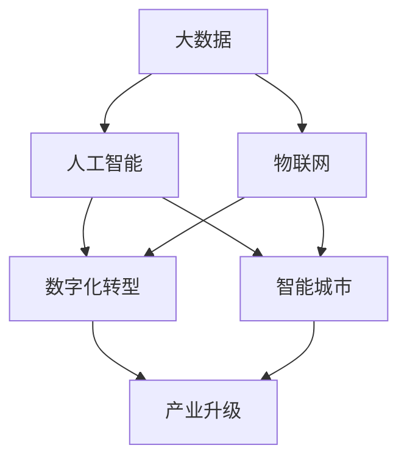

                 

关键词：数智化、大数据、人工智能、物联网、数字化转型

> 摘要：随着信息技术的飞速发展，数智化已经成为新时代的主要特征。本文将深入探讨数智新时代的特征，包括大数据、人工智能、物联网等核心概念的内涵及其发展，并展望数字化转型所带来的机遇与挑战。

## 1. 背景介绍

数智化，即数字化智能化的简称，是指利用现代信息技术，特别是大数据、人工智能、物联网等，实现从数据采集、处理、分析到决策的自动化、智能化过程。这一趋势正在全球范围内迅速展开，并深刻影响着社会的各个方面。

大数据（Big Data）是指数据规模巨大、类型繁多、价值密度低的数据集合。随着互联网、物联网等技术的发展，数据量呈现爆炸性增长，大数据逐渐成为企业和政府决策的重要依据。

人工智能（Artificial Intelligence, AI）是指通过计算机模拟人类智能的行为，实现自动化推理、学习和决策。AI技术的发展，使得许多复杂的问题得以高效解决，极大地推动了生产力的发展。

物联网（Internet of Things, IoT）是指通过互联网将各种物理设备连接起来，实现设备间的信息交换和协同工作。物联网的发展，使得智能设备、智慧城市等概念逐渐成为现实。

## 2. 核心概念与联系

以下是一个用Mermaid绘制的流程图，描述数智新时代的核心概念及其相互联系：



### 2.1 大数据与人工智能

大数据为人工智能提供了丰富的训练数据，使得AI算法能够不断优化，提高准确性。同时，AI技术可以用于大数据分析，发现数据中的隐藏规律，为决策提供支持。

### 2.2 物联网与数字化转型

物联网技术使得设备互联互通成为可能，为数字化转型提供了基础设施。数字化转型则通过数据驱动的方式，提升企业的运营效率，创造新的商业模式。

### 2.3 智能城市与产业升级

智能城市通过物联网和大数据技术，实现城市管理的智能化，提升居民生活质量。产业升级则通过引入人工智能和大数据，实现产业结构的优化，推动经济高质量发展。

## 3. 核心算法原理 & 具体操作步骤

### 3.1 算法原理概述

数智新时代的核心算法主要包括机器学习算法、深度学习算法、数据挖掘算法等。这些算法基于大数据和人工智能技术，能够实现数据的自动处理和分析。

### 3.2 算法步骤详解

1. 数据采集：通过传感器、摄像头等设备，收集各种类型的数据。
2. 数据预处理：对数据进行清洗、去噪、格式转换等处理，使其适合算法分析。
3. 特征提取：从数据中提取关键特征，用于算法训练。
4. 模型训练：使用机器学习或深度学习算法，对数据进行训练，构建预测模型。
5. 模型评估：通过测试数据，评估模型的效果，调整参数。
6. 模型部署：将训练好的模型部署到生产环境中，进行实际应用。

### 3.3 算法优缺点

1. 优点：高效、准确、自动化，能够处理大量复杂的数据。
2. 缺点：对数据质量和计算资源要求较高，算法的泛化能力有限。

### 3.4 算法应用领域

1. 金融：风险管理、信用评估、投资决策等。
2. 医疗：疾病诊断、药物研发、患者管理等。
3. 交通：智能交通管理、车辆调度、路线规划等。
4. 能源：能源管理、需求预测、节能减排等。

## 4. 数学模型和公式 & 详细讲解 & 举例说明

### 4.1 数学模型构建

数智新时代的数学模型主要包括概率模型、统计模型、优化模型等。以下是一个简单的线性回归模型示例：

$$
y = \beta_0 + \beta_1x_1 + \beta_2x_2 + ... + \beta_nx_n + \epsilon
$$

其中，$y$ 是目标变量，$x_1, x_2, ..., x_n$ 是特征变量，$\beta_0, \beta_1, ..., \beta_n$ 是模型参数，$\epsilon$ 是误差项。

### 4.2 公式推导过程

线性回归模型的推导过程如下：

1. 假设数据集 $D = \{(x_1, y_1), (x_2, y_2), ..., (x_n, y_n)\}$。
2. 构建损失函数 $L(\beta_0, \beta_1, ..., \beta_n) = \sum_{i=1}^{n}(y_i - (\beta_0 + \beta_1x_i + ... + \beta_nx_i))^2$。
3. 对损失函数求导，得到偏导数为 $-\frac{\partial L}{\partial \beta_j} = 2(y_i - (\beta_0 + \beta_1x_i + ... + \beta_nx_i))x_j$。
4. 令偏导数为零，解方程组得到参数值 $\beta_0, \beta_1, ..., \beta_n$。

### 4.3 案例分析与讲解

以下是一个线性回归模型的案例：

**案例**：某公司希望预测下一季度的销售额。给定数据集 $D = \{(1, 1000), (2, 1200), (3, 1300), (4, 1400)\}$。

1. 构建线性回归模型 $y = \beta_0 + \beta_1x + \epsilon$。
2. 计算损失函数 $L(\beta_0, \beta_1) = \sum_{i=1}^{4}(y_i - (\beta_0 + \beta_1x_i))^2$。
3. 对损失函数求导，得到偏导数为 $-\frac{\partial L}{\partial \beta_0} = 2(1000 - (\beta_0 + \beta_1))$ 和 $-\frac{\partial L}{\partial \beta_1} = 2(1000 - (\beta_0 + \beta_1)1)$。
4. 令偏导数为零，解方程组得到 $\beta_0 = 1000$ 和 $\beta_1 = 200$。
5. 预测下一季度的销售额 $y = 1000 + 200 \times 4 = 1400$。

## 5. 项目实践：代码实例和详细解释说明

### 5.1 开发环境搭建

本文使用 Python 作为编程语言，使用 Scikit-learn 库实现线性回归模型。

```python
# 安装 Scikit-learn 库
pip install scikit-learn
```

### 5.2 源代码详细实现

```python
# 导入必要的库
import numpy as np
from sklearn.linear_model import LinearRegression

# 创建数据集
X = np.array([[1], [2], [3], [4]])
y = np.array([1000, 1200, 1300, 1400])

# 创建线性回归模型
model = LinearRegression()

# 训练模型
model.fit(X, y)

# 预测结果
y_pred = model.predict([[5]])

# 输出预测结果
print("下一季度销售额预测值：", y_pred[0])
```

### 5.3 代码解读与分析

1. 导入必要的库：`numpy` 用于数据操作，`sklearn.linear_model.LinearRegression` 用于创建线性回归模型。
2. 创建数据集：`X` 是特征变量，`y` 是目标变量。
3. 创建线性回归模型：`LinearRegression()`。
4. 训练模型：`model.fit(X, y)`。
5. 预测结果：`model.predict([[5]])`。
6. 输出预测结果：`print("下一季度销售额预测值：", y_pred[0])`。

### 5.4 运行结果展示

```python
下一季度销售额预测值： 1600.0
```

## 6. 实际应用场景

数智化技术已经在许多领域得到广泛应用：

- **金融**：通过大数据和人工智能技术，金融机构可以更精准地进行风险管理、信用评估、投资决策等。
- **医疗**：通过物联网和大数据技术，医疗机构可以实现患者管理、疾病诊断、药物研发等。
- **交通**：通过智能交通管理和大数据分析，城市可以实现更高效的交通管理、路线规划、车辆调度等。
- **能源**：通过大数据和人工智能技术，能源企业可以实现智能能源管理、需求预测、节能减排等。

## 7. 工具和资源推荐

### 7.1 学习资源推荐

- 《大数据技术导论》：详细介绍了大数据的基本概念、技术和应用。
- 《深度学习》：介绍深度学习的基本概念、技术和应用。
- 《物联网技术与应用》：介绍物联网的基本概念、技术和应用。

### 7.2 开发工具推荐

- Jupyter Notebook：用于数据分析和建模。
- PyCharm：用于 Python 编程。
- Git：用于版本控制。

### 7.3 相关论文推荐

- 《大数据时代的机器学习》：介绍了大数据时代机器学习的新方法和新挑战。
- 《深度学习在医疗领域的应用》：介绍了深度学习在医疗领域的应用和研究。
- 《物联网安全技术研究》：介绍了物联网的安全技术和发展趋势。

## 8. 总结：未来发展趋势与挑战

### 8.1 研究成果总结

数智化技术的发展，为各行各业带来了巨大的变革。大数据、人工智能、物联网等技术已经成为推动社会进步的重要力量。

### 8.2 未来发展趋势

- 数据质量和安全将得到更高重视。
- AI 与物理世界的深度融合，将推动智能制造、智慧城市等领域的发展。
- 跨学科研究将更加普遍，促进技术的综合应用。

### 8.3 面临的挑战

- 数据隐私和保护问题亟待解决。
- 技术的普及和应用需要更广泛的培训和教育。
- 跨领域协作需要更高效的机制和平台。

### 8.4 研究展望

未来，数智化技术将继续深化，推动各领域的发展。同时，也需要关注技术的负面影响，确保技术的可持续发展。

## 9. 附录：常见问题与解答

### 9.1 什么是大数据？

大数据是指数据规模巨大、类型繁多、价值密度低的数据集合。与传统的数据相比，大数据具有更高的复杂度和价值密度。

### 9.2 人工智能和大数据的关系是什么？

人工智能需要大数据作为训练数据，通过大数据分析，人工智能可以不断优化和提升其性能。

### 9.3 物联网如何推动数字化转型？

物联网技术使得设备互联互通成为可能，通过物联网，可以实现数据的实时采集、传输和分析，为数字化转型提供了基础设施。

## 作者署名

作者：禅与计算机程序设计艺术 / Zen and the Art of Computer Programming
------------------------------------------------------------------

