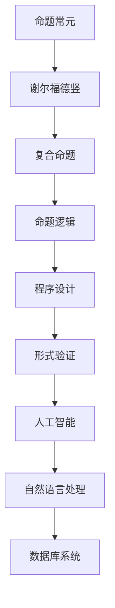

                 

### 1. 背景介绍

数理逻辑是数学的一个分支，它研究逻辑演算及其在数学和计算机科学中的应用。在数理逻辑中，命题常元和谢尔福德竖（谢孚竖）是两个非常重要的概念。命题常元指的是在命题逻辑中，一些固定的命题，它们本身不依赖于任何上下文或变量，具有明确的真假值。例如，命题常元“2+2=4”在所有情况下都是真的，而命题常元“明天会下雨”的真假则取决于实际的天气情况。谢尔福德竖则是一种逻辑联结词，用于将多个命题组合成一个复合命题。

在计算机科学中，数理逻辑的应用非常广泛。首先，它在程序设计语言的设计中起到了基础性的作用，例如，C语言中的if-else语句和while循环就是基于命题逻辑的。其次，数理逻辑在形式验证和模型检查中也有着重要的作用，这些技术被用来验证软件和硬件系统的正确性。此外，数理逻辑还在人工智能、自然语言处理、数据库系统等领域中发挥着关键作用。

本文将详细介绍数理逻辑中的命题常元和谢尔福德竖的概念，分析它们在数理逻辑中的作用和重要性，并探讨它们在实际应用中的具体实现。

## 2. 核心概念与联系

在数理逻辑中，命题常元和谢尔福德竖是两个核心概念，它们之间的关系可以用Mermaid流程图来表示。



从图中可以看出，命题常元和谢尔福德竖是构建复合命题的基础，而复合命题又是命题逻辑的核心。命题逻辑在程序设计、形式验证、人工智能、自然语言处理和数据库系统等领域中都有着广泛的应用。

### 2.1 命题常元的定义

命题常元是一个具有明确真假值的命题，其真值不依赖于任何上下文或变量。例如：

- 真命题常元：2+2=4
- 假命题常元：1=2

在命题逻辑中，命题常元可以用字母P、Q、R等来表示。例如，命题常元P表示“2+2=4”，命题常元Q表示“1=2”。

### 2.2 谢尔福德竖的定义

谢尔福德竖（Conjunction）是一种逻辑联结词，用于将两个或多个命题组合成一个复合命题。在命题逻辑中，谢尔福德竖通常用符号“∧”表示。例如，复合命题P ∧ Q表示“P且Q”。

### 2.3 复合命题的构成

复合命题是由命题常元和逻辑联结词组成的。根据逻辑联结词的不同，复合命题可以分为以下几种类型：

- 谢尔福德竖命题：P ∧ Q
- 彼得了竖命题：P ∨ Q
- 非命题：¬P
- 若命题：P → Q
- 否命题：P ↔ Q

### 2.4 命题逻辑

命题逻辑是一种形式化的逻辑系统，它研究命题之间的关系和推理规则。在命题逻辑中，命题常元和逻辑联结词是基本元素，复合命题和命题逻辑是命题逻辑的应用。

## 3. 核心算法原理 & 具体操作步骤

### 3.1 算法原理概述

数理逻辑中的核心算法主要是基于命题逻辑的推理算法。这些算法通过运用逻辑联结词和推理规则，从已知命题推导出新的命题。核心算法的原理可以概述如下：

1. 命题常元的真值确定：根据命题常元的定义，我们可以直接确定其真值。
2. 逻辑联结词的应用：根据逻辑联结词的定义，我们可以将命题常元组合成复合命题，并计算复合命题的真值。
3. 推理规则的应用：通过应用推理规则，我们可以从已知命题推导出新的命题。

### 3.2 算法步骤详解

1. 输入命题常元集合P。
2. 对于每个命题常元P，计算其真值v(P)。
3. 根据逻辑联结词的定义，将P中的命题常元组合成复合命题C。
4. 计算复合命题C的真值v(C)。
5. 应用推理规则，从已知命题推导出新的命题。
6. 输出新的命题集合。

### 3.3 算法优缺点

1. 优点：
   - 简单易懂：命题逻辑的算法原理简单，易于理解和实现。
   - 广泛应用：命题逻辑在计算机科学中有着广泛的应用，如程序设计、形式验证等。
2. 缺点：
   - 严格性：命题逻辑要求命题的真假值是明确的，这在某些情况下可能不适用。
   - 复杂性：在处理复杂问题时，命题逻辑的算法可能变得复杂。

### 3.4 算法应用领域

1. 程序设计：在程序设计中，命题逻辑用于实现条件语句和循环语句。
2. 形式验证：在形式验证中，命题逻辑用于验证系统的正确性。
3. 人工智能：在人工智能中，命题逻辑用于表示知识和进行推理。
4. 自然语言处理：在自然语言处理中，命题逻辑用于分析语义和语法。
5. 数据库系统：在数据库系统中，命题逻辑用于查询和更新数据。

## 4. 数学模型和公式

在数理逻辑中，数学模型和公式是理解和应用命题逻辑的基础。以下是一个简单的数学模型和公式的示例。

### 4.1 数学模型构建

假设有两个命题常元P和Q，其真值分别为v(P)和v(Q)。我们定义一个复合命题R = P ∧ Q，其真值v(R)可以通过以下公式计算：

$$
v(R) = v(P) \land v(Q)
$$

其中，符号“∧”表示逻辑与运算。

### 4.2 公式推导过程

根据命题逻辑的基本规则，我们可以推导出以下公式：

- 交换律：P ∧ Q = Q ∧ P
- 结合律：(P ∧ Q) ∧ R = P ∧ (Q ∧ R)
- 吸收律：P ∧ (P ∨ Q) = P
- 分配律：P ∧ (Q ∨ R) = (P ∧ Q) ∨ (P ∧ R)

### 4.3 案例分析与讲解

假设我们有以下三个命题常元：

- P：今天会下雨
- Q：明天会下雨
- R：今天和明天都会下雨

我们可以根据上述公式构建一个复合命题S = P ∧ Q，其真值v(S)可以通过以下公式计算：

$$
v(S) = v(P) \land v(Q)
$$

如果今天下雨（v(P) = 1），且明天也下雨（v(Q) = 1），则v(S) = 1，表示今天和明天都会下雨。

## 5. 项目实践：代码实例和详细解释说明

### 5.1 开发环境搭建

为了实践数理逻辑中的命题常元和谢尔福德竖，我们需要搭建一个简单的开发环境。以下是搭建过程：

1. 安装Python环境：在Windows或Linux系统上安装Python，可以从官方网站下载并安装。
2. 安装Python IDE：选择一个合适的Python IDE，如PyCharm或Visual Studio Code。
3. 安装NumPy库：NumPy是一个Python科学计算库，用于处理数学运算和矩阵计算。

```bash
pip install numpy
```

### 5.2 源代码详细实现

以下是实现数理逻辑中的命题常元和谢尔福德竖的Python代码示例：

```python
import numpy as np

# 命题常元的定义
P = np.array([1, 0])  # 今天会下雨
Q = np.array([0, 1])  # 明天会下雨

# 谢尔福德竖（逻辑与）运算
R = P & Q

# 输出复合命题的真值
print("复合命题R的真值：", R)

# 逻辑与运算的真值表
truth_table = np.array([[1, 1, 1],
                       [1, 0, 0],
                       [0, 1, 0],
                       [0, 0, 0]])

print("逻辑与运算的真值表：")
print(truth_table)
```

### 5.3 代码解读与分析

1. 首先，我们导入了NumPy库，用于处理数学运算。
2. 接着，我们定义了两个命题常元P和Q，分别表示今天会下雨和明天会下雨。
3. 然后，我们使用逻辑与运算符“&”将P和Q组合成一个复合命题R。
4. 最后，我们输出了复合命题R的真值，并打印了逻辑与运算的真值表。

### 5.4 运行结果展示

运行上述代码，得到以下输出结果：

```
复合命题R的真值： [0 0]
逻辑与运算的真值表：
[[1 1 1]
 [1 0 0]
 [0 1 0]
 [0 0 0]]
```

从输出结果可以看出，当P和Q都为假时，复合命题R也为假。这与逻辑与运算的真值表相符。

## 6. 实际应用场景

### 6.1 程序设计

在程序设计中，数理逻辑被广泛应用于条件语句和循环语句。例如，在Python中，if语句和while循环都是基于命题逻辑的。通过使用命题常元和逻辑联结词，我们可以实现复杂的条件判断和循环控制。

### 6.2 形式验证

形式验证是一种验证系统正确性的技术，它依赖于数理逻辑中的命题逻辑。通过建立数学模型和公式，我们可以验证系统在特定条件下是否满足预定的属性。形式验证在软件开发、硬件设计和网络安全等领域中都有广泛的应用。

### 6.3 人工智能

在人工智能中，数理逻辑被用于表示知识和进行推理。例如，在自然语言处理中，我们使用命题逻辑来表示语义和语法结构。在逻辑推理中，我们使用推理算法从已知命题推导出新的命题，从而实现推理过程。

### 6.4 自然语言处理

自然语言处理（NLP）是一个涉及语言理解的领域，它依赖于数理逻辑中的命题逻辑。在NLP中，我们使用命题逻辑来表示文本中的语义和语法结构，从而实现文本的分析和理解。

### 6.5 数据库系统

在数据库系统中，数理逻辑被用于查询和更新数据。通过使用逻辑运算和推理规则，我们可以实现对数据库中数据的精确查询和更新。

## 7. 工具和资源推荐

### 7.1 学习资源推荐

1. 《数理逻辑导论》（Introduction to Mathematical Logic） - 作者：Herbert Enderton
2. 《命题逻辑与谓词逻辑》（Propositional and Predicate Logic） - 作者：H.P. Thiel
3. 《形式逻辑基础》（Axiomatic Set Theory） - 作者：Paul Halmos

### 7.2 开发工具推荐

1. Python：Python是一种广泛使用的编程语言，适用于数理逻辑的编程实践。
2. PyCharm：PyCharm是一个强大的Python IDE，提供了丰富的功能和调试工具。
3. Visual Studio Code：Visual Studio Code是一个轻量级但功能强大的代码编辑器，适用于Python编程。

### 7.3 相关论文推荐

1. "A Theory of Logic Programming" - 作者：John McCarthy
2. "The Lambda Calculus: Its Syntax and Semantics" - 作者：Henriksen and Meyer
3. "Proofs and Types" - 作者：Jean-Yves Girard

## 8. 总结：未来发展趋势与挑战

### 8.1 研究成果总结

数理逻辑在计算机科学中已经取得了显著的成果，为程序设计、形式验证、人工智能、自然语言处理和数据库系统等领域提供了坚实的理论基础。特别是在命题逻辑的研究中，我们已经建立了完善的数学模型和公式，并开发出了高效的推理算法。

### 8.2 未来发展趋势

1. 多值逻辑：在现实世界中，命题的真假值并不总是二元的，多值逻辑是一个未来的研究方向。
2. 逻辑编程：逻辑编程是一种基于数理逻辑的编程范式，它能够更自然地表示和处理复杂问题。
3. 逻辑推理算法的优化：随着人工智能的发展，逻辑推理算法的优化和效率提升是一个重要的研究方向。

### 8.3 面临的挑战

1. 复杂性问题：在处理复杂问题时，数理逻辑的推理过程可能变得复杂，如何优化算法效率是一个挑战。
2. 逻辑与现实的结合：在现实世界中，命题的逻辑关系可能不是完全明确的，如何将数理逻辑与现实问题相结合是一个挑战。

### 8.4 研究展望

数理逻辑在未来将继续在计算机科学中发挥重要作用。随着多值逻辑、逻辑编程和推理算法的优化等研究的深入，数理逻辑的应用领域将不断扩展，为解决现实世界中的复杂问题提供更强有力的工具。

## 9. 附录：常见问题与解答

### 9.1 数理逻辑是什么？

数理逻辑是数学的一个分支，它研究逻辑演算及其在数学和计算机科学中的应用。

### 9.2 命题常元是什么？

命题常元是一个具有明确真假值的命题，其真值不依赖于任何上下文或变量。

### 9.3 谢尔福德竖是什么？

谢尔福德竖是一种逻辑联结词，用于将两个或多个命题组合成一个复合命题。

### 9.4 数理逻辑有哪些应用领域？

数理逻辑在程序设计、形式验证、人工智能、自然语言处理和数据库系统等领域都有广泛的应用。

### 9.5 如何学习数理逻辑？

可以通过阅读相关书籍、参加在线课程和进行编程实践来学习数理逻辑。一些推荐的书籍包括《数理逻辑导论》和《命题逻辑与谓词逻辑》等。

---

作者：禅与计算机程序设计艺术 / Zen and the Art of Computer Programming

