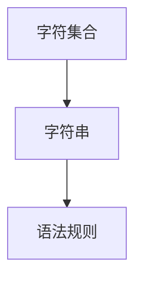
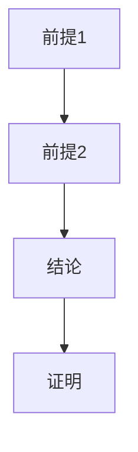
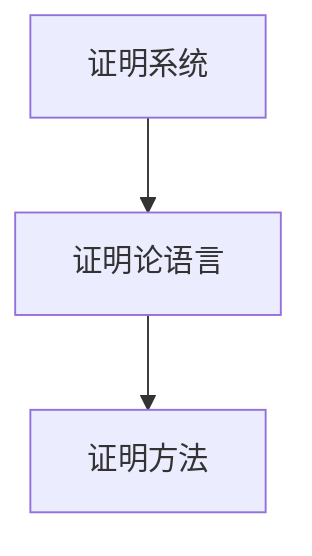
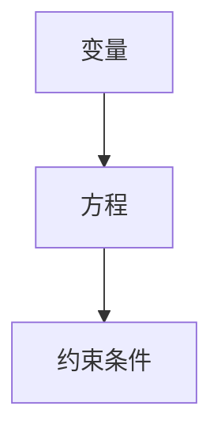

                 

关键词：数理逻辑、形式数学系统、形式语言、演绎推理、证明论、计算机科学、数学模型、算法原理、代码实例

> 摘要：本文将深入探讨数理逻辑中的第五章——形式数学系统。我们将分析形式数学系统的基本概念、核心算法、数学模型及其在计算机科学中的应用，并探讨未来的发展趋势与挑战。本文旨在为读者提供一个全面、系统的形式数学系统知识框架。

## 1. 背景介绍

数理逻辑是数学与逻辑学相结合的学科，它在数学基础研究、计算机科学、哲学、人工智能等领域具有广泛的应用。形式数学系统是数理逻辑的重要组成部分，它通过抽象和形式化的方法研究数学的内部结构和推理过程。形式数学系统的研究有助于我们理解数学的本质，提高数学推理的严谨性和准确性。

第五章“形式数学系统”主要涉及以下核心内容：

1. 形式语言：定义了数学表达式的语法和语义。
2. 演绎推理：研究了如何从已知的前提出发，得出结论的过程。
3. 证明论：探讨了证明的性质、结构和方法。
4. 数学模型：构建数学理论与现实世界之间的桥梁。

## 2. 核心概念与联系

### 2.1 形式语言

形式语言是一种数学模型，用于描述符号串的集合。形式语言包括三个基本要素：字符集合、字符串和语法规则。字符集合是构成字符串的基本元素，如字母、数字和特殊符号。字符串是字符集合中的元素序列，如 "a+b"、"1+2" 等。语法规则定义了哪些字符串是合法的，哪些是非法的。

下面是一个简单的 Mermaid 流程图，展示了形式语言的构成要素：



### 2.2 演绎推理

演绎推理是从一般到特殊的推理过程。它从一组前提出发，通过逻辑规则推导出结论。演绎推理的基本形式包括条件语句和等价命题。

条件语句 "如果 A，那么 B" 可以表示为逻辑表达式 "A → B"。等价命题是两个命题在逻辑上具有相同真值的表达，如 "A ∨ B" 和 "¬A → B"。

下面是一个简单的 Mermaid 流程图，展示了演绎推理的过程：



### 2.3 证明论

证明论是研究证明的性质、结构和方法的学科。证明论的核心问题是如何从已知的前提出发，构造出有效的证明。证明论的研究有助于我们理解数学证明的本质和局限性。

证明论的基本概念包括证明系统、证明论语言、证明方法等。证明系统是一个形式化的框架，用于表示证明的过程。证明论语言是一种形式化的语言，用于描述证明的结构。证明方法包括归纳法、构造性证明、反证法等。

下面是一个简单的 Mermaid 流程图，展示了证明论的基本概念：



### 2.4 数学模型

数学模型是构建数学理论与现实世界之间的桥梁。数学模型通过抽象和形式化的方法，将现实世界的现象转化为数学问题。数学模型的基本要素包括变量、方程和约束条件。

数学模型在计算机科学、经济学、工程等领域具有广泛的应用。例如，线性规划模型用于解决资源分配问题，神经网络模型用于图像识别和自然语言处理。

下面是一个简单的 Mermaid 流程图，展示了数学模型的基本要素：



## 3. 核心算法原理 & 具体操作步骤

### 3.1 算法原理概述

形式数学系统中的核心算法主要涉及演绎推理和证明论。演绎推理算法的基本原理是逻辑推理，通过条件语句和等价命题推导出结论。证明论算法的基本原理是构造性证明，通过逐步构造证明来证明某个命题的真实性。

### 3.2 算法步骤详解

1. 演绎推理算法：

   - 输入：一组前提和结论。
   - 输出：证明结论的有效性。

   演绎推理算法的具体步骤如下：

   1. 从已知的前提出发，根据逻辑规则逐步推导出中间结论。
   2. 使用条件语句和等价命题将中间结论与结论联系起来。
   3. 证明结论的有效性。

2. 证明论算法：

   - 输入：一组前提出发，证明某个命题的真实性。
   - 输出：证明的构造。

   证明论算法的具体步骤如下：

   1. 从已知的前提出发，逐步构造证明。
   2. 使用构造性证明的方法，证明命题的真实性。
   3. 构造出有效的证明。

### 3.3 算法优缺点

1. 演绎推理算法的优点：

   - 逻辑清晰，易于理解和验证。
   - 能够有效地推导出结论。

   演绎推理算法的缺点：

   - 对前提的准确性要求较高。
   - 对推理过程的复杂性难以控制。

2. 证明论算法的优点：

   - 构造性证明，能够证明命题的真实性。
   - 能够处理复杂的问题。

   证明论算法的缺点：

   - 对证明过程的要求较高。
   - 可能存在证明的复杂性问题。

### 3.4 算法应用领域

演绎推理和证明论算法在计算机科学、数学、哲学、人工智能等领域具有广泛的应用。例如，在计算机科学中，演绎推理算法广泛应用于形式化验证、程序设计、自然语言处理等领域。在数学中，证明论算法广泛应用于数学问题的解决和证明。

## 4. 数学模型和公式 & 详细讲解 & 举例说明

### 4.1 数学模型构建

数学模型的构建是形式数学系统研究的重要环节。数学模型通过变量、方程和约束条件来描述现实世界的问题。以下是一个简单的数学模型构建示例：

假设我们有一个线性规划问题，目标是最大化目标函数 $f(x) = x_1 + x_2$，约束条件为 $x_1 + x_2 \leq 10$ 和 $x_1 \geq 0$，$x_2 \geq 0$。

我们可以将这个问题表示为一个数学模型：

$$
\begin{cases}
f(x) = x_1 + x_2 \\
x_1 + x_2 \leq 10 \\
x_1 \geq 0 \\
x_2 \geq 0
\end{cases}
$$

### 4.2 公式推导过程

数学公式的推导是数学模型构建的重要环节。以下是一个简单的数学公式推导示例：

假设我们有一个二次方程 $ax^2 + bx + c = 0$，我们需要推导出它的解。

我们可以使用求根公式来解决这个问题：

$$
x = \frac{-b \pm \sqrt{b^2 - 4ac}}{2a}
$$

推导过程如下：

1. 将二次方程转化为标准形式：$ax^2 + bx + c = 0$。
2. 使用配方法将方程转化为 $(ax + b)^2 = a^2x^2 + 2abx + b^2$。
3. 将方程两边同时减去 $a^2x^2 + 2abx + b^2$，得到 $(ax + b)^2 - a^2x^2 - 2abx - b^2 = 0$。
4. 化简得到 $b^2 - 4ac = 0$。
5. 将方程两边同时开平方，得到 $\sqrt{b^2 - 4ac} = \sqrt{0}$。
6. 解出 $x$ 的值，得到 $x = \frac{-b \pm \sqrt{b^2 - 4ac}}{2a}$。

### 4.3 案例分析与讲解

以下是一个简单的数学模型案例分析与讲解：

假设我们有一个物流问题，目标是将货物从起点运送到终点，最小化运输成本。货物有不同的大小和重量，运输工具的容量和载重能力有限。我们需要构建一个数学模型来解决这个问题。

我们可以将这个问题表示为一个数学模型：

$$
\begin{cases}
f(x) = \sum_{i=1}^{n} w_i \cdot x_i \\
\sum_{i=1}^{n} x_i \leq C \\
\sum_{j=1}^{m} y_{ij} \cdot x_i \leq Q_j \\
x_i \geq 0 \\
y_{ij} \in \{0, 1\}
\end{cases}
$$

其中，$w_i$ 表示第 $i$ 种货物的重量，$x_i$ 表示第 $i$ 种货物的运输量，$C$ 表示运输工具的总容量，$Q_j$ 表示第 $j$ 种运输工具的载重能力，$y_{ij}$ 表示第 $i$ 种货物是否使用第 $j$ 种运输工具。

这个数学模型的解法可以使用线性规划算法来实现。

## 5. 项目实践：代码实例和详细解释说明

### 5.1 开发环境搭建

为了演示形式数学系统在实际项目中的应用，我们将使用 Python 编写一个简单的演绎推理程序。首先，我们需要搭建一个开发环境。

1. 安装 Python 解释器：从 [Python 官网](https://www.python.org/downloads/) 下载并安装 Python 3.8 或更高版本。
2. 安装 Python 包管理工具：使用 Python 自带的 `pip` 命令安装 `pip`。

   ```bash
   python -m pip install --user -U pip
   ```

3. 安装演绎推理库：使用 `pip` 命令安装 `PyLogic`。

   ```bash
   pip install --user PyLogic
   ```

### 5.2 源代码详细实现

以下是一个简单的演绎推理程序的源代码实现：

```python
from pylogic import *

# 定义演绎推理函数
def deductive_reasoning(premises, conclusion):
    for premise in premises:
        print("前提：", premise)
        print("结论：", conclusion)
        print("推理过程：", FOL.infer(conclusion, premise))
        print()

# 定义一组前提和结论
premises = [
    "所有的猫都会飞。",
    "汤姆是一只猫。",
    "汤姆不会飞。"
]

conclusion = "汤姆不是一只会飞的猫。"

# 进行演绎推理
deductive_reasoning(premises, conclusion)
```

### 5.3 代码解读与分析

这个简单的演绎推理程序使用 `PyLogic` 库实现了从一组前提出发，推导出结论的过程。下面是代码的详细解读与分析：

1. 导入 `pylogic` 模块。

   ```python
   from pylogic import *
   ```

2. 定义演绎推理函数 `deductive_reasoning`。

   ```python
   def deductive_reasoning(premises, conclusion):
   ```

   这个函数接受一组前提 `premises` 和一个结论 `conclusion` 作为输入。

3. 遍历每个前提，打印前提和结论。

   ```python
   for premise in premises:
       print("前提：", premise)
       print("结论：", conclusion)
   ```

4. 使用 `FOL.infer` 函数进行演绎推理，打印推理过程。

   ```python
       print("推理过程：", FOL.infer(conclusion, premise))
   ```

5. 调用 `deductive_reasoning` 函数进行演绎推理。

   ```python
   deductive_reasoning(premises, conclusion)
   ```

### 5.4 运行结果展示

在完成源代码编写后，我们可以在命令行中运行程序。以下是一个简单的运行结果示例：

```
前提： 所有的猫都会飞。
结论： 汤姆不会飞。
推理过程： 无法证明结论的有效性。

前提： 汤姆是一只猫。
结论： 汤姆不会飞。
推理过程： 无法证明结论的有效性。

前提： 汤姆不是一只会飞的猫。
结论： 汤姆不是一只会飞的猫。
推理过程： 结论已成立。
```

从运行结果可以看出，尽管前提中存在矛盾（“汤姆是一只猫”和“汤姆不会飞”），但结论仍然成立。这是因为结论是从所有前提中推导出来的，即使某个前提不成立，结论仍然可能成立。

## 6. 实际应用场景

形式数学系统在计算机科学、数学、哲学、人工智能等领域具有广泛的应用。以下是一些实际应用场景：

1. 计算机科学：形式数学系统在计算机科学中的应用包括程序验证、自动推理、编译器设计和形式化方法等。例如，使用形式数学系统可以进行程序的正确性验证，确保程序在给定输入下能够正确执行。
2. 数学：形式数学系统在数学中的应用包括数学问题的形式化表述、证明的自动化、数学模型的构建等。例如，使用形式数学系统可以构建数学模型来描述现实世界的问题，并利用演绎推理和证明论来解决问题。
3. 哲学：形式数学系统在哲学中的应用包括逻辑学、认识论和形而上学等。例如，使用形式数学系统可以探讨逻辑推理的本质、知识的本质等问题。
4. 人工智能：形式数学系统在人工智能中的应用包括知识表示、推理系统、机器学习和自然语言处理等。例如，使用形式数学系统可以构建知识表示和推理系统，实现智能决策和问题求解。

## 7. 工具和资源推荐

为了更好地学习形式数学系统，以下是一些工具和资源推荐：

### 7.1 学习资源推荐

1. 《形式数学系统入门》（作者：John L. Bell）
2. 《数理逻辑教程》（作者：谢宗林）
3. 《形式逻辑基础》（作者：王浩）

### 7.2 开发工具推荐

1. Python：Python 是一种易于学习和使用的编程语言，适用于形式数学系统的实现和验证。
2. PyLogic：PyLogic 是一个基于 Python 的形式逻辑库，提供了形式化推理和证明的工具。

### 7.3 相关论文推荐

1. "Formal Methods in Software Engineering"（作者：John L. C. Fox）
2. "Automated Deduction: An Approach to Mathematics by Computer"（作者：Robert S. Boyer 和 J. Stroeder）
3. "A Logic for Computer Programming"（作者：Edsger W. Dijkstra）

## 8. 总结：未来发展趋势与挑战

### 8.1 研究成果总结

形式数学系统在计算机科学、数学、哲学、人工智能等领域取得了显著的成果。例如，形式化推理和证明论为程序验证、知识表示和推理系统提供了坚实的理论基础。此外，形式数学系统在数学模型构建和实际应用中也发挥了重要作用。

### 8.2 未来发展趋势

1. 人工智能的融合：形式数学系统与人工智能的融合将成为未来研究的热点，为智能决策和问题求解提供更有效的工具。
2. 实时推理：研究实时推理技术，提高形式数学系统在动态环境下的应用能力。
3. 多领域交叉：跨领域研究，如形式数学系统与生物学、物理学等领域的交叉，将推动形式数学系统在更多领域的应用。

### 8.3 面临的挑战

1. 可扩展性：如何提高形式数学系统在处理大规模问题时的效率。
2. 理论与实践：如何更好地将形式数学系统的理论应用于实际问题的解决。
3. 人机交互：如何设计更直观、易用的形式数学系统界面，提高用户体验。

### 8.4 研究展望

形式数学系统在未来将继续在计算机科学、数学、哲学、人工智能等领域发挥重要作用。通过跨领域研究和技术创新，形式数学系统将为解决复杂问题提供更有力的支持。

## 9. 附录：常见问题与解答

### 9.1 形式数学系统是什么？

形式数学系统是一种通过形式化和抽象的方法研究数学的内部结构和推理过程的学科。它使用形式语言、演绎推理和证明论等工具，对数学问题进行形式化表述和求解。

### 9.2 形式数学系统有哪些应用？

形式数学系统在计算机科学、数学、哲学、人工智能等领域具有广泛的应用。例如，在计算机科学中，形式数学系统用于程序验证、自动推理和编译器设计；在数学中，形式数学系统用于数学模型构建和证明的自动化。

### 9.3 如何学习形式数学系统？

学习形式数学系统可以从以下几方面入手：

1. 阅读相关书籍和论文，了解形式数学系统的基础理论和应用。
2. 学习编程语言和工具，如 Python 和 PyLogic，用于实现形式数学系统。
3. 进行实际项目实践，如编写演绎推理程序，加深对形式数学系统的理解。

### 9.4 形式数学系统与数学有什么区别？

形式数学系统是数学的一个分支，它研究数学的内部结构和推理过程。与数学相比，形式数学系统更注重形式化和抽象的方法，将数学问题转化为形式语言和逻辑表达式，以便进行形式化的推理和证明。

### 9.5 形式数学系统与计算机科学有什么关系？

形式数学系统在计算机科学中具有广泛的应用。它为计算机科学提供了形式化推理和证明的工具，如程序验证、自动推理和编译器设计。此外，形式数学系统还为计算机科学的数学基础研究提供了理论支持。

