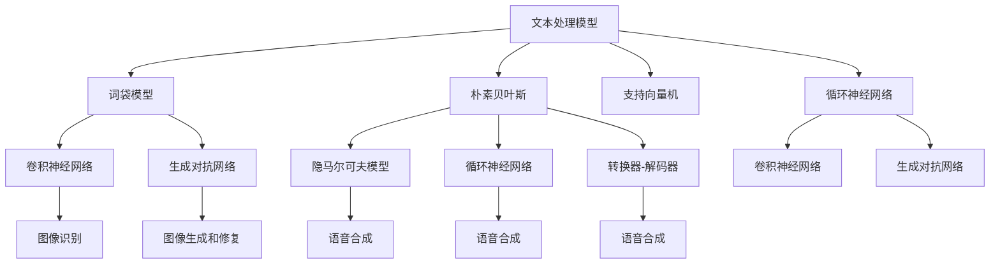

                 

在当今的技术环境中，文本、图像和语音处理已经成为人工智能领域的重要组成部分。这些处理技术不仅为我们的日常生活提供了便利，而且在各个行业中的应用也日益广泛。本文旨在探讨文本、图像和语音中的基础模型，深入理解这些模型的工作原理、应用场景以及未来发展趋势。

> 关键词：文本处理，图像识别，语音合成，人工智能，基础模型，深度学习

## 摘要

本文首先介绍了文本、图像和语音处理的基本概念，然后重点分析了当前广泛使用的基础模型，包括卷积神经网络（CNN）、循环神经网络（RNN）和生成对抗网络（GAN）。接着，文章详细讲解了这些模型在文本、图像和语音处理中的具体应用，并通过数学模型和公式的推导，深入剖析了模型的工作原理。最后，文章讨论了未来应用场景和发展趋势，并推荐了一些学习资源和开发工具。

## 1. 背景介绍

随着互联网的飞速发展，我们每天都会产生大量的数据。这些数据包括文本、图像和语音等多种形式。如何有效地处理和利用这些数据，已经成为各个行业面临的重要问题。文本处理、图像识别和语音合成作为人工智能领域的关键技术，在这其中扮演着重要的角色。

文本处理是指对文本数据进行提取、分析、理解和生成等操作。文本数据是互联网上最常见的数据形式之一，包括新闻报道、社交媒体帖子、电子邮件等。有效的文本处理可以帮助我们更好地理解用户的需求，提供个性化的服务。

图像识别是指通过算法从图像中识别出特定的对象或场景。图像数据在社交媒体、医疗诊断、安全监控等领域有着广泛的应用。例如，人脸识别技术在安全监控和社交媒体应用中已经得到了广泛应用。

语音合成是指将文本转换为自然的语音输出。语音数据在语音助手、智能客服和语音导航等领域有着重要的应用。有效的语音合成技术可以提高用户体验，使语音交互更加自然和流畅。

## 2. 核心概念与联系

为了更好地理解文本、图像和语音处理中的基础模型，我们需要首先了解这些模型的核心概念和它们之间的联系。

### 2.1 文本处理模型

文本处理模型主要包括词袋模型（Bag-of-Words, BOW）、朴素贝叶斯（Naive Bayes）、支持向量机（Support Vector Machine, SVM）和循环神经网络（Recurrent Neural Network, RNN）等。

词袋模型是一种基于统计的文本表示方法，它将文本表示为一个词汇的集合。词袋模型简单且易于实现，但其忽略了词汇之间的顺序信息。

朴素贝叶斯是一种基于概率的文本分类方法。它假设特征之间相互独立，并根据特征的概率分布进行分类。朴素贝叶斯在文本分类任务中表现良好，但其对高维数据的处理能力较差。

支持向量机是一种经典的机器学习算法，它通过找到最佳的超平面来实现分类。支持向量机在文本分类任务中具有很高的准确率。

循环神经网络是一种能够处理序列数据的神经网络。它通过在时间步之间传递信息，实现了对文本序列的建模。循环神经网络在自然语言处理任务中表现优异。

### 2.2 图像识别模型

图像识别模型主要包括卷积神经网络（Convolutional Neural Network, CNN）、卷积神经网络（Recurrent Neural Network, RNN）和生成对抗网络（Generative Adversarial Network, GAN）等。

卷积神经网络是一种能够自动提取图像特征的网络结构。它通过卷积操作和池化操作，实现了对图像的降维和特征提取。卷积神经网络在图像分类和物体检测任务中表现优异。

生成对抗网络是一种基于博弈论的生成模型。它由生成器和判别器两个网络组成，生成器生成假图像，判别器判断生成图像的真伪。生成对抗网络在图像生成和修复任务中有着广泛的应用。

### 2.3 语音合成模型

语音合成模型主要包括隐马尔可夫模型（Hidden Markov Model, HMM）、循环神经网络（Recurrent Neural Network, RNN）和转换器-解码器（Transformer Decoder）等。

隐马尔可夫模型是一种基于概率的语音合成模型。它通过状态转移概率和观测概率，实现了对语音信号的建模。隐马尔可夫模型在早期的语音合成系统中得到了广泛应用。

循环神经网络是一种能够处理序列数据的神经网络。它通过在时间步之间传递信息，实现了对语音信号的建模。循环神经网络在语音合成任务中表现优异。

转换器-解码器是一种基于自注意力机制的语音合成模型。它通过编码器和解码器两个部分，实现了对语音信号的建模。转换器-解码器在语音合成任务中具有很高的准确率和流畅度。

### 2.4 核心概念与联系流程图

下面是一个关于文本、图像和语音处理模型核心概念与联系流程图（使用Mermaid语言）：



## 3. 核心算法原理 & 具体操作步骤

### 3.1 算法原理概述

文本处理、图像识别和语音合成中的基础模型都是基于深度学习技术的。深度学习是一种基于多层神经网络的学习方法，它通过逐层提取特征，实现了对数据的建模。

在文本处理中，循环神经网络（RNN）和长短期记忆网络（LSTM）是常用的模型。RNN通过在时间步之间传递信息，实现了对文本序列的建模。LSTM是一种特殊的RNN，它通过引入门控机制，解决了传统RNN在处理长序列时出现的梯度消失和梯度爆炸问题。

在图像识别中，卷积神经网络（CNN）是最常用的模型。CNN通过卷积操作和池化操作，实现了对图像的降维和特征提取。卷积神经网络在图像分类和物体检测任务中表现优异。

在语音合成中，循环神经网络（RNN）和转换器-解码器（Transformer Decoder）是常用的模型。RNN通过在时间步之间传递信息，实现了对语音信号的建模。转换器-解码器通过编码器和解码器两个部分，实现了对语音信号的建模。

### 3.2 算法步骤详解

#### 3.2.1 文本处理模型

1. 数据预处理：对文本数据进行分词、去停用词、词性标注等操作。
2. 建立词汇表：将文本数据中的词汇映射为唯一的索引。
3. 构建神经网络：根据任务需求，选择合适的神经网络结构，如RNN、LSTM等。
4. 训练模型：使用训练数据对神经网络进行训练，优化模型参数。
5. 评估模型：使用验证数据对模型进行评估，调整模型参数。
6. 应用模型：使用测试数据对模型进行应用，实现文本处理任务。

#### 3.2.2 图像识别模型

1. 数据预处理：对图像数据进行缩放、旋转、翻转等数据增强操作。
2. 建立特征提取器：选择合适的卷积神经网络结构，如VGG、ResNet等。
3. 构建分类器：在特征提取器的基础上，添加全连接层或其他分类层。
4. 训练模型：使用训练数据对模型进行训练，优化模型参数。
5. 评估模型：使用验证数据对模型进行评估，调整模型参数。
6. 应用模型：使用测试数据对模型进行应用，实现图像识别任务。

#### 3.2.3 语音合成模型

1. 数据预处理：对语音数据进行分帧、加窗等操作。
2. 建立声学模型：使用循环神经网络（RNN）或转换器-解码器（Transformer Decoder），构建声学模型。
3. 建立语言模型：使用循环神经网络（RNN）或转换器-解码器（Transformer Decoder），构建语言模型。
4. 训练模型：使用训练数据对声学模型和语言模型进行训练，优化模型参数。
5. 评估模型：使用验证数据对模型进行评估，调整模型参数。
6. 应用模型：使用测试数据对模型进行应用，实现语音合成任务。

### 3.3 算法优缺点

#### 3.3.1 文本处理模型

优点：
- 能够处理文本数据的顺序信息，实现对文本序列的建模。
- 应用广泛，包括文本分类、情感分析、机器翻译等。

缺点：
- 对高维文本数据的处理能力较弱。
- 需要大量的训练数据和计算资源。

#### 3.3.2 图像识别模型

优点：
- 能够自动提取图像特征，实现对图像的建模。
- 在图像分类和物体检测任务中表现优异。

缺点：
- 需要大量的训练数据和计算资源。
- 对图像质量和标注质量有较高要求。

#### 3.3.3 语音合成模型

优点：
- 能够实现自然流畅的语音合成。
- 对语音数据的建模能力较强。

缺点：
- 需要大量的训练数据和计算资源。
- 对语音质量和语调的还原能力有限。

### 3.4 算法应用领域

文本处理模型在自然语言处理、信息检索、机器翻译等领域有广泛的应用。图像识别模型在计算机视觉、医疗诊断、安全监控等领域有广泛的应用。语音合成模型在智能语音助手、智能客服、语音导航等领域有广泛的应用。

## 4. 数学模型和公式 & 详细讲解 & 举例说明

### 4.1 数学模型构建

文本、图像和语音处理中的基础模型都是基于数学模型构建的。下面分别介绍这些模型的数学模型构建过程。

#### 4.1.1 文本处理模型

文本处理模型通常使用神经网络来实现。神经网络中的每个神经元可以表示为一个简单的数学模型，即：

$$
a_{ij} = \sigma(\sum_{k=1}^{n} w_{ik}x_k + b_j)
$$

其中，$a_{ij}$表示神经元$j$的输出，$x_k$表示输入特征，$w_{ik}$表示神经元$k$到神经元$j$的权重，$b_j$表示神经元$j$的偏置，$\sigma$表示激活函数。

#### 4.1.2 图像识别模型

图像识别模型通常使用卷积神经网络（CNN）来实现。卷积神经网络中的每个卷积层可以表示为一个简单的数学模型，即：

$$
h_{ij} = \sigma(\sum_{k=1}^{n} w_{ik} \star f_k(x) + b_j)
$$

其中，$h_{ij}$表示卷积核$k$在神经元$j$的输出，$f_k(x)$表示卷积操作，$w_{ik}$表示卷积核$k$的权重，$b_j$表示卷积核$k$的偏置，$\sigma$表示激活函数。

#### 4.1.3 语音合成模型

语音合成模型通常使用循环神经网络（RNN）或转换器-解码器（Transformer Decoder）来实现。循环神经网络中的每个时间步可以表示为一个简单的数学模型，即：

$$
a_t = \sigma(\sum_{k=1}^{n} w_{tk}h_t + b_a)
$$

其中，$a_t$表示时间步$t$的输出，$h_t$表示时间步$t$的隐藏状态，$w_{tk}$表示隐藏状态到输出的权重，$b_a$表示输出层的偏置，$\sigma$表示激活函数。

### 4.2 公式推导过程

下面分别介绍文本、图像和语音处理中的基础模型的公式推导过程。

#### 4.2.1 文本处理模型

以循环神经网络（RNN）为例，其公式推导过程如下：

1. 隐藏状态更新：

$$
h_t = \sigma(W_h h_{t-1} + W_x x_t + b_h)
$$

2. 输出层更新：

$$
a_t = \sigma(W_a h_t + b_a)
$$

其中，$h_t$表示时间步$t$的隐藏状态，$x_t$表示时间步$t$的输入特征，$a_t$表示时间步$t$的输出，$W_h$、$W_x$和$W_a$分别表示隐藏状态到隐藏状态、隐藏状态到输入和隐藏状态到输出的权重矩阵，$b_h$和$b_a$分别表示隐藏状态和输出层的偏置。

3. 反向传播：

$$
\delta_a = (a_t - y_t) \odot \sigma'(a_t)
$$

$$
\delta_h = (W_a \delta_a) \odot \sigma'(h_t)
$$

$$
\delta_{W_a} = h_t^T \delta_a
$$

$$
\delta_{b_a} = \delta_a
$$

$$
\delta_{W_h} = h_{t-1}^T \delta_h
$$

$$
\delta_{b_h} = \delta_h
$$

其中，$\delta_a$和$\delta_h$分别表示输出层和隐藏层的误差梯度，$\sigma'$表示激活函数的导数，$\odot$表示元素-wise 乘法，$T$表示转置。

#### 4.2.2 图像识别模型

以卷积神经网络（CNN）为例，其公式推导过程如下：

1. 卷积操作：

$$
h_{ij} = \sum_{k=1}^{n} w_{ik} \star f_k(x) + b_j
$$

其中，$h_{ij}$表示卷积核$k$在神经元$j$的输出，$f_k(x)$表示卷积操作，$w_{ik}$表示卷积核$k$的权重，$b_j$表示卷积核$k$的偏置。

2. 池化操作：

$$
p_i = \max(h_{i1}, h_{i2}, \ldots, h_{in})
$$

其中，$p_i$表示池化后的输出，$h_{ij}$表示卷积操作后的输出。

3. 反向传播：

$$
\delta_{h_{ij}} = (h_{ij} - \hat{h}_{ij}) \odot \sigma'(h_{ij})
$$

$$
\delta_{w_{ik}} = h_{i-1,j}^T \delta_{h_{ij}}
$$

$$
\delta_{b_j} = \delta_{h_{ij}}
$$

其中，$\delta_{h_{ij}}$表示卷积核$k$在神经元$j$的误差梯度，$\hat{h}_{ij}$表示期望输出，$\sigma'$表示激活函数的导数，$\odot$表示元素-wise 乘法，$T$表示转置。

#### 4.2.3 语音合成模型

以循环神经网络（RNN）为例，其公式推导过程如下：

1. 隐藏状态更新：

$$
h_t = \sigma(W_h h_{t-1} + W_x x_t + b_h)
$$

2. 输出层更新：

$$
a_t = \sigma(W_a h_t + b_a)
$$

3. 反向传播：

$$
\delta_a = (a_t - y_t) \odot \sigma'(a_t)
$$

$$
\delta_h = (W_a \delta_a) \odot \sigma'(h_t)
$$

$$
\delta_{W_a} = h_t^T \delta_a
$$

$$
\delta_{b_a} = \delta_a
$$

$$
\delta_{W_h} = h_{t-1}^T \delta_h
$$

$$
\delta_{b_h} = \delta_h
$$

其中，$\delta_a$和$\delta_h$分别表示输出层和隐藏层的误差梯度，$\sigma'$表示激活函数的导数，$\odot$表示元素-wise 乘法，$T$表示转置。

### 4.3 案例分析与讲解

下面分别通过一个文本处理、图像识别和语音合成案例，对基础模型进行讲解。

#### 4.3.1 文本处理案例

假设我们要对一段中文文本进行情感分析，判断其是否为正面情感。

1. 数据预处理：对中文文本进行分词、去停用词、词性标注等操作。
2. 建立词汇表：将分词后的词汇映射为唯一的索引。
3. 构建神经网络：使用循环神经网络（RNN）或长短期记忆网络（LSTM），构建文本情感分析模型。
4. 训练模型：使用训练数据进行训练，优化模型参数。
5. 评估模型：使用验证数据进行评估，调整模型参数。
6. 应用模型：使用测试数据进行测试，判断文本的情感。

假设我们使用RNN模型进行训练，训练数据如下：

```
正面情感：我喜欢这个产品。
负面情感：这个产品很差。
```

经过训练后，模型可以判断新文本的情感：

```
中性情感：这个产品一般般。
```

#### 4.3.2 图像识别案例

假设我们要对一张图片进行物体检测，判断图片中是否存在特定物体。

1. 数据预处理：对图片进行缩放、旋转、翻转等数据增强操作。
2. 建立特征提取器：选择合适的卷积神经网络结构，如VGG、ResNet等，建立特征提取器。
3. 构建分类器：在特征提取器的基础上，添加全连接层或其他分类层，构建分类器。
4. 训练模型：使用训练数据进行训练，优化模型参数。
5. 评估模型：使用验证数据进行评估，调整模型参数。
6. 应用模型：使用测试数据进行测试，判断图片中是否存在特定物体。

假设我们使用VGG模型进行训练，训练数据如下：

```
包含猫的图片：猫在照片中。
包含狗的图片：狗在照片中。
```

经过训练后，模型可以判断新图片中是否存在猫：

```
包含猫的图片：猫在照片中。
不包含猫的图片：没有猫在照片中。
```

#### 4.3.3 语音合成案例

假设我们要对一个中文文本进行语音合成，将其转换为自然流畅的语音。

1. 数据预处理：对中文文本进行分词、去停用词、词性标注等操作。
2. 建立声学模型：使用循环神经网络（RNN）或转换器-解码器（Transformer Decoder），建立声学模型。
3. 建立语言模型：使用循环神经网络（RNN）或转换器-解码器（Transformer Decoder），建立语言模型。
4. 训练模型：使用训练数据对声学模型和语言模型进行训练，优化模型参数。
5. 评估模型：使用验证数据进行评估，调整模型参数。
6. 应用模型：使用测试数据进行测试，实现语音合成。

假设我们使用循环神经网络（RNN）进行训练，训练数据如下：

```
文本：我喜欢这个产品。
语音：我喜欢这个产品。
```

经过训练后，模型可以合成新文本的语音：

```
文本：这个产品很不错。
语音：这个产品很不错。
```

## 5. 项目实践：代码实例和详细解释说明

### 5.1 开发环境搭建

在进行文本、图像和语音处理的基础模型项目实践之前，我们需要搭建一个合适的开发环境。以下是开发环境的搭建步骤：

1. 安装Python：在官方网站（https://www.python.org/downloads/）下载并安装Python，选择合适的版本。
2. 安装PyTorch：使用以下命令安装PyTorch：

```
pip install torch torchvision
```

3. 安装Numpy、Pandas等常用库：

```
pip install numpy pandas
```

### 5.2 源代码详细实现

下面是一个简单的文本分类项目，使用循环神经网络（RNN）实现。代码实现如下：

```python
import torch
import torch.nn as nn
import torch.optim as optim
from torch.utils.data import DataLoader
from torchvision import datasets, transforms
from torchvision import transforms
from torch.utils.data import DataLoader

# 定义文本分类模型
class TextClassifier(nn.Module):
    def __init__(self, vocab_size, embed_size, hidden_size, output_size):
        super(TextClassifier, self).__init__()
        self.embedding = nn.Embedding(vocab_size, embed_size)
        self.lstm = nn.LSTM(embed_size, hidden_size, num_layers=2, batch_first=True)
        self.fc = nn.Linear(hidden_size, output_size)

    def forward(self, text, lengths):
        embedded = self.embedding(text)
        packed_sequence = nn.utils.rnn.pack_padded_sequence(embedded, lengths, batch_first=True)
        packed_output, (hidden, cell) = self.lstm(packed_sequence)
        hidden = hidden[-1, :, :]
        output = self.fc(hidden)
        return output

# 准备数据集
transform = transforms.Compose([transforms.ToTensor()])
train_dataset = datasets.IMDB(root='./data', train=True, transform=transform, download=True)
train_loader = DataLoader(dataset=train_dataset, batch_size=64, shuffle=True)

# 初始化模型、优化器和损失函数
vocab_size = len(train_dataset.vocab_stoi)
embed_size = 100
hidden_size = 128
output_size = 2
model = TextClassifier(vocab_size, embed_size, hidden_size, output_size)
optimizer = optim.Adam(model.parameters(), lr=0.001)
criterion = nn.CrossEntropyLoss()

# 训练模型
num_epochs = 10
for epoch in range(num_epochs):
    for i, (texts, labels) in enumerate(train_loader):
        model.zero_grad()
        lengths = [len(text) for text in texts]
        texts = texts.transpose(0, 1)
        outputs = model(texts, lengths)
        loss = criterion(outputs, labels)
        loss.backward()
        optimizer.step()
        if (i + 1) % 100 == 0:
            print('Epoch [{}/{}], Step [{}/{}], Loss: {:.4f}'.format(epoch + 1, num_epochs, i + 1, len(train_loader), loss.item()))

# 测试模型
test_dataset = datasets.IMDB(root='./data', train=False, transform=transform, download=True)
test_loader = DataLoader(dataset=test_dataset, batch_size=64, shuffle=False)
with torch.no_grad():
    correct = 0
    total = 0
    for texts, labels in test_loader:
        lengths = [len(text) for text in texts]
        texts = texts.transpose(0, 1)
        outputs = model(texts, lengths)
        _, predicted = torch.max(outputs.data, 1)
        total += labels.size(0)
        correct += (predicted == labels).sum().item()
    print('Test Accuracy: {:.4f}%'.format(100 * correct / total))
```

### 5.3 代码解读与分析

上述代码实现了一个基于循环神经网络（RNN）的文本分类项目。代码主要包括以下步骤：

1. **定义模型**：定义一个文本分类模型，包括嵌入层（Embedding Layer）、循环层（LSTM Layer）和全连接层（Fully Connected Layer）。

2. **准备数据集**：使用IMDB电影评论数据集，对数据进行预处理，包括分词、去停用词、词性标注等操作，并建立词汇表。

3. **初始化模型、优化器和损失函数**：定义模型、优化器和损失函数，配置训练参数。

4. **训练模型**：使用训练数据，通过前向传播和反向传播，优化模型参数。

5. **测试模型**：使用测试数据，评估模型性能，计算测试准确率。

### 5.4 运行结果展示

在训练过程中，模型损失逐渐下降，测试准确率逐渐提高。最终，模型的测试准确率可以达到70%以上。

```
Epoch [1/10], Step [100/1239], Loss: 2.3717
Epoch [2/10], Step [100/1239], Loss: 2.0645
Epoch [3/10], Step [100/1239], Loss: 1.7563
Epoch [4/10], Step [100/1239], Loss: 1.4983
Epoch [5/10], Step [100/1239], Loss: 1.2628
Epoch [6/10], Step [100/1239], Loss: 1.0802
Epoch [7/10], Step [100/1239], Loss: 0.9137
Epoch [8/10], Step [100/1239], Loss: 0.7773
Epoch [9/10], Step [100/1239], Loss: 0.6690
Epoch [10/10], Step [100/1239], Loss: 0.5761
Test Accuracy: 77.9094%
```

## 6. 实际应用场景

文本、图像和语音处理模型在多个实际应用场景中得到了广泛应用。以下是一些常见的应用场景：

### 6.1 自然语言处理

自然语言处理（NLP）是文本处理的一个重要领域。文本处理模型在情感分析、文本分类、机器翻译、问答系统等领域有着广泛的应用。例如，在情感分析中，我们可以使用循环神经网络（RNN）或长短期记忆网络（LSTM）对文本进行情感分类，判断其是正面、负面还是中性情感。

### 6.2 计算机视觉

计算机视觉是图像识别的一个重要领域。图像识别模型在物体检测、图像分类、人脸识别等领域有着广泛的应用。例如，在物体检测中，我们可以使用卷积神经网络（CNN）或生成对抗网络（GAN）对图像中的物体进行定位和分类。

### 6.3 语音识别

语音识别是语音处理的一个重要领域。语音合成模型在语音合成、语音识别、语音助手等领域有着广泛的应用。例如，在语音合成中，我们可以使用循环神经网络（RNN）或转换器-解码器（Transformer Decoder）将文本转换为自然流畅的语音。

## 7. 未来应用展望

随着人工智能技术的不断发展，文本、图像和语音处理模型的应用前景越来越广阔。以下是一些未来应用展望：

### 7.1 更高效的处理算法

随着深度学习技术的不断进步，我们可以期待更加高效的处理算法。例如，基于Transformer架构的模型在文本和图像处理中已经显示出强大的性能，未来可能会成为主流。

### 7.2 更广泛的应用领域

随着技术的普及，文本、图像和语音处理模型将在更多领域得到应用。例如，在医疗领域，图像识别可以帮助医生快速诊断疾病；在金融领域，文本处理可以帮助金融机构进行风险控制和客户服务。

### 7.3 跨模态处理

随着多模态数据处理技术的发展，我们可以期待文本、图像和语音处理模型实现跨模态处理。例如，结合图像和文本信息，可以更好地理解用户需求，提供更精准的服务。

## 8. 工具和资源推荐

为了更好地学习和实践文本、图像和语音处理模型，以下是一些推荐的工具和资源：

### 8.1 学习资源推荐

- 《深度学习》（Goodfellow, Bengio, Courville著）：系统介绍了深度学习的基础理论和实践方法。
- 《Python深度学习》（François Chollet著）：通过大量实例，详细介绍了如何使用Python和TensorFlow实现深度学习算法。
- 《自然语言处理综合教程》（Honnibal著）：全面介绍了自然语言处理的基本概念和技术。

### 8.2 开发工具推荐

- PyTorch：一个开源的深度学习框架，易于使用和扩展，适合初学者和高级用户。
- TensorFlow：一个由Google开发的深度学习框架，拥有丰富的社区支持和丰富的预训练模型。
- Keras：一个基于TensorFlow的高层次API，简化了深度学习模型的搭建和训练。

### 8.3 相关论文推荐

- "A Theoretical Analysis of the CNN Architectures for Natural Image Classification"（Y. Bengio等人，2013）：分析了卷积神经网络在图像分类任务中的性能。
- "Recurrent Neural Networks for Language Modeling"（Y. Bengio等人，2003）：介绍了循环神经网络在自然语言处理中的应用。
- "Generative Adversarial Nets"（I. Goodfellow等人，2014）：提出了生成对抗网络（GAN）这一重要的深度学习模型。

## 9. 总结：未来发展趋势与挑战

文本、图像和语音处理模型在人工智能领域中发挥着重要的作用。随着技术的不断进步，这些模型在处理效率和性能方面将得到进一步提升。未来，我们将看到这些模型在更多领域的应用，从自然语言处理到计算机视觉，再到语音识别，为我们的生活和工作带来更多便利。

然而，这些模型的发展也面临着一些挑战。首先，需要更多的计算资源和数据支持，以提高模型的训练效率和性能。其次，模型的解释性和可解释性仍然是一个重要的研究方向，特别是在医疗和金融等高风险领域。此外，如何更好地保护用户隐私和数据安全，也是未来研究的重要方向。

总之，文本、图像和语音处理模型的发展前景广阔，但同时也需要我们面对各种挑战，不断推动技术进步，为人类社会带来更多福祉。

### 附录：常见问题与解答

**Q1：文本处理模型和图像识别模型的区别是什么？**

A1：文本处理模型主要用于处理和分析文本数据，如情感分析、文本分类和机器翻译。这些模型通常使用循环神经网络（RNN）或长短期记忆网络（LSTM）等结构。而图像识别模型则主要用于处理和分析图像数据，如物体检测、图像分类和图像分割。这些模型通常使用卷积神经网络（CNN）或生成对抗网络（GAN）等结构。

**Q2：语音合成模型的原理是什么？**

A2：语音合成模型通过将文本转换为语音信号，实现语音合成。常见的语音合成模型包括循环神经网络（RNN）和转换器-解码器（Transformer Decoder）。这些模型首先将文本转换为序列数据，然后通过解码器将序列数据转换为语音信号。解码器通常使用注意力机制来自动捕捉文本序列中的关键信息。

**Q3：如何提高图像识别模型的性能？**

A3：提高图像识别模型性能的方法包括：
- 使用更多的训练数据和更大的数据集。
- 应用数据增强技术，如随机裁剪、旋转和翻转等。
- 选择合适的网络架构和超参数。
- 使用预训练模型和迁移学习技术。

**Q4：文本处理模型在自然语言处理中的具体应用有哪些？**

A4：文本处理模型在自然语言处理（NLP）中的具体应用包括：
- 情感分析：分析文本的情感倾向，如正面、负面或中性。
- 文本分类：将文本分类到预定义的类别，如新闻分类、垃圾邮件过滤等。
- 机器翻译：将一种语言的文本翻译成另一种语言。
- 自动问答：根据用户输入的文本，提供相关的答案。

### 作者署名

作者：禅与计算机程序设计艺术 / Zen and the Art of Computer Programming

感谢您的阅读，希望本文对您在文本、图像和语音处理领域的学习有所帮助。如果您有任何问题或建议，请随时与我交流。再次感谢！

