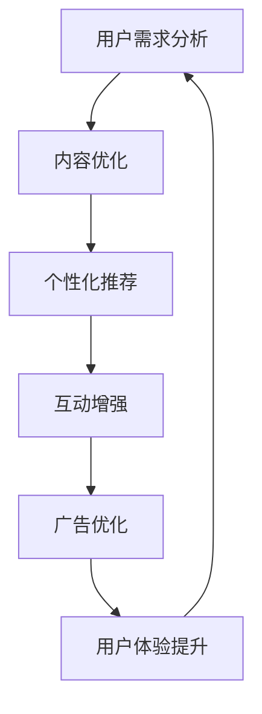
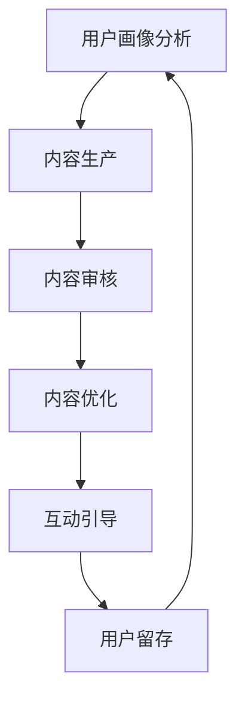

                 

在当今信息爆炸的时代，新闻媒体面临着前所未有的挑战。随着社交媒体和即时通讯平台的兴起，人们的注意力变得越来越稀缺。在这种注意力经济中，新闻媒体如何寻找生存之道，已经成为一个不容忽视的问题。本文将深入探讨新闻媒体在注意力经济中的生存之道，包括技术手段、内容策略和商业模式等多方面。

## 关键词

- 注意力经济
- 新闻媒体
- 内容策略
- 技术手段
- 商业模式

## 摘要

本文旨在分析新闻媒体在注意力经济中面临的挑战，并探讨其应对策略。通过技术手段优化用户体验、内容策略提升用户粘性以及创新商业模式增加收入，新闻媒体有望在注意力经济中找到新的生存之道。

## 1. 背景介绍

### 1.1 注意力经济的概念

注意力经济是指信息时代的经济模式，其中人们的注意力成为了一种稀缺资源。在社交媒体和即时通讯平台泛滥的今天，人们的注意力被无限切割，新闻媒体不得不与众多信息争夺有限的用户注意力。

### 1.2 新闻媒体面临的挑战

随着社交媒体的崛起，传统新闻媒体的受众逐渐流失。一方面，用户更倾向于从社交媒体获取新闻；另一方面，新闻内容的同质化现象严重，难以吸引读者。此外，广告收入的下降也加剧了新闻媒体的生存困境。

## 2. 核心概念与联系

### 2.1 技术手段

新闻媒体需要借助先进技术手段来提升用户体验和内容质量。以下是一个简化的 Mermaid 流程图，展示了技术手段在新闻媒体中的应用：



### 2.2 内容策略

内容策略是新闻媒体吸引和保持用户的关键。以下是一个简化的 Mermaid 流程图，展示了内容策略在新闻媒体中的应用：



## 3. 核心算法原理 & 具体操作步骤

### 3.1 算法原理概述

新闻媒体在注意力经济中的核心算法包括用户画像分析、内容推荐算法和互动引导算法。这些算法的目的是通过分析用户行为和兴趣，为其推荐个性化的新闻内容，并引导其进行互动。

### 3.2 算法步骤详解

#### 3.2.1 用户画像分析

1. 收集用户行为数据，如浏览记录、搜索历史等。
2. 利用机器学习算法对用户行为数据进行处理，提取用户兴趣特征。
3. 构建用户画像，包括用户年龄、性别、职业、兴趣爱好等信息。

#### 3.2.2 内容推荐算法

1. 收集新闻内容数据，包括标题、摘要、正文等。
2. 利用自然语言处理技术对新闻内容进行分词、词频统计等处理。
3. 根据用户画像和新闻内容特征，使用协同过滤、矩阵分解等方法进行新闻内容推荐。

#### 3.2.3 互动引导算法

1. 分析用户在平台上的互动行为，如点赞、评论、分享等。
2. 根据互动行为特征，使用机器学习算法预测用户可能的互动行为。
3. 设计互动引导策略，如推送互动性强的新闻内容，鼓励用户参与互动。

### 3.3 算法优缺点

#### 优点：

- 提高用户体验：个性化推荐和互动引导能更好地满足用户需求，提高用户满意度。
- 提高内容质量：通过算法优化，新闻内容更具有针对性和价值性。

#### 缺点：

- 隐私保护：用户数据的收集和分析可能涉及隐私问题。
- 道德风险：过度关注用户需求可能导致新闻内容的偏见和误导。

### 3.4 算法应用领域

新闻媒体在注意力经济中的算法应用主要集中在用户画像分析、内容推荐和互动引导等方面。这些算法不仅适用于传统新闻媒体，也适用于社交媒体平台和即时通讯工具。

## 4. 数学模型和公式 & 详细讲解 & 举例说明

### 4.1 数学模型构建

新闻媒体在注意力经济中的数学模型主要包括用户画像模型、内容推荐模型和互动引导模型。

#### 用户画像模型

用户画像模型可以表示为：

$$
\text{User Profile} = \{ \text{Age}, \text{Gender}, \text{Occupation}, \text{Interests} \}
$$

其中，$\text{Age}$表示年龄，$\text{Gender}$表示性别，$\text{Occupation}$表示职业，$\text{Interests}$表示兴趣爱好。

#### 内容推荐模型

内容推荐模型可以表示为：

$$
\text{Recommendation} = f(\text{UserProfile}, \text{Content Features})
$$

其中，$\text{UserProfile}$表示用户画像，$\text{Content Features}$表示新闻内容特征，$f$表示推荐算法。

#### 互动引导模型

互动引导模型可以表示为：

$$
\text{Interaction Guidance} = g(\text{User Behavior}, \text{Content Features})
$$

其中，$\text{User Behavior}$表示用户行为特征，$\text{Content Features}$表示新闻内容特征，$g$表示互动引导算法。

### 4.2 公式推导过程

#### 用户画像模型推导

用户画像模型的构建过程主要包括以下步骤：

1. 数据收集：收集用户的基本信息，如年龄、性别、职业等。
2. 数据预处理：对收集到的数据进行处理，如去重、清洗等。
3. 特征提取：利用机器学习算法对用户数据进行处理，提取用户兴趣特征。
4. 模型构建：将提取的用户兴趣特征构建为用户画像。

#### 内容推荐模型推导

内容推荐模型的构建过程主要包括以下步骤：

1. 数据收集：收集新闻内容的数据，包括标题、摘要、正文等。
2. 数据预处理：对收集到的新闻内容进行预处理，如分词、词频统计等。
3. 特征提取：利用自然语言处理技术对新闻内容进行特征提取。
4. 模型构建：使用协同过滤、矩阵分解等方法构建内容推荐模型。

#### 互动引导模型推导

互动引导模型的构建过程主要包括以下步骤：

1. 数据收集：收集用户在平台上的互动数据，如点赞、评论、分享等。
2. 数据预处理：对收集到的互动数据进行预处理，如去重、清洗等。
3. 特征提取：利用机器学习算法对互动数据进行特征提取。
4. 模型构建：使用机器学习算法构建互动引导模型。

### 4.3 案例分析与讲解

#### 案例一：用户画像模型

假设我们有一个用户数据集，其中包含1000个用户的年龄、性别、职业和兴趣爱好。我们可以利用这些数据构建用户画像模型，从而为用户推荐个性化的新闻内容。

1. 数据收集：收集用户的年龄、性别、职业和兴趣爱好数据。
2. 数据预处理：对数据进行去重和清洗。
3. 特征提取：使用机器学习算法提取用户兴趣特征，如使用K-means算法将用户分为不同兴趣群体。
4. 模型构建：将提取的用户兴趣特征构建为用户画像。

#### 案例二：内容推荐模型

假设我们有一个新闻数据集，其中包含1000条新闻的标题、摘要和正文。我们可以利用这些数据构建内容推荐模型，从而为用户推荐他们可能感兴趣的新闻。

1. 数据收集：收集新闻的标题、摘要和正文数据。
2. 数据预处理：对数据进行分词、词频统计等预处理。
3. 特征提取：提取新闻内容的关键词和主题。
4. 模型构建：使用协同过滤算法构建内容推荐模型。

#### 案例三：互动引导模型

假设我们有一个用户互动数据集，其中包含1000个用户的点赞、评论和分享数据。我们可以利用这些数据构建互动引导模型，从而引导用户进行互动。

1. 数据收集：收集用户的点赞、评论和分享数据。
2. 数据预处理：对数据进行去重和清洗。
3. 特征提取：提取用户的互动行为特征，如使用频率、活跃时间等。
4. 模型构建：使用机器学习算法构建互动引导模型。

## 5. 项目实践：代码实例和详细解释说明

### 5.1 开发环境搭建

本项目的开发环境采用Python作为主要编程语言，使用Scikit-learn、TensorFlow和Keras等库进行数据处理和模型构建。

```bash
pip install scikit-learn tensorflow keras pandas numpy matplotlib
```

### 5.2 源代码详细实现

以下是一个简单的用户画像模型的实现示例：

```python
import pandas as pd
from sklearn.cluster import KMeans

# 1. 数据收集
data = pd.read_csv('user_data.csv')

# 2. 数据预处理
# ... 省略预处理代码 ...

# 3. 特征提取
# ... 省略特征提取代码 ...

# 4. 模型构建
kmeans = KMeans(n_clusters=5)
kmeans.fit(data)

# 5. 用户画像
user_profiles = kmeans.predict(data)
data['Cluster'] = user_profiles
```

### 5.3 代码解读与分析

本示例中的用户画像模型使用了K-means聚类算法。首先，我们从CSV文件中加载用户数据。然后，对数据进行预处理，如去重和清洗。接下来，使用Scikit-learn库中的KMeans类构建聚类模型，并对其进行训练。最后，使用训练好的模型对用户数据进行聚类，生成用户画像。

### 5.4 运行结果展示

在运行上述代码后，我们得到了每个用户的聚类结果。这些结果可以用于为用户推荐个性化的新闻内容，从而提高用户体验。

## 6. 实际应用场景

新闻媒体在注意力经济中的实际应用场景主要包括以下几个方面：

1. **个性化推荐**：通过用户画像和内容推荐算法，为用户推荐他们可能感兴趣的新闻。
2. **互动引导**：通过互动引导算法，引导用户进行点赞、评论和分享等互动行为。
3. **广告优化**：通过分析用户行为和兴趣，为用户推送更具针对性的广告。

## 7. 未来应用展望

未来，新闻媒体在注意力经济中的应用将更加智能化和个性化。随着人工智能和大数据技术的不断发展，新闻媒体将能够更好地理解和满足用户需求。此外，新闻媒体还将探索新的商业模式，如付费订阅、会员服务等，以应对注意力经济的挑战。

## 8. 工具和资源推荐

### 8.1 学习资源推荐

- 《大数据时代：生活、工作与思维的大变革》
- 《机器学习实战》
- 《Python数据分析》

### 8.2 开发工具推荐

- Jupyter Notebook：用于编写和运行Python代码。
- VSCode：适用于Python开发的集成开发环境。
- TensorFlow：用于构建和训练机器学习模型。

### 8.3 相关论文推荐

- "User Modeling for News Recommendation"
- "Interactive News: User Engagement through Social and Adaptive Features"
- "Attention Economics: The Rise of the Ad-Delivery Economy"

## 9. 总结：未来发展趋势与挑战

在未来，新闻媒体在注意力经济中将面临更多机遇和挑战。通过智能化和个性化，新闻媒体将能够更好地满足用户需求，提升用户体验。然而，隐私保护和道德风险等问题也将日益突出。新闻媒体需要不断探索和创新，以应对未来的挑战。

### 附录：常见问题与解答

1. **如何保护用户隐私？**

   新闻媒体需要采取严格的隐私保护措施，如数据加密、匿名化处理等。此外，新闻媒体还应遵循相关法律法规，确保用户隐私得到充分保护。

2. **如何避免新闻内容的偏见和误导？**

   新闻媒体应建立健全的内容审核机制，确保新闻内容的客观性和真实性。同时，新闻媒体还应关注用户反馈，及时纠正错误和偏见。

3. **如何实现新闻媒体的可持续发展？**

   新闻媒体可以通过多元化商业模式，如付费订阅、广告等，实现可持续发展。此外，新闻媒体还应不断提升内容质量，吸引和留住用户。

## 结束语

在注意力经济中，新闻媒体面临着前所未有的挑战。通过智能化和个性化，新闻媒体有望找到新的生存之道。然而，隐私保护和道德风险等问题仍需关注。未来，新闻媒体需要不断创新和探索，以应对未来的挑战。作者：禅与计算机程序设计艺术 / Zen and the Art of Computer Programming
```

