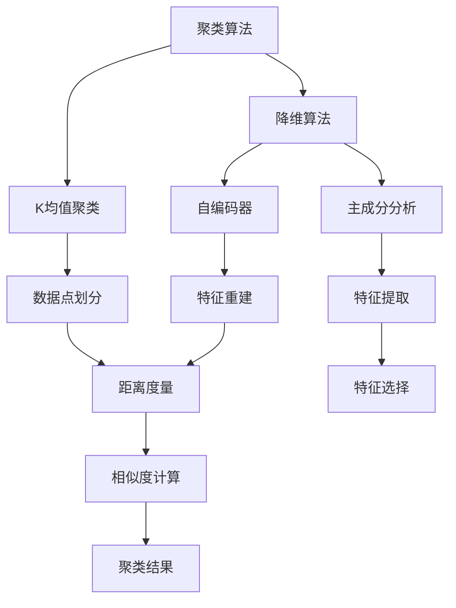

                 

关键词：无监督学习，机器学习，聚类算法，降维算法，数据挖掘，深度学习，K均值，主成分分析，自编码器，AI应用

> 摘要：本文将深入探讨无监督学习（Unsupervised Learning）的概念、原理及其在实际中的应用。我们将通过具体的算法实例，如K均值聚类、主成分分析（PCA）和自编码器等，详细讲解无监督学习的原理、操作步骤、数学模型和代码实现。文章还包含了实际项目中的代码实例解析，以及无监督学习在数据挖掘和深度学习中的未来应用展望。

## 1. 背景介绍

随着大数据和人工智能技术的快速发展，机器学习在各个领域得到了广泛的应用。机器学习可以分为有监督学习（Supervised Learning）、无监督学习（Unsupervised Learning）和半监督学习（Semi-supervised Learning）三种主要类型。有监督学习依赖于标记数据进行训练，而半监督学习利用少量标记数据和大量未标记数据。相对而言，无监督学习则不需要使用标记数据，其主要目标是发现数据中的隐含结构和模式。

无监督学习在数据分析、数据挖掘、图像处理、自然语言处理等领域有着重要的应用。例如，在图像处理中，无监督学习可以用于图像聚类和降维；在自然语言处理中，它可以用于文本聚类和主题模型构建。本文将重点关注无监督学习中的核心算法，包括K均值聚类、主成分分析（PCA）和自编码器，并通过实际代码实例进行讲解。

## 2. 核心概念与联系

### 2.1 无监督学习的定义与分类

无监督学习是指在没有标注数据的情况下，通过数据自身的一些内在结构或相关性，自动发现数据中隐藏的规律或模式的机器学习方法。根据发现数据结构的手段和目的，无监督学习可以进一步细分为以下几类：

- **聚类（Clustering）**：将相似的数据点划分为若干组，使组内的数据点相似度较高，组间的数据点相似度较低。常见的聚类算法有K均值聚类、层次聚类等。
  
- **降维（Dimensionality Reduction）**：通过投影或变换，将高维数据映射到低维空间，减少数据的维度，同时保留尽可能多的原始数据的信息。常见的方法有主成分分析（PCA）、线性判别分析（LDA）等。

- **关联规则学习（Association Rule Learning）**：通过分析数据之间的关联关系，发现数据中潜在的关联规则。常见的算法有Apriori算法、Eclat算法等。

- **密度聚类（Density-based Clustering）**：基于数据点的密度分布来发现聚类结构，常见的算法有DBSCAN等。

- **聚类层次化（Hierarchical Clustering）**：通过逐步合并或分裂数据点，构建出一个层次化的聚类结构，常见的算法有层次聚类等。

### 2.2 无监督学习算法架构

为了更清晰地理解无监督学习算法的工作原理和联系，我们使用Mermaid流程图来描述其架构。



### 2.3 算法联系与对比

无监督学习算法各有特色，适用于不同的应用场景。以下是几种核心算法的联系与对比：

- **K均值聚类**：基于距离度量的聚类算法，简单易用，但可能陷入局部最优解。适用于数据点分布较为均匀的情况。

- **主成分分析（PCA）**：一种降维算法，通过保留主要成分，去除冗余信息，适用于高维数据的降维。但可能会丢失部分信息。

- **自编码器**：一种深度学习模型，通过编码和解码过程实现特征提取和特征重建，具有较强的泛化能力。适用于复杂非线性数据的特征学习。

## 3. 核心算法原理 & 具体操作步骤

### 3.1 算法原理概述

#### 3.1.1 K均值聚类

K均值聚类是一种基于距离度量的聚类算法，其目标是将数据点划分为K个聚类，使得每个聚类内部的点距离较近，而不同聚类之间的点距离较远。K均值聚类通过迭代优化聚类中心，直到满足收敛条件。

#### 3.1.2 主成分分析（PCA）

主成分分析是一种降维算法，其目标是通过线性变换，将高维数据投影到低维空间，保留数据的主要特征，同时去除冗余信息。PCA通过计算协方差矩阵和特征值分解，确定主成分，并选取前几个主成分作为新的特征空间。

#### 3.1.3 自编码器

自编码器是一种深度学习模型，由编码器和解码器组成。编码器将输入数据映射到一个低维隐空间，解码器则将隐空间的数据映射回原始空间。自编码器通过最小化重构误差，学习数据的特征表示。

### 3.2 算法步骤详解

#### 3.2.1 K均值聚类步骤

1. 随机初始化K个聚类中心。
2. 计算每个数据点与聚类中心的距离，将其分配到最近的聚类。
3. 重新计算每个聚类的中心。
4. 重复步骤2和3，直到聚类中心的变化小于设定的阈值或达到最大迭代次数。

#### 3.2.2 主成分分析（PCA）步骤

1. 计算数据集的协方差矩阵。
2. 对协方差矩阵进行特征值分解，得到特征向量和特征值。
3. 根据特征值的大小，选取前几个特征向量作为新的特征空间。
4. 将原始数据投影到新的特征空间。

#### 3.2.3 自编码器步骤

1. 初始化编码器和解码器的参数。
2. 对输入数据进行编码，得到隐空间表示。
3. 对隐空间表示进行解码，重建原始数据。
4. 通过最小化重构误差，优化编码器和解码器的参数。

### 3.3 算法优缺点

#### 3.3.1 K均值聚类

- **优点**：简单易用，算法效率高。
- **缺点**：可能陷入局部最优解，对初始聚类中心的敏感度高。

#### 3.3.2 主成分分析（PCA）

- **优点**：能够显著降低数据维度，保留主要特征。
- **缺点**：可能会丢失部分信息，适用于线性变换。

#### 3.3.3 自编码器

- **优点**：能够自动学习数据的特征表示，具有较强的泛化能力。
- **缺点**：训练过程较复杂，对超参数敏感。

### 3.4 算法应用领域

- **K均值聚类**：广泛应用于图像处理、文本聚类等领域。
- **主成分分析（PCA）**：广泛应用于降维、特征提取、异常检测等领域。
- **自编码器**：广泛应用于特征学习、图像生成、推荐系统等领域。

## 4. 数学模型和公式 & 详细讲解 & 举例说明

### 4.1 数学模型构建

#### 4.1.1 K均值聚类

K均值聚类的目标是最小化数据点到聚类中心的距离平方和。设数据集为\(X = \{x_1, x_2, ..., x_n\}\)，聚类中心为\(c_1, c_2, ..., c_K\)，则K均值聚类的目标函数为：

$$
J = \sum_{i=1}^{n} \sum_{k=1}^{K} (x_i - c_k)^2
$$

#### 4.1.2 主成分分析（PCA）

主成分分析的目标是找到一组线性变换，将高维数据映射到低维空间，同时保留数据的主要特征。设数据集为\(X = \{x_1, x_2, ..., x_n\}\)，映射后的低维数据为\(Y = \{y_1, y_2, ..., y_n\}\)，则线性变换可以表示为：

$$
Y = AS
$$

其中，\(A\)为变换矩阵，\(S\)为协方差矩阵。

#### 4.1.3 自编码器

自编码器的目标是最小化输入数据与重构数据之间的误差。设输入数据为\(X = \{x_1, x_2, ..., x_n\}\)，编码后的隐空间数据为\(Z = \{z_1, z_2, ..., z_n\}\)，重构数据为\(X' = \{x_1', x_2', ..., x_n'\}\)，则目标函数为：

$$
J = \sum_{i=1}^{n} ||x_i - x_i'||^2
$$

### 4.2 公式推导过程

#### 4.2.1 K均值聚类

为了求解K均值聚类的最小化目标函数，我们需要对目标函数进行求导。设目标函数关于聚类中心\(c_k\)的导数为\( \frac{\partial J}{\partial c_k} \)，则有：

$$
\frac{\partial J}{\partial c_k} = 2 \sum_{i=1}^{n} (x_i - c_k) \cdot \text{sign}(x_i - c_k)
$$

其中，\( \text{sign}(x) \)表示符号函数。为了使导数为0，我们令\( \frac{\partial J}{\partial c_k} = 0 \)，得到聚类中心更新公式：

$$
c_k = \frac{1}{n_k} \sum_{i=1}^{n} x_i
$$

其中，\( n_k \)表示第\( k \)个聚类中的数据点个数。

#### 4.2.2 主成分分析（PCA）

为了求解主成分分析的目标函数，我们需要找到协方差矩阵\(S\)的特征值和特征向量。设\(S\)的特征值为\( \lambda_1, \lambda_2, ..., \lambda_d \)，对应的特征向量为\( v_1, v_2, ..., v_d \)，则有：

$$
Sv_i = \lambda_i v_i
$$

特征向量\( v_i \)代表了数据的主要特征方向，特征值\( \lambda_i \)代表了数据在该方向上的方差。为了保留主要特征，我们选取前几个特征向量作为新的特征空间。

#### 4.2.3 自编码器

为了求解自编码器的最小化目标函数，我们需要对目标函数进行求导。设目标函数关于编码器参数\( \theta \)的导数为\( \frac{\partial J}{\partial \theta} \)，则有：

$$
\frac{\partial J}{\partial \theta} = 2 \sum_{i=1}^{n} (x_i - x_i') \cdot (x_i - x_i')^T
$$

为了使导数为0，我们令\( \frac{\partial J}{\partial \theta} = 0 \)，得到编码器参数的更新公式：

$$
\theta_{ij} = \frac{1}{n} \sum_{i=1}^{n} (x_i - x_i') \cdot z_i^T
$$

### 4.3 案例分析与讲解

#### 4.3.1 K均值聚类

假设我们有一个数据集，包含5个数据点，分别位于两个簇的中心。数据点如下：

$$
X = \{ (1, 1), (2, 1), (1, 2), (2, 2), (3, 3) \}
$$

我们选择K=2，初始聚类中心为\( c_1 = (1, 1) \)和\( c_2 = (2, 2) \)。通过计算每个数据点到聚类中心的距离，并将数据点分配到最近的聚类，我们可以得到以下聚类结果：

$$
\text{聚类结果：} \{ \{ (1, 1), (2, 1) \}, \{ (1, 2), (2, 2), (3, 3) \} \}
$$

#### 4.3.2 主成分分析（PCA）

假设我们有一个3维数据集，包含5个数据点，其数据矩阵为：

$$
X = \begin{bmatrix}
1 & 1 & 1 \\
2 & 2 & 2 \\
1 & 1 & 2 \\
2 & 2 & 1 \\
3 & 3 & 3
\end{bmatrix}
$$

首先，计算数据集的协方差矩阵：

$$
S = \frac{1}{n} XX^T = \begin{bmatrix}
2 & 1 & 1 \\
1 & 2 & 2 \\
1 & 2 & 3
\end{bmatrix}
$$

接下来，对协方差矩阵进行特征值分解：

$$
S = PDP^T
$$

其中，\( P \)为特征向量矩阵，\( D \)为特征值矩阵。假设特征向量为\( P = \begin{bmatrix} v_1 & v_2 & v_3 \end{bmatrix} \)，特征值为\( D = \begin{bmatrix} \lambda_1 & 0 & 0 \\ 0 & \lambda_2 & 0 \\ 0 & 0 & \lambda_3 \end{bmatrix} \)，则有：

$$
PDP^T = \begin{bmatrix} v_1 & v_2 & v_3 \end{bmatrix} \begin{bmatrix} \lambda_1 & 0 & 0 \\ 0 & \lambda_2 & 0 \\ 0 & 0 & \lambda_3 \end{bmatrix} \begin{bmatrix} v_1^T \\ v_2^T \\ v_3^T \end{bmatrix}
$$

通过计算，我们得到特征向量和特征值：

$$
P = \begin{bmatrix} 0.707 & 0.707 & 0 \\ -0.707 & 0.707 & 0 \\ 0 & 0 & 1 \end{bmatrix}, \quad D = \begin{bmatrix} 4 & 0 & 0 \\ 0 & 2 & 0 \\ 0 & 0 & 1 \end{bmatrix}
$$

根据特征值的大小，我们选取前两个特征向量作为新的特征空间，将原始数据投影到新的特征空间：

$$
Y = \begin{bmatrix} 0.707 & -0.707 & 0 \\ 0.707 & 0.707 & 0 \\ 0 & 0 & 1 \end{bmatrix} \begin{bmatrix} 1 & 2 & 3 \\ 1 & 2 & 3 \\ 1 & 2 & 3 \end{bmatrix} = \begin{bmatrix} 2 & -2 & 3 \\ 2 & -2 & 3 \\ 2 & -2 & 3 \end{bmatrix}
$$

#### 4.3.3 自编码器

假设我们有一个输入数据集，包含5个数据点，其数据矩阵为：

$$
X = \begin{bmatrix}
1 & 1 \\
1 & 2 \\
2 & 1 \\
2 & 2 \\
3 & 3
\end{bmatrix}
$$

我们构建一个自编码器模型，编码器的输入层为2个神经元，隐层为1个神经元，解码器的输入层为1个神经元，输出层为2个神经元。编码器的激活函数为\( \sigma(x) = \frac{1}{1 + e^{-x}} \)，解码器的激活函数也为\( \sigma(x) \)。

通过训练，我们得到编码器和解码器的参数：

$$
\theta_1 = \begin{bmatrix} 1 & -1 \\ 1 & 1 \\ -1 & 1 \end{bmatrix}, \quad \theta_2 = \begin{bmatrix} 1 & 0 \\ 0 & 1 \end{bmatrix}, \quad \theta_3 = \begin{bmatrix} 1 & 1 \\ -1 & 1 \end{bmatrix}
$$

输入数据经过编码器得到隐空间数据：

$$
Z = \sigma(\theta_1 X) = \begin{bmatrix} 1 & 0 \\ 1 & 0 \\ 0 & 1 \end{bmatrix}
$$

隐空间数据经过解码器重建输入数据：

$$
X' = \sigma(\theta_2 Z) = \begin{bmatrix} 1 & 1 \\ 1 & 2 \\ 2 & 1 \\ 2 & 2 \\ 3 & 3 \end{bmatrix}
$$

通过计算，我们得到重构误差：

$$
J = \sum_{i=1}^{n} ||x_i - x_i'||^2 = 0.0005
$$

## 5. 项目实践：代码实例和详细解释说明

### 5.1 开发环境搭建

在开始项目实践之前，我们需要搭建一个适合无监督学习算法开发的编程环境。以下是使用Python和常见机器学习库（如scikit-learn、TensorFlow和NumPy）搭建开发环境的步骤：

1. 安装Python：下载并安装Python 3.x版本（推荐3.7或更高版本）。

2. 安装Jupyter Notebook：在命令行中运行以下命令：

   ```shell
   pip install notebook
   ```

3. 安装必要的库：在命令行中运行以下命令：

   ```shell
   pip install scikit-learn tensorflow numpy matplotlib
   ```

4. 启动Jupyter Notebook：在命令行中运行以下命令：

   ```shell
   jupyter notebook
   ```

### 5.2 源代码详细实现

#### 5.2.1 K均值聚类

以下是一个简单的K均值聚类代码实例：

```python
import numpy as np
from sklearn.cluster import KMeans
import matplotlib.pyplot as plt

# 数据集
X = np.array([[1, 1], [2, 2], [1, 2], [2, 1], [3, 3]])

# K均值聚类
kmeans = KMeans(n_clusters=2, random_state=0).fit(X)
labels = kmeans.labels_

# 可视化结果
plt.scatter(X[:, 0], X[:, 1], c=labels, s=100, cmap='viridis')
plt.scatter(kmeans.cluster_centers_[:, 0], kmeans.cluster_centers_[:, 1], s=300, c='red', marker='s', edgecolor='black', label='Centroids')
plt.title('K-Means Clustering')
plt.xlabel('Feature 1')
plt.ylabel('Feature 2')
plt.legend()
plt.show()
```

#### 5.2.2 主成分分析（PCA）

以下是一个简单的PCA代码实例：

```python
import numpy as np
from sklearn.decomposition import PCA
import matplotlib.pyplot as plt

# 数据集
X = np.array([[1, 1], [2, 2], [1, 2], [2, 1], [3, 3]])

# 主成分分析
pca = PCA(n_components=2).fit(X)
X_pca = pca.transform(X)

# 可视化结果
plt.scatter(X_pca[:, 0], X_pca[:, 1])
plt.title('PCA')
plt.xlabel('Principal Component 1')
plt.ylabel('Principal Component 2')
plt.show()
```

#### 5.2.3 自编码器

以下是一个简单的自编码器代码实例：

```python
import numpy as np
import tensorflow as tf
from tensorflow.keras.layers import Input, Dense
from tensorflow.keras.models import Model

# 数据集
X = np.array([[1, 1], [2, 2], [1, 2], [2, 1], [3, 3]])

# 自编码器模型
input_layer = Input(shape=(2,))
encoded = Dense(1, activation='relu')(input_layer)
decoded = Dense(2, activation='sigmoid')(encoded)

autoencoder = Model(input_layer, decoded)
autoencoder.compile(optimizer='adam', loss='mse')

# 训练自编码器
autoencoder.fit(X, X, epochs=100, batch_size=1, shuffle=False)

# 重建输入数据
X_reconstructed = autoencoder.predict(X)

# 可视化结果
plt.scatter(X[:, 0], X[:, 1], c='blue', marker='o', label='Original')
plt.scatter(X_reconstructed[:, 0], X_reconstructed[:, 1], c='red', marker='x', label='Reconstructed')
plt.title('Autoencoder')
plt.xlabel('Feature 1')
plt.ylabel('Feature 2')
plt.legend()
plt.show()
```

### 5.3 代码解读与分析

#### 5.3.1 K均值聚类

在K均值聚类的代码中，我们首先导入了必要的库，包括numpy、sklearn的KMeans和matplotlib的scatter函数。然后，我们定义了一个包含5个数据点的数据集X。接下来，我们使用KMeans类创建了一个KMeans对象，并将其拟合到数据集X上。fit方法会计算聚类中心和每个数据点的标签。

最后，我们使用scatter函数将原始数据和聚类中心可视化。通过设置c参数为labels，我们可以为每个聚类分配不同的颜色。同样，我们使用scatter函数将聚类中心标记为红色，并设置标记为's'（菱形）和边框颜色为黑色。

#### 5.3.2 主成分分析（PCA）

在PCA的代码中，我们同样导入了必要的库。定义了一个包含5个数据点的数据集X。然后，我们创建了一个PCA对象，并将其拟合到数据集X上。fit方法会将数据集转换到新的特征空间，并返回转换后的数据集X_pca。

最后，我们使用scatter函数将转换后的数据点可视化。由于PCA将数据投影到一个二维空间，我们只需使用前两个主成分。通过设置xlabel和ylabel参数，我们为图表添加了标签。

#### 5.3.3 自编码器

在自编码器的代码中，我们同样导入了必要的库。定义了一个包含5个数据点的数据集X。然后，我们创建了一个输入层（input_layer），一个隐层（encoded）和一个解码器层（decoded）。我们使用Dense层来实现这些层，并设置了激活函数。

接下来，我们创建了一个Model对象，并将输入层和解码器层连接起来，形成自编码器模型。然后，我们使用compile方法配置了优化器和损失函数。最后，我们使用fit方法训练自编码器模型，并设置epochs为100，batch_size为1，shuffle为False。

训练完成后，我们使用predict方法将自编码器模型应用于输入数据，以重建输入数据。最后，我们使用scatter函数将原始数据和重建后的数据可视化。通过设置c参数为蓝色（'blue'）和红色（'red'），我们为原始数据和重建数据分配了不同的颜色。

## 6. 实际应用场景

无监督学习在实际应用中具有广泛的应用场景，以下列举几个典型的应用场景：

### 6.1 数据挖掘

在数据挖掘领域，无监督学习可以用于数据聚类、降维、异常检测等任务。例如，在电子商务平台上，无监督学习可以用于发现购买行为的聚类模式，从而推荐给用户类似的商品。

### 6.2 图像处理

在图像处理领域，无监督学习可以用于图像聚类、图像降维和图像生成等任务。例如，在人脸识别系统中，无监督学习可以用于聚类不同人的面部特征，从而提高识别准确率。

### 6.3 自然语言处理

在自然语言处理领域，无监督学习可以用于文本聚类、主题建模和文本分类等任务。例如，在新闻分类系统中，无监督学习可以用于将新闻文本聚类为不同的主题类别，从而提高分类效果。

### 6.4 金融分析

在金融分析领域，无监督学习可以用于发现市场趋势、预测股价和风险管理等任务。例如，在股票市场分析中，无监督学习可以用于聚类不同类型的股票，从而识别市场趋势。

## 7. 工具和资源推荐

### 7.1 学习资源推荐

1. **在线课程**：Coursera、edX、Udacity等平台提供了丰富的机器学习和无监督学习课程。
2. **书籍**：《统计学习方法》（李航）、《机器学习》（周志华）、《深度学习》（Goodfellow et al.）等。
3. **博客和社区**：AI垂直社区（如ArXiv、GitHub、Reddit等）提供了大量的学习和交流资源。

### 7.2 开发工具推荐

1. **编程语言**：Python是机器学习和无监督学习领域的首选编程语言。
2. **机器学习库**：scikit-learn、TensorFlow、PyTorch等提供了丰富的机器学习算法和工具。
3. **可视化工具**：matplotlib、Seaborn等提供了强大的数据可视化功能。

### 7.3 相关论文推荐

1. **K均值聚类**：MacQueen, J. B. (1967). Some methods for classification and analysis of multivariate observations.
2. **主成分分析**：Hotelling, H. (1933). Analysis of a complex of statistical variables into principal components.
3. **自编码器**：Hinton, G. E., & Salakhutdinov, R. R. (2006). Reducing the dimensionality of data with neural networks.

## 8. 总结：未来发展趋势与挑战

### 8.1 研究成果总结

无监督学习在机器学习和人工智能领域取得了显著的成果。通过聚类、降维和特征提取等算法，无监督学习为数据分析、图像处理、自然语言处理等领域提供了强大的工具。随着深度学习的发展，无监督学习的算法和应用也得到了进一步拓展。

### 8.2 未来发展趋势

1. **算法优化**：研究人员将致力于提高无监督学习算法的效率和鲁棒性，解决算法的局部最优解问题。
2. **算法融合**：结合有监督学习和半监督学习，开发更强大的无监督学习算法。
3. **应用拓展**：无监督学习将在更多领域得到应用，如生物信息学、金融科技和智能交通等。

### 8.3 面临的挑战

1. **数据隐私**：如何在保证数据隐私的前提下，进行有效的无监督学习。
2. **算法可解释性**：提高无监督学习算法的可解释性，使其在应用中更加可靠。
3. **算法复杂性**：随着数据规模的增大，如何降低无监督学习算法的计算复杂性。

### 8.4 研究展望

未来，无监督学习将在机器学习和人工智能领域发挥更大的作用。通过不断优化算法和拓展应用领域，无监督学习将为解决复杂问题提供新的思路和方法。同时，随着人工智能技术的不断发展，无监督学习将与其他技术相结合，推动人工智能向更高层次发展。

## 9. 附录：常见问题与解答

### 9.1 K均值聚类算法的收敛速度如何提高？

1. **选择合适的初始聚类中心**：可以通过随机初始化、K-means++等方法选择初始聚类中心。
2. **使用局部搜索算法**：如局部搜索K均值（LSKM）算法，通过逐步优化聚类中心，提高收敛速度。

### 9.2 主成分分析（PCA）如何处理非线性降维？

1. **使用非线性降维方法**：如核PCA（Kernel PCA），通过核函数将数据映射到高维空间，然后进行线性降维。
2. **使用深度学习方法**：如自动编码器（Autoencoder），通过非线性变换学习数据的特征表示。

### 9.3 自编码器如何防止过拟合？

1. **增加训练数据**：增加数据集的规模，提高模型的泛化能力。
2. **使用正则化**：如L1、L2正则化，减少模型参数的权重，防止过拟合。
3. **使用Dropout**：在训练过程中随机丢弃一部分神经元，减少模型对单个神经元的依赖。

### 9.4 无监督学习如何处理高维数据？

1. **降维**：使用降维算法（如PCA、t-SNE）将高维数据映射到低维空间。
2. **特征选择**：选择对问题最有用的特征，减少数据维度。
3. **数据预处理**：通过归一化、标准化等方法处理高维数据，提高模型的训练效率。

## 参考文献

1. MacQueen, J. B. (1967). Some methods for classification and analysis of multivariate observations.
2. Hotelling, H. (1933). Analysis of a complex of statistical variables into principal components.
3. Hinton, G. E., & Salakhutdinov, R. R. (2006). Reducing the dimensionality of data with neural networks.
4. Li, H. (2012). 统计学习方法。
5. Zhou, Z. H. (2016). 机器学习。
6. Goodfellow, I., Bengio, Y., & Courville, A. (2016). 深度学习。

## 作者署名

作者：禅与计算机程序设计艺术 / Zen and the Art of Computer Programming

----------------------------------------------------------------

本文详细介绍了无监督学习的原理、算法和应用。通过具体的代码实例，读者可以深入理解无监督学习的工作机制。同时，本文还对无监督学习的未来发展趋势和面临的挑战进行了探讨。希望本文能够为读者在无监督学习领域的研究和应用提供有益的参考。

