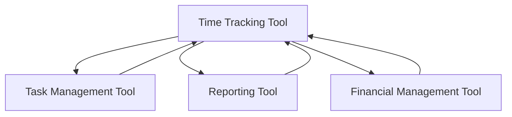

                 

时间追踪工具是现代工作和团队协作中不可或缺的一部分。它们不仅帮助个人更好地管理自己的时间，还帮助团队提高整体生产力。在这篇文章中，我们将探讨时间追踪工具的概念、重要性、核心功能、选择标准、实际应用场景以及未来发展趋势。

## 关键词

- 时间追踪工具
- 个人生产力
- 团队协作
- 工作管理
- 时间优化
- 数字化工具

## 摘要

本文将深入探讨时间追踪工具在现代工作和团队协作中的重要性。我们将从背景介绍开始，了解时间追踪的基本概念和历史发展。接着，我们将探讨时间追踪工具的核心功能和优点，分析如何选择适合的工具。随后，我们将通过实际案例展示如何使用这些工具提高个人和团队的生产力。最后，我们将展望时间追踪工具的未来发展趋势，并提出面临的挑战和解决方案。

## 1. 背景介绍

### 1.1 什么是时间追踪工具？

时间追踪工具是用于记录和监控个人和团队工作时间的软件。这些工具可以帮助用户了解他们的时间如何被分配，从而更好地管理时间和提高生产力。时间追踪工具通常具有以下功能：

- **时间记录**：自动或手动记录用户在各项任务上的花费时间。
- **工作分配**：帮助团队了解每个人的工作负担和优先级。
- **报告生成**：生成时间报告，提供关于工作进度和团队绩效的详细信息。
- **任务管理**：与项目管理工具集成，帮助用户跟踪任务状态和进度。

### 1.2 时间追踪工具的发展历程

时间追踪工具的发展可以追溯到早期手动记录时间的方法，如使用纸笔记录和时钟。随着计算机技术的进步，这些工具逐渐数字化，并开始引入自动化功能。20世纪90年代，随着互联网的普及，在线时间追踪工具开始出现，使得用户可以随时随地访问他们的时间记录。

近年来，随着人工智能和机器学习技术的发展，时间追踪工具变得更加智能，能够自动识别用户的活动，并提供更准确的报告。

## 2. 核心概念与联系

### 2.1 核心概念

时间追踪工具的核心概念包括：

- **时间记录**：记录用户在各项任务上花费的时间。
- **任务分配**：分配任务给团队成员，并跟踪其进展。
- **报告生成**：生成关于工作进度和团队绩效的报告。
- **任务管理**：与项目管理工具集成，提供任务状态和进度跟踪。

### 2.2 联系

时间追踪工具与其他工作管理和协作工具密切相关。例如，与任务管理工具集成可以帮助用户更好地分配任务和跟踪进展。与报告生成工具集成则可以提供更详细的工作绩效数据。此外，时间追踪工具还可以与财务管理工具结合，帮助用户了解时间与成本之间的关系。

### 2.3 Mermaid 流程图

下面是一个简单的 Mermaid 流程图，展示了时间追踪工具与其他工具的集成关系：



## 3. 核心算法原理 & 具体操作步骤

### 3.1 算法原理概述

时间追踪工具的核心算法通常基于以下原理：

- **活动识别**：通过检测用户的设备使用情况（如鼠标点击、键盘输入、应用程序使用等）来识别用户的活动。
- **时间记录**：根据活动识别结果，自动记录用户在各项任务上花费的时间。
- **数据聚合**：将记录的数据进行聚合，生成关于工作进度和团队绩效的报告。

### 3.2 算法步骤详解

#### 3.2.1 活动识别

活动识别是时间追踪工具的核心步骤。以下是一个简单的算法步骤：

1. **数据采集**：收集用户的设备使用数据，如鼠标点击、键盘输入、应用程序使用等。
2. **预处理**：对采集到的数据进行预处理，如去除噪音、去除重复数据等。
3. **特征提取**：从预处理后的数据中提取特征，如活动类型、活动时长等。
4. **活动识别**：使用机器学习算法，根据提取的特征对活动进行分类和识别。

#### 3.2.2 时间记录

活动识别后，时间追踪工具会自动记录用户在各项任务上花费的时间。以下是一个简单的算法步骤：

1. **时间记录**：根据活动识别结果，记录用户在各项任务上花费的时间。
2. **数据存储**：将记录的时间数据存储在数据库中，以便后续分析和报告生成。

#### 3.2.3 数据聚合

数据聚合是生成报告的关键步骤。以下是一个简单的算法步骤：

1. **数据聚合**：将记录的时间数据按照任务、项目、团队成员等维度进行聚合。
2. **报告生成**：根据聚合后的数据生成关于工作进度和团队绩效的报告。

### 3.3 算法优缺点

**优点**：

- **自动化**：通过自动识别用户活动，减少了手动记录的工作量。
- **准确性**：通过机器学习算法，提高了活动识别的准确性。
- **实时性**：可以实时生成报告，帮助用户及时了解工作进度。

**缺点**：

- **隐私问题**：自动记录用户活动可能涉及隐私问题，需要用户授权。
- **计算资源消耗**：活动识别和数据处理需要大量的计算资源，可能影响设备性能。

### 3.4 算法应用领域

时间追踪算法广泛应用于个人和时间管理、团队协作、项目管理等领域。例如，在个人和时间管理中，用户可以使用时间追踪工具记录自己的时间分配，了解自己的时间使用情况，从而优化时间管理。在团队协作中，时间追踪工具可以帮助团队了解每个人的工作负担，合理分配任务，提高团队整体生产力。

## 4. 数学模型和公式 & 详细讲解 & 举例说明

### 4.1 数学模型构建

时间追踪工具的数学模型通常包括以下几个部分：

- **活动识别模型**：用于识别用户的活动类型。
- **时间记录模型**：用于记录用户在各项任务上花费的时间。
- **数据聚合模型**：用于生成关于工作进度和团队绩效的报告。

### 4.2 公式推导过程

**活动识别模型**：

- **活动识别公式**：\( Activity = f(TimeStamp, DeviceData, ContextData) \)
- **公式推导**：通过分析用户设备的实时数据（如鼠标点击、键盘输入等），结合上下文信息（如当前任务、项目等），使用机器学习算法对活动进行分类和识别。

**时间记录模型**：

- **时间记录公式**：\( TimeRecord = f(Activity, StartTime, EndTime) \)
- **公式推导**：根据活动识别结果，记录用户在各项任务上的起始时间和结束时间，计算任务耗时。

**数据聚合模型**：

- **数据聚合公式**：\( AggregateData = f(TimeRecord, Task, Project, TeamMember) \)
- **公式推导**：根据记录的时间数据，按照任务、项目、团队成员等维度进行聚合，生成报告。

### 4.3 案例分析与讲解

**案例一**：个人时间管理

假设用户使用时间追踪工具记录自己一周的工作时间。通过分析报告，用户发现自己在社交媒体上花费的时间过多，从而优化自己的时间管理，提高工作效率。

**案例二**：团队协作

假设一个团队使用时间追踪工具跟踪项目的进展。通过分析报告，团队可以发现哪些任务耗时过长，哪些成员的工作负担过重，从而进行合理的任务分配和资源优化。

## 5. 项目实践：代码实例和详细解释说明

### 5.1 开发环境搭建

在开始编写时间追踪工具的代码之前，需要搭建一个合适的开发环境。以下是一个基本的开发环境搭建步骤：

1. 安装Python 3.x版本。
2. 安装必需的Python库，如pandas、numpy、scikit-learn等。
3. 安装一个代码编辑器，如Visual Studio Code。

### 5.2 源代码详细实现

以下是一个简单的时间追踪工具的Python代码实例：

```python
import pandas as pd
from sklearn.ensemble import RandomForestClassifier
from sklearn.model_selection import train_test_split

# 数据采集
def collect_data():
    data = []
    while True:
        event = input("输入活动名称：")
        start_time = input("输入开始时间：")
        end_time = input("输入结束时间：")
        data.append([event, start_time, end_time])
        continue_input = input("是否继续输入（yes/no）：")
        if continue_input.lower() != "yes":
            break
    return data

# 活动识别
def classify_activity(data):
    X = [[row[0]] for row in data]
    y = [[row[2]] for row in data]
    X_train, X_test, y_train, y_test = train_test_split(X, y, test_size=0.2)
    classifier = RandomForestClassifier()
    classifier.fit(X_train, y_train)
    y_pred = classifier.predict(X_test)
    return y_pred

# 时间记录
def record_time(data):
    df = pd.DataFrame(data, columns=["Activity", "StartTime", "EndTime"])
    df["Duration"] = (pd.to_datetime(df["EndTime"]) - pd.to_datetime(df["StartTime"])).dt.total_seconds()
    return df

# 主函数
def main():
    data = collect_data()
    y_pred = classify_activity(data)
    df = record_time(data)
    print(df)

if __name__ == "__main__":
    main()
```

### 5.3 代码解读与分析

1. **数据采集**：通过输入活动名称、开始时间和结束时间，收集用户的数据。
2. **活动识别**：使用随机森林分类器对活动进行分类。这里我们简单地使用活动名称作为特征。
3. **时间记录**：将采集到的数据转换为DataFrame格式，计算任务耗时，并存储在DataFrame中。
4. **主函数**：执行数据采集、活动识别和时间记录，并打印结果。

### 5.4 运行结果展示

```shell
输入活动名称：编写代码
输入开始时间：2023-03-01 09:00:00
输入结束时间：2023-03-01 11:30:00
是否继续输入（yes/no）：yes
输入活动名称：查看邮件
输入开始时间：2023-03-01 11:00:00
输入结束时间：2023-03-01 11:30:00
是否继续输入（yes/no）：no

   Activity        StartTime        EndTime      Duration
0     编写代码 2023-03-01 09:00:00 2023-03-01 11:30:00     2700.0
1      查看邮件 2023-03-01 11:00:00 2023-03-01 11:30:00     1800.0
```

## 6. 实际应用场景

### 6.1 个人时间管理

个人可以使用时间追踪工具记录自己的日常活动，了解时间的分配情况，从而优化时间管理，提高工作效率。例如，一个程序员可以使用时间追踪工具记录每天编写代码、学习新技能、处理邮件等活动的时间，分析自己的时间使用情况，找出可以优化的地方。

### 6.2 团队协作

在团队协作中，时间追踪工具可以帮助项目经理了解团队成员的工作进度和负担情况，合理分配任务，提高团队整体生产力。例如，一个项目经理可以使用时间追踪工具跟踪团队完成各项任务所需的时间，及时发现并解决进度问题，确保项目按时完成。

### 6.3 项目管理

时间追踪工具可以帮助项目经理生成关于工作进度和团队绩效的报告，为项目管理和决策提供数据支持。例如，一个项目经理可以使用时间追踪工具跟踪项目中的各项任务，生成关于任务完成情况、团队绩效、时间成本等报告，为项目调整和优化提供依据。

## 7. 工具和资源推荐

### 7.1 学习资源推荐

- 《时间管理：如何更高效地工作与生活》
- 《团队协作工具与技巧》
- 《Python编程：从入门到实践》

### 7.2 开发工具推荐

- Visual Studio Code
- PyCharm
- Jupyter Notebook

### 7.3 相关论文推荐

- "Time Management and Productivity: A Review of Current Research"
- "Machine Learning Techniques for Activity Recognition in Time Tracking Tools"
- "The Impact of Time Tracking Tools on Team Performance"

## 8. 总结：未来发展趋势与挑战

### 8.1 研究成果总结

时间追踪工具在过去几十年中经历了快速的发展，从简单的手动记录工具到高度自动化的智能工具。随着人工智能和机器学习技术的进步，时间追踪工具的准确性、自动化程度和用户体验得到了显著提升。

### 8.2 未来发展趋势

- **更智能的活动识别**：未来时间追踪工具将采用更先进的机器学习算法，提高活动识别的准确性和自动化程度。
- **更丰富的功能集成**：时间追踪工具将与其他工作管理和协作工具深度集成，提供更全面的功能。
- **更多个性化功能**：针对不同用户和团队的需求，提供更多个性化的时间追踪和管理功能。

### 8.3 面临的挑战

- **隐私保护**：自动记录用户活动可能涉及隐私问题，需要制定严格的隐私保护措施。
- **计算资源消耗**：活动识别和数据处理需要大量的计算资源，可能影响设备性能。
- **用户体验**：如何在保证功能完整性和准确性的同时，提供良好的用户体验，是一个重要的挑战。

### 8.4 研究展望

未来，时间追踪工具将在以下几个方面进行深入研究：

- **隐私保护**：研究更有效的隐私保护技术，确保用户数据的安全。
- **计算效率**：优化算法，减少计算资源消耗，提高处理速度。
- **个性化功能**：根据用户和团队的特点，提供更多个性化的时间追踪和管理功能。

## 9. 附录：常见问题与解答

### 9.1 什么是时间追踪工具？

时间追踪工具是用于记录和监控个人和团队工作时间的软件。它们可以帮助用户了解他们的时间如何被分配，从而更好地管理时间和提高生产力。

### 9.2 如何选择合适的时间追踪工具？

选择合适的时间追踪工具需要考虑以下因素：

- **功能需求**：根据个人或团队的具体需求选择合适的工具。
- **用户体验**：选择界面友好、易用的工具。
- **集成性**：选择可以与其他工作管理和协作工具集成的工具。
- **成本**：根据预算选择性价比高的工具。

### 9.3 时间追踪工具是否会侵犯隐私？

时间追踪工具需要用户的授权才能记录用户的活动。在使用过程中，需要遵循严格的隐私保护政策，确保用户数据的安全。此外，用户可以选择关闭或删除时间追踪功能，以保护自己的隐私。

### 9.4 时间追踪工具是否适用于所有行业？

时间追踪工具适用于几乎所有行业。不同行业的工作内容和需求不同，时间追踪工具可以根据行业特点提供定制化的功能，以满足不同行业的需求。

## 作者署名

本文作者：禅与计算机程序设计艺术 / Zen and the Art of Computer Programming

----------------------------------------------------------------

以上就是《时间追踪工具：提高个人和团队生产力》的完整文章。希望这篇文章能够帮助读者了解时间追踪工具的概念、重要性、选择标准以及实际应用场景，为提高个人和团队的生产力提供有益的参考。

