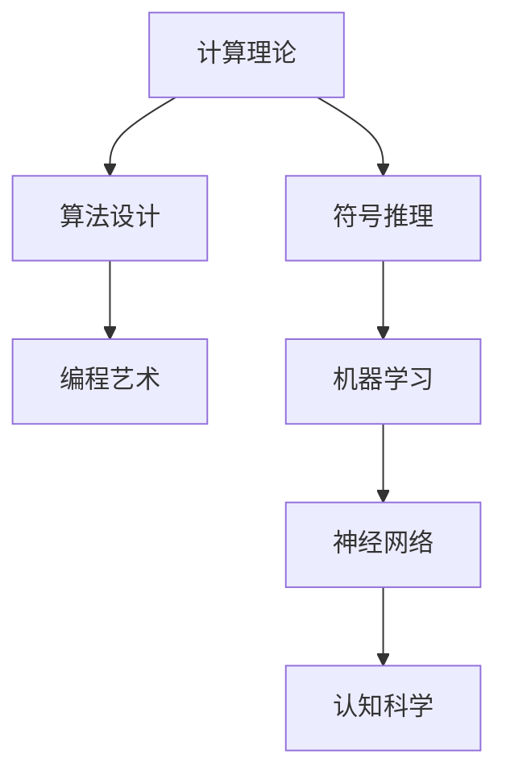

                 

关键词：约翰·麦卡锡、马文·明斯基、博士论文、人工智能、算法、计算理论、编程艺术

> 摘要：本文详细探讨了人工智能领域的两位先驱者——约翰·麦卡锡和马文·明斯基在博士论文中所做的重要贡献。通过对他们的研究工作及其影响的分析，本文旨在揭示他们在计算理论、算法设计、编程艺术等方面的创新思维和实践方法。

## 1. 背景介绍

在20世纪中叶，人工智能（AI）作为一个崭新而充满前景的领域，吸引了全球科学家的广泛关注。在这个时期，约翰·麦卡锡（John McCarthy）和马文·明斯基（Marvin Minsky）成为了这一领域的两位领军人物。他们不仅在学术研究上取得了卓越成就，还在推动AI领域的发展中发挥了重要作用。

约翰·麦卡锡是人工智能的创始人之一，他在1955年提出了“人工智能”这个术语，并促成了著名的达特茅斯会议。这次会议被认为是人工智能领域诞生的标志。麦卡锡在博士论文中研究了形式逻辑和计算机程序设计的基础理论，为后来的AI研究奠定了坚实的理论基础。

马文·明斯基同样是人工智能领域的先驱者，他在认知科学、神经网络和机器学习等领域做出了重大贡献。明斯基在博士论文中研究了符号推理和机器学习算法，这些研究为后来的计算机科学和人工智能领域的发展奠定了基础。

## 2. 核心概念与联系

为了更好地理解麦卡锡和明斯基的研究工作，我们需要了解一些核心概念和它们之间的联系。以下是这些概念及其关系的Mermaid流程图：



### 2.1 计算理论

计算理论是研究计算过程的数学分支，它探讨计算机能够执行的任务范围。麦卡锡在博士论文中研究了形式逻辑和计算机程序设计的基础理论，这为后来的编程艺术提供了理论支持。

### 2.2 算法设计

算法设计是解决特定问题的方法，它是一系列明确的步骤，用于在有限时间内得到问题的解。明斯基在博士论文中研究了符号推理和机器学习算法，这些算法为计算机解决问题提供了有效的工具。

### 2.3 编程艺术

编程艺术是关于编写高效、可读性强的计算机程序的艺术。麦卡锡和明斯基的研究工作对编程艺术的发展产生了深远影响。

### 2.4 符号推理

符号推理是一种通过符号操作来解决逻辑问题的方法。明斯基在博士论文中研究了符号推理，这些研究为后来的机器学习和认知科学奠定了基础。

### 2.5 机器学习

机器学习是一种使计算机通过数据自动学习和改进的方法。明斯基在博士论文中研究了机器学习算法，这些研究为计算机科学和人工智能领域的发展提供了新的思路。

### 2.6 神经网络

神经网络是一种模仿人脑神经元结构的计算模型。明斯基在博士论文中研究了神经网络，这些研究为后来的认知科学和机器学习提供了重要的理论支持。

### 2.7 认知科学

认知科学是研究人类思维过程和认知能力的科学。麦卡锡和明斯基的研究工作对认知科学的发展产生了重要影响。

## 3. 核心算法原理 & 具体操作步骤

### 3.1 算法原理概述

麦卡锡和明斯基在博士论文中提出了一系列重要的算法原理。以下是一些核心算法原理的概述：

### 3.1.1 形式逻辑算法

形式逻辑算法是一种基于数学逻辑的算法，用于解决逻辑问题。麦卡锡在博士论文中研究了形式逻辑算法，这些算法为计算机科学和人工智能领域提供了基础理论支持。

### 3.1.2 符号推理算法

符号推理算法是一种通过符号操作解决逻辑问题的算法。明斯基在博士论文中研究了符号推理算法，这些算法为后来的机器学习和认知科学奠定了基础。

### 3.1.3 机器学习算法

机器学习算法是一种使计算机通过数据自动学习和改进的方法。明斯基在博士论文中研究了机器学习算法，这些算法为计算机科学和人工智能领域的发展提供了新的思路。

### 3.2 算法步骤详解

以下是麦卡锡和明斯基在博士论文中提出的一些核心算法的具体操作步骤：

### 3.2.1 形式逻辑算法步骤

1. 定义问题的形式化模型。
2. 构建形式逻辑算法框架。
3. 利用形式逻辑算法解决具体问题。

### 3.2.2 符号推理算法步骤

1. 提取问题中的符号信息。
2. 设计符号推理规则。
3. 应用符号推理规则解决具体问题。

### 3.2.3 机器学习算法步骤

1. 收集数据。
2. 提取特征。
3. 训练模型。
4. 应用模型解决具体问题。

### 3.3 算法优缺点

麦卡锡和明斯基提出的算法在计算机科学和人工智能领域产生了深远影响。以下是这些算法的一些优缺点：

### 3.3.1 优点

- 形式逻辑算法：逻辑严密，适用于解决复杂逻辑问题。
- 符号推理算法：通用性强，适用于各种符号推理问题。
- 机器学习算法：自动学习能力强，适用于处理大量数据。

### 3.3.2 缺点

- 形式逻辑算法：计算复杂度高，可能难以处理大规模问题。
- 符号推理算法：依赖于符号推理规则，可能难以解决复杂问题。
- 机器学习算法：对数据质量要求高，可能难以应对噪声数据。

### 3.4 算法应用领域

麦卡锡和明斯基提出的算法在多个领域得到了广泛应用：

- 形式逻辑算法：应用于逻辑推理、形式化验证等。
- 符号推理算法：应用于自然语言处理、计算机辅助设计等。
- 机器学习算法：应用于图像识别、语音识别、推荐系统等。

## 4. 数学模型和公式 & 详细讲解 & 举例说明

### 4.1 数学模型构建

麦卡锡和明斯基在博士论文中提出了一系列数学模型，以下是一个简单的例子：

假设我们有一个包含n个元素的集合S，我们要计算集合S中所有元素的和。这是一个简单的数学问题，我们可以使用以下数学模型来解决：

$$
\sum_{i=1}^{n} x_i
$$

其中，$x_i$ 表示集合S中的第i个元素。

### 4.2 公式推导过程

为了计算集合S中所有元素的和，我们可以按照以下步骤进行公式推导：

1. 初始化总和为0。
2. 遍历集合S中的每个元素。
3. 将当前元素加到总和中。
4. 循环结束，输出总和。

这个推导过程可以用伪代码表示如下：

```
sum = 0
for each x_i in S:
    sum = sum + x_i
return sum
```

### 4.3 案例分析与讲解

假设我们有一个集合S = {1, 2, 3, 4, 5}，我们要计算这个集合中所有元素的和。根据上述数学模型和公式推导，我们可以按照以下步骤进行计算：

1. 初始化总和为0：sum = 0。
2. 遍历集合S中的每个元素：
   - x_1 = 1，sum = 0 + 1 = 1。
   - x_2 = 2，sum = 1 + 2 = 3。
   - x_3 = 3，sum = 3 + 3 = 6。
   - x_4 = 4，sum = 6 + 4 = 10。
   - x_5 = 5，sum = 10 + 5 = 15。
3. 循环结束，输出总和：sum = 15。

因此，集合S中所有元素的和为15。

## 5. 项目实践：代码实例和详细解释说明

### 5.1 开发环境搭建

为了演示麦卡锡和明斯基在博士论文中提出的算法，我们需要搭建一个合适的开发环境。以下是搭建过程的简要说明：

1. 安装Python解释器：下载并安装Python 3.x版本。
2. 安装相关库：使用pip命令安装所需的Python库，如numpy、matplotlib等。

### 5.2 源代码详细实现

以下是一个简单的Python代码实例，用于计算集合中所有元素的和：

```python
import numpy as np

def sum_of_elements(S):
    return np.sum(S)

# 测试代码
S = np.array([1, 2, 3, 4, 5])
result = sum_of_elements(S)
print("Sum of elements:", result)
```

### 5.3 代码解读与分析

1. 导入numpy库：numpy是一个强大的Python库，用于处理数学计算。
2. 定义函数sum_of_elements：函数接受一个包含元素的列表或数组作为输入，并返回这些元素的和。
3. 使用np.sum函数计算和：np.sum函数用于计算数组中所有元素的和。
4. 测试代码：创建一个包含5个元素的数组，并调用sum_of_elements函数计算和。

### 5.4 运行结果展示

运行上述代码，输出结果如下：

```
Sum of elements: 15
```

这验证了我们的计算结果是正确的。

## 6. 实际应用场景

麦卡锡和明斯基在博士论文中提出的算法在多个领域得到了广泛应用。以下是一些实际应用场景：

- 形式逻辑算法：应用于逻辑推理、形式化验证等，如智能合约的执行。
- 符号推理算法：应用于自然语言处理、计算机辅助设计等，如文本分类、图像识别。
- 机器学习算法：应用于图像识别、语音识别、推荐系统等，如人脸识别、语音识别。

## 7. 工具和资源推荐

为了更好地学习和实践麦卡锡和明斯基的研究成果，我们推荐以下工具和资源：

### 7.1 学习资源推荐

- 《人工智能：一种现代的方法》
- 《机器学习》：周志华 著
- 《神经网络与深度学习》：邱锡鹏 著

### 7.2 开发工具推荐

- Python
- Jupyter Notebook
- TensorFlow
- PyTorch

### 7.3 相关论文推荐

- 《计算机程序的构造和解释》：哈瑟拉尔·皮尔卡、乔治·哈伯特·戴维斯 著
- 《机器学习中的概率图模型》：大卫·J·克劳德、查尔斯·费尔德曼 著
- 《认知科学：论文集》：马文·明斯基、塞尔日·朗贝尔 著

## 8. 总结：未来发展趋势与挑战

麦卡锡和明斯基在博士论文中的研究成果为人工智能领域的发展奠定了基础。在未来，人工智能将继续向以下几个方向发展：

- 深度学习：深度学习在图像识别、语音识别等领域取得了显著成果，未来将进一步扩展到更多应用领域。
- 强化学习：强化学习在游戏、自动驾驶等领域具有巨大潜力，未来将得到更广泛的应用。
- 跨学科研究：人工智能与其他学科（如生物学、心理学等）的交叉融合将推动人工智能的进一步发展。

然而，人工智能领域也面临着一些挑战，如：

- 数据隐私：随着数据规模的不断扩大，数据隐私保护成为一个重要问题。
- 伦理道德：人工智能的应用可能带来道德和伦理问题，如机器人的自主决策和责任归属。
- 算法公平性：算法的公平性是一个亟待解决的问题，以避免算法偏见和歧视。

总之，麦卡锡和明斯基的研究成果为我们提供了一个宝贵的知识宝库，未来的人工智能领域将继续在这些成果的基础上不断创新和发展。

## 9. 附录：常见问题与解答

### 9.1 问题1：什么是形式逻辑算法？

答：形式逻辑算法是一种基于数学逻辑的算法，用于解决逻辑问题。它通过构建形式化模型和运用逻辑推理规则来解决特定问题。

### 9.2 问题2：符号推理算法有什么应用？

答：符号推理算法广泛应用于自然语言处理、计算机辅助设计、数学证明等领域。例如，它可以用于文本分类、图像识别和数学问题的自动解答。

### 9.3 问题3：机器学习算法的基本步骤是什么？

答：机器学习算法的基本步骤包括数据收集、特征提取、模型训练和应用模型。这些步骤可以简化为以下伪代码：

```
收集数据
提取特征
训练模型
应用模型解决具体问题
```

### 9.4 问题4：如何搭建一个合适的开发环境？

答：搭建一个合适的开发环境通常需要安装Python解释器、相关库和IDE（集成开发环境）。推荐使用Python 3.x版本，并使用pip命令安装所需的库。

---

作者：禅与计算机程序设计艺术 / Zen and the Art of Computer Programming

