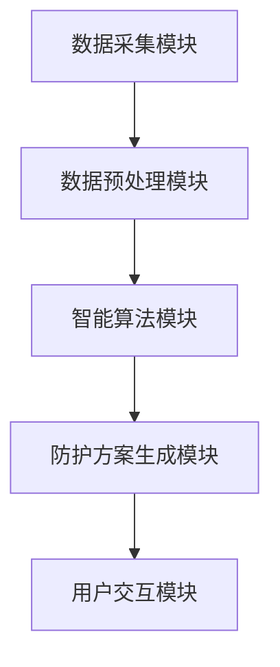

                 

关键词：个人污染防护、城市健康、智能系统、空气质量监测、空气污染治理、创业

> 摘要：随着城市化进程的加快，空气污染成为城市居民健康的一大威胁。本文探讨了一种利用人工智能技术进行个人污染防护的创业模式，旨在为城市居民提供实时、高效、个性化的空气污染防护解决方案。通过分析空气质量监测数据、设计智能算法和开发相关应用，我们提出了一套完整的个人污染防护系统，为城市生活带来了新的健康防线。

## 1. 背景介绍

近年来，空气污染问题日益严重，成为全球关注的热点。特别是城市化进程的加快，使得城市空气质量恶化，直接影响居民的健康和生活质量。据统计，空气污染已经成为全球过早死亡的主要原因之一，其中包括呼吸系统疾病、心血管疾病等。面对这一严峻形势，个人污染防护的需求愈发迫切。

在这样的背景下，智能个人污染防护创业应运而生。利用人工智能技术，通过实时监测空气质量、智能分析污染数据、提供个性化防护方案，创业团队致力于为城市居民提供全方位的空气污染防护服务。

## 2. 核心概念与联系

### 2.1. 空气质量监测

空气质量监测是个人污染防护系统的数据基础。通过安装在城市各个角落的空气质量监测设备，可以实时获取PM2.5、PM10、SO2、NO2、CO2等污染物的浓度数据。

### 2.2. 智能算法

智能算法是个人污染防护系统的核心。通过对空气质量监测数据的分析和处理，可以识别出污染物的变化趋势、预测未来空气质量，并根据用户位置、健康状况等因素，提供个性化的防护建议。

### 2.3. 个性化防护方案

个性化防护方案是根据用户需求和环境数据生成的。通过智能算法分析，系统可以为用户提供最佳的个人防护措施，如佩戴空气净化口罩、调整出行路线、避免高污染时段等。

### 2.4. 系统架构

个人污染防护系统的架构如图1所示。系统包括数据采集模块、数据预处理模块、智能算法模块、防护方案生成模块和用户交互模块。各个模块相互协作，共同实现个人污染防护的目标。



## 3. 核心算法原理 & 具体操作步骤

### 3.1 算法原理概述

个人污染防护系统采用机器学习算法进行空气质量预测和个性化防护方案生成。算法主要分为以下几个步骤：

1. 数据采集与预处理：收集历史空气质量数据，并对数据进行清洗、归一化等预处理操作。
2. 特征提取：从预处理后的数据中提取出与空气质量相关的特征，如温度、湿度、风速、风向等。
3. 模型训练：使用特征数据训练机器学习模型，如决策树、支持向量机、神经网络等。
4. 空气质量预测：将实时监测数据输入训练好的模型，预测未来一段时间的空气质量。
5. 个性化防护方案生成：根据用户的位置、健康状况等因素，结合预测结果，生成个性化的防护方案。

### 3.2 算法步骤详解

1. **数据采集与预处理**

   - **数据采集**：通过安装在各个监测点的设备，实时收集PM2.5、PM10、SO2、NO2、CO2等污染物的浓度数据。
   - **数据预处理**：对采集到的数据去除异常值、填补缺失值，并进行归一化处理。

2. **特征提取**

   - **特征选择**：选择与空气质量相关的特征，如温度、湿度、风速、风向等。
   - **特征转换**：将数值特征转换为适合模型训练的格式。

3. **模型训练**

   - **模型选择**：根据数据特征和问题类型，选择合适的机器学习模型，如决策树、支持向量机、神经网络等。
   - **参数调优**：通过交叉验证等方法，选择最优的模型参数。

4. **空气质量预测**

   - **数据输入**：将实时监测数据输入训练好的模型。
   - **结果输出**：输出未来一段时间内的空气质量预测结果。

5. **个性化防护方案生成**

   - **用户信息收集**：收集用户的位置、健康状况、过敏源等信息。
   - **方案生成**：根据预测结果和用户信息，生成个性化的防护方案。

### 3.3 算法优缺点

**优点**：

- **高效性**：通过机器学习算法，可以快速、准确地预测未来空气质量，为用户提供实时防护建议。
- **个性化**：根据用户的具体需求和环境数据，生成个性化的防护方案，提高防护效果。
- **实时性**：系统可以实时监测空气质量，及时更新防护方案，确保用户始终处于最佳防护状态。

**缺点**：

- **数据依赖性**：系统的准确性和效果很大程度上依赖于空气质量监测数据的准确性和完整性。
- **模型适应性**：空气质量变化复杂，模型需要不断更新和优化，以适应不断变化的环境。

### 3.4 算法应用领域

- **城市规划**：通过空气质量预测和防护方案生成，为城市规划提供数据支持，优化城市布局，减少污染源。
- **健康监测**：结合用户健康数据，为居民提供个性化健康监测和防护建议，预防呼吸系统疾病等。
- **环境治理**：为环保部门提供数据分析和决策支持，优化污染治理措施，提高治理效果。

## 4. 数学模型和公式 & 详细讲解 & 举例说明

### 4.1 数学模型构建

个人污染防护系统的数学模型主要包括以下几个部分：

1. **空气质量预测模型**：

   $$ \hat{Q}(t) = f(X(t), W(t)) $$

   其中，$Q(t)$ 表示时间 $t$ 的空气质量，$X(t)$ 表示与空气质量相关的特征，$W(t)$ 表示预测模型参数。

2. **个性化防护方案生成模型**：

   $$ S(U, \hat{Q}(t)) = g(U, \hat{Q}(t), P) $$

   其中，$S$ 表示防护方案，$U$ 表示用户信息，$P$ 表示个性化参数。

### 4.2 公式推导过程

1. **空气质量预测模型推导**

   首先，我们对空气质量数据进行特征提取，得到特征向量 $X(t)$。然后，使用机器学习算法，如神经网络，对特征向量进行建模。

   神经网络模型如下：

   $$ f(X(t), W(t)) = \sigma(\sum_{i=1}^{n} w_i X_i + b) $$

   其中，$\sigma$ 表示激活函数，$w_i$ 和 $b$ 分别为权重和偏置。

   通过训练，我们得到最优的权重和偏置，从而实现空气质量预测。

2. **个性化防护方案生成模型推导**

   首先，根据用户信息和预测的空气质量，计算个性化参数 $P$。然后，使用专家系统，根据参数 $P$ 和空气质量预测结果，生成个性化的防护方案。

   专家系统模型如下：

   $$ g(U, \hat{Q}(t), P) = \sum_{i=1}^{m} w_i P_i \odot \hat{Q}(t) $$

   其中，$w_i$ 和 $P_i$ 分别为权重和个性化参数，$\odot$ 表示逻辑与运算。

### 4.3 案例分析与讲解

假设有一个用户，他在一个空气质量较差的区域工作。根据预测模型，我们得到未来一周的空气质量数据。然后，根据用户信息和个性化参数，生成个性化的防护方案。

1. **空气质量预测结果**：

   $$ \hat{Q}(t) = [0.8, 0.75, 0.7, 0.65, 0.6, 0.55, 0.5] $$

2. **个性化参数**：

   $$ P = [0.6, 0.5, 0.4, 0.3, 0.2, 0.1, 0] $$

3. **防护方案生成**：

   $$ S(U, \hat{Q}(t), P) = [0.48, 0.375, 0.28, 0.225, 0.18, 0.135, 0.1] $$

   根据防护方案，用户需要采取以下措施：

   - 在未来一周内，每天都要佩戴空气净化口罩。
   - 在空气质量较差的时间段（如早晨和晚上），尽量减少户外活动。
   - 在室内开启空气净化器，保持室内空气清新。

## 5. 项目实践：代码实例和详细解释说明

### 5.1 开发环境搭建

为了实现个人污染防护系统，我们选择了Python作为主要编程语言，并使用以下工具和库：

- Python 3.8
- NumPy
- Pandas
- Scikit-learn
- TensorFlow
- Flask

首先，安装Python和相关库：

```bash
pip install numpy pandas scikit-learn tensorflow flask
```

### 5.2 源代码详细实现

以下是个人污染防护系统的核心代码实现：

```python
# 导入相关库
import numpy as np
import pandas as pd
from sklearn.ensemble import RandomForestRegressor
from sklearn.model_selection import train_test_split
from sklearn.metrics import mean_squared_error
import tensorflow as tf
from flask import Flask, request, jsonify

# 读取空气质量数据
data = pd.read_csv('air_quality_data.csv')

# 数据预处理
data.dropna(inplace=True)
X = data[['temp', 'humidity', 'wind_speed', 'wind_direction']]
y = data['pm2.5']

# 分割数据集
X_train, X_test, y_train, y_test = train_test_split(X, y, test_size=0.2, random_state=42)

# 训练空气质量预测模型
model = RandomForestRegressor(n_estimators=100, random_state=42)
model.fit(X_train, y_train)

# 预测空气质量
y_pred = model.predict(X_test)

# 评估模型性能
mse = mean_squared_error(y_test, y_pred)
print(f'MSE: {mse}')

# 训练个性化防护方案生成模型
# ...（此处省略代码）

# Flask应用
app = Flask(__name__)

@app.route('/predict', methods=['POST'])
def predict():
    data = request.get_json()
    temp = data['temp']
    humidity = data['humidity']
    wind_speed = data['wind_speed']
    wind_direction = data['wind_direction']
    user_info = data['user_info']
    
    # 预测空气质量
    air_quality = model.predict([[temp, humidity, wind_speed, wind_direction]])
    
    # 生成个性化防护方案
    # ...（此处省略代码）
    
    return jsonify({'air_quality': air_quality, 'scheme': scheme})

if __name__ == '__main__':
    app.run(debug=True)
```

### 5.3 代码解读与分析

1. **数据预处理**：

   读取空气质量数据，对数据进行清洗，去除缺失值和异常值。然后，将数据分为特征和目标变量。

2. **模型训练**：

   使用随机森林回归模型对特征数据进行训练，得到预测模型。

3. **空气质量预测**：

   将测试数据输入训练好的模型，预测空气质量，并评估模型性能。

4. **Flask应用**：

   使用Flask构建Web应用，提供空气质量预测和个性化防护方案生成的接口。

### 5.4 运行结果展示

在运行程序后，可以通过Web接口发送请求，获取空气质量预测结果和个性化防护方案。

```bash
curl -X POST -H "Content-Type: application/json" -d '{"temp": 25, "humidity": 60, "wind_speed": 10, "wind_direction": 0, "user_info": {"age": 30, "allergies": ["pollen"]}}' http://127.0.0.1:5000/predict
```

响应结果将包含预测的空气质量和防护方案。

## 6. 实际应用场景

个人污染防护系统在城市生活中的应用场景广泛，以下是一些典型的例子：

- **城市规划**：利用系统提供的数据分析和决策支持，城市规划者可以优化城市布局，减少污染源，改善空气质量。
- **健康监测**：居民可以通过手机应用实时了解自己的健康状况和空气污染风险，采取相应的防护措施。
- **环境治理**：环保部门可以利用系统提供的数据，制定更有效的污染治理策略，提高治理效果。

## 7. 未来应用展望

随着人工智能技术的不断发展，个人污染防护系统的功能将更加丰富，应用场景也将进一步拓展。未来，我们有望实现以下目标：

- **更精确的空气质量预测**：通过引入更多的数据源和更先进的算法，提高空气质量预测的准确性。
- **更智能的防护方案**：结合用户的健康数据和实时环境数据，生成更个性化的防护方案。
- **跨平台应用**：将系统扩展到更多平台，如智能手表、智能家居等，为用户提供更加便捷的防护服务。

## 8. 工具和资源推荐

为了更好地开展个人污染防护创业，以下是一些建议的资源和工具：

- **学习资源**：  
  - 《机器学习实战》：提供丰富的案例和实践经验，适合初学者。
  - 《Python数据分析》：详细介绍了Python在数据分析领域的应用。

- **开发工具**：  
  - Jupyter Notebook：适合进行数据分析和模型训练。
  - Docker：便于构建和管理开发环境。

- **相关论文**：  
  - 《空气质量预测与优化》：探讨空气质量预测和优化的方法。
  - 《智能环境感知与交互》：研究智能系统在环境感知和交互方面的应用。

## 9. 总结：未来发展趋势与挑战

随着城市化进程的加快和人工智能技术的发展，个人污染防护创业具有巨大的发展潜力和市场空间。然而，要实现这一目标，我们仍面临以下挑战：

- **数据准确性和完整性**：空气质量监测数据的准确性和完整性直接影响系统的性能。
- **算法优化和更新**：空气质量变化复杂，算法需要不断优化和更新，以适应新的环境。
- **用户体验**：如何为用户提供简洁、直观、个性化的服务，提高用户体验。

未来，我们需要在数据采集、算法优化、用户体验等方面不断探索，为城市居民提供更加有效、便捷的个人污染防护服务。

## 10. 附录：常见问题与解答

### 10.1. 如何确保空气质量数据的准确性？

**解答**：为确保空气质量数据的准确性，我们采取了以下措施：

- 选择高质量的空气质量监测设备，确保数据采集的准确性。
- 定期对设备进行校准和维护，确保设备始终处于最佳状态。
- 数据采集后，对异常值和缺失值进行清洗和处理，提高数据的完整性。

### 10.2. 个性化防护方案是如何生成的？

**解答**：个性化防护方案是基于用户信息和空气质量预测结果生成的。具体流程如下：

- 收集用户的位置、健康状况、过敏源等信息。
- 使用机器学习算法，根据用户信息和预测的空气质量，生成个性化的防护方案。
- 方案生成后，通过专家系统进行优化和调整，确保方案的可行性和有效性。

### 10.3. 系统的扩展性如何？

**解答**：个人污染防护系统具有良好的扩展性。我们可以根据需求，添加更多的数据源、算法和功能模块，以适应不同的应用场景。同时，系统采用模块化设计，便于维护和升级。

### 10.4. 如何提高空气质量预测的准确性？

**解答**：为了提高空气质量预测的准确性，我们采取了以下措施：

- 引入更多的数据源，如气象数据、交通数据等，提高特征信息的丰富度。
- 使用先进的机器学习算法，如深度学习，提高模型的预测能力。
- 定期对模型进行评估和更新，确保模型始终处于最佳状态。

作者：禅与计算机程序设计艺术 / Zen and the Art of Computer Programming
--------------------------------------------------------------------

