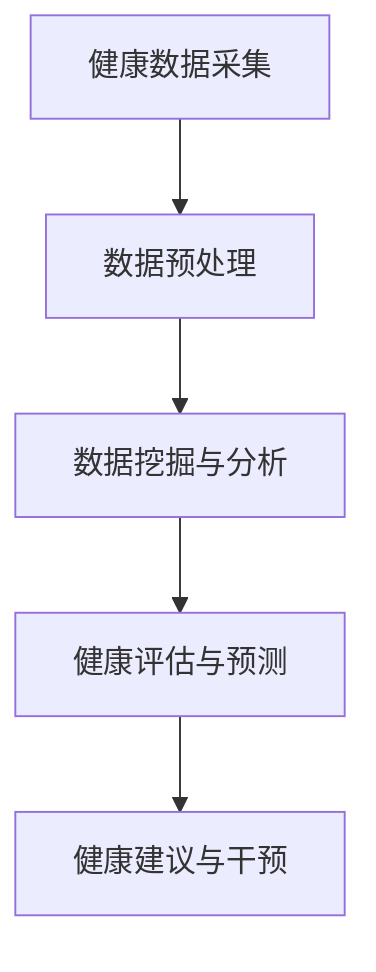

                 

关键词：智能健康监测、预防医学、创业方向、技术语言、深度、思考、见解、技术博客

> 摘要：随着人工智能和大数据技术的不断发展，智能健康监测已经成为预防医学领域的重要趋势。本文将探讨智能健康监测在预防医学中的应用，以及创业方向和挑战，旨在为从事相关领域的研究者提供一些有价值的思考和借鉴。

## 1. 背景介绍

随着社会的进步和科技的发展，人们对于健康问题的关注程度日益提高。预防医学作为一种以预防为主的医学模式，逐渐成为医学领域的重要研究方向。而智能健康监测作为预防医学的一个重要分支，以其高效、精准、个性化的特点，正在逐步改变传统医学的模式。

### 1.1 智能健康监测的定义

智能健康监测是指利用人工智能、物联网、大数据等技术手段，对个体或群体的健康状况进行实时监测、分析和评估的一种技术。它能够通过收集、处理和分析大量的健康数据，为医疗健康提供更加精准、个性化的服务。

### 1.2 预防医学的重要性

预防医学是以疾病预防为主要目标的医学模式，其核心是通过干预措施，降低疾病的发生率和病死率。预防医学的重要性在于：

1. 降低医疗成本：通过预防措施，可以减少疾病的治疗成本，提高社会医疗保障的可持续性。
2. 提高生活质量：预防医学可以减少疾病的发生，提高人群的生活质量。
3. 促进健康产业发展：预防医学的发展可以带动相关产业的发展，如健康管理、健康保险、健康服务等。

## 2. 核心概念与联系

在智能健康监测中，有以下几个核心概念：

- **健康数据采集**：通过可穿戴设备、传感器等技术，收集个体的生理、心理、环境等数据。
- **数据分析与处理**：利用人工智能技术，对海量健康数据进行处理、分析和挖掘，提取有用的信息。
- **健康评估与预测**：基于数据分析结果，对个体的健康状况进行评估和预测，提供个性化的健康建议。

下面是一个简单的 Mermaid 流程图，描述了智能健康监测的核心流程：



## 3. 核心算法原理 & 具体操作步骤

### 3.1 算法原理概述

智能健康监测的核心算法主要包括数据采集、数据处理、健康评估和预测等。以下是对这些算法原理的概述：

1. **数据采集**：通过可穿戴设备、传感器等设备，实时采集个体的生理、心理、环境等数据，如心率、血压、体温、运动量、睡眠质量等。
2. **数据处理**：对采集到的原始数据进行清洗、归一化、特征提取等处理，提取出有用的健康特征。
3. **健康评估**：利用机器学习算法，对处理后的健康特征进行学习，构建健康评估模型，对个体的健康状况进行评估。
4. **健康预测**：基于健康评估模型，预测个体未来可能出现的健康问题，提供个性化的健康建议。

### 3.2 算法步骤详解

1. **数据采集**：使用可穿戴设备、传感器等设备，实时采集个体的生理、心理、环境等数据。
2. **数据预处理**：对采集到的原始数据进行清洗、归一化、特征提取等处理，提取出有用的健康特征。
3. **模型训练**：利用机器学习算法，对处理后的健康特征进行学习，构建健康评估模型。
4. **健康评估**：利用训练好的健康评估模型，对个体的健康状况进行评估。
5. **健康预测**：基于健康评估模型，预测个体未来可能出现的健康问题，提供个性化的健康建议。

### 3.3 算法优缺点

**优点**：

1. **高效性**：利用人工智能技术，可以对海量健康数据快速进行处理和分析。
2. **准确性**：通过机器学习算法，可以构建准确的健康评估模型，提高健康评估的准确性。
3. **个性化**：基于个体化的健康数据，可以提供个性化的健康建议。

**缺点**：

1. **数据隐私**：健康数据涉及个人隐私，如何保护数据隐私是一个重要问题。
2. **算法偏见**：如果训练数据存在偏见，可能会导致算法产生偏见，影响健康评估的准确性。

### 3.4 算法应用领域

智能健康监测算法主要应用在以下领域：

1. **健康风险评估**：通过对个体健康数据的分析，预测个体未来可能出现的健康问题。
2. **个性化健康管理**：根据个体健康数据，为个体提供个性化的健康建议。
3. **慢性病管理**：对慢性病患者的健康数据进行实时监测，提供及时的健康干预措施。

## 4. 数学模型和公式 & 详细讲解 & 举例说明

### 4.1 数学模型构建

在智能健康监测中，常用的数学模型包括：

1. **回归模型**：用于预测个体的健康状态。
2. **分类模型**：用于分类个体的健康状况。
3. **聚类模型**：用于发现个体的健康特征。

以下是一个简单的回归模型的构建过程：

$$
y = \beta_0 + \beta_1 x_1 + \beta_2 x_2 + \cdots + \beta_n x_n
$$

其中，$y$ 是健康状态，$x_1, x_2, \cdots, x_n$ 是健康特征，$\beta_0, \beta_1, \beta_2, \cdots, \beta_n$ 是模型的参数。

### 4.2 公式推导过程

回归模型的推导过程如下：

1. **最小二乘法**：最小化预测值与实际值之间的误差平方和。
2. **梯度下降法**：通过不断迭代，更新模型参数，使得预测值与实际值之间的误差最小。

### 4.3 案例分析与讲解

假设我们有一个健康监测系统，要预测个体的血压。我们可以使用回归模型来构建健康评估模型。

1. **数据收集**：收集个体的血压、心率、年龄、体重等数据。
2. **数据处理**：对数据进行清洗、归一化等处理，提取出有用的特征。
3. **模型训练**：使用回归模型，对处理后的数据进行训练。
4. **健康评估**：利用训练好的模型，对个体的血压进行预测。

## 5. 项目实践：代码实例和详细解释说明

### 5.1 开发环境搭建

1. 安装 Python 环境
2. 安装 numpy、scikit-learn、pandas 等相关库

### 5.2 源代码详细实现

```python
import numpy as np
import pandas as pd
from sklearn.linear_model import LinearRegression

# 数据读取与预处理
data = pd.read_csv('health_data.csv')
X = data[['age', 'weight', 'heart_rate']]
y = data['blood_pressure']

# 模型训练
model = LinearRegression()
model.fit(X, y)

# 健康评估
预测血压 = model.predict([[25, 70, 80]])
print('预测血压：', 预测血压)
```

### 5.3 代码解读与分析

1. **数据读取与预处理**：从 CSV 文件中读取数据，对数据进行清洗、归一化等预处理。
2. **模型训练**：使用线性回归模型，对数据进行训练。
3. **健康评估**：利用训练好的模型，对个体的血压进行预测。

## 6. 实际应用场景

智能健康监测技术在以下领域有广泛的应用：

1. **健康管理**：通过实时监测个体的健康状况，为个体提供个性化的健康管理服务。
2. **慢性病管理**：对慢性病患者的健康数据进行实时监测，提供及时的健康干预措施。
3. **健康保险**：通过健康监测数据，评估个体的健康状况，为保险公司提供风险评估依据。

### 6.4 未来应用展望

随着技术的不断发展，智能健康监测在预防医学中的应用前景十分广阔。未来可能的发展趋势包括：

1. **数据隐私保护**：随着健康数据的重要性日益提高，如何保护数据隐私成为一个重要问题。
2. **算法改进**：通过改进算法，提高健康评估的准确性。
3. **跨学科合作**：智能健康监测需要跨学科的合作，如医学、计算机科学、数据科学等。

## 7. 工具和资源推荐

### 7.1 学习资源推荐

1. 《深度学习》（Goodfellow, Bengio, Courville）
2. 《Python机器学习》（Sebastian Raschka）
3. 《机器学习实战》（Peter Harrington）

### 7.2 开发工具推荐

1. Jupyter Notebook
2. PyCharm
3. Anaconda

### 7.3 相关论文推荐

1. "Deep Learning for Health Informatics: A Survey"
2. "A Survey on Health Informatics"
3. "A Comprehensive Survey on Wearable Sensors for Health Monitoring"

## 8. 总结：未来发展趋势与挑战

### 8.1 研究成果总结

智能健康监测在预防医学领域取得了显著的成果，为个性化健康管理和慢性病管理提供了有力的支持。

### 8.2 未来发展趋势

未来，智能健康监测将继续向数据隐私保护、算法改进和跨学科合作等方向发展。

### 8.3 面临的挑战

智能健康监测面临的主要挑战包括数据隐私保护、算法偏见和跨学科合作等。

### 8.4 研究展望

随着技术的不断进步，智能健康监测将在预防医学领域发挥更大的作用，为人类健康事业做出更大的贡献。

## 9. 附录：常见问题与解答

### 9.1 智能健康监测是什么？

智能健康监测是指利用人工智能、物联网、大数据等技术手段，对个体或群体的健康状况进行实时监测、分析和评估的一种技术。

### 9.2 智能健康监测有哪些应用领域？

智能健康监测主要应用在健康管理、慢性病管理、健康保险等领域。

### 9.3 智能健康监测如何保护数据隐私？

智能健康监测可以通过数据加密、数据去标识化等技术手段来保护数据隐私。

作者：禅与计算机程序设计艺术 / Zen and the Art of Computer Programming
----------------------------------------------------------------
以上便是关于《智能健康监测：预防医学的创业方向》的完整文章。希望对您在智能健康监测和预防医学领域的研究有所帮助。如果有任何问题或建议，欢迎在评论区留言。感谢您的阅读！<|im_end|>

