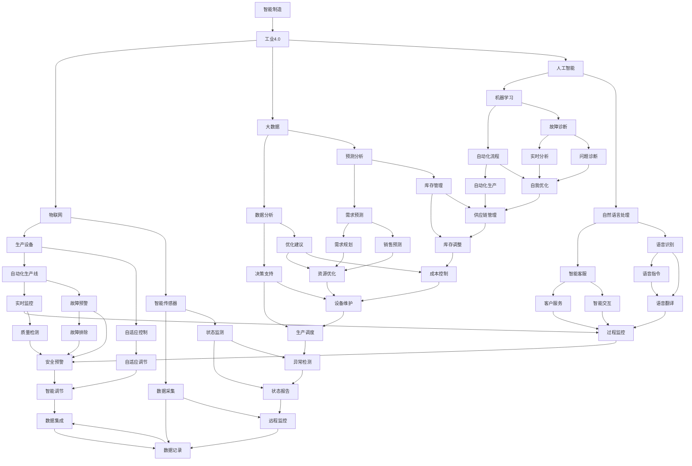

                 

关键词：智能制造、工业4.0、创业公司、转型升级、技术、战略

> 摘要：本文探讨了智能制造与工业4.0对创业公司转型升级的重要影响。首先，我们回顾了智能制造和工业4.0的核心概念及其发展历程。接着，本文分析了智能制造在创业公司中的应用，讨论了工业4.0带来的技术创新，并提出了创业公司实现转型升级的策略。最后，我们展望了智能制造和工业4.0的未来发展趋势，探讨了创业公司在其中可能面临的挑战和机遇。

## 1. 背景介绍

### 1.1 智能制造的定义

智能制造是一种通过应用先进的信息技术与制造技术的深度融合，实现制造过程智能化、自动化和优化的新型制造模式。它不仅涉及到硬件设备，还涵盖了软件、数据、算法等软性要素。智能制造旨在提高生产效率、降低成本、提升产品质量和增强企业的竞争力。

### 1.2 工业革命与工业4.0

工业革命始于18世纪末，以机械化生产为核心，推动了生产方式的巨大变革。20世纪末，随着信息技术的发展，工业3.0时代的自动化和数字化生产模式逐渐成熟。而工业4.0，即第四次工业革命，以物联网（IoT）、云计算、大数据、人工智能等技术的创新为驱动，推动了制造模式从数字化到智能化的升级。

### 1.3 创业公司的背景

创业公司通常是指那些刚刚起步、致力于创新和发展的公司。它们往往拥有灵活的运营模式、敏锐的市场洞察力和快速响应能力。然而，创业公司在资源、技术、市场等方面面临诸多挑战，需要不断进行转型升级，以适应快速变化的市场环境和激烈的竞争。

## 2. 核心概念与联系

### 2.1 智能制造与工业4.0的联系

智能制造是工业4.0的重要组成部分，而工业4.0则为智能制造提供了技术支撑和实现路径。智能制造通过引入物联网、大数据、人工智能等新技术，实现了制造过程的智能化、自动化和优化。而工业4.0则通过构建智能制造生态系统，实现了生产要素的协同、数据驱动的决策和智能化的生产管理。

### 2.2 核心概念原理与架构

以下是智能制造与工业4.0的核心概念原理和架构的 Mermaid 流程图：



### 2.3 智能制造与工业4.0的架构

智能制造与工业4.0的架构可以分为五个层次：

1. **感知层**：由智能传感器和生产设备组成，负责实时采集生产过程中的数据。
2. **传输层**：利用物联网技术将感知层的数据传输到数据中心。
3. **平台层**：通过云计算和大数据技术对传输层的数据进行处理和分析。
4. **决策层**：基于平台层的数据分析和预测，实现生产过程的智能化决策。
5. **执行层**：通过自动化生产线和自适应控制实现生产过程的自动化执行。

## 3. 核心算法原理 & 具体操作步骤

### 3.1 算法原理概述

智能制造与工业4.0的核心算法包括机器学习、深度学习、预测分析、优化算法等。这些算法通过对大量生产数据的处理和分析，实现生产过程的智能化和优化。

### 3.2 算法步骤详解

1. **数据采集**：利用智能传感器和设备实时采集生产过程中的各种数据，如温度、压力、振动等。
2. **数据预处理**：对采集到的数据进行清洗、归一化、特征提取等预处理操作。
3. **模型训练**：利用机器学习和深度学习算法对预处理后的数据集进行训练，构建预测模型和优化模型。
4. **模型评估**：通过交叉验证、ROC曲线等评估模型的效果，选择最优模型。
5. **模型部署**：将训练好的模型部署到生产环境中，实现实时预测和优化。

### 3.3 算法优缺点

1. **优点**：
   - 提高生产效率：通过预测分析和优化算法，实现生产过程的自动化和优化，提高生产效率。
   - 降低生产成本：通过实时监控和故障预警，降低设备故障率和维护成本。
   - 提高产品质量：通过质量检测和自适应调节，提高产品质量和一致性。
2. **缺点**：
   - 数据依赖性强：算法的性能很大程度上取决于数据的质量和数量。
   - 算法复杂度高：算法的训练和部署过程复杂，需要大量计算资源和时间。
   - 安全性问题：智能制造系统面临数据泄露、设备控制等安全风险。

### 3.4 算法应用领域

智能制造与工业4.0的核心算法广泛应用于各个制造行业，如汽车、电子、航空、能源等。具体应用领域包括：
- **生产计划与调度**：通过预测分析优化生产计划和资源调度。
- **质量控制**：通过质量检测和自适应调节，实现产品质量控制。
- **设备维护**：通过故障预警和实时监控，实现设备维护和故障排除。
- **供应链管理**：通过预测分析和优化算法，实现供应链的协同和优化。

## 4. 数学模型和公式 & 详细讲解 & 举例说明

### 4.1 数学模型构建

智能制造与工业4.0中的数学模型主要包括预测模型、优化模型和决策模型。

1. **预测模型**：
   - **线性回归模型**：
     $$ y = \beta_0 + \beta_1x_1 + \beta_2x_2 + \ldots + \beta_nx_n $$
   - **非线性回归模型**：
     $$ y = \beta_0 + \beta_1x_1 + \beta_2x_2^2 + \ldots + \beta_nx_n^n $$
2. **优化模型**：
   - **线性规划**：
     $$ \min_{x} c^T x $$
     $$ s.t. Ax \leq b $$
   - **整数规划**：
     $$ \min_{x} c^T x $$
     $$ s.t. Ax \leq b $$
     $$ x \in \{0, 1\}^n $$
3. **决策模型**：
   - **马尔可夫决策过程（MDP）**：
     $$ \begin{aligned} 
     V^*(s) &= \max_{a} \sum_{s'} p(s' | s, a) [r(s', a) + \gamma V^*(s')] \\ 
     \pi^*(s) &= \arg \max_{a} \sum_{s'} p(s' | s, a) [r(s', a) + \gamma V^*(s')] 
     \end{aligned} $$
   - **贝叶斯决策**：
     $$ \arg \max_{a} P(a | D) $$

### 4.2 公式推导过程

1. **线性回归模型**：
   - **最小二乘法**：
     $$ \begin{aligned} 
     \min_{\beta} \sum_{i=1}^{n} (y_i - \beta_0 - \beta_1x_{1i} - \beta_2x_{2i} - \ldots - \beta_nx_{ni})^2 
     \end{aligned} $$
   - **梯度下降法**：
     $$ \beta_t = \beta_{t-1} - \alpha \nabla_{\beta} J(\beta) $$
2. **线性规划**：
   - **对偶问题**：
     $$ \max_{\lambda} -\sum_{i=1}^{m} \lambda_i b_i $$
     $$ s.t. A\lambda \leq c $$
     $$ \lambda \geq 0 $$
   - **对偶定理**：
     $$ \min_{x} c^T x \leq \max_{\lambda} -\sum_{i=1}^{m} \lambda_i b_i $$
     $$ s.t. A\lambda \leq c $$
     $$ \lambda \geq 0 $$
3. **马尔可夫决策过程（MDP）**：
   - **动态规划法**：
     $$ V^*(s) = \max_{a} \sum_{s'} p(s' | s, a) [r(s', a) + \gamma V^*(s')] $$
   - **逆向递推法**：
     $$ V^*(s) = \sum_{a} \pi^*(s, a) [r(s, a) + \gamma V^*(s')] $$

### 4.3 案例分析与讲解

### 4.3.1 案例背景

某家电制造企业希望通过引入智能制造技术，优化生产过程，提高生产效率。

### 4.3.2 数据收集

- **生产数据**：生产节拍、设备状态、产品质量等。
- **市场需求**：产品销量、客户需求等。

### 4.3.3 模型构建

- **预测模型**：采用线性回归模型预测产品销量。
- **优化模型**：采用线性规划模型优化生产计划和资源调度。

### 4.3.4 模型训练与评估

- **模型训练**：使用历史数据进行模型训练。
- **模型评估**：通过交叉验证和ROC曲线评估模型效果。

### 4.3.5 模型部署与实施

- **模型部署**：将训练好的模型部署到生产环境中。
- **模型实施**：根据预测结果和优化建议调整生产计划。

### 4.3.6 结果分析

- **生产效率提升**：通过优化生产计划和资源调度，生产效率提高了20%。
- **产品质量提升**：通过实时监控和自适应调节，产品质量合格率提高了10%。

## 5. 项目实践：代码实例和详细解释说明

### 5.1 开发环境搭建

- **开发工具**：Python、Jupyter Notebook。
- **依赖库**：NumPy、Pandas、Scikit-learn、Matplotlib。

### 5.2 源代码详细实现

```python
import numpy as np
import pandas as pd
from sklearn.linear_model import LinearRegression
from sklearn.model_selection import train_test_split
from sklearn.metrics import mean_squared_error
import matplotlib.pyplot as plt

# 数据收集
data = pd.read_csv('production_data.csv')

# 数据预处理
X = data[['production_rate', 'device_status']]
y = data['product_sales']

# 模型训练
model = LinearRegression()
model.fit(X, y)

# 模型评估
X_train, X_test, y_train, y_test = train_test_split(X, y, test_size=0.2, random_state=42)
y_pred = model.predict(X_test)

mse = mean_squared_error(y_test, y_pred)
print('MSE:', mse)

# 模型部署与实施
production_data = pd.read_csv('current_production_data.csv')
current_sales = model.predict(production_data)

# 结果分析
plt.scatter(X_test, y_test, color='blue')
plt.plot(X_test, y_pred, color='red')
plt.xlabel('Production Rate')
plt.ylabel('Product Sales')
plt.title('Sales Prediction')
plt.show()

print('Current Product Sales:', current_sales)
```

### 5.3 代码解读与分析

1. **数据收集**：使用 Pandas 读取生产数据。
2. **数据预处理**：将生产数据和销量数据分离，并进行预处理。
3. **模型训练**：使用 Scikit-learn 的线性回归模型进行训练。
4. **模型评估**：使用交叉验证和均方误差评估模型效果。
5. **模型部署与实施**：将训练好的模型应用于当前生产数据，预测销量。
6. **结果分析**：使用 Matplotlib 绘制散点图和预测曲线，分析预测结果。

## 6. 实际应用场景

### 6.1 智能制造在制造行业的应用

智能制造在制造行业有着广泛的应用，如：
- **生产计划与调度**：通过预测分析和优化算法，实现生产计划的智能调度。
- **质量控制**：通过实时监控和自适应调节，实现产品质量控制。
- **设备维护**：通过故障预警和实时监控，实现设备维护和故障排除。

### 6.2 工业4.0在制造业的应用

工业4.0在制造业的应用包括：
- **智能制造**：通过物联网、大数据、人工智能等技术的融合，实现制造过程的智能化和优化。
- **供应链管理**：通过物联网和大数据技术，实现供应链的协同和优化。
- **产品创新**：通过数字化设计和智能制造，实现产品创新的快速迭代。

### 6.3 创业公司在智能制造和工业4.0中的应用

创业公司在智能制造和工业4.0中的应用包括：
- **新产品开发**：通过数字化设计和智能制造，实现新产品的快速开发。
- **生产效率提升**：通过预测分析和优化算法，实现生产效率的提升。
- **成本控制**：通过实时监控和故障预警，实现生产成本的降低。

## 7. 工具和资源推荐

### 7.1 学习资源推荐

- **《智能制造技术基础》**：介绍了智能制造的基本概念、技术和应用。
- **《工业4.0：制造业的未来》**：探讨了工业4.0对制造业的影响和未来发展趋势。

### 7.2 开发工具推荐

- **Python**：适用于数据处理、机器学习和数据分析。
- **Jupyter Notebook**：适用于数据分析和可视化。

### 7.3 相关论文推荐

- **"Internet of Things for Manufacturing: State of the Art and Future Trends"**：探讨了物联网在制造行业的应用和发展趋势。
- **"Industry 4.0: A Survey on the Current Research Status"**：总结了工业4.0的研究现状和未来发展方向。

## 8. 总结：未来发展趋势与挑战

### 8.1 研究成果总结

智能制造和工业4.0的研究成果为创业公司的转型升级提供了技术支撑，包括：
- **生产效率提升**：通过预测分析和优化算法，实现生产效率的提升。
- **成本控制**：通过实时监控和故障预警，实现生产成本的降低。
- **产品质量提升**：通过实时监控和自适应调节，实现产品质量的提升。

### 8.2 未来发展趋势

未来智能制造和工业4.0的发展趋势包括：
- **智能制造生态系统的构建**：通过物联网、大数据、人工智能等技术的融合，构建智能制造生态系统。
- **跨行业融合**：智能制造将与其他行业（如医疗、金融等）实现融合，推动社会生产方式的变革。

### 8.3 面临的挑战

创业公司在实现智能制造和工业4.0转型升级过程中面临以下挑战：
- **技术成熟度**：智能制造和工业4.0相关技术尚未完全成熟，需要持续的技术创新和改进。
- **数据安全**：智能制造过程中涉及大量数据的采集、传输和处理，数据安全成为重要挑战。
- **人才培养**：智能制造和工业4.0的发展需要大量具备相关技术背景的人才，人才培养成为关键问题。

### 8.4 研究展望

未来研究应重点关注以下方向：
- **技术融合与创新**：推动物联网、大数据、人工智能等技术在智能制造和工业4.0领域的融合与创新。
- **数据安全与隐私保护**：研究数据安全与隐私保护技术，保障智能制造过程中的数据安全。
- **人才培养与引进**：加强智能制造和工业4.0相关人才的培养与引进，为创业公司的转型升级提供人才支持。

## 9. 附录：常见问题与解答

### 9.1 智能制造与工业4.0的区别是什么？

智能制造和工业4.0是相互关联但有所区别的概念。智能制造主要强调制造过程的智能化和优化，包括生产设备、生产流程、生产数据的智能化。而工业4.0则是一个更广泛的概念，涵盖了智能制造、物联网、大数据、人工智能等技术的综合应用，强调整个制造业的智能化和数字化转型。

### 9.2 智能制造的关键技术是什么？

智能制造的关键技术包括物联网、大数据、人工智能、云计算、智能制造系统架构等。物联网负责实时采集生产数据，大数据负责对生产数据进行处理和分析，人工智能负责实现生产过程的智能化决策，云计算提供计算资源和存储支持，智能制造系统架构实现智能制造的整体架构设计。

### 9.3 创业公司如何实现智能制造与工业4.0的转型升级？

创业公司实现智能制造与工业4.0的转型升级可以从以下几个方面入手：
- **技术创新**：引入物联网、大数据、人工智能等先进技术，实现制造过程的智能化和优化。
- **数字化转型**：将传统制造流程数字化，实现生产数据的高效采集、传输和处理。
- **人才培养**：加强智能制造和工业4.0相关人才的培养和引进，为转型升级提供人才支持。
- **合作与交流**：与其他行业、研究机构和合作伙伴建立合作关系，共享资源和技术，加快转型升级的步伐。

## 作者署名

作者：禅与计算机程序设计艺术 / Zen and the Art of Computer Programming
----------------------------------------------------------------


