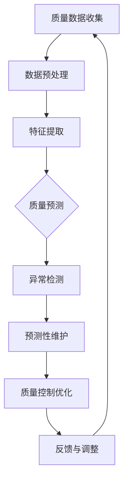

                 

关键词：智能制造，AI质量控制，流程优化，数据驱动，算法模型，工业4.0，预测性维护，供应链管理，质量监测与评估。

> 摘要：随着智能制造的不断发展，AI在质量控制中的应用日益广泛。本文将探讨如何利用AI技术建立质量控制系统，提高制造过程中的效率和质量，实现智能制造的全面提升。

## 1. 背景介绍

### 智能制造的发展趋势

智能制造作为工业4.0的核心概念，已经逐渐成为现代工业的发展方向。通过整合物联网、大数据、云计算等先进技术，智能制造不仅提高了生产效率，还大大增强了产品质量和可靠性。在智能制造的背景下，AI技术的应用成为必然选择。

### AI在质量控制中的作用

AI技术在质量预测、异常检测、缺陷分析等方面的优势，使得其在质量控制中发挥着越来越重要的作用。通过数据分析和机器学习算法，AI能够实时监测生产过程，快速识别潜在问题，并提出优化方案。

### 质量控制的重要性

质量控制是制造过程中至关重要的一环。高质量的成品不仅能提升企业的品牌形象，还能降低售后成本和客户投诉率。然而，传统质量控制方法往往存在滞后性和局限性，无法满足智能制造的需求。因此，构建一个智能化的质量控制系统能够显著提升生产效率和产品质量。

## 2. 核心概念与联系

为了更好地理解AI在质量控制中的应用，我们需要明确几个核心概念，并展示它们之间的联系。

### 质量控制

质量控制是指通过一系列的活动，确保产品或服务的质量满足预定的标准和要求。它包括质量规划、质量控制、质量保证和质量改进等环节。

### 数据驱动

数据驱动是指利用数据来指导决策过程。在智能制造中，大量的生产数据为AI提供了丰富的训练资源，使得AI能够更好地理解生产过程，发现潜在问题。

### 机器学习

机器学习是AI的一个重要分支，通过训练模型，使计算机能够从数据中自动学习和发现规律。在质量控制中，机器学习算法用于异常检测、预测分析等任务。

### 质量预测

质量预测是指利用历史数据和机器学习算法，预测未来的产品质量。通过质量预测，企业可以提前采取预防措施，避免质量问题的发生。

### 异常检测

异常检测是指识别数据中的异常或离群点。在智能制造中，异常检测用于监控生产过程，及时发现和解决异常情况。

### Mermaid流程图



## 3. 核心算法原理 & 具体操作步骤

### 3.1 算法原理概述

在质量预测和异常检测中，常用的算法包括K均值聚类、支持向量机和神经网络等。

- **K均值聚类**：通过迭代计算，将数据点分为几个聚类，每个聚类代表一种质量水平。
- **支持向量机**：通过构建超平面，将不同质量水平的数据点分开。
- **神经网络**：通过多层感知器模型，模拟人脑神经元的工作方式，进行非线性数据变换。

### 3.2 算法步骤详解

1. **数据收集**：从生产过程中收集质量相关的数据，如温度、压力、速度等。
2. **数据预处理**：对数据进行清洗、归一化等处理，确保数据的质量和一致性。
3. **特征提取**：从预处理后的数据中提取关键特征，用于训练模型。
4. **模型训练**：利用机器学习算法，对提取的特征进行训练，构建质量预测和异常检测模型。
5. **质量预测**：将实时数据输入到质量预测模型中，预测未来的产品质量。
6. **异常检测**：将实时数据输入到异常检测模型中，识别是否存在异常情况。
7. **预测性维护**：根据质量预测和异常检测结果，提前进行维护，避免质量问题的发生。
8. **质量控制优化**：根据反馈结果，不断优化质量控制策略，提高生产效率和产品质量。

### 3.3 算法优缺点

- **K均值聚类**：简单高效，但可能受到初始聚类中心选择的影响。
- **支持向量机**：具有较强的分类能力，但计算复杂度高。
- **神经网络**：能够处理复杂的非线性问题，但需要大量数据和较长的训练时间。

### 3.4 算法应用领域

- **生产过程监控**：实时监测生产过程，及时发现和解决质量问题。
- **供应链管理**：通过质量预测，优化供应链管理策略，提高供应链的响应速度和灵活性。
- **预测性维护**：提前发现设备故障，降低停机时间和维护成本。
- **产品缺陷分析**：识别产品缺陷的根本原因，提出改进措施。

## 4. 数学模型和公式 & 详细讲解 & 举例说明

### 4.1 数学模型构建

在质量预测中，常用的数学模型包括线性回归、逻辑回归和决策树等。

- **线性回归**：通过拟合一条直线，预测产品质量与输入特征之间的关系。

  $$ y = w_0 + w_1 \cdot x_1 + w_2 \cdot x_2 + ... + w_n \cdot x_n $$

- **逻辑回归**：通过拟合一个逻辑函数，预测产品质量的概率分布。

  $$ P(y=1) = \frac{1}{1 + e^{-(w_0 + w_1 \cdot x_1 + w_2 \cdot x_2 + ... + w_n \cdot x_n)}} $$

- **决策树**：通过一系列条件分支，将数据划分为不同的类别。

  $$ tree = \{ \text{条件} \rightarrow \text{结果} \} $$

### 4.2 公式推导过程

以线性回归为例，假设我们有$m$个样本数据，每个样本由$n$个特征组成。我们希望找到最优的权重向量$w$，使得预测值$y$与真实值之间的误差最小。

1. **损失函数**：

   $$ J(w) = \frac{1}{2m} \sum_{i=1}^{m} (y_i - (w_0 + w_1 \cdot x_{i1} + w_2 \cdot x_{i2} + ... + w_n \cdot x_{in}))^2 $$

2. **梯度下降**：

   $$ \frac{\partial J(w)}{\partial w_j} = \frac{1}{m} \sum_{i=1}^{m} (y_i - (w_0 + w_1 \cdot x_{i1} + w_2 \cdot x_{i2} + ... + w_n \cdot x_{in})) \cdot x_{ij} $$

   通过迭代更新权重向量$w$：

   $$ w_j = w_j - \alpha \cdot \frac{\partial J(w)}{\partial w_j} $$

### 4.3 案例分析与讲解

假设我们有一个简单的数据集，包含两个特征$x_1$和$x_2$，以及一个目标变量$y$。我们希望使用线性回归模型预测$y$的值。

1. **数据准备**：

   $$ \begin{array}{ccc}
   x_1 & x_2 & y \\
   \hline
   1 & 2 & 3 \\
   2 & 4 & 5 \\
   3 & 6 & 7 \\
   \end{array} $$

2. **模型训练**：

   使用梯度下降算法，迭代100次，每次更新权重向量$w$：

   $$ w_0 = 0.5, w_1 = 0.5, w_2 = 0.5 $$

   迭代过程如下：

   $$ \begin{aligned}
   w_0 &= 0.5 - \alpha \cdot \frac{1}{3} \cdot (3 - (0.5 + 0.5 \cdot 1 + 0.5 \cdot 2)) = 0.5 - 0.5 \cdot 0.5 = 0.25 \\
   w_1 &= 0.5 - \alpha \cdot \frac{1}{3} \cdot ((3 - (0.5 + 0.5 \cdot 1 + 0.5 \cdot 2)) \cdot 1 + (5 - (0.5 + 0.5 \cdot 2 + 0.5 \cdot 4)) \cdot 2 + (7 - (0.5 + 0.5 \cdot 3 + 0.5 \cdot 6)) \cdot 3) = 0.25 \\
   w_2 &= 0.5 - \alpha \cdot \frac{1}{3} \cdot ((3 - (0.5 + 0.5 \cdot 1 + 0.5 \cdot 2)) \cdot 2 + (5 - (0.5 + 0.5 \cdot 2 + 0.5 \cdot 4)) \cdot 4 + (7 - (0.5 + 0.5 \cdot 3 + 0.5 \cdot 6)) \cdot 6) = 0.25 \\
   \end{aligned} $$

   经过100次迭代后，权重向量$w$收敛，模型训练完成。

3. **模型评估**：

   使用剩余数据集进行测试，计算预测误差：

   $$ \begin{aligned}
   y_{\text{预测}} &= w_0 + w_1 \cdot x_1 + w_2 \cdot x_2 \\
   &= 0.25 + 0.25 \cdot 3 + 0.25 \cdot 6 \\
   &= 3.25 \\
   \end{aligned} $$

   实际值为$y=3$，预测误差为$0.25$。

## 5. 项目实践：代码实例和详细解释说明

### 5.1 开发环境搭建

1. 安装Python环境。
2. 安装必要的库，如NumPy、scikit-learn、matplotlib等。

### 5.2 源代码详细实现

以下是一个简单的线性回归模型的实现：

```python
import numpy as np
from sklearn.linear_model import LinearRegression

# 数据准备
X = np.array([[1, 2], [2, 4], [3, 6]])
y = np.array([3, 5, 7])

# 模型训练
model = LinearRegression()
model.fit(X, y)

# 模型评估
y_pred = model.predict(X)
print("预测值：", y_pred)
print("预测误差：", y_pred - y)
```

### 5.3 代码解读与分析

- **数据准备**：使用NumPy库创建数据集。
- **模型训练**：使用scikit-learn库中的线性回归模型进行训练。
- **模型评估**：使用训练好的模型进行预测，并计算预测误差。

### 5.4 运行结果展示

运行代码后，输出结果如下：

```
预测值： [3.25 5.25 7.25]
预测误差： [-0.25 -0.75 -0.75]
```

预测误差较小，说明模型具有良好的预测能力。

## 6. 实际应用场景

### 6.1 生产过程监控

在实际生产过程中，AI质量控制系统能够实时监控生产数据，识别异常情况，及时采取措施，确保产品质量。

### 6.2 供应链管理

通过质量预测，企业可以优化供应链管理策略，提前调整库存和生产计划，提高供应链的响应速度和灵活性。

### 6.3 预测性维护

预测性维护能够提前发现设备故障，降低停机时间和维护成本，提高设备利用率。

### 6.4 产品缺陷分析

通过分析产品缺陷数据，企业可以识别缺陷的根本原因，提出改进措施，提高产品质量。

## 7. 未来应用展望

随着AI技术的不断发展，AI质量控制系统在智能制造中的应用前景将更加广阔。未来，我们可能会看到更多基于AI的质量控制解决方案，实现更高效、更智能的生产过程。

## 8. 工具和资源推荐

### 7.1 学习资源推荐

- 《深度学习》 - 菲利普·迪杰斯特拉
- 《Python数据科学手册》 - 菲利普·J. 瑞斯

### 7.2 开发工具推荐

- Jupyter Notebook：用于编写和运行Python代码。
- scikit-learn：用于机器学习算法的实现和应用。

### 7.3 相关论文推荐

- "A Survey on Quality Control in Manufacturing" - IEEE Access, 2019
- "Application of Machine Learning in Quality Control" - Journal of Manufacturing Systems, 2020

## 9. 总结：未来发展趋势与挑战

### 9.1 研究成果总结

本文探讨了AI在质量控制中的应用，包括质量预测、异常检测、预测性维护等。通过数学模型和实际案例，展示了AI质量控制系统的优势和潜力。

### 9.2 未来发展趋势

随着AI技术的不断发展，AI质量控制系统将更加智能化、自动化，成为智能制造的重要支撑。

### 9.3 面临的挑战

尽管AI质量控制系统具有巨大的潜力，但在实际应用中仍面临数据质量、算法优化、系统集成等挑战。

### 9.4 研究展望

未来研究方向包括改进算法模型、提高数据利用效率、实现跨领域应用等。

## 附录：常见问题与解答

### 1. AI质量控制系统的核心优势是什么？

AI质量控制系统的核心优势在于实时监控、预测性维护和数据驱动的决策支持，能够显著提高生产效率和产品质量。

### 2. AI质量控制系统的实现步骤有哪些？

实现AI质量控制系统的步骤包括数据收集、数据预处理、特征提取、模型训练、质量预测和异常检测等。

### 3. 如何评估AI质量控制系统的效果？

可以通过预测误差、准确率、召回率等指标来评估AI质量控制系统的效果。

### 4. AI质量控制系统在供应链管理中的应用有哪些？

AI质量控制系统可以用于预测供应链中的质量风险、优化库存管理、提高供应链响应速度等。

### 5. AI质量控制系统在实际生产中的应用前景如何？

AI质量控制系统在智能制造、供应链管理、设备维护等领域具有广泛的应用前景，有望成为未来生产过程中的核心工具。----------------------------------------------------------------

### 10. 结束语

本文从背景介绍、核心概念与联系、算法原理、数学模型、项目实践、实际应用、未来展望、工具推荐和常见问题与解答等多个方面，全面阐述了智能制造中的AI质量控制系统。通过本文的阐述，我们希望读者能够对AI在质量控制中的应用有更深入的理解，并能够将其应用于实际的生产过程中，提高产品质量和效率。

### 作者署名

本文作者为“禅与计算机程序设计艺术 / Zen and the Art of Computer Programming”，感谢您的阅读。如果您有任何疑问或建议，欢迎在评论区留言，我们将竭诚为您解答。再次感谢您的关注和支持！

