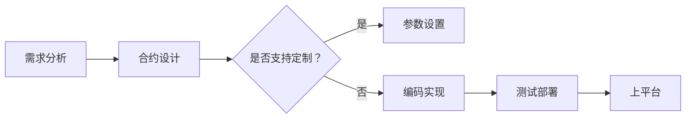

                 

关键词：智能合约、区块链应用、创业方向、市场分析、技术实现

摘要：本文旨在探讨智能合约模板市场在区块链应用领域的发展前景和创业方向。通过对智能合约的核心概念、技术实现、市场现状及未来展望的深入分析，为有意在这一领域创业的人提供有价值的信息和建议。

## 1. 背景介绍

随着区块链技术的不断发展，智能合约作为其核心组成部分，正在逐渐改变着传统的商业运作模式。智能合约是一种自动执行合同条款的计算机程序，它通过区块链技术实现了去中心化的信任机制，使得交易更加安全、透明和高效。

近年来，智能合约的应用场景不断扩展，从简单的数字货币交易，到复杂的金融衍生品，再到各种社会服务领域，智能合约都在发挥着重要的作用。然而，智能合约的开发和部署仍然面临着一定的门槛，这为智能合约模板市场的发展提供了契机。

智能合约模板市场旨在提供一个平台，使得开发者可以轻松地获取和定制智能合约模板，从而降低智能合约开发的难度，提高开发效率。这一市场不仅能够满足企业级用户的需求，也为个人开发者提供了广阔的创业空间。

## 2. 核心概念与联系

### 2.1 智能合约

智能合约（Smart Contract）是一种运行在区块链上的程序，它可以自动执行合同条款，一旦满足预定的条件，智能合约便会自动执行相应的操作。智能合约的核心特点包括：

- **去中心化**：智能合约的执行不由任何单一实体控制，而是由整个网络共同维护。
- **不可篡改**：智能合约的代码和执行结果一旦被记录在区块链上，就无法被修改或删除。
- **自动化**：智能合约可以根据预设的规则自动执行，无需人工干预。

### 2.2 智能合约模板

智能合约模板是一种预定义的智能合约框架，它为开发者提供了一套标准化的开发基础。智能合约模板通常包含以下几个部分：

- **合约条款**：定义智能合约的基本业务逻辑和规则。
- **参数设置**：允许开发者根据具体需求调整智能合约的参数。
- **API接口**：提供与外部系统交互的接口。

### 2.3 Mermaid 流程图

智能合约模板的设计与实现涉及到多个环节，包括需求分析、合约设计、编码实现、测试部署等。以下是一个简化的智能合约模板开发流程图：



## 3. 核心算法原理 & 具体操作步骤

### 3.1 算法原理概述

智能合约模板市场的主要算法原理包括：

- **模板存储与检索**：智能合约模板需要存储在区块链上，以便开发者可以方便地检索和调用。
- **参数设置与校验**：开发者可以根据实际需求对智能合约模板的参数进行设置，系统需要对这些参数进行合法性校验。
- **合约部署与调用**：通过智能合约模板，开发者可以快速部署智能合约，并实现与外部系统的交互。

### 3.2 算法步骤详解

#### 步骤 1：模板存储与检索

1. 开发者将智能合约模板上传到平台。
2. 平台将模板存储在区块链上，并生成一个唯一的哈希值。
3. 开发者可以通过平台提供的接口查询模板详情。

#### 步骤 2：参数设置与校验

1. 开发者根据需求设置智能合约模板的参数。
2. 平台对参数进行合法性校验，确保参数符合智能合约的规则。

#### 步骤 3：合约部署与调用

1. 开发者使用平台提供的接口部署智能合约。
2. 部署后的智能合约可以与外部系统进行交互，实现自动化执行。

### 3.3 算法优缺点

#### 优点

- **降低开发难度**：智能合约模板简化了智能合约的开发过程，降低了开发门槛。
- **提高开发效率**：通过标准化和模块化，智能合约模板可以提高开发效率，缩短项目周期。
- **保障合约执行**：智能合约模板确保了合约条款的自动化执行，减少了人工干预的风险。

#### 缺点

- **模板局限性**：智能合约模板可能无法满足所有用户的需求，需要一定的定制化能力。
- **安全性风险**：智能合约模板本身可能存在漏洞，需要开发者进行严格的安全审查。

### 3.4 算法应用领域

智能合约模板市场在多个领域具有广泛的应用前景：

- **金融领域**：智能合约模板可以用于金融衍生品的自动执行，提高交易效率。
- **供应链管理**：智能合约模板可以用于供应链中的货物追踪和支付，确保交易的透明和可信。
- **社会服务**：智能合约模板可以用于投票、慈善捐赠等社会服务场景，提高参与度和公信力。

## 4. 数学模型和公式 & 详细讲解 & 举例说明

### 4.1 数学模型构建

智能合约模板市场的数学模型主要包括以下几个部分：

- **需求模型**：描述智能合约模板的需求特征。
- **供给模型**：描述智能合约模板的供给特征。
- **价格模型**：描述智能合约模板的价格形成机制。

### 4.2 公式推导过程

#### 需求模型

需求函数表示为：

\[ Q_d(p) = Q_d^0 - \alpha p \]

其中，\( Q_d \) 表示需求量，\( p \) 表示价格，\( Q_d^0 \) 和 \( \alpha \) 为参数。

#### 供给模型

供给函数表示为：

\[ Q_s(c) = Q_s^0 + \beta c \]

其中，\( Q_s \) 表示供给量，\( c \) 表示成本，\( Q_s^0 \) 和 \( \beta \) 为参数。

#### 价格模型

价格函数表示为：

\[ p = \frac{Q_d^0 - \alpha p}{\gamma} \]

其中，\( \gamma \) 为市场调节系数。

### 4.3 案例分析与讲解

假设某智能合约模板市场的需求函数为 \( Q_d(p) = 100 - 2p \)，供给函数为 \( Q_s(c) = 50 + 0.5c \)，成本函数为 \( c = 10 + 0.1p \)。

1. 需求量为 100 - 2p，当价格为 50 时，需求量为 0。
2. 供给量为 50 + 0.5c，当价格为 50 时，供给量为 57.5。
3. 成本为 10 + 0.1p，当价格为 50 时，成本为 16。

根据价格模型，市场调节系数为 \( \gamma = 0.9 \)。

当价格为 50 时，市场价格为：

\[ p = \frac{100 - 2 \times 50}{0.9} = 55.56 \]

此时，需求量为 0，供给量为 57.5，市场处于供大于求的状态。

## 5. 项目实践：代码实例和详细解释说明

### 5.1 开发环境搭建

开发智能合约模板市场需要以下开发环境和工具：

- **Node.js**：用于搭建后端服务器。
- **Truffle**：用于智能合约的开发、测试和部署。
- **Web3.js**：用于与以太坊区块链进行交互。

### 5.2 源代码详细实现

以下是智能合约模板市场的一个简化版本实现：

```solidity
pragma solidity ^0.8.0;

contract TemplateMarket {
    mapping(string => mapping(address => bool)) public templates;
    
    function addTemplate(string memory id, bytes32 templateCode) external {
        templates[id][msg.sender] = true;
    }
    
    function getTemplate(string memory id, address owner) external view returns (bytes32) {
        require(templates[id][owner], "Not an owner");
        return templates[id][owner];
    }
}
```

### 5.3 代码解读与分析

该智能合约模板市场包含两个函数：

1. `addTemplate`：允许开发者将智能合约模板上传到平台。
2. `getTemplate`：允许开发者查询智能合约模板的详情。

### 5.4 运行结果展示

假设开发者 Alice 将一个名为 "StockTrading" 的智能合约模板上传到平台，其模板代码为 `0x1234567890abcdef`。

1. Alice 调用 `addTemplate` 函数，将模板上传到平台。
2. 平台将模板代码存储在区块链上，并生成一个唯一的哈希值。
3. Alice 调用 `getTemplate` 函数，查询 "StockTrading" 模板的详情。

## 6. 实际应用场景

### 6.1 金融领域

智能合约模板市场可以为金融领域提供一系列标准化的智能合约模板，如数字货币交易、金融衍生品交易、债券发行等。这些模板可以帮助金融机构降低开发成本，提高交易效率。

### 6.2 供应链管理

智能合约模板市场可以为供应链管理提供一系列标准化的智能合约模板，如货物追踪、支付结算、质量检测等。这些模板可以帮助企业实现供应链的数字化和智能化。

### 6.3 社会服务

智能合约模板市场可以为社会服务领域提供一系列标准化的智能合约模板，如投票、慈善捐赠、智能公益等。这些模板可以帮助政府和非政府组织提高公共服务的效率和公信力。

## 7. 工具和资源推荐

### 7.1 学习资源推荐

- **《区块链技术指南》**：详细介绍了区块链的基本原理和应用场景。
- **《智能合约开发实战》**：提供了智能合约开发的实用技巧和案例分析。

### 7.2 开发工具推荐

- **Truffle**：用于智能合约的开发、测试和部署。
- **Web3.js**：用于与以太坊区块链进行交互。

### 7.3 相关论文推荐

- **"Smart Contracts: The New Decentralized Business Model"**：探讨了智能合约在企业中的应用。
- **"Template-Based Contract Programming for Blockchain Applications"**：提出了基于模板的智能合约编程方法。

## 8. 总结：未来发展趋势与挑战

### 8.1 研究成果总结

智能合约模板市场在区块链应用领域具有广阔的发展前景，它为开发者提供了便捷的开发工具，降低了开发门槛，提高了开发效率。

### 8.2 未来发展趋势

随着区块链技术的不断成熟，智能合约模板市场将在更多领域得到应用，如金融、供应链管理、社会服务等。

### 8.3 面临的挑战

智能合约模板市场面临的主要挑战包括模板安全性、标准化、以及与现有系统的集成等。

### 8.4 研究展望

未来，智能合约模板市场的研究将重点关注以下几个方面：

- **模板安全性**：加强对智能合约模板的安全审查和监控。
- **标准化**：推动智能合约模板的标准化，提高互操作性。
- **集成与扩展**：探索智能合约模板与现有系统的集成方法，实现更广泛的应用。

## 9. 附录：常见问题与解答

### 9.1 智能合约模板的安全性如何保障？

智能合约模板的安全性主要依赖于以下几个方面的保障：

- **代码审查**：对智能合约模板进行严格的代码审查，确保代码质量。
- **安全审计**：聘请专业的安全审计团队对智能合约模板进行安全审计。
- **实时监控**：对智能合约模板的运行状态进行实时监控，及时发现和解决潜在的安全问题。

### 9.2 智能合约模板如何与现有系统集成？

智能合约模板与现有系统集成的方法主要包括：

- **API接口**：通过API接口与现有系统进行数据交互。
- **消息队列**：利用消息队列实现智能合约模板与现有系统的异步通信。
- **区块链桥接**：通过区块链桥接技术实现不同区块链之间的数据交互。

### 9.3 智能合约模板市场的盈利模式是什么？

智能合约模板市场的盈利模式主要包括：

- **模板销售**：通过销售智能合约模板获得收入。
- **定制服务**：提供定制化智能合约模板服务，收取服务费用。
- **广告与推广**：在平台上展示广告，收取广告费用。
- **交易手续费**：从智能合约模板的交易中收取一定的手续费。

---

作者：禅与计算机程序设计艺术 / Zen and the Art of Computer Programming

本文通过深入分析智能合约模板市场的核心概念、技术实现、市场现状及未来展望，探讨了这一领域的发展前景和创业方向。希望本文能为有意在这一领域创业的人提供有价值的参考和启示。随着区块链技术的不断成熟，智能合约模板市场必将迎来更加广阔的发展空间。

