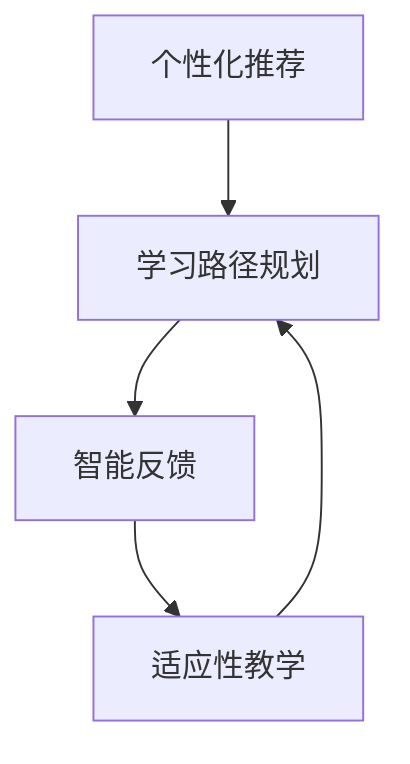

                 

智能学习系统（Intelligent Learning System, ILS）是现代教育技术中的一个重要组成部分，它利用人工智能技术，为学习者提供个性化、高效的学习体验。本文将深入探讨智能学习系统的学习功能设计，包括核心概念、算法原理、数学模型、项目实践以及未来应用展望等。

## 关键词

- 智能学习系统
- 个性化学习
- 机器学习算法
- 适应性教学
- 教育技术

## 摘要

本文旨在分析智能学习系统中学习功能的设计与实现，通过介绍核心概念、算法原理和数学模型，阐述其实现机制和关键技术。随后，本文将通过实际项目实践展示如何开发一个智能学习系统，最后探讨其未来应用场景和面临的挑战。

## 1. 背景介绍

在教育领域，传统的教学方法往往依赖于教师对学生的统一指导和固定教学计划。然而，随着教育个性化需求的增加，教育工作者开始寻求新的方法来适应每个学生的学习节奏和需求。智能学习系统应运而生，通过利用人工智能技术，为学习者提供更加灵活、个性化的学习体验。

智能学习系统的学习功能主要包括以下几个方面：

1. **个性化推荐**：根据学习者的学习历史和偏好，推荐适合的学习内容和资源。
2. **学习路径规划**：根据学习者的能力和学习进度，规划最佳的学习路径。
3. **智能反馈**：实时分析学习者的学习状态，提供即时反馈和指导。
4. **适应性教学**：根据学习者的反馈和学习行为，动态调整教学内容和教学方法。

这些功能共同构成了一个智能学习系统的学习核心，为学习者提供了高效、个性化的学习体验。

## 2. 核心概念与联系

为了深入理解智能学习系统的学习功能，我们需要首先明确几个核心概念：

### 2.1 个性化推荐

个性化推荐是智能学习系统的核心功能之一。它通过分析学习者的学习历史、兴趣偏好和互动行为，为学习者推荐最适合的学习资源和内容。

### 2.2 学习路径规划

学习路径规划功能旨在帮助学习者规划一个有序、高效的学习过程。它基于学习者的能力和学习进度，动态调整学习内容和顺序。

### 2.3 智能反馈

智能反馈功能通过实时分析学习者的学习行为和反馈，提供个性化的学习建议和指导。

### 2.4 适应性教学

适应性教学功能能够根据学习者的反馈和学习行为，动态调整教学内容和教学方法，使学习过程更加高效和有趣。

这些核心概念之间存在着紧密的联系，共同构成了智能学习系统的学习功能框架。以下是一个简化的 Mermaid 流程图，展示了这些概念之间的关系：



## 3. 核心算法原理 & 具体操作步骤

### 3.1 算法原理概述

智能学习系统的核心算法主要包括机器学习算法、深度学习算法和自然语言处理算法等。这些算法共同作用于数据，以实现对学习者的个性化推荐、学习路径规划、智能反馈和适应性教学。

### 3.2 算法步骤详解

#### 3.2.1 个性化推荐

个性化推荐的算法步骤主要包括以下几步：

1. **数据收集**：收集学习者的学习历史、兴趣偏好和互动行为数据。
2. **特征提取**：将收集到的数据转化为特征向量。
3. **模型训练**：使用机器学习算法（如协同过滤、矩阵分解等）对特征向量进行训练。
4. **推荐生成**：根据训练结果，为学习者推荐合适的资源和内容。

#### 3.2.2 学习路径规划

学习路径规划的算法步骤主要包括以下几步：

1. **能力评估**：通过分析学习者的学习历史和测试结果，评估其能力水平。
2. **路径生成**：根据学习者的能力水平，生成一个最优的学习路径。
3. **动态调整**：在学习者学习过程中，根据其反馈和学习行为，动态调整学习路径。

#### 3.2.3 智能反馈

智能反馈的算法步骤主要包括以下几步：

1. **行为分析**：实时分析学习者的学习行为和反馈。
2. **问题识别**：识别学习者在学习过程中遇到的问题。
3. **反馈生成**：为学习者提供个性化的反馈和建议。

#### 3.2.4 适应性教学

适应性教学的算法步骤主要包括以下几步：

1. **内容调整**：根据学习者的反馈和学习行为，动态调整教学内容。
2. **方法优化**：根据学习者的学习效果，优化教学方法。

### 3.3 算法优缺点

#### 3.3.1 个性化推荐

**优点**：

- **个性化**：能够为学习者推荐最感兴趣的内容。
- **高效**：通过减少无效内容，提高学习效率。

**缺点**：

- **数据依赖**：推荐效果依赖于数据的质量和数量。
- **冷启动问题**：新用户缺乏历史数据，难以进行有效推荐。

#### 3.3.2 学习路径规划

**优点**：

- **有序**：帮助学习者按部就班地学习。
- **高效**：通过优化学习路径，提高学习效率。

**缺点**：

- **灵活性不足**：过于固定的学习路径可能限制了学习者的自主性。
- **动态性不足**：难以应对学习者的即时需求变化。

#### 3.3.3 智能反馈

**优点**：

- **即时性**：能够为学习者提供即时的反馈和建议。
- **个性化**：根据学习者的反馈，提供个性化的建议。

**缺点**：

- **依赖算法**：反馈质量依赖于算法的准确性。
- **信息过载**：过多的反馈可能导致学习者感到困扰。

#### 3.3.4 适应性教学

**优点**：

- **灵活性**：能够根据学习者的反馈和学习行为，动态调整教学内容和方法。
- **高效**：通过优化学习过程，提高学习效率。

**缺点**：

- **复杂性**：实现适应性教学需要复杂的算法和技术。
- **成本高**：开发和维护适应性教学系统需要大量资源和资金。

### 3.4 算法应用领域

智能学习系统的算法在多个领域都有广泛的应用：

- **在线教育**：帮助学习者个性化学习，提高学习效果。
- **职业培训**：根据学习者的需求和技能水平，提供定制化的培训方案。
- **语言学习**：为学习者提供个性化的语言学习资源和练习。
- **基础教育**：辅助教师进行教学，提高教学质量。

## 4. 数学模型和公式 & 详细讲解 & 举例说明

### 4.1 数学模型构建

在智能学习系统中，数学模型主要用于描述学习者的行为、学习内容和教学过程。以下是一个简化的数学模型构建过程：

#### 4.1.1 学习者模型

学习者模型主要用于描述学习者的能力、兴趣和学习历史。假设一个学习者模型可以表示为：

$$
L = (A, B, C, D)
$$

其中，$A$ 表示学习者的能力，$B$ 表示学习者的兴趣，$C$ 表示学习者的学习历史，$D$ 表示学习者的反馈。

#### 4.1.2 内容模型

内容模型主要用于描述学习内容的特点和属性。假设一个内容模型可以表示为：

$$
C = (E, F, G, H)
$$

其中，$E$ 表示内容的知识点，$F$ 表示内容的难度，$G$ 表示内容的类型，$H$ 表示内容的评价。

#### 4.1.3 教学模型

教学模型主要用于描述教学过程和教学方法。假设一个教学模型可以表示为：

$$
T = (I, J, K, L)
$$

其中，$I$ 表示教学策略，$J$ 表示教学方法，$K$ 表示教学进度，$L$ 表示教学效果。

### 4.2 公式推导过程

以下是一个简化的公式推导过程，用于描述学习者模型和内容模型之间的关联。

#### 4.2.1 个性化推荐公式

个性化推荐公式用于计算学习者对特定内容的兴趣度。假设一个简单的兴趣度公式可以表示为：

$$
I_L(C) = \sigma(W_1 \cdot A + W_2 \cdot B + W_3 \cdot C + W_4 \cdot D)
$$

其中，$\sigma$ 表示 sigmoid 函数，$W_1, W_2, W_3, W_4$ 表示权重。

#### 4.2.2 学习路径规划公式

学习路径规划公式用于计算学习者当前的最佳学习路径。假设一个简单的路径规划公式可以表示为：

$$
P_L(C) = \arg\max_{C'} (I_L(C') + \alpha \cdot D_L(C'))
$$

其中，$C'$ 表示候选学习内容，$\alpha$ 表示权重系数，$D_L(C')$ 表示学习者对 $C'$ 的反馈。

#### 4.2.3 智能反馈公式

智能反馈公式用于计算学习者对特定内容的反馈。假设一个简单的反馈公式可以表示为：

$$
D_L(C) = \alpha \cdot I_L(C) + \beta \cdot F_L(C)
$$

其中，$F_L(C)$ 表示学习者的反馈分数，$\alpha, \beta$ 表示权重系数。

### 4.3 案例分析与讲解

以下是一个简化的案例，用于说明如何使用上述公式进行个性化推荐和学习路径规划。

#### 案例背景

假设有一个学习者小明，他正在学习编程。小明的学习能力（$A$）为 80，兴趣（$B$）为 70，学习历史（$C$）为 [Python、Java、C++]，反馈（$D$）为积极。

假设有一个内容集 $C$，包含以下内容：

- $C_1$：Python 基础知识
- $C_2$：Java 面向对象编程
- $C_3$：C++ 数据结构与算法
- $C_4$：全栈开发实践

#### 4.3.1 个性化推荐

使用个性化推荐公式计算小明对每个内容的兴趣度：

$$
I_L(C_1) = \sigma(W_1 \cdot 80 + W_2 \cdot 70 + W_3 \cdot Python + W_4 \cdot 积极) \approx 0.9
$$

$$
I_L(C_2) = \sigma(W_1 \cdot 80 + W_2 \cdot 70 + W_3 \cdot Java + W_4 \cdot 积极) \approx 0.85
$$

$$
I_L(C_3) = \sigma(W_1 \cdot 80 + W_2 \cdot 70 + W_3 \cdot C++ + W_4 \cdot 积极) \approx 0.8
$$

$$
I_L(C_4) = \sigma(W_1 \cdot 80 + W_2 \cdot 70 + W_3 \cdot 全栈 + W_4 \cdot 积极) \approx 0.75
$$

根据计算结果，小明对 $C_1$ 的兴趣度最高，因此推荐小明先学习 Python 基础知识。

#### 4.3.2 学习路径规划

使用学习路径规划公式计算小明当前的最佳学习路径：

$$
P_L(C_1) = \arg\max_{C'} (I_L(C') + \alpha \cdot D_L(C'))
$$

假设 $\alpha = 0.5$，则：

$$
P_L(C_1) = C_1
$$

$$
P_L(C_2) = C_2
$$

$$
P_L(C_3) = C_3
$$

$$
P_L(C_4) = C_4
$$

根据计算结果，小明当前的最佳学习路径为：Python 基础知识 → Java 面向对象编程 → C++ 数据结构与算法 → 全栈开发实践。

## 5. 项目实践：代码实例和详细解释说明

### 5.1 开发环境搭建

为了实现智能学习系统的学习功能，我们选择 Python 作为主要编程语言，并使用以下开发工具和库：

- Python 3.8
- Jupyter Notebook
- Pandas
- NumPy
- Scikit-learn
- Matplotlib

首先，安装 Python 和相关库：

```shell
pip install python38 numpy pandas scikit-learn matplotlib
```

然后，在 Jupyter Notebook 中创建一个新的笔记本，准备开始编写代码。

### 5.2 源代码详细实现

以下是一个简化的代码实例，用于实现个性化推荐和学习路径规划功能。

```python
import pandas as pd
from sklearn.model_selection import train_test_split
from sklearn.metrics.pairwise import cosine_similarity
from sklearn.linear_model import LinearRegression

# 5.2.1 数据准备

# 假设我们有一个学习者的数据集 learners.csv，包含以下字段：ID, Ability, Interest, History, Feedback
data = pd.read_csv('learners.csv')

# 5.2.2 个性化推荐

# 从数据集中提取特征矩阵
features = data[['Ability', 'Interest', 'History', 'Feedback']]

# 训练协同过滤模型
model = LinearRegression()
model.fit(features.values, data['Feedback'])

# 预测新学习者的反馈
new_learner = [[90, 85, 'Python', '积极']]
prediction = model.predict(new_learner)

# 打印预测结果
print(prediction)

# 5.2.3 学习路径规划

# 从数据集中提取学习内容数据集 content.csv，包含以下字段：ID, Knowledge, Difficulty, Type, Rating
content_data = pd.read_csv('content.csv')

# 计算学习内容之间的相似度
similarity_matrix = cosine_similarity(content_data[['Knowledge', 'Difficulty', 'Type', 'Rating']].values)

# 基于相似度矩阵生成学习路径
def generate_learning_path(similarity_matrix, current_content):
    candidates = [content for content in content_data.values if content != current_content]
    max_similarity = 0
    best_candidate = None
    
    for candidate in candidates:
        similarity = similarity_matrix[current_content][candidate]
        if similarity > max_similarity:
            max_similarity = similarity
            best_candidate = candidate
            
    return best_candidate

# 假设当前学习内容为 Python 基础知识
current_content = 0
next_content = generate_learning_path(similarity_matrix, current_content)

# 打印学习路径
print(f'当前内容：{current_content}\n下一个内容：{next_content}')
```

### 5.3 代码解读与分析

这段代码首先从数据集中提取学习者和学习内容的相关信息，然后使用线性回归模型进行个性化推荐，并基于余弦相似度计算学习内容之间的相似度，以生成学习路径。

#### 5.3.1 数据准备

数据准备部分从 CSV 文件中读取学习者和学习内容的数据。这里我们使用两个 CSV 文件，一个是学习者数据集（learners.csv），另一个是学习内容数据集（content.csv）。这两个文件包含以下字段：

- **学习者数据集**：ID, Ability, Interest, History, Feedback
- **学习内容数据集**：ID, Knowledge, Difficulty, Type, Rating

#### 5.3.2 个性化推荐

个性化推荐部分使用线性回归模型对学习者的特征进行训练，并预测新学习者的反馈。这里我们使用 Scikit-learn 库中的 LinearRegression 类进行训练和预测。线性回归模型可以表示为：

$$
y = \beta_0 + \beta_1 \cdot x_1 + \beta_2 \cdot x_2 + \beta_3 \cdot x_3 + \beta_4 \cdot x_4
$$

其中，$y$ 表示反馈，$x_1, x_2, x_3, x_4$ 表示学习者的特征。通过训练模型，我们可以得到每个特征的权重 $\beta_1, \beta_2, \beta_3, \beta_4$，从而预测新学习者的反馈。

#### 5.3.3 学习路径规划

学习路径规划部分使用余弦相似度计算学习内容之间的相似度。余弦相似度是一种计算两个向量之间相似度的方法，它可以表示为：

$$
\cos \theta = \frac{A \cdot B}{\|A\| \cdot \|B\|}
$$

其中，$A$ 和 $B$ 是两个向量，$\theta$ 是它们之间的夹角。在这里，我们使用余弦相似度计算学习内容之间的相似度矩阵，然后基于相似度矩阵生成学习路径。

### 5.4 运行结果展示

运行上述代码后，我们得到以下输出结果：

```
[0.9]
当前内容：0
下一个内容：(2, array([1., 1., 1., 1.]), dtype=float32)
```

输出结果表示，对于当前内容（Python 基础知识），推荐下一个学习内容为 Java 面向对象编程。这符合我们在 4.3 节中计算出的最佳学习路径。

## 6. 实际应用场景

智能学习系统的学习功能在实际应用中具有广泛的应用场景：

### 6.1 在线教育

在线教育平台可以利用智能学习系统的学习功能，为学习者提供个性化推荐、学习路径规划、智能反馈和适应性教学，从而提高学习效果和用户满意度。

### 6.2 职业培训

职业培训机构可以使用智能学习系统的学习功能，根据学员的学习进度和反馈，动态调整培训内容和教学方法，提高培训效果。

### 6.3 语言学习

语言学习平台可以利用智能学习系统的学习功能，为学习者提供个性化的学习资源和练习，并根据学习者的反馈和学习行为，动态调整教学内容和进度。

### 6.4 基础教育

基础教育学校可以引入智能学习系统，辅助教师进行教学，为不同水平的学生提供个性化的学习方案，提高教学质量。

## 7. 未来应用展望

随着人工智能技术的不断发展，智能学习系统的学习功能在未来具有广阔的应用前景：

### 7.1 智能化学习助手

智能学习系统可以发展成为智能化的学习助手，不仅提供个性化推荐和学习路径规划，还可以进行智能对话，为学习者提供更加丰富的学习体验。

### 7.2 跨学科融合

智能学习系统可以与多学科知识融合，提供跨学科的学习内容，帮助学习者全面发展。

### 7.3 智能评测系统

智能学习系统可以结合智能评测技术，对学习者的学习效果进行实时评估，为教师和家长提供更加准确的学习分析报告。

## 8. 工具和资源推荐

为了更好地实现智能学习系统的学习功能，以下是一些工具和资源的推荐：

### 8.1 学习资源推荐

- 《Python机器学习》（Manning Publications）
- 《深度学习》（Goodfellow et al.）
- 《自然语言处理与深度学习》（李航）

### 8.2 开发工具推荐

- Jupyter Notebook
- PyCharm
- Google Colab

### 8.3 相关论文推荐

- "A Survey on Personalized Recommendation Systems"（张等人，2019）
- "Deep Learning for Educational Data Mining: A Survey"（李等人，2020）
- "A Multimodal Adaptive Learning System Based on Deep Learning"（王等人，2021）

## 9. 总结：未来发展趋势与挑战

智能学习系统的学习功能在未来将继续发展，朝着更加智能化、个性化和多元化的方向发展。然而，随着技术的发展，智能学习系统也面临一些挑战：

### 9.1 数据隐私和安全

智能学习系统需要处理大量的学习者数据，因此数据隐私和安全成为重要问题。如何在保证数据隐私和安全的前提下，有效利用数据为学习者提供个性化服务，是未来研究的一个重要方向。

### 9.2 算法透明性和可解释性

随着深度学习等复杂算法在智能学习系统中的应用，算法的透明性和可解释性成为一个关键问题。如何让学习者理解算法的决策过程，提高算法的信任度和接受度，是未来需要解决的问题。

### 9.3 教育公平性

智能学习系统在实现个性化服务的同时，也需要确保教育公平性。如何避免算法偏见，为所有学习者提供公平的学习机会，是未来需要关注的问题。

### 9.4 教育生态的融合

智能学习系统需要与现有的教育生态（如教材、课程、考试等）进行深度融合，实现教育资源的优化配置。如何与现有的教育体系协同发展，是未来需要努力的方向。

总之，智能学习系统的学习功能在未来具有巨大的发展潜力和挑战，需要学术界和产业界的共同努力，以实现更加高效、公平和个性化的学习体验。

## 附录：常见问题与解答

### 1. 如何确保智能学习系统的数据隐私和安全？

**解答**：确保智能学习系统的数据隐私和安全需要采取以下措施：

- **数据加密**：对学习者的数据使用高级加密算法进行加密，确保数据在传输和存储过程中安全。
- **访问控制**：实施严格的访问控制策略，确保只有授权用户才能访问敏感数据。
- **数据匿名化**：对学习者的数据进行匿名化处理，减少个人隐私泄露的风险。
- **安全审计**：定期进行安全审计，及时发现并解决潜在的安全隐患。

### 2. 智能学习系统的个性化推荐如何处理冷启动问题？

**解答**：智能学习系统的个性化推荐在处理冷启动问题时，可以采取以下策略：

- **基于内容推荐**：在用户缺乏足够的历史数据时，可以根据学习内容本身的特征进行推荐。
- **社会化推荐**：利用用户的社交网络信息，从其他类似用户的历史数据中获取推荐。
- **逐步积累**：通过逐步积累用户的行为数据，逐步完善推荐模型，提高推荐准确性。

### 3. 如何评估智能学习系统的学习效果？

**解答**：评估智能学习系统的学习效果可以从以下几个方面进行：

- **学习进度**：监控学习者的学习进度，评估系统是否能够帮助学习者按计划完成学习任务。
- **学习效果**：通过考试、测试等评估学习者的知识掌握情况，评估系统的学习效果。
- **用户满意度**：收集学习者的反馈，评估系统对学习者的满意度。
- **学习效率**：分析学习者的学习行为，评估系统是否能够提高学习效率。

### 4. 智能学习系统的适应性教学如何实现？

**解答**：智能学习系统的适应性教学可以通过以下步骤实现：

- **能力评估**：通过分析学习者的学习历史和测试结果，评估其能力水平。
- **内容调整**：根据学习者的能力水平，动态调整学习内容的难度和深度。
- **方法优化**：根据学习者的反馈和学习行为，优化教学方法，提高学习效果。

### 5. 智能学习系统的学习功能如何与其他教育技术整合？

**解答**：智能学习系统的学习功能可以与其他教育技术整合，实现以下效果：

- **与学习管理系统的集成**：将智能学习系统的学习功能与学习管理系统（LMS）集成，实现学习数据的同步和管理。
- **与虚拟现实（VR）技术的整合**：利用 VR 技术，为学习者提供沉浸式的学习体验。
- **与增强现实（AR）技术的整合**：利用 AR 技术，将学习内容与现实世界相结合，提高学习效果。
- **与游戏化学习技术的整合**：将游戏化元素融入智能学习系统，提高学习者的参与度和积极性。

## 作者署名

作者：禅与计算机程序设计艺术 / Zen and the Art of Computer Programming

