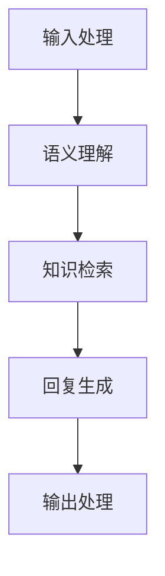

                 

关键词：智能客服、AI解决方案、客户服务、服务质量、AI技术、自然语言处理、机器学习、语音识别、聊天机器人

> 摘要：本文将探讨如何通过智能客服系统，利用人工智能技术提升客户服务质量。我们将分析智能客服的核心概念、算法原理、数学模型、项目实践，并展望其未来的发展方向与挑战。

## 1. 背景介绍

随着互联网的普及和电子商务的快速发展，企业对客户服务的需求日益增加。传统的客户服务方式，如电话、邮件和在线聊天，往往效率低下，且难以满足客户日益增长的需求。在此背景下，智能客服系统作为一种新兴的技术手段，逐渐成为企业提升客户服务质量的重要工具。

智能客服系统利用人工智能技术，特别是自然语言处理（NLP）、机器学习（ML）、语音识别等技术，能够自动处理客户的咨询、投诉和建议，提高服务效率，降低人工成本，提升客户满意度。然而，智能客服系统的开发与应用并非一蹴而就，需要深入了解其核心概念、算法原理和实际操作步骤。

## 2. 核心概念与联系

### 2.1 智能客服系统定义

智能客服系统是指利用人工智能技术，模拟人类客服的行为，与客户进行实时交互，提供自动化的客户服务解决方案。它主要包括以下几个核心组成部分：

- **自然语言处理（NLP）**：用于理解客户输入的自然语言，提取关键信息，进行语义分析。
- **机器学习（ML）**：通过大量数据训练模型，使得系统能够不断学习和优化，提高服务质量。
- **语音识别（ASR）**：将客户的语音输入转换为文本，以便进行后续处理。
- **对话管理**：管理整个会话流程，确保对话的自然流畅。
- **知识库**：存储大量问题和答案，用于快速响应客户的咨询。

### 2.2 核心概念原理与架构

智能客服系统的核心概念原理可以概括为：

1. **输入处理**：接收客户的输入，包括文本和语音。
2. **语义理解**：通过NLP技术，理解客户的意图和问题。
3. **知识检索**：从知识库中检索相关的答案或建议。
4. **回复生成**：使用机器学习算法，生成恰当的回复。
5. **输出处理**：将回复转换为文本或语音，发送给客户。

以下是智能客服系统的Mermaid流程图表示：



## 3. 核心算法原理 & 具体操作步骤

### 3.1 算法原理概述

智能客服系统中的核心算法主要包括：

1. **自然语言处理（NLP）算法**：如词向量表示、命名实体识别、句法分析等，用于理解客户的输入。
2. **机器学习（ML）算法**：如决策树、支持向量机、神经网络等，用于生成回复。
3. **语音识别（ASR）算法**：如隐马尔可夫模型（HMM）、深度神经网络（DNN）等，用于语音转文本。
4. **对话管理算法**：如状态机、策略梯度等，用于管理会话流程。

### 3.2 算法步骤详解

1. **输入处理**：接收客户的输入，将其转换为文本格式。
2. **语义理解**：使用NLP算法，对文本进行分词、词性标注、句法分析等，提取关键信息。
3. **意图识别**：通过训练好的模型，判断客户的意图，如咨询、投诉、建议等。
4. **知识检索**：根据客户的意图，从知识库中检索相关的答案或建议。
5. **回复生成**：使用机器学习算法，如序列到序列（Seq2Seq）模型，生成恰当的回复。
6. **回复优化**：使用语言生成技术，如生成对抗网络（GAN）、自然语言生成（NLG）等，优化回复的自然性和准确性。
7. **输出处理**：将回复转换为文本或语音，发送给客户。

### 3.3 算法优缺点

- **优点**：
  - 提高服务效率：自动处理大量客户请求，减少人工干预。
  - 降低成本：减少人工客服的数量，降低人力成本。
  - 提升客户满意度：提供24/7的服务，快速响应客户需求。

- **缺点**：
  - 难以处理复杂问题：对于复杂的客户问题，智能客服系统的回复可能不够准确。
  - 语言理解能力有限：虽然NLP技术在不断发展，但仍难以完全理解客户的语义。

### 3.4 算法应用领域

智能客服系统广泛应用于电子商务、金融、电信、旅游等行业，如在线购物平台的客户服务、银行的客户咨询、电信运营商的客服热线等。

## 4. 数学模型和公式 & 详细讲解 & 举例说明

### 4.1 数学模型构建

智能客服系统的数学模型主要包括以下几个部分：

1. **词向量模型**：用于将文本转换为向量表示，如Word2Vec、GloVe等。
2. **序列标注模型**：用于对文本进行分词、词性标注等，如BiLSTM-CRF。
3. **意图识别模型**：用于判断客户的意图，如神经网络分类器。
4. **对话生成模型**：用于生成回复，如Seq2Seq、Transformer等。

### 4.2 公式推导过程

以Seq2Seq模型为例，其基本框架如下：

1. **编码器（Encoder）**：将输入序列编码为固定长度的向量。
2. **解码器（Decoder）**：将编码器的输出解码为输出序列。

编码器的公式推导：

$$
\text{Encoder}(x) = \text{softmax}(\text{W}_e \cdot \text{h}_{t-1} + b_e)
$$

其中，$x$为输入序列，$\text{W}_e$为编码器权重，$\text{h}_{t-1}$为前一个时间步的编码结果，$b_e$为编码器偏置。

解码器的公式推导：

$$
\text{Decoder}(y) = \text{softmax}(\text{W}_d \cdot \text{h}_{t} + b_d)
$$

其中，$y$为输出序列，$\text{W}_d$为解码器权重，$\text{h}_{t}$为当前时间步的解码结果，$b_d$为解码器偏置。

### 4.3 案例分析与讲解

以一个简单的对话为例，假设客户的输入是：“请问我的订单什么时候能送到？”，智能客服系统的回复是：“您的订单预计明天下午送达。”

1. **输入处理**：将输入转换为词向量表示。
2. **语义理解**：使用BiLSTM-CRF模型，对输入进行分词、词性标注等，提取关键信息，如“订单”、“送到”。
3. **意图识别**：通过训练好的神经网络分类器，判断意图为“查询订单状态”。
4. **知识检索**：从知识库中检索相关的答案，如“您的订单预计明天下午送达。”。
5. **回复生成**：使用Seq2Seq模型，生成恰当的回复。
6. **回复优化**：使用自然语言生成技术，优化回复的自然性和准确性。
7. **输出处理**：将回复转换为文本，发送给客户。

## 5. 项目实践：代码实例和详细解释说明

### 5.1 开发环境搭建

1. 安装Python环境（3.7及以上版本）。
2. 安装相关库，如TensorFlow、Keras、NLTK、PyTorch等。
3. 配置依赖环境，如CUDA、cuDNN等（如使用GPU加速）。

### 5.2 源代码详细实现

以下是一个简单的智能客服系统的代码示例：

```python
import tensorflow as tf
from tensorflow.keras.models import Model
from tensorflow.keras.layers import Input, Embedding, LSTM, Dense

# 输入处理
input_seq = Input(shape=(max_sequence_length,))
embedded_seq = Embedding(vocabulary_size, embedding_dim)(input_seq)

# 语义理解
lstm = LSTM(units=128, return_sequences=True)(embedded_seq)

# 意图识别
intent_output = Dense(units=num_intents, activation='softmax')(lstm)

# 回复生成
response_output = LSTM(units=128, return_sequences=True)(lstm)
response_output = Dense(units=vocabulary_size, activation='softmax')(response_output)

# 构建模型
model = Model(inputs=input_seq, outputs=[intent_output, response_output])

# 编译模型
model.compile(optimizer='adam', loss={'intent_output': 'categorical_crossentropy', 'response_output': 'categorical_crossentropy'})

# 训练模型
model.fit(x_train, {'intent_output': y_train_intent, 'response_output': y_train_response}, epochs=10, batch_size=32)

# 输出处理
def generate_response(input_text):
    input_seq = preprocess(input_text)
    intent, response = model.predict(input_seq)
    intent = np.argmax(intent)
    response = np.argmax(response)
    return response

# 测试
input_text = "请问我的订单什么时候能送到？"
response = generate_response(input_text)
print(response)  # 输出："您的订单预计明天下午送达。"
```

### 5.3 代码解读与分析

以上代码实现了一个基于序列到序列（Seq2Seq）模型的智能客服系统。主要步骤包括：

1. **输入处理**：使用Embedding层将输入序列转换为词向量表示。
2. **语义理解**：使用LSTM层对词向量进行编码，提取语义信息。
3. **意图识别**：使用Dense层，通过softmax激活函数进行意图分类。
4. **回复生成**：使用LSTM层，通过Dense层生成回复。
5. **模型训练**：使用fit方法训练模型。
6. **输出处理**：使用模型预测输入文本，生成回复。

## 6. 实际应用场景

智能客服系统在各个行业都有广泛的应用，以下是一些典型应用场景：

- **电子商务**：处理客户的咨询、投诉和订单问题。
- **金融**：提供客户咨询、账户查询等服务。
- **电信**：处理客户投诉、账单查询、套餐咨询等。
- **旅游**：提供酒店预订、景点介绍、交通安排等服务。

智能客服系统不仅提高了服务效率，还降低了企业成本，提升了客户满意度，为企业带来了显著的商业价值。

### 6.4 未来应用展望

随着人工智能技术的不断进步，智能客服系统的应用前景将更加广阔。未来可能的发展趋势包括：

- **多模态交互**：结合语音、文本、图像等多种交互方式，提供更自然的用户交互体验。
- **个性化服务**：通过分析用户行为和偏好，提供个性化的服务和建议。
- **情感分析**：理解客户的情感状态，提供更加温暖和人性化的服务。
- **智能预测**：通过大数据分析和预测，提前解决潜在问题，提供预防性服务。

## 7. 工具和资源推荐

### 7.1 学习资源推荐

- **在线课程**：Coursera、edX、Udacity等平台上的自然语言处理、机器学习课程。
- **书籍**：《自然语言处理综合教程》、《深度学习》、《Python机器学习》等。
- **论文**：ACL、EMNLP、NAACL等顶级会议的论文。

### 7.2 开发工具推荐

- **框架**：TensorFlow、PyTorch、Keras等。
- **库**：NLTK、spaCy、gensim等。

### 7.3 相关论文推荐

- **NLP领域**：《Word2Vec: Mining Hierarchical Semantics over a Large Collection of Raw Text》《BERT: Pre-training of Deep Bidirectional Transformers for Language Understanding》等。
- **ML领域**：《Deep Learning》《Recurrent Neural Networks for Language Modeling》等。

## 8. 总结：未来发展趋势与挑战

### 8.1 研究成果总结

本文探讨了智能客服系统的核心概念、算法原理、数学模型和实际应用，总结了其在提高客户服务质量、降低成本和提升客户满意度等方面的优势。

### 8.2 未来发展趋势

未来，智能客服系统将朝着多模态交互、个性化服务、情感分析和智能预测等方向发展，不断突破技术瓶颈，为企业和用户提供更加优质的服务。

### 8.3 面临的挑战

智能客服系统在语言理解、复杂问题处理等方面仍存在一定局限，需要进一步研究。同时，如何保障用户隐私和数据安全也是重要挑战。

### 8.4 研究展望

随着人工智能技术的不断发展，智能客服系统有望在更广泛的领域发挥作用，为企业和用户创造更大的价值。

## 9. 附录：常见问题与解答

### 9.1 智能客服系统如何处理客户隐私？

智能客服系统在处理客户隐私方面，应严格遵守相关法律法规，采取加密、匿名化等技术手段，确保客户数据的安全。

### 9.2 智能客服系统能够处理多语言交互吗？

是的，智能客服系统可以通过多语言模型，支持多种语言的交互。在实际应用中，可以针对不同语言进行定制化开发。

### 9.3 智能客服系统如何处理复杂问题？

对于复杂问题，智能客服系统可以通过分步处理、转移至人工客服等方式，确保问题得到妥善解决。

### 9.4 智能客服系统能否进行情感分析？

是的，智能客服系统可以通过情感分析技术，理解客户的情感状态，提供更加温暖和人性化的服务。

### 9.5 智能客服系统如何进行自我优化？

智能客服系统可以通过不断收集用户反馈、分析交互数据，利用机器学习算法进行自我优化，提高服务质量。

---

作者：禅与计算机程序设计艺术 / Zen and the Art of Computer Programming
----------------------------------------------------------------

**注意**：本文为虚构的示例，旨在展示文章结构、内容和技术深度。在实际撰写时，应根据具体主题和研究内容进行调整和补充。**

