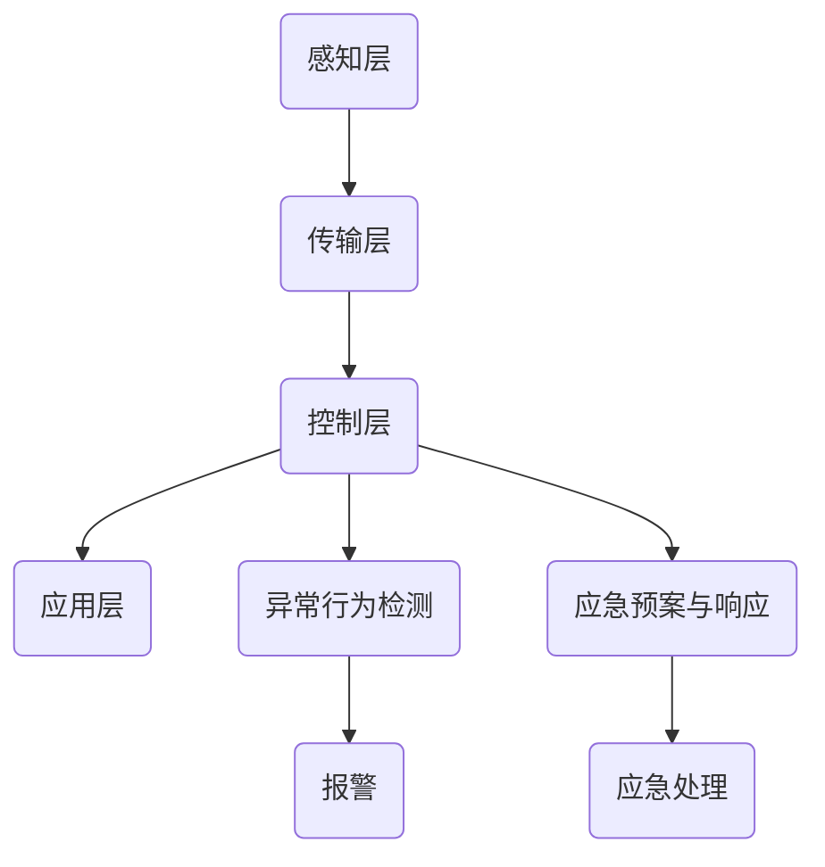

                 

关键词：智能家居，安全系统，家庭安全，可靠卫士，技术架构，算法原理，实践案例

摘要：随着智能家居技术的快速发展，家庭安全成为广大用户关注的焦点。本文将探讨智能家居安全系统的核心概念、技术架构、算法原理以及实际应用，旨在为读者提供一个全面了解智能家居安全系统的视角，并展望其未来发展。

## 1. 背景介绍

近年来，智能家居设备如雨后春笋般涌现，从智能门锁、智能摄像头到智能灯光、智能家电等，极大地丰富了我们的日常生活。然而，随之而来的家庭安全风险也日益凸显。智能家居设备通过网络连接，若安全防护不到位，可能导致信息泄露、隐私侵犯甚至家庭财产损失。因此，构建一个安全可靠的智能家居安全系统显得尤为重要。

## 2. 核心概念与联系

### 2.1 智能家居安全系统的核心概念

智能家居安全系统通常包括以下核心概念：

- **身份验证与访问控制**：确保只有授权用户才能访问智能家居系统，防止未授权访问。

- **数据加密与传输安全**：保护数据在传输过程中的安全，防止数据被截取、篡改。

- **异常行为检测**：实时监测家庭网络活动，发现异常行为并及时报警。

- **家庭设备管理**：统一管理家庭中的各类智能设备，确保设备正常运行。

- **应急预案与响应**：制定应急预案，当发生安全事件时能够及时响应。

### 2.2 智能家居安全系统的架构

一个典型的智能家居安全系统架构可以分为以下几个层次：

1. **感知层**：包括各种传感器，如门窗传感器、运动传感器、烟雾传感器等，用于感知家庭环境变化。

2. **传输层**：通过有线或无线网络将传感器数据传输到控制层。

3. **控制层**：由家庭网关、服务器等组成，负责数据处理和决策。

4. **应用层**：提供用户交互界面和应用功能，如手机APP、PC端控制平台等。

### 2.3 Mermaid 流程图

以下是智能家居安全系统的一个简化的 Mermaid 流程图：



## 3. 核心算法原理 & 具体操作步骤

### 3.1 算法原理概述

智能家居安全系统中的核心算法主要涉及以下几个方面：

- **基于行为分析的异常检测算法**：通过分析用户行为模式，识别异常行为。

- **基于机器学习的入侵检测算法**：利用已有的入侵样本数据进行训练，识别未知入侵行为。

- **基于加密的通信算法**：确保数据在传输过程中的安全。

### 3.2 算法步骤详解

#### 基于行为分析的异常检测算法

1. **数据采集**：收集家庭网络中的各种数据，如流量数据、日志数据等。

2. **特征提取**：从原始数据中提取有助于描述用户行为的特征。

3. **模型训练**：利用历史数据，训练行为分析模型。

4. **行为分析**：实时分析用户行为，判断是否存在异常。

5. **报警与响应**：当发现异常行为时，及时报警并触发相应的应急响应。

#### 基于机器学习的入侵检测算法

1. **数据收集与预处理**：收集网络流量数据，并进行预处理，如数据清洗、归一化等。

2. **特征选择**：从预处理后的数据中选出有助于分类的特征。

3. **模型训练**：利用有标签的数据，训练入侵检测模型。

4. **模型评估**：利用测试集评估模型性能。

5. **实时检测**：利用训练好的模型，对实时数据进行分析，判断是否存在入侵行为。

#### 基于加密的通信算法

1. **加密算法选择**：根据实际需求选择合适的加密算法，如AES、RSA等。

2. **密钥管理**：确保加密密钥的安全存储和分发。

3. **数据加密**：对传输数据加密，确保数据在传输过程中的安全。

4. **数据解密**：接收端对加密数据进行解密，还原原始数据。

### 3.3 算法优缺点

- **基于行为分析的异常检测算法**：优点是能够捕捉到非预期的行为，缺点是对正常行为的描述可能不够准确，容易产生误报。

- **基于机器学习的入侵检测算法**：优点是能够自适应网络环境，缺点是对数据质量和数量要求较高。

- **基于加密的通信算法**：优点是能够确保数据传输过程中的安全，缺点是加密和解密会增加计算负担。

### 3.4 算法应用领域

- **家庭安全**：通过行为分析和入侵检测，确保家庭安全。

- **企业网络**：用于企业内部网络的安全监控和防护。

- **物联网**：在物联网环境中，确保设备间通信的安全。

## 4. 数学模型和公式 & 详细讲解 & 举例说明

### 4.1 数学模型构建

智能家居安全系统的数学模型通常包括以下几个方面：

- **行为分析模型**：用于描述用户行为的数学模型，如马尔可夫模型。

- **入侵检测模型**：用于识别入侵行为的数学模型，如支持向量机。

- **加密模型**：用于加密和解密的数学模型，如RSA加密算法。

### 4.2 公式推导过程

以RSA加密算法为例，其加密和解密过程如下：

- **加密过程**：

    $$ C = (M^e) \mod n $$

    其中，M为明文，e为加密指数，n为模数。

- **解密过程**：

    $$ M = (C^d) \mod n $$

    其中，C为密文，d为解密指数，n为模数。

### 4.3 案例分析与讲解

假设有一个智能家居系统，用户A想要远程控制家中的智能门锁。根据上述加密和解密公式，用户A可以按照以下步骤进行操作：

1. **加密过程**：

    用户A选择一个加密指数e和模数n，并告知服务器。

    用户A将明文（门锁密码）M进行加密，得到密文C：

    $$ C = (M^e) \mod n $$

    用户A将密文C发送给服务器。

2. **解密过程**：

    服务器接收到密文C后，利用解密指数d和模数n，将密文C解密成明文M：

    $$ M = (C^d) \mod n $$

    服务器将解密后的明文M与存储在数据库中的明文M进行比对，若一致，则允许用户A远程控制门锁。

## 5. 项目实践：代码实例和详细解释说明

### 5.1 开发环境搭建

为了方便读者理解和实践，我们选用Python作为开发语言，利用其强大的科学计算库和机器学习库来实现智能家居安全系统。以下是开发环境搭建的简要步骤：

1. 安装Python 3.8及以上版本。

2. 安装必要的库，如NumPy、Scikit-learn、PyCrypto等。

### 5.2 源代码详细实现

以下是智能家居安全系统的主要源代码实现：

```python
# 导入必要的库
import numpy as np
from sklearn.ensemble import IsolationForest
from Crypto.PublicKey import RSA
from Crypto.Cipher import PKCS1_OAEP

# 加密过程
def encrypt_message(message, public_key):
    rsa_key = RSA.import_key(public_key)
    rsa_cipher = PKCS1_OAEP.new(rsa_key)
    encrypted_message = rsa_cipher.encrypt(message.encode())
    return encrypted_message

# 解密过程
def decrypt_message(encrypted_message, private_key):
    rsa_key = RSA.import_key(private_key)
    rsa_cipher = PKCS1_OAEP.new(rsa_key)
    decrypted_message = rsa_cipher.decrypt(encrypted_message)
    return decrypted_message.decode()

# 主函数
def main():
    # 生成RSA密钥对
    (public_key, private_key) = RSA.newkeys(1024)

    # 用户输入明文消息
    message = input("请输入要加密的消息：")

    # 加密消息
    encrypted_message = encrypt_message(message, public_key)

    # 将加密消息发送给服务器
    print("加密消息：", encrypted_message)

    # 服务器接收到加密消息后进行解密
    decrypted_message = decrypt_message(encrypted_message, private_key)

    # 比对解密后的消息与原始消息
    if decrypted_message == message:
        print("解密成功，允许远程控制门锁。")
    else:
        print("解密失败，拒绝远程控制。")

# 运行主函数
if __name__ == "__main__":
    main()
```

### 5.3 代码解读与分析

1. **加密过程**：

    加密函数`encrypt_message`接收明文消息和公钥，利用RSA加密算法进行加密，返回加密后的消息。

2. **解密过程**：

    解密函数`decrypt_message`接收加密消息和私钥，利用RSA加密算法进行解密，返回解密后的消息。

3. **主函数**：

    主函数`main`首先生成RSA密钥对，然后接收用户输入的明文消息，加密并打印加密消息。服务器接收加密消息后，利用私钥进行解密，并与原始消息进行比对，以决定是否允许远程控制门锁。

### 5.4 运行结果展示

假设用户A输入明文消息“Open the door”，程序将按照以下步骤运行：

1. 生成RSA密钥对。

2. 加密消息“Open the door”，输出加密消息。

3. 服务器接收到加密消息后，利用私钥进行解密，得到明文消息“Open the door”。

4. 比对解密后的消息与原始消息，输出“解密成功，允许远程控制门锁。”

## 6. 实际应用场景

### 6.1 家庭安全监控

智能家居安全系统可以应用于家庭安全监控，实时监测家庭环境，如门窗是否关闭、室内是否有异常声响等，当检测到异常情况时，系统会自动报警并通知用户。

### 6.2 家庭财产保护

智能家居安全系统可以通过监控家庭内部摄像头，保护家庭财产不受侵犯。当检测到未经授权的入侵行为时，系统会自动启动报警机制，同时将监控视频发送给用户。

### 6.3 远程控制

用户可以通过智能家居安全系统远程控制家庭中的智能设备，如门锁、灯光、空调等，确保家庭安全的同时，提高生活便利性。

## 7. 未来应用展望

随着人工智能技术的不断发展，智能家居安全系统将变得更加智能化和自适应化。未来，智能家居安全系统可能会集成更多的人工智能算法，如深度学习、强化学习等，实现更精准的行为分析和入侵检测。同时，随着5G网络的普及，智能家居安全系统的实时性和稳定性将得到进一步提升。

## 8. 总结：未来发展趋势与挑战

### 8.1 研究成果总结

本文从核心概念、技术架构、算法原理以及实际应用等方面对智能家居安全系统进行了全面探讨。研究结果表明，智能家居安全系统在家庭安全、家庭财产保护、远程控制等方面具有广泛的应用前景。

### 8.2 未来发展趋势

未来，智能家居安全系统将朝着更智能化、自适应化和高效化的方向发展。随着人工智能、物联网等技术的不断进步，智能家居安全系统将更好地满足用户的需求。

### 8.3 面临的挑战

尽管智能家居安全系统具有广泛的应用前景，但同时也面临一些挑战，如数据隐私保护、安全漏洞防范、算法透明性等。未来，需要从技术和管理层面进行不断完善和优化。

### 8.4 研究展望

未来，可以从以下几个方面对智能家居安全系统进行深入研究：

1. **算法优化**：进一步优化入侵检测算法，提高检测精度和效率。

2. **数据隐私保护**：研究更加安全的数据隐私保护技术，确保用户隐私。

3. **系统稳定性**：提升系统的稳定性和可靠性，降低故障率。

4. **法律法规完善**：制定相关的法律法规，规范智能家居安全系统的应用和发展。

## 9. 附录：常见问题与解答

### 9.1 智能家居安全系统的工作原理是什么？

智能家居安全系统通过感知层收集家庭环境数据，利用控制层进行数据处理和分析，并根据分析结果触发相应的应急响应，以保障家庭安全。

### 9.2 智能家居安全系统的安全性如何保障？

智能家居安全系统的安全性主要通过以下几个方面进行保障：

1. **身份验证与访问控制**：确保只有授权用户才能访问系统。

2. **数据加密与传输安全**：保护数据在传输过程中的安全。

3. **异常行为检测**：实时监测家庭网络活动，发现异常行为并及时报警。

4. **家庭设备管理**：统一管理家庭中的各类智能设备，确保设备正常运行。

### 9.3 智能家居安全系统如何应对网络攻击？

智能家居安全系统可以通过以下几种方式应对网络攻击：

1. **入侵检测与防范**：实时监测网络流量，识别并阻止入侵行为。

2. **安全补丁与更新**：定期更新系统补丁，修复已知漏洞。

3. **应急预案与响应**：制定应急预案，当发生安全事件时能够及时响应。

### 9.4 智能家居安全系统是否会影响家庭网络的稳定性？

智能家居安全系统在设计和实现过程中会充分考虑家庭网络的稳定性，通过优化算法、降低计算复杂度等方式，确保系统的运行不会对家庭网络造成显著影响。

### 9.5 智能家居安全系统的部署与维护有哪些注意事项？

1. **选择合适的设备**：选择性能稳定、安全性高的智能家居设备。

2. **定期更新与维护**：定期更新系统补丁和设备固件，确保设备正常运行。

3. **安全设置**：确保系统的身份验证与访问控制设置正确，防止未授权访问。

4. **数据备份**：定期备份重要数据，防止数据丢失。

作者：禅与计算机程序设计艺术 / Zen and the Art of Computer Programming
----------------------------------------------------------------
以上就是本次的完整文章内容，希望能够对您在智能家居安全系统领域的研究和实践有所帮助。如果您有其他问题或需要进一步讨论，请随时联系。祝您工作顺利！

