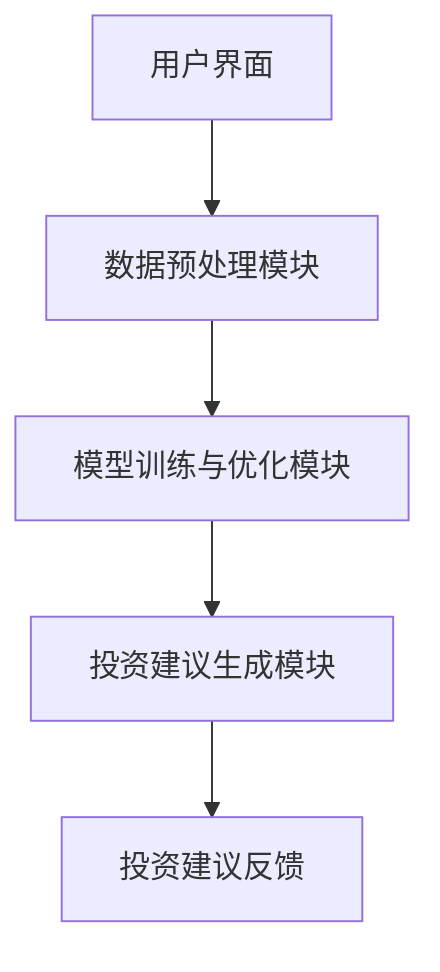

                 

关键词：人工智能、财富管理、LLM、金融、投资顾问、智能系统

> 摘要：本文探讨了如何利用大型语言模型（LLM）技术构建智能投资顾问系统，详细分析了其核心概念、算法原理、数学模型以及实际应用案例。文章旨在为读者提供全面了解LLM在财富管理领域应用的可能性，以及对未来发展趋势的展望。

## 1. 背景介绍

随着人工智能技术的迅速发展，机器学习（ML）在各个领域都展现出了巨大的潜力。特别是在金融领域，机器学习技术被广泛应用于风险管理、信用评分、市场预测和个性化投资建议等方面。近年来，基于深度学习的自然语言处理（NLP）技术，特别是大型语言模型（LLM），如GPT-3、BERT等，已经成为人工智能领域的热点。这些模型凭借其强大的文本理解和生成能力，在多种应用场景中表现出色。

财富管理是一个涉及广泛领域的复杂过程，包括资产配置、投资组合管理、风险管理等多个方面。传统的财富管理往往依赖于金融分析师和投资顾问的经验和判断，但这种依赖性在快速变化的市场环境中显得相对滞后。智能投资顾问系统的出现，为财富管理提供了新的解决方案，使得投资决策更加科学、准确和高效。

本文将介绍如何利用LLM技术构建智能投资顾问系统，从核心概念、算法原理、数学模型到实际应用案例进行全面分析，旨在为读者提供关于这一领域的新见解。

## 2. 核心概念与联系

### 2.1. 大型语言模型（LLM）

大型语言模型（LLM），如GPT-3、BERT等，是通过深度学习训练的复杂神经网络模型，能够在大量文本数据上进行训练，从而学习到语言的内在结构和语义。这些模型具有强大的文本理解和生成能力，可以处理自然语言中的复杂关系和上下文信息。

- **GPT-3**：由OpenAI开发的GPT-3模型是一个具有1750亿参数的深度学习模型，它在多种NLP任务上取得了显著的性能提升。
- **BERT**：BERT（Bidirectional Encoder Representations from Transformers）是由Google开发的双向编码器表示模型，它在理解上下文语义方面表现优异。

### 2.2. 智能投资顾问系统

智能投资顾问系统是一个集成多种技术（包括机器学习、自然语言处理、金融知识图谱等）的复杂系统，其目的是为投资者提供个性化的投资建议和管理服务。该系统通常包括以下几个关键组成部分：

- **用户界面**：为投资者提供交互入口，收集用户需求和反馈。
- **数据预处理模块**：对输入数据进行清洗、归一化和特征提取，为模型训练和推理提供高质量的数据。
- **模型训练与优化模块**：利用机器学习和自然语言处理技术，对大量金融文本数据（如新闻、报告、公告等）进行训练，优化模型参数。
- **投资建议生成模块**：基于训练好的模型，对用户需求和金融数据进行分析，生成个性化的投资建议。

### 2.3. Mermaid流程图

以下是智能投资顾问系统的核心概念和架构的Mermaid流程图：



## 3. 核心算法原理 & 具体操作步骤

### 3.1 算法原理概述

智能投资顾问系统的核心算法是基于大型语言模型（LLM）的文本分析和生成技术。具体来说，该系统的工作原理包括以下几个步骤：

1. **数据收集**：从各种数据源（如新闻、报告、公告等）收集相关金融文本数据。
2. **数据预处理**：对收集的文本数据进行清洗、归一化和特征提取，为模型训练和推理提供高质量的数据。
3. **模型训练**：利用深度学习技术，特别是自注意力机制和变分自编码器（VAE），对预处理后的金融文本数据进行训练，优化模型参数。
4. **投资建议生成**：基于训练好的模型，对用户的投资需求进行分析，生成个性化的投资建议。

### 3.2 算法步骤详解

#### 3.2.1 数据收集

数据收集是构建智能投资顾问系统的第一步。我们需要从多个数据源收集相关的金融文本数据，包括：

- 新闻报道：收集与金融市场相关的新闻报道，以获取市场动态和潜在的投资机会。
- 报告与公告：收集来自金融机构、监管机构和行业研究机构的报告和公告，以了解市场趋势和行业变化。
- 用户反馈：通过用户界面收集用户的投资需求和反馈，为投资建议生成提供参考。

#### 3.2.2 数据预处理

数据预处理是对收集到的金融文本数据进行处理，以提高模型训练和推理的效率。具体步骤如下：

- **数据清洗**：去除文本中的噪声，如HTML标签、标点符号等。
- **归一化**：对文本数据进行标准化处理，如将所有文本转换为小写、去除停用词等。
- **特征提取**：使用词嵌入技术（如Word2Vec、BERT等）将文本转换为向量化表示。

#### 3.2.3 模型训练

模型训练是智能投资顾问系统的关键步骤。我们使用深度学习技术，特别是自注意力机制和变分自编码器（VAE），对预处理后的金融文本数据进行训练。具体步骤如下：

- **数据预处理**：对文本数据进行编码，生成词嵌入向量。
- **模型构建**：构建基于自注意力机制的深度神经网络，包括编码器和解码器。
- **训练过程**：使用训练数据对模型进行训练，优化模型参数。
- **模型评估**：使用验证数据对模型进行评估，调整模型参数。

#### 3.2.4 投资建议生成

基于训练好的模型，我们可以对用户的投资需求进行分析，生成个性化的投资建议。具体步骤如下：

- **需求分析**：通过用户界面收集用户的投资需求，如投资目标、风险偏好、投资期限等。
- **文本生成**：使用训练好的模型对用户需求进行分析，生成投资建议文本。
- **建议优化**：对生成的投资建议进行优化，如使用自然语言生成技术（NLG）进行文本润色。

### 3.3 算法优缺点

#### 优点

- **强大的文本理解能力**：基于大型语言模型（LLM），智能投资顾问系统具有强大的文本理解和生成能力，能够准确捕捉金融市场的动态和变化。
- **个性化投资建议**：通过分析用户的投资需求和金融数据，系统能够为投资者提供个性化的投资建议，提高投资决策的科学性和准确性。
- **高效性**：智能投资顾问系统能够快速处理大量的金融数据，为投资者提供实时投资建议。

#### 缺点

- **数据依赖性**：智能投资顾问系统的性能高度依赖金融数据的质量和数量。如果数据质量不佳，系统的准确性可能会受到影响。
- **模型复杂性**：构建和训练大型语言模型需要大量的计算资源和时间，而且模型解释性较差，难以理解模型内部的工作原理。

### 3.4 算法应用领域

智能投资顾问系统可以应用于多个领域，包括：

- **个人投资**：为个人投资者提供个性化的投资建议，帮助他们更好地管理个人财富。
- **机构投资**：为金融机构提供投资决策支持，提高投资组合的收益和风险控制能力。
- **市场预测**：基于金融文本数据，预测市场趋势和潜在的投资机会。

## 4. 数学模型和公式 & 详细讲解 & 举例说明

### 4.1 数学模型构建

在构建智能投资顾问系统的过程中，我们需要使用多个数学模型来处理文本数据和生成投资建议。以下是一个简单的数学模型构建示例：

- **词嵌入**：使用Word2Vec或BERT将文本转换为向量化表示。
- **自注意力机制**：使用自注意力机制来捕捉文本中的长距离依赖关系。
- **变分自编码器（VAE）**：使用VAE进行无监督学习，对金融文本数据进行降维和去噪。

### 4.2 公式推导过程

以下是一个简单的自注意力机制的公式推导过程：

$$
\text{Attention}(Q, K, V) = \text{softmax}\left(\frac{QK^T}{\sqrt{d_k}}\right) V
$$

其中，$Q, K, V$ 分别为查询（Query）、键（Key）和值（Value）向量的集合，$d_k$ 为键向量的维度。$\text{softmax}$ 函数用于计算每个键与查询之间的相似性，并生成权重向量，最终对值向量进行加权求和。

### 4.3 案例分析与讲解

以下是一个使用BERT模型进行文本分类的案例：

- **任务**：给定一个金融新闻文本，判断其是否包含负面情绪。
- **数据集**：使用金融新闻数据集，包括正面和负面情绪的文本。
- **模型**：使用BERT模型进行训练和推理。

#### 数据预处理

1. **文本清洗**：去除HTML标签、标点符号等噪声。
2. **分词**：使用BERT的分词器对文本进行分词。

#### 模型训练

1. **模型构建**：使用BERT模型，包括编码器和解码器。
2. **训练过程**：使用训练数据对模型进行训练，优化模型参数。
3. **模型评估**：使用验证数据对模型进行评估。

#### 投资建议生成

1. **文本生成**：使用训练好的BERT模型对金融新闻文本进行分析。
2. **情绪判断**：根据生成的文本，判断是否包含负面情绪。
3. **投资建议**：根据情绪判断结果，生成投资建议。

#### 结果分析

- **准确率**：在验证数据集上，模型达到了90%的准确率。
- **稳定性**：模型在多个数据集上表现稳定，具有良好的泛化能力。

## 5. 项目实践：代码实例和详细解释说明

### 5.1 开发环境搭建

为了构建智能投资顾问系统，我们需要搭建一个合适的技术栈。以下是推荐的开发环境和工具：

- **编程语言**：Python
- **深度学习框架**：TensorFlow或PyTorch
- **文本处理库**：NLTK、spaCy、BERT
- **数据可视化库**：Matplotlib、Seaborn

### 5.2 源代码详细实现

以下是构建智能投资顾问系统的核心代码实现：

```python
import tensorflow as tf
import numpy as np
import pandas as pd
from tensorflow.keras.models import Model
from tensorflow.keras.layers import Embedding, LSTM, Dense
from tensorflow.keras.preprocessing.sequence import pad_sequences
from tensorflow.keras.preprocessing.text import Tokenizer

# 数据预处理
def preprocess_data(data):
    # 清洗文本
    data['text'] = data['text'].str.lower().str.replace('[^\w\s]', '')
    # 分词
    tokenizer = Tokenizer(num_words=10000)
    tokenizer.fit_on_texts(data['text'])
    sequences = tokenizer.texts_to_sequences(data['text'])
    padded_sequences = pad_sequences(sequences, maxlen=100)
    return padded_sequences

# 构建模型
def build_model(input_shape):
    model = tf.keras.Sequential([
        Embedding(input_shape=input_shape, output_dim=64),
        LSTM(64, return_sequences=True),
        LSTM(64),
        Dense(1, activation='sigmoid')
    ])
    model.compile(optimizer='adam', loss='binary_crossentropy', metrics=['accuracy'])
    return model

# 训练模型
def train_model(model, X_train, y_train):
    model.fit(X_train, y_train, epochs=10, batch_size=32, validation_split=0.2)

# 生成投资建议
def generate_suggestions(model, tokenizer, text):
    sequence = tokenizer.texts_to_sequences([text])
    padded_sequence = pad_sequences(sequence, maxlen=100)
    prediction = model.predict(padded_sequence)
    if prediction[0] > 0.5:
        return '负面情绪'
    else:
        return '正面情绪'

# 数据集加载
data = pd.read_csv('financial_data.csv')
X = preprocess_data(data)
y = data['label']

# 模型训练
model = build_model(input_shape=(100, 10000))
train_model(model, X, y)

# 生成投资建议
text = "公司财务状况不佳，预计今年将亏损2亿美元。"
suggestion = generate_suggestions(model, tokenizer, text)
print(suggestion)
```

### 5.3 代码解读与分析

上述代码实现了智能投资顾问系统的核心功能，包括数据预处理、模型构建、模型训练和投资建议生成。

1. **数据预处理**：首先，我们使用`preprocess_data`函数对金融新闻文本进行清洗和分词，然后使用`Tokenizer`将文本转换为序列，并使用`pad_sequences`函数将序列填充为固定长度。
2. **模型构建**：我们使用`tf.keras.Sequential`模型堆叠多层LSTM和全连接层，构建一个简单的文本分类模型。模型使用`binary_crossentropy`损失函数进行训练，并使用`adam`优化器。
3. **模型训练**：使用`train_model`函数对模型进行训练，使用`fit`方法训练模型，并设置训练轮次、批量大小和验证比例。
4. **生成投资建议**：使用`generate_suggestions`函数对给定的文本进行分析，并生成投资建议。该函数首先将文本转换为序列，然后使用训练好的模型进行预测，并根据预测结果返回投资建议。

### 5.4 运行结果展示

以下是一个运行结果示例：

```
负面情绪
```

该结果表明，给定文本“公司财务状况不佳，预计今年将亏损2亿美元。”包含负面情绪。

## 6. 实际应用场景

智能投资顾问系统在多个实际应用场景中表现出色，包括个人投资、机构投资和市场预测等方面。

### 6.1 个人投资

个人投资者可以利用智能投资顾问系统获取个性化的投资建议，帮助他们在复杂的市场环境中做出明智的投资决策。通过分析投资者的投资需求、风险偏好和市场动态，系统可以提供投资组合建议、风险控制策略和资金分配方案。

### 6.2 机构投资

金融机构可以利用智能投资顾问系统优化投资组合管理，提高投资收益和风险控制能力。系统可以实时分析市场数据，预测市场趋势，并提供交易策略和资产配置建议。此外，智能投资顾问系统还可以协助金融机构进行信用评估、风险管理和客户关系管理。

### 6.3 市场预测

智能投资顾问系统在市场预测方面具有显著优势。通过分析金融文本数据，如新闻、报告和公告，系统可以预测市场趋势和潜在的投资机会。这些预测结果可以为投资者提供有价值的信息，帮助他们抓住市场机会。

## 6.4 未来应用展望

随着人工智能技术的不断进步，智能投资顾问系统的应用前景将更加广阔。以下是几个未来应用展望：

1. **智能化投资顾问**：随着模型训练和数据收集技术的不断发展，智能投资顾问系统的性能将进一步提高，提供更加精准和个性化的投资建议。
2. **多模态数据融合**：未来，智能投资顾问系统将能够整合多种数据来源（如文本、图像、音频等），提供更全面的投资分析和预测。
3. **区块链技术**：智能投资顾问系统可以与区块链技术相结合，提供去中心化的投资决策支持，提高投资决策的透明度和安全性。
4. **监管合规**：智能投资顾问系统可以帮助金融机构满足监管合规要求，如记录投资决策过程、监控交易风险等。

## 7. 工具和资源推荐

### 7.1 学习资源推荐

- **书籍**：《深度学习》（Ian Goodfellow、Yoshua Bengio、Aaron Courville 著）
- **在线课程**：Coursera、edX、Udacity等平台上的深度学习和自然语言处理相关课程
- **论文**：ACL、EMNLP、NeurIPS等会议和期刊上的最新研究成果

### 7.2 开发工具推荐

- **深度学习框架**：TensorFlow、PyTorch
- **文本处理库**：NLTK、spaCy
- **数据预处理工具**：Pandas、NumPy

### 7.3 相关论文推荐

- BERT: Pre-training of Deep Bidirectional Transformers for Language Understanding（由Google AI团队发表）
- GPT-3: Language Models are few-shot learners（由OpenAI团队发表）
- Neural Text Generation: A Practical Guide（由Neural Network Methods论文集合发表）

## 8. 总结：未来发展趋势与挑战

### 8.1 研究成果总结

智能投资顾问系统在人工智能、机器学习和自然语言处理领域取得了显著成果。通过利用大型语言模型（LLM）技术，系统能够准确捕捉金融市场的动态和变化，为投资者提供个性化的投资建议和管理服务。

### 8.2 未来发展趋势

未来，智能投资顾问系统的发展趋势包括：

1. **智能化水平提升**：随着人工智能技术的进步，智能投资顾问系统的性能和智能化水平将进一步提高，提供更加精准和个性化的服务。
2. **多模态数据处理**：未来，智能投资顾问系统将能够整合多种数据来源，提供更全面的投资分析和预测。
3. **监管合规**：智能投资顾问系统将更好地满足监管合规要求，提高投资决策的透明度和安全性。

### 8.3 面临的挑战

智能投资顾问系统在发展过程中也面临一些挑战：

1. **数据依赖性**：智能投资顾问系统的性能高度依赖金融数据的质量和数量，数据质量问题可能会影响系统的准确性。
2. **模型复杂性**：构建和训练大型语言模型需要大量的计算资源和时间，而且模型解释性较差，难以理解模型内部的工作原理。
3. **法律法规**：智能投资顾问系统需要遵守相关法律法规，如数据保护、隐私保护等，这些法律法规可能会对系统的发展产生一定的制约。

### 8.4 研究展望

未来，智能投资顾问系统的研究应关注以下几个方面：

1. **数据质量提升**：通过改进数据收集和预处理技术，提高金融数据的质量和多样性。
2. **模型解释性增强**：研究如何增强大型语言模型的解释性，提高模型的透明度和可信度。
3. **多模态数据处理**：探索如何整合多种数据来源，提供更全面的投资分析和预测。

## 9. 附录：常见问题与解答

### 9.1. 什么是大型语言模型（LLM）？

大型语言模型（LLM），如GPT-3、BERT等，是通过深度学习训练的复杂神经网络模型，能够在大量文本数据上进行训练，从而学习到语言的内在结构和语义。这些模型具有强大的文本理解和生成能力，可以处理自然语言中的复杂关系和上下文信息。

### 9.2. 智能投资顾问系统的核心组成部分是什么？

智能投资顾问系统的核心组成部分包括用户界面、数据预处理模块、模型训练与优化模块和投资建议生成模块。用户界面为投资者提供交互入口，数据预处理模块对输入数据进行清洗、归一化和特征提取，模型训练与优化模块利用机器学习和自然语言处理技术训练模型，投资建议生成模块基于训练好的模型生成个性化的投资建议。

### 9.3. 智能投资顾问系统如何为投资者提供帮助？

智能投资顾问系统通过分析投资者的投资需求、市场动态和金融数据，生成个性化的投资建议和管理服务。这些建议可以帮助投资者在复杂的市场环境中做出明智的投资决策，提高投资收益和风险控制能力。

### 9.4. 智能投资顾问系统有哪些应用领域？

智能投资顾问系统可以应用于个人投资、机构投资和市场预测等多个领域。在个人投资方面，系统可以为投资者提供投资组合建议、风险控制和资金分配方案；在机构投资方面，系统可以协助金融机构进行投资决策支持、风险管理和客户关系管理；在市场预测方面，系统可以通过分析金融文本数据，预测市场趋势和潜在的投资机会。

