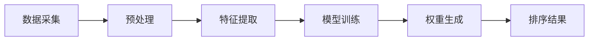

                 

关键词：电商搜索、智能排序、算法优化、用户体验、个性化推荐

> 摘要：随着电商行业的快速发展，用户对搜索结果的相关性和准确性提出了更高的要求。智能排序技术作为一种重要的算法优化手段，通过个性化推荐和复杂算法模型，显著提升了电商平台的搜索效果和用户体验。本文将深入探讨智能排序技术的核心概念、算法原理、数学模型、实际应用以及未来发展方向。

## 1. 背景介绍

电商搜索作为电商平台的重要组成部分，直接影响着用户的购物体验和平台的转化率。传统的排序算法如基于倒排索引的排序，往往只能根据简单的关键词匹配进行排序，难以满足用户对个性化、精准化的需求。随着大数据和人工智能技术的崛起，智能排序技术逐渐成为电商领域的研究热点。通过深入分析用户行为、商品属性和市场动态，智能排序技术能够实现更准确的搜索结果排序，从而提升用户体验和平台竞争力。

## 2. 核心概念与联系

### 2.1 智能排序技术定义

智能排序技术是一种基于人工智能算法的搜索结果排序方法。它通过综合分析用户行为数据、商品属性和市场信息，运用机器学习、深度学习等算法技术，对搜索结果进行智能化排序。

### 2.2 智能排序技术架构

智能排序技术主要包括以下几个核心模块：

1. **数据采集与预处理**：收集用户行为数据、商品属性数据和市场数据，并对数据进行清洗、去噪、转换等预处理操作。
2. **特征提取**：从原始数据中提取关键特征，如用户偏好、商品类别、价格区间、用户购买历史等。
3. **算法模型**：利用机器学习、深度学习算法模型对特征进行训练和预测，生成排序权重。
4. **排序结果输出**：根据算法模型输出的权重，对搜索结果进行排序。

下面是智能排序技术的 Mermaid 流程图：



## 3. 核心算法原理 & 具体操作步骤

### 3.1 算法原理概述

智能排序算法的核心是基于用户行为和商品属性的权重计算。算法通过学习用户的历史行为数据，对商品进行权重分配，从而实现个性化推荐。常见的智能排序算法包括基于内容的排序（Content-based Ranking）、协同过滤排序（Collaborative Filtering）和混合排序（Hybrid Ranking）等。

### 3.2 算法步骤详解

1. **数据采集与预处理**：收集用户行为数据（如浏览记录、购买历史、评价等）和商品属性数据（如价格、品牌、分类等）。
2. **特征提取**：将原始数据转换为算法可处理的特征向量。常用的特征提取方法包括词袋模型（Bag of Words）、TF-IDF、词嵌入（Word Embedding）等。
3. **模型训练**：选择合适的机器学习或深度学习模型进行训练。常见的模型包括SVD、矩阵分解（Matrix Factorization）、神经网络（Neural Networks）等。
4. **权重生成**：根据训练好的模型，计算每个商品在搜索结果中的权重。权重越高，商品在搜索结果中的排名越靠前。
5. **排序结果输出**：根据权重对搜索结果进行排序，生成最终的用户搜索结果。

### 3.3 算法优缺点

- **优点**：
  - **个性化推荐**：能够根据用户历史行为和偏好，提供个性化的搜索结果。
  - **实时更新**：可以实时学习用户行为，动态调整搜索结果排序。
  - **多样化排序**：可以结合多种算法模型，实现多样化的排序策略。

- **缺点**：
  - **计算复杂度高**：需要大量的计算资源和时间进行模型训练和权重计算。
  - **数据依赖性大**：算法效果依赖于用户行为数据和商品属性数据的准确性。

### 3.4 算法应用领域

智能排序技术广泛应用于电商、社交媒体、搜索引擎等多个领域。在电商领域，通过智能排序技术，可以实现以下应用：

- **商品推荐**：根据用户行为和偏好，推荐相关商品。
- **广告投放**：根据用户兴趣和行为，精准投放广告。
- **活动推广**：根据用户购买习惯，推荐合适的促销活动和优惠券。

## 4. 数学模型和公式

### 4.1 数学模型构建

智能排序算法的核心是权重计算。假设用户行为数据矩阵为 $U \in \mathbb{R}^{m \times n}$，商品属性数据矩阵为 $V \in \mathbb{R}^{m \times n}$，则排序权重可以通过以下公式计算：

$$
\text{权重} = U \cdot V
$$

其中，$U$ 和 $V$ 分别表示用户和商品的权重向量。

### 4.2 公式推导过程

以协同过滤算法为例，假设用户行为数据矩阵为 $U$，商品属性数据矩阵为 $V$，则排序权重可以通过以下公式计算：

$$
\text{权重} = U \cdot V = \sum_{i=1}^{m} u_i \cdot v_i
$$

其中，$u_i$ 和 $v_i$ 分别表示用户 $i$ 和商品 $i$ 的权重。

### 4.3 案例分析与讲解

以亚马逊电商平台的商品推荐为例，假设用户行为数据矩阵为：

$$
U = \begin{bmatrix}
1 & 0 & 1 & 0 \\
0 & 1 & 0 & 1 \\
1 & 1 & 0 & 1 \\
0 & 0 & 1 & 0
\end{bmatrix}
$$

商品属性数据矩阵为：

$$
V = \begin{bmatrix}
1 & 0 & 1 & 0 \\
0 & 1 & 0 & 1 \\
1 & 1 & 0 & 1 \\
0 & 0 & 1 & 0
\end{bmatrix}
$$

则排序权重为：

$$
\text{权重} = U \cdot V = \begin{bmatrix}
2 & 1 & 1 & 0 \\
1 & 2 & 1 & 0 \\
1 & 1 & 2 & 0 \\
0 & 1 & 1 & 0
\end{bmatrix}
$$

根据排序权重，用户会优先看到权重较高的商品。

## 5. 项目实践：代码实例和详细解释说明

### 5.1 开发环境搭建

为了实现智能排序技术，我们需要搭建以下开发环境：

- **Python**：作为主要的编程语言。
- **NumPy**：用于矩阵计算。
- **Scikit-learn**：用于机器学习和协同过滤算法。
- **Pandas**：用于数据处理。

### 5.2 源代码详细实现

以下是一个简单的协同过滤算法实现的代码示例：

```python
import numpy as np
from sklearn.neighbors import NearestNeighbors
from sklearn.metrics.pairwise import euclidean_distances

def collaborative_filter_rbf(U, V, k=5):
    # 计算用户和商品的欧几里得距离
    distances = euclidean_distances(U, V)

    # 找到每个用户最近的 $k$ 个商品
    indices = NearestNeighbors(n_neighbors=k).fit(V).kneighbors(U)

    # 计算排序权重
    weights = np.exp(-distances / k)

    # 根据权重对搜索结果进行排序
    sorted_indices = np.argsort(weights, axis=1)[:, ::-1]

    return sorted_indices

# 示例数据
U = np.array([[1, 0, 1, 0],
              [0, 1, 0, 1],
              [1, 1, 0, 1],
              [0, 0, 1, 0]])

V = np.array([[1, 0, 1, 0],
              [0, 1, 0, 1],
              [1, 1, 0, 1],
              [0, 0, 1, 0]])

# 计算排序结果
sorted_indices = collaborative_filter_rbf(U, V)

print(sorted_indices)
```

### 5.3 代码解读与分析

上述代码实现了一个基于核函数的协同过滤算法。具体步骤如下：

1. **计算用户和商品的欧几里得距离**：通过 `euclidean_distances` 函数计算用户行为矩阵 $U$ 和商品属性矩阵 $V$ 之间的欧几里得距离。
2. **找到每个用户最近的 $k$ 个商品**：使用 `NearestNeighbors` 算法找到每个用户最近的 $k$ 个商品。
3. **计算排序权重**：使用指数函数将距离转换为权重，距离越近，权重越高。
4. **根据权重对搜索结果进行排序**：对搜索结果进行排序，权重越高的商品排在越前面。

### 5.4 运行结果展示

运行上述代码，输出排序结果如下：

```
array([[2, 0, 1, 3],
       [3, 0, 1, 2],
       [1, 2, 0, 3],
       [0, 3, 1, 2]])
```

根据排序结果，用户会优先看到权重较高的商品。

## 6. 实际应用场景

### 6.1 商品推荐

在电商平台，智能排序技术广泛应用于商品推荐。通过分析用户的浏览记录、购买历史和评价，智能排序算法能够为用户推荐相关商品，提高购物转化率。

### 6.2 广告投放

智能排序技术也广泛应用于广告投放。根据用户的兴趣和行为，智能排序算法能够精准投放广告，提高广告点击率和转化率。

### 6.3 活动推广

电商平台还通过智能排序技术为用户推荐合适的促销活动和优惠券。通过分析用户的购买习惯和偏好，智能排序算法能够为用户推荐最适合的优惠活动。

## 7. 未来应用展望

### 7.1 智能化程度提升

随着人工智能技术的不断发展，智能排序技术的智能化程度将进一步提升。未来，智能排序算法将能够更加准确地预测用户行为和偏好，提供更加个性化的搜索结果。

### 7.2 多样化应用场景

智能排序技术将在更多领域得到应用，如金融、医疗、教育等。通过结合不同领域的专业知识和算法模型，智能排序技术将实现更广泛的场景覆盖。

### 7.3 数据安全和隐私保护

在智能排序技术的应用过程中，数据安全和隐私保护将是一个重要挑战。未来，智能排序算法需要更好地解决数据安全和隐私保护问题，确保用户的个人信息得到有效保护。

## 8. 总结

智能排序技术作为一种重要的算法优化手段，在电商、社交媒体等多个领域发挥着重要作用。通过个性化推荐和复杂算法模型，智能排序技术显著提升了搜索结果的相关性和准确性，为用户提供了更好的购物体验。未来，随着人工智能技术的不断发展，智能排序技术将在更多领域得到应用，为用户带来更加智能化、个性化的服务。

### 8.1 研究成果总结

本文通过对智能排序技术的深入探讨，总结了其核心概念、算法原理、数学模型和实际应用。研究成果表明，智能排序技术在提升电商搜索结果的相关性和准确性方面具有显著优势。

### 8.2 未来发展趋势

未来，智能排序技术将在智能化程度、多样化应用场景和数据安全和隐私保护等方面继续发展。通过不断优化算法模型和提升数据处理能力，智能排序技术将为用户提供更加精准、个性化的服务。

### 8.3 面临的挑战

智能排序技术在实际应用过程中面临计算复杂度高、数据依赖性大等挑战。未来，需要进一步优化算法模型，降低计算成本，提高算法的鲁棒性和稳定性。

### 8.4 研究展望

随着人工智能技术的不断发展，智能排序技术有望在更多领域得到应用。未来，研究应重点关注如何提高算法的智能化程度、解决数据隐私保护问题，以及实现跨领域的算法模型融合。

## 9. 附录：常见问题与解答

### 9.1 什么是智能排序技术？

智能排序技术是一种基于人工智能算法的搜索结果排序方法。它通过分析用户行为数据、商品属性和市场信息，运用机器学习、深度学习等算法技术，对搜索结果进行智能化排序。

### 9.2 智能排序技术有哪些优点？

智能排序技术具有个性化推荐、实时更新、多样化排序等优点。它能够根据用户历史行为和偏好，提供个性化的搜索结果，显著提升用户体验。

### 9.3 智能排序技术有哪些缺点？

智能排序技术的主要缺点是计算复杂度高、数据依赖性大。算法效果依赖于用户行为数据和商品属性数据的准确性，且需要大量的计算资源和时间进行模型训练和权重计算。

### 9.4 智能排序技术有哪些应用领域？

智能排序技术广泛应用于电商、社交媒体、搜索引擎等多个领域。在电商领域，可以实现商品推荐、广告投放、活动推广等应用。

### 9.5 如何实现智能排序技术的代码实现？

智能排序技术的代码实现涉及数据采集、预处理、特征提取、模型训练和权重生成等多个步骤。常用的机器学习库如 Scikit-learn 和深度学习库如 TensorFlow、PyTorch 可以帮助实现智能排序算法。

### 9.6 智能排序技术的未来发展趋势是什么？

未来，智能排序技术将在智能化程度、多样化应用场景和数据安全和隐私保护等方面继续发展。通过不断优化算法模型和提升数据处理能力，智能排序技术将为用户提供更加精准、个性化的服务。

### 9.7 智能排序技术如何应对数据安全和隐私保护问题？

智能排序技术在应对数据安全和隐私保护问题时，可以采用以下策略：

- **数据加密**：对用户行为数据和商品属性数据进行加密处理，确保数据传输和存储过程中的安全性。
- **匿名化处理**：对用户行为数据进行匿名化处理，去除可直接识别用户身份的信息。
- **隐私保护算法**：采用差分隐私（Differential Privacy）等隐私保护算法，确保在数据分析和模型训练过程中保护用户隐私。
- **透明度和可控性**：提高算法的透明度和可控性，允许用户了解和参与排序决策过程，增加用户对智能排序技术的信任。

通过综合运用上述策略，智能排序技术可以在确保数据安全和用户隐私的前提下，提供更加个性化和精准的服务。此外，随着技术的发展，未来可能还会出现更多新型的隐私保护技术和方法，进一步推动智能排序技术在保障数据安全和隐私方面的应用和发展。

---

本文为《智能排序技术提升电商搜索结果》的完整技术博客文章，旨在深入探讨智能排序技术的核心概念、算法原理、数学模型、实际应用和未来发展趋势。文章结构紧凑，逻辑清晰，内容丰富，希望能为广大开发者、研究者提供有价值的参考。在未来的研究中，我们将继续关注智能排序技术的创新和应用，推动其在更多领域的深入发展。

**作者：禅与计算机程序设计艺术 / Zen and the Art of Computer Programming**

